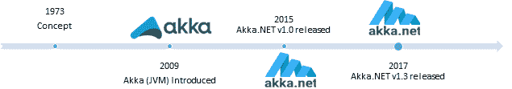

# 第一章引言

数百万人正在访问各种互联网服务。我们生活在一个需要高度响应的应用程序和强大的 T2 应用程序来满足用户需求的时代。典型的用户受到大量信息的影响，由于互联网上各种服务的激增，用户的注意力跨度很短，几秒钟没有反应的系统可能意味着[一件商品不会被出售](https://blog.gigaspaces.com/amazon-found-every-100ms-of-latency-cost-them-1-in-sales/)，或者一篇博客文章不会被阅读。

同时，当前的技术允许我们拥有互联系统、服务器网格、数据中心、云基础设施和多核机器。中央处理器、图形处理器、内存和硬盘空间成本的计算能力大幅下降。这实际上实现了物联网、在线数据流、大数据、机器学习和人工智能等的处理。

当构建应用程序时，与过去相比，我们现在可以有效地专注于以不同的方式制作系统。今天，我们可以有效地利用资源，共同工作，构成一个单一的应用平台。这显然带来了许多新的机会，也带来了一些挑战——因为通常没有什么是“免费”的。

我们生活在一个充满科技进步带来的机遇的新世界。让我们看一看非常高水平的技术发展，以更好地了解正在发生的事情:

表 1:技术发展

| **过去** | **当前** |
| 一台服务器 | 多个服务器、云系统 |
| 很少用户 | 有时数百万(并发)用户 |
| 一个中央处理器核心 | 多个中央处理器内核 |
| 非常有限的内存 | 潜在的几乎无限和廉价的内存 |
| 硬盘空间非常有限 | 潜在的无限和廉价的硬盘空间 |
| 缓慢而昂贵的网络 | 快速廉价的可扩展网络 |
| 几兆字节的数据 | 大数据集、大数据管理 |

一切变得**更大****分布式****并行化**！

虽然有几种方法可以实现多线程、并发、可扩展和分布式系统，但是 actor 模型范式最近才(重新)出现。正如我们将要看到的，这不是一个新的方法，但肯定是一个值得探索的好方法。这本书完全致力于 Akka.NET，一个专为 Microsoft.NET 写的演员模型框架。

## 演员模型和 Akka 实现简史

让我们从头开始。如果你对演员模型非常陌生，你可能会惊讶于它不是一个新概念——它起源于 1973 年，由计算机科学家卡尔·休伊特、彼得·毕晓普和理查德·施泰格提出。这个概念已经在一份名为《人工智能的通用模块化行为者形式主义》的出版物中得到体现。"

本文提出了一种人工智能的模块化参与者架构和定义方法，它在概念上基于一种单一的对象:*参与者*(或者，如果你愿意，虚拟处理器、激活帧或流)。参与者模型本身是基于并发计算的数学模型。

快进到现在:Akka.NET 框架是一个行动者模型的实现。2014 年由[亚伦·斯坦纳德](http://www.aaronstannard.com)和[罗杰·阿尔辛](http://rogeralsing.com)推出。Akka.NET 本身就是早在 2009 年引入的 Java/Scala [Akka 框架](http://akka.io)的一个港口。

图 1:演员模型简史

Akka.NET 是一个社区驱动的港口，不隶属于 Lightbend 公司，该公司制作了最初的 Java/Scala 版本。《Akka.NET》的第一版于 2015 年发布。最新版本(1.3)是。NET 核心兼容。

## 演员模式解构

用演员模型编程不仅仅是关于 Akka.NET，这只是它的一个实现。

还有一些其他的编程语言，比如[二郎](http://www.erlang.org/)、[仙丹](http://elixir-lang.org/)、[小马](https://www.ponylang.org/)和 [Scala](http://www.scala-lang.org/) ，都是围绕着演员模型的思想来写的，除了这些之外，还有相当多的框架可供使用。

仅微软最近就做出了相当大的贡献，实现了两个框架， [Microsoft Orleans](https://dotnet.github.io/orleans/) 和 [Service Fabric](https://docs.microsoft.com/en-us/azure/service-fabric/service-fabric-reliable-actors-introduction) ，并且支持微软 Azure 上的演员。另一方面，Akka.NET 的创作者之一的演员模型的另一个实现是[原型。Actor](http://proto.actor) ，支持多平台(。NET、Go、JavaScript 和 Kotlin)。

我们可以说，演员模型更像是一个编程范例，而不是一套工具。

要实现参与者模型，需要遵循一些基本规则:

*   Actor 包含所有计算。
*   演员只能通过信息交流。
*   演员可以改变自己的状态或行为。
*   演员可以给其他演员发消息。
*   演员可以创造有限数量的子演员。

Akka.NET 完全遵守这些规则。

Akka.NET 简化了可扩展、并发、高吞吐量和低延迟系统的构建。让我们看看 Akka.NET 让软件开发人员的生活变得更轻松的一些方法。

### 无手动线程管理

任何参与编写多线程系统的人都知道编写、调试和测试应用程序有多困难。有了 Akka.NET，我们现在可以安全地依赖框架来处理多线程能力，并确保代码是线程安全的。

### 高抽象层次

Akka.NET 提供了一个更高层次的抽象，这使得系统中的一切都被认为是一个*行动者*。框架本身是建立在通过消息传递实现参与者之间的通信的基础上的。

从表面上看，参与者看起来很像面向对象编程(OOP)中的对象。如果我们仔细想想，OOP 首先是关于消息传递和抽象的。演员模型是关于独立演员维护状态和互相传递信息。这听起来很相似，对吧？

传统的面向对象语言(C#、Java 等)。)的设计并没有将并发性作为一流的用例。虽然它们确实支持产生多线程的能力，但是任何使用过这些语言进行多线程编程的人都知道引入竞争条件是多么容易(例如，数据不同步或损坏)。从这个角度来看，当涉及到线程管理和内存访问时，比较这两种范例会非常有用:

*参与者遵循的是**无共享**哲学，而典型的 OOP 语言并不是真正围绕并行构建的。*

在 actor 模型中，没有竞争条件，这导致代码更简单。演员的无共享哲学也意味着演员不必生活在同一台机器上——我们可以在不同的节点上产生演员，让他们“本地”合作。

图 2:面向对象和角色模型多线程方法的比较

### 扩大规模

因为 Akka.NET 框架正在为我们管理并发性，所以我们能够扩展应用程序运行的服务器。通过添加额外的 CPU，系统可以有效地使用这些共享资源，而无需我们编写任何额外的代码。

### 横向扩展

如前所述，由于其不分享理念，Akka.NET 框架也在有效地帮助扩大规模。通过添加额外的节点，同样无需我们编写任何特定的实现，并且只需通过一些配置，应用程序就可以有效地使用这些资源。这是一个巨大的胜利，因为我们可以专注于向客户交付价值，而不是编写支持分布式协作的基础架构代码。

### 容错和故障处理

Akka.NET 提供了一种处理失败的方法。与组件的每个消费者都需要处理组件故障的经典同步模型不同，Akka.NET 和异步模型将故障定向到专用的故障处理程序。这带来了一种非常可控的传播错误的方式。

### 共同框架

所有上述特性使 Akka.NET 成为一个拥有大量功能的框架。将所有这些都放在一个地方可以使团队更容易在一个框架中处理各种复杂的方面，并且使学习比必须掌握几种技术才能达到相同的结果更容易。

## 去哪里用 Akka.NET？

Akka.NET 及其行动者模型框架适用于所有场景:

*   **交易应用**:金融、统计、社交媒体、电信等。
*   **批处理**:演员之间可以分工。
*   **服务:** REST、SOAP 以及聊天或实时通知等一般通信服务。

谈到 Microsoft.NET 框架，我们可以用各种可以想象的方式实际使用该框架:

*   作为服务应用(WCF、ASP.NET Web API 等)中的应用后端。).
*   作为 WPF 或 Windows 窗体中的应用程序前端，用于将消息路由到底层的 Akka.NET 后端(或类似后端)。
*   在 ASP.NET MVC 和 web Forms 上的 Web 应用程序中，使用的方式与前面提到的类似。
*   来处理各种消息。
*   在控制台应用中。

## 反应宣言

Akka.NET 坚持[反应宣言](http://www.reactivemanifesto.org)定义的原则。《反应宣言》提出了系统架构的一致方法，以构建更健壮、更有弹性、更灵活、更能满足现代需求的系统。

图 3:反应宣言

如图 3 所示，反应宣言敦促系统具有以下特征。

### 反应灵敏

该系统响应及时，它侧重于提供快速和一致的响应时间，以便服务质量保持不变。这种系统的好处是简化了错误处理，满足了用户的期望，并鼓励进一步的交互。

### 有韧性

总的来说，“弹性是在逆境中提供所需能力的能力”，正如国际系统工程理事会所定义的，用软件工程的术语来说，这意味着系统在面对失败时保持响应。有几种解决方案可以帮助系统保持弹性，例如复制、遏制、隔离和委派。这些都是在如何在不影响整个系统的情况下处理故障，以及如何从故障中成功恢复的背景下进行的。

### 弹性

弹性系统能够通过以自主方式调配和取消调配资源来适应工作负载的变化，从而在每个时间点，可用资源尽可能与当前需求相匹配。这意味着设计没有争用点或中心瓶颈，从而能够分割或复制组件并在它们之间分配输入。

### 消息驱动

反应式系统依赖异步消息传递，以确保组件之间的松散耦合、隔离和位置透明。反过来，系统可以更容易地适应(以便变得有弹性)。另一个重要的方面是组件的位置透明性，它假设调用者不应该担心目标的物理位置。

## 结论

这一章是关于行动者模式的理论方面，它的历史，以及一个反应系统的各个方面。虽然整本书可以写对其中一些主题的想法是给一些基本信息和上下文这本书是关于什么。