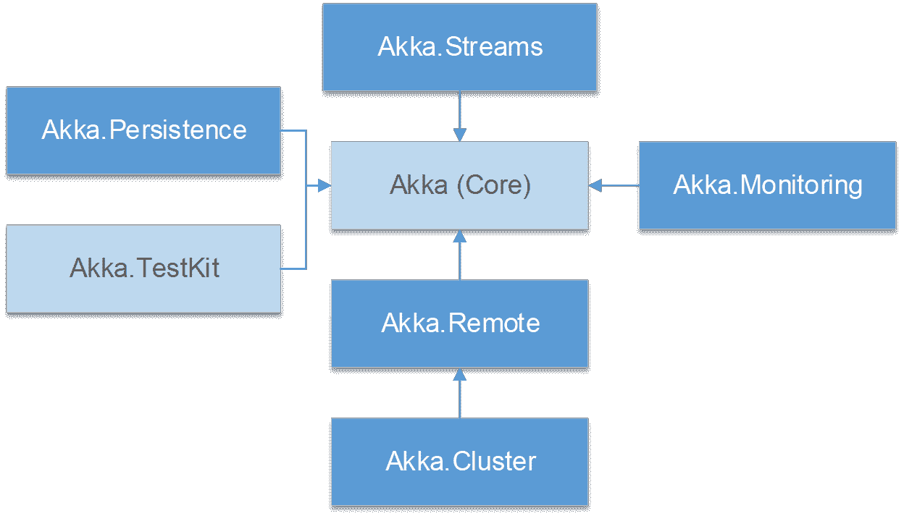

# 二、Akka.NET 组件

在本章中，我们将列出 Akka.NET 的主要建筑材料。这包括框架使用的库(模块)和一些关键概念。

为了编写任何应用，我们必须依赖于 Akka.NET 框架。Akka.NET 是一套非常模块化的库，它包含了非常广泛的功能。所有的库都可以通过 NuGet 获得，我们将在后面看到。

`Akka(Core)`、`Akka.Remote`和`Akka.TestKit`的一部分，其他部分在本书中不再讨论；然而，了解他们还是很好的。



图 4:Akka.NET 组件

### 阿卡(核心)库

如图 4 所示，Akka.NET 核心库是所有其他组件所依赖的基础库。

它包含参与者的定义、默认的对象序列化机制、路由规则、人为优化的配置对象符号( [HOCON](https://en.wikipedia.org/wiki/HOCON) )配置规则、消息调度机制等等。为了使用 Akka.NET，我们必须依赖这个图书馆。

可以在 Visual Studio 包管理器中运行以下命令来引用 Visual Studio 中的 Akka 基础库:

代码清单 3:通过 Visual Studio 中的包管理器安装 Akka.NET

```cs
  PM>
  Install-Package Akka 

```

### Akka .测试它

`Akka.TestKit`是一个基础库，具有允许有效测试参与者系统的构建块。`Akka.TestKit`定义核心库，每个单元测试框架都将实现翻译单元测试引擎特定需求所需的管道。

我们将在第 11 章讨论单元测试。

### 阿卡。遥远的

`Akka.Remote`带来了通过计算机网络跨多个进程构建`ActorSystem`的能力。Akka.NET 支持远程部署的参与者(生活在不同的服务器上)之间的通信，其最大的优势是编程模型隐藏了这种复杂性。从编程角度来看，通信与本地通信和远程通信没有区别，因为代码看起来完全一样。通常`Akka.Remote`包不是孤立使用的，而是作为集群能力的构建模块。

远程处理支持以下功能:

*   引用远程主机上的(单个)参与者或参与者系统。
*   两个参与者系统(本地和远程)之间的消息传递。这包括管理网络(重新)连接的低级方面。

要在 Visual Studio 中引用该库，可以在 Visual Studio 包管理器中运行以下命令:

代码清单 4:安装 Akka。通过 Visual Studio 中的包管理器进行远程

```cs
  PM>
  Install-Package Akka.Remote

```

`Akka.Remote`的安装将自动包含对 Akka(核心)库和 [`DotNetty`](https://github.com/Azure/DotNetty) (一个事件驱动的异步网络应用框架)的引用，作为传输机制。

### 阿卡。串

虽然`Akka.Remoting`解决了远程系统上组件的寻址和通信问题，但是集群提供了将多个`ActorSystems`组织为“单个单元”的能力，这使得系统本身的*可扩展性*和*高* *可用性*成为可能。

群集在远程处理的基础上提供附加服务，例如:

*   处理远程系统，以便它们能够以可靠的方式相互通信。
*   处理服务器设置的变化:新的集群成员，服务器的删除(故障)等。
*   检测暂时无法连接的断开系统。
*   在成员之间分配计算(横向扩展)。

要在 Visual Studio 中引用该库，可以在 Visual Studio 包管理器中运行以下命令:

代码清单 5:安装 Akka。通过 Visual Studio 中的包管理器集群包

```cs
  PM>
  Install-Package Akka.Cluster

```

`Akka.Cluster`的安装将自动包括对`Akka`(核心)库、`DotNetty`和`Akka.Remote`的引用。

### 阿卡。流

有时候，当涉及到处理一个数据流(无限制)时，演员并不是最合适的工具。从这个意义上说，`Akka.Streams`建立在演员之上，提供了更高层次的抽象。`Akka.Streams`也是[反应流](http://www.reactive-streams.org)标准的实现。

流实现以下功能:

*   处理事件流或大型数据集，保持性能和资源的正确使用。
*   灵活的管道，以便重用功能。
*   支持使用其他第三类库的反应流兼容接口。

要引用 Visual Studio 解决方案中的库，请在 Visual Studio 包管理器中运行以下命令:

代码清单 6:安装 Akka。通过 Visual Studio 中的包管理器流式传输

```cs
  PM>
  Install-Package Akka.Streams

```

`Akka.Streams`的安装将自动包含对`Akka`(核心)库和`Reactive.Streams` [库](https://github.com/reactive-streams/reactive-streams-dotnet)的引用。

### 阿卡。坚持

持久性提供了一种使参与者能够保持其当前状态的方法。有几个库可以实现将数据持久化到各种系统，例如微软的 SQL Server、MySql 和 Redis。

持久性解决了以下问题:

*   如何在系统重启或崩溃时恢复实体/参与者的状态？
*   按照 [CQRS](https://en.wikipedia.org/wiki/Command%E2%80%93query_separation#Command_query_responsibility_segregation) / [事件源](https://martinfowler.com/eaaDev/EventSourcing.html)模式实施系统。
*   可靠的信息传递。

要在 Visual Studio 中引用该库，请在 Visual Studio 包管理器中运行以下命令:

代码清单 7:安装 Akka。在 Visual Studio 中通过包管理器实现持久性

```cs
  PM>
  Install-Package Akka.Persistence

```

此外，对于给定的数据库系统，还有许多其他具有特定实现的包:

代码清单 8:安装 Akka。通过 Visual Studio 中的包管理器持久性包

```cs
  PM>
  Install-Package Akka.Persistence.SqlServer
  PM> Install-Package Akka.Persistence.PosgreeSql
  PM> Install-Package Akka.Persistence.SqlLite
  PM> Install-Package Akka.Persistence.MySql

```