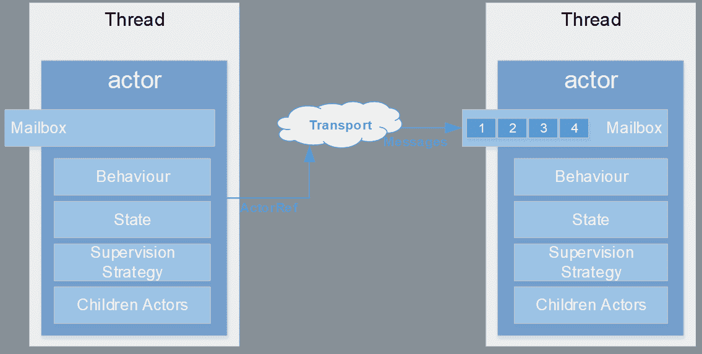
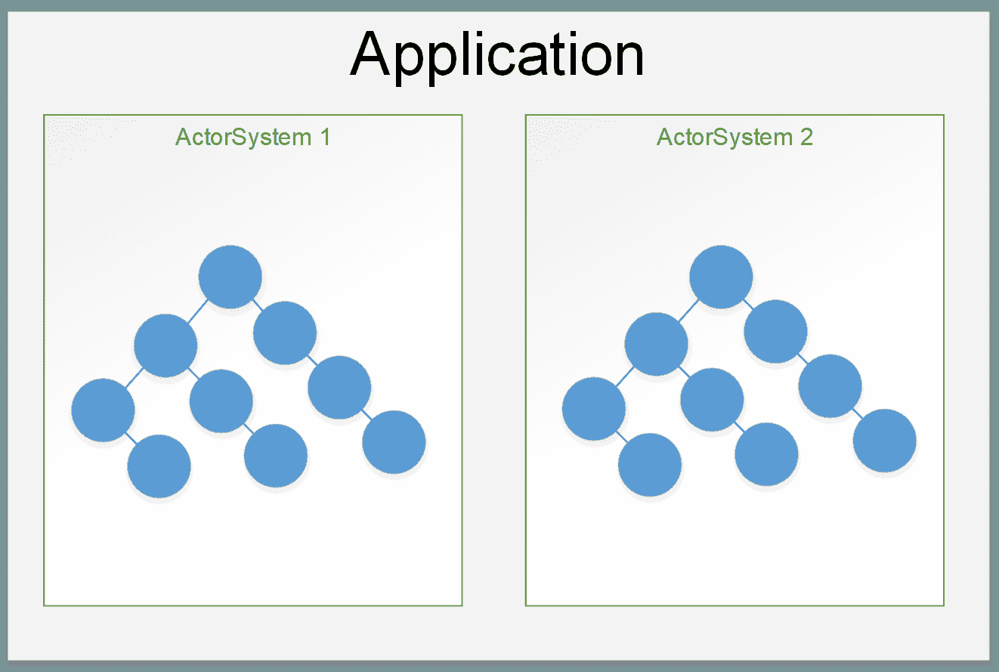

# 第三章演员介绍

## 演员

我们已经多次提到演员的存在，这是 Akka.NET 最基本的特征和主要组成部分之一。演员封装对象的*行为*和*状态，*并通过交换消息与其他演员通信。参与者的每个实例都有自己的`MailBox`，消息将由参与者一个接一个地排队并连续处理，同时考虑消息的顺序。

通过使用参与者，我们可以对并发性和并行性进行简单的高级抽象。这是因为每当一个参与者处理一条消息时，这可能会发生在另一个线程上。

|  | 提示:为了更好地形象化演员的想法，让我们把演员想象成一个真实的人。这个人可以将工作分配(委托)给其他人，或者只是无法处理某些消息。 |

演员是围绕一个*层级*结构构建和组织的，以便将任务分成更小和更易管理的部分。如果我们仔细想想，这与面向对象编程非常相似，在面向对象编程中，我们有类和函数，以便将一些较大的逻辑拆分或组织成较小的构建块子集。这也意味着演员能够*创建*和*监督*子角色并控制他们的生命周期:创建和终止。这也暗示着每个演员只有一个*主管。*

图 5:演员通过消息传递的交流

### 演员生命周期

每个参与者都有自己的生命周期，它存在于参与者被创建、运行和终止的时刻。即使创建一个演员的新实例在内存和处理方面相对便宜，也应该对演员的生活进行适当的处理。

## 演员系统

`ActorSystem`职责之一是管理资源以便*经营*演员。`ActorSystem`是一组共享公共配置的分层参与者，例如调度程序、部署、线程池、远程功能和地址。演员不能存在于`ActorSystem`之外；因此，我们也可以说一个`ActorSystem`就是一个容器或者是一大堆演员。

创建一个`ActorSystem`并不便宜，它通常每个应用程序只创建一次，即使多个系统可以在同一应用程序上运行。NET 运行时。一旦它启动并运行，它通常会在应用程序的整个生命周期中一直存在，或者至少在不需要它(终止)之前一直存在。在这种情况下，不同的参与者系统不会有任何共同点，而是会生活在不同的内存空间、线程等中。

图 6:一个应用程序中的多个参与者系统

一`ActorSystem`处理以下几个方面:

*   创建和分配线程，以便参与者可以使用底层线程。
*   承载配置。

## 演员参考

如前所述，行动者有状态、行为、邮箱、子行动者和监督策略。所有这些都封装在一个*演员引用*后面。

在执行元系统中，执行元由执行元引用来引用，执行元引用就像指向执行元实例的指针。参与者引用使参与者能够引用另一个参与者(发送消息)；然而，这与参与者本身的实际状态(生命周期)无关。移除对某个参与者的引用并不会“摧毁”该参与者，反之亦然。

另一方面，actor 引用使得所谓的 actor 位置透明成为可能，这意味着一个 actor 可以部署在远程系统上，但是从 actor-reference 的角度来看(客户端调用 actor)，编程模型没有任何变化。

电话是解释位置透明度的一个很好的例子:我们有(一个人的)电话号码，所以发送短信或打电话总是可能的，无论对方在哪里。

参与者引用可以作为变量传递。通过参与者引用的参与者总是能够访问子参与者、自我、发送者及其父参与者。