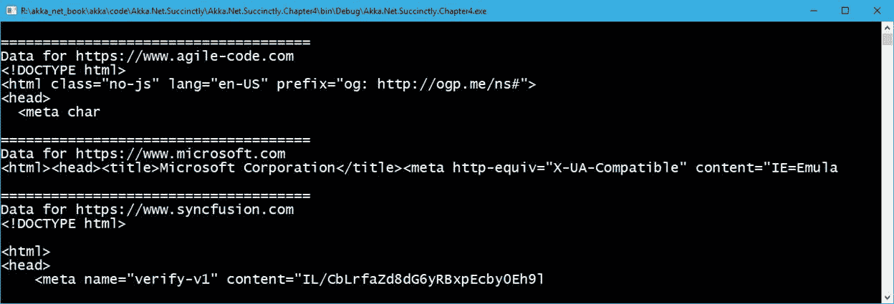
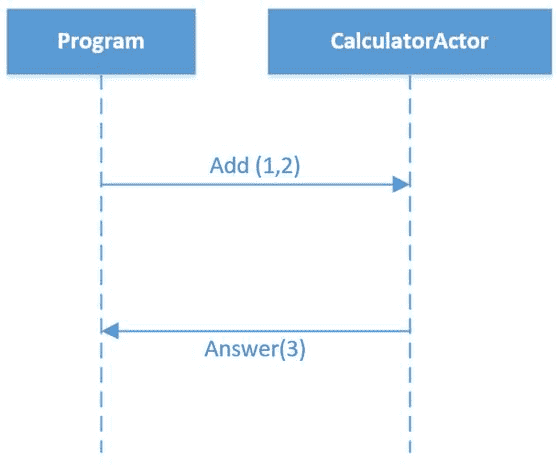

# 第四章与演员合作

在前三章中，我们提到了一些基本的构建模块以及关于演员模型编程和 Akka.NET 的理论。在这一章中，我们将最终开始实现提到的概念，从非常简单的方面开始，并最终构建一个实时系统。

## 演员类型

Akka.NET 提供两种演员基础类型:`ReceiveActor`和`UntypedActor`。正如我们将要看到的，两者之间的区别在于接收消息的签名。一个是强类型的，而另一个不是。其中一个的用法很可能取决于用例和对传入消息类型的处理。

Akka.NET 的一个 actor 被实现为继承自上述基类型之一的类。

### 编者

如代码清单 9 所示，实现一个参与者非常简单。在`UntypedActor`的情况下，我们必须覆盖`OnReceive`方法(请注意`OnReceive`方法接受通用的`object`)。`OnReceive`方法将是发送给参与者的所有消息的入口点，并且该方法的实现应该处理所有预期的消息类型。

代码清单 9:非 typedActor 声明

```cs
  public class MyUntypedActor : UntypedActor
  {
      protected override void OnReceive(object message)
      {
          /* some code goes here */
      }
  }

```

### 接收演员

另一方面，`ReceiveActor`的结构有点不同。不再有`OnReceive`方法可以被覆盖，消息处理程序的映射直接在参与者的构造函数中完成。映射是通过许多`Receive`方法中的一种来完成的，我们必须指定类型和实际的处理程序。

代码清单 10: ReceiveActor 示例

```cs
  public class MyTypedActor : ReceiveActor
  {
      public MyTypedActor()
      {
          /* some code goes here */
      }
  }

```

## 执行元实例化

创建`actor`的新实例只能通过`ActorSystem`完成。`ActorSystem`提供两种方法:`ActorOf`和`ActorOf<T>`，负责演员的创作。

为了被识别，一个`ActorSystem`必须有一个名字。这主要是为了确保演员的位置，我们将在后面看到。在我们这里，`ActorSystem`的名字是`my-first-akka`。该名称可以是任何字符串。

通过使用通用版本的`ActorOf`方法，我们只能指定演员的名字。该名称是可选的，如果没有指定，系统会自动分配一个。通常给出的名字是以“`$a`”、“`$b`”等形式出现的。

代码清单 11:使用通用 Actor off<t>通过 ActorSystem 创建一个 Actor</t>

```cs
  static void
  Main(string[] args)
  {
      ActorSystem system = ActorSystem.Create("my-first-akka");

      IActorRef typedActor = system.ActorOf<MyTypedActor>();
      IActorRef untypedActor = system.ActorOf<MyUntypedActor>();
  }

```

|  | 注意:两个 IActorRef 对象:typedActor 和 untypedActor，都是 Actor 引用，通过它们我们可以和 Actor 进行通信。 |

`ActorOf`通用版本的替代方案是使用非通用版本，它接受不同的参数:我们必须提供一个类型为`Props`的参数。`Props`是为演员创作指定`options`的配置类。通过使用`Props`，我们可以定义一个`SupervisionStrategy`，通过它的构造器属性创建一个参与者，或者为它指定一个`Factory`。让我们看一个在创建我们之前定义的演员时使用`Props`的例子。

代码清单 12:使用道具实例化演员

```cs
  static void
  Main(string[] args)
  {
      ActorSystem system = ActorSystem.Create("my-first-akka");

      Props typedActorProps = Akka.Actor.Props.Create<MyTypedActor>();
      Props untypedActorProps = Akka.Actor.Props.Create<MyUntypedActor>();

      IActorRef typedActor =
  system.ActorOf(typedActorProps);
      IActorRef untypedActor =
  system.ActorOf(untypedActorProps);
  }

```

有几种使用`Props`的方式，我们可以在下面的代码片段中看到。

代码清单 13:使用 Create 方法的各种方法

```cs
  Props props1 = Props.Create(typeof(MyTypedActor));
  Props props2 = Props.Create(() => new MyTypedActor("arg"));
  Props props3 = Props.Create<MyTypedActor>();
  Props props4 = Props.Create(typeof(MyTypedActor), "arg");

```

## 接收演员施工

在这本书里，为了简单起见，我们只使用`ReceiveActor`作为首选项。在本节中，我们将了解`ReceiveActor`提供的各种方法，并将对这些方法进行扩展。

消息处理程序的配置总是发生在参与者的构造函数中。因此，您通常会编写类似以下内容的代码:

代码清单 14:处理程序消息方法在构造函数中声明

```cs
  public class MyTypedActor : ReceiveActor
  {
      public MyTypedActor()
      {
          Receive<GreetingMessage>(message =>
  GreetingMessageHandler(message));
          Receive<string>(message =>
  GreetingMessageHandler(message));
      }
  }

  public class GreetingMessage
  {
      public GreetingMessage(string
  greeting)
      {
          Greeting =
  greeting;
      }

      public string Greeting { get; private set;}
  }

```

我们使用一个参与者的构造函数来定义它接受哪些消息类型(在我们的例子中是`GreetingMessage`和`string`)。

`Receive`方法是在基类(`ReceiveActor`)中定义的，它为参与者接收的特定类型的消息注册一个处理程序(方法)。

值得指出的是，有几种`Receive`方法可用，如`Receive`、`Receive<T>`、`ReceiveAsync<T>`、`ReceiveAsync`、`ReceiveAny`、`ReceiveAnyAsync`。让我们来看看其中的一些。

### 接收

强类型的`Receive`方法将确保定义的消息由预定义的处理程序(方法)处理。

由于所讨论的`Receive<T>`方法有几个重载，并且可能接受`Func<T, bool>`、`Action<T>`或`Predicate<T>`对象作为参数，因此可以编写要执行的代码的内联声明，或者编写实现这种接口的实际方法的指针。

代码清单 15:类型化的参与者声明

```cs
  public class MyTypedActor : ReceiveActor
  {
      public MyTypedActor()
      {
          Receive<string>(message => Console.WriteLine(message));
      }
  }

```

或者，您可以使用另一种方法来处理消息——代码清单 15 相当于代码清单 16。

代码清单 16:使用处理程序方法接收消息

```cs
  public class MyTypedActor : ReceiveActor
  {
      public MyTypedActor()
      {
          Receive<string>(message => HandleStringMessage(message));
      }

      private void
  HandleStringMessage(string message)
      {
          Console.WriteLine(message);
      }
  }

```

这里需要注意的重要一点是，参与者收到的消息将以同步的方式逐个处理。这意味着在`HandleStringMessage`处理完当前消息之前，不会处理新消息。

在`Receive`方法中使用`async` / `await`模式并不是一个好的做法(实际上会导致问题)，因为这会破坏消息的顺序—在实际处理完成之前`Receive`方法会退出。这是一个非常重要的概念，为了应对这种情况，Akka.NET 实施了`ReceiveAsync`方法。

### 接收异步

`ReceiveAsync<T>`和`ReceiveAsync`在定义处理程序时启用`async/await`模式。

即使`ReceiveAsync`处理异步消息，它也会一次处理*一条消息*，以保持消息的顺序——所以不要指望通过使用`ReceiveAsync`在一个参与者内部并行处理消息。因此，用这种方法从行动者的邮箱中获取新消息将完全像正常的`Receive`方法一样:一个接一个，按顺序进行。

在下面的例子中，我们试图通过使用`DownloadStringTaskAsync`构建一个以`asynchronous`方式从互联网下载数据的演员(`DownloadHtmlActor`)。这种方法是可以期待的，所以让我们看看如何围绕它构建演员。

代码清单 17:通过异步方法下载 HTML

```cs
  public class DownloadHtmlActor : ReceiveActor
  {
      public DownloadHtmlActor()
      {
          ReceiveAsync<string>(async url
  => await GetPageHtmlAsync(url));
      }

      private async Task GetPageHtmlAsync(string url)
      {
          var html = await new System.Net.WebClient().DownloadStringTaskAsync(url);

          Console.WriteLine("\n=====================================");
          Console.WriteLine($"Data for {url}");
          Console.WriteLine(html.Trim().Substring(0,
  100));
      }
  }

  static void
  Main(string[] args)
  {
      ActorSystem system = ActorSystem.Create("html-download-system");

      IActorRef receiveAsyncActor = system.ActorOf<DownloadHtmlActor>("html-actor ");

  receiveAsyncActor.Tell("https://www.agile-code.com");

  receiveAsyncActor.Tell("https://www.microsoft.com");
      receiveAsyncActor.Tell("https://www.syncfusion.com");
  }

```

首先要注意的是`ReceiveAsync`签名现在可以将该方法标记为`async`方法和`await`它`(`T4。

当运行代码清单 17 中的代码时，我们可以清楚地看到消息的顺序将得到维护。



图 7:调用 DownloadHtmlActor 的输出

### 收到任何

如果某个特定消息的类型还没有被其他`Receive`方法处理，则`ReceiveAny`和`ReceiveAnyAsync`方法将处理所有或任何类型的消息。在我们不支持某些消息的情况下，这可以用作一个总括，以便对不正确注册的消息进行托管处理。因此，将`ReceiveAny`放在`Receive`方法列表的末尾是一个很好的做法；否则，您将获得以下异常:

**系统。“无效操作异常:**”已添加捕获所有消息的处理程序。此后不能添加任何处理程序。

|  | 注:ReceiveAny 等同于 Receive <object>(…)。</object> |

在代码清单 18 中，我们可以看到一个如何使用`ReceiveAnyAsync`的例子，方法是遵循前面的 HTML 页面下载执行元的例子。我们可以看到现在`GetPageHtmlAsync`方法接受的是`object`而不是`string`。

代码清单 DownloadAnyHtmlActor 的定义

```cs
  public class DownloadAnyHtmlActor : ReceiveActor
  {
      public DownloadAnyHtmlActor()
      {
          ReceiveAnyAsync(async obj => await
  GetPageHtmlAsync(obj));
      }

      private async Task GetPageHtmlAsync(object obj)
      {
          if (obj is string || obj is Uri)
          {
              var url = obj.ToString();
              var html = await new System.Net.WebClient().DownloadStringTaskAsync(url);

              Console.WriteLine("\n=====================================");
              Console.WriteLine($"Data for {url}");
              Console.WriteLine(html.Trim().Substring(0,
  100));
          }
          else
              throw new ArgumentNullException("Actor
  doesn't accept this kind of message");
      }
  }

```

我们还可以看到`GetPageHtmlAsync`也会检查传递的对象类型。如果是字符串，或者传递了一个`System.Uri`对象，那么执行元会下载页面，否则会抛出异常。

同样在客户端代码中，我们可以清楚地看到我们向参与者传递了三种类型的消息:一个字符串、一个`System.Uri`和一个`GreetingMessage`(目前还没有处理)。

代码清单 19:调用 DownloadAnyHtmlActor 的客户端代码

```cs
  static void
  Main(string[] args)
  {
      ActorSystem system = ActorSystem.Create("html-download-system");

      IActorRef receiveAsyncActor =
  system.ActorOf<DownloadAnyHtmlActor>();

  receiveAsyncActor.Tell("https://www.agile-code.com");

  receiveAsyncActor.Tell(new Uri("https://www.syncfusion.com"));

  receiveAsyncActor.Tell(new GreetingMessage("hi"));

      Console.Read();
      system.Terminate();
  }

```

输出如我们所料:两个成功下载的页面，一个抛出异常。


图 DownloadAnyHtmlActor 执行的输出

### IActorRef

您可能已经注意到一件事，当我们创建一个新的执行元实例时，返回的是一个`IActorRef`的实现，而不是执行元本身的实例。我们在第 3 章中谈到了演员参考，这就是他们的表现方式。

`IActorRef`是演员的一个*手柄*。引用一个演员可以保证这个演员是活着的，或者说它存在于过去。不幸的是，这个手柄没有回答演员是否还活着的问题。

除此之外，它还包含了三种能够在本地或远程的演员之间进行交流的方法:`Ask`、`Tell`和`Forward`。除此之外，还有可能看到一个演员的完整`Path`。

#### 对…讲

`Tell`法采用的是先火后忘的模式；使用`Tell`，一个执行元只需向另一个执行元发送消息，不等待任何回复，它就会立即返回(这是非阻塞调用)。

当我们使用`Tell`发送消息时，似乎我们只是发送一个简单的普通旧的 CLR 对象( [POCO](https://en.wikipedia.org/wiki/Plain_old_CLR_object) )。事实并非完全如此。当您调用`Tell`时，关于消息的`Sender`的信息会随之出现。在给定的`Actor`内，有一个名为`Context`的隐式属性。我们可以使用`Context`来确定`Actor`和`Context.Parent`的父代。`Context.System`可以用来访问`Actor`所在的根`ActorSystem`。您可以使用`Context.Self`获得对`Actor`本身的引用。

#### 向前

`Forward`是`Tell`的一种特殊方法，其中发送方信息将作为消息上下文的一部分进行携带，这意味着即使消息经过几个参与者，发送消息的原始参与者也将保留在该上下文中。

#### 要求

`Ask`是一种基于请求/响应的通信模式:它向另一个参与者发送一条消息，期望它用另一条消息进行响应，并返回一个`Task`，异步通知响应何时会回来。

总的来说，使用`Ask`会对性能产生影响，因为在引擎盖下需要做大量的工作来实现将请求映射到响应的机制，等等。所以你应该更喜欢用`Tell`来表现，没有别的选择只能用`Ask`。

作为`Ask`的替代，我们可以一直使用`Tell`或者`Forward`，以流畅的方式返回消息，如图 9 所示。


图 9: Ask 实现为告诉/转发

在第一节中，我们可以看到，为了在参与者 A 和 D 之间进行通信，我们必须阻止几个参与者(B 和 C)，以便获得响应。

在第二部分，我们可以看到，通过简单地传递消息，并维护`context`，有可能通过组合`Tell`和`Forward`来获得异步响应。

### 消息和不变性

传递给参与者的数据(消息)的一个非常重要的方面是，这些消息应该是*不可变的*。不可变消息至关重要，因为我们可以同时向许多参与者发送相同的消息，如果这些参与者中的每一个都对消息的状态进行了修改，那么所有这些状态变化对于每个参与者来说都是本地的。显然，我们希望避免这种情况，因此创建发送给参与者的消息的首选方式是避免使用公共`setters`，它会自动强制我们通过构造函数传递和设置属性。

通过这种方式，我们可以完全确定，如果消息的这个确切实例被多个参与者同时使用，将不会有任何副作用。下面的代码定义了一个不可变消息的例子:

代码清单 20:不可变消息的例子

```cs
  public class GreetingMessage
  {
      public GreetingMessage(string
  greeting)
      {
          Greeting =
  greeting;
      }

      public string Greeting { get; private set;}
  }

```

## 依赖注入

Akka.NET 支持依赖注入，依赖注入由`DependencyResolver`类支持，该类可以使用依赖注入(DI)容器创建`Props`。

Akka.NET 支持几个现成的容器，还有一些库可以参考和使用。有几个例子是 Ninject、AutoFac、Microsoft Unity、SimpleInjector 和 StructureMap。


图 10:依赖注入库

通过 DI 实例化一个参与者所需的步骤如下:

*   实例化首选项的 DI 容器，并注册所有的依赖项。
*   创建演员系统(就像我们一直做的那样)。
*   使用`Props`创建一个演员的实例(正如我们之前看到的)。

在我们将要展示的例子中，我们正在创建一个演员`MusicActor`，它有`MusicSongService`作为依赖。我们在这里保持事情非常简单，只是为了演示各个部分的管道。

首先是第一件事。当创建一个新的 Visual Studio 项目时，如果我们想要使用 DI，那么我们需要引用能够让我们这样做的库。在我们的例子中，我们使用`AutoFac`。

因此，我们的项目必须安装以下 NuGet 包:

代码清单 21:安装 Akka–自动调整依赖项

```cs
  > 
  PM>
  Install-Package Akka 
  PM>
  Install-Package Akka.DI.Core 
  PM>
  Install-Package Akka.DI.AutoFac

```

实际上，只安装`Akka.DI.AutoFac`会自动安装另外两个库和自动安装容器库本身。

让我们从定义我们的`MusicActor`所依赖的服务开始:

代码清单 22:音乐服务定义

```cs
  public interface IMusicSongService
  {
      Song GetSongByName(string
  songName);
  }

  public class MusicSongService : IMusicSongService
  {
      public Song GetSongByName(string songName)
      {
          return new Song(songName, new byte[0]);
      }
  }

  public class Song
  {
      public Song(string
  songName, byte[] rowFormat)
      {
          SongName =
  songName;
          RowFormat =
  rowFormat;
      }

      public string SongName { get; }
      public byte[] RowFormat { get; }
  }

```

这里没什么太难的:我们的服务`MusicSongService`有一个方法，返回一个类型为`Song`的对象。为了简单起见，没有真正实现歌曲检索，这与我们的例子无关。

下面是执行元的实现。粗体，我们可以看到`MusicActor`要求在创建时注入一个类型为`IMusicSongService`的对象。我们的演员收到一条`string`类型的消息，`HandleSongRetrieval`方法将负责使用该服务检索歌曲。

代码清单 23:音乐转换器定义

```cs
  public class MusicActor : ReceiveActor
  {
      private IMusicSongService SongService { get; }

      public MusicActor(IMusicSongService songService)
      {
          SongService =
  songService;
          Receive<string>(s => HandleSongRetrieval(s));
      }

      public void HandleSongRetrieval(string songName)
      {
          var song = SongService.GetSongByName(songName);
          /* do something
  with this song*/
      }
  }

```

现在我们已经定义了所有的运动部分，让我们看看如何在创作时将`IMusicSongService`有效地注入到演员中。

代码清单 24:用于生成 DI 参与者的客户端代码

```cs
  using Akka.Actor;
  using Akka.DI;
  using Akka.DI.AutoFac;
  using Akka.DI.Core;
  using Autofac; 

  static void
  Main(string[] args)
  {
      //1\. Create and build the container
  by registering types.
      var builder = new
  Autofac.ContainerBuilder();

  builder.RegisterType<MusicSongService>().As<IMusicSongService>();

  builder.RegisterType<MusicActor>().AsSelf();
      var container = builder.Build();

      //2\. Create the ActorSystem and
  Dependency Resolver.
      var system = ActorSystem.Create("MySystem");
      var propsResolver = new AutoFacDependencyResolver(container, system);

      //3\. Create an Actor reference.
      IActorRef musicAct =
  system.ActorOf(system.DI().Props<MusicActor>(),
  "MusicActor");

      musicAct.Tell("Bohemian Rhapsody");

      Console.Read();
      system.Terminate();
  }

```

我们可以看到程序的第一部分是`AutoFac`容器系统的创建和配置，在这里我们必须注册所有的依赖项。别忘了注册`MusicActor`，就是演员本身。这与我们在处理控制容器的反转时所习惯的没有什么不同。`ContainerBuilder`将在调用`builder.Build()`方法后返回实际容器。

这里需要注意的一点是`DependencyResolver`必须被实例化并附加到`ActorSystem`上。这是由`AutoFacDependencyResolver`在幕后完成的。

`DependencyResolver`最终将被`system.DI()`扩展方法使用(为此，我们需要在使用部分包含`Akka.DI.Core`)。`system.DI().Props<MusicActor>()`相当于我们已经看到的`Props`，唯一的区别是它将使用依赖注入框架来创建演员。

从那以后，一切都像普通演员一样。

## 首次 Akka.NET 申请

让我们创建一个控制台应用程序，它将创建和实例化这两个参与者，并向他们发送一条消息——经典的“Hello world”不太令人兴奋，但它的简单性将说明系统如何工作的基本原理。

为了做到这一点，让我们在 Visual Studio 中创建新的`Console Application`(如果您想使用。NET Core 或完整版。NET，因为两者都得到 Akka 的支持。NET)。不要忘记通过运行以下命令来引用 NuGet 中的 Akka 基础库:

代码清单 25:安装 Akka NuGet 包

```cs
  PM>
  Install-Package Akka 

```

### 使用讲述的示例

该应用程序的目的是实例化一个类型为`GreetingMessage`的对象，设置一个问候语，并将其传递给类型化和非类型化的参与者。我们只需通过将消息写入控制台窗口来确认消息已被接收。

代码清单 26:问候消息类的定义

```cs
  public class GreetingMessage
  {
      public GreetingMessage(string
  greeting)
      {
          Greeting =
  greeting;
      }

      public string Greeting { get; }
  }

```

让我们创建我们的演员，这将实现比我们以前看到的更多一点。收到消息后，我们将显示一些关于上下文和正在发送的消息的信息。

代码清单 27:接收参与者的定义

```cs

  public class MyTypedActor : ReceiveActor
  {
      public MyTypedActor()
      {
          base.Receive<GreetingMessage>(message => GreetingMessageHandler(message));

      }

      private void GreetingMessageHandler(GreetingMessage greeting)
      {
          Console.WriteLine($"Typed Actor named: {Self.Path.Name}");
          Console.WriteLine($"Received a greeting: {greeting.Greeting}");
          Console.WriteLine($"Actor's path: {Self.Path}");
          Console.WriteLine($"Actor is part of the
  ActorSystem: {Context.System.Name}");
      }
  }

```

`UntypedActor`的逻辑完全相同，只是我们必须处理实际的消息类型，因为我们可以得到任何类型的消息。

代码清单 28:非 typedActor 示例

```cs
  public class MyUntypedActor : UntypedActor
  {
      protected override void OnReceive(object message)
      {
          var greeting = message as
  GreetingMessage;
          if (greeting != null)
          {

  GreetingMessageHandler(greeting);
          }
      }

      private void GreetingMessageHandler(GreetingMessage greeting)
      {
          Console.WriteLine($"Untyped Actor named: {Self.Path.Name}");
          Console.WriteLine($"Received a greeting: {greeting.Greeting}");
          Console.WriteLine($"Actor's path: {Self.Path}");
          Console.WriteLine($"Actor is part of the
  ActorSystem: {Context.System.Name}");
      }
  }

```

最后，在代码清单 29 中，主要的方法是通过给实际的参与者指定特定的名称，将所有的东西连接在一起。请注意，我们正在分配名称，如`untyped-actor-name`和`typed-actor-name`，只是为了能够在数据显示在控制台窗口中时识别参与者的实例。

在这个方法中，我们还可以看到方法`Tell`的用法，其中`GreetingMessage`作为参数被传递。

代码清单 29:向参与者发送消息的主要方法

```cs
  static void
  Main(string[] args)
  {
      ActorSystem system = ActorSystem.Create("my-first-akka");

      IActorRef untypedActor = system.ActorOf<MyUntypedActor>("untyped-actor-name");
      IActorRef typedActor = system.ActorOf<MyTypedActor>("typed-actor-name");

      untypedActor.Tell(new GreetingMessage("Hello untyped actor!"));
      typedActor.Tell(new GreetingMessage("Hello typed actor!"));

      Console.Read();
  }

```

如果我们运行应用程序，将显示以下输出:


图 11:第一个应用程序的输出

正如我们所看到的，这两个演员能够接收到一条消息，并显示关于收到的消息的信息。同时，也显示了更多关于`Context`的信息。

### 使用 Ask 的示例

我们将创建一个非常简单的计算器应用程序，演示`Ask`方法的用法。



图 12:描述与计算参与者通信的序列图

让我们从`CalculatorActor`的定义和我们要交换的两条消息`Add`和`Answer`开始:

代码清单 30:计算参与者定义

```cs
  public class CalculatorActor : ReceiveActor
  {
      public CalculatorActor()
      {
          Receive<Add>(add => Sender.Tell(new Answer(add.Term1 + add.Term2)));
      }
  }

  public class Answer
  {
      public Answer(double
  value)
      {
          Value = value;
      }

      public double Value;
  }

  public class Add
  {
      public Add(double
  term1, double term2)
      {
          Term1 = term1;
          Term2 = term2;
      }

      public double Term1;
      public double Term2;
  }

```

我们可以看到`CalculatorActor`接受类型为`Add`的消息，并将类型为`Answer`的对象返回给发送者。`Sender`是代表原消息`producer`的特殊对象。消息通过`Tell`方法返回给发送者。

在代码清单 31 中，我们可以看到如何向`CalculatorActor`发送消息:

代码清单 31:向计算器参与者发送消息

```cs
  static void
  Main(string[] args)
  {
      ActorSystem system = ActorSystem.Create("calc-system");

      IActorRef calculator = system.ActorOf<CalculatorActor>("calculator");

      Answer result = calculator.Ask<Answer>(new
  Add(1,2)).Result;

      Console.WriteLine("Addition result: " + result.Value);
      system.Terminate();
  }

```

这段代码的主要部分是`calculator.Ask`方法。`Ask`，正如我们已经提到的，返回一个`Task`对象。在我们的例子中，我们将返回对象定义为调用`calculator.Ask<Answer>`的通用签名的一部分。`Add`信息作为参数发送到`Ask`。为了返回结果，我们使用`.Result`，就像我们在. NET 中通常会做的那样，由于`Main`方法没有标记为`async`，我们被迫调用`.Result`；否则，我们会使用`async/await`模式。

这个调用的输出是，如图 13 所示，这并不奇怪。


图 13:计算结果

## 系列化

您可能已经注意到输出顶部的黄色警告消息。目前，Akka.NET 使用`NewtonsoftJsonSerializer`作为默认的序列化程序，但是已经决定将其改为 [Hyperion](https://github.com/akkadotnet/Hyperion) 库。因此，您可能希望从 Visual Studio 包管理器安装 Hyperion。亥伯龙比`NewtonsoftJsonSerializer`有一些优势。

由于警告中提供的`url`对我不起作用，这里我们可以看一下使警告消失所需的基本更改，显然，要将 Hyperion 设置为默认序列化库。

首先要做的就是安装`Akka.Serialization.Hyperion`包。在撰写本文时，这个版本仍处于测试阶段，但足够稳定，可以使用。

代码清单 32:安装 Akka。序列化。Hyperion NuGet 包

```cs
  PM>
  Install-Package Akka.Serialization.Hyperion
  -pre

```

第二步是更改`app.config`文件，以便指示 Akka.NET 使用`Hyperion`作为默认序列化程序。

对于熟悉的人来说。NET 配置中，除了 Akka.NET 使用 [HOCON](https://en.wikipedia.org/wiki/HOCON) 对象模型来设置属性之外，这并没有什么好奇怪的。目前，我们不会讨论所有可能的配置。

代码清单 app.config 中的 HOCON 配置

```cs
  <configSections>
    <section name="akka" type="Akka.Configuration.Hocon.AkkaConfigurationSection, Akka" />
  </configSections>

  <akka>
    <hocon>
      <![CDATA[
      akka      
      {
        actor 
        {
            serializers 
            {
              hyperion =
  "Akka.Serialization.HyperionSerializer,
  Akka.Serialization.Hyperion"
            }

  serialization-bindings 
            {
              "System.Object"
  = hyperion
            }
        }
      } 
      ]]>
    </hocon>
  </akka>

```

## 结论

在这一章中，我们已经看到了如何创造有或没有`Props`的演员。在`ActorSystem`的创建和实例化方面，我们也看到了基本的构建模块，创建了参与者的实例，并且只是触及了向参与者传递消息的表面。

尽管我们没有深入了解 HOCON 配置的细节，但我们已经看到 Akka.NET 支持这种设置配置属性的方式，并且配置默认序列化程序非常容易。

在如此少量的代码中，我们已经涵盖了相当多的概念。