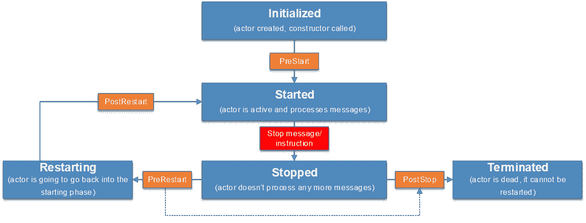
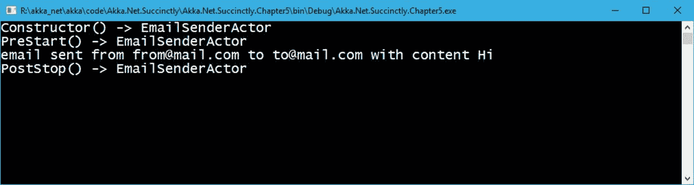
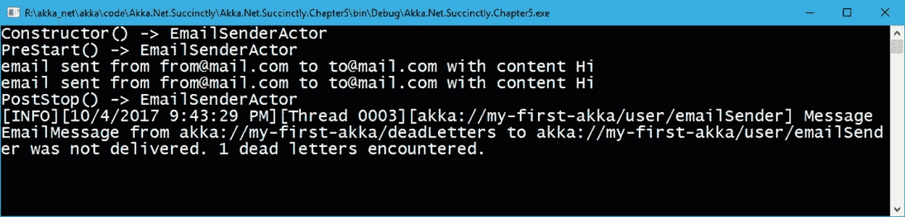
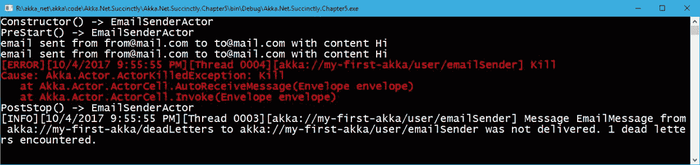
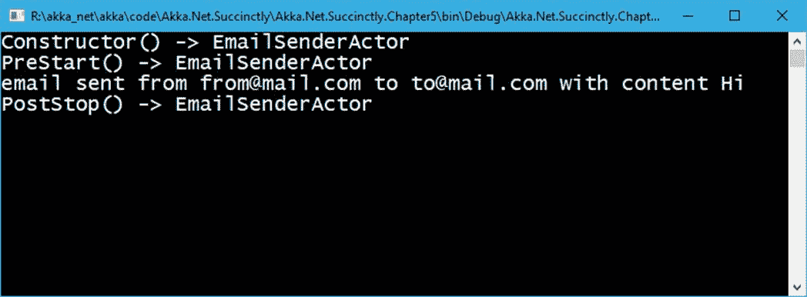
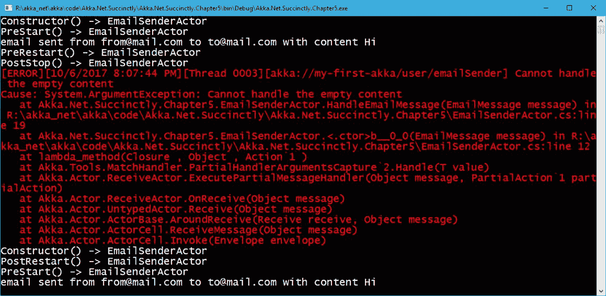

# 第 5 章行动者生命周期和状态

## 演员的生命周期

演员是有生命周期的。在生命周期中，我们关注参与者经历的实际阶段或状态:创建、开始、停止、终止等。actor API 提供了扩展点，因此可以连接到 actor 生命周期的各个阶段，并执行操作。

让我们从描述演员生命周期各种状态的图表开始:



图 14:参与者生命周期

我们可以看到阶段(蓝色)和在那个阶段之后执行的实际方法(橙色)。

让我们经历各个阶段，并进一步解释它们。

表 2:参与者的生命周期阶段

| `Initialized` | 创建了执行元实例，并调用了执行元的构造函数。此时，还没有收到任何消息——只有在执行构造函数之后，才会调用`PreStart`。`PreStart`是一种让我们在开始接收消息之前就能准备好所有必要工作的方法。 |
| `Started` | `PreStart`方法执行完毕后，行动者还活着，可以一条一条的接收和处理邮箱里的消息。可以指示演员`Stop`，我们稍后会看到。`stop message`(或停止指令)会导致状态变化，演员进入下一个状态:`Stopped`。 |
| `Stopped` | 有几种方法可以阻止一个演员，以及两种可能的结果场景:

*   Scenario one: The actor `terminates`, in which case the `PostStop` method will be called.
*   场景二:演员`restarts`，这种情况下会调用`PreRestart`。在基类中实现的`PreRestart`将自动调用`PostStop`作为下一步。如果我们想真正地重启 actor，就不应该调用基类实现。

无论如何，如果`PostStop`被调用，就没有回头路了——行动者被终止。 |
| `Terminated` | 执行元不再处于活动状态，并且无法重新启动的状态——实际上，该执行元不再存在。 |
| `Restarting` | 如果父执行元已经识别出错误，并且不想终止该执行元，那么可以要求该执行元重新启动。此时，演员将处于重启状态。在这种状态之后，演员将再次活跃起来，就像最初创建时一样。在`PreRestart`运行之后(正如我们在`Stopped`阶段看到的)，就在演员再次开始之前，我们有能力实施`PostRestart`方法。 |

如何使用各种 Hook 方法？

表 3:参与者的生命周期方法

| `PreStart` | 此方法在参与者开始接收其第一条消息之前调用。在这里，我们可以放置任何类型的自定义初始化代码。例如，打开文件、数据库连接等。 |
| `PostStop` | 此方法在参与者停止后调用，并且不接收或处理消息。在这里我们可以放置任何自定义**清理**代码。 |
| `PreRestart` | 在执行元开始重新启动之前调用此方法。当`PreStart`和`PostStop`没有接收到任何输入参数时，`PreRestart`将获得正在处理的最新消息，以及导致其重启的异常。此方法存在的原因之一是在异常发生时保存正在处理的消息，以便在参与者重新启动后重新处理。 |
| `PostRestart` | `PostRestart`在`PreRestart`方法之后，但在`PreStart`方法之前被调用。`PostRestart` 作为输入参数有最后出现的`exception`，所以它允许代码用这个`exception`做一些事情:运行一些诊断或记录等。 |

### 示例

在下面的例子中，我们将看到如何跟踪参与者的构造函数`PreStart`和`PostStop`方法的调用。

这里的想法是，我们有一个非常琐碎的`EmailMessage`要用`EmailSenderActor`发送。`EmailSenderActor`将实现 Hook 方法的重载，以便在控制台中显示正在发生的事情。

让我们定义`EmailMessage`，这是要传递给行动者的消息。`EmailMessage`仅用于演示目的，不实施任何异常。

代码清单 34:电子邮件消息的定义

```
  public class EmailMessage
  {
      public EmailMessage(string
  from, string to, string content)
      {
          From = from;
          To = to;
          Content =
  content;
      }
      public string From { get; }
      public string To { get;
  }
      public string Content { get; }
  }

```

让我们用重载来实现实际的执行元，这将进一步解释。

代码清单 EmailSenderActor 的定义

```
  public class EmailSenderActor: ReceiveActor
  {
      public EmailSenderActor()
      {
          Console.WriteLine("Constructor() ->
  EmailSenderActor");
          Receive<EmailMessage>(message => HandleEmailMessage(message));
      }

      private void HandleEmailMessage(EmailMessage message)
      {
          Console.WriteLine($"Email sent from {message.From} to {message.To}");   

      }

      protected override void PreStart()
      {
          Console.WriteLine("PreStart() ->
  EmailSenderActor");

      }

      protected override void PreRestart(Exception reason, object message)
      {
          Console.WriteLine("PreRestart() ->
  EmailSenderActor");
          /* base.PreRestart(reason, message);
  */
      }

      protected override void PostRestart(Exception reason)
      {
          Console.WriteLine("PostRestart() ->
  EmailSenderActor");
          base.PostRestart(reason);
      }

      protected override void PostStop()
      {
          Console.WriteLine("PostStop() -> EmailSenderActor");
      }
  }

```

正如您所看到的，我们已经简单地实现了我们之前讨论过的被覆盖的方法，它们唯一做的事情就是在控制台中显示一条消息，表明这些方法已经被执行。

需要注意的一个有趣的点是`PreRestart`实现。如果我们调用`base.PreRestart`，这个方法会自动停止所有的子演员，调用`PostStop`。代码清单 36 显示了我们已经重写的基本方法的实际实现。

代码清单 36:预启动基类实现

```
  protected virtual void PreRestart(Exception reason, object message)
  {
      ActorBase
      .Context
      .GetChildren()
      .ToList<IActorRef>()
      .ForEach((Action<IActorRef>)(c =>
          {
              ActorBase.Context.Unwatch(c);
              ActorBase.Context.Stop(c);
          }));
      this.PostStop();
  }

```

现在我们可以创建发送消息并最终停止`ActorSystem`的代码。这是我们还没有提到的:实际上`ActorSystem.Terminate`方法会终止 actor 系统，这显然会终止所有实例化的 actor。在我们的情况下，这也会导致我们的演员终止。

代码清单 37:向 EmailSenderActor 发送消息

```
  static void
  Main(string[] args)
  {
      ActorSystem system = ActorSystem.Create("my-first-akka");

      IActorRef emailSender = system.ActorOf<EmailSenderActor>("emailSender");

      EmailMessage emailMessage = new EmailMessage("from@mail.com", "to@mail.com", "Hi");

  emailSender.Tell(emailMessage);

      Thread.Sleep(1000);

      system.Terminate();

      Console.Read();
  }

```

其输出如下:



图 15:展示参与者的生命周期

## 行动者终止

在本节中，我们将解释如何终止一个参与者:如何以编程方式确保一个参与者将被终止。

有几种方法可以实现这一点:

*   调用`ActorContext.Stop()`方法。
*   发送`Kill`信息。
*   发送`PoisonPill`信息。
*   终止`ActorSystem`，正如我们在前面的例子中看到的。
*   使用`GracefulStop`。

### 阻止演员

使用`ActorContext.Stop`方法可以停止一个演员。这在一些地方可用，例如:

*   `ActorSystem`包含`Stop`方法，我们可以将实际的演员引用传递给它。
*   演员本身有能力通过调用`Context.Stop(Self)`来调用`Stop`方法。
*   演员可以通过呼叫`Context.Stop(childActorReference)`来阻止儿童演员。

需要注意的最重要的一点是`Stop`方法在关闭整个 actor 实例之前只会让 actor 执行当前正在执行的消息。这意味着不会执行其他消息，包括在实际调用`Stop`()方法之前排队的消息。

代码清单 38:通过 ActorSystem 停止一个参与者

```
  static void
  Main(string[] args)
  {
      ActorSystem system = ActorSystem.Create("my-first-akka");

      IActorRef emailSender = system.ActorOf<EmailSenderActor>("emailSender");

      EmailMessage emailMessage = new EmailMessage("from@mail.com", "to@mail.com", "Hi");

  emailSender.Tell(emailMessage);

      system.Stop(emailSender);

      system.Terminate();
  }

```

### 发送投毒信息

`PoisonPill`是一种特殊的消息(系统消息)，在收到这种消息后，指示行动者关闭自身。但是，只有在接收到`PoisonPill`消息之前执行了属于邮箱的所有消息之后，参与者才会停止。后面的消息(如果有的话)会抛出一个错误(因为实际上，actor 已经不存在了)。

在代码清单 38 中，我们发送了三个要执行的电子邮件消息；然而，正如我们将要看到的，只有第一个和第二个会被处理，而第三个不会，因为它出现在`PoisonPill`消息之后。`PoisonPill.Instance`代表消息的一个实例。

代码清单 39:发送一个投毒文件

```
  static void
  Main(string[] args)
  {
      ActorSystem system = ActorSystem.Create("my-first-akka");

      IActorRef emailSender = system.ActorOf<EmailSenderActor>("emailSender");

      EmailMessage emailMessage = new EmailMessage("from@mail.com", "to@mail.com", "Hi");

  emailSender.Tell(emailMessage);

  emailSender.Tell(emailMessage);
      emailSender.Tell(PoisonPill.Instance);

  emailSender.Tell(emailMessage);

      Thread.Sleep(1000);

      system.Terminate();

      Console.Read();
  }

```

通过下面的输出，我们可以清楚地看到前两封电子邮件已经发送，但第三封没有。



图 16:中毒填充效应

### 发送终止消息

杀死一个演员非常类似于发送`PoisonPill`信息，我们之前已经看到了。系统提供`Kill.Instance`消息传递给行动者。这种情况下的区别在于，当演员遇到这种消息时，会抛出一个异常(`ActorKilledExeption`)。如果我们想在日志中显示该参与者已被终止，这将非常有用。这个的用法好像很少见，不过知道就好。

代码清单 40:发送 Kill。给参与者的实例消息

```
  static void
  Main(string[] args)
  {
      ActorSystem system = ActorSystem.Create("my-first-akka");

      IActorRef emailSender = system.ActorOf<EmailSenderActor>("emailSender");

      EmailMessage emailMessage = new EmailMessage("from@mail.com", "to@mail.com", "Hi");

  emailSender.Tell(emailMessage);

  emailSender.Tell(emailMessage);
      emailSender.Tell(Kill.Instance);
      emailSender.Tell(emailMessage);

      Thread.Sleep(1000);

      system.Terminate();

      Console.Read();
  }

```

执行这段代码会产生以下输出——和以前一样，第三条消息还没有被传递！



图 17:向参与者结果发送 Kill 消息

### 优雅地停下演员

`IActorRef`还提供了`GracefulStop`方法。默认情况下，该方法发送一个`PoisionPill`并将返回给你的呼叫者一个`Task<bool>`，它将在你指定的超时内完成。

代码清单 41:优雅地停止一个参与者

```
  static void
  Main(string[] args)
  {
      ActorSystem system = ActorSystem.Create("my-first-akka");

      IActorRef emailSender = system.ActorOf<EmailSenderActor>("emailSender");

      EmailMessage emailMessage = new EmailMessage("from@mail.com", "to@mail.com", "Hi");

  emailSender.Tell(emailMessage);
      var result = emailSender.GracefulStop(TimeSpan.FromSeconds(10));
      Thread.Sleep(1000);
      system.Terminate();
  }

```

此方法的结果产生以下输出:



图 18:优雅停止示例输出

## 重启演员

重启一个演员只是稍微复杂一点，因为它涉及到对监管策略的理解。我们将在下一章讨论演员层级和监督策略，但目前，我们只说，每次我们创建一个新演员时，都会有一个默认的监督策略与该演员相关联。这意味着有一个标准的行为，系统会知道如何处理失败(一个`exception`被行为者抛出)。

默认的`supervision strategy`会使它这样，每次执行元出现处理错误(抛出异常)时，它都会要求执行元`restart`，这意味着将创建一个执行元的**新实例**。

|  | 注意:通过使用道具。创建<actor>()，我们能够提供监管策略。如果没有提供，将使用默认的。</actor> |

下面的示例显示了当参与者抛出错误时会发生什么。为了演示这一点，让我们稍微改变一下我们的`EmailSenderActor`来抛出一个`ArgumentException`，以防邮件内容没有设置(空或空)。所以，让我们去改变`HandleEmailMessage`的方法如下:

代码清单 42:没有内容的电子邮件，抛出一个错误

```
  private void
  HandleEmailMessage(EmailMessage message)
  {
      if(string.IsNullOrEmpty(message.Content))
      {
          throw new ArgumentException("Cannot
  handle the empty content");
      }
      Console.WriteLine($"email sent from {message.From} to {message.To}");
  }

```

下面是一个发送将引发错误的消息的示例:

代码清单 43:调用参与者

```
  static void
  Main(string[] args)
  {
      ActorSystem system = ActorSystem.Create("my-first-akka");

      IActorRef emailSender = system.ActorOf<EmailSenderActor>("emailSender");

      //send an invalid message (null
  content).
      EmailMessage invalidEMail = new EmailMessage("from@mail.com", "to@mail.com", null);
      EmailMessage validEmail = new EmailMessage("from@mail.com", "to@mail.com", "Hi");

  emailSender.Tell(validEmail);

  emailSender.Tell(invalidEMail);

  emailSender.Tell(validEmail);

      Console.Read(); 
      system.Terminate();
  }

```

我们在这里做的只是发送一封*有效的*与一封*无效的*(空内容)电子邮件。正如我们之前提到的，我们已经知道第二条消息(`invalidEmail`)将引发错误并导致参与者重启。

让我们检查一下这个输出，如下图所示。



图 19:重新启动参与者

我们可以看到，第一条消息发送得很好。第二个显然是引发了异常(红色显示)，但就在这之前，我们可以看到`PreRestart`和`PostStop`事件已经被引发。紧接着，我们可以看到演员重启，再次调用`constructor`，然后是`PostRestart`方法。我们在这里澄清的是`PostRestart`实际上发生在`constructor`被调用之后。

|  | 注意:重要的是要记住，当执行元重新启动时，它不会保持其状态。这意味着创建了一个新的 actor 实例，所有私有变量都将丢失！ |