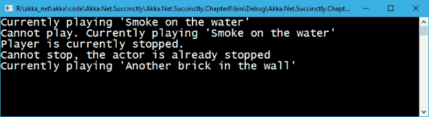

# 六、演员的可转换行为

演员本质上有能力在运行时改变他们的`behavior`！我们所说的行为是什么意思？演员的行为是它对收到的信息做出不同反应的能力，这取决于条件。

当执行元启动时，它有自己的默认行为，这意味着接收到消息时要执行的功能是在该点设置的。但是，此功能可能会根据某些条件而改变。例如，如果客户端没有被授权执行某件事，参与者可以切换行为并拒绝任何进一步的执行。

为什么行为有趣？实现行为的一种方式是将条件语句(`if`、`then`、`else`)放在各处，以便处理特定的条件(呼叫被授权)。相反，actor 模型通过允许您切换到不同的消息处理器来解决这个问题，因此当下一条消息到来时，这将在新的行为中执行。

一个演员可以有多少行为是没有限制的，行为的改变是由功能`Become()`处理的。在我们调用`Become()`之后，之前的行为就被遗忘了，除非我们使用`BecomeStacked()`函数，该函数会创建一堆行为，这样就可以使用`UnbecomeStacked()`来还原行为。

|  | 注意:行为的改变总是适用于下一个要处理的消息。 |

下面的例子将说明这在实践中是怎样的。

## 音乐播放器示例

作为如何在演员中使用该行为的示例，我们将构建一个小型音乐播放器。这是一个非常简单的例子，希望能让你更容易理解整个行为概念。

我们正在构建的音乐播放器接受两种消息类型，并且有一些规则:

*   `PlaySongMessage`:指示玩家**开始**播放歌曲。规则是，如果一首歌已经在播放，播放器不能再播放另一首歌。
*   `StopPlayingMessage`:指示玩家**停止**播放歌曲。如果我们停止一个已经停止的玩家，什么都不会发生。

这意味着音乐播放器有两种行为(或状态):一种是当前正在播放歌曲，另一种是播放器停止播放。

以下是这两条消息的非常简单的定义:

代码清单 44:音乐播放器输入消息定义

```cs
  public class PlaySongMessage
  {
      public PlaySongMessage(string
  song)
      {
          Song = song;
      }

      public string Song { get; }
  }

  public class StopPlayingMessage
  {
  }

```

如我们所见，`StopPlayingMessage`类基本上是一个指示玩家停止游戏的标记。没有额外的信息，因为它是不需要的。我们知道一次只能播放一首歌。

另一方面，`PlaySongMessage`有一个属性叫做`Song`，代表歌曲名称。

我们要创建的这个 actor 叫做`MusicPlayerActor`，将继承我们之前讨论过的`ReceiveActor`基类。

代码清单 45:音乐播放器的定义

```cs
  public class MusicPlayerActor : ReceiveActor
  {
      protected string CurrentSong;

      public MusicPlayerActor()
      {

  StoppedBehavior();
      }

      private void StoppedBehavior()
      {
          Receive<PlaySongMessage>(m => PlaySong(m.Song));
          Receive<StopPlayingMessage>(m => 
                         Console.WriteLine("Cannot stop, the actor is
  already stopped"));
      }

      private void PlayingBehavior()
      {
          Receive<PlaySongMessage>(m => 
                   Console.WriteLine($"Cannot play. Currently
  playing '{CurrentSong}'"));
          Receive<StopPlayingMessage>(m => StopPlaying());
      }

      private void PlaySong(string song)
      {
          CurrentSong =
  song;
          Console.WriteLine($"Currently playing '{CurrentSong}'");

  Become(PlayingBehavior);
      }

      private void StopPlaying()
      {
          CurrentSong = null;
          Console.WriteLine($"Player is currently
  stopped.");

  Become(StoppedBehavior);
      }
  }

```

查看了 actor 的内容后，我们可以看到有两种方法定义了 actor 的行为，如表 4 所示。

表 4:音乐播放器行为

| `PlayingBehavior()` | 播放歌曲时使用的行为。它处理这两个消息，一旦歌曲开始播放，它就会被设置。如果正在发送播放歌曲(`PlaySongMessage`)的新消息，它会返回一条错误消息(实际上只是控制台消息)。它响应`StopPlayingMessage`，因为它将确保音乐播放器停止。 |
| `StoppedBehavior()` | 播放器停止时使用的行为。它处理两个消息，并在创建参与者时设置(参见构造函数)。如果我们试图停止已经停止的音乐播放器，它会返回一条错误消息。 |

我们通过简单地创建两个方法来设置参与者的行为，这两个方法将决定正在处理的消息会发生什么。

在代码清单 45 中，我们可以看到如何使用`Become`方法切换到新的行为。我们只是在停止播放器，或者开始播放一首新歌之后，才使用`Become`。非常直白！

需要注意的一点是，音乐播放器演员有一个状态，由`CurrentSong`属性定义，每次播放新歌时都会设置。这说明了一个演员是如何保持状态的。我们提到演员的属性之一就是有状态，而这正是它！它与我们在使用 C# 时使用的类的典型用法没有任何不同。

让我们看看如何通过启动和播放各种歌曲来调用演员。

代码清单 46:运行音乐播放器的客户端代码

```cs
  static void
  Main(string[] args)
  {
      ActorSystem system = ActorSystem.Create("my-first-akka");

      IActorRef musicPlayer = system.ActorOf<MusicPlayerActor>("musicPlayer");

      musicPlayer.Tell(new PlaySongMessage("Smoke on the water"));
      musicPlayer.Tell(new PlaySongMessage("Another brick in the wall"));
      musicPlayer.Tell(new StopPlayingMessage());
      musicPlayer.Tell(new StopPlayingMessage());
      musicPlayer.Tell(new PlaySongMessage("Another brick in the wall"));

      Console.Read();
      system.Terminate();
  }

```

图 20 显示了运行`Main`方法后的输出。



图 20:播放音乐的结果

我们可以看到，如果我们在播放前一首歌的同时尝试播放一首新歌，会显示以下消息:`Cannot play.` `Currently playing ‘Smoke on the water’`。

同样，如果我们试图停止已经停止的音乐播放器，将显示以下消息:`Cannot stop, the actor is already stopped`。