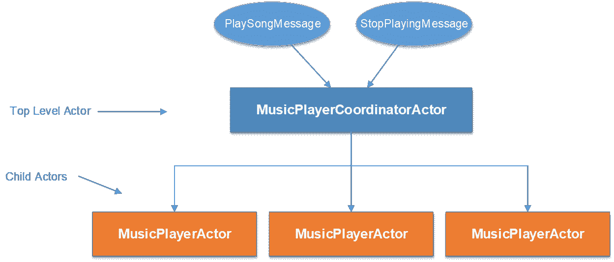
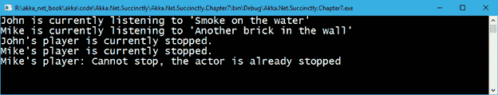

# 七、演员层次结构

我们已经看到了如何直接使用`ActorSystem`来创建顶级演员。在本章中，我们将看到如何创建参与者的层次结构，这意味着:一个参与者如何创建子参与者并形成层次结构。

## 创建参与者层次结构

当从现有的参与者创建新的参与者时，我们不使用`ActorSystem`作为入口点，而是使用`ActorContext`对象，这是基础参与者实现的一部分。

`ActorContext`(或者只是`Context`，因为这是演员库公开它的方式)公开演员和当前消息的上下文信息。它提供了更多的信息，例如:创建子角色的工厂方法(与`ActorSystem`相同的方式)、生命周期监控、监督子角色等等。

也就是说，让我们通过创建一个扩展音乐播放器应用程序的示例来查看演员的层次结构，以便它能够支持**多个用户**播放一首歌曲。

如果你还记得，在前面的例子中，我们只有一个`MusicPlayerActor`的实例。这位演员一次只能演奏一首歌。我们将扩展这个例子，并创建一种多用户音乐播放器，它将能够服务来自多个用户的请求。

我们要做的是创建另一个参与者`MusicPlayerCoordinatorActor`，它将充当用户请求之间的协调者。

基于用户创建`MusicPlayerActor`的新实例(子演员)是这个演员的责任，这样每个用户都会有自己的`MusicPlayerActor`副本，这样它就可以播放自己的歌曲。

这个控制者演员，叫做`MusicPlayerCoordinatorActor`，是一个常规演员，我们之前也看到过。但是，它不会播放任何歌曲——这个责任仍然在`MusicPlayerActor`内。所谓的协调者演员实际上是一种模式，它使演员能够扩展。

在图 21 中，我们可以看到`MusicPlayerCoordinatorActor`如何接收两个消息(`PlaySongMessage`和`StopPlayingMessage`)并与子角色协调。



图 21:参与者的层次结构

输入的信息必须稍微改变，以便将`user`和歌曲一起包括在内。突出显示的更改可以在以下代码中看到:

代码清单 47:输入包含用户的消息

```cs
  public class PlaySongMessage
  {
      public PlaySongMessage(string
  song, string user)
      {
          Song = song;
          User = user;
      }

      public string Song { get; }
      public string User { get; }
  }

  public class StopPlayingMessage
  {
      public StopPlayingMessage(string user)
      {
          User = user;
      }

      public string User { get; }
  }

```

现在我们可以创建新的协调者角色:

代码清单 48: MusicPlayerCoordinatorActor 定义

```cs
  public class MusicPlayerCoordinatorActor : ReceiveActor
  {
      protected Dictionary<string, IActorRef> MusicPlayerActors;

      public MusicPlayerCoordinatorActor()
      {

  MusicPlayerActors = new Dictionary<string, IActorRef>();

          Receive<PlaySongMessage>(message =>
  PlaySong(message));
          Receive<StopPlayingMessage>(message =>
  StopPlaying(message));
      }

      private void StopPlaying(StopPlayingMessage message)
      {
          var musicPlayerActor = GetMusicPlayerActor(message.User);
          if (musicPlayerActor != null)
          {

  musicPlayerActor.Tell(message);
          }
      }

      private void PlaySong(PlaySongMessage message)
      {
          var musicPlayerActor =
  EnsureMusicPlayerActorExists(message.User);

  musicPlayerActor.Tell(message);
      }

      private IActorRef EnsureMusicPlayerActorExists(string user)
      {
          IActorRef musicPlayerActorReference =
  GetMusicPlayerActor(user);

  MusicPlayerActors.TryGetValue(user, out
  musicPlayerActorReference);

          if (musicPlayerActorReference == null)
          {
              //create a new actor's instance.
              musicPlayerActorReference
  = Context.ActorOf<MusicPlayerActor>(user);
              //add the newly created actor in the
  dictionary.

  MusicPlayerActors.Add(user, musicPlayerActorReference);
          }
          return musicPlayerActorReference;
      }

      private IActorRef GetMusicPlayerActor(string user)
      {
          IActorRef musicPlayerActorReference;
          MusicPlayerActors.TryGetValue(user,
  out musicPlayerActorReference);
          return musicPlayerActorReference;
      }
  }

```

该参与者包含一个定义为 `Dictionary<string, IActorRef>`的字典`MusicPlayerActors`对象，该对象包含子参与者的实例。弦乐键是演奏者的名字，因为我们希望每个演奏这首歌的用户只有一个`MusicPlayerActor`。

参与者的实例由助手方法`EnsureMusicPlayerActorExists`创建，其职责是首先检查字典中是否已经有了参与者的实例，如果没有，则使用`Context.ActorOf<MusicPlayerActor>(user)`创建一个实例。我们在这里看到的`Context`实际上是一个`ActorContext`物体，我们在本章前面已经提到过。

我们可以看到，每次收到新消息时，它都会被转发给对应于播放歌曲的用户的子角色。我们也给一个用户的名字作为演员的名字。

`MusicPlayerActor`略有变化，可以显示当前用户的信息。现在这个参与者在显示的消息中包含用户名。

代码清单 49:音乐播放器定义

```cs
  public class MusicPlayerActor : ReceiveActor
  {
      protected PlaySongMessage CurrentSong;

      public MusicPlayerActor()
      {

  StoppedBehavior();
      }

      private void StoppedBehavior()
      {
          Receive<PlaySongMessage>(m => PlaySong(m));
          Receive<StopPlayingMessage>(m => Console.WriteLine($"{m.User}'s player: Cannot stop, the actor
  is already stopped"));
      }

      private void PlayingBehavior()
      {
          Receive<PlaySongMessage>(m => Console.WriteLine($"{CurrentSong.User}'s player: Cannot play. Currently
  playing '{CurrentSong.Song}'"));

          Receive<StopPlayingMessage>(m => StopPlaying());
      }

      private void PlaySong(PlaySongMessage message)
      {
          CurrentSong =
  message;

          Console.WriteLine(
                   $"{CurrentSong.User} is currently listening to '{CurrentSong.Song}'");

  Become(PlayingBehavior);
      }

      private void StopPlaying()
      {
          Console.WriteLine($"{CurrentSong.User}'s player is currently
  stopped.");
          CurrentSong = null;

  Become(StoppedBehavior);
      }
  }

```

现在，我们终于可以定义客户端代码，并向协调者参与者发送一些消息。我们可以看到现在`User`是用歌曲的名字在消息中指定的。

代码清单 50:客户端向 MusicPlayerCoordinatorActor 发送消息

```cs
  static void
  Main(string[] args)
  {
      ActorSystem system = ActorSystem.Create("my-first-akka");

      IActorRef dispatcher = 
                       system.ActorOf<MusicPlayerCoordinatorActor>("player-coordinator");

      dispatcher.Tell(new PlaySongMessage("Smoke on the water", "John"));
      dispatcher.Tell(new PlaySongMessage("Another brick in the wall", "Mike"));

      dispatcher.Tell(new StopPlayingMessage("John"));
      dispatcher.Tell(new StopPlayingMessage("Mike"));

      dispatcher.Tell(new StopPlayingMessage("Mike"));

      Console.Read();

      system.Terminate();
  }

```

我们可以看到，我们有一个非常类似的输出时，我们有一个单一的`MusicPlayer`，除了现在我们可以处理无限数量的用户。



图 22:向控制器发送多个消息的结果