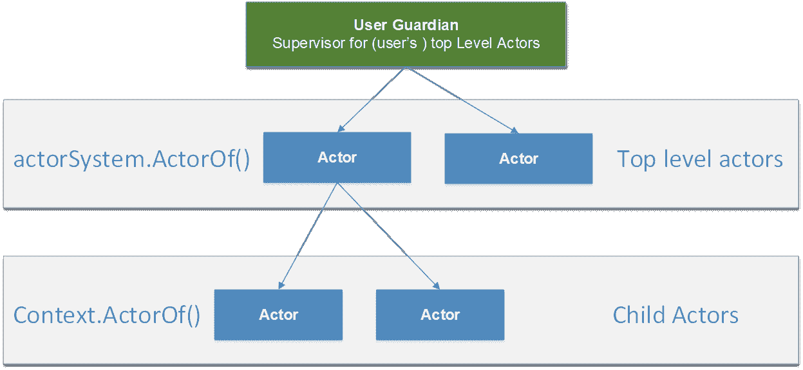

# 九、监督

在前面的章节中，我们已经多次提到了这样一个事实，即参与者具有依赖性，并且可以定义一个监督策略。在这一章中，我们将了解更多关于什么是监管以及它是如何工作的。

## 什么是监督？

监督描述的是演员之间的依赖关系。这在本质上意味着一个演员可以创造其他演员并*将*任务委托给他们。这个能力也伴随着处理那些子角色的*故障*的责任。

创造其他演员的演员也被称为*主管，*其子女被称为*下属*。下属的失败会传播给主管演员。

一般来说，只有少数几种方法可以处理传播回来的故障；让我们来看看它们:


图 28:可能的监督选项

用 Akka.NET 的话来说，要采取的行动也被称为`Directives`。

下表简要总结了各种选项。

表 6:解释了可能的监督指令

| `Resume` | 恢复从属意味着子角色将被重新启动，但它**仍然保持其内部状态**。这意味着演员在恢复后，将从停止的点继续工作。恢复一个演员也意味着恢复自己下属的所有**。这是连锁经营！** |
| `Restart` | 这将彻底清除任何下属的内部状态。但是，队列中的消息保持不变！这也意味着所有下属创建的角色都将重新启动。 |
| `Stop` | 永久停止下属。 |
| `Escalate` | 这意味着主管执行元本身并不处理错误，而是将其处理升级到主管的父执行元。监督者演员正在失败！ |

看完这些可能的选项，很明显监管是关于形成一个**递归故障处理结构**。记住我们之前提到的:失败处理是演员模型本身的一部分！

## 行为人监督层级

递归错误处理结构将我们带到下一个话题:如果我们的主管(参与者)没有处理错误，那么谁是最后一个这样做的主管？幸运的是，Akka.NET 提供了一个现成的机制，通过提供最高层的参与者。那些参与者总是在那里，并且提供最新级别的错误传播。

让我们看看结构。


图 29:演员的监督监护人

### 用户监护人

用户监护人为应用开发人员定义的所有参与者定义入口点。这些都是我们在本书中实际讨论的演员，而不是系统守护者，演员实际上是由 Akka.NET 自己管理和创造的。因此`actorSystem.ActorOf()`创造的所有演员，以及他们后续的子演员，都属于这一部分。



图 30:用户监护人监督演员

在前一章我们看到，当我们创建一个演员时，创建的路径在`/user`部分下。所有的用户守护演员都会被安置在那里。

### 系统守护

引入系统监控器是为了能够有序地关闭系统。我们不必担心创建系统层次结构，因为系统会处理它。系统守护演员会被`/system`开始的路径识别。

### 根守护

根监护人是最终应该做出决定的地方。如果错误被传播到根守护程序，它将确保用户守护程序被关闭(或处理)，从而关闭整个系统。

## 监管策略

既然我们知道了哪些指令可以用来处理失败情况，我们就必须了解父指令是如何处理代码的。这是通过`Supervision Strategies`完成的。

每当我们创建一个新的演员时，默认的监督策略都会分配给这个演员，也就是`Resume`这个演员。我们显然可以推翻这种行为。

我们可以使用不同的策略，例如:

*   `OneForOneStrategy`:该策略将指令**仅应用于出现错误的失败演员**。没有其他演员受到影响。
*   `AllForOneStrateg` y:该策略将该指令应用于其所有子代。如果儿童演员相互依赖，以至于一个人的失败带来另一个人的逻辑失败，这一点尤其有用。

我们将要构建的示例是我们在第 7 章中看到的音乐播放器的延续，其中`MusicPlayerCoordinatorActor`为每个播放歌曲的用户创建一个新的子代`MusicPlayerActor`，这样每个用户都有自己的`MusicPlayer`。

让我们想象一种情况，播放的歌曲不可用，因此`MusicPlayerActor`将处于故障状态。就举这个例子，我们想象一下，当玩家尝试播放歌曲《波西米亚狂想曲》时，`SongNotAvailableException`被抛出。《通往天堂的阶梯》播放时也会发生同样的情况，但这一次，`MusicSystemCorruptedException`被扔了。这显然是硬编码的，只是为了证明演员能够抛出消息！

下面的代码包含所描述的更改。

代码清单 56: MusicPlayerActor 抛出异常

```cs
  private void
  PlaySong(PlaySongMessage message)
  {
      CurrentSong =
  message;

      if (message.Song == "Bohemian Rhapsody")
      {
          throw new SongNotAvailableException("Bohemian Rhapsody is not available");
      }

      if(message.Song == "Stairway to Heaven")
      {
          throw new MusicSystemCorruptedException("Song in a corrupt state");
      }

      Console.WriteLine(
                $"{CurrentSong.User} is currently listening to '{CurrentSong.Song}'");
  }

  public class SongNotAvailableException: Exception
  {
      public SongNotAvailableException(string message): base(message)
      {

      }
  }

  public class MusicSystemCorruptedException : Exception
  {
      public MusicSystemCorruptedException(string message): base(message)
      {

      }
  }

```

为了使用一种或另一种策略，我们需要更改`MusicPlayerCoordinatorActor`并覆盖`SupervisorStrategy`方法，如下所示:

代码清单 57:覆盖监管策略

```cs
  public class MusicPlayerCoordinatorActor : ReceiveActor
  {
  …
      protected override SupervisorStrategy SupervisorStrategy()
      {
          return new OneForOneStrategy(e =>
          {
              if (e is SongNotAvailableException)
              {
                  return Directive.Resume;
              }
              else if (e is
  MusicSystemCorruptedException)
              {
                  return Directive.Restart;
              }
              else
              {
                  return Directive.Stop;
              }
          });
      }
  }

```

我们可以看到我们需要返回一个`SupervisionStrategy`(在我们的情况下，监管策略只作用于有缺陷的行为人)，我们还需要指定`Directive`。

代码清单 58:调用 MusicPlayerCoordinatorActor 的客户端代码

```cs
  static void
  Main(string[] args)
  {
      ActorSystem system = ActorSystem.Create("my-first-akka");

      var dispatcher = system.ActorOf(Props.Create<MusicPlayerCoordinatorActor>());

      dispatcher.Tell(new PlaySongMessage("Bohemian Rhapsody", "John"));
      dispatcher.Tell(new PlaySongMessage("Stairway to Heaven", "Andrew"));

      Console.Read();

      system.Terminate();
  }

```