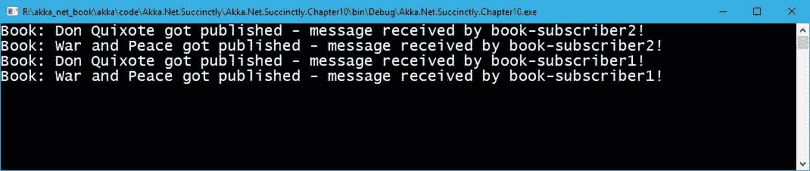
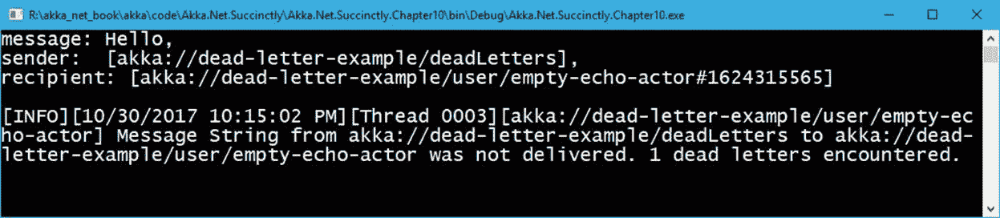

# 第 10 章其他组件

## 活动巴士

根据定义，在 Akka.NET，演员们通过发送信息(使用`Tell`、`Ask`、`Forward`等)直接相互交流。).这就是我们所说的一对一沟通；一个演员向另一个演员发送消息。然而，有时需要一次向多个参与者发送信息(一对多)，其中单个参与者向一组参与者发送消息。实际上，这意味着 Akka.NET 提供了一个开箱即用的发布者-订阅者机制。

`ActorSystem`将`EventStream`用于许多内部事务，包括日志记录、发送死信和集群事件。

一个 Akka.NET，无论是**系统**还是**用户**生成的事件(消息)都可以通过`EventStream`发布。`EventStream`是一个`EventBus`最简单也是最常见的实现。

`EventStream`支持多种方法，如:

*   `Publish`:向`EventBus`发布消息。
*   `Subscribe`:演员订阅`EventBus`。
*   `Unsubscribe`:演员退订接收新消息。

场景是:一个参与者向`EventBus`发布消息(某种类型)，而在另一方，一个或多个参与者订阅向特定类型的`EventBus`发布的事件。一旦消息发布，订阅者将自动接收该特定类型的消息。

|  | 注意:事件流只在一个 ActorSystem 上下文中工作。这意味着消息在另一个节点(服务器)上不可用。 |

让我们用一个例子来演示`EventBus`的用法。

我们在打造两个演员:`BookPublisher`，负责发布新书，`BookSubscriber`，每次公交车上发布新事件都会收到消息。`BookPublisher`的实现是有趣的，因为它使用`Context.System.EventStream.Publish()`方法来发布消息，这意味着`EventStream`在一个演员中是可用和可访问的。

`BookSubscriber`和我们已经查过的演员没什么区别。它只是处理`NewBookMessage`类型的接收。

`NewBookMessage`类型是一个简单的类，只包含我们正在出版的书的名字。

代码清单 59:发布者/订阅者示例

```cs
  public class BookPublisher: ReceiveActor
  {
      public BookPublisher()
      {
          Receive<NewBookMessage>(x => Handle(x));
      }

      private void Handle(NewBookMessage x)
      {
          Context.System.EventStream.Publish(x);
      }
  }

  public class BookSubscriber: ReceiveActor
  {
      public BookSubscriber()
      {
          Receive<NewBookMessage>(x =>
  HandleNewBookMessage(x));
      }

      private void HandleNewBookMessage(NewBookMessage book)
      {
          Console.WriteLine(
        $"Book: {book.BookName} got published - message received
  by {Self.Path.Name}!");
      }
  }

  public class NewBookMessage
  {
      public NewBookMessage(string
  name)
      {
          BookName = name;
      }

      public string BookName { get; }
  }

```

客户端代码包含一些我们还没有看到的新方法。在`Main`方法中，在创建`ActorRef`之后，我们将该参与者订阅到事件流中，并且在特定情况下，仅接收`NewBookMessage`类型。

我们直接在`Main`功能中使用`Subscribe`方法；然而，这可以在执行元实例化时直接使用，通过使用执行元的构造函数或`PreStart`方法。

代码清单 60:支持发布和订阅消息的主要方法

```cs
  static void
  Main(string[] args)
  {
      ActorSystem system = ActorSystem.Create("pub-sub-example");

      var publisher = system.ActorOf<BookPublisher>("book-publisher");

      var subscriber1 = system.ActorOf<BookSubscriber>("book-subscriber1");
      var subscriber2 = system.ActorOf<BookSubscriber>("book-subscriber2");

      system.EventStream.Subscribe(subscriber1,
  typeof(NewBookMessage));
      system.EventStream.Subscribe(subscriber2,
  typeof(NewBookMessage));

      publisher.Tell(new NewBookMessage("Don Quixote"));
      publisher.Tell(new NewBookMessage("War and Peace"));

      Console.Read();

      system.Terminate();
  }

```

正如我们所料，在输出中，两个订阅者参与者都将获得两个发布的消息。



图 31:发布者-订阅者结果

## 致命炸弹

有可能消息没有被传递给参与者。这些消息将被自动传递给一个名为`DeadLetters`的特殊角色，该角色在`/deadLetters`路径上可用。这条规则通常适用于非传输丢失的消息，这意味着 Akka.NET 不保证在传输层丢失消息。

每次参与者终止时，都有可能丢失一些消息。如果该演员不可用，而其他演员正在向其发送消息，则这些消息将最终出现在`DeadLetters`邮箱中。

### 我们如何监控致命信机？

演员可以订阅事件流上的类`Akka.Event.DeadLetter`。订阅的参与者将从那时起收到(本地)系统中发布的所有死信。由于死信不会在网络上传播，我们需要在每个节点上创建一个订户实例。

这是一个如何监控死信的例子。

代码清单 61:死信监控

```cs
  public class DeadLetterMonitor : ReceiveActor
  {
      public DeadLetterMonitor()
      {
          Receive<DeadLetter>(x => Handle(x));
      }

      private void Handle(DeadLetter deadLetter)
      {
          var msg = $"message: {deadLetter.Message}, \n"
  +
                      $"sender:  {deadLetter.Sender},  \n" +
                      $"recipient: {deadLetter.Recipient}\n";

          Console.WriteLine(msg);
      }
  }

  public class EchoActor : ReceiveActor { }

  static void
  Main(string[] args)
  {
      ActorSystem system = ActorSystem.Create("dead-letter-example");

      var deadLettersSubscriber = system.ActorOf<DeadLetterMonitor>("dl-subscriber");
      var echoActor = system.ActorOf<EchoActor>("empty-echo-actor");

  system.EventStream.Subscribe(deadLettersSubscriber, typeof(DeadLetter));

      echoActor.Tell(PoisonPill.Instance);
      echoActor.Tell("Hello");
      Console.Read();

      system.Terminate();
  }

```

有两个角色——一个叫做`DeadLetterMonitor`，其职责是订阅和处理`DeadLetter`消息。为了获得`DeadLetter`消息，演员必须订阅`EventStream`，并指定它将接收的消息类型(在我们的例子中，`DeadLetter`类型)。不要忘记`DeadLetter`类型是`Akka.Event`命名空间的一部分，所以它必须用`using Akka.Event`声明。

为了模拟不成功的消息发送，我们将创建一个`EchoActor`的实例，我们将在发送第一条消息之前停止该实例。在这种情况下，系统将尝试向停止的参与者发送消息，正如我们所看到的，这是不可能的，因此消息最终将被`DeadLetterMonitor`捕获。

运行这段代码时，我们可以看到以下输出:



图 32:死信监控结果

我们可以清楚地看到，消息确实被传递给了`DeadLetterMonitor`演员。我们也可以看到`akka://dead-letter-example/deadLetters`是传递信息的演员。