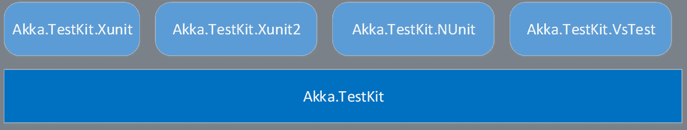
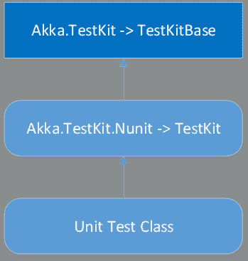

# 十一、Akka.NET 单元测试

很难想象现代应用程序开发没有执行单元测试或一般测试的可能性。自动化测试不仅是一个重要的部分，也是任何应用程序开发周期中必不可少的一部分。

由于测试 actors 有点不同于测试我们习惯的任何其他面向对象软件，Akka.NET 附带了一个专用模块`Akka.TestKit`，用于支持不同级别的测试。

`Akka.TestKit`是用于执行测试的基本库。除此之外，为了支持其他几个单元测试框架，比如 Xunit、NUnit 和 Visual Studio 测试，在它的基础上还构建了不同的库。



图 33:Akka.NET 测试库

包含这些库就像从 NuGet 包管理器控制台以通常的方式安装它们一样简单。

代码清单 62

```cs
  PM>
  Install-Package Akka.TestKit
  PM>
  Install-Package Akka.TestKit.NUnit

```

`TestKit`类是所有单元测试的基础，所有单元测试类都应该继承它。`TestKit`类实际上是由支持特定测试框架的各种库实现的——作为真正的基类，我们有`Akka.TestKit.TestKitBase`类，它是在`Akka.TestKit`库中实现的。

我们通常不会直接从`Akka.TestKit.TestKitBase`继承，因为会有相当多的东西需要实现，事实上，每一个特定于正在使用的测试框架的库(例如，NUnit)都会实现与参与者系统一起工作所需的管道，对我们隐藏这种复杂性。



图 34:测试工具包类的层次结构

最基本的单元测试如下所示:

代码清单 63:测试框架

```cs
  [TestFixture]
  public class CalculatorActorTest: Akka.TestKit.NUnit.TestKit
  {
      [Test]
      public void SomeTest()
      {
          /* test goes here */
      }
  }

```

如果你不熟悉`[TestFixture]`和`[Test]`，这是用来用`NUnit`标记测试的两个属性，我们将在示例中使用。你可以平等地使用你最喜欢的测试框架；这些概念通常非常相似。

我们可以将演员单元测试分为四类:

*   `Direct`:单元测试的编写方式和普通类一样。但是，这种方法不使用任何 actor 系统，因此在执行直接测试时，我们完全避免了消息传递，这就是我们使用 actor 系统的原因。另一方面，这种测试允许我们检查演员的状态，因此非常有用。
*   `Unit Testing`:单元测试是使用`ActorSystem`编写的，特别针对一个参与者进行。
*   `Integration Testing`:当需要测试多个参与者之间的消息传递时，我们可以使用这种技术。
*   `Mixed Mode`:在直接测试的帮助下使用单元测试/集成测试的单元测试。

## 直接测试

执行直接测试非常简单，与我们测试任何其他类时通常做的没有任何不同。有一件事我们需要特别小心，那就是将所有的消息处理程序标记为`public`，这样单元测试代码就可以访问它们。起初，这听起来像是一个安全问题，但实际上，当在 actor 系统中使用 actor 时，这些公共方法永远不会在 actor 本身之外被访问。

让我们用我们的`SongPerformanceActor`作为被测试的演员。如果你记得的话，这个演员是用来增加一首歌播放次数的。所以，这个演员有一个状态，这个状态是可以测试的。提醒一下，这个演员长得像下面这样。请注意，我们将`SongPerformanceCounter`属性更改为`public`，并使用了`IncreaseSongCounter`方法。

代码清单 64:用于直接测试的歌曲表演演员

```cs
  public class SongPerformanceActor : ReceiveActor
  {
      public Dictionary<string, int> SongPeformanceCounter;

      public SongPerformanceActor()
      {

  SongPeformanceCounter = new Dictionary<string, int>();

          Receive<PlaySongMessage>(m =>
  IncreaseSongCounter(m));
      }

      public void IncreaseSongCounter(PlaySongMessage m)
      {
          var counter = 1;
          if (SongPeformanceCounter.ContainsKey(m.Song))
          {
              counter =
  SongPeformanceCounter[m.Song]++;
          }
          else
          {

  SongPeformanceCounter.Add(m.Song, counter);
          }
      }
  }

```

我们将私有/受保护的方法更改为`public`，以便它们可以被单元测试访问。

我们的第一个测试是检查`SongPeformanceCounter`不包含任何关于演员创作的条目，如下所示:

代码清单 65: Actor 从一个空状态开始

```cs
  [TestFixture]
  public class SongPerformanceActorTest: Akka.TestKit.NUnit.TestKit
  {
      [Test]
      public void ShouldStartWithAnEmptyState()
      {
          var actor = new SongPerformanceActor();

          Assert.False(actor.SongPeformanceCounter.Any());
      }
  }

```

这里没什么难的。我们实例化一个新的参与者，并简单地检查`SongPerformanceCounter`属性中没有条目。

接下来要测试的是在播放一首歌曲后增加计数。为了实现这一点，我们将简单地使用`IncreaseSongCounter`方法并再次断言结果。

让我们添加一个新的测试方法并调用`IncreaseSongCounter`方法。我们断言计数器在“播放”一次歌曲后被设置为`1`。不用说，这个测试通过了。

代码清单 66:检查统计数据是否增加了一

```cs
  [Test]
  public void
  ShouldIncreaseSongByOne()
  {
      var actor = new SongPerformanceActor();

      var songMessage = new PlaySongMessage("Bohemian Rhapsody", "John");

  actor.IncreaseSongCounter(songMessage);

      Assert.True(actor.SongPeformanceCounter[songMessage.Song]
  == 1);
  }

```

这非常直接，与我们已经知道的单元测试没有任何不同。

## 单元测试

单元测试是关于使用参与者系统所涉及的消息来测试参与者。现在事情越来越复杂，需要先介绍几个概念。

当执行测试时，基础`TestKit`类将在后台创建一个测试参与者系统，称为`Sys`。作为一个演员系统，它将允许我们通过使用`ActorOf`来实例化新的演员，正如我们在前面章节中所看到的。这个方法没有`Sys.ActorOf`还有一个替代方案，就是使用`ActorOf<T>`。让我们看一个`ActorOf`用法的快速例子。

代码清单 67:不编译 ActorOf 测试

```cs
  [Test]
  public void
  ShouldIncreaseSongByOne()
  {
      //var actor = base.Sys.ActorOf(new
  Actor.Props(typeof(SongPerformanceActor)));
      IActorRef actor = ActorOf<SongPerformanceActor>();

      var songMessage = new PlaySongMessage("Bohemian Rhapsody", "John");

  actor.Tell(songMessage);

      Assert.True(actor.SongPeformanceCounter[songMessage.Song]
  == 1);
  }

```

但是，我们可以很快注意到`SongPerformanceCounter`类属性不再可见！很遗憾，这个测试无法进行，所以我们需要使用`ActorOfAsTestActorRef<T>`方法。这是一个包装器方法，它有`UnderlyingActor`属性，代表底层参与者的实例，所以我们可以访问它的内部属性。

代码清单 68:通过使用 ActorOfAsTestActorRef 的单元测试

```cs
  [Test]
  public void
  ShouldIncreaseSongByOne()
  {
      TestActorRef<SongPerformanceActor> actor =                      

  ActorOfAsTestActorRef<SongPerformanceActor>();

      var songMessage = new PlaySongMessage("Bohemian Rhapsody", "John");

      actor.Tell(songMessage);

      Assert.True(actor.UnderlyingActor.SongPeformanceCounter[songMessage.Song]
  == 1);
  }

```

### 测试演员的消息回复

在本节中，我们将了解如何测试参与者会回复消息的情况:这是为了演示如何使用`Sender.Tell(message)`方法测试发回的消息。为了做到这一点，我们将稍微调整我们的演员的行为，这样，在增加计数器后，它会发回消息，说计数器增加了。

唯一的变化是`IncreaseSongCounter`方法，用粗体突出显示。此外，我们还指定了将被重新发送的`CounterIncreasedMessage`消息。

代码清单 69:添加发送者。讲述方法

```cs
  public void
  IncreaseSongCounter(PlaySongMessage m)
  {
      var counter = 1;
      if (SongPeformanceCounter.ContainsKey(m.Song))
      {
          counter =
  SongPeformanceCounter[m.Song]++;
      }
      else
      {

  SongPeformanceCounter.Add(m.Song, counter);
      }    
      Sender.Tell(new CounterIncreasedMessage(m.Song, counter));
  }

  public class CounterIncreasedMessage
  {
      public string Song;
      public long Count;

      public CounterIncreased(string
  song, long count)
      {
          this.Song = song;
          this.Count = count;
      }
  }

```

让我们看看如何证明此消息被发送回发件人。

阿卡。TestKit 提供了一组断言帮助器方法，例如`ExpectMsg`、`ExpectMsgFrom`和`ExpectNoMsg`，以便测试消息是否是从参与者那里发回的。在我们的测试示例中，我们可以看到`ExpectMsg`和被注释掉的`ExpectMsgFrom`正在运行。

代码清单 70:用 ExpectMsg()测试返回消息

```cs
  [Test]
  public void
  ShouldResendCounterIncreasedMessage()
  {
      TestActorRef<SongPerformanceActor> actor =
                                          ActorOfAsTestActorRef<SongPerformanceActor>();

      var songMessage = new PlaySongMessage("Bohemian Rhapsody", "John");

  actor.Tell(songMessage);

      /* 
       * specify the actor
  explicitly
       * var replyMessage
  = ExpectMsgFrom<CounterIncreasedMessage>(actor);
       */

      var counter = ExpectMsg<CounterIncreasedMessage>(TimeSpan.FromSeconds(5));

      Assert.That(counter.Song == "Bohemian Rhapsody");
      Assert.That(counter.Count == 1);
  }

```

值得注意的是`ExpectMsg`返回了一个`CounterIncreasedMessage`的实例，以便进一步检查和断言。默认情况下，该方法将等待三秒钟，但这可以根据需要被覆盖(`TimeSpan.FromSeconds(5)`)。

`ExpectNoMsg`将测试没有收到消息的事实，在我们决定发回消息之前，这在我们前面的示例中可以正常工作。

`ExpectMsgFrom`将测试消息是否来自特定的参与者。

## 集成测试

在本节中，我们将看到如何检查两个演员之间的父子关系。如果你回想一下，有了`MusicPlayerCoordinatorActor`和`MusicPlayerActor`，第一个会收到消息，为每个播放音乐的用户创建一个新的`MusicPlayerActor`实例。新的子参与者将被赋予用户本身的名称。

以下是演员的简化版本:

代码清单 71:用于测试的音乐播放器的简化版本

```cs
  public class MusicPlayerActor : ReceiveActor
  {
      protected PlaySongMessage CurrentSong;

      public MusicPlayerActor()
      {
          Receive<PlaySongMessage>(m => PlaySong(m));
      }

      private void PlaySong(PlaySongMessage message)
      {
          CurrentSong =
  message;
          Console.WriteLine(
                  $"{CurrentSong.User} is currently listening to '{CurrentSong.Song}'");
      }
  }

```

相应的`MusicPlayerCoordinatorActor`如下:

代码清单 72:用于测试的 MusicPlayerCoordinatorActor 的简化版本

```cs
  public class MusicPlayerCoordinatorActor : ReceiveActor
  {
      protected Dictionary<string, IActorRef> MusicPlayerActors;

      public MusicPlayerCoordinatorActor()
      {

  MusicPlayerActors = new Dictionary<string, IActorRef>();

          Receive<PlaySongMessage>(message =>
  PlaySong(message));
      }

      private void PlaySong(PlaySongMessage message)
      {
          var musicPlayerActor =
  EnsureMusicPlayerActorExists(message.User);

  musicPlayerActor.Tell(message);
      }

      private IActorRef EnsureMusicPlayerActorExists(string user)
      {
          IActorRef musicPlayerActorRef;
          if (MusicPlayerActors.ContainsKey(user))
          {

  musicPlayerActorRef = MusicPlayerActors[user];
          }
          else
          {

  musicPlayerActorRef = Context.ActorOf<MusicPlayerActor>(user);

  MusicPlayerActors.Add(user, musicPlayerActorRef);
          }
          return musicPlayerActorRef;
      }
  }

```

我们可能解决的测试的一个方面是儿童演员的创作。我们给`MusicPlayerCoordinator`演员发消息后，如何保证子演员被创建？一种方法是如下使用`ActorSelection`:

代码清单 73:测试子参与者是否被创建

```cs
  [Test]
  public void
  ShouldInstantiateANewChildActor()
  {
      TestActorRef<MusicPlayerCoordinatorActor> actor =
          ActorOfAsTestActorRef(()
  => new MusicPlayerCoordinatorActor(), "Coordinator");

      var songMessage = new PlaySongMessage("Bohemian Rhapsody", "John");

  actor.Tell(songMessage);

      IActorRef child = this.Sys.ActorSelection("/user/Coordinator/John")
          .ResolveOne(TimeSpan.FromSeconds(5))
          .Result;

      Assert.That(child != null);
  }

```

因为我们知道每个参与者都有一个`Path`并且可以指定一个名称，所以我们显式地指定协调者的参与者名称，因为这将帮助我们定义最终的路径。当创建`MusicPlayerCoordinatorActor`时，我们告诉测试系统称之为`Coordinator`。

我们也已经知道，当新的子演员被创建时，它会有播放歌曲的用户的名字，所以我们知道子演员在实例化时会有哪个`Path`，我们将使用这个信息。在我们的例子中，这是`John`。

为了弄清楚孩子是否被创建了，我们使用`ActorSelection`对象，指定到孩子执行元的直接路径并检查它的存在。执行元的解析将需要五秒钟，如果在这个时间范围内没有创建执行元，测试将抛出一个错误并失败。