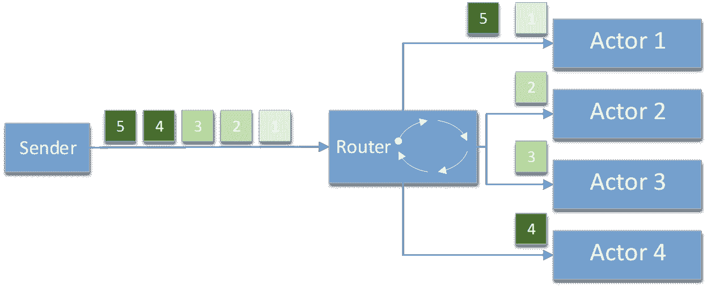
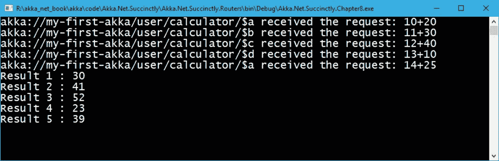
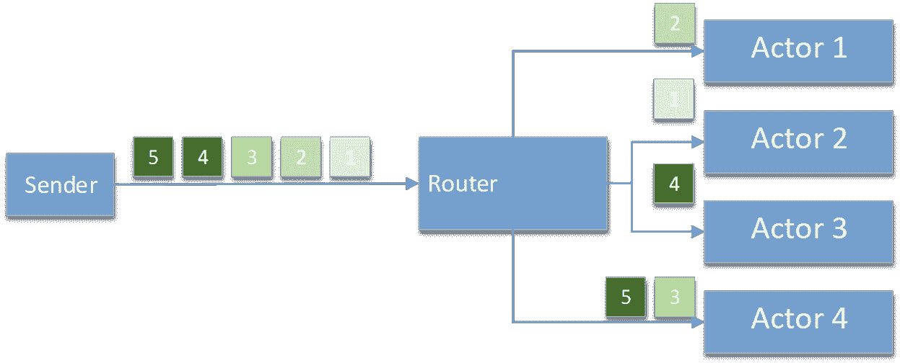
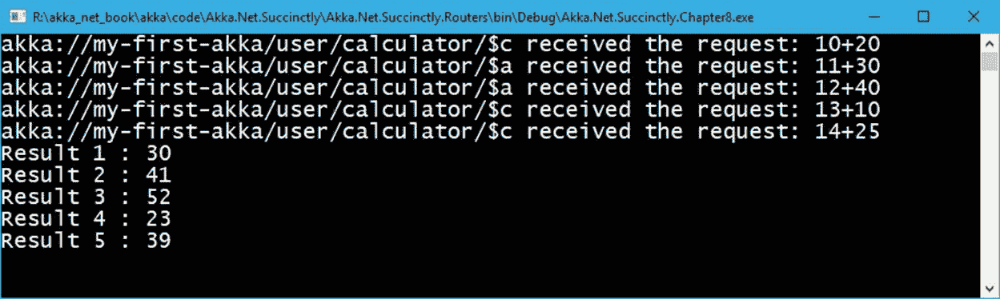
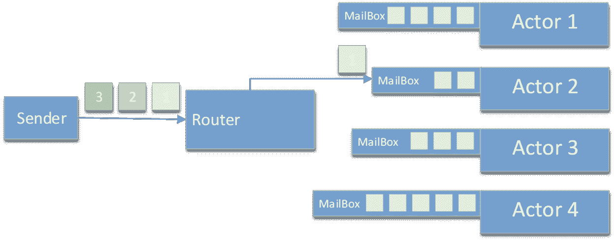
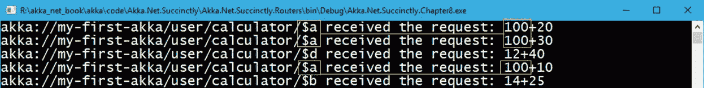

# 第十二章 Akka.NET 路由器

到目前为止，我们已经看到了演员的单一用法:一次创建一个演员，以及在演员之间发送消息。然而，在一些用例中，我们希望扩展应用程序，并且能够拥有一个响应迅速的应用程序，即使是在负载很重的情况下。

Akka.NET 提供了被称为`routers`的特殊演员，他们有能力将演员组合在一起，并通过应用不同的策略将一条信息分发给几个演员。因此，我们可以构建能够同时执行尽可能多的操作的系统。

在本章中，我们将解释如何使用最常见的路由器:

*   一系列
*   随机路径选择
*   最短邮箱队列
*   一致哈希

我们可以指定一个参与者在创建该参与者时将使用的路由器。`Props`对象包含一个可以用来指定它的方法`WithRouter`。

## 循环赛

循环路由器由类`RoundRobinPool`定义，是命名空间`Akka.Routing`的一部分。循环路由器可以配置为包含许多我们希望在应用程序中支持的参与者实例。每次新消息到达时，路由器都会确保列表中的下一个参与者会收到该消息。当我们想要平衡每个演员需要完成的工作量时，这尤其有用。

在图 35 中，我们可以看到发送方发送了五条消息，但是我们已经将`RoundRobinPool`配置为只包含四个参与者。这意味着参与者 1 将接收消息 1，参与者 2 将接收消息 2，参与者 3 将接收消息 3，参与者 4 将接收消息 4。下一条消息(消息 5)将简单地从参与者 1 开始，以此类推，循环进行。



图 35:循环路由器

为了用代码演示这一点，我们将使用我们之前看到的`CalculatorActor`，但是修改它以包括调试信息，以便我们可以跟踪哪个参与者实例接收到哪个消息。

代码清单 74:带有日志记录的计算参与者

```cs
  public class CalculatorActor : ReceiveActor
  {
      public CalculatorActor()
      {
          Receive<Add>(add => HandleAddition(add));
      }

      public void HandleAddition(Add add)
      {
         Console.WriteLine($"{Self.Path} received the request: {add.Term1}+{add.Term2}");
         Sender.Tell(new Answer(add.Term1 + add.Term2)) ;
      }
  }

```

代码清单 75 是`Main`方法，包含创建`CalculatorActor` `.WithRouter(new Akka.Routing.RoundRobinPool(4))`来定义`RoundRobin`路由器的代码，此外，还设置了四个要创建和使用的`CalculatorActor`实例。

代码清单 75:向循环路由器发出五个调用

```cs
  static void
  Main(string[] args)
  {
      ActorSystem system = ActorSystem.Create("my-first-akka");

      var calculatorProps = Props.Create<CalculatorActor>()

  .WithRouter(new Akka.Routing.RoundRobinPool(4));

      var calculatorRef = system.ActorOf(calculatorProps, "calculator");

      var result1 = calculatorRef.Ask(new Add(10, 20)).Result as Answer;
      var result2 = calculatorRef.Ask(new Add(11, 30)).Result as Answer;
      var result3 = calculatorRef.Ask(new Add(12, 40)).Result as Answer;
      var result4 = calculatorRef.Ask(new Add(13, 10)).Result as Answer;
      var result5 = calculatorRef.Ask(new Add(14, 25)).Result as Answer;

      Console.WriteLine($"Result 1 : {result1.Value}");
      Console.WriteLine($"Result 2 : {result2.Value}");
      Console.WriteLine($"Result 3 : {result3.Value}");
      Console.WriteLine($"Result 4 : {result4.Value}");
      Console.WriteLine($"Result 5 : {result5.Value}");

      Console.Read();

      system.Terminate();
  }

```

运行这段代码将返回以下输出，在这里我们可以清楚地看到第五条消息被传递给了名为`$a`的参与者，这也是序列中的第一个参与者。

请注意，参与者的名称是自动生成的，而我们在设置路由器时设置的名称`calculator`则成为父名称。`RoundRobinPool`不允许你为这些演员设置自定义名字。



图 36:圆形刺槐池–输出

## 随机路由

随机路由可能定义了最简单的路由方式，消息被随机发送给可用的参与者，因此没有任何顺序。随机路由由`RandomPool`类定义，除其他参数外，该类接受要使用的实例数量。

如图 37 所示，消息可以在任何给定的时间传递给任何参与者。值得指出的是，一条信息只发给一个演员。



图 37:随机路由

为了使用循环示例，我们将稍微改变前面的示例，以便使用`RandomPool`而不是`RoundRobinPool`。

代码清单 76:随机组件示例

```cs
  static void
  Main(string[] args)
  {
      …

      var calculatorProps = Props.Create<CalculatorActor>()

  .WithRouter(new Akka.Routing.RandomPool(4));

      …
  }

```

如果我们运行应用程序，我们可以看到在输出中，只有参与者`$a`和`$c`以随机的顺序接收了消息。



图 38:随机路由器输出

## 最短邮箱队列

我们已经知道每个演员都有自己的私人`MailBox`。一旦消息被发送给它，最新的消息就会被附加到队列的末尾，所以一旦所有其他消息都被处理完，它就会被接收。处理最后一条消息所需的时间取决于处理它之前的所有其他单个消息的持续时间。

为了加速这一过程，Akka.NET 提供了一种机制，这样消息将被发送给队列中包含较少项目的参与者。这样，可以尽快处理消息。在图 39 中，我们可以看到路由器将选择 Actor 2 来处理下一条消息。

这个逻辑由`SmallestMailboxPool`实现。



图 39:最短邮箱路由器

我们保持示例不变，只更改路由器，如下所示:

代码清单 77:最短邮箱路由器

```cs
  static void
  Main(string[] args)
  {
      …

      var calculatorProps = Props.Create<CalculatorActor>()

  .WithRouter(new Akka.Routing.SmallestMailboxPool(4));

      …
  }

```

## 一致哈希

一致哈希是一个非常有趣的路由器，与我们之前看到的路由器有点不同。我们不选择随机路由器，而是希望始终如一地发送具有某些特征的消息，总是发送给同一个参与者。该决定基于消息的散列，或者更好地，基于消息的所选属性。一致哈希由`ConsistentHashingPool`类实现，我们可以使用`WithHashMapping`方法覆盖默认的哈希机制，如下所示:

代码清单 78:一致哈希示例

```cs
  using Akka.Routing;

  static void
  Main(string[] args)
  {
      ActorSystem system = ActorSystem.Create("my-first-akka");

      var calculatorProps = Props.Create<CalculatorActor>()

  .WithRouter(new ConsistentHashingPool(4)

  .WithHashMapping(x =>

  {

  if (x is Add)

  {

           return ((Add)x).Term1;

  }

  return x;

  }));

      var calculatorRef = system.ActorOf(calculatorProps, "calculator");

      calculatorRef.Tell(new Add(100, 20));
      calculatorRef.Tell(new Add(100, 30));
      calculatorRef.Tell(new Add(12, 40));
      calculatorRef.Tell(new Add(100, 10));
      calculatorRef.Tell(new Add(14, 25));
      Console.Read();

      system.Terminate();
  }

  public class CalculatorActor : ReceiveActor
  {
      …
      public void HandleAddition(Add add)
      {
          Console.WriteLine($"{Self.Path} received the request: {add.Term1}+{add.Term2}");

          if (!(Sender is DeadLetterActorRef))
              Sender.Tell(new Answer(add.Term1 + add.Term2));
      }
      …
  }

```

在这个例子中，我们选择了`Term1`属性进行散列，所以要使用的执行元将取决于`Term1`属性的散列值。因为我们用的是`Tell`，所以我们不得不稍微改变一下`CalculatorActor`中消息的处理，这样当`Sender`不是演员的时候就不会回消息了。

通过执行这段代码，我们可以看到`Term1 = 100`的 Actor 始终是`$a`。



图 40:一致哈希输出

这种策略的风险在于，根据消息的不同，其中一台路由器可能会承担大部分负载——如果执行的大部分计算都是数字 100，那么大部分情况下只会使用一个参与者，这可能不会给出最佳结果。