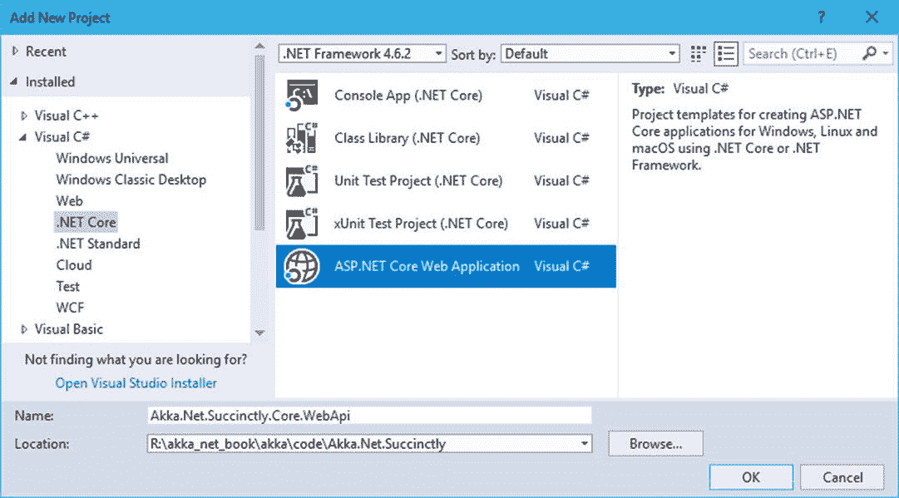
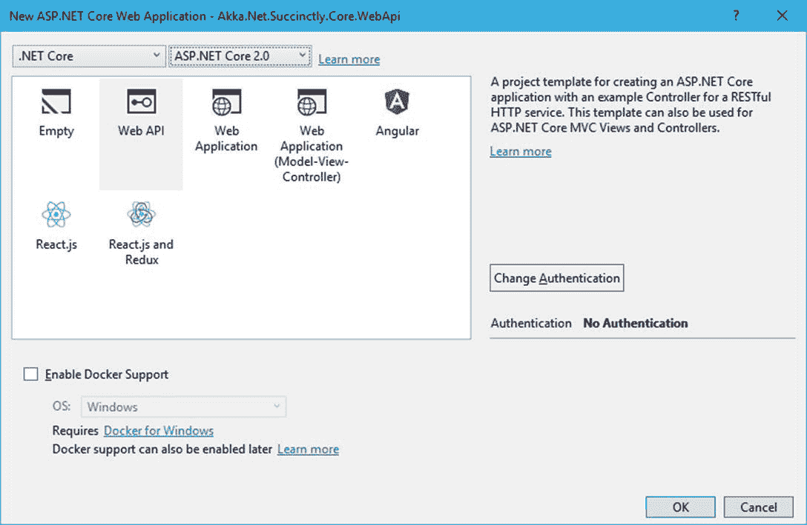
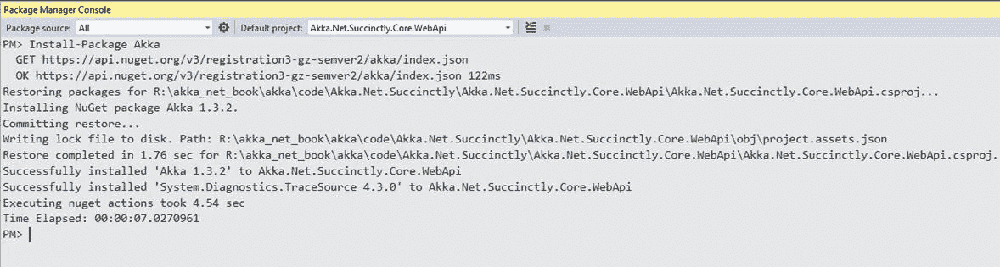
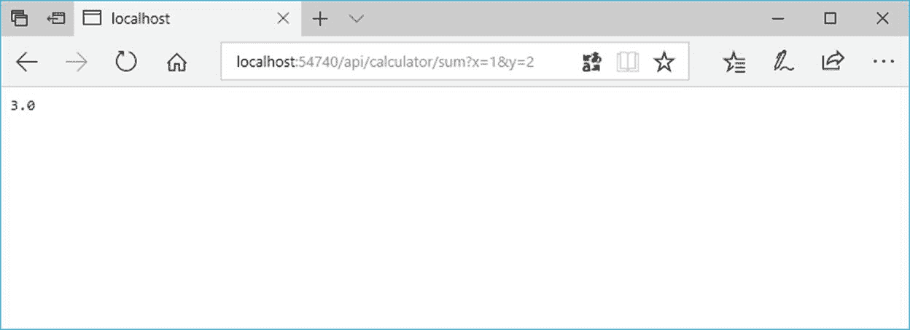

# 十三、ASP.NET 核心 的演员

Akka.NET 与 ASP.NET 核心应用的集成相对简单。正如您可能期望的那样，需要 ASP.NET 核心向参与者系统公开一个 HTTP 端点，然后我们可以将所有的业务逻辑放在参与者中，正如我们在各种示例中看到的那样。

由于 ASP.NET 核心是一个相对较新的框架，可以在多个平台上运行，因此它非常适合我们的示例，因为我们将演示在..NET 核心 应用中使用 Akka.NET 是可能的。

我们的应用不会太难，但足以证明两个框架之间的集成。我们将重用我们已经创建的一个角色`CalculatorActor`，并将这个添加作为 RESTful 服务公开。

我们不会深入 ASP.NET 核心的细节，因为我们期望你已经了解了基础知识。

## Visual Studio 项目创建

让我们从打开 Visual Studio 2017 开始，添加一个类型为:`.NET 核心` - > `ASP.NET 核心 Web Application`的新项目。你可以随意称呼这个项目，但就我而言，这是`Akka.Net.Succinctly.Core.WebApi`。



图 41:添加一个新的.NET 核心项目

下一步是选择我们要创建哪种`.NET 核心`应用。在我们的例子中，这是`Web API`。我们也会选择`.NET 核心`和`ASP.NET 核心 2.0`作为运行框架。



图 42:选择正确的.NET 核心项目

首先，我们应该参考 NuGet 的 Akka.NET。因此，让我们在包管理器控制台中运行以下命令:

代码清单 79:在 ASP.NET 核心项目中安装 Akka.NET

```cs
  PM>
  Install-Package Akka 

```

包管理器控制台应该类似于以下内容:



图 43:包管理器:安装 Akka.NET

现在项目应该设置好了，可以更改了！

## 演员定义

让我们提醒自己我们的演员长什么样。演员接收`AddMessage`，并将其发送回`Sender``AnswerMessage`，这是计算的结果。

代码清单 80:计算参与者定义

```cs
  public class CalculatorActor
  : ReceiveActor
  {
      public CalculatorActor()
      {
          Receive<AddMessage>(add =>
          {
              Sender.Tell(new AnswerMessage(add.Term1 + add.Term2));
          });
      }
  }

  public class AddMessage
  {
      public AddMessage(double
  term1, double term2)
      {
          Term1 = term1;
          Term2 = term2;
      }

      public double Term1;
      public double Term2;
  }

  public class AnswerMessage
  {
      public AnswerMessage(double
  value)
      {
          Value = value;
      }

      public double Value;
  }

```

## 工厂系统集成

首先，我们需要找到一个实例化`ActorSystem`的地方。我们知道`ActorSystem`的创建在时间和资源使用方面并不便宜，所以我们只想做一次，并在整个应用中重用它。

为了做到这一点，我们可以使用`Startup.cs`，它是 ASP.NET 核心模板的一个组成部分，并且已经为我们创建了。

我们将在`Service`集合中注册`ActorSystem`。`Startup`类包含`ConfigureService`方法。在创建了一个`ActorSystem`的实例之后，我们将把它添加到服务列表中，但是作为一个单独的(`AddSingleton`方法)。

语句`(serviceProvider) => actorSystem`意味着每次请求实例时，都会使用我们已经创建的`actorSystem`实例。

代码清单 81:在服务集合中注册 ActorSystem

```cs
  public class Startup
  {
      public void ConfigureServices(IServiceCollection services)
      {
          var actorSystem = ActorSystem.Create("calculator-actor-system");

  services.AddSingleton(typeof(ActorSystem), (serviceProvider) => actorSystem);

          /* the rest of
  configuration */
      }
  }

```

## 控制器定义

我们将创建一个名为`CalculatorController`的新控制器。`CalculatorController`只有一个方法，叫做`Sum`，可以使用`GET` `HTTP`方法访问。`Sum`法有`x`和`y`两个参数，对应我们要总结的两个数字。`Sum`方法的内容已经很熟悉了。我们实例化`CalculatorActor`，构造`AddMessage`，并`Ask`执行元返回类型`AnswerMessage`的结果。

由于我们已经将`ActorSystem`注册为服务的一部分，我们现在可以通过构造函数将其注入控制器。

代码清单 82:计算器控制器定义

```cs
  [Route("api/[controller]")]
  public class CalculatorController : Controller
  {
      private ActorSystem _actorSystem;

      public CalculatorController(ActorSystem actorSystem)
      {
          _actorSystem =
  actorSystem;
      }

      [HttpGet("sum")]
      public async Task<double> Sum(double x, double y)
      {
          var calculatorActorProps = Props.Create<CalculatorActor>();
          var calculatorRef =
  _actorSystem.ActorOf(calculatorActorProps);

          AddMessage addMessage = new AddMessage(x, y);
          AnswerMessage answer = await calculatorRef.Ask<AnswerMessage>(addMessage);

          return answer.Value;
      }
  }

```

在浏览器中运行应用时(通过在 Visual Studio 中按下`F5`，我们现在可以导航到`<host>:<port>/api/calculator/sum?x=1&y=2`页面，查看方法是否返回正确答案。如图 44 所示，返回了正确的答案。



图 44:通过浏览器调用 Sum 方法

需要注意的一点是:在前面的例子中，我们在每次调用`Sum`方法的时候都会创建一个新的 actor 实例，这并没有那么棒，因为它会消耗内存，而那些 actor 只会无所事事。

一种解决方法是尝试通过`ActorSelection`获取参与者的实例，但这也可能导致高度并发环境中的问题。使用`ActorSelection`的简单实现是:

代码清单 83:Sum 方法的定义

```cs
  [HttpGet("sum")]
  public async Task<double> Sum(double x, double y)
  {
      IActorRef calculatorRef;
      try
      {
          calculatorRef = await _actorSystem.ActorSelection("/user/calculator")

  .ResolveOne(TimeSpan.FromMilliseconds(100));

      }
      catch (ActorNotFoundException exc)
      {
          var calculatorActorProps = Props.Create<CalculatorActor>();
          calculatorRef =
  _actorSystem.ActorOf(calculatorActorProps,"calculator");
      }

      AddMessage addMessage = new AddMessage(x, y);
      AnswerMessage answer = await calculatorRef.Ask<AnswerMessage>(addMessage);

      return answer.Value;
  }

```

在这个例子中，我们试图通过指定路径通过`ActorSelection`获得一个参与者的实例，如果没有找到，我们将创建一个并继续。但是，正如我提到的，有可能两个并发的 ASP.NET 核心线程会试图同时执行角色选择，并创建一个新计算器的实例，这将导致错误。因此，即使代码清单 83 中的版本可以工作，也存在失败的潜在风险。

如果我们希望只有一个参与者为所有请求服务，那么更好的实现应该是:

代码清单 84:计算参与者包装器

```cs
  public interface ICalculatorActorInstance
  {
      Task<AnswerMessage> Sum(AddMessage message);
  }

  public class CalculatorActorInstance : ICalculatorActorInstance
  {
      private IActorRef _actor;

      public CalculatorActorInstance(ActorSystem actorSystem)
      {
          _actor =
  actorSystem.ActorOf(Props.Create<CalculatorActor>(), "calculator");
      }

      public async Task<AnswerMessage> Sum(AddMessage message)
      {
          return await _actor.Ask<AnswerMessage>(message);
      }
  }

```

我们将围绕演员本身创建一个包装类。逻辑与我们之前在控制器中的逻辑相同。这个新类将在 ASP.NET 核心服务列表中注册为一个单独的项目，如下所示:

代码清单 85:将 ICalculatorActorInstance 注册为单例

```cs
  public class Startup
  {
      public void ConfigureServices(IServiceCollection services)
      {
          var actorSystem = ActorSystem.Create("calculator-actor-system");
          services.AddSingleton(typeof(ActorSystem), (serviceProvider) =>
  actorSystem);
          services.AddSingleton(typeof(ICalculatorActorInstance), 

  typeof(CalculatorActorInstance));

          /* the rest of
  configuration */
      }
  }

```

现在我们需要改变控制器来注入演员本身，而不是`ActorSystem`。

新版本的控制器简单多了，包含的代码也少了。

代码清单 86:注入 ICalculatorActorInstance

```cs
  [Route("api/[controller]")]
  public class CalculatorController : Controller
  {
      private readonly ICalculatorActorInstance CalculatorActor;

      public CalculatorController(ICalculatorActorInstance calculatorActor)
      {
          CalculatorActor
  = calculatorActor;
      }

      [HttpGet("sum")]
      public async Task<double> Sum(double x, double y)
      {
          var answer = await
  CalculatorActor.Sum(new AddMessage(x, y));

          return answer.Value;
      }
  }

```

现在，我们非常确定，将只有一个演员为请求服务。这也将允许我们更好地控制演员实例的数量。我们可以选择不在`ICalculatorActorInstance`实现中创建`CalculatorActor`的一个实例，而是创建多个实例，并拥有一个演员池来服务于`Sum`方法。