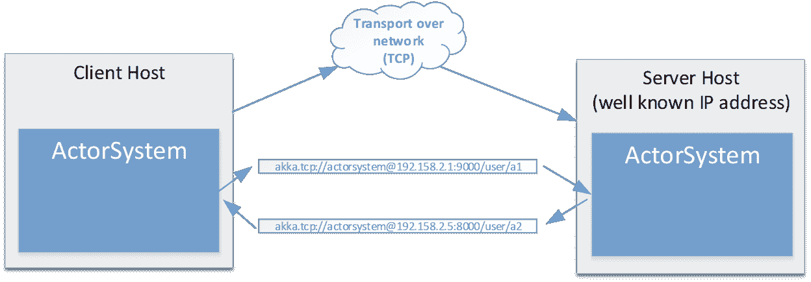
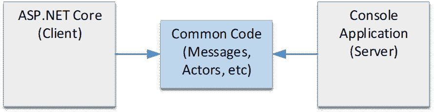
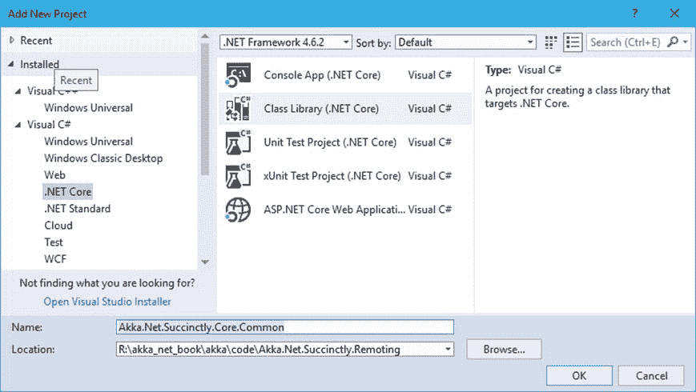
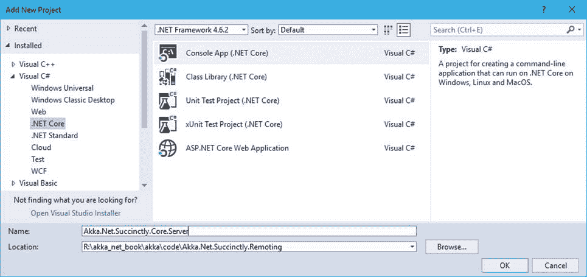
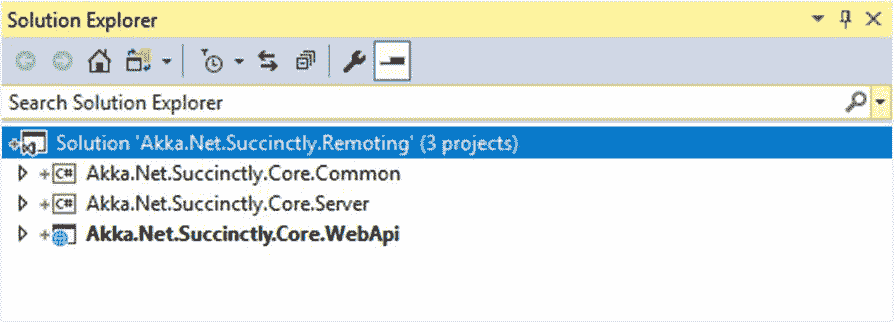
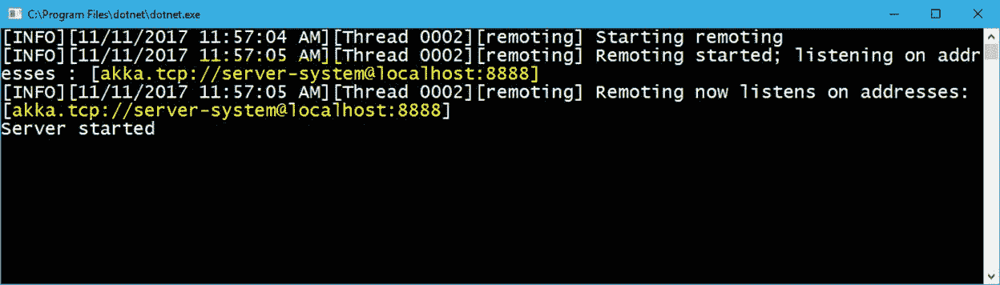
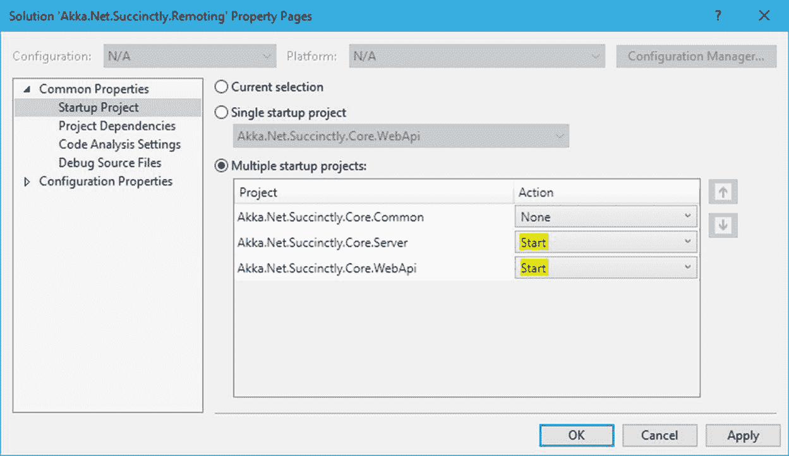
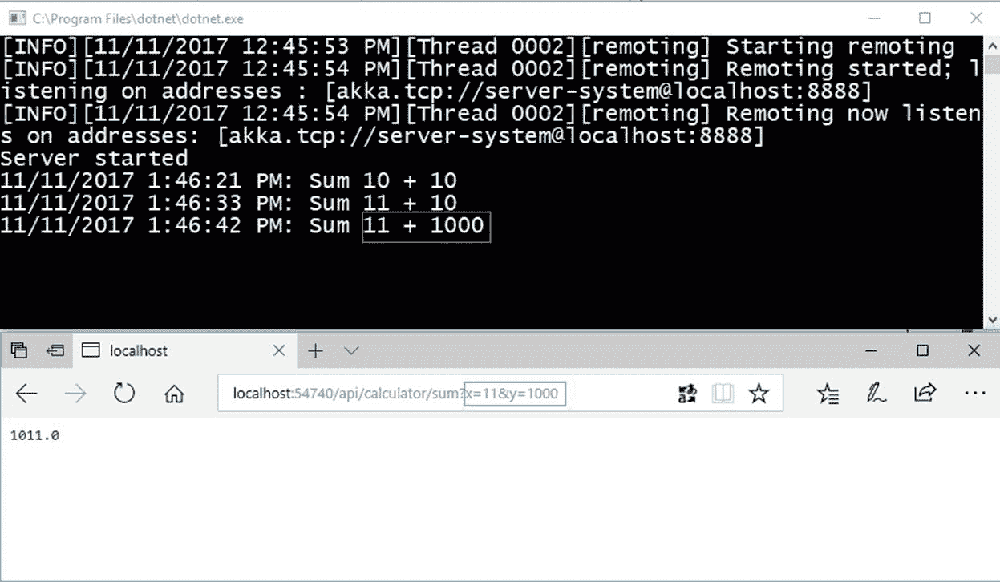

# 十四、Akka.NET 远程处理

在前几章中，我们看到了只属于一个`ActorSystem`的演员的创作以及他们之间的交流。成为一个`ActorSystem`的一部分自动意味着应用程序作为单个进程的一部分被托管和运行，这是单个应用程序空间。

虽然这对于某些类型的应用程序来说是完美的，但对于其他需要横向扩展以提高整体处理能力的应用程序来说可能就不是了。这就是我们需要的地方。

## 远程处理概述

Akka.NET 远程处理支持部署在不同应用程序进程上的`ActorSystems`之间的通信。这可能包括单台机器上的不同进程，或者完全不同的服务器。

我们来看一个例子。如图 45 所示，我们部署了两个参与者系统:一个运行在客户端主机上，一个运行在服务器主机上。

两者之间的通信将通过网络进行，所有通过网络发送的消息都将被序列化和反序列化。为了使序列化工作，两个参与者系统都应该有消息的公共定义(例如，通过与消息类共享一个库)。

除此之外，两台主机上的参与者之间的通信将通过使用完整的`Path`来进行，它包括协议、地址、端口和参与者的路径。我们在前面的章节中已经讨论了演员路径。



图 45:Akka.NET 远程处理支持通信

客户端主机(如图 45 所示)通常负责启动与服务器主机的通信。客户端主机还负责创建新的参与者实例。

通过使用远程处理，客户端主机可以选择*，其中*可以实例化新的参与者:在客户端(本地机器)或服务器主机(远程)上。为了指定将在哪里创建参与者，我们或者在配置文件中使用 HOCON 符号，或者直接在代码中这样做。

最棒的是，在创建一个参与者时返回的`IActorRef`不会改变它的行为，这意味着我们的代码将以相同的方式工作，就像参与者在本地运行一样。`IActorRef`提取演员位置的这种能力也被称为位置透明度。

## 运输

默认情况下，Akka.NET 使用[dotnety](https://github.com/Azure/DotNetty)库进行 TCP 传输。Akka.NET 交通部门的职责如下:

*   **IP 地址和端口**:所有 Akka.NET 端点(客户端和服务器)都必须可以通过一个 IP 地址和端口访问。
*   **消息传递**:应允许从`ActorSystem` A 到`ActorSystem` B 的消息传递
*   **消息框架**:区分网络流中的单个消息。
*   **断开和错误报告**:当发生断开或运输错误时告知`Akka.Remote`。
*   **保留消息顺序(最优)**:有些传输(比如 UDP)不做这样的保证，但一般来说，建议底层传输在读端保留消息的写顺序。
*   **DNS 解析(可选)**:能够解析 DNS。

## 远程处理演示应用程序

让我们构建一个示例来演示参与者的远程实例化。

作为演示应用程序，我们将对之前构建的 ASP.NET 核心计算器网络应用程序进行一些修改，如下所示:

1.  我们将添加一个新的控制台应用程序项目，用于托管远程`ActorSystem`，并根据客户端的请求执行代码。
2.  我们将创建一个新的公共代码库，这个库将由另外两个应用程序共享。



图 46:远程处理演示的物理结构

让我们从创建两个需要的项目开始，这两个项目将被添加到现有的 ASP.NET 核心解决方案中。



图 47:添加一个公共库

如图 47 所示，我们正在创建一个名为`Akka.Net.Succinctly.Core.Common`的..NET 核心库项目，除此之外，我们还需要创建一个名为`Akka.Net.Succinctly.Core.Server`的..NET 核心控制台应用程序项目。



图 48:服务器的创建

现在，我们的 Visual Studio 解决方案应该包含三个项目。



图 49:Visual Studio 中的三个项目

### Akka.NET 公共图书馆

我们将从定义公共库的内容开始。此时，公共库将包含参与者、消息和其他共享代码。在生产系统中，我们可能希望更好地分离关注点，而不是将所有内容放入一个桶(库)中，但是我们在这里所做的对于一个简单的演示项目来说已经足够好了。

我们将从从 NuGet 添加对 Akka 库的引用开始。

代码清单 87:从 NuGet 安装 Akka 包

```cs
  PM>
  Install-Package Akka 

```

我们还添加了下面的代码，它定义了我们的`CalculatorActor`、`AddMessage`和`AnswerMessage`类。用粗体字表示，我们添加了当前正在处理的消息的控制台日志记录，这对于调试很重要，以便查看服务器是否收到任何要处理的消息。

代码清单 88: CalculatorActor 和消息被重新定义

```cs
  public class AddMessage
  {
      public AddMessage(double
  term1, double term2)
      {
          Term1 = term1;
          Term2 = term2;
      }

      public double Term1;
      public double Term2;
  }

  public class AnswerMessage
  {
      public AnswerMessage(double
  value)
      {
          Value = value;
      }

      public double Value;
  }

  public class CalculatorActor : ReceiveActor
  {
      public CalculatorActor()
      {
          Receive<AddMessage>(add =>
          {
              Console.WriteLine($"{DateTime.Now}: Sum {add.Term1} + {add.Term2}");                                    
              Sender.Tell(new AnswerMessage(add.Term1 + add.Term2));
          });
      }
  }

```

我们将添加另一个类，该类将在两个解决方案(客户端、服务器)之间共享，并负责从文件中读取 Akka.NET 配置。`HoconLoader`类是一个非常简单的类，它读取文件的内容并返回`Akka.Configuration.Config`对象，该对象包含 HOCON 字符串的对象模型。

代码清单 89: HOCON 配置文件加载器类

```cs
  public static class HoconLoader
  {
      public static Config FromFile(string path)
      {
          var hoconContent = System.IO.File.ReadAllText(path);
          return ConfigurationFactory.ParseString(hoconContent);
      }
  }

```

### Akka.NET 服务器

#### 外部参考

服务器可能是三个项目中最简单的，因为它只托管`ActorSystem`。

我们将从从 NuGet 添加对`Akka`和`Akka.Remote`的引用开始。

代码清单 90:安装 Akka 远程处理所需的 NuGet 包

```cs
  PM>
  Install-Package Akka 
  PM>
  Install-Package Akka.Remote

```

除此之外，我们参考已经创建的`Akka.Net.Succinctly.Common`项目。

#### 配置远程处理

下一步是将 Akka 配置为允许远程连接。为了做到这一点，我们将在控制台应用程序中创建一个新文件，并将其称为`akka.net.hocon`，在这里我们为远程处理放置必要的 HOCON 配置。

不要忘记在 Visual Studio 中将此文件的属性设置为:

*   构建操作=“内容”
*   复制到输出目录=“始终复制”

代码清单 91:服务器配置文件的内容

```cs
  akka {
      actor {
          provider =
  "Akka.Remote.RemoteActorRefProvider, Akka.Remote"
      }

      remote {
          dot-netty.tcp {
             port = 8888 #
  bound to a specific port
             hostname =
  localhost
           }
      }
  }

```

请注意，我们必须将`actor -> provider`设置指定为`Akka.Remote.RemoteActorRefProvider`。该提供程序支持远程部署和实例化参与者。

下一个要配置的部分是`remote`。这里我们必须定义访问这个服务器应用程序所支持的协议、端口和主机名。`Dot-netty.tcp`是支持 TCP 协议上的远程处理通道和创建套接字的库，实际上支持两个参与者系统之间的通信。如果您想了解更多关于`DotNetty`的信息，请访问[官方网站](https://github.com/Azure/DotNetty)。

`Port = 8888`定义服务器响应的端口。作为一个服务器，这个端口必须是众所周知的，并且调用服务器的客户端必须知道它。

#### 服务器的入口点

我们现在准备开始`ActorSystem`并注入之前定义的配置。

`Server`应用程序的入口点只是加载`akka.net.hocon`文件的内容，并在创建时将配置设置注入`ActorSystem`(`Create`方法)。

代码清单 92:服务器的主要功能定义

```cs
  static void
  Main(string[] args)
  {
      var hocon = HoconLoader.FromFile("akka.net.hocon");
      ActorSystem system = ActorSystem.Create("server-system", hocon);

      Console.WriteLine("Server started");

      Console.Read();

  system.Terminate().Wait();
  }

```

现在我们可以运行`Server`(通过按 **F5** 启动服务器应用程序)。正如我们在图 50 中看到的，应用程序现在监听`Port 8888`，就像我们已经配置的那样。

另一个需要注意的重要事情是提到了演员系统的完整路径，也就是`akka.tcp://server-system@localhost:8888`。这非常重要，因为客户端需要知道服务器定义的完整地址。



图 50:服务器正在运行，允许远程连接

### Akka。net client 网路用户端

我们已经提到客户端是我们的 ASP.NET 核心应用程序，我们还必须配置它以允许远程处理。

#### 外部参考

正如我们对`Server`所做的那样，我们需要从 NuGet 中引用`Akka`和`Akka.Remote`库。

代码清单 93

```cs
  PM>
  Install-Package Akka 
  PM>
  Install-Package Akka.Remote

```

除此之外，参考已经创建的`Akka.Net.Succinctly.Common`项目。

#### 配置远程处理

下一步是将 Akka 配置为允许远程连接。为了做到这一点，我们将向项目中添加一个文件，并将其称为`akka.net.hocon`。正如我们对`Server`所做的那样，该文件将包含客户端`ActorSystem`的配置。

在 Visual Studio 中，不要忘记将此文件的属性设置为:

*   构建操作=“内容”
*   复制到输出目录=“始终复制”

代码清单 94:客户端配置文件的内容

```cs
  akka {
      actor {
          provider =
  "Akka.Remote.RemoteActorRefProvider, Akka.Remote"
              deployment {
                  /calculator
  {

  remote = "akka.tcp://server-system@localhost:8888"
                  }
              }
          }

      remote {
          dot-netty.tcp {
              port = 0
  # bound to a dynamic port assigned by the OS
              hostname =
  localhost
          }
      }
  }

```

演员提供者部分看起来与我们通过将`RemoteActorRefProvider`设置为演员提供者来配置服务器时完全相同。

有趣的是，我们必须配置部署部分。在部署部分，我们可以按角色(名称)放置配置，并定义远程运行该角色的位置。所以，`/calculator`是执行元的名称(无需在它之前指定`/user`，我们正在指示 Akka 在路径定义的远程系统上实例化这个执行元。我们还可以指定多个参与者来指向多个服务器。

代码清单 95:在部署部分指定多个参与者

```cs
   actor {
      provider =
  "Akka.Remote.RemoteActorRefProvider, Akka.Remote"
          deployment {
              /calculator
  {
                  remote =
  "akka.tcp://server-system@localhost:8888"
              }
              /actorXXX{
                  remote =
  "akka.tcp://server-system@system2:8888"
              }
          }
  }

```

下一个要配置的部分是`remote`。同样，正如我们对`Server`所做的那样，我们将`dot-netty.tcp`配置为传输协议，区别在于`Port`。我们不必为客户端指定端口，因为该端口将由 Akka 自动分配并传输到`Server`，以便`Server`知道在哪里应答。所以，`port = 0`表示动态地址。

#### 客户的入口点

关于前面的解决方案，如第 13 章所定义的，我们不必对`CalculatorController`、`CalculatorActorInstance`和`ICalculatorActorInstance`的定义进行任何更改。既然我们现在在`Common`库中有`CalculatorActor`，唯一会改变的部分就是前面提到的类中的`using`部分。

唯一真正改变的部分——这就是这个解决方案的美妙之处——是演员系统的配置。我们需要更改`Startup`类中的`ConfigureServices`方法，使其包含 HOCON 配置的读取，并将其注入到`ActorSystem`创建方法中。

更改的部分以粗体突出显示。

代码清单 96:客户端的配置——将 HOCON 配置注入 ActorSystem

```cs
  public void
  ConfigureServices(IServiceCollection services)
  {
      var hocon = HoconLoader.FromFile("akka.net.hocon");
      var actorSystem = ActorSystem.Create("calculator-actor-system", hocon);

  services.AddSingleton(typeof(ActorSystem), (serviceProvider) => actorSystem);

  services.AddSingleton(typeof(ICalculatorActorInstance), typeof(CalculatorActorInstance));
      services.AddMvc();
  }

```

在运行应用程序之前，我们必须启动 Visual Studio，以便它在启动客户端项目之前启动服务器。为此，右键单击解决方案名称，然后选择**属性**。如图 51 所示，我们选择**多个启动项目选项**，将`Akka.Net.Succintly.Core.Server`、`Akka.Net.Succinctly.Core.WebApi`设置为**启动**。



图 51:设置多个启动项目

现在我们已经准备好运行应用程序了——在 Visual Studio 中按下 **F5** 。服务器和浏览器将打开，我们将准备查询我们的`Calculator`控制器。

通过将控制台应用程序(服务器)和浏览器(客户端)并排放置，我们可以看到每次查询浏览器时，控制台都会显示一个条目。这证明两个系统之间的通信工作正常。



图 52:客户端和服务器之间的通信