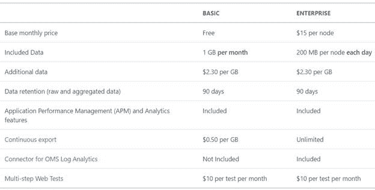
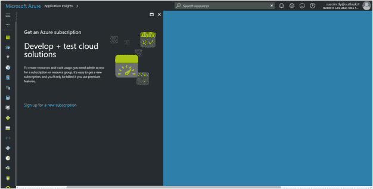
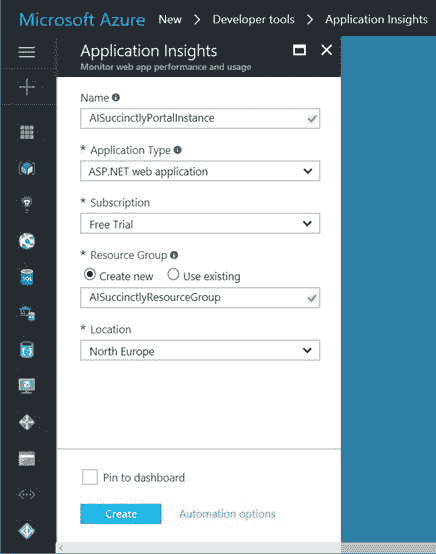

# 二、我们如何开始

应用洞察服务可通过微软的云 Azure 获得，因此我们需要订阅该平台才能开始。

|  | 提示:微软 Azure 是一项云计算服务，为个人和公司提供软件即服务(SaaS)、平台即服务(PaaS)和基础设施即服务(IaaS)，帮助他们在业务中取得更好的表现。更多信息请访问[azure.microsoft.com](https://azure.microsoft.com/en-us/)。 |

Azure 有各种各样的订阅，只需尝试应用洞察就可以轻松开始免费订阅，或者开始按需付费订阅以使用应用洞察的免费基本定价选项。

如果您是使用微软技术的开发人员，您应该已经安装了 Visual Studio 2013 或更新版本。在本书中，我们将使用 Visual Studio Community 2017。

如果您拥有 MSDN 订阅的 Visual Studio，请参考使用条款，并记住这些学分仅用于开发和测试，因此不能在生产环境中使用。

关于硬件没有最低配置，因为来自 Application Insights 的所有信息都可以通过网络浏览器收集。

## 应用洞察的定价选项

在撰写本书时，Application Insights 有两种定价选项，称为基本和企业。详情如下图所示。

图 1:定价选项

从图 1 中可以看出，Basic 选项是免费的，但有限制，可以用来创建用于调试或低流量应用的 Application Insights 资源。

当我们的网站上有更多的流量时，我们可以决定切换到企业选项，该选项具有每月成本和更强大的功能，例如包含更多的数据和无限的“连续导出”功能。我们将在以下章节中探讨连续导出功能。

在本章中，我们将探讨如何在 Azure 门户中创建一个 Application Insights 资源，并将其连接到现有的 web 应用程序。然后我们将重复这一步，直接从 Visual Studio 创建一个包含应用程序洞察资源的 ASP.NET 网络应用程序。即使两个过程的最终结果相同，如果您通常使用 Visual Studio，后一种模式也更方便。

要创建您的第一个应用洞察资源，请导航至 [Azure 门户网站](https://portal.azure.com/)。

|  | 提示:将网址[https://portal.azure.com](https://portal.azure.com/)设为书签，因为我们将在本书中使用它作为 Azure 门户的入口点。 |

如果您没有订阅 Azure，您将需要创建一个新的，如前所述。基本选项通常足以让您开始了解应用洞察。

图 2:蓝色门户

|  | 注意:由于 Azure 实际上不是本书的主题，因此假设您已经注册了这项服务。 |

在天蓝色门户的左侧，您会发现一个带有绿色 **+** 符号的竖条，这将打开**市场**刀片。您可以在此找到位于**开发工具**部分的**应用洞察**项目。

|  | 注意:微软 Azure 上的术语“刀片”代表一个垂直面板，它通常是其他信息的容器。该门户上的穿透钻取导航是使用前一个刀片右侧的渐进式刀片开口设计的。 |

图 3:应用洞察新资源刀片

创建应用洞察资源需要以下信息:

*   **名称**:这是资源的名称。它在您的 Azure 订阅中必须是唯一的。
*   **应用类型**:这是我们要监控的那种实现。它可以是以下值之一:

*   **ASP.NET Web 应用程序**:典型的 ASP.NET Web 应用程序，如 ASP.NET MVC 应用程序、Web Forms 应用程序或 WCF 服务。
*   **Java web 应用**:典型的 Java web 应用。
*   **HockeyApp 桥接应用程序**:该选项允许 Application Insights 使用通过 HockeyApp 收集的数据。选择此选项时，将显示两个附加字段(HockeyApp 令牌和 HockeyApp 应用程序)，以完成应用程序洞察和 HockeyApp 环境之间的连接。
*   **General** :一个基于 HTML 的应用，不考虑开发语言。

*   **订阅**:资源关联的 Azure 订阅。
*   **资源组**:这是收集资源的资源组。它是一种资源容器，对 Azure 资源管理很有用。
*   **位置**:资源将要运行的地理位置。目前可用的选项有美国东部、美国中南部、北欧和西欧。

一旦点击**创建**按钮，资源将在几秒钟内创建。

|  | 提示:由于 Azure 门户界面被设计得尽可能简单，您可以自己探索不同的部分，看看每个资源都有什么可用的。 |

此时，您应该准备好自己的应用洞察资源。在下一章中，我们将探索仪表板，以了解该资源的可用功能。