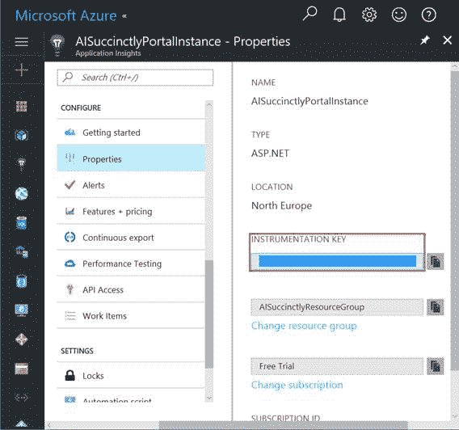
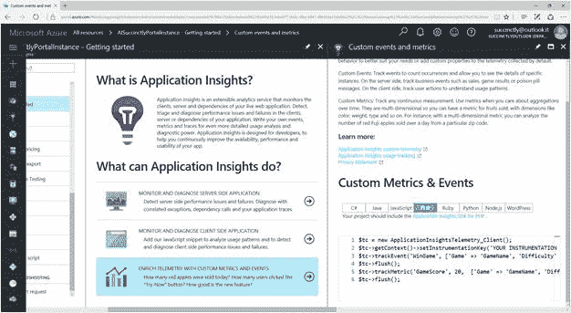
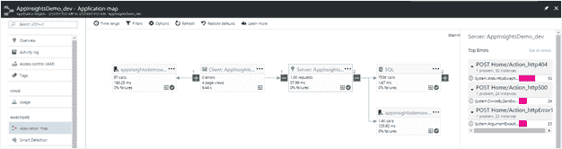
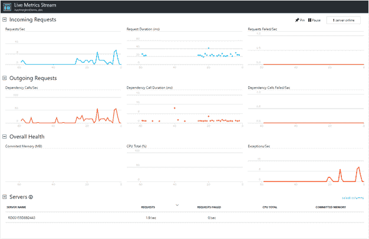

# 三、仪表盘

一旦应用洞察资源在**所有资源**刀片中可用，我们就可以访问该资源可用的所有信息和配置详细信息。

在本章中，我们将探索一些有趣的部分，这些部分将帮助我们理解应用洞察的基本概念。

## 仪表键

首先要探索的是**仪器键**字段，该字段在**属性**刀片上可用。

图 4:仪表键

工具键是一个 GUID，它标识了我们将使用的每个网络应用中的一个资源。它由 Azure 在资源创建过程中自动生成。

|  | 注意:GUID 是全球唯一标识符的缩写。它是一个唯一的标识符，可以通过多种方式创建，通常结合一些唯一的操作系统设置或组件，例如当前的 IP 地址或网络 MAC 地址、时钟日期/时间等。 |

在 Azure 门户上创建资源后，您需要复制检测密钥，并将其粘贴到将使用它的 web 应用的配置中。如果资源是在创建 web 应用的过程中在 Visual Studio 中创建的，则不需要这一步，因为 IDE 会为我们做这件事。

在本节中，我们将在服务器端和客户端找到大量有助于将该资源集成到我们的应用中的信息(和代码)。这意味着您可以在服务器端使用它来跟踪业务逻辑的性能，并且可以在客户端使用它来了解您的网页的使用情况，而不管使用什么语言(这非常重要)。

图 5:入门部分

例如，如果您想在基于 PHP 的 web 应用中使用这个资源，您可以在这里学习如何使用它的基础知识。下面是要复制的示例代码，它代表了应用洞察新手的起点。

**应用图**是一个可视化特征，显示了受监控的网络应用的组件之间的依赖关系。

在全新的应用洞察资源中，它将显示为空白画布。在运行环境中，您会看到如下内容:

图 6:应用地图画布

如图 6 所示，我们有一个关系图，其中我们可以找到一个 SQL Server(在右边)和托管网站(在左边的第一个项目)。

选择其中一个组件，我们可以在右侧单独的窗格中看到相关的项目(在图 6 中，这些是请求)，我们可以从每个组件的上下文菜单中选择项目( **…** )来查看一组过滤后的信息。

另一个需要了解的有趣的事情是**时间范围**过滤器*、*，它允许我们查看为给定时间段定义的关系部分(当然，如果它在资源的数据中可用)。

|  | 注意:我们时不时可以看到这个图标出现在屏幕的某个地方。这是一个强大功能的直接链接，我们将在[第 10 章，应用洞察分析](10.html#sigil_toc_id_55)中看到。 |

Azure 门户中另一个有趣的特性是**实时度量流**——这个名字说明了一切。

图 7:实时度量流

像心跳一样，实时度量流将允许我们几乎实时地看到我们正在监控的网络应用或服务上发生的事情。它处于“近实时”状态，因为延迟极小，约为一秒钟，但就其目的而言，我们可以将其视为实时监视器。

如果您要在生产环境中发布较新版本的 web 应用来应用修复(例如，针对较慢的性能)，并且您希望立即了解此版本是否如您预期的那样工作，则此功能会很方便。

另一个例子是，如果您正在监视 web 应用的某个特定时刻，以了解它是如何工作的，例如，在一个现场活动场景中，您希望看到一个连接的用户计数器。另一个例子是当您验证重复失败时。

|  | 注意:当使用 2.4.0 或更高版本的软件开发工具包时，在实时指标流面板的右侧将有额外的过滤器，用于创建和使用定制的关键绩效指标。 |

请记住，此功能不提供搜索功能。

现在，您已经看到了更多关于应用洞察资源的可用特性，现在是时候看一下指标了。