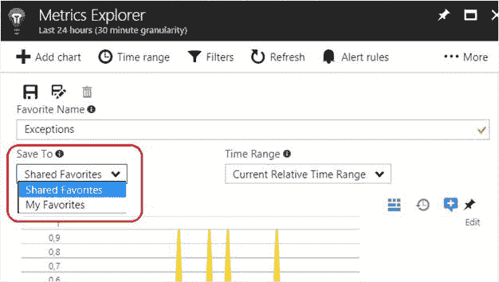

# 第四章我们身边的指标

我们从正在监控的网络应用程序或服务中收集的每一点信息都被称为*度量*。它可能代表与该 web 应用程序相关的某个事件或行为的测量值或计数。每个指标可以包含多位信息，称为*数据点*。

在本章中，我们将深入探讨应用洞察中可用的各种指标。

在应用洞察的术语中，度量是对被监控软件的一个或多个特性的性能或效率的度量。

我们可以用于应用洞察资源的最令人印象深刻的刀片之一是度量资源管理器。您可以通过点击**指标浏览器**按钮，从**概述**部分访问它。

当您想要跟踪异常或其他关于您的 web 应用程序收集的数据时，度量资源管理器可能是第一个登陆的地方。在这里你只需点击几下就能快速找到准确的信息。

图 8:指标浏览器刀片

在图 8 中，我们没有数据，因为资源是全新的。一旦资源从 web 应用程序中收集了数据，我们将看到类似于图 9 所示的内容。

图 9:演示资源的指标浏览器刀片

可以使用我们希望创建度量视图的特定信息来配置度量资源管理器刀片，如图 9 所示。

|  | 注意:术语“视图”可能不适合此功能，并且它不是官方术语的一部分，但我们将在此使用它来更好地解释此刀片背后的想法。 |

### 度量资源管理器收藏夹

通过将视图保存到**收藏夹**列表中，可以创建更多视图。例如，我们可以在收藏夹中保存一个名为“异常”的视图，其中包含与我们希望在那里看到的异常相关的所有指标，或者保存另一个名为“访问者”的视图，其中包含关于页面视图的详细信息以及关于网站访问的其他信息。

如果您将大量使用度量资源管理器，这种保存和重用视图的能力可能是有益的。

#### 创建收藏视图

从度量资源管理器*、*开始，您可以发现如图 8 所示的情况，一个空刀片准备托管您的度量。每个占位符可以承载一个指标图表。

通过单击图表右上角的**编辑**标签，为所需的目标图表选择要承载的指标。在此编辑模式下，新刀片将出现在右侧。在这里，您可以从列表中选择一个可用的指标，或者使用搜索文本框筛选出特定的指标。

图 10:创建度量资源管理器视图

在单个图表占位符中，我们可以显示多个指标，但是当我们在**图表详细信息**刀片中选择一个指标时，其他一些指标将不可用，如图 10 所示。出现这种情况是因为不可用的指标没有相同的比例和聚合类型，因此它们不能出现在同一图表上。

如图 10 右上角所示，我们可以通过选择**图表类型**值之一来选择如何对屏幕上看到的数据进行整形:

*   线
*   面积
*   酒吧
*   格子

为了显示不同的图表类型，下图显示了用于创建四个图表的相同**页面视图**度量，每个图表类型一个:

图 11:四种不同图表类型的页面浏览量指标

根据所选的指标和图表类型，可能有其他可用的设置，如图表高度或聚合字段。

在 Metrics Explorer 刀片中(以及可以保存为收藏夹的视图中)，我们可以使用**添加新图表** 选项*添加更多占位符，如图 11 *所示。*无论图表类型或高度如何，单个刀片中最多可以有九个图表占位符。*

 *使用图 12 所示的选项，可以将视图保存到收藏夹列表中，作为共享视图或个人视图。

图 12:保存喜欢的视图

术语*共享*意味着任何其他有权访问该资源的用户都可以查看和编辑该视图。否则，视图只对其创建者可见。

#### 加载收藏夹视图

从**概览**刀片，可以到达**收藏夹**列表。

图 13:收藏夹列表

在**收藏夹**刀片中，有两个部分可以找到我们所有的收藏夹:**我的收藏夹**和**共享收藏夹**。在第一部分，用户将找到他们自己的收藏夹，而第二部分包含由其他用户创建和共享的收藏夹。共享收藏夹也可以使用和编辑。

在这里，我们可以选择一个最喜欢的视图来加载和显示，只需点击一下。选择后，使用方法与直接使用度量资源管理器相同。

一旦我们选择了要显示的指标，我们就可以在指标浏览器中选择要显示数据的时间范围。

可能的值有:

*   最后 30 分钟
*   最后一小时
*   过去 12 小时
*   过去 24 小时
*   过去 48 小时
*   过去三天
*   过去七天
*   过去 30 天
*   自定义(选择您的自定义开始时间和结束时间)

还有选择要显示的数据粒度的选项；这里的值取决于所选的时间范围。正如您在应用洞察的[定价选项](02.html#_Pricing_options_for)部分所见，在基本和企业定价选项中，数据保留期均为 90 天(从当天开始)。

在[第 7 章，消耗和导出数据](07.html#_Chapter_7_)中，我们将看到更多关于导出功能的内容，当数据必须在保留期后保留时，这些功能非常有用。

到目前为止，我们在度量资源管理器部分所看到的一切都与显示可用数据有关，但是数据本身的组成呢？使用其中一个图表，我们可以检索一组关于所包含的指标的记录。选择其中一个，我们会看到更多的细节。

举个例子，让我们看看我们正在监控的 web 应用程序页面的**页面浏览量**指标。

图 14:页面视图度量记录的详细信息

如图 14 所示，关于所选记录的细节出现在右边的刀片上。在这种情况下，您可以看到来自英国的某人使用 Windows 10 上的 Chrome 浏览器访问了该页面。访问者停留在页面上不到三秒钟。

此指标的信息与其范围相关。因此，通过选择其他指标，我们将收集其他类型的信息。

当我们使用度量资源管理器搜索要绘制图表的度量时，我们会发现这些组:

*   使用
*   失败
*   计算机网络服务器
*   有效性
*   客户
*   性能计数器

该列表中的每个组都可以包含几个指标来检测 web 应用程序的使用情况并跟踪其行为。我将逐一提供这些指标的简要描述，让您更好地理解每一个指标。

### 度量

下表显示了使用指标列表。

表 1:使用指标

| 公制 | **描述** |
| --- | --- |
| 数据点计数 | 发送的数据点数量 |
| 数据点体积 | 发送的数据量 |
| 事件 | 自定义事件的计数 |
| 页面视图加载时间 | 页面视图加载时间 |
| 页面视图 | 页面浏览次数 |
| 会议 | 用户会话计数 |
| 跟踪计数 | 跟踪文档的计数 |
| 用户 | 不同用户的计数 |
| 用户，已验证 | 登录的不同用户的计数 |

下表显示了故障指标列表。

表 2:失败度量

| **公制** | **描述** |
| --- | --- |
| 浏览器例外 | 浏览器中引发的未捕获异常的计数 |
| 依赖失败 | 应用程序对外部资源进行的失败调用计数 |
| 例外 | 所有未捕获异常的合并计数 |
| 失败的请求 | 标记为失败的 HTTP 请求计数
(响应代码> = 400，除了 401) |
| 服务器异常 | 服务器应用程序中引发的未捕获异常的计数 |

下表显示了服务器指标列表。

表 3:服务器指标

| **公制** | **描述** |
| --- | --- |
| 依赖调用 | 应用程序对外部资源的调用计数 |
| 依赖持续时间 | 应用程序调用外部资源的持续时间 |
| 服务器请求 | 已完成的 HTTP 请求计数 |
| 服务器响应时间 | 接收 HTTP 请求和完成发送响应之间的时间 |

### 指标

下表显示了可用性指标列表。

表 4:可用性指标

| **公制** | **描述** |
| --- | --- |
| 有效性 | 可用性(平均) |
| 试验时间 | 测试持续时间(平均) |

下表显示了客户端指标列表。

表 5:客户端指标

| **公制** | **描述** |
| --- | --- |
| 浏览器页面加载时间 | 从用户请求到加载 DOM、样式表、脚本和图像的时间 |
| 客户端处理时间 | 从接收文档的最后一个字节到加载 DOM 之间的时间(异步请求可能仍在处理中) |
| 页面加载网络连接时间 | 用户请求和网络连接之间的时间(包括 DNS 查找和传输连接) |
| 接收响应时间 | 第一个字节和最后一个字节之间的时间，或者直到断开连接 |
| 发送请求时间 | 网络连接和接收第一个字节之间的时间 |

### 计数器指标

下表显示了性能计数器指标的列表。

表 6:性能计数器指标

| **公制** | **描述** |
| --- | --- |
| 可用内存 | 可立即分配给进程或系统使用的物理内存 |
| 特别减价运费 | 向窗口报告的已处理和未处理的异常计数，包括。NET 异常和非托管异常，这些异常被转换为。净异常 |
| HTTP 请求执行时间 | 最近请求的执行时间 |
| HTTP 请求速率 | ASP.NET 每秒向应用程序发出所有请求的速率 |
| 应用程序队列中的 HTTP 请求 | 应用程序请求队列的长度 |
| 进程中央处理器 | 处理器用来执行应用程序进程的所有进程线程的运行时间百分比 |
| 进程输入输出速率 | 每秒读写文件、网络和设备的总字节数 |
| 进程私有字节 | 专门分配给受监控应用程序进程的内存 |
| 处理机时间 | 处理器花费在非空闲线程上的时间百分比 |

在本章中，您有望了解更多关于可用度量类型的信息。在下一章中，您将学习如何为用户分配适当的权限来访问和使用它们。*