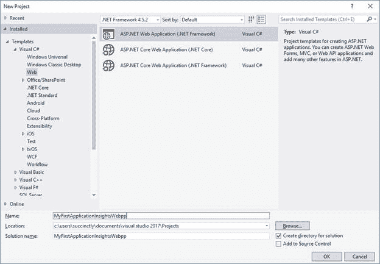
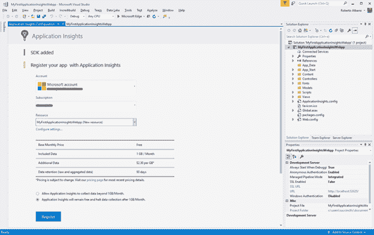
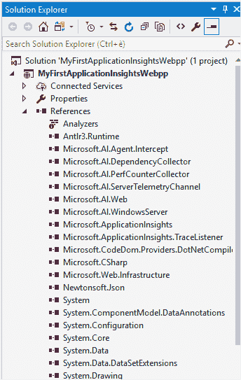
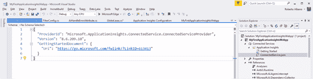
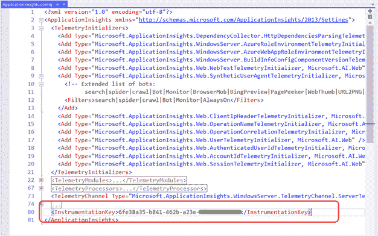
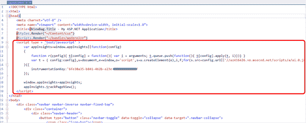

# 第八章 Visual Studio 和 SDK

是时候看看代码了。在所有关于配置和使用各种特性的章节之后，我们终于可以看到开发人员的观点了。

如果您从事与网络应用程序或服务相关的软件开发，Application Insights 有一个适用于几乎任何编程语言或技术的软件开发工具包，因此任何开发人员都可以轻松地使用它。

您可以在这里找到正确的应用洞察软件开发工具包[。如您所见，支持各种语言和框架，包括第三方供应商提供的一些语言和框架。每一项都将您连接到一个特定的页面，在那里您可以开始与应用洞察集成。这包含关于使用哪个软件开发工具包的有用信息。](https://docs.microsoft.com/en-us/azure/application-insights/app-insights-platforms)

在本书中，重点是微软的技术，所以我们将探索如何利用 Visual Studio 将 Application Insights 集成到基于 ASP.NET MVC 的 web 应用程序中的过程。

由于产品和技术之间的高度集成，在 Visual Studio 中使用应用洞察非常简单。

在以下示例中，我们将使用 Visual Studio Enterprise 2017。任何其他版本(如免费的社区版)也可以。使用 Visual Studio 2015 时会有一些小的差异，但两个版本的过程几乎相同。

我们将从在 Visual Studio 中创建一个新的 ASP.NET MVC 项目开始。



图 28:启动一个新项目

对于这个特殊的例子，选择没有身份验证的 ASP.NET MVC。

项目创建后，我们可以通过在**解决方案资源管理器**窗口中右键单击项目并从上下文菜单中选择**配置应用程序洞察**来添加应用程序洞察。

将出现一个页面，您可以从中选择订阅和其他信息，以便向 Application Insights 注册您的应用程序。在这个页面的底部，有使用免费账户的选项。



图 29:网络应用程序注册

激活应用程序洞察资源后，您使用以下代码执行的每个调用都将被收集到应用程序洞察中，并且可以从 Azure 门户的仪表板中看到:

系统.诊断.`Trace`。trace information(`"Information"`)；

系统.诊断.`Trace`。trace warning(`"Warning"`)；

系统.诊断.`Trace`。trace error(`"Error"`)；

过一会儿，网络应用程序将注册为在 Visual Studio 中本地使用遥测技术，而不是使用全新的应用程序洞察资源。您可以随时返回此页面激活 Azure 门户上的应用洞察资源。

如果您按照前面的步骤注册了 Application Insights，您将看到项目中的一些变化。您将在以下各节中看到的引用与 Visual Studio 中的一个项目相关。如果您使用其他语言或 ide 中的应用程序洞察，行为可能会有所不同。

首先，我们需要将所需的应用洞察程序集添加到我们的项目中。



图 30:项目参考

这些参考资料是 NuGet 在幕后添加的。添加了参考文献**微软. AI.*。dll** 和**微软。应用洞察*。dll** 到项目。

在项目中，一个新文件将被添加到**连接服务**部分。这将是 **ConnectedService.json** 配置文件。



图 31:连接的服务配置文件

一个新的**application insights . config**文件将出现在我们的项目中。

这是一个 XML 文件，保存了与项目中使用的资源相关的所有信息。在这里，我们将找到在整个项目中唯一标识资源的插装键(我们在[小节中谈到的插装键](03.html#_The_instrumentation_key))。



图 32:应用洞察配置文件

除了这个键，在遥测数据收集过程中还有其他参数，如模块和组件需要考虑。

配置的另一部分放在 **Web.config** 文件中。在这个 XML 文件中，您可以找到几个注册 Application Insights 模块的元素，这些模块用于跟踪发生的每个异常。

代码清单 1:对 Web.config 文件的更改

```cs
  <system.web>

  ...omitted...

  <httpModules>

  <add name="ApplicationInsightsWebTracking"    

  type="Microsoft.ApplicationInsights.Web.

  ApplicationInsightsHttpModule, Microsoft.AI.Web" />

  </httpModules>
    </system.web>
      ... omitted...

  <system.webServer>

  ... omitted...

  <modules>

  <remove name="ApplicationInsightsWebTracking" />

  <add name="ApplicationInsightsWebTracking" 

  type="Microsoft.ApplicationInsights.Web.

  ApplicationInsightsHttpModule, Microsoft.AI.Web"    

  preCondition="managedHandler"
  />

  </modules>
  </system.webServer>

```

这些参数对于应用洞察的错误处理非常重要。

### 剧本

由于我们可以通过重复的方式收集大量信息(例如，页面访问和请求来源)，Visual Studio 通过在该视图中放置一个直接从 Application Insights SDK 调用的 JavaScript 片段，帮助我们直接从项目的母版页中检索这些信息。

在我们的例子中，我们使用的是一个 ASP.NET MVC web 应用程序，这个片段可以在 **_Layout.cshtml** 视图中找到(这是这种 web 应用程序的一个母版页)。



图 33:应用洞察 JavaScript 片段

将代码片段放在这里，我们可以跟踪对使用这种布局的每个页面的所有访问，而不必将这段代码粘贴到每个视图中。

|  | 提示:当定期使用 ASP.NET MVC 时，我通常会从原始位置剥离这个片段，并将其放入部分视图中。当您的项目中有更多的布局视图时，这个策略将允许您更有效地重用这些代码。 |

如您所见，该片段引用了代码中使用的`InstrumentationKey` ，作为在 **Web.config** 文件中注册的密钥的副本。我们将在[中探索另一种方法，为不同的环境使用不同的仪表键](09.html#_Using_different_instrumentation)部分。

Visual Studio 自动为我们添加到 web 应用程序项目中的文件之一是**aihandleerrorattribute . cs**文件(包含在 **ErrorHandler** 文件夹中)。

该文件定义了以下类。

代码清单 AiHandleErrorAttribute 类

```cs
  [AttributeUsage(AttributeTargets.Class | AttributeTargets.Method, Inherited = true, AllowMultiple = true)] 
  public class AiHandleErrorAttribute : HandleErrorAttribute
  {

  public override void OnException(ExceptionContext filterContext)

  {

  if (filterContext != null
              && filterContext.HttpContext != null 

  && filterContext.Exception != null)

  {

  // If customError is
  Off, 

  // then AI HTTPModule will report the exception

  if
  (filterContext.HttpContext.IsCustomErrorEnabled)

  {   

  var ai = new
  TelemetryClient();

  ai.TrackException(filterContext.Exception);

  } 

  }

  base.OnException(filterContext);

  }
  }

```

该类处理异常并继承自`HandleErrorAttribute`类。它可以用来修饰其他类或方法，在这些类或方法中，我们可能会捕获一个异常，并将其发送到我们的应用程序洞察资源。

但是，如果我们搜索 **FilterConfig.cs** 文件(在 **App_Start** 文件夹中)，我们可以看到这个类用在`RegisterGlobalFilters`方法中，该方法的目的是注册用于传入请求的过滤器。

这意味着这个类的一个实例存在于 ASP.NET MVC 应用程序将用于每个请求的过滤器堆栈中，所以当抛出异常时，这个类将为我们向 Application Insights 注册它。

|  | 提示:如果 Web.config 文件中的自定义错误设置被关闭，请注意在使用此类时不要捕获异常。在这种情况下，异常将由应用洞察 HTTP 模块持有。 |

在代码清单 2 中，我们可以第一次看到`TelemetryClient`类。我们将在下一章详细讨论它。

让我们从 web 应用程序开始编写代码，并将数据记录到 Application Insights 中。