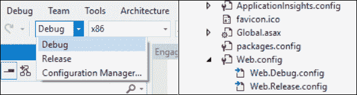

# 九、编写你的代码

在最后一章中，我们演示了 Visual Studio 如何创建一个可以用作应用程序洞察资源的项目。现在是时候收集我们想要跟踪的点了。

正如我们所看到的，使用 Application Insights，我们可以注册在我们的 web 应用程序中发生的任何事情。您可以通过代码编程实现这一点，使用大多数 web 开发语言和框架可用的 SDK。

在每个 SDK 中，都有一个标准的入口点来注册我们的应用洞察资源，这就是`TelemetryClient`类。

要开始使用`TelemetryClient`类，我们只需要几行代码。在下面的例子中，我们跟踪一个异常。

代码清单 3:使用远程客户端实例跟踪异常

```cs
  var ai = new TelemetryClient();
  ai.TrackException(ex);

```

在本例中，第一行代码创建了`TelemetryClient`类的新实例。它建立了与应用洞察资源的连接，该资源由所使用的工具键链接。

在下一行，调用`TrackException`方法，传递一个异常实例。

有了这两行代码，我们可以将整个异常发送到应用程序洞察资源。在那里我们会找到所有与之相关的信息，包括异常的来源、栈跟踪等等。

可以看到，这个例子是用 C#写的，所以可以从*服务器端*执行。有趣的是，我们甚至可以在*客户端*上拥有`TelemetryClient`类，使用相同的方法，提供相同的输入和输出。

表 7 包含`TelemetryClient`类的方法。其中一些方法是使用 JavaScript 代码段直接调用的(参见[脚本](08.html#_Scripts)部分)。

表 7: 遥测客户端方法

| 方法 | 描述 |
| --- | --- |
| `TrackAvailability` | 发送带有应用程序可用性信息的`AvailabilityTelemetry`对象 |
| `TrackDependency` | 发送一个带有应用程序中调用的外部依赖关系信息的`DependencyTelemetry`对象 |
| `TrackEvent` | 发送一个`EventTelemetry`对象以在度量资源管理器中显示 |
| `TrackException` | 发送一个`ExceptionTelemetry`对象以在诊断搜索中显示 |
| `TrackMetric` | 在度量资源管理器中发送用于聚合的`MetricTelemetry`对象 |
| `TrackPageView` | 发送一个`PageViewTelemetry`对象，其中包含应用程序中查看的页面的信息 |
| `TrackRequest` | 发送一个`RequestTelemetry`对象，其中包含关于应用程序处理的请求的信息 |
| `TrackTrace` | 发送带有跟踪信息的`TraceTelemetry`对象，以在诊断搜索中显示 |

每个方法都向应用洞察资源发送一个特定类的实例。发送的实例具有与事件或度量相关的所有信息，可以进行跟踪。所有这些方法都被重载以将原始信息作为参数而不是实例发送。

举个例子，假设你有以下变量。

代码清单 4:为请求遥测实例定义参数

```cs
  var ai = new TelemetryClient();
  string name = "myRequest";
  DateTimeOffset startTime = new DateTimeOffset(DateTime.Now);
  TimeSpan duration = new TimeSpan(0,0,0,0,250);
  string responseCode = "200";
  bool success = true;

```

您可以通过发送`RequestTelemetry`类的实例来跟踪请求。

代码清单 5:使用带有请求遥测实例的 TrackRequest 跟踪请求

```cs
  RequestTelemetry requestTelemetryInstance
  = new RequestTelemetry(name, startTime, duration, responseCode, success);
  ai.TrackRequest(requestTelemetryInstance);

```

或者，这可以通过使用构造函数的重载将值作为参数发送来实现。

代码清单 6:使用带有参数的 TrackRequest 跟踪请求

```cs
  ai.TrackRequest(name, startTime,
  duration, responseCode, success);

```

## 远程配置类

`TelemetryConfiguration`是另一个需要理解的重要类。它保存了与将使用 web 应用程序的应用程序洞察资源相关的所有信息。

如前所述，检测密钥存储在**application insights . config**文件中。

您可以使用默认构造函数(没有任何输入参数)创建`TelemetryClient`类的实例，或者使用它的重载。

在这两个构造函数中，该类使用`TelemetryConfiguration`的实例来连接到正确的应用洞察资源。

如果使用`TelemetryClient`的默认构造函数，这意味着使用`TelemetryConfiguration`类的单例实例。如果需要多个实例，必须管理自己的`TelemetryConfiguration`实例。

例如，假设我们使用默认构造函数创建`TelemetryClient`的一个实例。

代码清单 7: 使用默认构造函数的远程客户端实例化

```cs
  var ai = new TelemetryClient();

```

在幕后，这个类将使用以下`TelemetryConfiguration`的单例实例:

代码清单 8:远程配置单一实例

```cs
  TelemetryConfiguration.Active

```

这使用 ApplicationInsights.config 文件中的检测键。

但是，由于`InstrumentationKey` 是这个类的一个属性，我们可以更改这个值来连接到不同的键。我们将在下一节中讨论这一点，并看看如何根据不同的场景来管理不同的插装键。

回到`TelemetryClient`类，另一个构造函数接受一个`TelemetryConfiguration`类的实例作为输入参数。

代码清单 9:使用重载构造函数的远程客户端实例化

```cs
  TelemetryConfiguration config = TelemetryConfiguration.CreateDefault();
  config.InstrumentationKey
  = "myInstrumentationKey";
  var
  ai = new TelemetryClient(config);

```

通过使用此构造函数，您有责任为配置类中的资源设置正确的引用。

|  | 提示:在前面的清单中，我们使用了 CreateDefault 初始值设定项(从 ApplicationInsights.config 参数开始创建一个实例)，因为要使用默认构造函数手工初始化的属性列表很长。 |

## 针对各种环境使用不同的仪表键

如果您正在处理 web 应用程序，并且希望使用 Application Insights 资源来监视项目的调试版本和发布版本，建议您使用两种不同的资源，以避免来自开发环境的数据影响生产环境。

只需很少的努力和几行代码就可以实现这一点。

让我们开始创建应用洞察资源。当然，我们会创造两种不同的资源；在这个例子中，我们将这些标识为用于开发的 **ai_dev_resource** 和用于发布的 **ai_rel_resource** 。

|  | 注意:我们将使用 ASP.NET MVC 网络应用程序和 Visual Studio 创建这个例子。对于不同的语言和 IDEs，可能有一种等效的方法。 |

在这种类型的应用中，我们有一个**网络。配置**文件，包含所有关于 web 应用程序配置的信息。

使用 Visual Studio 中的解决方案配置功能，我们将默认创建一个调试配置和一个发布配置(但是如果需要，我们可以有更多的解决方案配置)。

对于每一个*解决方案配置*，Visual Studio 都会生成一个对应的*配置文件*，因此拥有调试和发布配置会在解决方案资源管理器:**网站中产生两个 XLST 文件。调试配置**和**网页。Release.config** 。这使我们能够用每个环境的正确参数来转换 **Web.config** 文件。



图 34:解决方案配置

对于本例，假设我们有以下仪表键:

*   **ai _ dev _ resource**=>a 11111111-a111-a111-a 1111111111111
*   **ai _ prod _ resource**=>b 22222222-b222-b222-b222222222222222

首先，在您的 **Web.config** 文件中，您需要在`appSettings`键中添加开发工具键:

代码清单 Web.config 文件中的检测键设置

```cs
  <appSettings>

  <!-- Application
  Insights -DEVELOPMENT- Instrumentation Key -->

  <add key="ApplicationInsightsInstrumentationKey" value=" a11111111-
     a111-a111-a111-a11111111111" />
  </appSettings>

```

然后必须在**网页中添加另一个仪表键。Release.config** 文件，带有一个 XML 转换规则，如下所示。

代码清单 11:发布(生产)的检测密钥转换设置

```cs
  <appSettings>

  <!-- Application
  Insights -PRODUCTION- Instrumentation Key -->

  <add key="ApplicationInsightsInstrumentationKey" value=" b22222222-
     b222-b222-b222-b22222222222" xdt:Transform="SetAttributes"    
     xdt:Locator="Match(name)"/>
  </appSettings>

```

使用这种配置替换，您可以确保在生产环境中部署代码时(通过使用发布解决方案配置)，检测密钥将具有正确的值。

请记住，这些设置**不会在运行时自动更改**仪表键。这只是一种模式，以保证在每种情况下，正确的密钥将针对正确的目标环境。它必须由代码加载，我们将在下一节中看到。

一旦添加了这些配置，我们需要了解如何在运行时分配检测键。

由于 Application Insights SDK 非常灵活，因此有可能在运行时更改当前资源的检测键的值。

为此，使用 **Global.asax** 文件，并在该文件内的类的`Application_Start`方法的末尾添加两行代码。

代码清单 12:定制应用洞察的资源加载

```cs
  public class MvcApplication : System.Web.HttpApplication
  {

  protected void
  Application_Start()

  {

      AreaRegistration.RegisterAllAreas();

  FilterConfig.RegisterGlobalFilters(GlobalFilters.Filters);

  RouteConfig.RegisterRoutes(RouteTable.Routes);

  BundleConfig.RegisterBundles(BundleTable.Bundles);

  // Load the
  instrumentation key from the configuration file

  var currentTelemetryKey
  System.Web.Configuration.

  WebConfigurationManager.

  AppSettings["ApplicationInsightsInstrumentationKey"];                       

  // Assign the
  instrumentation key to the running resource

  Microsoft.ApplicationInsights.

  Extensibility.TelemetryConfiguration.Active.

  InstrumentationKey = currentTelemetryKey;

  }
  }

```

此方法中的最后一行代码将通过从 **Web.config** 文件中读取来分配检测键的值；因此，如果您在生产环境中使用发布解决方案配置，您应该具有 **ai_prod_resource** 资源的`InstrumentationKey`值。

还有一个需要做小改动的地方:我们在[脚本](08.html#_Scripts)一节中谈到的 JavaScript 片段。

在这个片段中，我们将使用 Razor 语法加载包含我们提到的保存密钥的变量，而不是使用`InstrumentationKey`作为固定值。

Microsoft . application insights . extensibility .`TelemetryConfiguration`. active .
检测键

结果是这样的:

代码清单 13:页面视图跟踪的 JavaScript 片段

```cs
  <script type="text/javascript">

  var appInsights=window.appInsights||function(config){

  function r(config){t[config]=function(){var
  i=arguments;t.queue.push(function(){t[config].apply(t,i)})}}var t={config:config},u=document,e=window,o="script",s=u.createElement(o),i,f;for(s.src=config.url||"//az416426.vo.msecnd.net/scripts/a/ai.0.js",u.getElementsByTagName(o)[0].parentNode.appendChild(s),t.cookie=u.cookie,t.queue=[],i=["Event","Exception","Metric","PageView","Trace"];i.length;)r("track"+i.pop());return r("setAuthenticatedUserContext"),r("clearAuthenticatedUserContext"),config.disableExceptionTracking||(i="onerror",r("_"+i),f=e[i],e[i]=function(config,r,u,e,o){var s=f&&f(config,r,u,e,o);return s!==!0&&t["_"+i](config,r,u,e,o),s}),t

  }({
          instrumentationKey: "@(Microsoft.ApplicationInsights.Extensibility.TelemetryConfiguration.Active.InstrumentationKey)"

  });

  window.appInsights=appInsights;

  appInsights.trackPageView();
  </script>

```

使用这段代码，您将确保每个 HTML 页面都使用正确的工具键来跟踪页面视图。

从现在开始，您可以使用 **ai_dev_resource** 调试您的代码，而不会影响生产环境，生产环境将由 **ai_prod_resource** 监控。