# 十、应用洞察分析

Application Insights Analytics 是一个强大的工具，使用户能够搜索大量数据，然后在 Application Insights 资源中收集这些数据。它使用特定的语言在几秒钟内查询万亿字节的数据。

在接下来的几节中，我们将更详细地探讨这个工具，并对这种查询语言有更多的了解。

通过选择应用洞察资源的**概述**页面并搜索应用洞察**分析**图标，可从 Azure 门户获得该工具。

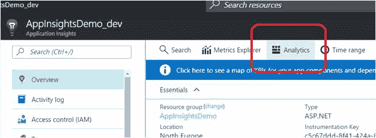

图 35:应用洞察分析按钮

使用这个按钮，您将登陆一个单独的门户，只专注于应用洞察分析，如图 36 所示。

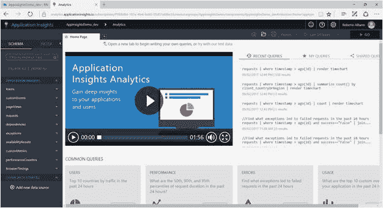

图 36:应用洞察分析门户

在这里，您可以查询遥测数据并导出结果。

在这个页面上，我们可以找到一个针对*用户*、*性能*、*错误*、*用法*主题的常见查询部分。这些是开始探索查询语言的有用示例。

通过了解查询语言的基础知识，您将能够检索比使用可用仪表板功能更多的数据。在我们深入研究查询语言之前，我们将预览一些您将在查询页面上找到的主要部分。

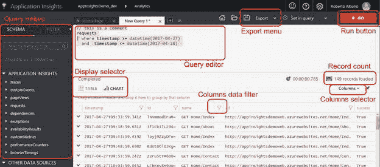

图 37:查询页面的预览

让我们从一个简单的查询示例开始。假设您想获取从 web 应用收到的最后五个请求的信息。

您需要查询您的应用洞察资源，以获取在您的遥测中注册的最后五个 HTTP 请求。

语法如下:

代码清单 14:返回最后五个请求的简单查询

```cs
  requests | limit 5

```

简单来说，所有的遥测数据都存储在一个大数据库中。该命令的第一行表示我们想要从中检索数据的表(在本例中，是**请求**表)。然后，用管道字符( **|** )分隔，是我们想要应用于该表的筛选子句，以从查询中获取适当的数据。您可以使用一个或多个过滤器，但是每个查询都需要以管道字符开始。

|  | 注意:不一定要每行写一个 filter 子句来执行查询，但是每行写一个可以提高可读性和性能。 |

要运行查询，请单击页面右上角的橙色**转到**按钮。图 38 显示了结果。

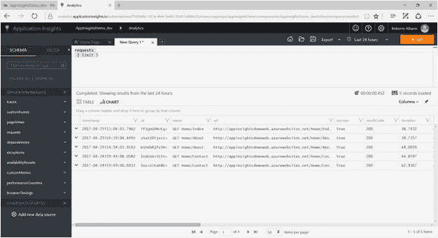

图 38:查询的一个基本例子

如您所见，页面显示了查询的结果(如果它是正确的并且有数据要显示)。网格显示找到的记录。每行的第一列包含一个人字形图标；单击此图标时，该行将展开以显示该记录的所有详细信息。

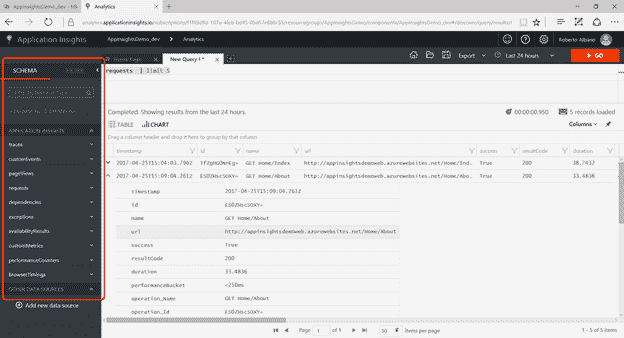

图 39:记录详情

无论您选择的日期范围如何，都有可能在几秒钟内检索到大量数据。请记住，数据的保留期为 90 天。

如图 39 所示，在查询编辑器的左侧，有一个工具箱，其中包含模式中所有可以查询的实体。您可以展开每一个，以查看可以在实体中找到的数据点(或字段，如果您将数据视为数据库的话)的列表。

您可以通过双击该工具箱中的任何项目，而不是将其键入编辑器，直接将其放入查询编辑器中。该工具箱对于制定标准化命令非常有用，并且为理解每个实体的数据点提供了一个很好的起点。

如果您想添加更多的过滤器，或者更一般地说，需要构建您的语句，自动完成功能可以帮助您。当在查询编辑器中编写代码时，您可以看到这个特性在起作用。

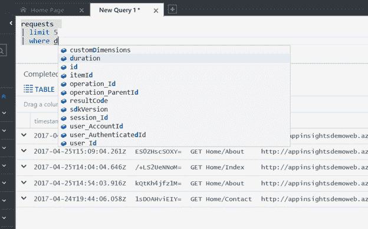

图 40:查询自动完成

### 选择列并显示列

当您执行查询时，您将检索您正在查询的表上的所有可用信息。但是如果你想在结果中指定你想要接收的字段，你应该使用 `project`关键字。例如，如果您只想从查询中接收两个字段，如`timestamp`和`url`，您可以编写以下查询。

代码清单 15:只返回两个字段的查询

```cs
  requests |
  limit 5
  | project timestamp,
  url

```

关键字`project`允许您只提取查询中指定的字段。这些将显示为列，您将在网格中看到。

此外，如果只想显示查询返回的列的子集，可以使用网格顶部右侧的选择器。

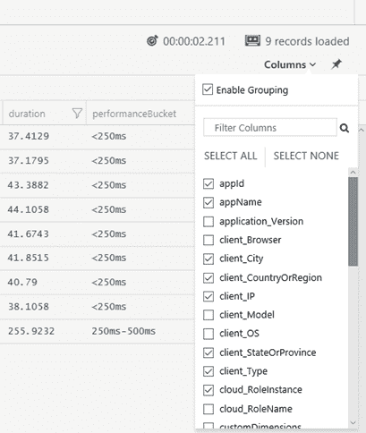

图 41:列选择器

您可以同时使用`project`关键字和**列**选择器；但是，选择器将只显示查询返回的列。未选择的列即使不显示也仍然会出现在结果中，如果导出整个查询结果，这些列也会出现在结果中。

您也可以使用每个列标题中的筛选符号来筛选网格中的数据。每个过滤器都会打开一个小的弹出窗口，用于输入过滤器值，如下图所示。

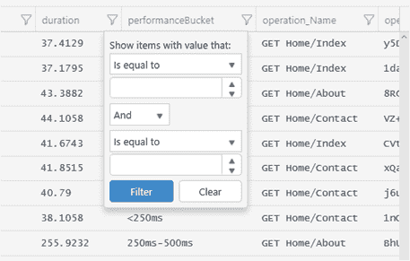

图 42:列数据过滤器

对于经常通过电子表格应用(如 Excel)管理数据的用户来说，此图像很熟悉，使用此类应用使用户能够对列应用详细的筛选器，以深入查看结果。

### 日期和时间表达式

在几乎每一种度量中，都有一个与事件发生的时刻相关的时间戳。当然，也可以在这个时间戳上应用过滤器。

对于时间过滤器语句，需要了解一些规则，以便在构建查询时更有效率。例如，如果您想要获取过去 24 小时的请求**，您可以编写如下查询。**

代码清单 16 :返回最后一天请求的查询

```cs
  requests |
  where timestamp >= ago(24h)

```

如果想从某个特定日期开始获取 的请求，可以编写如下查询。

代码清单 17:返回特定日期请求的查询

```cs
  requests |
  where timestamp >= datetime(2017-01-01)

```

通过使用特定的时间范围，您可以在过滤器中更加精确。

代码清单 18 :从特定时间范围返回请求的查询

```cs
  requests |
  where timestamp >= datetime(2017-01-01T00:00:00.000) and
  timestamp <= datetime(2017-01-31T23:59:59.999)

```

有相当多的时间过滤器可以在您的查询中使用；它们按字母顺序排列在这里:

*   `ago`
*   `datepart`
*   `dayofmonth`
*   `dayofweek`
*   `dayofyear`
*   `endofday`
*   `endofmonth`
*   `endofweek`
*   `endofyear`
*   `getyear`
*   `now`
*   `startofday`
*   `startofmonth`
*   `startofweek`
*   `startofyear`
*   `todatetime`
*   `totimespan`
*   `weekofyear`

当您运行查询时，结果将在网格中返回，如图 38 所示。这是一个平面可视化，有助于以简单的方式读取数据。

但是您可能需要保存您的数据，用不同的可视化方式理解它，或者对结果进行更多的分析。在这种情况下，您需要导出该数据或以网格以外的形式显示它。

如果您想保存您的数据，您可以使用页面顶部右侧集成的**导出**菜单进行导出。

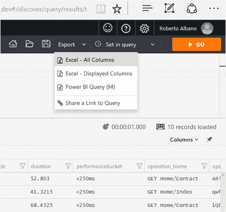

图 43:导出菜单

您可以选择将其导出到 Excel 文件，使用查询返回的所有列，或者通过选择 **Excel -所有列**或 **Excel -显示列**仅显示列。导出的文件将以. csv 扩展名保存，因此您可以在 Excel 或文本编辑器中打开它，以防您没有安装 Excel。

从同一个菜单中，您还可以使用 **Power BI 查询(M)** 选项(表示 M 语言的查询，或 Power Query M 公式语言)进行导出，因此它可以在 Excel 中使用或与 Power BI Desktop 应用一起使用。

导出的文件与。txt 扩展名。它包括如何在 Power BI 桌面应用中使用 Power Query 并将分析查询的结果直接输入应用的说明。

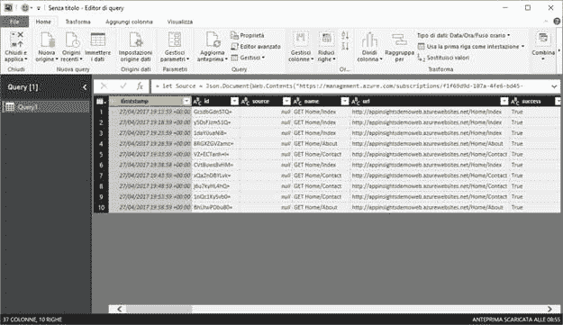

图 44:从 Power BI 桌面应用运行的电源查询

要从 Power BI 应用执行查询，用户必须使用有效凭据登录应用洞察资源。要了解如何为其他用户分配有效凭据，请参考[第 5 章，访问控制](05.html#_Chapter_5_)。

在同一菜单中，您还可以找到**共享查询链接**项目。它不是导出功能；相反，它会将一个链接复制到您的剪贴板，您可以与拥有运行查询的有效凭据的人共享该链接。在浏览器中粘贴此网址会将用户带到 Application Insights Analytics，运行共享查询并返回相同的结果。如果您需要通过电子邮件共享一组每次执行查询时都会更新的数据，则此功能会很有优势。

有时仅仅用一个网格很难分析数据。也许你需要评估一个特定的关键绩效指标，最好的方法是用图形表示，而不是像网格一样的平面可视化。为了实现这一点，应用洞察分析为网格提供了另一种图表表示。

让我们从一个例子开始。假设您有这样一个查询:

代码清单 19:在特定时间范围内返回有限数量请求的查询

```cs
  requests | where timestamp >=
  datetime(2017-04-27)
  and timestamp <= datetime(2017-04-28)| limit 10

```

该查询将返回一个类似于[图 38](#Figure38) 中的网格。在网格上方，可以找到两个标签:`TABLE`，代表网格可视化；和`CHART`，其代表如下图所示的图形显示。

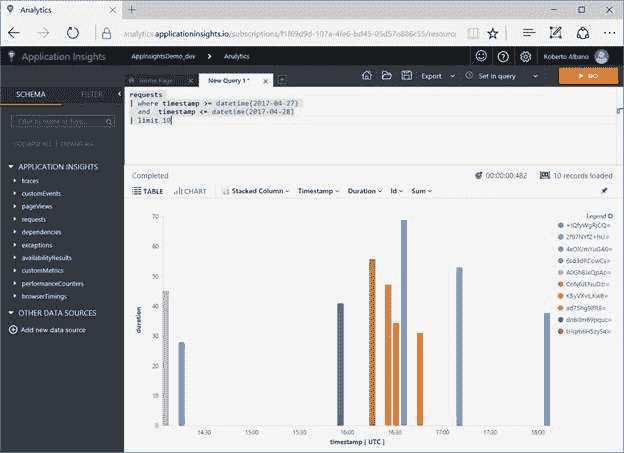

图 45:图表可视化

当你想*看到*的数据而不是*读到*的时候，图表比网格更有用。可以使用图表上方的条形选项将数据排列成不同的形状。

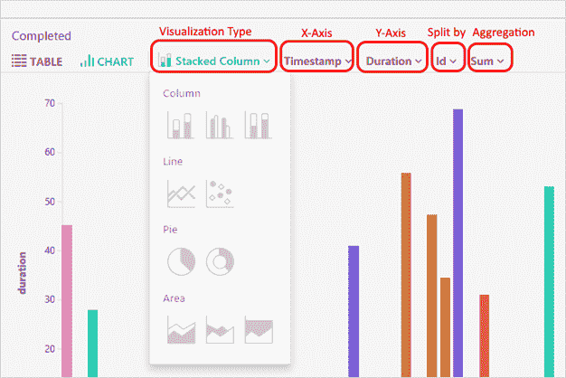

图 46:图表选项

可用选项包括:

*   可视化类型

*   这里您可以选择要显示的图表类型(如图 46 所示)，如下所示:

*   柱形图

*   堆叠列
*   未堆叠的列
*   100%堆叠列

*   折线图

*   线条
*   分散

*   饼图

*   馅饼
*   甜甜圈

*   面积图

*   堆叠面积
*   未堆叠区域
*   100%堆叠面积

*   x 轴

*   在这里，您可以选择图表横轴使用的字段。该列表显示了查询中可用的字段。

*   y 轴

*   在这里，您可以选择用于图表垂直轴的字段。该列表显示了查询中可用的字段。

*   分割方式

*   在这里，您可以选择一个或多个字段来表示图表。该列表显示了查询中可用的字段，不包括 x 轴和 y 轴上的字段。

*   聚合

*   在这里，您可以选择要应用于图表的聚合模式，选项如下:

*   总和
*   平均的
*   最低限度
*   最高的

图 45 和 46 使用**堆叠列**选项显示图表。如果您想一目了然地了解指标中的最佳和最差结果，这非常有用。不利的一面是，如果你有很多物品，可能会让人困惑。

如果您想快速查看摘要或完整数据集的百分比，可以使用**饼图**选项。例如，当您想查看访问者的原籍国时，可以使用它，如下图所示。

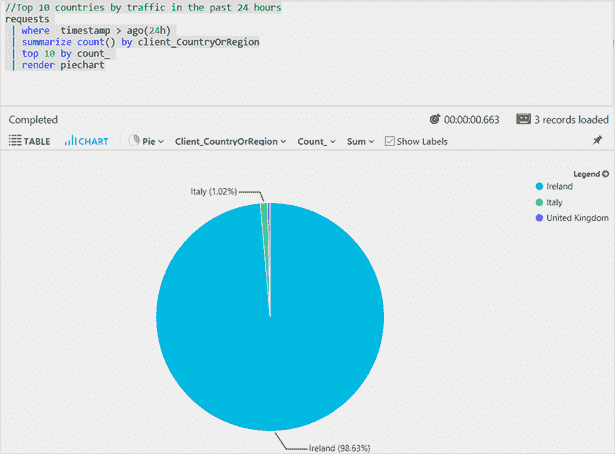

图 47:饼图