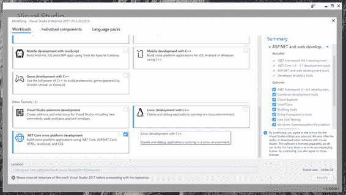
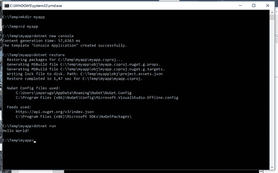
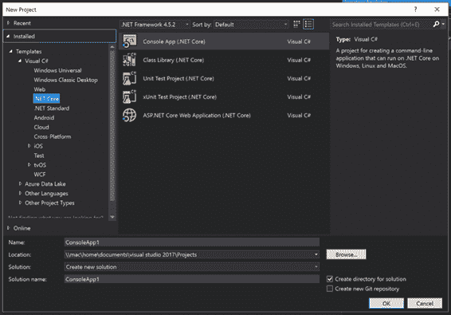
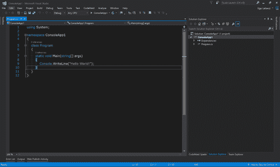

# 三、入门 .NET 核心

现在很清楚 ASP.NET 核心和.NET 核心 是什么，为什么创建它们，现在是时候看看如何安装它们以及如何用它们构建一个简单的应用了。

## 安装。网络核心

在 Windows 上安装相当容易。有了 Visual Studio 2017，很可能您已经安装了它。如果没有，请返回到 Visual Studio 安装程序，并确保您拥有。已选择净核心工作负载。



图 3-1: Visual Studio 安装程序

## 安装。苹果电脑(或 Linux)上的网络核心

的美.NET 核心 的特点是它也可以安装在 Mac(或者 Linux)上，而不需要依赖第三方框架，就像之前 Mono 所需要的那样。

Linux 的每个发行版都有自己独立的安装方式，但最终，这个过程归结为相同的原则:

*   安装先决条件并配置分发的包管理器。
*   调用包管理器来下载和安装.NET 核心 及其工具。

您可以在[官方网站上阅读特定于您的发行说明.NET 核心网站](https://www.microsoft.com/net/core)。作为一个例子，我们将向您展示如何在苹果电脑上安装。

代码清单 3-1

```cs

  >brew update
  >brew install openssl
  >ln -s /usr/local/opt/openssl/lib/libcrypto.1.0.0.dylib
  /usr/local/lib/
  >ln -s
  /usr/local/opt/openssl/lib/libssl.1.0.0.dylib /usr/local/lib/

```

一旦安装了所有这些先决条件，您就可以通过从[官方下载来下载并安装 macOS 的官方 SDK.NET 核心网站](https://www.microsoft.com/net/core)。

在 Linux 和 Mac 上，您没有 Visual Studio 来开发应用，但是您可以使用.NET 核心 SDK 或 Visual Studio Code，这是一个由微软和社区构建的轻量级、可扩展的跨平台文本编辑器。本书的最后一章详细介绍了您可以构建的每一个工具.NET 核心应用。

## 建筑你的第一.NET 核心应用

有了这么多可用的操作系统和工具，有很多方法可以创建一个..NET 核心 应用，但是所有的可视化工具都依赖于 SDK 来完成工作。在这里你要建立你的第一个.NET 核心 应用使用 *dotnet* 命令行界面(CLI)。

软件开发工具包的主要入口点是`dotnet`命令。根据所使用的动词，该命令可以做很多事情，从充当应用的宿主和运行者，到创建新项目、管理依赖关系和构建应用。

## 命令行工具

例如，让我们使用 dotnet CLI 创建一个简单的“Hello World”命令行应用。由于命令行工具是跨平台的，因此可以在任何受支持的系统上执行以下步骤:Windows、Mac 或 Linux。

打开命令提示符(或终端)，创建一个空文件夹，称之为`HelloWorldApp`。接下来，进入这个新创建的文件夹并启动`dotnet` `new console`命令。

现在，启动`dotnet restore`命令下载并安装所有包，最后启动`dotnet run`命令构建并运行项目。

图 3-2 显示了这个命令序列的输出。



图 3-2: dotnet 命令行界面

让我们深入了解发生了什么。

`dotnet new console` 命令将两个文件添加到文件夹中:

*   `HelloWorldApp.csproj`，一个包含项目配置的 XML 文件。
*   `Program.cs`，实际代码文件。

Program.cs 文件非常简单，因为它只打印了 Hello World！字符串到控制台。

代码清单 3-2

```cs
  using System;

  class Program
  {
      static void Main(string[] args)
      {
          Console.WriteLine("Hello World!");
      }
  }

```

更有意思的是看`HelloWorldApp.csproj`文件。如果您曾经完整地查看过 Visual Studio 使用的项目文件。NET 框架，你可能会奇怪我们为什么要讨论它。你很少看它们的内部，因为它们是用 XML 编写的黑盒。然而，有了.NET 核心，它们变得更容易手动修改或通过`dotnet`工具的其他命令修改。

代码清单 3-3

```cs
  <Project ToolsVersion="15.0" >
    <Import Project="$(MSBuildExtensionsPath)\$(MSBuildToolsVersion)\Microsoft.Common.props" />

    <PropertyGroup>
      <OutputType>Exe</OutputType>
      <TargetFramework>netcoreapp1.0</TargetFramework>
    </PropertyGroup>

    <ItemGroup>
      <Compile Include="**\*.cs" />
      <EmbeddedResource Include="**\*.resx" />
    </ItemGroup>

    <ItemGroup>
      <PackageReference Include="Microsoft.NETCore.App">
        <Version>1.0.1</Version>
      </PackageReference>
      <PackageReference Include="Microsoft.NET.Sdk">
        <Version>1.0.0-alpha-20161104-2</Version>
        <PrivateAssets>All</PrivateAssets>
      </PackageReference>
    </ItemGroup>

    <Import Project="$(MSBuildToolsPath)\Microsoft.CSharp.targets" />
  </Project>

```

除了 MSBuild 导入，该文件基本上分为三个区域:

*   第一个区域`<PropertyGroup>`包含用于配置构建的属性——在本例中，它的目标框架和输出类型。
*   第二个组`<ItemGroup>`包含将被编译或包含在构建中的所有文件。请注意，它使用了 globbing 语法(类似于 gitignore files 中使用的文件通配符扩展)，而不是像完整的一样单独列出每个文件。NET 框架。
*   最后一组`<ItemGroup>`仍然会列出当前项目所依赖的所有包或项目。

## 视觉工作室

另一种构建相同控制台应用的方法是使用 Visual Studio。首先，进入新项目对话框，选择**控制台应用(.NET 核心)** ，如图 3-3 所示。



图 3-3:使用 Visual Studio 2017 的新控制台应用

创建项目后，向控制台应用添加文本并启动项目。图 3-4 显示了加载了控制台应用的 Visual Studio。



图 3-4:你好世界应用

## 结论

在本章中，我们展示了为什么 2016 年是我们行业中为数不多的里程碑之一，以及 1996 年微软发布 ASP Classic 和 2002 年。NET 框架和 ASP.NET 发布。

.NET 核心 是微软网络开发栈的下一个发展。虽然与。. NET 框架作为。NET Framework 来自 ASP Classic，但它仍然改变了构建 ASP.NET 应用的基础。

您还看到了如何安装.NET 核心，以及如何使用的基础层构建一个简单的应用。NET 工具:网络命令行界面。有了这些知识，您就可以探索新的 ASP.NET 核心应用框架了。