# 四、ASP.NET 核心基础

在本章中，您将了解到最新版本的 ASP.NET 的主要创新，这些创新与之前的版本相比发生了巨大的变化。特别是，您将看到为什么 ASP.NET 核心被定义为一个精益框架，以及如何管理静态文件、不同的托管环境、异常、依赖注入以及最新版本的所有其他重要特性。

## 网络应用启动

你可以更好地理解如何使用.NET 核心，首先用 Visual Studio 2017 创建一个新的空应用程序。如果您更喜欢超轻 VS 代码而不是 Visual Studio，则必须使用命令行创建一个空模板。

从 Visual Studio 创建新的 ASP.NET 核心模板时，您有不同的选项。为了更好地理解 web 应用程序所需的流程和所有组件，空模板是最好的选择。

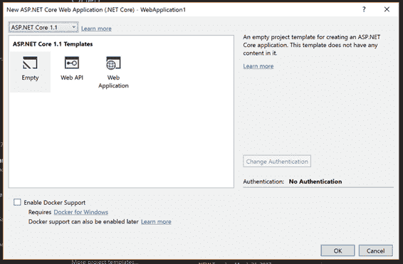

图 4-1:使用 Visual Studio 2017 的新网络应用程序

查看解决方案资源管理器，注意文件夹结构和文件与以前版本的 ASP.NET 非常不同。首先，有一个 wwwroot 文件夹包含所有静态文件。

在不同的部分，我们将解释如何使用 wwwroot 文件夹以及您需要它的原因。

项目根目录中的所有文件要么是新添加的，要么是它们改变了角色:

*   `Program.cs`是 web 应用的入口点；一切都从这里开始。正如我们在前面章节中提到的.NET 核心 主机只能运行控制台应用程序。因此，web 应用程序也是一个控制台应用程序。
*   `project.csproj`是一个基于 XML 的项目配置文件。它包含所有的包引用和构建配置。
*   `Startup.cs`并不完全是新的。如果你已经使用了 OWIN，你可能知道这个类的作用，但是我们可以肯定地说如果`Program.cs`是的入口点.NET 核心 应用，`Startup.cs`是 ASP.NET 核心 应用的入口点(之前我们用的是`global.asax`文件)。
*   `web.config`仍然在这里，但它几乎是空的，只用于告诉互联网信息服务(IIS)使用 ASP.NET 核心处理程序处理所有请求。

### 程序

如前所述，这个类是.NET 核心 应用程序，其作用是为 web 应用程序创建宿主。因为我们可以用.NET 核心，这是配置一切的正确地方。

代码清单 4-1

```cs
  using System;
  using System.Collections.Generic;
  using System.IO;
  using System.Linq;
  using System.Threading.Tasks;
  using Microsoft.AspNetCore.Hosting;

  namespace Syncfusion.Asp.Net.Core.Succinctly.WebAppStartup
  {
      public class Program
      {
          public static void Main(string[] args)
          {
              var host = new WebHostBuilder()
                  .UseKestrel()

  .UseContentRoot(Directory.GetCurrentDirectory())
                  .UseIISIntegration()
                  .UseStartup<Startup>()
                  .UseApplicationInsights()
                  .Build();

              host.Run();
          }
      }
  }

```

如您所见，这个类很简单，因为仅有的两个重要方法是`UseKestrel`和`UseIISIntegration`，分别用于在红隼或 IIS 上托管应用程序。

### Startup.cs

ASP.NET 核心管道从这里开始，从下面的代码中可以看出，模板几乎没有附带任何东西。

代码清单 4-2

```cs
  using System;
  using System.Collections.Generic;
  using System.Linq;
  using System.Threading.Tasks;
  using Microsoft.AspNetCore.Builder;
  using Microsoft.AspNetCore.Hosting;
  using Microsoft.AspNetCore.Http;
  using Microsoft.Extensions.DependencyInjection;
  using Microsoft.Extensions.Logging;

  namespace
  Syncfusion.Asp.Net.Core.Succinctly.WebAppStartup
  {
      public class Startup
      {
          // This method is called by the runtime. Use
  this method to add services to the container.
          // For more information on how to configure
  your application, visit http://go.microsoft.com/fwlink/?LinkID=398940
          public void
  ConfigureServices(IServiceCollection services)
          {
          }

          // This method is called by the runtime. Use
  this method to configure the HTTP request pipeline.
          public void Configure(IApplicationBuilder
  app, IHostingEnvironment env, ILoggerFactory loggerFactory)
          {
              loggerFactory.AddConsole();

              if (env.IsDevelopment())
              {
                  app.UseDeveloperExceptionPage();
              }

              app.Run(async (context) =>
              {
                  await
  context.Response.WriteAsync("Hello World!");
              });
          }
      }
  }

```

这里重要的是配置依赖注入的方法`ConfigureServices`(我们将在本章后面讨论)和注册和配置所有需要的中间件组件的方法`Configure`。

|  | 提示:我们已经写了一本关于 OWIN 的书，所以如果你不知道什么是中间件组件或者如何使用它，我们建议你阅读免费的电子书 [OWIN 简洁地](https://www.syncfusion.com/resources/techportal/details/ebooks/owin)，可从 Syncfusion 获得。 |

`app.Run`方法是内联中间件组件的一个完美例子。在这种情况下，它是没有用的，因为 web 应用程序将总是返回文本字符串“Hello World！”，但可以添加更复杂的逻辑(即身份验证、监控、异常处理等)。

## 依赖注入

ASP.NET 核心最大的新特性之一是包含了一种直接在基础库中处理依赖关系的方法。这有三大好处:

*   第一，意味着开发者不再有不使用它的借口；而在此之前，这基本上是留给他们的良心。
*   其次，您不需要使用第三方库。
*   最后，所有的应用框架和中间件组件都依赖于这个中心配置，所以不需要像以前那样，在不同的地方以不同的方式配置依赖注入。

### 什么是依赖注入？

在了解如何在 ASP.NET 核心应用程序中使用依赖注入之前，让我们看看它是什么，以及为什么使用它很重要。

为了易于维护，系统通常由许多类组成，每个类都有非常具体的职责。例如，如果您想要构建一个发送电子邮件的系统，您可能有系统的主要入口点和一个负责格式化文本的类，然后是一个负责实际发送电子邮件的类。

这种方法的问题是，如果对这些附加类的引用直接保存在入口点内，那么在不接触主类的情况下，就不可能更改助手类的实现。

这就是依赖注入(通常称为 DI)发挥作用的地方。高级模块不是直接实例化低级类，而是从外部接收实例，通常作为其构造函数的参数。

罗伯特·马丁更正式地描述了，以这种方式构建的系统遵循五个固体原则之一，依赖性反转原则:

高级模块不应该依赖于低级模块。两者都应该依赖于抽象。

抽象不应该依赖于细节。细节应该依赖于抽象。

——罗伯特·c·“鲍勃叔叔”马丁

虽然手动创建和注入对象可以在小型系统中工作，但是当系统变大并且需要数百或数千个类时，这些对象可能变得不可管理。为了解决这个问题，需要另一个类:一个工厂，它接管系统中所有对象的创建，注入正确的依赖关系。这个类叫做*容器*。

该容器被称为控制的*反转* (IoC)容器，保存了所有需要的接口和实现它们的具体类的列表。当请求任何类的实例时，它会查看它需要的依赖项，并根据它保存的列表传递它们。这样，用几行代码就可以很容易地创建非常复杂的对象图。

除了管理依赖关系，这些 IoC 容器还管理它们创建的对象的生存期。他们知道他们是可以重用一个实例，还是需要创建一个新实例。

这是一个关于软件质量的非常重要和复杂的话题的简短介绍。关于依赖注入和一般的固体原理，已经有无数的文章和书籍。罗伯特·c·“鲍勃叔叔”马丁或马丁·福勒的文章是一个很好的起点。

### 在 ASP.NET 核心配置依赖注入

现在您已经理解了在应用程序中使用 DI 的重要性，您可能会想知道如何配置它。其实很容易。这一切都发生在`ConfigureServices`法中。

代码清单 4-3

```cs
  public void
  ConfigureServices(IServiceCollection services)
  {
    //Here goes the configuration
  }

```

该方法接受的参数类型为`IServiceCollection`。这是容器用来跟踪应用程序所需的所有依赖项的列表，因此您可以将类添加到这个集合中。

有两种类型的依赖项可以添加到服务列表中。

首先，有框架工作所需的，它们通常使用扩展方法配置，如`AddServiceName`。比如要用 ASP.NET 核心 MVC，就需要写`services.AddMvc()`这样所有的控制器和过滤器都自动添加到列表中。另外，如果要使用实体框架，需要用`services.AddDbContext<ExampleDbContext>(...)`添加`DBContext`。

然后是特定于应用程序的依赖关系；必须通过指定具体的类及其实现的接口来单独添加它们。因为您是自己添加的，所以您也可以指定服务的生存期。ASP.NET 核心 IoC 容器中有三种生命周期，每一种都必须使用不同的方法添加。

第一个是**瞬**。这个生命周期用于不包含任何状态并且实例化速度快的轻量级服务。它们是使用方法`services.AddTransient<IClock,Clock>()`添加的，每次需要时都会创建一个新的类实例。

第二个生命周期是**范围的**。这通常用于包含仅对当前请求有效的状态的服务，如存储库和数据访问类。注册为作用域的服务将在请求开始时创建，并且每次在同一请求中需要该类时，都将重用同一实例。使用方法`services.AddScoped<IRepository, Repository>()`添加它们。

最后一个生命周期叫做 **Singleton** ，顾名思义，以这种方式注册的服务将像 Singleton 一样工作。它们是在第一次需要时创建的，并在应用程序的其余部分重用。这种服务通常保存应用程序状态，如内存缓存或类似的问题。它们通过`services.AddSingleton<IApplicationCache, ApplicationCache>()`方法添加。

### 使用依赖注入

现在让我们来看看 DI-IoC 如何在 ASP.NET MVC 应用程序中使用的一个例子。ASP.NET MVC 将在后面的章节中详细介绍，所以如果有些东西看起来不熟悉，不要担心；只需关注依赖关系是如何配置和重用的。

要使用依赖注入，您需要四个类:

*   需要使用外部服务的类，也称为消费者类。在我们的例子中，它是一个 ASP.NET MVC 控制器。
*   定义外部服务功能的接口，在我们的示例中，它只是给出一天中的时间。
*   实际实现接口的类。
*   将保存配置的 Startup.cs 文件。

#### 界面

首先，你必须定义服务的接口，这是消费者唯一依赖的东西。

代码清单 4-4

```cs
  public interface IClock
  {
      DateTime GetTime();
  }

```

#### 具体实施

一旦定义了接口，就需要实现执行实际工作的具体类。

代码清单 4-5

```cs
  public class Clock: IClock
  {
      public DateTime GetTime()
      {
          return DateTime.Now;
      }
  }

```

#### 消费者控制器

为了这个例子，您将稍微修改默认项目模板附带的`HomeController`。最重要的变化是增加了一个构造函数和一个私有变量来保存外部依赖项的引用。

代码清单 4-6

```cs
  private readonly IClock _clock;

  public HomeController(IClock clock)
  {
      _clock = clock;
  }

```

显然，你也必须以某种方式使用依赖关系。对于本例，只需通过修改`About`动作方法，在“关于”页面中写入当前时间即可。

代码清单 4-7

```cs
  public IActionResult About()
  {
      ViewData["Message"] = $"It is
  {_clock.GetTime().ToString("T")}";

      return View();
  }

```

下面的列表是完整的文件。

代码清单 4-8

```cs
  public class HomeController :
  Controller
  {
      private IClock _clock;

      public HomeController(IClock clock)
      {
          _clock = clock;
      }

      public IActionResult Index()
      {
          return View();
      }

      public IActionResult About()
      {
          ViewData["Message"] = $"It is
  {_clock.GetTime().ToString("T")}";

          return View();
      }

      ...

  }

```

#### 通过配置将所有连接在一起

现在所有的元素都到位了，您只需要配置框架，让它在所有声明类型为`IClock`的依赖项作为构造函数参数的对象中注入正确的类(`Clock`)。你已经看到了如何通过`ConfigureServices`方法做到这一点。

代码清单 4-9

```cs
  public void
  ConfigureServices(IServiceCollection services)
  {
      // Add framework services.
      services.AddMvc();

      // Add application services.
      services.AddTransient<IClock, Clock>();
  }

```

第一行将应用程序配置为使用 ASP.NET 核心 MVC，第二行添加了我们简单的时钟服务。我们已经展示了如何在 ASP.NET 应用程序中使用依赖注入，该应用程序使用一个非常简单的外部服务，只需要给出时间，但是所需的主要元素都在那里:

*   通过构造函数中的参数(通过引用它们的接口)声明其依赖关系的使用者类。
*   服务的接口。
*   具体实施。
*   将接口和实现绑定在一起并通知容器它们的存在的配置。

## 环境

我们部署的每个应用程序都需要处理至少两个或更多的环境。例如，在一个小应用程序中，我们有开发环境(也称为 dev)、生产环境，在某些情况下还有登台环境。

更复杂的项目需要管理多个环境，如质量保证(QA)、用户验收测试(UAT)、试生产等。在这本书里，我们只展示了 ASP.NET 核心的开箱即用；但是，您可以轻松理解如何添加新环境。

框架中包含的 ASP.NET 核心我最喜欢的特性之一是所谓的**托管环境管理**。它允许您在多种环境下无摩擦地工作。但是在深入研究这个特性之前，您必须了解开发人员需要什么。

### 老办法

一个好的开发人员永远不应该在生产数据库、生产存储、生产机器等等上工作。通常，在. NET 应用程序中，开发人员使用 web.config 文件中的`applicationSettings`部分结合**配置转换语法**(更多信息请参见[【MSDN】](https://msdn.microsoft.com/en-us/library/dd465326(v=vs.110).aspx))和[预处理器指令](https://msdn.microsoft.com/en-us/library/ed8yd1ha.aspx)来管理这个问题。

这种方法很棘手，需要您为每个环境构建不同的应用程序，因为配置转换和预处理器指令是在编译时应用的。最后但同样重要的是，这种方法使您的代码难以阅读和维护。

您可能在前面的章节中已经注意到，web.config 文件仅用于配置 AspNetCoreModule，以防我们的应用程序必须托管在互联网信息服务(IIS)上；否则，就没用了。

出于这个原因，不要使用配置转换方法——使用更酷的方法。

### 新进场

ASP.NET 核心提供了一个名为 IHostingEnvironment 的界面，该界面自我们的应用程序首次运行以来就一直可用。这意味着如果我们需要的话，我们可以很容易地在 Startup.cs 文件中使用它。

要知道，IHostingEnvironment 的实现读取一个名为 ASPNETCORE_ENVIRONMENT 的特定环境变量，并检查其值。如果是`Development`，则表示您正在开发模式下运行应用程序。如果是`Staging`，您正在以分段模式运行应用程序。因此，它适用于您需要管理的所有环境。

因为这种方法基于环境变量，所以配置文件之间的切换发生在运行时，而不是像老 ASP.NET 那样在编译时。

### Visual Studio

Visual Studio 有一个*运行*按钮，这对于开发人员来说非常棒，因为它运行附加调试器的应用程序。但是当你按下运行按钮时，Visual Studio 会使用什么环境呢？

默认情况下，Visual Studio 使用开发模式，但是如果您想要更改它或配置一个新环境，您可以通过查看应用程序的“属性”文件夹中可用的文件 launchSettings.json 来轻松实现。

如果你打开它，你应该有这样的东西:

代码清单 4-10

```cs
  {
      "iisSettings": {
          "windowsAuthentication": false,
          "anonymousAuthentication": true,
          "iisExpress": {
              "applicationUrl": "http://localhost:34081/",
              "sslPort": 0
          }
      },
      "profiles": {
          "IIS
  Express": {
              "commandName": "IISExpress",
              "launchBrowser": true,
              "environmentVariables": {
                  "ASPNETCORE_ENVIRONMENT": "Development"
              }
          },
          "Syncfusion.Asp.Net.Core.Succinctly.Environments": {
              "commandName": "Project",
              "launchBrowser": true,
              "launchUrl": "http://localhost:5000",
              "environmentVariables": {
                  "ASPNETCORE_ENVIRONMENT": "Development"
              }
          }
      }

```

`iisSettings`部分包含所有与 IIS Express 相关的设置，而配置文件部分包含红隼配置。如果您熟悉 JSON 格式，您可以按照下面描述的步骤在 Visual Studio 中编辑所有这些值。

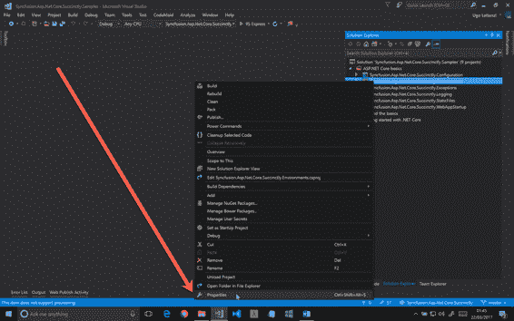

图 4-2:更改 IIS 快速设置 1

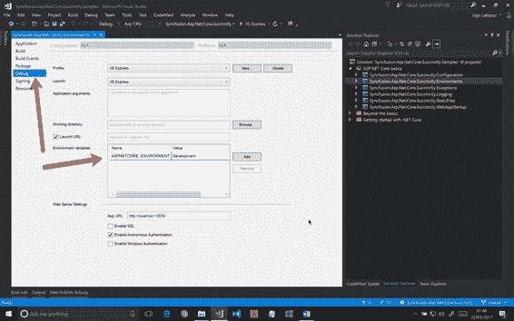

图 4-3:更改 IIS 快速设置 2

从这里，您还可以使用顶部的下拉菜单更改红隼的设置。如果您更喜欢直接使用 JSON，并且想要更改环境，请更改`ASPNETCORE_ENVIRONMENT`的值，然后保存文件或使用我们的设置在配置文件部分添加一个新项目。

#### IHostingEnvironment

有时候，web 应用程序需要的不仅仅是将连接字符串从开发人员数据库切换到生产数据库。例如，您可能需要查看错误的栈跟踪，以防在本地计算机上运行应用程序，或者您可能需要在生产版本中向最终用户显示错误页面。

有几种方法可以做到这一点。最常见的无疑是将`IHostingEnvironment`接口注入到你的构造器中，并使用它来改变你的 app 的行为。下面的简单代码是一个可能的启动类。

代码清单 4-11

```cs
  using System;
  using System.Collections.Generic;
  using System.Linq;
  using System.Threading.Tasks;
  using Microsoft.AspNetCore.Builder;
  using Microsoft.AspNetCore.Hosting;
  using Microsoft.AspNetCore.Http;
  using Microsoft.Extensions.DependencyInjection;
  using Microsoft.Extensions.Logging;

  namespace
  Syncfusion.Asp.Net.Core.Succinctly.Environments
  {
      public class Startup
      {
          private IHostingEnvironment _env;

          public Startup(IHostingEnvironment env)
          {
              _env = env
          }

          // This method is called by the runtime. Use
  this method to add services to the container.
          // For more information on how to configure
  your application, visit http://go.microsoft.com/fwlink/?LinkID=398940
          public void
  ConfigureServices(IServiceCollection services)
          {
          }

          // This method is called by the runtime. Use
  this method to configure the HTTP request pipeline.
          public void Configure(IApplicationBuilder
  app)
          {
              if (_env.IsDevelopment())
              {
                  app.UseDeveloperExceptionPage();
              }

              // ...
          }
      }
  }

```

在本例中， **DeveloperExceptionPage 中间件**仅在应用程序以开发模式运行的情况下使用，这正是我们想要的。

您在这个类中所做的可以在您的代码的任何部分中重复，作为控制器、服务，或者它需要在不同的环境中有所不同。

### 创业班

`Startup`类绝对是您的应用程序中最重要的类，因为它定义了您的 web 应用程序的管道，并且注册了所有需要的中间件组件。
因此，它可能非常复杂，有很多行代码。如果加上对环境的检查，一切都可能变得更加复杂，难以阅读和维护。

因此，ASP.NET 核心允许您使用不同的启动类:一个用于您想要管理的每个环境，一个用于不同的“配置”方法。

让我们看看程序. cs 文件:

代码清单 4-12

```cs
  public class Program
  {
      public static void Main(string[] args)
      {
          var host = new WebHostBuilder()
              .UseKestrel()

  .UseContentRoot(Directory.GetCurrentDirectory())
              .UseIISIntegration()
              .UseStartup<Startup>()
              .Build();

          host.Run();
      }
  }

```

方法`.UseStartup<Startup>()`很巧妙。如果您遵循正确的约定(方法名+环境名)，它可以在不同的类之间自动切换。

比如复制`Startup`类并重命名为`StartupDevelopment`，扩展方法会在开发环境中自动使用新的。

您可以对`Startup`类方法使用相同的约定。所以，复制 Startup.cs 文件的方法`Configure`，称之为`ConfigureDevelopment`，只有在开发环境中才会调用，而不是原来的方法。

### 创造自己的环境

我们已经提到了像用户验收测试(UAT)或者质量保证(QA)这样的环境，但是`IHostingEnvironments`界面并没有提供`IsUAT()`或者`IsQualityAssurance`这样的方法，那么如何创建呢？

如果你仔细想想，答案很简单。使用命令外壳(即`QualityAssurance`)中的 set 命令为`ASPNETCORE_ENVIRONMENT` 变量分配一个新值，并创建如下扩展方法就足够了:

代码清单 4-13

```cs
  using Microsoft.AspNetCore.Hosting;

  namespace
  Syncfusion.Asp.Net.Core.Succinctly.Environments.Extensions
  {
      public static class HostingEnvironmentExtensions
      {
          public static bool IsQualityAssurance(this
  IHostingEnvironment hostingEnvironment)
          {
              return
  hostingEnvironment.EnvironmentName == "QualityAssurance";
          }
      }
  }

```

现在，继续前面的例子，我们可以像这样使用扩展方法:

代码清单 4-14

```cs
  using System;
  using System.Collections.Generic;
  using System.Linq;
  using System.Threading.Tasks;
  using Microsoft.AspNetCore.Builder;
  using Microsoft.AspNetCore.Hosting;
  using Microsoft.AspNetCore.Http;
  using Microsoft.Extensions.DependencyInjection;
  using Microsoft.Extensions.Logging;
  using Syncfusion.Asp.Net.Core.Succinctly.Environments.Extensions;

  namespace
  Syncfusion.Asp.Net.Core.Succinctly.Environments
  {
      public class Startup
      {
          private IHostingEnvironment _env;

          public Startup(IHostingEnvironment env)
          {
              _env = env
          }

          // This method is called by the runtime. Use
  this method to add services to the container.
          // For more information on how to configure
  your application, visit http://go.microsoft.com/fwlink/?LinkID=398940
          public void
  ConfigureServices(IServiceCollection services)
          {
          }

          // This method is called by the runtime. Use
  this method to configure the HTTP request pipeline.
          public void Configure(IApplicationBuilder
  app)
          {
              if (_env.IsDevelopment() || _env.
  IsQualityAssurance())
              {
                  app.UseDeveloperExceptionPage();
              }

              // ...
          }
      }
  }

```

在后续章节中，您将看到如何在视图或配置文件中使用`IHostingEnvironments`。

## 静态文件

ASP.NET 核心的一个主要特点是，它可以像你喜欢的那样瘦。这意味着你要对你将要放入应用程序的内容负责，但这也意味着你可以让应用程序变得非常简单和快速。

事实上，如果您从一个空的 ASP.NET 核心网络应用程序模板开始您的项目，该应用程序将无法提供静态文件。如果你想这样做，你必须添加和配置一个特定的包。

一个常见的问题是“如果所有网站都需要静态文件，为什么默认不支持静态文件？”

事实是，并不是所有的网站都需要提供静态文件，尤其是在高流量的应用程序上。在这种情况下，静态文件应该由内容交付网络(CDN)托管。

此外，您的网络应用程序可以是一个应用编程接口应用程序，它通常使用 JSON 或 XML 格式而不是图像、样式表和 JavaScript 来提供数据。

### 配置静态文件

通过阅读这本书，您将会看到，大多数配置都是由 NuGet 上可用的中间件组件管理的。在这种情况下也是如此；您必须安装一个特定的包并配置它的中间件。

要安装的软件包是**微软。静态文件**。您可以使用包管理器获取它。

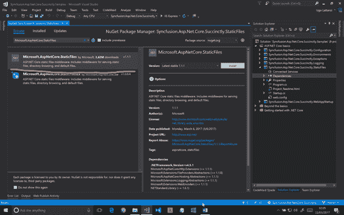

图 4-4:使用 NuGet 安装静态文件包

代码清单 4-15

```cs
  using
  Microsoft.AspNetCore.Builder;
  using Microsoft.AspNetCore.Http;
  using Microsoft.Extensions.DependencyInjection;

  namespace
  Syncfusion.Asp.Net.Core.Succinctly.StaticFiles
  {
      public class Startup
      {
          // This method is called by the runtime. Use
  this method to add services to the container.
          // For more information on how to configure
  your application, visit http://go.microsoft.com/fwlink/?LinkID=398940
          public void
  ConfigureServices(IServiceCollection services)
          {
          }

          // This method is called by the runtime. Use
  this method to configure the HTTP request pipeline.
          public void Configure(IApplicationBuilder
  app)
          {
              app.UseStaticFiles();

              app.Run(async context => { await
  context.Response.WriteAsync("Hello World!"); });
          }
      }
  }

```

你差不多准备好了。最后一点，也是最重要的一点，需要知道的是项目根目录中的 **wwwroot** 文件夹将包含所有的静态文件，所以如果您想要为请求 http://localhost:5000/image1 . jpg 提供一个名为 image1.jpg 的文件，您必须将它放入 wwwroot 文件夹的根目录中，而不是像以前版本的 ASP.NET 那样放在项目文件夹的根目录中。

#### 单页申请

与 ASP.NET 核心应用程序相结合的静态文件中间件组件可能非常有用的另一个场景是用于单页应用程序的 web 应用程序。

描述 SPA 含义的最佳方式是通过维基百科的定义:

单页应用程序(SPA)是适合单个网页的 web 应用程序或网站，其目标是提供类似于桌面应用程序的用户体验。

基本上，大部分业务逻辑都存在于客户端。服务器不需要呈现不同的视图；它只是向客户端公开数据。这得益于 JavaScript(结合了 Angular、React、Aurelia 等现代框架)和一组 API(在我们的例子中，是用 ASP.NET MVC Core 开发的)。

如果没有服务器端渲染，当浏览器调用根域时，web 服务器必须返回一个静态文件([http://www.mysite.com](http://www.mysite.com))。为此，您必须将默认文档配置到您的`Startup`类的`Configure`方法中。

如果您对预配置的默认文档没有意见(**default.htm**、**default.html**、**index.htm**、**index.html**)这样添加`UseFileServer`就足够了:

代码清单 4-16

```cs
  using
  Microsoft.AspNetCore.Builder;
  using Microsoft.AspNetCore.Http;
  using Microsoft.Extensions.DependencyInjection;

  namespace
  Syncfusion.Asp.Net.Core.Succinctly.StaticFiles
  {
      public class Startup
      {
          // This method is called by the runtime. Use
  this method to add services to the container.
          // For more information on how to configure
  your application, visit http://go.microsoft.com/fwlink/?LinkID=398940
          public void
  ConfigureServices(IServiceCollection services)
          {
          }

          // This method is called by the runtime. Use
  this method to configure the HTTP request pipeline.
          public void Configure(IApplicationBuilder
  app)
          {
              // app.UseStaticFiles();
              app.UseFileServer();

              app.Run(async context => { await
  context.Response.WriteAsync("Hello World!"); });
          }
      }
  }

```

否则，如果需要使用具有不同名称的特定文件，您可以覆盖默认配置，并将您喜欢的文件指定为默认文档:

代码清单 4-17

```cs
  using Microsoft.AspNetCore.Builder;
  using Microsoft.AspNetCore.Http;
  using Microsoft.Extensions.DependencyInjection;

  namespace
  Syncfusion.Asp.Net.Core.Succinctly.StaticFiles
  {
      public class Startup
      {
          // This method is called by the runtime. Use
  this method to add services to the container.
          // For more information on how to configure
  your application, visit http://go.microsoft.com/fwlink/?LinkID=398940
          public void
  ConfigureServices(IServiceCollection services)
          {
          }

          // This method is called by the runtime. Use
  this method to configure the HTTP request pipeline.
          public void Configure(IApplicationBuilder
  app)
          {
              // app.UseStaticFiles();

              var options = new DefaultFilesOptions();
              options.DefaultFileNames.Clear();
              options.DefaultFileNames.Add("mydefault.html");
              app.UseDefaultFiles(options);
              app.UseFileServer();

              app.Run(async context => { await
  context.Response.WriteAsync("Hello World!"); });
          }
      }
  }

```

## 错误处理和异常页面

你可以写出世界上最好的代码，但你必须接受这样一个事实:错误是存在的，也是生活的一部分。从某个角度来看，你可以说一个好的应用程序是能够在最短的时间内识别错误并向用户返回最佳反馈的应用程序。

为了实现这个目标，您需要处理不同的参与者，比如日志框架、异常处理和自定义错误页面。

我们在本章后面专门讨论了日志框架。这就是为什么我们没有在这里展示如何配置日志输出。目前，只要知道现成的 ASP.NET 核心记录所有异常就足够了，因此您不需要创建特定代码的异常中间件组件来记录未处理的异常。

当然，如果您不喜欢框架附带的东西，您仍然有机会编写我们自己的异常处理程序。首先要做的是向空应用程序中抛出一个异常。

代码清单 4-18

```cs
  using System;
  using Microsoft.AspNetCore.Builder;
  using Microsoft.AspNetCore.Http;
  using Microsoft.AspNetCore.Http.Extensions;
  using Microsoft.Extensions.DependencyInjection;

  namespace
  Syncfusion.Asp.Net.Core.Succinctly.Exceptions
  {
      public class Startup
      {
          // This method is called by the runtime. Use
  this method to add services to the container.
          // For more information on how to configure
  your application, visit http://go.microsoft.com/fwlink/?LinkID=398940
          public void ConfigureServices(IServiceCollection
  services)
          {
          }

          // This method is called by the runtime. Use
  this method to configure the HTTP request pipeline.
          public void Configure(IApplicationBuilder
  app)
          {
              app.Run(async context =>
              {
                  if
  (context.Request.Query.ContainsKey("throw"))
                  {
                      throw new
  Exception("Exception triggered!");
                  }

                  await
  context.Response.WriteAsync("Hello World!");
              });
          }
      }
  }

```

如果运行应用程序，并像这样将名为`throw`的变量添加到查询字符串中，http://localhost:5000/？throw(在这种情况下，应用程序使用 Kestrel 以默认配置运行)—您应该会收到如下输出(尽管每个浏览器的输出页面可能不同):

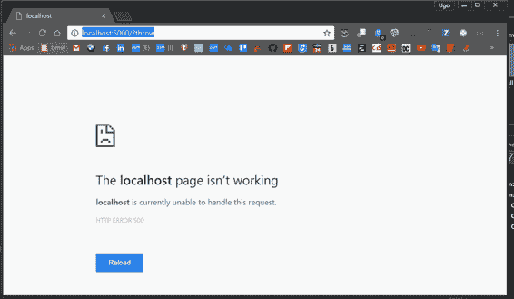

图 4-5:默认 500 错误

### 开发者异常页面

正如你所看到的，没有有用的信息，反馈也不友好。这是因为出于安全原因，ASP.NET 默认情况下不显示异常的栈跟踪；终端用户永远不应该从服务器上看到这个错误。这个规则几乎总是有效的，除非用户是创建应用程序的开发人员。在这种情况下，显示错误很重要。

正如环境一节中所展示的，只为开发环境添加这个很容易。

幸运的是，ASP.NET 核心有一个比以前版本的 ASP.NET 生成的旧 YPOD(死亡黄页)更好的错误页面。要使用新的、花哨的错误页面，您必须确保安装**微软。来自 NuGet 的 AspNetCore.Diagnostics** 包。

现在，在你`Configure`方法的开头，加上这一行代码:

代码清单 4-19

```cs
  // This method is called by the
  runtime. Use this method to configure the HTTP request pipeline.
  public void Configure(IApplicationBuilder app)
  {
      app.UseDeveloperExceptionPage();

      //..... other code here
  }

```

从 Visual Studio 重新启动 web 服务器，刷新页面，输出应该包含更多有用的信息。

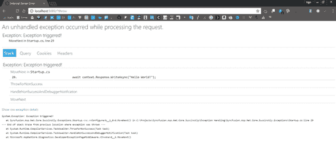

图 4-6:开发人员异常页面

在此页面上，有四个重要选项卡:

*   **栈**包含栈信息(代码行和调用栈)。
*   **查询**包含来自请求的查询字符串的所有变量(在这种情况下，只有一个)。
*   **cookie**包含所有应用程序 cookie 及其值。
*   **头**包含当前请求的 HTTP 头。

### 用户友好错误页面

由于已经解释过的原因，您无法在生产环境中显示错误信息，因此您必须在两种可能的方式中进行选择:

*   将用户重定向到特定的错误页面，将状态代码作为 URL 的一部分传递。
*   或者，从新路径重新执行请求。

让我们看看第一个选项:

代码清单 4-20

```cs
  app.UseStatusCodePagesWithRedirects("~/errors/{0}.html");

```

在这种情况下，您应该为要管理的每个状态代码创建一个页面，并将其放在 wwwroot 文件夹中名为 errors 的文件夹中(当然是与`UseStaticFiles`中间件组件相结合)。

如果不能使用静态文件，那么从通过方法的字符串中去掉`.html`并在 MVC 上添加特定的路由就足够了。如果您更喜欢第二种选择，使用另一个中间件组件就足够了:

代码清单 4-21

```cs
  UseStatusCodePagesWithReExecute("~/errors/{0}");

```

最后，您的错误管理可能如下:

代码清单 4-22

```cs
  if (_env.IsDevelopment())
  {
      app.UseDeveloperExceptionPage();
  } else {

  app.UseStatusCodePagesWithRedirects("~/errors/{0}.html");
  }

```

## 配置文件

随着新版本的推出，ASP.NET 核心处理配置文件的方式发生了显著变化。以前你用的是`web.config`文件的`AppSettings`部分，现在 ASP.NET 不需要`web.config`。只有当您必须在互联网信息服务(IIS)上托管应用程序时，它才存在；否则，你可以把它剥掉。

如果`AppSettings`部分不再需要，如何存储信息？

答案很简单。您可以使用外部文件(可以有多个)。幸运的是，有一组类可以帮助管理它。虽然看起来更不舒服，但事实并非如此。

首先，选择您喜欢的文件格式。最常见的格式是 JSON，但是如果您更熟悉 XML，请使用它。

### JSON 格式

假设您有这样一个 appsettings.json 文件:

代码清单 4-23

```cs
  {
      "database": {
          "databaseName": "my-db-name",
          "serverHost": "mySqlHost",
          "port": 1433,
          "username": "username",
          "password": "password"
      },
      "facebook": {
          "appId": "app-id",
          "appSecret": "app-secret"
      },
      "smtp": {
          "host": "mysuperhost.mysuperdomain.com",
          "username": "imperugo@gmail.com",
          "password": "my-super-secret-password",
          "enableSsl": true,
          "port": 587
      } 
  }

```

在 C#应用程序中拥有所有这些信息的更好的方法是使用一个带有一组属性的类。在一个完美的世界中，它将是一个具有相同 JSON 结构的类，如下所示:

代码清单 4-24

```cs
  namespace
  Syncfusion.Asp.Net.Core.Succinctly.Environments
  {
      public class Configuration
      {
          public DatabaseConfiguration Database { get;
  set; }
          public FacebookConfiguration Facebook { get;
  set; }
          public SmtpConfiguration SmtpConfiguration {
  get; set; }
      }

      public class DatabaseConfiguration
      {
          public string DatabaseName { get; set; }
          public string ServerHost { get; set; }
          public int Port { get; set; }
          public string Username { get; set; }
          public string Password { get; set; }

          public string ConnectionString =>
  $"Server=tcp:{ServerHost},{Port};Database={DatabaseName};User ID={Username};Password={Password};Encrypt=True;TrustServerCertificate=False;Connection
  Timeout=30;";
      }

      public class FacebookConfiguration
      {
          public string AppId { get; set; }
          public string AppSecret { get; set; }
      }

      public class SmtpConfiguration
      {
          public string Host { get; set; }
          public string Username { get; set; }
          public string Password { get; set; }
          public bool EnableSsl { get; set; }
          public int Port { get; set; }
      }
  }

```

此时，它用 JSON 文件中的值注入 C#类。因为配置文件通常在应用程序生命周期的开始是需要的，所以您必须将代码行添加到 Startup 类中，或者更准确地说，添加到构造函数中。但是，在此之前，您需要添加一些包:

*   微软。扩展、配置、环境变量
*   微软。扩展。配置。文件扩展
*   微软。扩展
*   微软。扩展。配置。绑定器

关于包装的用途，没有必要多说；他们的名字不言自明。让我们看看代码是什么样子的:

代码清单 4-25

```cs
  private readonly
  IHostingEnvironment hostingEnvironment;
  private readonly Configuration configuration;

  public Startup(IHostingEnvironment
  hostingEnvironment)
  {
      this.hostingEnvironment = hostingEnvironment;

      var builder = new ConfigurationBuilder()

  .SetBasePath(hostingEnvironment.ContentRootPath)
          .AddJsonFile("appsettings.json",
  false, true)
          .Build();

      var config = new Configuration();
      builder.Bind(config);

      // here the variable configuration contains all
  the info
      // from the JSON file
  }

```

### 管理不同的环境

我们已经解释了拥有不同环境的重要性，以及如何通过 C#管理它们。这同样适用于配置。

现在，您比以往任何时候都需要不同的配置文件，每个环境一个。由于 ASP.NET 核心，这很容易管理。

为了利用框架提供的功能，您必须遵循几个规则:第一个规则与配置文件名有关。

对于不同的文件，每个环境有一个允许您将环境名称添加到文件名中。例如用于开发环境的`appsettings.json`必须被称为`appsettings.Development.json`，而`appsettings.Production.json`将被用于生产环境。

第二个规则与文件之间的差异有关。您不需要在每个配置文件中复制完整的 JSON，因为 ASP.NET 核心将合并这些文件，只覆盖环境配置文件中指定的内容。

为了理解这意味着什么，假设您有相同的数据库实例，但是有不同的数据库名称。您可以使用相同的凭据登录到数据库服务器，但是从生产到开发都由相同的服务器托管；它只是切换数据库。

为了覆盖这个场景并继续使用您之前使用的 appsettings.json 文件，请查看 appsettings。Development.json 文件。

代码清单 4-26

```cs
  {
      "database": {
          "databaseName": "my-development-db-name",
      },
  }

```

再看`appsettings.Production.json`。

代码清单 4-27

```cs
  {
      "database": {
          "databaseName": "my-production-db-name",
      },
  }

```

这很棒，因为您可以保持配置文件非常精简，但是现在您需要培训 ASP.NET 核心来处理多个配置文件。为此，请将您之前编写的代码更改为:

代码清单 4-28

```cs
  private readonly
  IHostingEnvironment hostingEnvironment;
  private readonly Configuration configuration;

  public Startup(IHostingEnvironment
  hostingEnvironment)
  {
      this.hostingEnvironment = hostingEnvironment;

      var builder = new ConfigurationBuilder()

  .SetBasePath(hostingEnvironment.ContentRootPath)
          .AddJsonFile("appsettings.json",
  false, true)

  .AddJsonFile($"appsettings.{hostingEnvironment.EnvironmentName}.json",
  true)
          .AddEnvironmentVariables()
          .Build();

      configuration = new Configuration();
      builder.Bind(configuration);
  }

```

现在，对于一个开发环境，你会得到 **my-development-db-name** 作为数据库名称；否则，它将是**我的生产数据库名称**。请记住在您的环境配置文件中保持相同的 JSON 结构。

### 依赖注入

最后一部分与应用程序中配置值的使用有关，例如控制器、服务以及读取配置值所需的任何其他东西。

将您之前创建的配置类实例注册到 ASP.NET 核心依赖注入容器。像往常一样，进入`Startup.cs`类并注册实例。

代码清单 4-29

```cs
  public void
  ConfigureServices(IServiceCollection services)
  {
      services.AddSingleton(configuration);
  }

```

对于配置场景，单例生命周期是最好的选择。要将值注入服务，请将实例注入构造函数。

代码清单 4-30

```cs
  namespace
  Syncfusion.Asp.Net.Core.Succinctly.Environments
  {
      public class MySimpleService
      {
          private readonly Configuration
  configuration;

          public MySimpleService(Configuration
  configuration)
          {
              this.configuration = configuration;
          }
      }
  }

```

## 测井

日志在 web 应用程序中非常重要，并且很难实现。这就是为什么有这么多日志框架可用的原因。在[nuget.org](http://www.nuget.org/)上搜索“登录”这个词，你会看到有 1900 多个包裹。

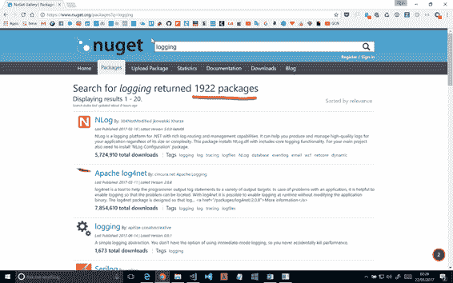

图 4-7:获取日志包

当然，并不是所有的都是日志框架，但几乎都与日志相关。日志非常个性化。它与您正在处理的特定环境或应用程序相关。

现代应用程序由几个包组成。两者的结合(几个日志框架和几个包)使得日志生态系统非常复杂。如果每个包都使用自己的日志框架或者与应用程序中使用的不同的日志框架，会发生什么？

为每个环境配置每一个都是一件复杂的事情。您可能会花很多时间配置日志记录，而不是编写好的代码。

为了解决这个问题，在 ASP.NET 核心之前，有一个名为 **Common 的库。日志记录。NET** (官方存储库在 [GitHub](https://github.com/net-commons/common-logging) 上)，它提供了一个简单的日志抽象，可以在不同的日志实现之间切换，比如 [Log4net](https://logging.apache.org/log4net/) 、 [NLog](http://nlog-project.org/) 、 [Serilog](https://serilog.net/) 等等。

如果所有的包都使用这个，那就非常酷了，因为你可以在一个地方配置一次日志记录。不幸的是，这不允许您记录来自。NET 框架，因为与外部库相比，它没有依赖性。

有了 ASP.NET 核心，这个问题就彻底解决了。你不必使用公共的。日志记录。NET 库，因为该框架提供了一些类似的现成的东西，并且它与所有的包集成在一起。

### 配置日志

首先，您必须选择想要的日志输出—例如，一个 [**控制台应用程序**](https://en.wikipedia.org/wiki/Console_application) 、一个 [**跟踪源**](https://msdn.microsoft.com/en-us/library/ms228984(v=vs.110).aspx) 、一个 [**事件日志**](https://msdn.microsoft.com/en-us/library/system.diagnostics.eventlog(v=vs.110).aspx) **、**等等。对于红隼来说，使用控制台输出可能会非常有帮助。添加**微软。扩展。日志。控制台**使用 Visual Studio 包管理器。

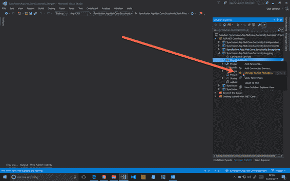

图 4-8:使用 Visual Studio 管理 NuGet 包

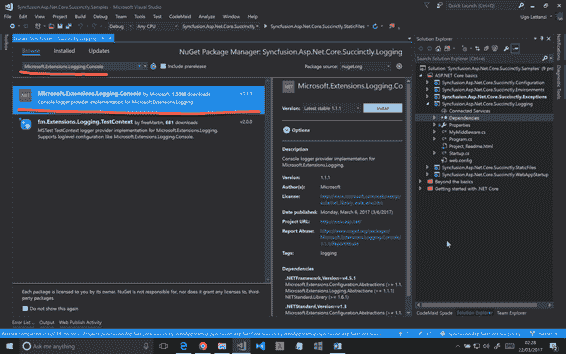

图 4-9:安装控制台日志记录

包**微软。如果您使用了 Visual Studio 2015 提供的模板之一，可能已经安装了扩展。**

现在，在`Startup`类中，配置日志输出。如前所述，`Configure`方法是最好的方法。`LoggingFactory`是负责生成日志实例的类。

代码清单 4-31

```cs
  using
  Microsoft.AspNetCore.Builder;
  using Microsoft.Extensions.DependencyInjection;
  using Microsoft.Extensions.Logging;

  namespace Syncfusion.Asp.Net.Core.Succinctly.Logging
  {
      public class Startup
      {
          // This method is called by the runtime. Use
  this method to add services to the container.
          // For more information on how to configure
  your application, visit http://go.microsoft.com/fwlink/?LinkID=398940
          public void
  ConfigureServices(IServiceCollection services)
          {
          }

          // This method is called by the runtime. Use
  this method to configure the HTTP request pipeline.
          public void Configure(IApplicationBuilder
  app, ILoggerFactory loggerFactory)
          {
              loggerFactory.AddConsole();

              app.Run(async (context) =>
              {
                  await
  context.Response.WriteAsync("Hello World!");
              });
          }
      }
  }

```

Visual Studio 和 VS Code 提供了一个名为 IntelliSense 的不可思议的功能，所以在输入`loggerFactory`时。，它建议所有可用的选项。如果你做的每件事都正确，你应该会得到以下结果。

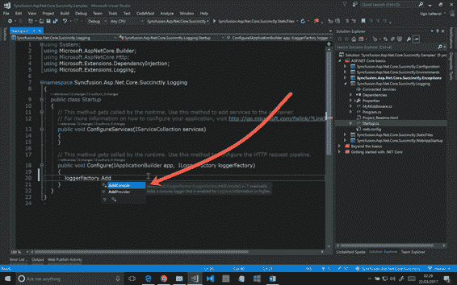

图 4-10:添加控制台提供程序

### 测试测井

这个日志记录系统最好的部分是它被 ASP.NET 核心框架所使用。运行应用程序时，您应该会看到如图 4-12 所示的输出。

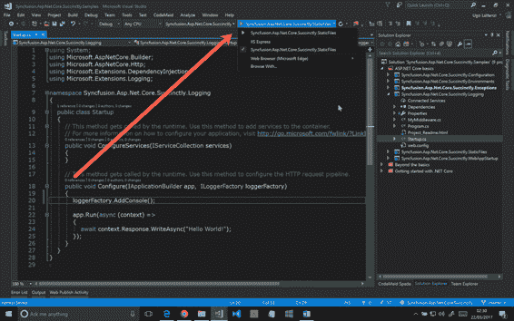

图 4-11:使用红隼运行网络应用程序

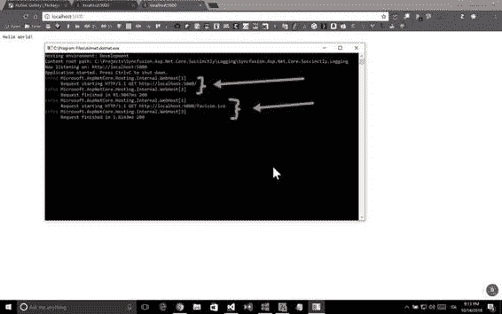

图 4-12:网络应用控制台输出

每个请求被记录两次:第一次是在服务器收到请求时，第二次是在服务器完成请求时。在图 4-12 中，有两组四个日志:第一组是当浏览器请求页面时，第二组是当它请求 favicon 时。

### 更改日志详细程度

在不调整配置的情况下，日志实现将所有信息写入输出。要限制日志输出中的大量数据，可以将其配置为仅记录从特定级别开始的信息。ASP.NET 岩心记录有六个级别:

*   Trace = 0
*   调试= 1
*   信息= 2
*   警告= 3
*   错误= 4
*   临界= 5

在生产环境中，您可能希望从警告或错误级别开始记录。为此，请在`AddConsole`方法中指定正确的最小日志级别。

请注意，每个日志记录程序实现都有不同的方式来指定日志记录的最低级别，因此该实现无法与 **TraceSource** 或 **EventLog** 一起工作。

代码清单 4-32

```cs
  public void
  Configure(IApplicationBuilder app,  ILoggerFactory loggerFactory)
  {
      Func<string, LogLevel, bool> filter =
  (name, level) => level >= LogLevel.Error;

      loggerFactory.AddConsole(filter);

      app.Run(async (context) =>
      {
          await
  context.Response.WriteAsync("Hello World!");
      });
  }

```

### 给你的应用添加一个日志

您已经看到了如何使用.NET 核心 框架，但是您没有看到如何在类中使用它。由于依赖注入，它非常容易——只需将记录器实例注入构造函数并使用它。

要注入的类是`ILogger<T>`，其中`T`是需要记录的类。

代码清单 4-33

```cs
  using
  Microsoft.Extensions.Logging;

  namespace Syncfusion.Asp.Net.Core.Succinctly.Logging
  {
      public class MyService
      {
          private readonly ILogger<MyService>
  _logger;

          public MyService(ILogger<MyService>
  logger)
          {
              _logger = logger;
          }

          public void DoSomething()
          {
              _logger.LogInformation("Doing
  something ...");

              //.... do something
          }
      }
  }

```

### 创建您的自定义记录器

在本书中，我们不打算解释如何创建自己的自定义日志记录程序，但是有几个存储库可以让您看到如何做到这一点。下面是一个简短的列表:

*   https://github.com/serilog/serilog-extensions-logging 的系列赛。
*   埃尔马·伊奥在 https://github.com/elmahio/Elmah.Io.Extensions.Logging。
*   https://github.com/imobile3/Loggr.Extensions.Logging 的 Loggr。
*   https://github.com/NLog/NLog.Extensions.LoggingNLog。
*   懈怠于 https://github.com/imperugo/Microsoft.扩展。记录。松弛。
*   https://github.com/imperugo/Microsoft.的蒙古数据库扩展名. Logging.MongoDb 。

## 结论

在本章中，您学习了如何使用中间件组件来实现 web 应用程序所需的功能，例如静态文件、异常处理、依赖注入、托管和环境。

还有其他很酷的功能，比如数据保护和缓存。要了解更多信息，请前往[www.asp.net](http://www.asp.net)。