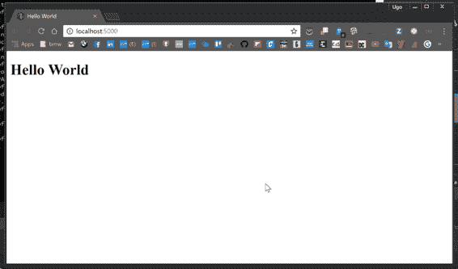

# 五、超越基础：应用框架

HTTP 不仅仅是提供网页；它还用于服务通过 HTTP 协议公开服务和数据的 API。本章将温和地向您介绍如何使用 ASP.NET MVC 来管理这些场景，它与之前的版本相比没有太大变化。

您将管理控制器、视图、API、最新最酷的标签助手，并且您将使用视图组件。但是在继续之前，重要的是要知道与 MVC 相关的部分只是一个小介绍。像这样复杂的框架很容易需要整本书，这不是像这本书这样针对 ASP.NET 的作品的范围。

## Web API

Web API(应用程序编程接口)是一组子程序定义，其范围是管理客户机和服务器之间的数据。在过去的几年里，趋势是通过 HTTP 协议构建 API，由于应用协议，允许第三方应用程序与服务器交互。

最著名的例子可能是脸书，它允许用户从任何客户端——移动应用、桌面或其他任何设备——共享内容、发布帖子、管理页面和做更多事情。这是由于一组 API 和 HTTP，但是它是如何工作的呢？

使用 HTTP 协议的好处是，除了结果之外，传统的网络导航没有什么大的不同。在正常的 HTTP 导航中，当我们用浏览器调用`www.tostring.it`时，服务器返回 HTML。对于 API，它使用 JSON 格式返回数据。

结果也可以是 XML 或任何其他类型的结构化数据。关键是结果不包含任何关于布局或交互的信息，比如 CSS 和 JavaScript。在 ASP.NET 的早期版本中，特定的库管理 API。它被称为网络应用编程接口。

有了最新的版本，这个库就不存在了，你可以用同一个框架处理 API 和经典请求，因为 Web API 已经合并到 MVC 框架中了。这是老 ASP.NET 和新的主要区别。

当你想到我们在以前的版本中使用的东西时，它绝对有意义。这两个框架之间的大部分代码是相似的。想想控制器、属性和依赖注入——相同的代码、不同的名称空间。

### 安装

ASP.NET MVC 核心和前面几章看到的没有什么不同；您必须分别使用 NuGet 和 Startup 类来安装和配置必要的包。

包是`Microsoft.AspNetCore.Mvc`，内置了对构建 Web APIs 的支持。安装后，注册服务并在 web 应用程序中进行配置，如下所示:

代码清单 5-1

```cs
  using
  Microsoft.AspNetCore.Builder;
  using Microsoft.AspNetCore.Hosting;
  using Microsoft.Extensions.DependencyInjection;
  using Microsoft.Extensions.Logging;

  namespace Syncfusion.Asp.Net.Core.Succinctly.WebApi
  {
      public class Startup
      {
          public void
  ConfigureServices(IServiceCollection services)
          {
              services.AddMvc();
          }

          public void Configure(IApplicationBuilder
  app, IHostingEnvironment env, ILoggerFactory loggerFactory)
          {
              loggerFactory.AddConsole();

              if (env.IsDevelopment())
              {
                  app.UseDeveloperExceptionPage();
              }

              app.UseMvcWithDefaultRoute();
          }
      }
  }

```

### 玩弄网址和动词

因为您管理的是数据，而不是 HTML 页面，所以 HTTP 动词是理解客户端需求的关键。有一种约定，几乎所有的 API 实现都尊重并根据所需的操作类型使用不同的 HTTP 动词。

假设你有这个要求:`api/users`。

表 1

| 资源示例 | 阅读(GET 动词) | 插入(后置动词) | 更新(PUT 动词) | 部分更新(补丁动词) | 删除(删除动词) |
| 行动 | 获取用户列表。 | 创建用户。 | 使用批量更新来更新用户。 | 批处理-仅使用请求中的属性更新用户。 | 错误或删除所有用户，这取决于您想要什么。 |
| 反应 | 列出用户。 | 新用户或重定向到 URL 以获得单个用户。 | 没有有效载荷；只有 HTTP 状态代码。 | 没有有效载荷；仅 HTTP 状态代码 | 没有有效载荷；只有 HTTP 状态代码。 |

如果要管理单个用户，请求应该是`api/users/1` ，其中`1`是用户的 ID。

表 2

| 资源示例 | 阅读(GET 动词) | 插入(后置动词) | 更新(PUT 动词) | 部分更新(补丁动词) | 删除(删除动词) |
| 行动 | 获取单个用户。 | 返回一个错误，因为用户已经存在。 | 更新指定的用户。 | 仅用请求中存在的属性部分更新用户。 | 删除指定的用户。 |
| 反应 | 单一用户。 | 没有有效载荷；只有 HTTP 状态代码。 | 更新用户或重定向到 URL 以获得单个用户。 | 更新用户(完整对象)或重定向到 URL 以获得单个用户。 | 没有有效载荷；只有 HTTP 状态代码。 |

总而言之，网址与 HTTP 动词相结合，可以让你明白该做什么。

*   `/api`是前缀，表示请求是 API 请求，而不是经典的 web 请求。
*   `users`是 MVC 控制器。
*   `verb`标识要执行的操作。

### 从应用编程接口返回数据

现在一切都配置正确了，您可以创建您的第一个 MVC 控制器了。为了不太偏离您在以前版本中使用的内容，让我们创建一个名为控制器的文件夹。

虽然不是强制性的，但最佳做法是为所有的应用编程接口控制器创建一个文件夹，将应用编程接口与标准控制器分开。

代码清单 5-2

```cs
  using System.Linq;
  using Microsoft.AspNetCore.Mvc;

  namespace
  Syncfusion.Asp.Net.Core.Succinctly.WebApi.Controllers.APIs
  {
      [Route("api/[controller]")]
      public class UsersController : Controller
      {
          [HttpGet]
          public User[] Get()
          {
              return new[]
              {
                  new User() {Id = 1, Firstname =
  "Ugo", Lastname = "Lattanzi", Twitter = "@imperugo"},
                  new User() {Id = 2, Firstname =
  "Simone", Lastname = "Chiaretta", Twitter =
  "@simonech"},
              };
          }

          [HttpGet("{id}")]
          public User Get(int id)
          {
              var users = new[]
              {
                  new User() {Id = 1, Firstname =
  "Ugo", Lastname = "Lattanzi", Twitter =
  "@imperugo"},
                  new User() {Id = 2, Firstname =
  "Simone", Lastname = "Chiaretta", Twitter =
  "@simonech"},
              };

              return users.FirstOrDefault(x => x.Id
  == id);
          }
      }

      public class User
      {
          public int Id { get; set; }
          public string Firstname { get; set; }
          public string Lastname { get; set; }
          public string Twitter { get; set; }
      }
  }

```

如您所见，控制器很简单，代码与以前的版本没有太大不同。让我们一步一步来分析。

代码清单 5-3

```cs
  [Route("api/[controller]/[action]")]

```

这表示控制器可以管理 URL 中所有带`api`前缀的请求。基本上，如果 URL 不以`/api`开头，控制器就永远不会处理这个请求。

代码清单 5-4

```cs
  [HttpGet]

```

此属性指定它正在装饰的动作的动词。你可以使用所有可能的动词，`HttpGet`、`HttpPost`、`HttpPut`等等。

### 使用 API 更新数据

您刚刚看到了如何返回数据以及从查询字符串中部分读取输入信息。不幸的是，当您必须从客户端向服务器发送大量数据时，这并不那么有用，因为您可以添加到网址中的字符数量是有限制的。因为这个原因，你必须换一个动词。

HTTP/1.1 没有指定查询字符串的长度限制，但是限制是由网络浏览器和服务器软件强加的。你可以在[上找到更多的信息。](http://stackoverflow.com/questions/812925/what-is-the-maximum-possible-length-of-a-query-string)

这种方法与您看到的没有太大区别，唯一的区别是数据来自哪里:主体而不是查询字符串。

代码清单 5-5

```cs
  // Adding user
  [HttpPost]
  public IActionResult Update([FromBody] User user)
  {
      var users = new List<User>();
      users.Add(user);

      return new
  CreatedResult($"/api/users/{user.Id}", user);
  }

  //Deleting user
  [HttpDelete]
  public IActionResult Delete([FromQuery] int id)
  {
      var users = new List<User>
      {
          new User() {Id = 1, Firstname =
  "Ugo", Lastname = "Lattanzi", Twitter =
  "@imperugo"},
          new User() {Id = 2, Firstname =
  "Simone", Lastname = "Chiaretta", Twitter =
  "@simonech"},
      };

      var user = users.SingleOrDefault(x => x.Id ==
  id);

      if (user != null)
      {
          users.Remove(user);

          return new EmptyResult();
      }

      return new NotFoundResult();
  }

```

如您所见，唯一的区别如下。

代码清单 5-6

```cs
  [FromQuery]

```

这指定数据来自 HTTP 请求的有效负载。

代码清单 5-7

```cs
  return new
  CreatedResult($"/api/users/{user.Id}", user);

```

这将返回创建的对象和客户端可以再次获得用户的网址。状态代码为 201(已创建)。

代码清单 5-8

```cs
  return new EmptyResult();

```

基本上，这意味着状态代码 200(正常)。响应正文为空。

代码清单 5-9

```cs
  return new NotFoundResult();

```

这是在找不到请求的客户端时使用的 404 消息。

### 检测原料药

为了测试应用编程接口，可以使用浏览器，因为应用编程接口是通过 HTTP 协议实现的，但是也有其他应用程序可以对此提供帮助。一个流行的应用是 Postman，可以从[getpostman.com](https://www.getpostman.com/)免费下载。

下面的截图展示了如何测试我们之前使用的代码。

检索用户(/API/使用 GET 的用户)。


图 5-1:使用邮递员测试 REST 端点-1


图 5-2:使用邮递员测试 REST 端点-2

使用 POST 创建用户(/API/user)。


图 5-3:使用邮递员测试 REST 端点-3

删除用户(/API/user？id=2 使用 DELETE)。


图 5-4:使用邮递员测试 REST 端点-4

## ASP.NET MVC 核心

如前一节所述，ASP.NET MVC 与 Web API 没有什么不同，所以除了结果之外，您将在这里看到的代码将非常相似。

因为您已经为 API 安装并注册了 ASP.NET MVC，所以您可以直接跳到代码。在你创建`UserController`的同一个文件夹(`Controller`)中，你可以创建另一个控制器，范围是服务于网站的主页面。在这种情况下，称之为`HomeController`。

代码清单 5-10

```cs
  using Microsoft.AspNetCore.Mvc;

  namespace
  Syncfusion.Asp.Net.Core.Succinctly.Mvc.Controllers.MVC
  {
      public class HomeController : Controller
      {
          [HttpGet]
          public IActionResult Index()
          {
              return View();
          }
      }
  }

```

这段代码类似于 API 控制器，唯一不同的是控制器上缺少`route`属性，以及用于返回动作的`View`方法。第一个是不需要的，因为您不必覆盖默认的路由配置(我们将在本章后面讨论)，第二个向控制器指示它必须呈现一个视图，而不是 JSON。

如果您尝试运行这段代码，您将会得到这样一个错误。


图 5-5:找不到 MVC 视图

发生这种情况是因为 MVC 框架找不到视图文件，但是它是如何定位文件的呢？它背后的逻辑非常简单，如果您没有指定任何关于视图的信息，一切都是使用约定发生的。

首先，重要的是要知道所有的视图都放在项目根目录下的“视图”文件夹中，如下图所示。


图 5-6:视图文件夹

在内部，您创建的每个 MVC 控制器都必须有一个文件夹。在这种情况下，您只有一个名为`HomeController`的控制器，因此您必须在视图内部创建文件夹 Home。

最后，是时候创造我们的观点了。使用 Visual Studio 2017 使它变得非常简单。


图 5-7:主控制器的视图文件夹


图 5-8:添加视图-1


图 5-9:添加视图-2

现在，如果你打开最新的文件，你会看到它几乎是空的。它只包含几个你会认出来的奇怪部分，因为它们有不同的颜色，并且在开头使用了@符号。

这些部分在服务器端进行管理，并包含如何更改输出以呈现最终的 HTML 的说明。一切皆有可能，这要归功于嵌入 ASP.NET MVC 核心的视图引擎 Razor。

在[ASP.NET/网页/概述/入门/简介-razor-syntax-c](https://www.asp.net/web-pages/overview/getting-started/introducing-razor-syntax-c) 上可以找到关于 Razor 语法的很好的介绍。因为你必须渲染一个网页，你首先必须创建正确的标记，所以让我们将下面的代码添加到我们的视图中。

代码清单 5-11

```cs
  <!DOCTYPE html>
  <html lang="en">
  <head>
      <meta charset="utf-8">
      <title>Hello World</title>
  </head>
  <body>
      <h1>Hello World</h1>
  </body>
  </html>

```

再次运行应用程序时，结果应该不是错误，而是一个简单的 HTML 页面。



图 5-10:使用 MVC 渲染的服务器端页面

这绝对是一个改进，但是您返回的只是一个静态文件；没有任何形式的转变。但是使用 MVC 并不需要这样，因为您已经有了一个特定的中间件组件来管理静态文件。

为了使视图更加精细，并使用服务器上的一些东西，您必须返回控制器，将数据发送到视图。

代码清单 5-12

```cs
  using Microsoft.AspNetCore.Mvc;
  using Syncfusion.Asp.Net.Core.Succinctly.Mvc.Models;

  namespace
  Syncfusion.Asp.Net.Core.Succinctly.Mvc.Controllers.MVC
  {
      public class HomeController : Controller
      {
          [HttpGet]
          public IActionResult Index()
          {
              var users = new[]
              {
                  new User() {Id = 1, Firstname =
  "Ugo", Lastname = "Lattanzi", Twitter =
  "@imperugo"},
                  new User() {Id = 2, Firstname =
  "Simone", Lastname = "Chiaretta", Twitter =
  "@simonech"},
              };

              return View(users);
          }
      }
  }

```

请注意，我们已经重用了类`User`，它之前是为 API 响应创建的。这段代码不需要解释；你只是将一组用户作为模型发送给`View`方法。

在我们看来，是时候从控制器中获取用户并将数据打印到页面上了。首先要做的是指定视图使用的是哪种模型。在我们的例子中，是`IEnumerable<User>`。

代码清单 5-13

```cs
  @model IEnumerable<Syncfusion.Asp.Net.Core.Succinctly.Mvc.Models.User>
  <!DOCTYPE html>
  <html lang="en">
  <head>
      <meta charset="utf-8">
      <title>Hello World</title>
  </head>
  <body>
      <h1>Hello World</h1>
  </body>
  </html>

```

现在，您必须迭代模型中的所有用户并显示数据。

代码清单 5-14

```cs
  @model IEnumerable<Syncfusion.Asp.Net.Core.Succinctly.Mvc.Models.User>
  <!DOCTYPE html>
  <html lang="en">
  <head>
      <meta charset="utf-8">
      <title>Hello World</title>
  </head>
  <body>
      <h1>Users</h1>
      <div>
          @foreach(var user in Model) {
              <hr />
              <p>Firstname: @user.Firstname</p>
              <p>Lastname: @user.Lastname</p>
              <p>Twitter: <a href="http://www.twitter.com/@user.Twitter"> @user.Twitter</a></p>
          }
      </div>
  </body>
  </html>

```

在这种情况下，输出应该如下所示。


图 5-11:使用列表的 MVC 呈现的服务器端页面

### 路由

你刚刚看到了 ASP.NET MVC 的一个小介绍。注意`HomeController`结合`Index`动作处理根域(在我们的例子中 http://localhost:5000)。但是为什么呢？

要得到答案，您必须回到我们编写这段代码的 MVC 配置:

代码清单 5-15

```cs
  using Microsoft.AspNetCore.Builder;
  using Microsoft.AspNetCore.Hosting;
  using Microsoft.Extensions.DependencyInjection;
  using Microsoft.Extensions.Logging;

  namespace Syncfusion.Asp.Net.Core.Succinctly.Mvc
  {
      public class Startup
      {
          public void ConfigureServices(IServiceCollection
  services)
          {
              services.AddMvc();
          }

          public void Configure(IApplicationBuilder
  app, IHostingEnvironment env, ILoggerFactory loggerFactory)
          {
              loggerFactory.AddConsole();

              if (env.IsDevelopment())
              {
                  app.UseDeveloperExceptionPage();
              }

              app.UseMvcWithDefaultRoute();
          }
      }
  }

```

方法`app.UseMvcWithDefaultRoute()` 定义默认路线；这相当于写了以下内容:

代码清单 5-16

```cs
  app.UseMvc(routes =>
  {
      routes.MapRoute(
          name: "default",
          template:
  "{controller=Home}/{action=Index}/{id?}");
  });

```

这部分代码说要把 URL 拆分成段，其中第一段是控制器，第二段是动作，第三段(可选)是参数。如果都不见了，使用`HomeController`的`Index`动作。

事实上，如果您再次运行应用程序并写入以下网址:

http://localhost:5000/home/index

输出应该相同。

如果您想要管理像 http://localhost:5000/products 这样的 URL，请使用`Index`操作创建一个`ProductController`。

## 查看具体特征

在了解了 ASP.NET 核心 MVC 的一般特性之后，是时候看看 ASP.NET MVC 应用程序视图端的两个新特性了:

*   标签助手
*   查看组件

标签助手是一种公开呈现 HTML 元素的服务器端代码的新方法。它们将 HTML Razor 助手的相同特性带到了更易于使用的标准 HTML 元素语法中。

视图组件可以被看作是部分视图的一个更强大的版本，或者是开发子操作的一种不那么复杂的方式。让我们详细看看这两个新特性。

### 标记帮手

与 HTML Razor 助手相比，标记助手看起来像标准的 HTML 元素——不再需要在 HTML 和 Razor 语法之间切换上下文。

让我们看一个例子，让事情更清楚一点。如果您想用 ASP.NET MVC 制作一个编辑表单，您必须显示一个从视图模型中获取值的文本框，呈现验证结果，等等。

使用以前的 HTML Razor 助手，您会写道:

`@Html.TextBoxFor(m=>m.FirstName)`

但是现在有了标签助手，你可以直接写`<input asp-for="FirstName" />`而不需要引入 Razor 语法。请注意，这只是一个普通的 HTML `<input>`标签，通过特殊属性`asp-for`进行了增强。

看起来没有这么大的变化，但是当你添加更多的属性时，优势就变得明显了。这方面的一个例子是`class`属性。

这是如何使用旧的 HTML Razor 语法添加类的:

`@Html.TextBoxFor(m=>m.Email, new { @class = "form-control" })`

使用标签助手，它只是这样:

`<input asp-for="FirstName" class="form-control" />`。

基本上，您编写标记就像编写静态 HTML 标记一样，添加了特殊的`asp-for`。

但是这种新语法保留了 Visual Studio 智能感知的支持。只要您开始键入一个通过标记助手以某种方式增强的 HTML 元素，您就会在智能感知菜单中看到标记用一个不同于普通 HTML 标记的图标表示。


图 5-12:用于 HTML 标签的 Visual Studio 智能感知

如果您随后触发智能感知菜单来查看所有可用的属性，则只有一个属性具有相同的图标，即`asp-for`属性。添加此属性并再次打开智能感知菜单后，您将看到页面模型的所有方法和属性。


图 5-13:面向 MVC 模型的 Visual Studio 智能感知

仔细看前面两张截图。你会注意到`<input>`标签已经变色。下图更好地突出了区别。


图 5-14:两个标签的区别

在第一行，元素是蓝色的，属性是蓝色的。而在第二种情况下，元素是绿色的，特殊属性也是绿色的(正常属性仍然是蓝色)。Visual Studio 既能识别普通的 HTML 标签和属性，也能识别标签助手。这避免了编辑视图时的混乱。

ASP.NET 核心 MVC 自带了很多 Tag Helpers，大部分只是重新实现了用来编辑表单的相同 HTML Razor helpers，比如`input`、`form`、`label`和`select`元素。但是还有其他标记助手用于管理缓存，根据环境呈现不同的 HTML 元素，以及管理脚本回退或 CSS 文件。您可以在默认项目模板的视图\共享\u layout . cshtml 文件中看到许多这样的标记助手。下面的代码清单中提供了该文件的简化版本。

代码清单 5-17

```cs
  <!DOCTYPE html>
  <html>
  <head>
      <meta charset="utf-8" />
      <meta name="viewport" content="width=device-width,
  initial-scale=1.0" />
      <title>@ViewData["Title"] - MvcSample</title>

      <environment names="Development">
          <link rel="stylesheet" href="~/lib/bootstrap/dist/css/bootstrap.css" />
          <link rel="stylesheet" href="~/css/site.css" />
      </environment>
      <environment names="Staging,Production">
          <link rel="stylesheet" href="https://ajax.aspnetcdn.com/ajax/bootstrap/3.3.6/css/bootstrap.min.css"
                asp-fallback-href="~/lib/bootstrap/dist/css/bootstrap.min.css"
                asp-fallback-test-class="sr-only"
  asp-fallback-test-property="position" asp-fallback-test-value="absolute" />
          <link rel="stylesheet" href="~/css/site.min.css" asp-append-version="true" />
      </environment>
  </head>
  <body>

  // etc.

      <environment names="Development">
          <script src="~/lib/jquery/dist/jquery.js"></script>
          <script src="~/lib/bootstrap/dist/js/bootstrap.js"></script>
          <script src="~/js/site.js" asp-append-version="true"></script>
      </environment>
      <environment names="Staging,Production">
          <script src="https://ajax.aspnetcdn.com/ajax/jquery/jquery-2.2.0.min.js"
                  asp-fallback-src="~/lib/jquery/dist/jquery.min.js"
                  asp-fallback-test="window.jQuery">
          </script>
          <script src="https://ajax.aspnetcdn.com/ajax/bootstrap/3.3.6/bootstrap.min.js"
                  asp-fallback-src="~/lib/bootstrap/dist/js/bootstrap.min.js"
                  asp-fallback-test="window.jQuery && window.jQuery.fn && window.jQuery.fn.modal">
          </script>
          <script src="~/js/site.min.js" asp-append-version="true"></script>
      </environment>

      @RenderSection("scripts", required:
  false)
  </body>
  </html>

```

### 打造定制标签助手

标签助手很容易创建，所以如何创建自己的标签助手值得一看。当您想要输出一个长且重复的 HTML 片段，但是从一个实例到另一个实例的变化很小，或者当您想要以某种方式修改元素的内容时，编写一个自定义标记帮助器特别有用。

例如，您将创建一个标签帮助器，它只需指定网址就能自动创建链接。

需要这样的东西:

<url>https://www.syncfusion.com/resources/techportal/ebooks</url>

并创建一个工作标签，如下所示:

[https://www.syncfusion.com/resources/techportal/ebooks](https://www.syncfusion.com/resources/techportal/ebooks)。

首先在 MVC 项目中创建一个 UrlTagHelper 文件。一个好的习惯是将文件放在 TagHelpers 文件夹中。

标签助手是一个继承自`TagHelper`的类，通过覆盖方法`Process`或其异步对应物`ProcessAsync`来定义其行为。这些方法有两个参数:

*   `context`，包含当前执行上下文的信息(即使很少使用)。
*   `output`，包含原始 HTML 标签及其内容的模型，是标签助手必须修改的对象。

要在视图中使用标记助手，您必须告诉 Visual Studio 和.NET 核心 框架在哪里可以找到它们。这是通过在 _ViewImports.cshtml 文件中添加引用来实现的。

`@addTagHelper *, Microsoft.AspNetCore.Mvc.TagHelpers`
`@addTagHelper "*, MvcSample"`

为了确保所有基本步骤都已完成，请将以下代码复制到 UrlTagHelper 文件中。

代码清单 5-18

```cs
  using
  Microsoft.AspNetCore.Razor.TagHelpers;

  namespace MvcSample.TagHelpers
  {
      public class UrlTagHelper: TagHelper
      {
          public override void
  Process(TagHelperContext context, TagHelperOutput output)
          {
              output.TagName = "a";
          }
      }
  }

```

这个标签助手目前没有用。它只是将调用帮助器时使用的标签从它是什么(在我们的例子中是一个网址)替换为一个标签，但是它没有创建指向指定网址的`href`属性。为此，您必须读取元素的内容并创建一个新属性。因为内容也可以是 Razor 表达式，所以这样做的方法是异步方法`output.GetChildContentAsync()`。你也要把你执行的方法从`Process`改成`ProcessAsync`。

下面的代码清单显示了完整的标记助手。

代码清单 5-19

```cs
  using
  Microsoft.AspNetCore.Razor.TagHelpers;

  namespace MvcSample.TagHelpers
  {
      public class UrlTagHelper: TagHelper
      {
          public override async Task
  ProcessAsync(TagHelperContext context, TagHelperOutput output)
          {
              output.TagName = "a";
              var content = await
  output.GetChildContentAsync();

  output.Attributes.SetAttribute("href", content.GetContent());
          }
      }
  }

```

标签助手也可以有属性。您可以扩展网址标签助手来指定链接的目标。要向标记助手添加属性，请向类添加属性。在目标的情况下，只需要将`public string Target { get; set; }`添加到类中。但是拥有一个字符串参数并不是一种好的体验，因为智能感知并没有显示哪些值是允许的。您可以将属性定义为枚举，其值仅是`target` HTML 属性所允许的值。然后你有很好的智能感知。


图 5-15: HTML 属性建议

这是更新后的标签助手的代码:

代码清单 5-20

```cs
  using
  Microsoft.AspNetCore.Razor.TagHelpers;

  namespace MvcSample.TagHelpers
  {

      public enum TargetEnum
      {
          None = 0,
          Blank,
          Parent,
          Self,
          Top
      }

      public class UrlTagHelper: TagHelper
      {
          public TargetEnum Target { get; set; }
          public override async Task
  ProcessAsync(TagHelperContext context, TagHelperOutput output)
          {
              output.TagName = "a";
              var content = await
  output.GetChildContentAsync();

  output.Attributes.SetAttribute("href", content.GetContent());
              if (Target!=TargetEnum.None)
              {

  output.Attributes.SetAttribute("target", "_"+Target.ToString().ToLowerInvariant());
              }

          }
      }
  }

```

现在，`<url target="Blank">http://example.com</url` >被渲染为`<a href="http://example.com" target="_blank">http://example.com</a>`。

### 查看组件

视图组件是下一个新的视图相关功能。它们在某种程度上类似于局部视图，但它们更强大，用于解决不同的问题。

局部视图，顾名思义，就是一种视图。它通常用于通过将复杂视图拆分为可重用的部分来简化它们。部分视图可以访问父页面的视图模型，并且没有复杂的逻辑。

另一方面，视图组件没有访问页面模型的权限；它们只对传递给它们的参数进行操作，它们由视图和类以及逻辑组成。

如果您在 ASP.NET MVC 的早期版本中使用了子操作，它们或多或少以一种更优雅的方式解决了相同的问题，因为它们的执行没有从路由开始经过整个 ASP.NET MVC 执行管道。

通常，视图控制器用于呈现可重用的页面片段，这些页面片段还包含可能涉及到访问数据库的逻辑，例如边栏、菜单、条件登录面板等。

### 如何写视图组件

如上所述，视图组件由两部分组成。包含逻辑的类扩展了`ViewComponent`类，必须实现`Invoke`或`InvokeAsync`方法。这将返回`IViewComponentResult`以及必须传递给视图的模型。通常，所有视图组件都位于项目根目录下名为`ViewComponents`的文件夹中。

这个观点和其他观点一样。它接收通过@Model 变量访问的组件类传递的模型。视图组件的视图必须保存在视图\共享\组件\ <component-name>\Default.cshtml 文件中。</component-name>

例如，让我们构建一个视图组件来显示博客的侧栏。组件类只是调用一个外部存储库来获取链接列表。

代码清单 5-21

```cs
  using System.Threading.Tasks;
  using Microsoft.AspNetCore.Mvc;
  using MvcSample.Services;

  namespace MvcSample.ViewComponents
  {
      public class SideBarViewComponent: ViewComponent
      {
          private readonly ILinkRepository db;
          public SideBarViewComponent(ILinkRepository
  repository)
          {
              db = repository;
          }

          public async
  Task<IViewComponentResult> InvokeAsync(int max=10)
          {
              var items = await
  db.GetLinks().Take(max);
              return View(items);
          }
      }
  }

```

请注意，它在构造函数中接收依赖项，如 ASP.NET 核心 MVC 中的控制器所示。在这种情况下，由于检索链接的操作转到了数据库，所以您实现了组件的异步版本。

下一步是实现视图。这里没有什么特别要提的，只是一个简单的视图，呈现一个链接列表。

代码清单 5-22

```cs
  @model IEnumerable<MvcSample.Model.Link>

  <h3>Blog Roll</h3>
  <ul>
      @foreach (var link in Model)
      {
          <li><a href="@link.Url">@link.Title</a></li>
      }
  </ul>

```

需要记住的重要事实是这个视图位于何处。按照惯例，它必须保存为视图\共享\组件\侧边栏\默认

现在是时候将组件包含到视图中了。这是通过简单地使用 Razor 语法调用视图组件来完成的。

代码清单 5-23

```cs
  @await
  Component.InvokeAsync("SideBar", new {max = 5})

```

这有点复杂，尤其是需要创建一个匿名类来传递参数。但是也有另一种调用视图组件的方式，就好像它是一个标记助手一样。从 ASP.NET 核心 1.1 开始，所有视图组件也被注册为前缀为`vc`的标签助手。

代码清单 5-24

```cs
  <vc:side-bar
  max="5"></vc:side-bar>

```

除了更容易编写之外，这还在 HTML 编辑器中实现了智能感知。


图 5-16:标签助手的智能感知

## 结论

ASP.NET 核心提供了一个重写的 MVC 框架，在之前版本的基础上进行了改进，旨在成为任何基于网络的交互的统一编程模型。

您已经看到了为简化视图开发而引入的很酷的新特性。这是解释编码的最后一章。接下来的两章更多的是关于工具，展示了如何部署应用程序，以及如何在没有 Visual Studio 的情况下在 Mac 上开发。