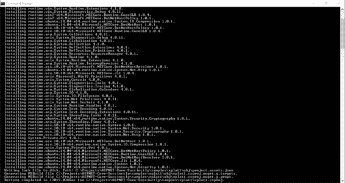
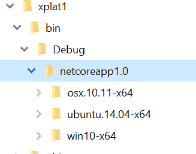
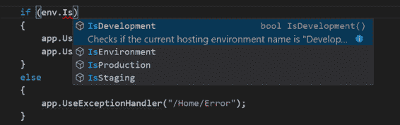
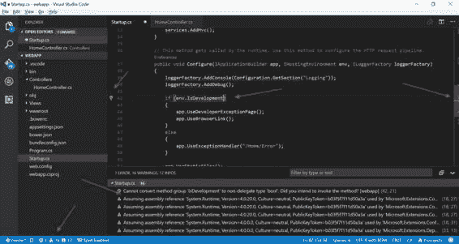
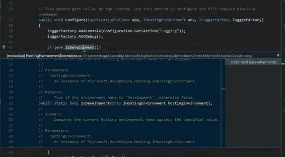
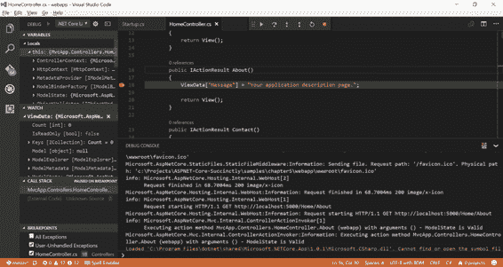

# 七、用于开发 ASP.NET 核心应用的工具

在这本书的开头，我们说 apart 核心是一个跨平台的框架，但是我们已经接近书的结尾了，除了第 1 章中的一个简单的例子，我们一直在 Windows 上使用 Visual Studio。

最后一章通过展示如何在没有 Visual Studio 的情况下开发 ASP.NET 核心应用程序来缩小平台之间的差距。

## 使用 dotnet CLI

在本书中，您使用了 dotnet 命令行工具来创建项目、构建和发布应用程序。在本章中，您将更深入地了解该工具的更多高级用法。

调用 dotnet 工具的方法是首先指定命令，然后指定命令的特定参数，最后指定选项。

dotnet 工具提供的命令有:

*   `new`，创建新的.NET 核心项目。
*   `restore`，从 NuGet 下载所有依赖项。
*   `build`，编译项目。
*   `publish`，生成用于部署的自包含文件夹。
*   `run`，运行一个项目，如果还没有建成，就建造它。
*   `pack`，将项目打包为一个 NuGet 包。
*   `msbuild`，用作标准 MSBuild 命令的代理。

让我们从更详细地查看`new`命令开始。当在没有任何选项的情况下调用时，它只是列出了它可以创建的所有可能的项目类型，但是通过指定一个参数，它直接创建了一个项目。使用`console`，创建一个 C#控制台应用；配合`mvc`，用 MVC 做了一个全功能的 ASP.NET 核心 应用；或者用`classlib`，创建一个库项目。

对于`build`和`publish`，您可以指定编译所需的框架、运行时和配置(调试或发布)。如果您构建的应用程序仅针对一个框架或运行时，这些选项就不是很有用。但是，例如，如果您想要创建一个可以在多台机器上作为本机应用程序运行的实用程序，它们是有意义的。

如果您想要为 Windows 和 Mac 构建一个示例控制台应用程序，您必须首先在项目文件中指定您想要支持的附加运行时。

.NET 核心 支持很多不同的系统，但是每个系统都有一个非常具体的标识符，格式为[os]。[版本]-[arch](如 osx.10.11-x64)。但是尽管有模板化的外观，但它们是唯一的字符串，所以在使用新的 RID 之前，您必须确保它得到支持并有正确的名称。参考微软文档网站上的 [RID 目录](https://docs.microsoft.com/en-us/dotnet/articles/core/rid-catalog)。

运行时和应用程序支持必须在项目文件的`RuntimeIdentifiers`属性中指定为用分号(；).分号后不要留有空格，否则还原将会失败。

代码清单 7-1

```cs
  <PropertyGroup>
    <OutputType>Exe</OutputType>
    <TargetFramework>netcoreapp1.0</TargetFramework>
    <RuntimeIdentifiers>win10-x64;osx.10.11-x64;ubuntu.14.04-x64</RuntimeIdentifiers>
  </PropertyGroup>

```

文件修改后，再次运行 dotnet restore。这将下载所有包，对于其他运行时也是如此，如下面的命令提示符窗口所示。



图 7-1:命令提示符输出

现在，您可以为所有三个运行时发布一个应用程序，从而创建包含本机二进制可执行文件的独立文件夹，这些文件可以直接复制到目标计算机。

要发布它们，请运行`dotnet publish`命令三次，每个您想要构建的运行时一次。

代码清单 7-2

```cs
  dotnet publish -r win10-x64
  dotnet publish -r osx.10.11-x64
  dotnet publish -r ubuntu.14.04-x64

```

这些命令在项目的 bin 文件夹下创建三个文件夹，每个运行时一个。



图 7-2:文件夹输出

dotnet CLI 是可扩展的，所以尽管它现在有非常基本的特性，但它可以用外部库扩展，比如第 4 章中看到的`iis-publish`工具。期待它的特色在久而久之成长。

## 使用 Visual Studio 代码开发 ASP.NET 核心

使用命令行界面，您可以先创建一个新项目，然后编译并发布它，但是命令行界面不能帮助您开发应用程序。如果你不想使用成熟的 Visual Studio 2015 或 2017，你可以使用任何有 OmniSharp 插件的现代文本编辑器。

### OmniSharp

OmniSharp 是一组开源项目，共同致力于带来。NET 开发到任何文本编辑器。它由运行罗斯林并分析项目文件的基础层组成。这一层构建了一个项目模型，可以通过 API(通过 HTTP 或管道的 REST)从文本编辑器扩展中进行查询，以显示智能感知、自动完成、建议和代码导航。目前，有五种流行文本编辑器的 OmniSharp 扩展:Atom、Sublime Text、Vim、Emacs 和 Visual Studio Code，这是微软开发的新的跨平台、开源文本编辑器。

在本章中，我们将展示如何使用 Visual Studio Code 和 OmniSharp 扩展开发一个简单的 ASP.NET 核心应用程序。

### 设置 Visual Studio 代码

安装 Visual Studio Code 很简单:只需前往[code.visualstudio.com](https://code.visualstudio.com/)并下载您的操作系统版本:Windows、Mac 或 Linux。

Visual Studio Code 是一个通用编辑器，它依赖扩展来支持特定的语言。要开发和调试 ASP.NET 核心应用程序，请通过单击 Visual Studio Code 中的扩展窗格，然后在搜索栏中键入`@recommended`来安装 C#扩展。

安装扩展后，您可以通过选择文件夹来打开使用`dotnet new -t web`命令创建的 ASP.NET 核心项目。Visual Studio Code 知道这是一个..NET 核心 项目，并将显示如下图所示的警告。


图 7-3: VS 代码警告

第一个警告说一些配置文件丢失了。一旦点击**是**，两个新文件将被添加到`.vscode folder: launch.json`和`tasks.json`中。这两个文件告诉 Visual Studio Code 如何编译..NET 核心 项目以及如何启动调试会话。但是不要太担心它们，因为所有正确的值都是由 C#扩展添加的。

### 用 Visual Studio 代码开发

现在一切都准备好了，用 Visual Studio Code 开发一个 ASP.NET 核心 应用程序就像用 Visual Studio 2017 的完整版本一样高效，如果不是更多的话。

例如，您有智能感知和代码完成。



图 7-4: VS 代码智能感知

你也有同样的林挺和重构建议。它们显示为曲线下划线(红色或绿色)，底部面板显示消息，状态栏显示图标。图 7-5 显示了用户界面中出现建议的所有位置。



图 7-5: VS 代码建议

良好的 Visual Studio 代码功能的另一个例子是代码导航。像任何其他编辑器一样，您可以在不离开当前文件的情况下转到变量的定义并查看它。



图 7-6: VS 代码导航

### 用 Visual Studio 代码调试

一旦应用程序被开发出来，是时候确保它能工作了。在 Visual Studio 代码中，您可以启动应用程序、设置断点和检查变量。

为此，进入**调试**面板(通过点击 *bug* 图标)，并点击*调试*图标(绿色*运行*图标，与 Visual Studio 中相同)来启动应用程序。若要设置断点，请在编辑器中单击行号旁边的。然后，您可以像任何其他代码调试器一样单步执行指令。

下图显示了调试`HomeController`时 Visual Studio 代码的调试界面。



图 7-7: VS 代码调试

使用完整版本的 Visual Studio，您基本上可以做任何正常情况下可以做的事情，但是在所有操作系统上都可以以更轻松的方式完成。

## 结论

在这一章中，您看到不需要带有 Visual Studio 的 Windows 机器来开发 ASP.NET 核心 应用程序。您可以使用苹果电脑，并使用命令行界面和 Visual Studio 代码进行开发。

除了我们在本章中展示的内容，Visual Studio 代码还可以做更多的事情。它是一个 Git 客户端，一个 Node.js 和客户端的 JavaScript 编辑器和调试器，也是一个非常好的 Markdown 编辑器。事实上，整本书都是在 Visual Studio Code 中用 Markdown 编写的，后来使用 Pandoc 转换成 Word 格式。