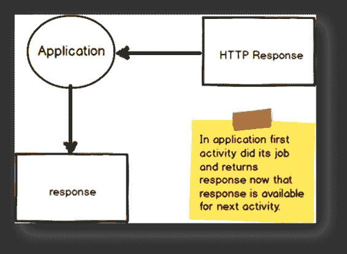
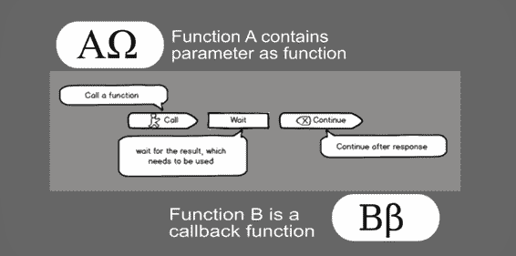
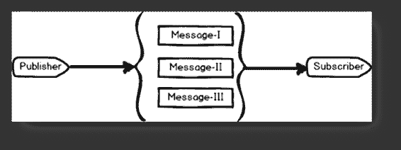

# 第一章引言

今天，我们生活在这样一个世界里，我们试图让自动化让我们生活得更简单，并以更高的效率在更短的时间内为我们完成最困难的部分。我们用机器做饭，这让我想起机器人厨师已经成为旧闻

现在，想象一下这样一个场景:我们正在处理一个企业应用程序，由于动态操作，注册了数百万个活动和事件。这些活动中的许多导致了一组级联的数据库操作，这些操作已经在生成新数据时安排了事件。作为一名架构师或从事这项工作的团队领导，我已经被各种想法轰炸了——是先处理事件，还是先处理尚未生成的数据。让我们简化一下。



图 1:图示视图

图 1 描述了我们要简化的故事。在我们的应用程序中，第一个活动完成了它的工作，并返回*响应*，可用于下一个活动。这个响应成为下一个活动的输入。让我们称这个回调为简化这个场景的第一步。

### 回拨功能

在前面的部分中，我们用外行语言讨论了回调。现在让我们理解什么是回调函数，以进一步简化我们的下一步工作。

简单定义，回调函数是:

*   一个有望生成“回调”的函数，该函数可以被传递给另一个函数，该函数可以进一步等待这个函数完成处理，然后再开始自己的执行
*   通过作为参数传递给另一个函数来调用(也就是说，一个函数可以是另一个函数的参数)
*   通过事件调用(例如，HTTP 帖子)

以下是最后一个项目符号的图形表示:



图 2:回调流程的示意图

这里我们描述的是用一个参数调用函数 A，这个参数恰好是函数 B。在开始自己的执行之前，函数 A 决定通过调用函数 B 来检查函数 B 的预期结果。瞧——B 是我们的回调函数。

 1 简单回调函数

```cs

<!DOCTYPE
  html>

<html>

<head>

<script
  src="https://ajax.googleapis.com/ajax/libs/jquery/1.12.4/jquery.min.js"></script>

<script>

$(document).ready(function(){

  $("button").click(function(){

  $("div").hide("drop", function(){

  alert("Hi! I called, callback.");

  });

  });

});

</script>

</head>

<body>

<button>Callback</button>

<div>Contents
  in this area will be hide using callback function.</div>

</body>

</html>

```

在代码清单 1 中，我们使用了 jQuery 的 hide 方法，它只是隐藏了 div。因此，首先，按钮的 click 函数会等到 div 被隐藏，然后显示 alert。

|  | 注意:回调函数的完整讨论超出了本书的范围。 |

按照[维基百科](https://en.wikipedia.org/wiki/Callback_(computer_programming))的说法，回调是“作为参数传递给其他代码的一段可执行代码，期望它在某个方便的时间回调(执行)该参数。”

### 发布者/订阅者模式(又称发布者/订阅者模式)

在上一节中，我们向您介绍了回调函数。让我们来看看与活动及其订阅相关的原始挑战的另一个方面。

**应用程序如何在不知道接收者身份的情况下将通知/消息发送给有兴趣接收的应用程序**

 **你猜对了——这是酒馆/酒馆模式。你们中的许多人可能已经意识到了这一点。在不深入探讨这个模型的复杂性和巨大可能性的情况下，让我们深入了解一下这是如何在 WebHooks 中完成的。发布者/订阅者(或发布者/订阅者)模型是常见的解决方案之一。

例如，考虑一个场景，其中一些应用程序需要从不在其范围内的应用程序接收消息(也就是说，它没有被订阅任何事件)。在这个场景中，我们需要至少一个中介来促进两个应用程序之间的通信。

很容易想到更复杂的场景，其中一个应用程序需要来自多个应用程序的消息(反之亦然)。



图 3:酒馆/酒馆的示意图

在图 3 中，有一个发布者(应用程序)和一个订阅者(或接收者)，它们接收三种类型的消息。内部使用发布者/订阅者模式的微软 Biztalk 服务器就是这种模式的一个例子。

### web 手册

简而言之，网络钩子是用户定义的 HTTP 回调，它配置了一个事件，并将调用一个事件触发器(回调)。神奇的是，事件的来源可能在同一个应用程序中，也可能在外部。回调可以由应用程序的用户和开发人员配置和管理。

|  | 提示:WebHook 的存在意味着执行一个动作的意图。换句话说，网络钩子主要是包含要执行的实际代码的正确事件的连接。 |

### 它是如何工作的

考虑使用 REST API，当触发事件发生时调用该 API(比如 HTTP POST)。简而言之，最终用户订阅了一个特定的触发器，开发人员将通过 HTTP POST 通知该触发器。网络钩子以最少的设置为您提供了强大的功能，因为通过 HTTP 的通知打开了一个庞大而繁荣的网络应用生态系统。

根据维基百科:“网络开发中的网络钩子是一种通过自定义回调来增强或改变网页或网络应用程序行为的方法。这些回调可能由第三方用户和开发人员维护、修改和管理，这些用户和开发人员不一定隶属于原始网站或应用程序。”

|  | 注:“网络钩子”一词是由杰夫·林赛于 2007 年提出的。 |

从开发人员的角度来看，现实场景可能像在存储库中推送代码、持续构建以及通过 HTTP POST 发布数据。例如，网络钩子可以指示 Dropbox 中的文件发生了变化，GitHub 中的代码发生了变化，PayPal 中的支付已经开始，或者 Trello 中的卡已经创建。

### ASP。网络 web 手册

ASP.NET 网络钩子是网络钩子在 ASP.NET 的实现。目前，ASP.NET 网钩正在预览(不适用于 ASP.NET 核心)。ASP.NET 的实现支持发送方和接收方。在引擎盖下，它使用 ASP.NET 网络应用编程接口发送和接收通知。

在 ASP.NET 网上发布和订阅的完整周期是这样的:

*   发送方公开事件供客户端订阅
*   接收者通过注册一个网络钩子来订阅

是的，就是这么简单。如果这还没有意义，试着再坚持几章，这将是值得的。

### 结论

在本章中，我们探讨了网络钩子和发布者/订阅者模型。**