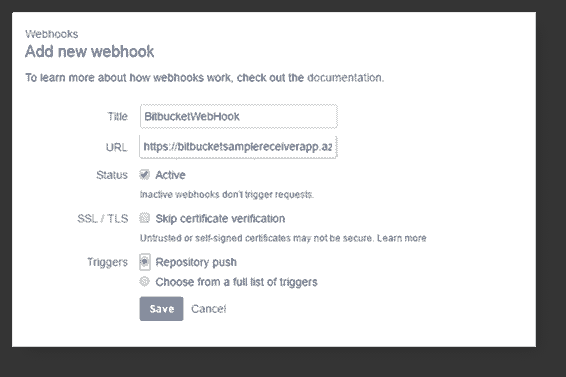

# 第 2 章使用网络钩子

我最喜欢的 ASP.NET 网络钩子的一个方面是它是开源的，你可以很容易地得到它的源代码来根据你自己的需求定制和更新。

正如我们将很快看到的，开始使用网络钩子很容易。但是在我们深入研究之前，我们需要先了解一些概念，如网络钩子接受者、网络钩子接受者 URIs 和网络钩子处理程序。

### 网络挂钩接收器

为从其他人那里接收网络钩子而创建的包/模块被称为网络钩子接收器。有些发件人可能需要简单的配置，而其他人则要求复杂的配置。在配置过程中可能会涉及一些额外的步骤，比如注册和验证。这也取决于发送方使用的安全模型。这是由发送者做出的选择。

一些发送方使用[一推一拉](https://en.wikipedia.org/wiki/Push%E2%80%93pull_strategy)模型，其中 HTTP POST 请求不包含任何数据，但包含对触发事件的引用。在这种情况下，我们可能需要额外的数据，比如一个基于触发事件的单独请求，以便单独提取数据供我们使用。

微软 ASP.NET 网络钩子意味着接受和验证来自特定发送者的网络钩子。单个 WebHook 接收器可以根据自己的配置设置支持多个 WebHook。换句话说，我们可以说，如果我们为 WebHook 配置了 10 个 Bitbucket 存储库，那么我们的一个 Bitbucket WebHook 接收器可以接受来自所有这 10 个存储库的 WebHook。

### URI 的 WebHook 接收器

所有的网络钩子提供者在配置网络钩子时需要不同的信息；对于不同的 WebHook 接收器，您可能需要不同的 URI。表 1 描述了不同 WebHook 接收器的不同 URI 格式。

表 1: URI 格式-网络挂钩接收器

| 各种网络挂钩接收器的 URI 格式 |
| --- |
| 听筒 | URI 格式 |
| --- | --- |
| Bitbucket | `https://<host>/api/webhooks/incoming/bitbucket/?code=secret_key` |
| 收纳盒 | `https://<host>/api/webhooks/incoming/bitbucket/?{id}` |
| 开源代码库 | `https://<host>/api/webhooks/incoming/bitbucket/{id}?code=secret_key` |
| 照片墙 | `https://<host>/api/webhooks/incoming/instagram/{id}` |
| MailChimp(电子邮件) | `https://<host>/api/mailchimp/?code=secret_key` |
| 蚊子！蚊子 | `https://<host>/api/webhooks/incoming/myget?code=secret_key` |
| 松弛的 | `https://<host>/api/webhooks/incoming/slack/{id}` |
| 种类 | `https://<host>/api/webhooks/incoming/stripe/{id}?code=secret_key` |
| VSTS | `https://<host>/api/webhooks/incoming/vsts?code=secret_key` |
| 怎地克 | `https://<host>/api/webhooks/incoming/zendesk/{id}?code=secret_key` |

典型的 URI 是这样的:

https://<host>/API/web hooks/传入/ <receiver>/{id}</receiver></host>

其中:

*   <host>是你申请的公开网址</host>
*   <receiver>是接收方的名称(在我们的例子中，它是位桶)</receiver>
*   {id}是一个标识符(在大多数情况下是可选的)，可用于标识特定的 WebHook 接收器配置

### WebHook 交易商

WebHookHandler 是一个抽象类，实现 IWebHookHandler 接口。在创建应用程序或我们的处理程序时，就像我们案例中的 Bitbucket 处理程序一样，不使用 IWebhookhandler 接口，而是直接使用 Webhookhandler 抽象类。

WebHook 请求可以由一个或多个处理程序处理，这些处理程序使用它们自己的 order 属性从最低到最高(1 到 100)按顺序调用。

|  | 提示:Order 为整数，DefaultOrder 值为 50。 |

可能会有一些场景，我们必须向原始应用编程接口发回响应。为此，我们可以为处理程序设置 Response 属性。设置响应属性的一个好例子是 HTTP 状态代码 410–消失。这表明 WebHook 不是活动的，不能接受进一步的请求。

|  | 提示:响应属性对于处理程序是可选的，所以如果业务案例不需要响应，就不要使用它。 |

### 消耗网络钩子

现在让我们把它们放在一起。有两种方法可以让你开始使用这项技术，并开始使用网络钩子。

*   添加一个引用，你就可以开始了
*   提供的示例可以作为您的切入点。但是，您需要设置 WebHook 源存储库来正确编译这些示例。这一要求的原因是示例使用源代码，而不是 NuGet 包。

所有的网络钩子在 NuGet 包中都是可用的；您只需要从 NuGet 资源中获取包。

|  | 提示:所有 NuGet 包均可在:[微软获得。AspNet.WebHooks](https://www.nuget.org/packages?q=Microsoft.AspNet.WebHooks) 。 |

|  | 注意:还可以获得 Visual Studio Extension 的优势——详情请参考这里的。 |

NuGet 包有三个模块:

*   一个名为 Common 的模块，在发送方和接收方之间共享。
*   一个专门为您希望将自己的网络钩子发送给其他人的场景开发的模块，名为 Sender。
*   一个名为接收器的模块，提供从其他人那里接收网络钩子的支持。

在本节中，我们将详细讨论如何在您自己的应用程序中使用 Bitbucket WebHook 接收器。我们将引用一个示例应用程序，并使用 NuGet 包，而不是直接引用我们的项目。

首先，让我们创建一个接收器项目；在这个应用程序中，我们将使用 Visual Studio 2015。

1.  从 Visual Studio 中创建新项目。


图 4:创建新项目

2.  选择一个带有 Web API 模板的空项目，如图 5 所示。


图 5:选择项目模板

3.  使用**管理 NuGet 软件包管理器**对话框或**软件包管理器**控制台安装 NuGet 软件包。


图 6:获取包管理器对话框


图 7: NuGet 包管理器控制台

4.  搜索微软。并确保您已经选中了**包含预发布**选项。
5.  键入 Install-Package Microsoft。如果您使用的是包管理器控制台，请使用。

|  | 注意:您会注意到项目中添加了新的程序集:Microsoft。微软。微软。网页挂钩。接收器。比特桶 |

#### 唯一配置键

唯一的配置密钥只不过是每个 WebHook 接收器的唯一密钥。它包含一个 secret_key，长度应该在 32 到 128 个字符之间。这把钥匙只不过是一把 [HMAC](https://en.wikipedia.org/wiki/Hash-based_message_authentication_code) 。

有很多工具可以用来生成密钥。在本书的所有示例中，我们使用了可用的工具[在这里](http://www.freeformatter.com/hmac-generator.html)来生成 HMAC(或者换句话说，我们的 WebHook 接收者的 secret_key)。

表 2 列出了每个接收器的密钥。

表 2:唯一的配置密钥

| 唯一配置密钥 |
| --- |
| 听筒 | 钥匙 |
| --- | --- |
| Bitbucket | MS _ webhookereceiversecret _ Bitbucket |
| 收纳盒 | MS _ webhookereceiversecret _ Dropbox |
| 开源代码库 | MS _ webhookereceiversecrit _ GitHub |
| 照片墙 | 它需要两把钥匙:MS _ webhookereceiversecrit _ InstagramId–客户端 IdMS _ webhookereceiversecret _ insta gram–客户端机密 |
| MailChimp(电子邮件) | MS _ webhookereceiversecrit _ MailChimp |
| 蚊子！蚊子 | MS _ webhookereceiversecret _ my get |
| 松弛的 | MS _ webhookereceiverscrest _ Slack |
| 种类 | MS _ webhookereceivesecret _ Stripe |
| VSTS | VSTS 秘书处 |
| 怎地克 | MS _ WebHookReceiveRescrete _ Zenddesk |

要使用 secret_key 值设置唯一的配置密钥，我们需要添加一个具有唯一名称的配置密钥。在我们的例子中，我们将添加唯一的密钥 MS-webhookereceivesecret _ Bitbucket

为了设置我们的应用程序成功接收预期的通知，我们必须添加一个包含 secret_key 值的唯一配置密钥。为此，只需打开网络。我们新创建的应用程序的配置字段。在此添加密钥；如前所述，每个 WebHook 接收器都有一个唯一的密钥。代码清单 2 显示了如何为 Bitbucket 设置这个。如果您计划基于不同于 Bitbucket 接收器的 WebHook 接收器创建新的应用程序，请参考表 3，列出各个 WebHook 接收器的所有唯一键。

代码清单 2

```

<appSettings>

  <add
 key
="MS_WebHookReceiverSecret_Bitbucket" value
="a5bfbf7b2d2c4ec07757183a61e9570611112ddc2724bde63ba85c0664c75403"/>

  </appSettings
>

```

到目前为止，我们已经创建了一个小应用程序来使用一个 Bitbucket WebHook 接收器，并为它配置了一个唯一的密钥来从特定的 WebHook 获取事件通知。

下一步是初始化一个 WebHook 接收器。为此，从您的项目中打开 WebAPIConfig 文件，并通过添加:Config 对其进行修改。initializereceivebitbucketwooks()，如代码清单 3 所示。

WebHook 接收器可以使用 IWebHookReceiveConfig 接口进行配置，可以使用任何[依赖注入](https://en.wikipedia.org/wiki/Dependency_injection)来实现。

代码清单 3

```

namespace BitBucketSampleReceiverApp
  {

public static 
class WebApiConfig

  {

public static 
void Register(HttpConfiguration config)

  {

  // Web API
  configuration and services

  // Web API routes

  config.MapHttpAttributeRoutes();

  config.Routes.MapHttpRoute(

  name: "DefaultApi",

  routeTemplate: "api/{controller}/{id}",

  defaults: 
new { id = RouteParameter.Optional }

  );

  // Initialize Bitbucket
  WebHook receiver

  config.InitializeReceiveBitbucketWebHooks();

  }

  }
  }

```

|  | 注意:initializereceivebitbucketwebooks()是在 Microsoft.AspNet.WebHooks.Receivers.Bitbucket.dll 定义的扩展方法。更多信息，请参考这里的。 |

WebHook 处理程序只是一个带有特殊操作的简单类。

下一步是创建一个处理程序来接收来自 Bitbucket 的事件通知。为了实现这一点，我们需要做以下工作:

*   添加新文件夹，并将其命名为 WebHooks。您可以在这个文件夹下放置任何类型的 WebHook 处理程序。
*   在文件夹 WebHooks 下添加一个新类，并将其命名为:BitBucketWebHookhandler.cs .它应该从 WebHookHandler 继承。
*   在这个示例中，我们将跟踪推送通知。让我们编写代码来接收推送通知(尽管我们也可以编写代码来接收任何其他类型的事件通知)。

|  | 提示:我们可以编写应用程序来接收来自 Bitbucket 的任何类型的事件通知，前提是我们已经为这些事件通知添加了适当的设置。 |

|  | 注意:比特桶推送通知的文档可以在[这里](https://confluence.atlassian.com/bitbucket/event-payloads-740262817.html#EventPayloads-Push)找到。 |

代码清单 4

```

public class BitBucketWebHookhandler : WebHookHandler

  {

public BitBucketWebHookhandler()

  {

  Receiver = BitbucketWebHookReceiver.ReceiverName;

  }

public override Task ExecuteAsync(
string receiver, WebHookHandlerContext context)

  {

var dataJObject =
  context.GetDataOrDefault<JObject>();

var action = context.Actions.First();

switch (action)

  {

case BitBucketAction.Push:

var repository = dataJObject["repository"].ToObject<BitbucketRepository>();

var actor = dataJObject["actor"].ToObject<BitbucketUser>();

  AssessChanges(dataJObject);

break;

default:

var data = dataJObject.ToString();

break;

  }

return Task.FromResult(
true);

  }

private static 
void AssessChanges(JObject dataJObject)

  {

foreach (var
  change 
in dataJObject["push"]["changes"])

  {

var previousValue = change["old"]["target"].ToObject<BitbucketTarget>();

var newValue = change["new"]["target"].ToObject<BitbucketTarget>();

  }

  }
      }

```

在代码清单 4 中，我们有一个专门处理比特桶事件的处理程序。如果在构造函数中看到一个接收器，这个接收器将只返回 BitBucket。

我们的 BitBucketWebHookHandler 类继承了 WebHookHandler(一个抽象类)。这里，我们覆盖了 ExecuteAsync 方法，它实际上有接收器和 WebHookhandlerContext(传入的上下文)方法。

在前面的代码清单中，我们根据这里提到的的 Bitbucket 文档获取数据。

当我们有一个单一的通用处理程序用于多个 WebHook 接收器时，我们会检查一个特定的接收器，比如:if(“BitBucket”)。Equals(receiver，StringComparison。CurrentCultureIgnoreCase))。我们修改后的代码如下所示:

代码清单 5

```

namespace BitBucketSampleReceiverApp.WebHooks
  {

public class BitBucketWebHookhandler : WebHookHandler

  {

public BitBucketWebHookhandler()

  {

  Receiver = BitbucketWebHookReceiver.ReceiverName;

  }

public override Task ExecuteAsync(
string receiver, WebHookHandlerContext context)

  {

if ("BitBucket".Equals(receiver, System.StringComparison.CurrentCultureIgnoreCase))

  {

  ReceivefromBitbucket(context);

  }

return Task.FromResult(
true);
          }

```

在前面的代码清单中，我们已经将我们的主方法提取到了一个小方法 ReceivefromBitbucket()；同样，我们可以为不同的 WebHook 接收器添加更多条件，同时使用通用接收器。

我们已经创建了一个带有 Bitbucket 处理程序的接收器应用程序。我们的小应用程序现在能够与 Bitbucket 通信，或者换句话说，它现在可以监听或接收来自我们为其配置了 WebHook 的 Bitbucket 存储库的事件通知。

#### 公众 URI 对 SSL 支持的重要性

出于安全原因，几乎所有的 WebHook 提供商都要求 URI 是公共的，并且支持 SSL，这样它就可以使用“https”协议。换句话说，如果我们的 URI 不是公共的，那么 Bitbucket 存储库如何连接到您当地的 URI？

#### 搞定大众 URI

正如我们在上一节中讨论的，我们的应用程序应该有一个带有 https 协议的公共 URI，换句话说，它应该是支持 SSL 的。有很多方法可以通过 SSL 公开您的应用程序:

*   购买域名
*   购买主机
*   购买 SSL 证书
*   部署应用程序
*   用 SSL 绑定您的域

这些步骤需要资金和大量时间。实现我们部署的最简单方法是使用 Azure。Azure URLs 在内部启用了 SSL，因此我们可以将它们用于我们的应用程序。我们不打算在这里详细讨论 Azure 部署。

|  | 注:详见 [Windows Azure 网站简明](https://www.syncfusion.com/resources/techportal/details/ebooks/windowsazurewebsite)。 |


图 8:发布对话框

我们现在已经在 NuGet 包的帮助下完成了使用网络钩子的整个周期。现在让我们看看如何配置 Bitbucket 存储库，以防您想使用第二个选项来浏览所提供的示例。由于这些示例使用源代码，而不是 NuGet 包，因此您必须执行以下步骤。如果您对执行这里概述的练习不感兴趣，您可以跳到下一章。

既然我们已经创建了一个**Bitbucket twebook**接收器应用程序，它可以与 Bitbucket 存储库对话并监听事件通知，让我们进入下一步。

下一步是配置我们的 Bitbucket 存储库，它将向我们的 BitBucketWebHook 接收器发送事件通知。

1.  转到您的 Bitbucket([https://bitbucket.org](https://bitbucket.org/))帐户，使用有效凭据登录或创建一个，以防您没有 Bitbucket 帐户。
2.  去你的仓库(我们用的是[这个](https://bitbucket.org/g_arora/bitbucketwebhookapp))。
3.  点击导航下的设置**。**
4.  单击**集成**部分的**网络挂钩**。
5.  在**网钩**页面，点击【添加网钩】(更多信息，请到[这里](https://confluence.atlassian.com/display/BITBUCKET/Manage+Webhooks))。
6.  输入有意义的标题(例如，BitbucketWebHook)
7.  输入正确的 URI(格式为 https://<host>/API/webhooks/传入/bitbucket/？代码=secret_key)的公共应用程序，网址为:[http://bitbucketsamplereceiverapp.azurewebsites.net/](http://bitbucketsamplereceiverapp.azurewebsites.net/)。因此，我们实际的 URI 网络钩子应该是:[https://bitbucketsimplereceprapp . azurewebsites . net/API/网络钩子/传入/bitbucket/？代码=秘钥](https://bitbucketsamplereceiverapp.azurewebsites.net/api/webhooks/incoming/bitbucket/?code=secret_key)</host>
8.  我们的秘密密钥将是一个生成的 HMAC——参考前面关于如何生成秘密密钥的部分。
9.  自定义您的选择。您可以绕过 SSL/TLS 证书验证。
10.  触发器:

1.  选择**存储库推送**或
2.  从完整的触发器列表中选择您选择的触发器。

11.  完成后，点击**保存**。



图 9:添加新的网络钩子

|  | 提示:WebHook URI 格式为:https://<host>/API/webhooks/传入/位桶/？代码=秘密密钥</host> |

|  | 注意:在配置中，secret_key 应该包含与 MS _ webhookereceiversecret _ bitbucket 密钥相同的值， |

我们都准备好了，只有一个例外，我们仍然需要在我们的 webconfig.cs 中设置 secret_key。我们已经添加了密钥 MS _ webhookereceivesecret _ Bitbucket，但是没有任何值，所以我们的下一步是为我们的配置密钥分配一个值。

不需要在我们的应用程序中增加价值(您也可以在创建应用程序时为您的 webconfig 增加价值)，因为我们已经部署了应用程序。如果我们要编辑 webconfig 文件，那么我们需要重新部署我们的应用程序，这真的没有意义。在这里，我们可以使用 Azure 的强大功能来添加我们的配置密钥。为此，请转到您的 Azure 门户并访问应用程序设置，然后添加密钥和值，如下图所示。


图 10:配置应用程序设置

### 关于网络钩子过程的一个快速注释

一旦网络钩子接收器验证了网络钩子请求，它就告诉应用程序或用户代码进行处理。换句话说，第一个网络钩子接收器验证网络钩子请求，网络钩子处理程序开始处理。

### 验证 WebHook 接收器应用程序

最后，我们准备测试我们的 WebHook 接收器。从您配置了 WebHook 的 Bitbucket 存储库中，在本地对您的任何文件进行一些更改，然后将其推送到远程存储库。我们可以通过两种方式验证事件通知:

*   从位桶视图请求页面进行验证
*   验证应用程序上的传入数据(可以远程调试)

#### 的验证

为了让我们更容易编辑事件通知，请返回到您的 Bitbucket 存储库的 WebHook 设置，并将其设置为接收推送和问题的事件/通知。


图 11:编辑现有的网络钩子

现在，回到存储库，创建一个新问题或编辑现有问题中的一些更改。这将触发特定的事件通知。

您可以通过在您的 Bitbucket 存储库中访问设置>网络挂钩>查看来验证这一点。


图 12:网络钩子请求日志

我已经创建了一个问题，然后评论。在图 12 中，您可以看到触发了什么事件以及细节是什么。有关更多详细信息，您可以单击查看详细信息链接。


图 13: WebHook 请求详细信息

在详细信息页面上，您可以获得请求的所有详细信息(HTTP 状态、运行时间、请求时间等)。)你也可以得到请求和正文的详细信息。

我们已经通过使用 Bitbucket 设置页面验证了我们的 WebHook 工作正常，在该页面中，我们看到了触发了哪个事件以及我们收到了什么。开发这样的应用程序时，主要关注的是最终结果，而不是配置的设置。因此，如果需要进行分析来排除可能的错误，就需要立即调试应用程序。

因此，让我们检查一下我们的应用程序是否按预期接收到了数据。将调试器附加到应用程序，并在存储库中进行一些更改。

|  | 注意:我们不打算讨论如何调试 Azure 应用程序——这超出了本书的范围。参考[本文](https://docs.microsoft.com/en-in/azure/vs-azure-tools-debug-cloud-services-virtual-machines)了解更多关于调试 Azure 应用程序的信息。 |

为了验证我们的应用程序，我刚刚修改了 ReadMe 文件，然后将更改推回到远程存储库。在这里，Push 通知被触发并通知我们的 WebHook 接收器，因此我们的应用程序应该达到图 14 所示的调试点。我们应该得到触发数据。


图 14:调试 WebHook 接收器应用程序

在这里，我们收到了所需的一切——我们的网络钩子工作正常。在这个应用程序中，我们验证并理解了我们的 WebHook 接收器如何与 Bitbucket 存储库对话，以及我们如何将请求的数据返回给我们的订阅应用程序。

在这个应用程序中，我们没有使用数据，但是在我们将使用钩子的实际环境中，数据将被更谨慎地使用。在下一节中，我们将创建一个简单的应用程序来消费和处理接收到的数据。

### 建立一个 WebHook 源码库

如果您已经决定使用提供的示例，那么您已经知道需要设置您的 WebHook 源存储库，因为它正在使用这些示例。本节将引导您完成这一点。

要创建或定制一个网络钩子，你应该有完整的源代码。在本节中，我们将讨论如何设置您的网络钩子源存储库，并为创建或定制网络钩子做好准备。

ASP.NET WebHook 是开源的，它的源代码可以从 GitHub 资源库[这里](https://github.com/aspnet/WebHooks)获得。如果您计划添加或定制 WebHook，您应该按照以下步骤设置存储库:

1.  访问[https://github.com](https://github.com)并登录您的帐户。
2.  转到 ASP.NET 网络钩子库网址。
3.  分叉存储库并遵循说明。
4.  使用您最喜欢的图形用户界面或命令行界面在本地启动。我更喜欢使用 GitBash 或 GitExtensions 进行 Windows 操作。
5.  将存储库克隆到您首选位置的本地系统。
6.  检查开发分支是否有任何增加或修改。
7.  在任何修改之后，向主存储库发出一个拉请求(PR)，您从主存储库分叉您的存储库。

要创建一个新的拉取请求，你只需要有一个有效的 GitHub 账户，最重要的是，你必须为开源贡献签署 **cla。关于 cla 的更多信息，请参考这里的。**


图 15:ASP.NET 网络钩子库

|  | 注意:请简要参考[GitHub](https://www.syncfusion.com/resources/techportal/details/ebooks/GitHub_Succinctly)了解如何使用 GitHub 存储库。 |

有很多 WebHook 发送器和接收器可用；您可以使用存储库示例开始使用这些 WebHooks 之一，或者使用 NuGet 包创建自己的自定义应用程序。

GitHub 存储库中提供了 WebHook 接收器示例。要使用样品，只需要去[这个网站](https://github.com/aspnet/WebHooks/tree/master/samples "绍ቘ뿷빝Ķ肀緑")选择你的样品。目前，可用的样本(用于接收器)有:

*   [蔚蓝](https://github.com/aspnet/WebHooks/blob/master/samples/AzureReceivers)
*   [Bitbucket](https://github.com/aspnet/WebHooks/blob/master/samples/BitbucketReceiver)
*   [DropBox](https://github.com/aspnet/WebHooks/blob/master/samples/DropboxReceiver)
*   [GitHub](https://github.com/aspnet/WebHooks/blob/master/samples/GitHubReceiver)
*   insta gram
*   [蚊子](https://github.com/aspnet/WebHooks/blob/master/samples/MyGetReceiver)
*   [松弛](https://github.com/aspnet/WebHooks/blob/master/samples/SlackReceiver)
*   [条纹](https://github.com/aspnet/WebHooks/blob/master/samples/StripeReceiver)
*   [VSTS](https://github.com/aspnet/WebHooks/blob/master/samples/VstsReceiver)
*   [怎地](https://github.com/aspnet/WebHooks/blob/master/samples/ZendeskReceiver)

|  | 注意:所有示例都是指实际的网络钩子接收项目，并且是 ASP.NET 网络钩子解决方案的一部分。当您要调试实际的源代码时，这些是很重要的。 |

### 结论

在这一章中，我们已经讨论了所有的 ASP.NET 网络钩子。我们已经研究了网络挂钩接收器、网络挂钩发送器和 URI 格式。