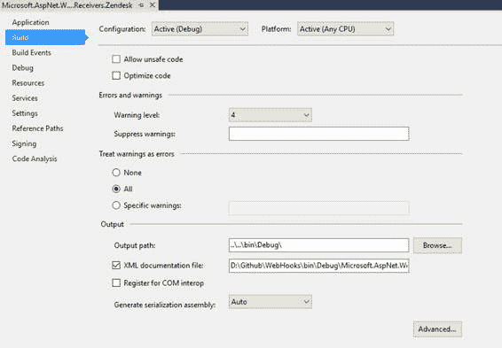

# 四、创建网络挂钩接收器

在前几章中，我们已经讨论了如何在应用中使用现有的 WebHook 接收器。为了使用现有的 Webhook 接收器，我们需要采取一些步骤(已经讨论过)并为我们自己的应用进行定制。有时可能会出现可用的 WebHook 接收器不符合您的设计需求的情况。在这种情况下，您可以轻松创建自己的 WebHook。我们将在这一章专门为 Zendesk 创建一个新的 WebHook 接收器。我们还将完成创建新的 WebHook 接收器的所有步骤。

## 开始

任何 WebHook 接收者都是为了接收来自发送者的通知而创建的。同样，我们创建一个 Zendesk WebHook 接收器的目的是接收来自 zenddesk 应用的通知。

在我们可以开始接收通知之前，我们需要知道 URI 向证大注册了什么。还需要其他信息，例如可用的 Zendesk 事件、操作和订阅通知。

|  | 注意:要了解更多关于 Zendesk 推送通知的信息，请参考这里的。 |

Zendesk 开发者网站记录了一切，该网站描述了对安卓设备推送通知的期望。文档总结了注册我们的应用和设备所需的所有内容。注册过程中，证大门户需要一个有效的帐户。

|  | 提示:如果您在证大没有账户，请申请一个试用账户来测试您的接收器。 |

### 先决条件

以下是开始使用证大网接收器的先决条件:

*   证大的有效账户
*   从[证大开发者文档门户](https://developer.zendesk.com/embeddables/docs/android/handle_push_notifications_wh#webhook-api)了解安卓设备的推送通知
*   ASP.NET 网络知识
*   Visual Studio 2015 或更高版本
*   ASP.Net 网钩知识

### 网络挂钩接收器的类别

我根据最终用户(希望接收通知)和开发人员(将通知实现到自己的应用)的可用性，将 WebHooks 接收器分为两类。你并不总是想让你的网络挂钩接收器对所有人都可用。有时，可能需要在您自己的应用内部或专用网络中使用 WebHook 接收器。

您可以给这些类别起任何合适的名字。这些名字是基于我自己对 WebHook 接收器的看法和理解。

这些 WebHook 接收器不是公开可用的，因此这些接收器没有公开可用的 NuGet 包。但是，您可以创建 NuGet 包，并在私有的 NuGet 服务器上使用它们(在您的组织内)。

这些网络挂钩接收器的主要优点是:

*   没有定义开发规则来编写代码。您可以根据自己的方便，按照自己的风格和编码标准编写代码。
*   ASP.NET WebHooks 源代码不是必需的，所以没有必要设置 Github 存储库。
*   不需要源代码，所以不需要做任何拉取请求。

创建网络挂钩接收器时，您应该要求的唯一一件事是获取软件包来设置网络挂钩接收器的基础，它们是:

*   微软。通用(此处为)–提供通用功能，可用于接收方和发送方
*   微软。AspNet . WebHooks.Receivers(此处)提供了接收 WebHooks 的标准方式。

这些网络挂钩接收器是公开提供的，可以很容易地作为 NuGet 包获得。任何人都可以下载 NuGet 包并开始自己的实现。这些网络挂钩接收器也是 ASP.Net 网络挂钩存储库的一部分，可以作为官方网络挂钩接收器发布。

要从公共 WebHook 接收器开始，您需要:

*   要设置 GitHub 存储库
*   遵循文档编写代码
*   当您编写代码时，您应该遵循 TDD(测试驱动开发)
*   WebHook Receiver 项目名称应该采用 Microsoft . aspnet . webhooks . Receiver .<product-name-for-which-this-receiver-is>的模式。在我们的例子中，它将是微软</product-name-for-which-this-receiver-is>
*   所有拉取请求都应该在[存储库](https://github.com/aspnet/WebHooks)的开发分支上。

一旦获得批准，并且拉取请求被合并到开发分支中，您的 WebHook 接收器将可用。NuGet 包一经发布就将可用。

|  | 注意:我们将创建公共网络挂钩接收器，因此我们的 Zendesk 网络挂钩接收器将作为一个 NuGet 包提供。 |

### 开始写代码

在前面几节中，我们介绍了创建 Zendesk WebHook 接收器的基本步骤。当我们要创建公共的 WebHook 接收器时，我们需要建立一个 GitHub 存储库，这样我们就可以获取源代码并发出拉取请求。

我们不会讨论建立 GitHub 存储库、获取源代码或发出拉取请求，因为这些都已经在第 2 章中讨论过了。如果您跳过了它，请在继续之前参考第 2 章。

最后，我们准备开始为我们的 Zendesk WebHook 接收器添加一个项目和代码。

启动 Visual Studio，在文件夹 src 下添加一个新的库项目，并将其命名为

打开解决方案资源管理器，右键单击项目以获取项目的属性页。这里你需要做一些改变:


图 26:项目属性

在项目属性页的这一部分，输入**程序集名称** Microsoft。并将**默认命名空间**设置为微软。

将**条件编译符号**设置为 CODE _ ANALYSISASPNETWEBHOOKS。


图 27:条件编译符号

将**输出**设置到公共 bin 文件夹，包括 XML 文档。



图 28:设置输出路径

在**签名**部分，选择一个强名称密钥文件， **35MSSharedLib1024.snk，**这里[提供](https://github.com/aspnet/WebHooks/tree/dev/tools)。


图 29 在组件上签名

在**代码分析**部分，设置 FxCop 规则并选择可用的文件 FxCop.rulset】在此。


图 30:设置代码分析规则

更改完毕后，点击**保存**保存更改，关闭属性页面。

为了开始编写实际的代码，我们需要添加某些文件。

1.  打开解决方案资源管理器，右键单击项目名称，选择**现有项**。选择**自定义词典. xml** 并添加为链接。现在，右键单击解决方案资源管理器中同一文件的名称，并将**构建操作**设置为**代码分析字典**。
2.  打开解决方案资源管理器并添加文件夹扩展和网络挂钩
3.  将文件 HttpConfigurationExtensions.cs 添加到扩展文件夹下。
4.  在 WebHooks 文件夹下，添加以下文件:

1.  ZendeskDevice.cs
2.  ZendeskNotification.cs
3.  ZendeskPost.cs
4.  ZendeskWebHookReceiver.cs(这是我们的主文件，负责接收通知)。

5.  您还需要设置一个[通用组件](https://blogs.msdn.microsoft.com/jjameson/2009/04/03/shared-assembly-info-in-visual-studio-projects/)和一个[资源文件](https://msdn.microsoft.com/en-in/library/7k989cfy(v=vs.90).aspx)。

我们的扩展文件 HttpConfiguration Extension.cs 负责从应用中初始化使用中的 Zendesk WebHook 接收器。它包含一个简单的扩展方法:

代码清单 28

```cs

public static 
void InitializeReceiveZendeskWebHooks(
this HttpConfiguration config)
  {

  WebHooksConfig.Initialize(config);
  }

```

我们有 WebHook 接收器 ZendeskWebhookReceiver，它实现了抽象类 WebHook receiver。将以下代码添加到此类中:

代码清单 29

```cs

public override 
async Task<HttpResponseMessage> ReceiveAsync(
string id, HttpRequestContext context, HttpRequestMessage request)

  {

if (id == 
null)

  {

throw new
  ArgumentNullException(nameof(id));

  }

if (context == 
null)

  {

throw new
  ArgumentNullException(nameof(context));

  }

if (request == 
null)

  {

throw new
  ArgumentNullException(nameof(request));

  }

if (request.Method == HttpMethod.Post)

  {

  // Ensure that we use
  https and have a valid code parameter

await EnsureValidCode(request, id);

  // Read the request
  entity body.

  JObject data = 
await ReadAsJsonAsync(request);

    // Call registered
  handlers

return await ExecuteWebHookAsync(id, context, request, 
new 
string[] { DefaultAction }, data);

  }

else

  {

return CreateBadMethodResponse(request);

  }

  }

```

我们已经完成了 Zendesk WebHook 接收器的创建。请注意，我们没有按照测试驱动开发(TDD)编写测试；我们应该同时写测试。

### 写作测试

在编写 Zendesk WebHook 接收器时，我们应该遵循测试驱动的开发。要开始编写测试，我们应该遵循以下步骤:

*   在测试文件夹下添加新的测试项目。
*   将项目命名为微软。测试
*   打开项目属性页面并执行自定义(请参考第 4 章的“配置项目”部分)。
*   添加文件夹**网络挂钩**和**消息**
*   在文件夹 WebHooks 下，添加以下文件:

*   ZendeskDeviceTest.cs
*   怎地 skNotificationTest.cs
*   邮件测试. cs
*   ZendeskWebHookReceiverTest.cs(主测试文件)

*   添加 xunit 的 NuGet 包

下面是我们测试文件的代码片段:

代码清单 30

```cs
  [Fact]

public void
  ReceiverName_IsConsistent()

  {

  // Arrange

  IWebHookReceiver rec = 
new ZendeskWebHookReceiver();

string expected = "zendesk";

  // Act

string actual1 = rec.Name;

string actual2 = ZendeskWebHookReceiver.ReceiverName;

  // Assert

  Assert.Equal(expected, actual1);

  Assert.Equal(actual1, actual2);

  }

  [Fact]

public async Task
  ReceiveAsync_Throws_IfPostIsNotUsingHttps()

  {

  // Arrange

  Initialize(TestSecret);

  _postRequest.RequestUri = new Uri("http://some.no.ssl.host");

  // Act

  HttpResponseException ex = await Assert.ThrowsAsync<HttpResponseException>(() =>
  ReceiverMock.Object.ReceiveAsync(TestId, RequestContext, _postRequest));

  // Assert

  HttpError error = 
await ex.Response.Content.ReadAsAsync<HttpError>();

  Assert.Equal("The WebHook receiver
  'ZendeskWebHookReceiverProxy' requires HTTPS in order to be secure. Please
  register a WebHook URI of type 'https'.", error.Message);

  ReceiverMock.Protected()

  .Verify<Task<HttpResponseMessage>>("ExecuteWebHookAsync", Times.Never(), TestId, RequestContext,
  _postRequest, ItExpr.IsAny<IEnumerable<string>>(), ItExpr.IsAny<
object>());

  }

```

### 提交并创建拉取请求

我们已经完成了 Zendesk WebHook 接收器的创建，现在我们必须向存储库提交我们的更改并发出拉取请求。我们不打算详细讨论这个问题。详见 [GitHub 简洁](https://www.syncfusion.com/resources/techportal/details/ebooks/GitHub_Succinctly)书。

|  | 提示:要了解创建拉取请求的更多信息，请参考本文。 |

我们为 Zendesk 创建了一个拉取请求，该请求已被批准，现在可以作为 NuGet 包[在此](https://www.nuget.org/packages/Microsoft.AspNet.WebHooks.Receivers.Zendesk/)公开获得。

### 结论

在本章中，我们讨论了用一个示例应用创建一个 WebHook 接收器。