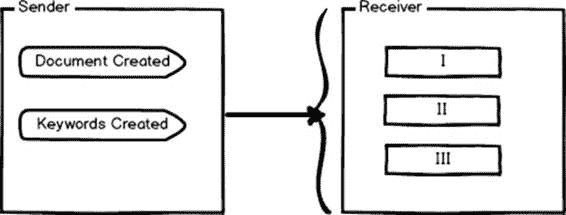

# 五、发送者

在第 4 章中，我们讨论并完成了创建新的 WebHook 接收器所需的所有步骤。现在考虑一个场景，您想要创建自己的发送者，这样其他人就可以为您的发送者创建或消费 WebHook 接收者。在本章中，我们将逐步引导您完成创建自己的发件人的过程。

### web book 发射机

写自己的发送者和消费接收者略有不同；以下各节概述了这一过程。

一个 WebHook 发送者应用应该为用户订阅事件和接收通知提供一个接口、一个 API 或者某种方式。这些事件可能因应用而异。假设我们想要为 [Docunate](http://www.docunate.com/) <sup class="calibre60">TM</sup> 创建 WebHooks 发送方—为此，我们的事件将是:

*   添加、更新、删除的文档
*   添加、更新、删除的文档关键词

一个网络挂钩发送者应用应该能够管理所有用户/订户，包括他们注册的网络挂钩。应该有一种方法来保存这些信息。不要让这种说法动摇你对数据库持久性的想法——有一条出路，我们将很快讨论这个问题。

订阅者和他们的订阅应该以这样一种方式进行映射，即将特定的事件通知发送给为该事件注册的订阅者。换句话说，如果用户 A 订阅了事件文档:已添加，而用户 B 订阅了事件关键字:已添加，则 WebHook 发送方应该向用户 A 发送文档:已添加的通知，向用户 B 发送关键字:已添加的通知。

从头开始实现所有内容将是复杂的，需要比平时更多的努力。对发送者的管理有时也会很痛苦。如果我们想从头开始写自己的发送者，那么我们必须记住所有这些要点(在前面的部分中讨论过)，因为忽略这些可能会使我们的生活变得困难。谢天谢地，ASP.NET 网络挂钩提供了一种创建自己的发送者的方法，让你的工作变得非常简单。

除了在 Azure 存储中管理和持久化订阅之外，ASP.NET WebHooks 还为我们注册订阅事件提供了固有的支持。更重要的是，它为我们提供了一种处理错误和根据需要多次重试通知的方法。它还提供了一种维护发送方和接收方应用之间的队列和负载平衡的方法。简而言之，ASP.NET 网钩为我们提供了创建自己的发送者所需的几乎所有东西。

创建发件人取决于其应用的性质，因此所有发件人都会有一些差异。例如:Bitbucket 发送通知的方式不同于 GitHub 通知。任何发件人的共同点是事件订阅，因为每个发件人都会推送事件通知。换句话说，每当推送事件触发时，Bitbucket 和 GitHub 都会发送通知(如果有人订阅了这些事件，那么他们会收到相同的通知)。

### ASP.NET 样本网页 app

在本节中，我们将讨论一个旨在作为我们的发送者的示例应用，该应用可以在这里下载[。该示例应用旨在向订阅用户发送首选事件的通知。该应用还将提供订阅所有或指定事件的界面，因此订阅者可以接收这些事件的通知。我们的示例 web 应用将具有特定的 web APIs 来执行特定的任务，并将公开所有事件，以便订阅者可以订阅所有或特定的事件。](https://github.com/aspnet/WebHooks/tree/master/samples/CustomSender)

|  | 提示:关于 Web API 的更多信息，请简洁阅读[ASP.NET Web API](https://www.syncfusion.com/resources/techportal/details/ebooks/webapi)。 |



图 31:发送者到接收者的示意图

发送方应用可以一次向所有可能已经订阅的接收方发送事件通知。然而，接收者可以订阅也可以不订阅一个以上的事件。接收者将收到他们订阅的所有事件的通知。它的工作方式类似于拥有一个网络应用编程接口的帖子资源；一旦发布请求完成，发布资源就将数据返回给用户。

以下是我们可以区别对待通知的几种情况:

考虑一个场景，其中所有用户或一组用户需要所有或一个订阅事件的事件通知。在这种可能的情况下，发送方有责任对其进行管理。我们的示例应用(发送方)也能够做到这一点。在接下来的部分中，我们将讨论使用这个应用需要什么基础框架或项目。

另一个重要的场景是匿名用户需要接收该用户所属组的订阅事件的通知。在内部，应用向组发送通知，而不是向单个用户发送通知。因此，订阅者有责任以这样一种方式进行订阅，即每当接收者收到通知时，它都会将其发送给所有组成员。ASP.NET 提供了一种向所有用户同时发送通知的方法。

有时，我们需要向组中除一两个用户之外的所有用户发送通知，或者当用户仅订阅特定事件时。在这个场景中，ASP.NET 帮助我们向所有订阅者/用户发送通知，我们可以很容易地添加简单的逻辑来跳过特定用户的通知。我们将使用类似于:sendToAllUsers.where(s=> s.user！= 'userA ')。

**``**

图 32:向有限数量的用户发送通知的图示视图

图 32 是向订阅用户发送通知的示意图。这里，三个订阅者订阅了事件文档:已创建，但是发送者只向接收者一和接收者二发送通知，而跳过接收者三。

ASP.NET WebHooks 提供了 NuGet 包，通过这些包我们可以轻松地创建我们的示例应用。开始使用我们的示例应用需要以下 NuGet 包:

*   首先，我们需要添加对网络挂钩的支持。这将使用户能够注册网络挂钩。定制 NuGet 包满足了这一要求，在这里可用。
*   示例应用需要让用户注册，并提供订阅所需事件的工具。定制 MVC NuGet 包满足了这一要求，在这里可用。
*   为了实现 Restful API 支持，我们有一个定制 API NuGet 包，在这里可以使用。

除了这些 NuGet 包之外，还需要保存和存储订阅数据。NuGet 提供了一个包来满足 AzureStorage 的这一要求。可以在这里找到。

SqlStorage 是这种坚持的另一种选择，可以在[这里](https://www.nuget.org/packages/Microsoft.AspNet.WebHooks.Custom.SqlStorage)找到。

到目前为止，我们已经基本掌握了如何创建发送者，并且知道了创建示例应用的基本要求。以下几点将帮助我们开始使用示例应用:

*   示例应用将使用 Azure 存储来保存订阅
*   休息应用编程接口将适用于所有用户

要开始使用示例应用，请在 Visual Studio 中打开解决方案资源管理器，然后打开 WebAPIConfig 文件。在 Register 方法的末尾添加以下几行。

代码清单 28

```cs

public static 
void Register(HttpConfiguration config)

  {

  // Other stuff related
  to configuration goes here

  // Load basic support
  for sending WebHooks

  config.InitializeCustomWebHooks();

  // Load Azure Storage
  for persisting subscriptions

  config.InitializeCustomWebHooksAzureStorage();

  // Load Web API
  controllers for managing subscriptions

  config.InitializeCustomWebHooksApis();

  }

```

在前面的代码清单中，我们在示例应用中初始化了对 WebHook 的支持，然后是对 AzureStorage 和 API 的支持。

正如我们在前面几节中所讨论的，发送者应该公开事件，这样订阅者就可以订阅所需的事件进行通知。ASP.NET 网络挂钩在 IWebHookFilterProvider 接口的帮助下提供了一个声明事件的工具。这些事件只是从 WebHookFilter 派生的一个类。因为可以有多个事件，所以总是将事件声明作为集合。

代码清单 29

```cs

public class CustomFilterProvider : IWebHookFilterProvider

  {

private readonly Collection<WebHookFilter> filters = new Collection<WebHookFilter>

  {

new WebHookFilter { Name = "created", Description = "Document created." },

new WebHookFilter { Name = "updated", Description = "Document updated." },

new WebHookFilter { Name = "deleted", Description = "Document deleted." },

  };

public Task<Collection<WebHookFilter>> GetFiltersAsync()

  {

return Task.FromResult(
this.filters);

  }

  }

```

在前面的代码清单中，我们定义了三个事件，分别代表文档创建、更新和删除。如果您想为订户公开，可以在此添加更多事件。

现在，我们只需要为我们的订阅者提供一种方法，为注册的 WebHook 接收者获取订阅事件的通知。

代码清单 30

```cs

public class DocumentApiController : ApiController

  {

  [HttpPost]

public async Task<IHttpActionResult> Create(DocumentModel document)

  {

  //Stuff to create
  document goes here

  DocumentModel documentModel= DocumentProvider.Create(document);

  //Notify for doc:create
  action

await this.NotifyAsync("doc:create",documentModel);

return Ok();

  }

  }

```

在代码清单 30 中，我们负责创建新文档代码的 API 是不言自明的；这里我们通过在 Post 资源的参数中接受一个文档模型来创建一个新文档，并且在创建文档之后，我们立即用数据通知新创建的文档。这段代码并不完整，只是解释发送通知的一个例子。

之前，我们创建了一个 WebHook 发送方，为 WebHook 接收方创建通知；我们讨论的示例应用在这里可用。

下一步是创建一个接收方来接收这些通知，这超出了本章的范围，但将遵循第 4 章中概述的相同步骤。

### 结论

在本章中，我们讨论了使用示例应用创建自定义发送器。我们研究了创建发送者所需的基本框架，并讨论了发送通知的复杂性和范围。