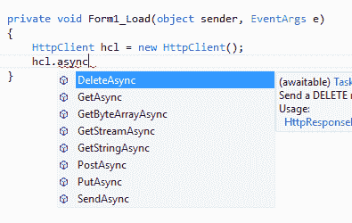
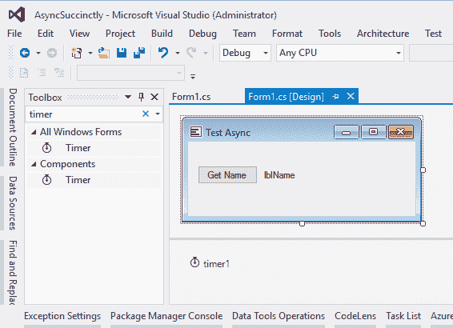
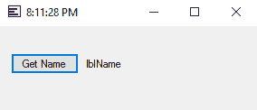
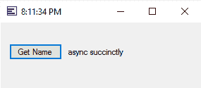
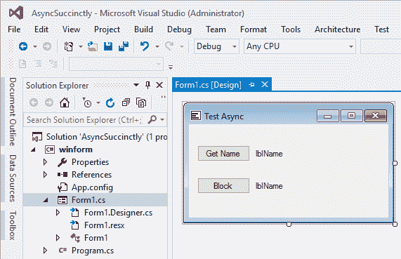
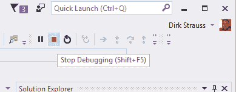
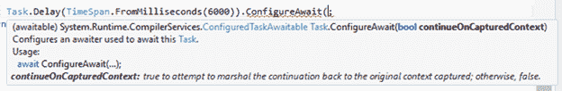

# 第一章入门

## 什么是异步编程？

最近，我的一个朋友受命改进一个大约四年前编写的 Windows 窗体应用程序。当我看着的时候，我看到对数据库的调用锁定了用户界面几秒钟。搜索功能(搜索仅包含 60，000 个条目的表)需要 30 秒到 1 分钟才能将结果返回到表单。这意味着当应用程序查询数据库并做它需要做的事情时，用户界面完全没有反应。用户不能调整它的大小，移动它，或者以任何方式与它交互。相反，用户不得不坐着等待应用程序的响应。读写文件同样令人沮丧。应用程序的无响应产生了负面的感觉——应用程序出现了故障，是旧的(从技术上来说是真的)，并且是不好的。

实际上，应用程序没有出现故障。搜索从数据库返回真实结果。每次都可以将信息保存到数据库中，应用程序创建或读取的文件总是可以工作的。没有什么是“坏的”，但用户界面有时缓慢且无响应的事实(尤其是当客户的工作负载增加时)使得使用该应用程序极其令人沮丧。

虽然这种情况可能是由于糟糕的代码和低效的 SQL 语句的组合造成的，但实际上表单没有响应，因为它是同步完成所有事情的——任何访问用户界面线程(用户界面相关任务通常共享一个线程)的进程都将在同步应用程序中被阻止。因此，如果一个进程被阻止，所有进程都会被阻止。

异步是这类应用程序的可取之处。使用异步方法将允许应用程序保持响应。用户可以调整大小，最小化，最大化，移动窗体，甚至关闭应用程序。对开发人员来说，将异步功能引入应用程序一直是一项复杂的工作，但是在 Visual Studio 2012 中引入异步编程引入了一种简化的方法。异步编程利用了。NET Framework 4.5，它使编码变得更加容易，并将所有繁重而复杂的代码转移到编译器。不过，不要误会我的意思——虽然异步编程仍然是一项复杂的技术，但它已经变得更容易使用了。

## 潜在阻断活动的例子

我们现在知道一件事:async 提高了应用程序的响应能力。但是到底哪些活动可能会被阻止呢？例如，以访问网络资源为例。在同步场景中，如果正在访问的 web 资源太慢或过载，整个程序将被阻塞。下面的列表定义了异步编程将提高应用程序响应能力的几个领域。

网络访问

*   http client(http 客户端)
*   辛迪加客户端

**文件**

*   存储文件
*   StreamWriter
*   StreamReader
*   XmlReader

**图像**

*   媒体捕获
*   位图编码器
*   位图解码器

**WCF**

*   异步服务操作

|  | 注意:Microsoft Visual Studio Enterprise 2015(更新 3)将用于创建本电子书中的所有代码示例。那个。NET Framework 4.6.1 是将要使用的框架。 |

## 编写异步方法

`async`和`await`关键字在异步编程中是必不可少的。使用这些关键字，开发人员能够创建异步方法。但是异步方法还有什么特点呢？事实证明，有几件事需要考虑。方法的签名必须包括`async`修饰符。该方法必须有一个返回类型`Task<TResult>`、`Task`、`,`或`void`。方法语句必须至少包含一个单独的`await`表达式——这告诉编译器，当等待的操作繁忙时，需要暂停该方法。最后，方法名应该以“async”后缀结尾(尽管这比要求的更常规)。你会问，为什么这个惯例会有意义？这是在。. NET Framework 4.5 及更高版本。看看找到`HttpClient`类的异步方法有多容易。打字”。在`HttpClient`对象实例之后的 async”将过滤 Intellisense 列表中的可用方法，如图 1 所示。

|  | 注意:需要注意的是，方法是不可修改的。类型是可选择的。这就是为什么你可以等待一个任务或任务。 |



图 HttpClient 类的异步方法

以类似的方式命名异步方法将允许其他开发人员很容易地发现您在类中创建的异步方法。

让我们看看创建一个模拟从某个数据存储中读取文本的方法有多容易，这个过程需要 6 秒钟才能完成。我们希望我们的 Windows 窗体应用程序在整个过程中保持响应。为此，我们将在表单上放置一个计时器，并在返回文本和设置表单上标签的值之前，单击一个延迟六秒的按钮。在整个过程中，计时器将继续在 Windows 窗体的标题栏中显示当前时间(包括秒)。



图 2:创建窗口窗体应用程序

您可以随意设计表单，但是需要添加一些组件。这些是:

*   纽扣
*   标签
*   Windows 窗体计时器(不添加组件计时器)

对于计时器，创建 tick 事件并添加以下代码:

代码清单 1

```
  private void timer1_Tick(object sender, EventArgs e)
  {
      this.Text = DateTime.Now.ToLongTimeString();
  }

```

在表单加载中，添加以下代码以启动计时器。这是必不可少的，因为否则计时器将无法工作。

代码清单 2

```
  private void Form1_Load(object sender, EventArgs e)
  {
      timer1.Start();            
  }

```

添加一个名为`ReadTextAsync()`的方法，并在方法签名上使用`async`关键字。`Task<string>`告诉我们这个方法返回一个字符串值。它只会在六秒钟的延迟后返回字符串值。

代码清单 3

```
  private async Task<string> ReadTextAsync()
  {
      await Task.Delay(TimeSpan.FromMilliseconds(6000));
      return "async
  succinctly";
  }

```

接下来，为您添加到 Windows 窗体的按钮创建一个单击事件。请务必在此按钮点击事件中添加`async`关键字。使用`await`关键字调用`ReadTextAsync()`方法。最后，将标签的文本值设置为从`async`方法返回的文本。

代码清单 4

```
  private async void button1_Click(object sender, EventArgs e)
  {
      string text = await ReadTextAsync();
      lblName.Text = text;            
  }

```

运行该应用程序，您会注意到表单标题中的时间，同时还有秒数。



图 3:异步窗口表单

单击**获取名称**按钮，等待标签填充从`ReadTextAsync()`方法返回的文本。您会注意到表单保持响应，允许您移动它，甚至调整它的大小。您还会注意到计时器继续滴答作响。



图 4:异步返回文本

异步执行长时间运行或可能阻塞的任务允许您保持应用程序的响应性，这提高了可用性。

|  | 提示:虽然可以从异步方法中返回 void，但是除非您正在创建异步事件处理程序，否则请不要使用 void。一般来说，如果异步方法什么都不返回，那么所有的异步方法都应该返回 Task，如果返回值，则返回 Task <t>。</t> |

## 使用异步时避免死锁

许多开发人员在开始探索异步编程时都会遇到死锁的问题。例如，在混合异步代码和同步代码时，很容易导致代码死锁。在我们调查应用程序为什么会死锁之前，让我们先看一个例子。

首先在表单中添加第二个按钮和标签。完成后，您的表单应该如图 5 所示。



图 5:修改窗口表单

我只是在我们之前创建的表单中添加了第二个按钮和标签。**块**按钮后面的代码将调用异步方法，这将导致死锁。代码清单 5 中的代码需要添加到代码隐藏中。

代码清单 5

```
  private static async Task<string> ReadHelloWorldAsync(string value)
  {
      await Task.Delay(TimeSpan.FromMilliseconds(6000));
      return $"hello
  {value}";
  }

```

`ReadHelloWorldAsync(string value)`是一个异步方法，在返回与字符串参数值连接的字符串值(通过使用字符串插值)之前等待一段延迟。在按钮点击事件中，代码清单 6 中的代码将导致死锁。

代码清单 6

```
  private void button2_Click(object sender, EventArgs e)
  {
      var stringValue = ReadHelloWorldAsync("world");
      lblName2.Text = stringValue.Result;
  }

```

在这里，我试图说明一个影响用户界面应用的问题，包括 ASP.NET 应用。当然，这不会导致控制台应用程序出现问题。运行您的应用程序并点击**阻止**按钮。

|  | 注意:在这样做之前，您应该保存所有重要的项目。这个例子中的代码会导致应用程序死锁。 |

当你点击**阻止**时，你的应用变得没有响应，并且会一直保持这种状态，直到你停止调试它。要停止应用程序，请按住 **Shift + F5** 或在 Visual Studio 中单击**停止调试**。



图 6:停止调试

这里发生了什么？答案与环境有关。当我们提到上下文时，我们指的是什么？无需过多赘述，这里有一个解释:

*   WinForm Applications 使用一个用户界面线程，因此上下文是一个用户界面上下文。
*   当响应 ASP.NET 请求时，上下文是 ASP.NET 请求上下文。
*   如果两者都不是，则使用线程池上下文。

在我们的示例中，按钮单击会阻塞上下文线程，因为它正在等待异步方法完成。另一方面，async 方法耐心地等待上下文空闲，以便它可以结束。发生这种情况是因为它在启动它的同一上下文中继续。如果双方都等对方，我们就陷入僵局。

我们只有两种方法可以避免应用程序死锁。第一种技术是使用异步，以避免阻塞任务。这样想吧——一直使用异步。另一种手法是使用`ConfigureAwait(false)`。为了说明这一点，我们需要稍微修改异步方法中的代码。在`ReadHelloWorldAsync(string value)`方法中，将`ConfigureAwait(false)`添加到`Delay`的末尾。

代码清单 7

```
  private static async Task<string> ReadHelloWorldAsync(string value)
  {
      await Task.Delay(TimeSpan.FromMilliseconds(6000)).ConfigureAwait(false);
      return $"hello
  {value}";
  }

```

这样做告诉异步方法不要在上下文中继续。然后，它将在线程池中的一个线程上恢复。调用`ConfigureAwait`的时候看看属性的定义。



图 7:配置等待(假)

现在运行应用程序不会导致死锁。六秒钟的延迟结束后，应用程序会再次做出响应。

我还提到了通过一直使用异步来避免死锁。通过修改下面代码清单中的代码来实现这一点。

代码清单 8

```
  private static async Task<string> ReadHelloWorldAsync(string value)
  {
      await Task.Delay(TimeSpan.FromMilliseconds(6000));
      return $"hello
  {value}";
  }

```

按钮点击事件现在使用异步关键字和代码，然后在异步`ReadHelloWorldAsync()`方法上调用`await`。

代码清单 9

```
  private async void button2_Click(object sender, EventArgs e)
  {
      var stringValue = await ReadHelloWorldAsync("world");
      lblName2.Text = stringValue.ToString();
  }

```

运行您的应用程序，注意这一次，您的应用程序不仅避免了死锁，而且在整个延迟期间保持响应。这是因为所有的等待都是异步完成的。