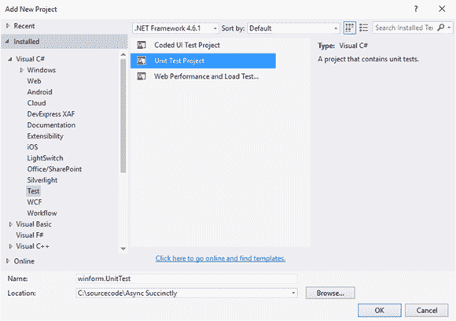
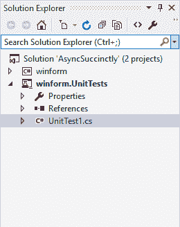
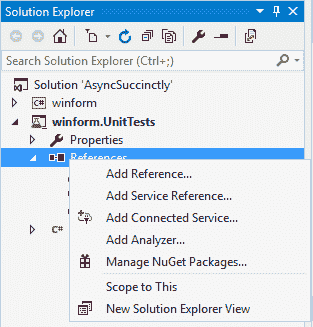
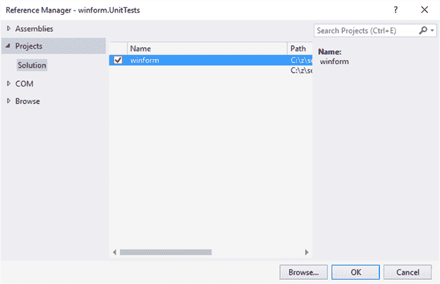
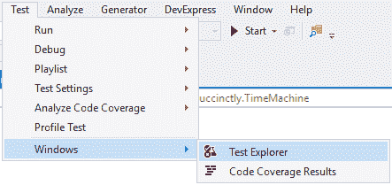
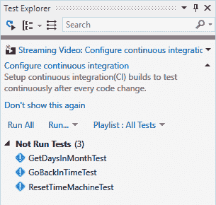
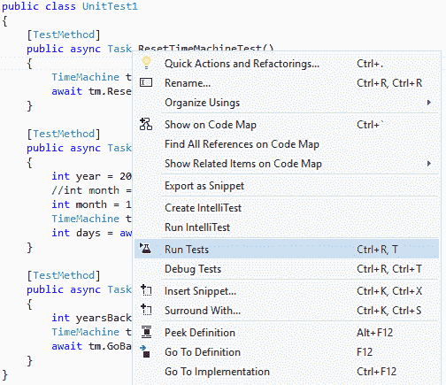
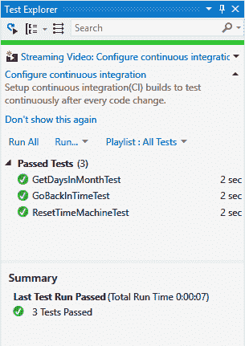
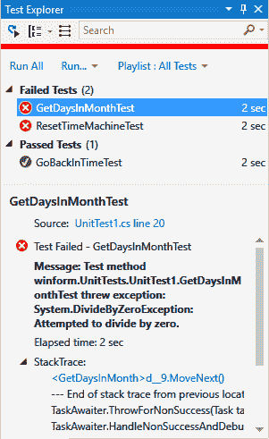

# 第 5 章单元测试和异步等待

## 单元测试异步方法概述

如果你不以“异步”的心态来对待单元测试，那么单元测试异步方法可能是一个挑战。换句话说，你不能像对待同步方法一样对待单元测试异步方法。

互联网上有大量关于异步和等待的资源，有一些优秀的、简洁的文章和博客文章是由合格的个人写的关于单元测试异步方法的。在这本书的最后，我将详细介绍一些学习异步和等待的有用资源。

然而，就目前而言，为异步方法设置和配置单元测试可能会因您使用的单元测试框架而异。对于这个演示，我将使用内置的 MS Test 框架。

## 在 Visual Studio 中创建单元测试

让我们从创建一个名为`TimeMachine`的新类开始。注意命名空间是`AsyncSuccinctly`。将`System.Threading.Tasks`命名空间添加到类中。另外，请注意，在本课程中，我们将把`Task.Delay`的值设置为两秒。

代码清单 82

```
  using System.Threading.Tasks;

```

添加两个名为`Year`和`TimeMachineEnabled`的属性。

代码清单 83

```
  namespace AsyncSuccinctly
  {
      public class TimeMachine
      {
          public int Year { get; private set; }
          public bool TimeMachineEnabled { get; private set; }

```

在构造函数中，只需将`Year`属性初始化为当前年份。如果您使用的是 C# 6.0，您可以通过编写如下属性来使用自动实现的属性:`public int Year { get; private set; } = DateTime.Now.Year;` `.`

代码清单 84

```
  public TimeMachine()
  {
      Year = DateTime.Now.Year;
  }

```

创建一个名为`GetDaysInMonth()`的异步方法，该方法接受两个名为`year`和`month`的整数参数。

代码清单 85

```
  public async Task<int> GetDaysInMonth(int year, int month)
  {
      await Task.Delay(2000);
      return DateTime.DaysInMonth(year,
  month);
  }

```

创建第二个名为`GoBackInTime()`的异步方法，该方法采用名为`yearsBack`的整数参数。该异步方法还将`TimeMachineEnabled`属性设置为`true`。

代码清单 86

```
  public async Task GoBackInTime(int yearsBack)
  {
      await Task.Delay(2000);
      Year = DateTime.Now.Year - yearsBack;
      TimeMachineEnabled = true;
  }

```

最后，创建一个名为`ResetTimeMachine()`的异步方法，将`Year`属性设置回当前年份。

代码清单 87

```
  public async Task ResetTimeMachine()
  {
      await Task.Delay(2000);
      Year = DateTime.Now.Year;
  }

```

接下来，我们需要向解决方案中添加一个单元测试项目。我们通过右键单击解决方案并从上下文菜单中选择**添加**、**新项目……**来实现。从项目模板屏幕中选择**单元测试项目**。



图 37:创建单元测试项目

添加单元测试项目后，您将在解决方案资源管理器中看到它，其中添加了一个名为 **UnitTest1.cs** 的默认类。



图 38:解决方案资源管理器中的单元测试项目

当您查看为`UnitTest1`类生成的代码时，您会注意到已经添加了第一个测试方法。对于那些还不熟悉单元测试的人，我想在这里指出几件事。

单元测试的结构包括:

*   正在导入的`Microsoft.VisualStudio.TestTools.UnitTesting`命名空间。
*   表示该类可能包含单元测试方法的属性`[TestClass]`。如果不添加该属性，测试方法将被忽略。
*   应用了`[TestMethod]`属性的单元测试方法。这对于单元测试的运行至关重要。

|  | 提示:看看下面这篇文章，这是单元测试的好入门。[https://msdn . Microsoft . com/en-us/library/ms 182517(v = vs . 100)。aspx](https://msdn.microsoft.com/en-us/library/ms182517(v=vs.100).aspx) |

代码清单 88

```
  using System;
  using Microsoft.VisualStudio.TestTools.UnitTesting;

  namespace winform.UnitTests
  {
      [TestClass]
      public class UnitTest1
      {
          [TestMethod]
          public void TestMethod1()
          {
          }
      }
  }

```

在单元测试项目中，右键单击解决方案资源管理器中的**引用**部分，然后从上下文菜单中单击**添加引用……**。



图 39:解决方案资源管理器—添加引用

将显示**引用管理器**，这意味着您必须将 Windows 窗体项目作为项目引用添加到您的单元测试项目中。



图 40:选择 winform 作为参考

添加引用后，将命名空间`AsyncSuccinctly`导入到单元测试类`UnitTest1`中。

代码清单 89

```
  using System;
  using AsyncSuccinctly;
  using Microsoft.VisualStudio.TestTools.UnitTesting;
  using System.Threading.Tasks;

```

接下来，删除添加到 UnitTest1 类的默认单元测试。完成所有这些之后，您的单元测试类`UnitTest1`应该看起来像代码清单 90。

代码清单 90

```
  using System;
  using AsyncSuccinctly;
  using Microsoft.VisualStudio.TestTools.UnitTesting;
  using System.Threading.Tasks;

  namespace winform.UnitTests
  {
      [TestClass]
      public class UnitTest1
      {

      }
  }

```

我们现在需要在`TimeMachine`类中添加异步方法的单元测试方法。请务必注意，测试方法必须应用`async`关键字。永远不要制定你的测试方法`void`—它们必须总是返回类型`Task`或`Task<T>`。

如果无法避免使用`void`测试方法，有一些变通方法。然而，最好的做法是永远不要有`void`异步方法。

我试图将我的单元测试命名为与测试中的方法完全相同，同时在方法名称的末尾添加单词 **Test** 。在代码清单 91 中，我正在为`TimeMachine`类中的`ResetTimeMachine()`异步方法创建一个单元测试。我实例化这个类，因为单元测试`ResetTimeMachineTest()`是一个`async`方法，它要求我在我的方法中指定一个`await`。我因此采用了`await``ResetTimeMachine()`方法。该方法为`Task`返回式方法。

代码清单 91

```
  [TestMethod]
  public async Task ResetTimeMachineTest()
  {
      TimeMachine tm = new TimeMachine();
      await tm.ResetTimeMachine();
  }

```

注意`GetDaysInMonthTest()`返回一个`Task<int>`，我们需要遵循和之前一样的逻辑。单元测试方法必须是`async`，并且必须指定`Task`的返回类型。

代码清单 92

```
  [TestMethod]
  public async Task GetDaysInMonthTest()
  {
      int year = 2017;
      int month = 1;
      TimeMachine tm = new TimeMachine();
      int days = await tm.GetDaysInMonth(year, month);            
  }

```

我们将创建的第三个单元测试是针对`GoBackInTime()`异步方法的。遵循与第一个`Task`返回异步方法相同的规则。

代码清单 93

```
  [TestMethod]
  public async Task GoBackInTimeTest()
  {
      int yearsBack = 150;
      TimeMachine tm = new TimeMachine();
      await tm.GoBackInTime(yearsBack);
  }

```

保存您刚刚编写的所有代码，并重新构建 Windows 窗体项目和单元测试项目。然后打开**测试浏览器**窗口。在 Visual Studio 的主菜单中，选择**测试**、**窗口**、**测试浏览器**。



图 41:打开测试浏览器

将显示**测试浏览器**窗口。您将看到它列出了您之前创建的单元测试方法。



图 42:测试浏览器

|  | 提示:非常重要的一点是，当您进行更改时，总是要对您的单元测试项目或测试中的项目进行重新构建。我发现，有时单元测试看不到我对单元测试或测试中的方法所做的更改，除非我执行重建。 |

在单元测试类`UnitTest1`中，右键单击编辑器，并从上下文菜单中选择**运行测试**。您也可以在**测试浏览器**窗口中点击**运行所有**链接来运行单元测试。



图 43:运行测试

将运行单元测试，结果将显示在**测试浏览器**窗口中。请注意，在**测试资源管理器**窗口中，每个测试方法的结果旁边都显示有 **2 秒**。这是因为我们已经通过将`Task.Delay`设置为两秒，将`TimeMachine`类中的所有异步方法设置为延迟。



图 44:单元测试通过

这一切都很好，但是如果您错误地实现了您的单元测试(通过不在单元测试方法中添加`Task`和`async`关键字)，您可能会让单元测试报告一个测试通过，而实际上它已经抛出了一个异常。这就是为什么在单元测试方法中添加`async` `Task`或`async` `Task<T>`是很重要的，这样你就可以正确地测试异步方法。

让我们看看当其中一些方法失败时会发生什么。在单元测试方法`GetDaysInMonthTest()`中，将`month`值更改为`0`。

代码清单 94

```
  [TestMethod]
  public async Task GetDaysInMonthTest()
  {
      int year = 2017;
      int month = 0;
      TimeMachine tm = new TimeMachine();
      int days = await tm.GetDaysInMonth(year, month);            
  }

```

在`TimeMachine`类中，修改`GetDaysInMonth()`方法并添加代码以产生一个`DivideByZeroException`。只需在等待`Task.Delay(2000);`后直接添加`int iCauseZeroException = year / month;`。

代码清单 95

```
  public async Task<int> GetDaysInMonth(int year, int month)
  {
      await Task.Delay(2000);
      int iCauseZeroException = year / month;
      return DateTime.DaysInMonth(year,
  month);
  }

```

接下来，对于`ResetTimeMachine()`方法，强制抛出一个新的`Exception`。您可以给异常一个自定义消息。

代码清单 96

```
  public async Task ResetTimeMachine()
  {
      await Task.Delay(2000);
      Year = DateTime.Now.Year;
      throw new Exception("Async Method threw an
  Exception");
  }

```

请记住保存这些更改后重新构建您的解决方案，并通过单击**测试资源管理器**窗口中的**全部运行**链接再次运行您的单元测试。这次你会看到我们在`TimeMachine`类修改的两个方法都失败了。这很好——我们现在知道我们的异步单元测试工作正常。


图 45:测试失败

为了查看单元测试返回的具体错误，在**测试资源管理器**窗口的**失败测试**节点中点击测试。



图 46:查看失败的测试

可以看到单元测试`GetDaysInMonthTest()`果然报了个`DivideByZeroException`。如果你点击单元测试`ResetTimeMachineTest()`，你会看到我们之前添加的自定义异常消息。

|  | 注意:虽然我已经展示了单元测试异步方法的基础，但是您可能希望通过使用 Assert 测试 Task <t>异步方法的返回值来添加更多的功能。</t> |

## 避免单元测试中的死锁

当我们对异步方法进行单元测试时，可能会出现死锁。避免这种情况的一个好方法是通过使用`[Timeout]`属性来指定单个单元测试的超时。为此，请修改您的`[TestMethod]`属性以包含`[Timeout]`属性，如下所示`[TestMethod, Timeout(3000)]`。

代码清单 97

```
  [TestMethod, Timeout(3000)]        
  public async Task ResetTimeMachineTest()
  {
      TimeMachine tm = new TimeMachine();
      await tm.ResetTimeMachine();
  }

  [TestMethod, Timeout(3000)]
  public async Task GetDaysInMonthTest()
  {
      int year = 2017;
      int month = 1;
      TimeMachine tm = new TimeMachine();
      int days = await tm.GetDaysInMonth(year, month);            
  }

  [TestMethod, Timeout(3000)]
  public async Task GoBackInTimeTest()
  {
      int yearsBack = 150;

      TimeMachine tm = new TimeMachine();
      await tm.GoBackInTime(yearsBack);
  }

```

接下来，将`TimeMachine`课的所有延迟设置为`Task.Delay(4000)`。

代码清单 98

```
  public async Task<int> GetDaysInMonth(int year, int month)
  {
      await Task.Delay(4000);
      return DateTime.DaysInMonth(year,
  month);
  }

  public async Task GoBackInTime(int yearsBack)
  {
      await Task.Delay(4000);
      Year = DateTime.Now.Year - yearsBack;
      TimeMachineEnabled = true;
  }

  public async Task ResetTimeMachine()
  {
      await Task.Delay(4000);
      Year = DateTime.Now.Year;
  }

```

重建并运行您的单元测试，并看到所有单元测试都失败了，因为测试中的异步方法超过了单元测试`[Timeout]`属性中定义的超时时间。


图 47:单元测试超时

## 最后的想法

我遇到过添加的单元测试没有出现在**测试浏览器**中的情况。我不知道为什么会发生这种情况，但这似乎是一个常见的问题——互联网上有许多讨论这个问题的帖子。

如果遇到这种情况，您可以尝试以下几种方法:

*   确保您已经重建了您的解决方案，包括测试项目。
*   确保**默认处理器架构**与解决方案相匹配。如果您的解决方案是 64 位，请从 Visual Studio 主菜单**测试**、**测试设置**、**默认处理器架构**中选择，并将其设置为 **x86** 或 **x64** 。
*   如果所有这些都失败了，我很抱歉地说，您可能需要重新启动 Visual Studio。

## 其他资源—在哪里了解更多信息

这里突出的两个名字是:斯蒂芬·克利里和 T4。如果您想了解更多关于异步和等待的信息，请从以下资源开始。

### 斯蒂芬·克利里

[http://blog.stephencleary.com/](http://blog.stephencleary.com/)

[https://stackoverflow.com/search?q =用户:263693+[异步等待]](https://stackoverflow.com/search?q=user:263693+%5basync-await%5d)

[https://github . com/stephencleary](https://github.com/StephenCleary)

### 斯蒂芬·图布

[https://channel9.msdn.com/events/speakers/Stephen-Toub](https://channel9.msdn.com/events/speakers/Stephen-Toub)

[https://blogs . msdn . Microsoft . com/pftextam/](https://blogs.msdn.microsoft.com/pfxteam/)