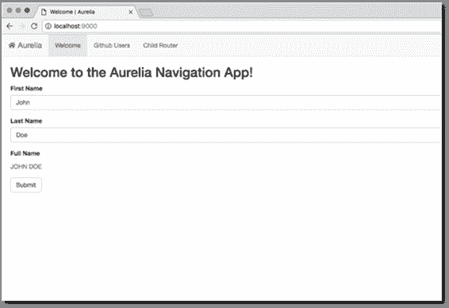
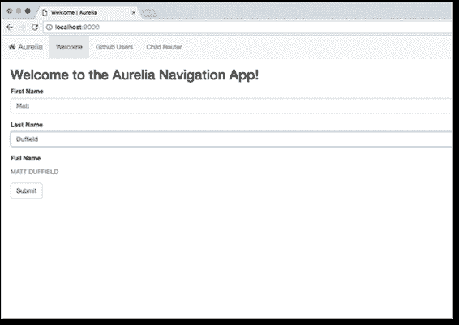
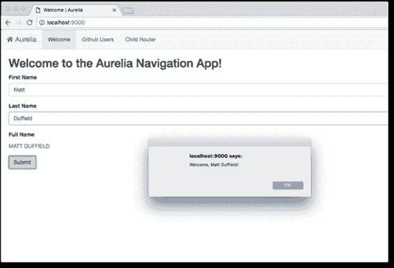
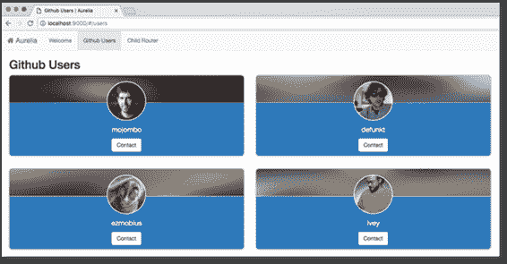
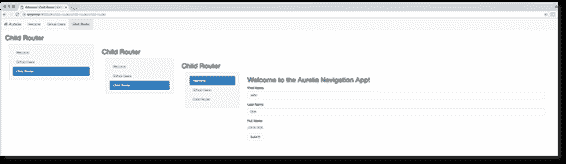

# 第 2 章如何使用异步

## 进一步探索异步

了解了基础知识后，我们现在需要进一步探索 async，看看它有什么功能，以及它如何让希望提高应用响应能力的开发人员受益。为了做到这一点，让我们看看构成异步代码的元素。

## 异步方法返回类型

让我们再看看返回类型。异步方法可以有三种可能的返回类型之一:

*   `void`
*   `Task`
*   `Task<TResult>`

### 无效返回类型

`void`返回方法与事件处理程序一起使用，如果您完成了第 1 章，您将重新认识到您已经创建了一个`async void`事件处理程序。

代码清单 10

```cs
  private async void button1_Click(object sender, EventArgs e)
  {
      string text = await ReadTextAsync();
      lblName.Text = text;            
  }

```

虽然可以使用`void`调用非返回异步方法，但这通常被认为是不好的做法。一个`void`返回方法只是执行一个任务，不会向调用代码返回任何东西。这些异步方法不使用`void`，好的做法是返回`Task`。另外，请注意控制台应用中的 **`Main`** 方法不能用异步修饰符标记。

### 任务返回类型

如果您正在调用的异步方法没有返回任何东西，请使用`Task`而不是`void`来调用它。这意味着代码清单 11 和 12 中的以下两种方法在同步和异步代码中本质上是相同的。

代码清单 11

```cs
  private void FireAndForget()
  {
      // Code implementation
  }

```

在代码清单 12 中，当没有返回任何东西时，需要用`Task`调用异步方法。

代码清单 12

```cs
  private async Task FireAndForget()
  {
      // Code implementation
  }

```

接下来让我们看看代码清单 13，它展示了一个使用和调用异步方法的例子，该方法不返回任何内容。

代码清单 13

```cs
  private async void button3_Click(object sender, EventArgs e)
  {
      await ReadRemoteServerInfo();
  }

```

调用 void 返回异步方法的事件处理程序，如代码清单 14 所示，只需调用带有`await`关键字的方法。

代码清单 14

```cs
  private async Task ReadRemoteServerInfo()
  {
      await Task.Delay(TimeSpan.FromMilliseconds(6000));
      lblServerInfo.Text = "Server Information Set
  Here";
  }

```

`async`方法在调用延迟后设置标签的文本。这里的延迟模拟了通过网络服务或其他数据存储远程读取信息的长期运行过程。

### 任务<tresult>返回类型</tresult>

最后一个返回类型是`Task<TResult>`，如果您的异步方法返回一个对象，则使用该类型。在代码清单 15 中，我们根据一个人的生日来计算他的年龄。它将返回一个带有计算年龄的整数值。

代码清单 15

```cs
  private async Task<int> GetAge(DateTime birthDay)
  {
      await Task.Delay(TimeSpan.FromMilliseconds(6000));
      int age = DateTime.Today.Year - birthDay.Year;

      if
  (birthDay > DateTime.Today.AddYears(-age))
          age--;
      return age;
  }

```

在 click 事件中，我们像调用任何其他返回类型的方法一样调用 async 方法。我们必须简单地记住对`GetAge(birthday)`方法的调用。

代码清单 16

```cs
  private async void button4_Click(object sender, EventArgs e)
  {
      DateTime birthday = new DateTime(1975, 12, 21);
      int age = await GetAge(birthday);
      lblAge.Text = age.ToString();
  }

```

将呼叫和等待放在单独的语句中是另一种方式。

代码清单 17

```cs
  private async void button4_Click(object sender, EventArgs e)
  {
      DateTime birthday = new DateTime(1975, 12, 21);

      Task<int> ageTask = GetAge(birthday);
      lblAge.Text = "calculating...";
      int age = await ageTask;
      lblAge.Text = age.ToString();
  }

```

我们还可以返回我们在代码中创建的对象。假设我们已经创建了一个`Person`类，该类包含从调用代码计算并传递给它的信息。使用包含延迟的异步方法来模拟长时间运行的任务，我们可以添加以下代码来创建一个`Person`类。该类将出生日期作为构造函数中传递给它的参数，并使用该参数计算人员的年龄。

代码清单 18

```cs
  public class Person
  {
      public Person(DateTime birthDay)
      {
          int age = DateTime.Today.Year - birthDay.Year;

          if
  (birthDay > DateTime.Today.AddYears(-age))
              age--;

          Age = age;
      }
      public string FirstName { get; set; }
      public string LastName { get; set; }
      public int Age { get; private set; }
  }

```

然后我们创建一个异步方法，使用工厂模式返回创建的`Person`对象。

代码清单 19

```cs
  private async Task<Person> GetPerson(string firstName, string lastName, DateTime birthDay)
  {
      await Task.Delay(TimeSpan.FromMilliseconds(6000));
      Person oPerson = new Person(birthDay);
      oPerson.FirstName = firstName;
      oPerson.LastName = lastName;

      return oPerson;
  }

```

代码清单 20 展示了如何编写调用代码。

代码清单 20

```cs
  private async void button4_Click(object sender, EventArgs e)
  {
      DateTime birthday = new DateTime(1975, 12, 21);
      Person person = await GetPerson("Dirk", "Strauss", birthday);
      // use the object
      lblAge.Text = person.Age.ToString();
  }

```

我们已经看到，从异步方法返回对象也是可能的。事实上，除了使用`async`和`await`关键字以及`Task`和`Task<TResut>`返回类型之外，我们没有写任何不同的东西。我们一直在编写我们都在使用的普通的旧 C#代码。这给我带来了异步编程的另一个好处——编写异步方法非常容易。我们没有做什么特别的事情。所有繁重的工作都由编译器完成。

### 取消异步任务

作为开发人员，我们可以控制异步方法的取消。例如，如果用户想在过程完成之前停止它，我们可能需要这样做。那个。NET 框架让我们可以完全控制异步方法的取消。

### 使用取消按钮取消

下面的代码清单说明了使用取消按钮取消的概念，但是首先我们需要修改我们的窗口表单。添加一个名为**的标签**并添加两个名为**开始流程**和**取消流程**的按钮。


图 8:取消异步方法

在代码隐藏中，您需要添加`System.Threading`名称空间。

代码清单 21

```cs
  using System.Threading;

```

这允许我们向代码中添加一个`CancellationTokenSource`对象。请注意，这是作为全局范围添加的。

代码清单 22

```cs
  public partial class Form1 : Form
  {
      CancellationTokenSource cancelSource;

```

在取消按钮事件中，如果对象不是`null`，我们需要调用`CancellationTokenSource`对象的`Cancel()`方法。

代码清单 23

```cs
  private void btnCancelProcess_Click(object sender, EventArgs e)
  {
      if
  (cancelSource != null)
          cancelSource.Cancel();
  }

```

我们的异步方法只是延迟 6 秒钟，以模拟长时间运行的任务。然后，它返回完成该过程所需的时间。请注意，我们将一个`CancellationToken`对象作为参数传递给异步方法，然后在重载的`Delay()`方法中使用。这就是我们向。可以取消异步进程。

代码清单 24

```cs
  private async Task<DateTime> PerformTask(CancellationToken cancel)
  {
      await Task.Delay(TimeSpan.FromMilliseconds(6000),
  cancel);
      return DateTime.Now;
  }

```

在 start 按钮事件处理程序中，我们应该从向处理程序添加 try/catch 开始。当异步方法被取消时，它将返回一个`OperationCancelledException`。因此，我们需要迎合这一点，在更一般的`Exception`条款之前增加一个具体的条款。如果异步方法没有被取消，它将在`Delay()`时间跨度中指定的 6 秒内完成。

代码清单 25

```cs
  private async void btnStartProcess_Click(object sender, EventArgs e)
  {
      try
      {

      }
      catch (OperationCanceledException)
      {

      }
      catch (Exception)
      {

      }    
  }

```

接下来，通过实例化类型为`CancellationTokenSource()`的新对象，进一步扩展开始事件处理程序。在`catch`语句中，显示经过的时间。最后，在开始按钮事件处理程序结束时，将`CancellationTokenSource`对象`cancelSource`设置为`null`。

代码清单 26

```cs
  private async void btnStartProcess_Click(object sender, EventArgs e)
  {
      cancelSource = new CancellationTokenSource();
      DateTime start = DateTime.Now;            

      try
      {

      }
      catch (OperationCanceledException)
      {
          lblElapsedTime.Text = Convert.ToInt32((DateTime.Now -
  start).TotalSeconds).ToString();
      }
      catch (Exception)
      {
          lblElapsedTime.Text = "Error";
      }

      cancelSource = null;
  }

```

最后，在`try`子句中，添加等待`PerformTask`方法的代码。在这里，我们将把 cancelSource 标记传递给异步方法。

代码清单 27

```cs
  private async void btnStartProcess_Click(object sender, EventArgs e)
  {
      cancelSource = new CancellationTokenSource();
      DateTime start = DateTime.Now;            

      try
      {
          DateTime end = await PerformTask(cancelSource.Token);
          lblElapsedTime.Text = Convert.ToInt32((end -
  start).TotalSeconds).ToString();
      }
      catch (OperationCanceledException)
      {
          lblElapsedTime.Text = Convert.ToInt32((DateTime.Now -
  start).TotalSeconds).ToString();
      }
      catch (Exception)
      {
          lblElapsedTime.Text = "Error";
      }

      cancelSource = null;
  }

```

现在运行您的应用。当你点击**开始进程**并让其完成时，6 秒的延迟显示在**时间标签**中。


图 9:启动过程

但是，如果我们已经开始了该过程，然后在该过程完成之前，单击**取消过程**按钮，异步方法将被取消，经过的时间将显示在**标签中。**


图 10:取消过程

您会注意到经过的时间少于 6 秒钟的延迟，这意味着延迟从未运行到完成。

### 特定时间后取消

有时我们需要指定一个与异步方法相关的超时。这可能是因为如果在超时期限内没有收到响应，则该过程必须被视为失败。或者可能没有用户可以点击的取消按钮。不管出于什么原因？NET 框架允许我们安排取消异步方法。

这是极其容易的。在等待异步方法之前，我们必须调用`CancellationTokenSource()`对象的`CancelAfter()`方法，向其传递`int`毫秒或`TimeSpan`。此后，异步方法将被取消。

代码清单 28

```cs
  cancelSource.CancelAfter(3000);

```

代码清单 29 显示了开始按钮事件处理程序现在的样子。

代码清单 29

```cs
  private async void btnStartProcess_Click(object sender, EventArgs e)
  {
      cancelSource = new CancellationTokenSource();
      DateTime start = DateTime.Now;            

      try
      {
          cancelSource.CancelAfter(3000);
          DateTime end = await PerformTask(cancelSource.Token);
          lblElapsedTime.Text = Convert.ToInt32((end -
  start).TotalSeconds).ToString();
      }
      catch (OperationCanceledException)
      {
          lblElapsedTime.Text = Convert.ToInt32((DateTime.Now -
  start).TotalSeconds).ToString();
      }
      catch (Exception)
      {
          lblElapsedTime.Text = "Error";
      }

      cancelSource = null;
  }

```

仅此而已。如果您运行应用并点击**开始进程**按钮，异步方法将在三秒钟后取消，用户无需点击**取消进程**按钮。



图 11:超时后取消异步方法

### 等待捕获，最后

已经在使用 C# 6.0 的一些人可能知道，现在可以在处理异常时等待 catch/finally 了。这个特性以前对开发人员来说是不可用的，但是 C#设计团队中的一些非常聪明的人发现了它，现在我们可以在 catch/finally 块中使用异步。

我们为什么要这么做？让我们假设我们需要访问一个网络资源。如果资源出现故障或超时，我们可能希望从备份位置获取源。为了演示类似这样的内容，我们将创建一个 Windows 窗体，它使用网页的 URL 以字符串形式下载源代码。然后，我们将该字符串输出到富文本框控件。

万一原始网址由于某种原因失败了，我们有一个默认的网址。在我们的示例中，我们将向异步方法传递一个错误的网址，并导致它引发异常。为了说明 C# 6.0 中的改进，我将向您展示在 C# 6.0 引入 catch/finally 块中的 wait 之前，开发人员是如何处理异常的。然后，我将修改代码，以说明 C# 6.0 如何使在 catch/finally 块中等待变得更容易。

首先，我们将从创建一个类似于图 12 的表单开始。



图 12:异常处理演示

添加对`System.Net`的引用。

代码清单 30

```cs
  using System.Net;

```

现在，我们需要创建一个返回字符串的异步方法。它将从网址中读取字符串形式的源代码，并将其返回给调用代码。接下来，它将尝试从提供的网址中获取网址(在我们的演示中，这是一个不正确的网址)。如果网址不正确，它将读取默认网址。

如您所见，在过去，C# 6.0 开发人员必须在 catch 块中设置一个标志。根据该值，我们加载默认的网址。

代码清单 31

```cs
  public async Task<string> ReadURL()
  {
      WebClient wc = new WebClient();
      string result = "";
      bool downloaded;
      try
      {
          result = await wc.DownloadStringTaskAsync(new Uri(txtURL.Text));
          downloaded = true;
      }
      catch
      {
          downloaded = false;
      }

      if
  (!downloaded)
          result = await wc.DownloadStringTaskAsync(new Uri(txtDefault.Text));

      return result;
  }

```

最后，我们添加按钮点击事件来调用异步方法，并将结果返回到富文本框。

代码清单 32

```cs
  private async void btnReadURL_Click(object sender, EventArgs e)
  {
      string strResult = await ReadURL();
      rtbHTML.Text = strResult;
  }

```

运行应用，点击**读取网址**。



图 13:默认网址源读取

如您所见，代码是有效的。就我个人而言，过去我不喜欢用这种方式编写代码。幸运的是，现在我们可以简单地在`ReadURL()`异步方法中修改我们的代码。

代码清单 33

```cs
  public async Task<string> ReadURL()
  {
      WebClient wc = new WebClient();
      string result = "";
      try
      {
          result = await wc.DownloadStringTaskAsync(new Uri(txtURL.Text));                
      }
      catch
      {
          result = await wc.DownloadStringTaskAsync(new Uri(txtDefault.Text));
      }

      return result;
  }

```

我们可以简单地告诉编译器，如果`try`中的网址抛出异常，就检查默认网址，而不是使用`bool`值来检查是否抛出了异常。这段代码更清晰，更容易阅读。请注意，您也可以在`finally`区块中`await`。

## 面向对象编程和异步

## 抽象类

让我们来看看抽象类。抽象类背后的思想是确保继承的类包含公共功能。如果您希望继承的类总是做特定的事情，这很好。但是请记住，抽象类永远不能被实例化——它们只是描述了需要在派生类中实现什么。因此，您的实现细节驻留在派生类中。

我们还应该记住异步是一个实现细节。这意味着不能将抽象类中的方法定义为异步方法。那么，我们该怎么办？记住，类型是可以选择的。方法不是，这意味着您必须将抽象方法定义为返回一个`Task`或`Task<TResult>`。有了这个，你应该可以走了。我们来看一个例子。

向您的 Visual Studio 解决方案中添加两个新类。调用一个 **Automation.cs** 和另一个 **ProjectAutomation.cs** 。



图 14:解决方案中的类

我们将假设一家公司在数据库中创建各种类型的自动化对象。有时他们创造新的项目，有时他们创造就业机会，等等。所有这些对象都是自动的，因为一旦在数据库中创建了条目，另一个系统就开始创建这个对象(例如，`ProjectAutomation`或`JobAutomation`或`TaskAutomation`，并在外部企业资源规划系统中执行额外的工作。

当这些自动化完成时，数据库对象被外部系统标记为已完成。然后，我们的应用清除自动化对象。将`System.Threading.Tasks`命名空间添加到两个类中( **Automation.cs** 和 **ProjectAutomation.cs** )。

代码清单 34

```cs
  using System.Threading.Tasks;

```

现在添加抽象`Automation`类的代码。请注意，因为我们希望`AutomationCompleted()`和`PurgeAutomation()`方法是派生类中的异步方法，所以我们为返回异步方法的 void 指定返回类型为`Task<bool>`和`Task`。

代码清单 35

```cs
  public abstract class Automation
  {
      public abstract void StartUp(int ownerID, int automationType);
      public abstract Task<bool> AutomationCompleted();
      public abstract Task PurgeAutomation(int ownerID, DateTime purgeDate);
  }

```

当我们创建名为`ProjectAutomation`的派生类时，我们指定它必须从抽象类`Automation`继承。我给这个派生类增加了一点多余的内容，但是我想把你的注意力集中在`AutomationCompleted()`和`PurgeAutomation()`方法上。因为它们返回`Task<TResult>`和`Task`，我们可以在这里使用`async`和`await`关键字将它们标记为异步方法，即使它们在抽象类中没有被定义为异步。

代码清单 36

```cs
  public class ProjectAutomation : Automation
  {
      public int Owner { get; private set; }
      public int AutomationType { get; private set; }

      public override void StartUp(int ownerID, int automationType)
      {
          Owner = ownerID;
          AutomationType = automationType;
          // Create the automation in the database.
      }

      public override async Task<bool> AutomationCompleted()
      {
          await Task.Delay(TimeSpan.FromMilliseconds(3000));
          // Read the completion flag in the database.
          return true;
      }

      public override async Task PurgeAutomation(int ownerID, DateTime purgeDate)
      {
          await Task.Delay(TimeSpan.FromMilliseconds(3000));
      }
  }

```

### 接口

如果我们不看一下界面，这本电子书就不完整。如果你猜到你不能把接口方法定义为异步的，那么你猜对了。这同样适用于抽象类的接口。在派生类中创建异步方法的方法与我们在抽象类中使用的方法相同。

让我们创建一个名为 **IHydratable.cs** 的新类文件。该接口将自动化对象标记为能够从数据库中重新水合。



图 15:向解决方案添加接口

您需要将`System.Threading.Tasks`命名空间添加到您的界面`IHydratable`中。

代码清单 37

```cs
  using System.Threading.Tasks;

```

如您所见，代码清单 38 将通过指定`RehydrateAutomation()`方法返回一个类型`Task<int>`来定义您的接口。

代码清单 38

```cs
  namespace AsyncSuccinctly
  {
      interface IHydratable
      {
          Task<int> RehydrateAutomation(int ownerID, int automationType);
      }
  }

```

为了在我们现有的`ProjectAutomation`类中实现接口，我们在声明`ProjectAutomation`类继承了抽象类`Automation`之后添加了它。

代码清单 39

```cs
  public class ProjectAutomation : Automation, IHydratable

```

`RehydrateAutomation()`方法被添加到`ProjectAutomation`类的末尾，然后我们可以通过添加`async`和`await`关键字将其定义为异步方法。

代码清单 40

```cs
  public class ProjectAutomation : Automation, IHydratable
  {
      public int Owner { get; private set; }
      public int AutomationType { get; private set; }

      public override void StartUp(int ownerID, int automationType)
      {
          Owner = ownerID;
          AutomationType = automationType;
          // Create the automation in the database.
      }

      public override async Task<bool> AutomationCompleted()
      {
          await Task.Delay(TimeSpan.FromMilliseconds(3000));
          // Read the completion flag in the database.
          return true;
      }

      public override async Task PurgeAutomation(int ownerID, DateTime purgeDate)
      {
          await Task.Delay(TimeSpan.FromMilliseconds(3000));
      }

      public async Task<int> RehydrateAutomation(int ownerID, int automationType)
      {
          Owner = ownerID;
          AutomationType = automationType;
          await Task.Delay(TimeSpan.FromMilliseconds(3000));
          // Read the purged automation in the database and return the record
  ID.
          return 0;
      }
  }

```

|  | 注意:`RehydrateAutomation()`方法不做任何事情，只返回一个零的整数。这个类中的所有方法都在等待任务。模拟长期任务过程的延迟。 |