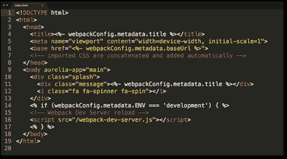
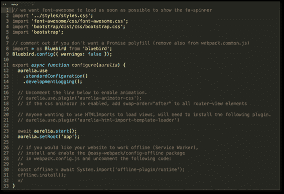
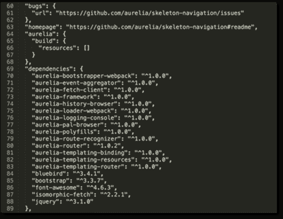
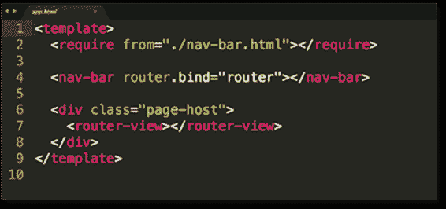
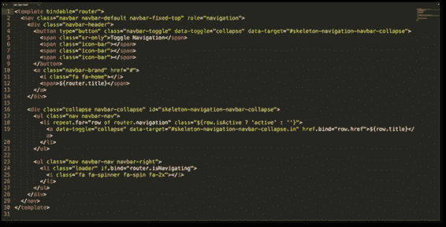
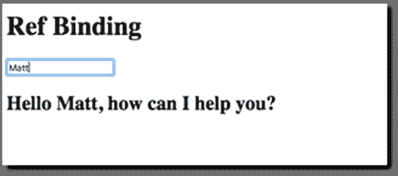
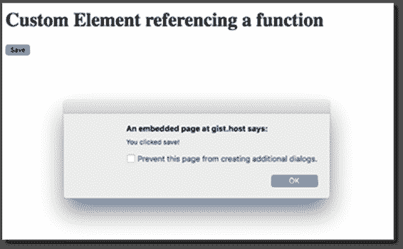
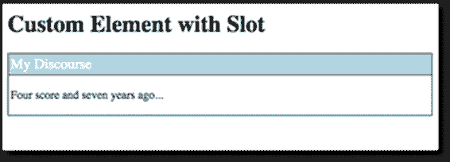

# 第三章一些真实世界的例子

## 显示异步方法的进度

所有开发人员都应该考虑开发异步代码，以便使他们的应用程序更具响应性。与其事后添加异步代码，不如考虑用从一开始就引入的异步方法来开发代码。这使得更容易发现问题和设计问题。

值得考虑的一个特性是能够向用户报告异步方法的进度。对于用户来说，异步方法并不明显，因为他们看不到(或理解不了)代码。平心而论，他们不应该需要看到它。但用户确实看到或感觉到的一件事是，一个似乎什么也没做的应用。

每当您的应用程序执行大量长时间运行的异步任务时，您可能应该考虑通知用户这些任务的进度。标准的窗口进度条控件已经存在很长时间了，用异步方法实现它很容易。为了允许应用程序报告其进度，您必须使用`IProgress`界面。

这里的代码清单将说明如何实现这一点。我认为有更好的方法来编码，但我想在这里演示一个概念。如果你愿意，你可以自己卷。

首先，您需要创建一个新的 Windows 窗体。向此窗口窗体添加一个按钮控件、一个进度条控件和一个标签控件。该表单将创建多个 **`Student`** 对象，在将每个对象添加到`List<Student>`集合之前，每个对象之间有一个延迟。



图 16:进度示例表单设计

在文件 **ProgressExample.cs** 的代码隐藏中，如果尚未导入，请导入以下名称空间`System.Threading.Tasks`。

代码清单 41

```
  using System.Threading.Tasks;

```

现在我们需要创建一个名为 Student 的新类。您可以创建一个名为 Student.cs 的新类文件，或者将其添加到现有代码文件底部的现有代码中。添加所需的各种属性(如代码清单 42 所示或添加您自己的属性)。

代码清单 42

```
  public class Student
  {
      public string FirstName { get; set; }
      public string LastName { get; set; }
      public string StudentNumber { get; set; }
      public int Age { get; set; }
      public string FullName() =>
  FirstName + "
  " +
  LastName;
  }

```

代码清单 43 使用名为`ToPercent`的扩展方法创建了一个助手类。这个辅助方法将作用于一个整数值，并计算作为该整数值所占参数传递的最大值的百分比。

您会注意到，我在 helper 方法中做了一些自由，但是我想说明异步方法的进度条更新，而不是如何编写扩展方法。helper 方法中的注释解释了它的用途。关于扩展方法的背景阅读，见下面的 MSDN 文章:https://msdn.microsoft.com/en-us//library/bb383977.aspx.

假设一个整数值是数字 50。如果我想知道 50 的整数值占 250 的百分比是多少，我会调用这个扩展方法。

代码清单 43

```
  public static class Helper
  {
      public static int ToPercent(this int value, int maxValue)
      {
          int retVal = 0;
          // value = 50
          // maxValue = 250
          // 250 / 50 = 5
          // 100% / 5 = 20%
          double factor = 0.0;
          if
  (value != maxValue)
          {
              factor = (maxValue / (value + 1));
              retVal = Convert.ToInt32(100 / factor);
          }
          else
              retVal = 100;

          return retVal;
      }
  }

```

接下来，让我们编写异步方法。您会注意到异步方法返回一个`List<Student>`对象。这个异步方法的参数之一是类型`IProgress<T>`的进度，其中`T`是您要报告的进度类型。在我们的例子中，我们将返回一个整数计数。

请注意，我们只是创建了一些`Student`对象。创建的数字作为参数传递给异步方法。假设我们只想返回前 250 个`Student`对象。随着每个`Student`对象的创建(使用虚拟数据)，我们执行一个小延迟。

就在我们将`Student`对象添加到`List<Student>`集合之后，我们将进度报告回进度条。因此，报告给进度条的`i`的值是迭代器计数。

代码清单 44

```
  public async Task<List<Student>> GetStudents(IProgress<int> progress, int iRecordCount)
  {
      // Read students from database.
      // Return only the first iRecordCount entries (e.g. 250).

      List<Student> oStudents = new List<Student>();
      for (int i = 0; i < iRecordCount; ++i)
      {
          await Task.Delay(100);
          Student oStudent = new Student()
          {
              FirstName = "Name" + i,
              LastName = "LastName" + i,
              Age = 20,
              StudentNumber = "S203237" + i
          };

          oStudents.Add(oStudent);
          if
  (progress != null)
              progress.Report(i);
      }
      return oStudents;
  }

```

接下来，我们在窗体上按钮的 click 事件处理程序中添加以下代码。正如我们之前看到的，我们假设最多有 250 个条目。这就是事情变得有趣的地方。进度条最多包含 100%。因此，我们需要计算反映迭代器计数的最大值 250 的百分比。这就是为什么我们需要扩展方法。

代码清单 45

```
  private async void btnStartProgress_Click(object sender, EventArgs e)
  {
      int iMaxRecordToRead = 250;
      progressBar.Maximum = 100;

      var progress = new Progress<int>(percentComplete
  =>
      {
          int perc = percentComplete.ToPercent(250);
          progressBar.Value = perc;
          lblProgress.Text = $"Student records {perc}% processed";
      });

      List<Student> oStudents = await GetStudents(progress, iMaxRecordToRead);

      lblProgress.Text = "Done!";
  }

```

当异步方法处理时，迭代器计数被报告给进度条，但不是在它被计算到 100%的百分比部分之后。运行你的应用程序，点击**开始**。



图 17:进度完成

## 暂停异步方法的进度

图 18 显示了我们在这本电子书中一直使用的`Task.Delay`来模拟一个长时间运行的任务。然而，在这里，我们使用它的预期目的——暂停一项任务。

我们可能需要暂停一个任务，因为我们需要重试一个进程，直到用户取消或者重试次数已经到期。想象一下**开始**按钮调用的过程是一个文件下载。但是，该文件是有版本的，应用程序必须总是下载比以前下载的版本更新的版本。

如果文件尚未更新，应用程序将重试，直到用户取消或重试次数过期。下面代码清单中的应用程序说明了这个逻辑。它包含在重试之间暂停应用程序的延迟。它还包含一个取消按钮，用于提前取消流程，并将当前进度更新为表单上的标签。

首先创建一个带有按钮和标签控件的窗口窗体。



图 18:暂停进度表单设计

导入`System.Treading.Tasks`命名空间。

代码清单 46

```
  using System.Threading.Tasks;

```

在窗口表单的顶部，添加一个`CancellationTokenSource`对象，使其在整个表单的范围内。

代码清单 47

```
  public partial class PauseProgress : Form
  {
      CancellationTokenSource cancelSource;

```

接下来，添加一个名为 **PerformTask** 的方法，尝试处理该文件。将类型为`IProgress`和`CancellationToken`的参数传递给异步方法。当用户点击**取消**时，`cancel`对象将允许我们提前取消异步进程。`progress`对象用于报告当前异步方法的进度。你会注意到在这种情况下`IProgress<T>`以`string`作为`T`的类型。

代码清单 48

```
  private async Task PerformTask(IProgress<string> progress, CancellationToken cancel)
  {
      UpdateProgress(progress, "Started Processing...");
      bool blnTaskCompleted = false;
      int iDelaySeconds = 0;
      while (!blnTaskCompleted)
      {
          iDelaySeconds += 2;
          await Task.Delay((iDelaySeconds *
  1000), cancel);
          // Retry long-running task.
          if
  (iDelaySeconds >= 10)
          {
              blnTaskCompleted = true;
              UpdateProgress(progress, "Process completed");
          }
          else
              UpdateProgress(progress, $"Process failed. Retrying in
  {iDelaySeconds} seconds...");
      }
  }

```

接下来让我们添加一个方法来更新标签中的进度。我们可以简单地调用`UpdateProgress`方法，而不是到处添加代码。

代码清单 49

```
  private void UpdateProgress(IProgress<string> progress, string message)
  {
      if
  (progress != null)
          progress.Report(message);
  }

```

现在，我必须承认我用**开始**按钮作弊了一点。点击**开始**按钮，文字变为**取消**。如果点击**取消**按钮，将文本更改为**开始**。接下来，我检查按钮文本，然后启动或取消异步方法。

您会注意到`CancellationTokenSource`在点击开始按钮时被实例化。我还创建了 process 对象，并指定它在更新进度时需要返回一个字符串。

当异步方法被取消时，会抛出一个`OperationCancelledException`，我们需要在 try/catch 中处理它。

代码清单 50

```
  private async void btnStart_Click(object sender, EventArgs e)
  {
      if
  (btnStart.Text.Equals("Start"))
      {
          btnStart.Text = "Cancel";
          cancelSource = new CancellationTokenSource();

          try
          {
              var progress = new Progress<string>(progressReport =>
              {
                  lblProgress.Text = progressReport;
              });

              await PerformTask(progress, cancelSource.Token);
          }
          catch (OperationCanceledException)
          {
              lblProgress.Text = "Processing Cancelled";
          }
      }
      if
  (btnStart.Text.Equals("Cancel"))
      {
          btnStart.Text = "Start";
          if
  (cancelSource != null)
              cancelSource.Cancel();
      }
  }

```

现在，运行应用程序。点击**开始**，注意文本如何变为**取消**。异步方法开始延迟。



图 19:重试前的延迟

过了一会儿，我们假设文件处理已经完成，并且应用程序完成了异步任务。


图 20:流程完成

再次运行应用程序。但是，这一次，在流程完成之前，请单击**取消**。注意`Task.Delay`立即被取消，应用完成处理，更新状态标签通知用户取消。



图 21:流程已取消

## 使用任务。WhenAll()等待所有任务完成

当您需要运行几个异步方法时，请记住，在继续之前，您必须等待所有这些方法完成。`Task.WhenAll()`为开发人员提供了一个完美的构造，允许他们这样做。

下面的示例说明了如何等待三个不返回任何内容的异步方法和三个返回整数的异步方法。首先，创建一个新的窗口窗体，并添加一个**文本框**控件，其**多行**属性设置为真。


图 WhenAll 的表单设计器

将**多行**属性设置为**真**后，将**停靠**属性设置为**填充**。


图 23:表单属性

在代码视图中，确保将`System.Threading.Tasks`命名空间添加到表单中。

代码清单 51

```
  using System.Threading.Tasks;

```

接下来，添加下面的方法，简单地追加传递的字符串参数。

代码清单 52

```
  private void Output(string val)
  {
      txtOutput.AppendText("\r\n" + val);
  }

```

现在，我们将添加三个 void 异步方法。因为这些异步方法什么都不返回，所以我们将调用`Output()`方法，并将要写入的`nameof(<methodName>)`传递给文本框。

在每个异步方法中，我们将分别延迟一秒、两秒和三秒。

代码清单 53

```
  private async Task Delay1kms()
  {
      await Task.Delay(1000);
      Output($"{nameof(Delay1kms)} completed");
  }

  private async Task Delay2kms()
  {
      await Task.Delay(2000);
      Output($"{nameof(Delay2kms)} completed");
  }

  private async Task Delay3kms()
  {
      await Task.Delay(3000);
      Output($"{nameof(Delay3kms)} completed");
  }

```

接下来，添加三个异步方法，每个方法返回一个整数值。和以前一样，每个方法将分别延迟一秒、两秒和三秒。

代码清单 54

```
  private async Task<int> DoWorkA()
  {
      await Task.Delay(1000);
      return 1;
  }

  private async Task<int> DoWorkB()
  {
      await Task.Delay(2000);
      return 2;
  }

  private async Task<int> DoWorkC()
  {
      await Task.Delay(3000);
      return 3;
  }

```

最后，您必须将代码清单 55 中的代码添加到`Form1_Load`事件处理程序方法中。然后你需要`await Task.WhenAll()`并传递给它三个 void 异步方法来延迟和输出文本到文本框。

在看到“延迟任务已完成”文本之前，您将看到输出到文本框的每个异步方法名称。这意味着这三种方法都在继续之前完成了。

第二个`Task.WhenAll()`将调用返回整数值的异步方法。这些被返回到一个整数数组，并输出到文本框。

代码清单 55

```
  private async void WhenAllExample_Load(object sender, EventArgs e)
  {
      await Task.WhenAll(Delay1kms(),
  Delay2kms(), Delay3kms());
      Output("DelayTasks Completed");

      int[] iArr = await Task.WhenAll(DoWorkA(),
  DoWorkB(), DoWorkC());

      for (int i = 0; i <= iArr.GetUpperBound(0); i++)
      {
          Output(iArr[i].ToString());
      }
  }

```

接下来，运行应用程序。


图 24:运行时调用示例

您会注意到，随着每个 void async 方法的完成，方法名被输出到文本框。当所有异步方法完成时，最后一条延迟消息被输出到文本框。最后，返回异步方法的`int`运行，并且只在方法完成后输出数组值。

您也可以通过将异步方法添加到`List<Task>`和`List<Task<int>>`集合中来编写这段代码。然后你把这些收藏品传给`Task.WhenAll()`法。

代码清单 56

```
  List<Task> oVoidTasks = new List<Task>();
  oVoidTasks.Add(Delay1kms());
  oVoidTasks.Add(Delay2kms());
  oVoidTasks.Add(Delay3kms());
  await Task.WhenAll(oVoidTasks);
  Output("DelayTasks
  Completed");

  List<Task<int>> oIntTasks = new List<Task<int>>();
  oIntTasks.Add(DoWorkA());
  oIntTasks.Add(DoWorkB());
  oIntTasks.Add(DoWorkC());
  int[] iArr = await Task.WhenAll(oIntTasks);

  for (int i = 0; i <= iArr.GetUpperBound(0); i++)
  {
      Output(iArr[i].ToString());
  }

```

再次运行该应用程序，您将看到输出与上一个示例中的输出相同。使用`Task.WhenAll()`是一种有效的方法，可以确保在继续代码之前，所有需要的异步方法都已经完成。

## 使用任务。WhenAny()等待任何任务完成

有时您可能需要调用几个异步方法，但是请记住，您只需要来自任何一个异步方法的结果。这意味着将使用第一个要完成的异步方法，而其他方法可以取消。

想象一下，访问两个从不同来源返回相同结果的 web 服务。这些结果中的任何一个都可以在您的代码中使用，但是为了优化您的应用程序，您需要使用尽可能快的代码。对 web 服务的调用不会在相同的时间内持续完成，因此您无法选择最快的 web 服务。

`Task.WhenAny()`为您提供了一个解决方案——您可以异步调用它们，但只使用第一个方法返回一个结果，然后取消其余的。让我们看看下面这个例子，首先调用`Task`异步方法，然后调用`Task<T>`异步方法。

您需要创建一个新的窗口窗体并添加一个文本框。


图 25:当任何示例表单设计器

接下来，选择文本框，然后将**多行**属性设置为**真**，将**停靠**属性设置为**填充**。


图 26:当任何文本框属性

在代码隐藏中，将`System.Threading`和`System.Threading.Tasks`命名空间添加到表单中。

代码清单 57

```
  using System.Threading;
  using System.Threading.Tasks;

```

向表单中添加一个`CancellationTokenSource`对象，其范围对整个表单可见。

代码清单 58

```
  public partial class WhenAnyExample : Form
  {
      CancellationTokenSource cancelSource;

```

添加三个`async Task`方法，并为每个具有不同延迟的异步方法添加`Task.Delay`。作为参数，传递`CancellationToken`，然后传递给`Task.Delay`方法。最后，输出首先完成任务的方法的名称。

代码清单 59

```
  private async Task Delay1kms(CancellationToken cancel)
  {
      await Task.Delay(1000, cancel);
      Output($"{nameof(Delay1kms)} completed first");
  }

  private async Task Delay2kms(CancellationToken cancel)
  {
      await Task.Delay(2000, cancel);
      Output($"{nameof(Delay2kms)} completed first");
  }

  private async Task Delay3kms(CancellationToken cancel)
  {
      await Task.Delay(3000, cancel);
      Output($"{nameof(Delay3kms)} completed first");
  }

```

创建`Output()`方法，并将`txtOutput`文本框设置为等于`val`参数。

代码清单 60

```
  private void Output(string val)
  {
      txtOutput.AppendText("\r\n" + val);
  }

```

接下来，将表单加载事件处理程序方法更改为`async`方法，然后实例化`CancellationTokenSource`对象。现在您将调用`Task.WhenAny()`方法，并将其传递给每个`Task`异步方法。请注意，每个方法都传递了`cancelSource.Token`对象。完成的第一个异步方法将允许`cancelSource`对象被取消，这实际上停止了剩余的异步方法——当您不打算使用结果时，您不想让代码仍然运行。将此代码包装在`try catch`块中，因为取消将抛出`OperationCanceledException`。

代码清单 61

```
  private async void WhenAnyExample_Load(object sender, EventArgs e)
  {
      cancelSource = new CancellationTokenSource();

      try
      {
          await Task.WhenAny(Delay1kms(cancelSource.Token),
  Delay2kms(cancelSource.Token), Delay3kms(cancelSource.Token));
          if
  (cancelSource != null)
              cancelSource.Cancel();
      }
      catch (OperationCanceledException)
      {

      }
      catch (Exception)
      {

      }

      cancelSource = null;
  }

```

运行您的应用程序，您将看到最快的异步方法首先完成并调用`Output()`方法。剩余的异步方法被取消，因此它们不输出任何东西。



图 27:任何示例任务异步方法

现在让我们添加返回`Task<TResult>`的异步方法。这些也将`CancellationToken`作为参数传递给`Task.Delay()`。在调用`Output()`方法之前，每个异步方法会延迟不同的持续时间。然后每个返回`int`结果。

代码清单 62

```
  private async Task<int> DoWorkA(CancellationToken cancel)
  {
      await Task.Delay(3500, cancel);
      Output($"{nameof(DoWorkA)} completed first");
      return 1;
  }

  private async Task<int> DoWorkB(CancellationToken cancel)
  {
      await Task.Delay(2800, cancel);
      Output($"{nameof(DoWorkB)} completed first");
      return 2;
  }

  private async Task<int> DoWorkC(CancellationToken cancel)
  {
      await Task.Delay(1900, cancel);
      Output($"{nameof(DoWorkC)} completed first");
      return 3;
  }

```

修改您的加载方法以调用通过`DoWorkA()`、`DoWorkB()`和`DoWorkC()`方法的`Task.WhenAny()`方法。每个都以`cancelSource.Token`对象为参数。返回`Task<int>`结果，取消其余异步方法。之后，我们只需将返回值传递给`Output()`方法。

代码清单 63

```
  private async void WhenAnyExample_Load(object sender, EventArgs e)
  {
      cancelSource = new CancellationTokenSource();

      try
      {
          Task<int> firstTask = await Task.WhenAny(DoWorkA(cancelSource.Token),
  DoWorkB(cancelSource.Token), DoWorkC(cancelSource.Token));
          if
  (cancelSource != null)
              cancelSource.Cancel();

          Output(firstTask.Result.ToString());
      }
      catch (OperationCanceledException)
      {

      }
      catch (Exception)
      {

      }

      cancelSource = null;
  }

```

再次运行您的应用程序，您将看到`DoWorkC()`异步方法首先完成，返回一个值`3`。剩余的异步方法会立即取消。



图 28:当任何示例任务<t>异步方法</t>

当您想要采取“先到先得”的方法时，这种使用您需要的东西并取消其余异步方法的方式非常有用。

## 在任务完成时处理任务

下面代码清单中的示例说明了如何在任务完成时对其进行处理。有时你可能需要处理所有的任务，同时还需要在其他任务完成时继续处理。

在我们的例子中，我们正在读取从三个网站返回的 HTML 的大小。当每一个完成时，网址被加载到一个网络浏览器控件中。因此，我们可以从逻辑上预计，最小的站点将首先加载，然后是第二大站点，最后是最大站点。这是一个很难用语言解释的例子，但是当您创建代码并运行应用程序时，它非常容易理解。因此，如果下面的解释没有完全意义，就试着阅读代码并运行应用程序。

首先，创建一个类似于图 29 中设计的新窗口表单。


图 29:表单设计器示例

在 Windows 窗体上添加一个按钮，称之为**取消操作**。然后添加一个文本框，并将**多行**属性设置为**真**。最后，在表单中添加三个网络浏览器控件，并将其称为**站点 1** 、**站点 2** 和**站点 3** 。

请务必在代码后面添加`System.Net.Http`、`System.Threading`和`System.Threading.Tasks`名称空间。

代码清单 64

```
  using System.Net.Http;
  using System.Threading;
  using System.Threading.Tasks;

```

在类声明的正下方，向表单添加一个`CancellationTokenSource`对象和一个`List<string>`对象，以便它们对整个表单可见(全局范围)。如果有必要，我们将使用  对象取消异步处理。`CancellationTokenSource`对象将通过`Token`属性提供取消令牌，并向异步方法发送取消消息。

`List<string>`将包含我们想要加载到网络浏览器控件**站点 1** 、**站点 2** 和**站点 3** 中的三个网站网址。

代码清单 65

```
  public partial class AsTasksCompleteExample : Form
  {
      CancellationTokenSource cancelSource;
      List<string> urlList;

```

为取消按钮创建一个事件处理程序，将`CancellationTokenSource`对象设置为取消状态。因为它是全局范围的，所以所有使用`CancellationTokenSource`对象的异步方法都将接收取消令牌。

代码清单 66

```
  private void btnCancel_Click(object sender, EventArgs e)
  {
      if
  (cancelSource != null)
          cancelSource.Cancel();
  }

```

接下来，我们需要添加代码，以便在加载表单时加载 URL 列表。请注意，网址的字母顺序是相反的。最后一个网址(按字母顺序)将首先被处理，以此类推。还要确保将 async 关键字作为`private async void AsTasksCompleteExample_Load`添加到表单加载事件处理程序中。

我们接下来调用异步方法`AccessWebAsync()`，向其传递在表单加载事件的第一行代码中初始化的`CancellationTokenSource`对象。请注意，代码被包装在一个`try catch`事件处理程序中。这样做是因为取消异步方法会抛出`OperationCancelledException`。

代码清单 67

```
  private async void AsTasksCompleteExample_Load(object sender, EventArgs e)
  {
      cancelSource = new CancellationTokenSource();
      txtResults.Text = "Loading Sites";
      urlList = new List<string>
      {
          "http://www.wikipedia.com",
          "http://www.google.com",
          "http://www.apple.com"
      };

      try
      {
          await AccessWebAsync(cancelSource.Token);
          txtResults.Text += "\r\nProcessing done.";
      }
      catch (OperationCanceledException)
      {
          txtResults.Text += "\r\nProcessing
  canceled.";
      }
      catch (Exception)
      {
          txtResults.Text += "\r\nError processing.";
      }

      cancelSource = null;
  }

```

`AccessWebAsync()`方法做了几件重要的事情。它处理 URL 列表，将一组`Task<string>`对象返回到`taskCollection`变量中。然后它会创建一个包含进程 URL 的`List<Task<string>>`对象。每个`Task<string>`对象将包含一个管道分隔的字符串作为`[siteLength] | [url]`，稍后将在`AccessWebAsync()`方法中进行分割。

我们还需要创建一个`List<string>`对象来包含表单上的网络浏览器控件的名称。在这里，您可以更改代码，使其更加通用。例如，您可以创建一个方法，该方法循环遍历 Windows 窗体上的所有控件，并且只查找网络浏览器控件，按照添加到控件名称末尾的整数值对它们进行排序。然后，您可以在表单中添加任意数量的网络浏览器控件，而无需对`List<string> siteControls`对象进行硬编码。然而，出于这个例子的目的，我只是使用`nameof`关键字将三个网络浏览器控件硬编码到列表中，以将控件名称的字符串表示返回到列表中。

接下来我们需要遍历`downloadTasks`列表和`await`处理。一旦其中一个完成，我们继续呼叫`Task.WhenAny()`。然后我们从列表中移除该任务，这样我们就不会再次处理它，并且我们将返回值拆分到数组`arrVal`中。我们对`siteControls`列表使用同样的逻辑。它获取`List<string> siteControls`对象中的第一个网络浏览器控件名称，该对象将这些控件名称按字母顺序保存为**站点 1** 、**站点 2** 和**站点 3** 。一旦我们获得第一个网络浏览器控件名称，我们就将其从列表中删除。我们这样做是为了不要用从`downloadTasks`列表返回的不同网址覆盖以前加载的网络浏览器控件。

最后几行代码将输出写入我们的多行文本框，并将处理后的站点网址加载到适当的网络浏览器控件中。在这里，已经完成处理的第一个任务将被加载到第一个网络浏览器控件中，然后是第二个，最后是最后一个，它将被加载到第三个网络浏览器控件中。

代码清单 68

```
  private async Task AccessWebAsync(CancellationToken cancel)
  {
      HttpClient httpClnt = new HttpClient();

      // Get a collection of tasks.
      IEnumerable<Task<string>> taskCollection =
          from url in
  urlList select ProcessURLList(url,
  httpClnt, cancel);

      // Get a list of Tasks. 
      List<Task<string>> downloadTasks = taskCollection.ToList();
      List<string> siteControls = new List<string>() { nameof(site1), nameof(site2), nameof(site3) };
      // Process each task for each site until none are left.
      while (downloadTasks.Count > 0)
      {
          string strSite = "";
          // Identify the first task that completes.
          Task<string> firstFinishedTask = await Task.WhenAny(downloadTasks);
          strSite = siteControls.First();
          // Remove so that you only process once.
          downloadTasks.Remove(firstFinishedTask);
          siteControls.Remove(strSite);
          // Await the completed task.
          string strValue = await firstFinishedTask;
          string[] arrVal = strValue.Split('|');

          txtResults.Text += $"\r\nDownload length of {arrVal[1]} is {arrVal[0]}";
          await LoadBrowserControl(strSite, arrVal[1]);
      }
  }

```

`ProcessURLList()`方法处理 URL，将网站的 HTTP 内容作为字符串返回，然后得到字符串的长度。它连接到 URL 以返回管道定界的`Task<string>`对象，供调用代码处理。

代码清单 69

```
  private async Task<string> ProcessURLList(string url, HttpClient cl, CancellationToken cancel)
  {
      // Get the Task<HttpResponseMessage> object asynchronously.

      HttpResponseMessage resp = await cl.GetAsync(url, cancel);

      // Serialize the HTTP content to a string asynchronously.
      string strSite = await resp.Content.ReadAsStringAsync();
      // Return the string.Length|www.url.com
      return strSite.Length + "|" + url;            
  }

```

最后，我们创建一个方法，将 URL 加载到表单上适当的网络浏览器控件中。因为我们通过使用`nameof`操作符将网络浏览器控件名称添加到`siteControls`列表中(对于 C# 6.0 来说是新的)，所以我们有了控件名称的字符串表示。这意味着我们可以将该字符串变量传递给`LoadBrowserControl()`方法并打开它。这将根据`downloadTasks`列表中的哪个`Task<string>`对象完成第一个、第二个和第三个来设置正确的网络浏览器控件。

代码清单 70

```
  private async Task LoadBrowserControl(string controlName, string strUrl)
  {
      Uri url = new Uri(strUrl);
      switch (controlName)
      {
          case nameof(site1):
              site1.Url = url;
              break;

          case nameof(site2):
              site2.Url = url;
              break;

          case nameof(site3):
              site3.Url = url;
              break;

          default:
              break;
      }

      await Task.CompletedTask;
  }

```

添加完所有代码后，构建并运行应用程序。

|  | 注意:我们正在调用任务。CompletedTask，因为该方法是异步调用的，但实际上并不返回任何内容或运行任何异步方法。 |



图 30:加载的网站

当加载表单时，您会看到，当处理过的网址被添加到多行文本框控件时，网络浏览器控件也加载了处理过的网址。这一切都是按照每个人完成处理的顺序完成的(与每个人开始的顺序相反)。