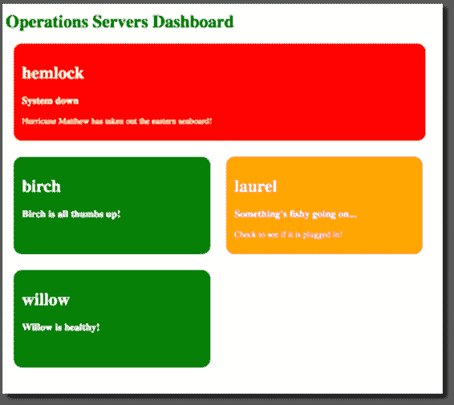

# 第 4 章使用信号量访问共享数据

有时您需要安全地访问共享数据，因为您的应用程序(或其他应用程序)中的其他区域可能会异步读取这些数据。

我们需要确保没有其他代码区域正在读取或写入我们正在处理的特定代码部分。这里我们使用了在中扩展的`SemaphoreSlim`对象。NET 框架 4.5，以便包含异步方法。

以下示例说明了不实现`SemaphoreSlim`的现有代码如何读取共享数据源并返回不正确的结果。然后，我们将在代码中添加`SemaphoreSlim`，以确保在我们忙于数据源时没有其他代码访问它。

让我们创建一个包含多行文本框的新窗口窗体来显示输出。


图 31:信号量示例表单设计器

向代码隐藏添加一个全局变量，用于初始化要处理的记录。

代码清单 71

```cs
  public partial class SemaphoreSlimExample : Form
  {
      int recordsToProcess = 0;

```

为了接受两个参数，需要修改该表单的构造函数。第一个参数是`formNumber`，它显示了这个表单的创建顺序。第二个参数是要读取的记录的整数。我们将打开这个窗口表单的两个实例。接下来，每个实例将调用同一个共享数据源，该数据源只不过是一个静态类。

代码清单 72

```cs
  public SemaphoreSlimExample(int formNumber, int readRecords)
  {
      InitializeComponent();
      recordsToProcess = readRecords;
      this.Text += $" {formNumber}";
  }

```

在表单加载中，添加代码将输出写入表单上的文本框，并调用名为`SharedClass`的静态类。我们将我们想要读取的记录计数传递给静态方法`AccessSharedResource()`。

代码清单 73

```cs
  private async void SemaphoreSlimExample_Load(object sender, EventArgs e)
  {
      txtOutput.AppendText($"Records already processed =
  {SharedClass.RecordsProcessed}");
      txtOutput.AppendText($"\r\nUpdate database
  processed field = {SharedClass.RecordsProcessed}");
      txtOutput.AppendText($"\r\nRead the next {recordsToProcess} records");
      await SharedClass.AccessSharedResource(recordsToProcess);
      txtOutput.AppendText($"\r\nRecords processed = {SharedClass.RecordsProcessed}");
  }

```

现在，我们需要创建共享资源，即静态类。确保`System.Data`和`System.Threading.Tasks`名称空间已经导入。

代码清单 74

```cs
  using System.Data;
  using System.Threading.Tasks;

```

在类的最顶端，添加一个名为`RecordsProcessed`的自动实现的属性。将默认值设置为`0`。

代码清单 75

```cs
  public static class SharedClass
  {
      public static int RecordsProcessed { get; private set; } = 0;

```

我们现在需要创建`public static async Task AccessSharedResource()`方法。这会读取一个数据表，并将`RecordsProcessed`属性设置为返回的记录。

代码清单 76

```cs
  public static async Task AccessSharedResource(int readRecords)
  {
      DataTable dtResults = await ReadData(readRecords);
      RecordsProcessed += dtResults.Rows.Count;
  }

```

最后一种方法是简单的设置代码，创建一个带有返回行数和延迟的数据表。如果您不想完成创建数据表的所有工作，可以在这里简单地返回一个整数值。我在这里的目的是说明一些数据工作正在被执行和等待。

代码清单 77

```cs
  private static async Task<DataTable> ReadData(int readRecords)
  {
      DataTable dtResults = new DataTable();
      dtResults.Columns.Add("ID");

      try
      {
          for (int row = 0; row <= readRecords - 1; row++)
          {
              DataRow dr = dtResults.NewRow();
              dtResults.Rows.Add(dr);
          }
      }
      catch (Exception ex)
      {
          throw;
      }           

      await Task.Delay(3000);
      return dtResults;
  }

```

最后，我们需要向**信号量示例**表单添加两个调用。我们将创建表单的编号和要从数据库中读取的记录数传递给它。

代码清单 78

```cs
  private void
  btnSemiphoreSlim_LinkClicked(object sender, LinkLabelLinkClickedEventArgs e)
  {
      SemaphoreSlimExample sslm = new SemaphoreSlimExample(1, 100);
      sslm.Show();

      SemaphoreSlimExample sslm2 = new SemaphoreSlimExample(2, 25);
      sslm2.Show();
  }

```

构建并运行您的应用程序。显示同一表单的两个实例，并调用表单加载方法。您会注意到两个表单都立即开始向输出中写入文本。第一个表单报告有`0`条记录被读取。我们可以假设它接下来用该值更新数据库中的一个标志。然后表单读取下一条`100`记录，并将读取的记录写入输出。


图 32:表单 1 访问共享资源

表单的第二个实例做了同样的事情，但是这次它报告仍然有`0`记录已经被处理。这是不正确的，这个不正确的值将被写回数据库。然后，表单会读取接下来的 25 条记录。当过程完成时，第一个表单已经更新了静态类的`RecordsProcessed`属性。

这意味着已处理记录的正确总值被写入数据库。但是，对于表单的第二个实例，返回的值完全不同步。想象一下在数据库表中查看这些数据，并试图找出错误在哪里(因为`0 + 25`不是`125` `)`)。

虽然我们可以识别问题，但请记住，我们在这里只处理两种形式。想象几个表单访问同一个共享资源。



图 33:表单 2 访问共享资源

事实上，它可能看起来像图 34。


图 34:访问同一数据源的几个表单

这可能会非常令人困惑，因为没有任何数据(除了表单的第一个实例)有任何意义。所以让我们实现`SemaphoreSlim`对象。

|  | 注意:`SemaphoreSlim`是 Semaphore 类的“较轻”版本，旨在用于单个应用程序，因为它只能用作本地 Semaphore。 |

首先将`System.Threading`命名空间添加到您的 Windows 窗体中。

代码清单 79

```cs
  using System.Threading;

```

现在，将`SemaphoreSlim`对象作为`private readonly`对象添加到表单中具有全局范围的表单中。

代码清单 80

```cs
  public partial class SemaphoreSlimExample : Form
  {
      private static readonly SemaphoreSlim sem = new SemaphoreSlim(1);
      int recordsToProcess = 0;

```

接下来，修改表单加载事件，并在代码中添加一个`try catch`。这一点非常重要，因为我们添加的下一行代码是`await sem.WaitAsync()`，它锁定了后面的代码。

如果处理过程中某处出现异常，将永远无法到达`sem.Release()`线，也不会释放代码。因此，我们将`sem.Release()`方法添加到`try catch`块的末尾，以确保锁被释放。

代码清单 81

```cs
  private async void SemaphoreSlimExample_Load(object sender, EventArgs e)
  {
      await sem.WaitAsync();
      try
      {
          txtOutput.AppendText($"Records processed = {SharedClass.RecordsProcessed}");
          txtOutput.AppendText($"\r\nRead the next {recordsToProcess} records");
          await SharedClass.AccessSharedResource(recordsToProcess);
          txtOutput.AppendText($"\r\nRecords processed = {SharedClass.RecordsProcessed}");
      }
      catch (Exception ex)
      {
          throw;
      }
      finally
      {
          sem.Release();
      }
  }

```

构建您的应用程序并再次运行它。像往常一样，表单的第一个实例按预期执行。


图 35:表单实现信号量

表单的第二个实例现在等待第一个表单完成，然后在锁被释放后继续。如您所见，输出是正确的，并且值被正确地输出到数据库。


图 36:表单 2 访问共享资源