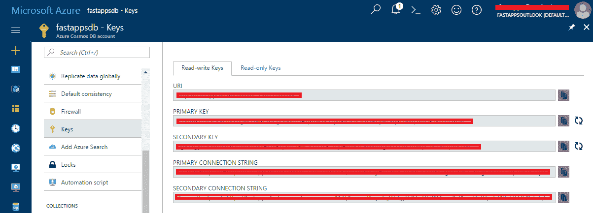
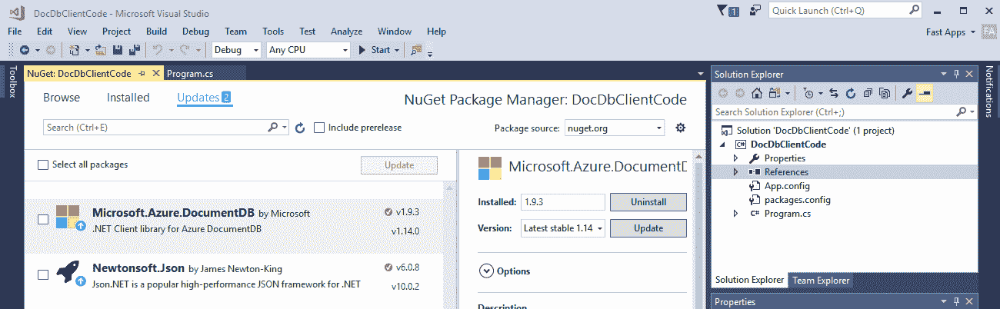
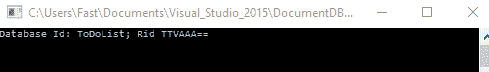
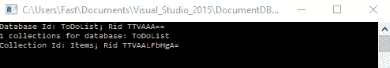
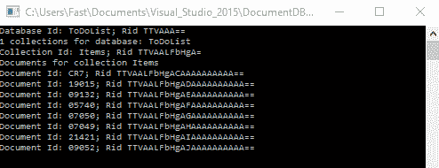
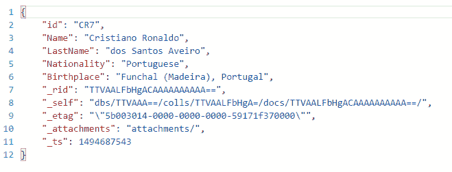
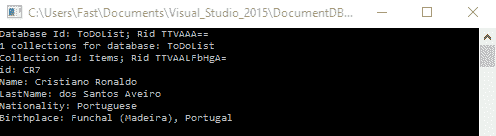
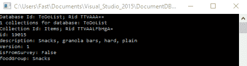
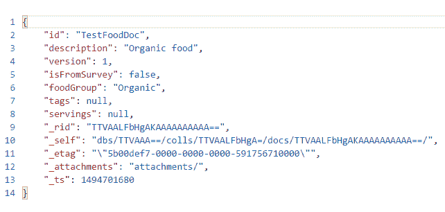

# 四、客户端开发

## 简介

在前面的章节中，我们对 DocumentDB API 有了很好的介绍。我们使用熟悉的 SQL 风格语法创建了一个数据库和一个集合，添加了文档，并查询了数据。我们还简要探讨了如何使用数据迁移工具迁移现有数据。

在本章中，我们将重点关注使用。NET 框架和 C# 与 DocumentDB 交互。

虽然可以使用 DocumentDB 的 REST API 编写客户端代码，但微软为最流行的编程语言提供了 SDK，使得与 DocumentDB 交互变得更加容易。因此，我们不会探索 REST 应用编程接口，而是使用。NET SDK 和用 C# 编写代码。

我们将从了解如何从客户端代码连接到 DocumentDB 开始，讨论主密钥和资源，并编写处理数据库、集合和文档的代码示例。

同样的原则将被应用和演示。NET SDK 应该同样适用于微软为 DocumentDB 提供的任何其他编程语言 SDK，但是语法上的差异将会存在。不过，我们不会在本章中介绍任何其他 SDK。

我强烈建议您继续探索该网站优秀的[文档](https://azure.microsoft.com/en-us/documentation/services/documentdb/)，以了解如何使用现有的任何其他 SDK。有针对 Node.js、Python 和 Java 的本机 SDK。

我们不要再等了，开始吧。玩得开心！

## 万能钥匙

为了能够使用 DocumentDB 做任何事情，必须连接到它。建立连接是我们在 DocumentDB 上执行任何操作之前的第一步，也是最主要的一步。

创建到 DocumentDB 的连接需要一个端点和一个密钥。端点是 DocumentDB 帐户的 URL，其形式为*https://accountname.documents.azure.com*。

该密钥包含您的文档数据库凭据。有两种类型的密钥:主密钥和资源令牌。

主密钥授予对 DocumentDB 的全部访问权限，您可以使用它做几乎任何事情。你可以把它想象成 SQL Server 世界中的 ***sa*** 账户。它提供了对整个 DocumentDB 帐户的完全访问权限，不应分发给最终用户计算机。主密钥实际上有两种类型:主密钥和次密钥。

拥有主密钥和次主密钥是启用密钥轮换和更改主密钥而不影响任何正在运行的应用的好方法。

此外，文档数据库为只读应用提供密钥。让我们快速浏览一下 Azure 门户，看看在哪里可以找到密钥。



图 4-a:宇宙数据库帐户的密钥

读写和只读键都可以通过点击 Azure 门户内 Cosmos DB 账户主刀片上的**键**找到。

## 粒度访问

除了提供对 DocumentDB 的完全访问的主密钥之外，资源令牌还允许您进行连接。这提供了对安全性的精细控制。资源令牌只能访问 DocumentDB 中的特定资源，不能访问所有资源。

资源令牌基于用户权限。首先需要为数据库创建一个或多个用户，然后为每个用户添加权限。每个权限都有一个资源令牌，用于对单个用户资源的所有读取或完全访问，这可能适用于集合、文档、附件、存储过程、用户定义函数或触发器。不允许使用资源令牌访问管理资源(数据库帐户、数据库以及用户和权限)，只有在使用主密钥时才允许。

资源令牌是一种很好的方式，可以根据授予特定用户的权限对特定资源进行精细访问。

## 简介。NET 软件开发工具包

使用文档数据库。NET SDK 非常简单。首先创建一个`DocumentClient`实例，然后提供连接信息:一个端点和一个密钥。

一旦有了实例，就可以调用方法来访问 DocumentDB 资源。此时，您可以创建、修改和删除数据库、集合、文档和其他资源。

让我们继续安装。NET SDK，这样我们就可以开始编码了。创建一个新的 Visual Studio 2017 控制台应用项目并添加 NuGet 包。



图 4-b:安装。NET SDK 作为一个带有 Visual Studio 2017 的 NuGet 包

一旦。NET SDK 已经安装，我们将在我们的 Visual Studio 解决方案中引用`Microsoft.Azure.Documents.Client`和`Newtonsoft.Json`程序集。

在现实世界中，您可能不会创建控制台应用，但可能会使用不同的 Visual Studio 项目，例如充当中间层或 Web 应用的 Web API。无论如何，DocumentDB 代码都是一样的。使用控制台应用项目也更容易理解功能。

在我们将要编写的示例应用中，我们将首先关注连接到 DocumentDB，然后显示可用数据库的名称以及每个数据库的集合。

我们还有一个方法来显示存储在集合中的文档。让我们看看如何实现这一点。首先，让我们显示 DocumentDB 帐户上的数据库列表。

清单 4-a:显示数据库列表

```cs
  using Microsoft.Azure.Documents.Client;
  using System;

  namespace DocDbClientCode
  {

  class Program

  {

  public const string cStrEndPoint = "<< Your Endpoint
  >>";

  public const string cStrKey = "<< Your Primary Key
  >>";

  static void
  Main(string[] args)

  {

     ListDbs();

  Console.ReadLine();

  }

  public static void ListDbs()

  {

  using (var
  client = new DocumentClient(

  new Uri(cStrEndPoint), cStrKey))

  {

  var dbs = client.CreateDatabaseQuery();

  foreach (var
  db in dbs)

  {

  Console.WriteLine(

  "Database Id:
  {0}; Rid {1}",
  db.Id, db.ResourceId);

  }

  }

  }

  }
  }

```

请注意，为了能够创建`DocumentClient`的实例，我们必须包含`Microsoft.Azure.Documents.Client`名称空间。我们还需要`System`命名空间来创建`Uri`的实例，用于传递文档数据库端点。

创建`DocumentClient`实例后，我们可以调用`CreateDatabaseQuery`方法，该方法返回一个对象列表，每个对象包含一个 DocumentDB 数据库的信息。然后使用`Id`和`ResourceId`属性将列表写入控制台。

运行该程序会产生以下输出。



图 4-c:列出文档数据库的程序输出

这很简单。现在让我们来探索收藏和文档。

## 访问收藏

现在我们已经有了一些连接到 DocumentDB 的基本代码，并且还能够检索 DocumentDB 帐户上存在的数据库的名称，我们可以看一下访问集合。首先，让我们修改一下已经有的代码。

代码清单 4-b:显示集合列表

```cs
  using Microsoft.Azure.Documents;
  using Microsoft.Azure.Documents.Client;
  using System;
  using System.Collections.Generic;
  using System.Linq;

  namespace DocDbClientCode
  {

  class Program

  {

  public const string cStrEndPoint = "<< Your Endpoint
  >>";

  public const string cStrKey = "<< Your Primary Key
  >>";

  static void
  Main(string[] args)

  {

  ListDbs();

  Console.ReadLine();

  }

  public static void ListDbs()

  {

  using (var
  client = new DocumentClient(new Uri(cStrEndPoint), 

  cStrKey))

  {

  var dbs = client.CreateDatabaseQuery();

  foreach (var
  db in dbs)

  {

  Console.WriteLine(

  "Database Id:
  {0}; Rid {1}",
  db.Id, db.ResourceId);

  ListCollections(client, db, db.Id);

  }

  }

  }

  public static void ListCollections(DocumentClient client, 

  Database db, string dbname)

       {

  if (client != null && db != null)

  {

  List<DocumentCollection> collections =                

  client.CreateDocumentCollectionQuery

  (db.SelfLink).ToList();

  Console.WriteLine(

  "{0} collections for database: {1}", 

  collections.Count.ToString(), dbname);

  foreach (DocumentCollection col in
  collections)

  {

  Console.WriteLine("Collection Id: {0}; Rid
  {1}", 

  col.Id, col.ResourceId);

  }

  }

  }

  }
  }

```

前面的代码示例和这个代码示例的主要区别在于，我们现在包含了一个名为`ListCollections`的方法，该方法负责检索每个 DocumentDB 数据库中存在的集合列表。

这个方法是从每个 DocumentDB 数据库的`foreach`循环中的`ListDbs`方法调用的。

因为我们已经有了可用的`DocumentClient`和`Database`实例，我们将它们与当前文档数据库的名称一起传递给`ListCollections`方法。

现在我们来详细看看`ListCollections`法。该方法在内部调用`CreateDocumentCollectionQuery`方法，使用当前`Database` ( `db.SelfLink`)的资源 URI，以获得一个`List<DocumentCollection>`对象，该对象代表`dbname`数据库的所有可用集合。

然后用`foreach`循环`List<DocumentCollection>`对象，然后使用`Id`和`ResourceId`属性将每个`DocumentCollection`实例写入控制台。

如果我们执行这段代码，我们将得到以下结果。



图 4-d:列出文档数据库和集合的程序的输出

## 访问文档

我们已经了解了如何访问 DocumentDB 数据库中的集合，所以现在我们将看看如何访问集合中的文档。让我们修改代码来实现这一点。

我们将简单地创建一个名为`ListDocuments`的新方法并修改`ListCollections`以便调用`ListDocuments`。

因为前面代码的其余部分没有变化，我们将在下面的清单中只包括这两个方法，而不包括完整的代码。

代码清单 4-c:显示文档列表

```cs
  public static void ListCollections(DocumentClient client, Database db, string dbname)
  {

  if (client != null && db != null)

  {

      List<DocumentCollection> collections =     

  client.CreateDocumentCollectionQuery(db.SelfLink).ToList();

  Console.WriteLine("{0} collections for
  database: {1}", 

  collections.Count.ToString(), dbname);

  foreach (DocumentCollection col in
  collections)

  {

      Console.WriteLine("Collection Id: {0}; Rid
  {1}", 

  col.Id, col.ResourceId);

  ListDocuments(client, dbname, col.Id);

  }

  }
  }

  public static void ListDocuments(DocumentClient client, string dbName, string
  collName)
  {

  if (client != null)

  {

  IEnumerable<Document> docs =

  from c in
  client.CreateDocumentQuery(

     "dbs" + "/" + dbName + "/colls/" + collName)

  select c;

  if (docs != null)

  {

      Console.WriteLine("Documents for collection
  {0}", collName);

  foreach (var
  doc in docs)

  {

      Console.WriteLine(

  "Document Id:
  {0}; Rid {1} ",
  doc.Id, doc.ResourceId);

  }

  }

  }
  }

```

让我们快速探索`ListDocuments`方法。通过使用`DocumentClient`实例，我们调用`CreateDocumentQuery`方法。

`CreateDocumentQuery`方法接收一个字符串作为参数，该字符串表示特定集合中所有文档位置的相对 URI。这根弦有两个固定部分:`"dbs"`和`"colls"`。

在`"dbs"`之后，使用变量`dbName`连接文档数据库的名称。在`"colls"`之后，要查询的集合的名称也被连接，使用变量`collName`。

这允许`CreateDocumentQuery`方法检索集合`collName`中包含的所有文档。文档列表被分配给一个`IEnumerable<Document>`对象，然后用`foreach`循环，将每个文档的`Id`和`ResourceId`写入控制台。使用此最新代码运行更新的程序会输出以下结果。



图 4-e:列出文档数据库、集合和文档的程序输出

## 查询单据

到目前为止，我们已经看到了如何连接到 DocumentDB 并列出数据库、集合和文档。然而，我们还没有看到如何检索特定文档类型的信息。这就是我们现在要关注的。

为了检索特定文档类型的信息，我们需要能够准确地指定我们想要检索的数据类型。我们这样做的方法是通过定义一个 C# 类来表示我们想要检索的文档类型(带有属性名)的结构。

到目前为止，在这本电子书中，我们已经向我们唯一的 DocumentDB 集合添加了三种文档类型。其中两个相当相似，与食物有关，第三个完全不相关，包含著名足球运动员 c 罗的数据。

因此，如果我们想要检索包含 c 罗文档类型详细信息的文档的属性，我们需要定义一个 C# 类，如下所示。我们可以在`DocDbClientCode`命名空间内进行。我在我的类上使用`sealed`修饰符来防止其他类继承它，但这不是必需的。

清单 4-d:c 罗文档类型的定义类

```cs
  public sealed class CR7DocType
  {

  public string id { get; set;
  }

  public string Name { get; set;
  }

  public string LastName { get; set;
  }

  public string Nationality { get; set; }

  public string BirthPlace { get; set; }
  }

```

该类定义与 c 罗文档类型包含的属性完全匹配。让我们使用**数据浏览器**快速浏览一下这个文档，以刷新我们的记忆。



图 4-f:用数据浏览器看到的 CR7 文档

现在我们已经定义了定义其属性的 C# 类，我们可以编写一个方法来检索它。我们不会修改到目前为止已经编写的代码的任何其他部分，所以我们将只添加这个新方法。让我们看看。

代码清单 4-e:列出 c 罗文件的方法

```cs
  public static void ListCR7DocType(CR7DocType cr7, DocumentClient client, string dbName, string collName)
  {

  if (client != null)

  {

      IEnumerable<CR7DocType> docs =

      from c in
  client.CreateDocumentQuery<CR7DocType>(

  "dbs" + "/" + dbName + "/colls/" + collName)

  where c.Name.ToUpper().

      Contains(cr7.Name.ToUpper())

  where c.LastName.ToUpper().

      Contains(cr7.LastName.ToUpper())

  select c;

  if (docs != null)

  {

      foreach (var
  doc in docs)

  {

      Console.WriteLine("id: {0}", doc.id);

  Console.WriteLine("Name: {0}", doc.Name);

  Console.WriteLine("LastName: {0}", doc.LastName);

   Console.WriteLine("Nationality: {0}", doc.Nationality);

  Console.WriteLine("Birthplace: {0}", doc.Birthplace);

  }

  }

  }
  }

```

这种方法的工作方式与`ListDocuments`方法基本相同。主要区别在于，当我们调用`CreateDocumentQuery`方法时，我们现在明确告诉它它的`T`是一个`CR7DocType`类。这允许我们将查询的焦点集中在仅查看`CR7DocType`文档上。

结果是一个`IEnumerable<CR7DocType>`对象，我们可以循环遍历并使用它向控制台输出每个文档的属性。在`ListCollections`方法中，让我们将对`ListDocuments`的调用替换为对`ListCR7DocType`的调用。

代码清单 4-f:调用 ListCR7DocType 方法的列表集合

```cs
  public static void ListCollections(DocumentClient client, Database db, string dbname)
  {

  if (client != null && db != null)

  {

      List<DocumentCollection> collections = 

  client.CreateDocumentCollectionQuery(db.SelfLink).ToList();

  Console.WriteLine("{0} collections for
  database: {1}", 

  collections.Count.ToString(), dbname);

  foreach (DocumentCollection col in
  collections)

  {

      Console.WriteLine(

  "Collection Id:
  {0}; Rid {1}",
  col.Id, col.ResourceId);

  ListCR7DocType(new CR7DocType { Name = "Ronaldo", 

  LastName = "Aveiro"}, client, dbname, col.Id);

  }

  }
  }

```

如果我们现在用这些更改运行更新的程序，我们会得到以下输出。



图 4-g:调用 ListCR7DocType 方法的程序的输出

注意我们是如何传递一个带有缩写字符串值的`Name`和`LastName`属性的`CR7DocType`对象的。`ListCR7DocType`方法上的 LINQ 查询能够返回结果文档，因为它执行的是`Contains`字符串搜索，而不是完整的字符串比较。

现在，让我们对其中一种食物文档类型进行同样的操作，就像我们对 CR7 所做的那样。让我们在`DocDbClientCode`命名空间内为其中一种食物文档类型定义一些 C# 定义类。

代码清单 4-g:一种食品文档类型的定义类

```cs
  public sealed class Tags
  {

  public string name { get; set;
  }
  }

  public sealed class Servings
  {

  public int
  amount { get; set;
  }

  public string description { get; set; }

  public int
  weightInGrams { get; set;
  }
  }

  public sealed class FoodDocType
  {

  public string id { get; set;
  }

  public string description { get; set; }

  public int
  version { get; set;
  }

  public bool
  isFromSurvey { get; set;
  }

  public string foodGroup { get; set; }

  public Tags[] tags { get; set;
  }

  public Servings[] servings { get; set; }
  }

```

现在让我们创建一个方法来列出这些食物文档类型。

清单 4-h:列出食物类型文档的方法

```cs
  public static void ListFoodDocType(FoodDocType fd, DocumentClient client, string dbName, string collName)
  {

  if (client != null)

  {

      IEnumerable<FoodDocType> docs =

      from c in
  client.CreateDocumentQuery<FoodDocType>(

        "dbs" + "/" + dbName + "/colls/" + collName)

  where c.description.ToUpper().

      Contains(fd.description.ToUpper())

  select c;

  if (docs != null)

  {

      foreach (var
  doc in docs)

  {

      Console.WriteLine("id: {0}", doc.id);

  Console.WriteLine("description: {0}", doc.description);

  Console.WriteLine("Version: {0}", doc.version);

  Console.WriteLine("isFromSurvey: {0}", 

            doc.isFromSurvey.ToString());

  Console.WriteLine("foodGroup: {0}", doc.foodGroup);

     }

  }

  }
  }

```

现在让我们修改`ListCollections`方法，以便它可以调用这个新创建的`ListFoodDocType`方法。

清单 4-i:调用 ListFoodDocType 方法的列表集合

```cs
  public static void ListCollections(DocumentClient client, Database db, string dbname)
  {

  if (client != null && db != null)

  {

      List<DocumentCollection> collections = 

  client.CreateDocumentCollectionQuery(db.SelfLink).ToList();

  Console.WriteLine("{0} collections for
  database: {1}", 

  collections.Count.ToString(), dbname);

  foreach (DocumentCollection col in
  collections)

  {

      Console.WriteLine("Collection Id: {0}; Rid
  {1}", col.Id, 

  col.ResourceId);

  ListFoodDocType(new FoodDocType { description = "Snacks" }, 

  client, dbname, col.Id);

  }

  }
  }

```

如果我们执行更新的程序，我们会得到以下输出。



图 4-h:调用 ListFoodDocType 方法的程序的输出

如果我们快速分析`ListFoodDocType`方法，我们可以看到它几乎与`ListCR7DocType`方法相同，除了 LINQ 查询返回的是一个`IEnumerable<FoodDocType>`对象而不是一个`IEnumerable<CR7DocType>`对象。其余的都差不多。

主要区别是我们将定义类作为`T`参数传递给`CreateDocumentQuery`方法，以便能够检索到我们期望得到的正确文档类型。

既然我们已经了解了如何查询文档，那么在结束本章之前，让我们简单地探讨一下如何将文档添加到集合中。

## 添加文档

将文档添加到现有集合非常容易。然而，这是一个异步操作，所以最好用两种方法来很好地总结这一点。一种方法创建文档，另一种方法创建 异步任务，该任务调用在集合上创建文档的方法。让我们看看如何实现这一点。

让我们从在现有代码中添加`using`语句开始。这是因为我们将使用`Task`对象来调用创建新文档的异步方法。

代码清单 4-j:添加线程。网络图书馆

```cs
  using System.Threading.Tasks;

```

如[代码清单 4-b](#CodeListing4B) 中所述，前面的其余`using`语句保持不变。现在，让我们创建创建文档的方法。我们将其命名为`CreateDocType`。

代码清单 4-k:新的创建文档类型方法

```cs
  public static async Task<Document> CreateDocType(FoodDocType fd, DocumentClient client, string dbName, string collName)
  {

  if (client != null)

  {

      string url = "dbs" + "/" + dbName + "/colls/" + collName;

  Document id = await client.CreateDocumentAsync(url, fd);

  return (id != null) ? client.CreateDocumentQuery(url).

  Where(d => d.Id == id.Id).AsEnumerable().FirstOrDefault() : null;

  }

  else

      return null;
  }

```

`CreateDocType`方法的重要部分，也是我们将关注的部分，是对`CreateDocumentAsync`的调用，它实际上是负责在由`url`字符串指定的集合上创建新文档的调用。

因为`CreateDocumentAsync`是异步方法，所以我们必须`await`它，并且还要将`CreateDocType`方法标记为`async`。一旦创建了文档，就调用`CreateDocumentQuery`来实际验证该文档确实是在集合中创建的。

有了这些，我们就可以创建一个包装方法来调用`CreateDoc`来执行调用`CreateDocType`的异步代码。

代码清单 4-1:新的创建文档包装方法

```cs
  public static async void
  CreateDoc(string dbName, string collName)
  {

  await Task.Run(

  async () =>

  {

      using (var
  client = new DocumentClient(

  new Uri(cStrEndPoint), cStrKey))

  {

      FoodDocType fd = new
  FoodDocType { id = "TestFoodDoc", 

  description = "Organic
  food", 

  isFromSurvey = false, 

  foodGroup = "Organic", version = 1 };

  Document issue = await CreateDocType(fd, client, 

  dbName, collName);

  }

  });
  }

```

`CreateDoc`方法只是调用`Task.Run`，匿名的`async`方法作为 lambda 表达式传递。这将创建一个带有一些属性的`FoodDocType`对象，代表将使用`CreateDocType`创建的文档。

最后，我们可以修改程序的`Main`方法来调用`CreateDoc`。它看起来如下。

代码清单 4-m:更新后的主程序方法

```cs
  static void
  Main(string[] args)
  {

  CreateDoc("ToDoList", "Items");            

  Console.ReadLine();
  }

```

如果我们执行这段代码，然后在 Azure 门户上打开**数据资源管理器**，我们可以看到文档已经创建。



图 4-i:通过 C# 代码添加的测试文档

太好了。我们现在已经看到了如何使用 C# 添加文档。下面的代码清单是我们到目前为止创建的程序的完整更新源代码。

代码清单 4-n:完整的程序代码

```cs
  using Microsoft.Azure.Documents;
  using Microsoft.Azure.Documents.Client;
  using System;
  using System.Collections.Generic;
  using System.Linq;
  using System.Threading.Tasks;

  namespace DocDbClientCode
  {

  public sealed class CR7DocType

  {

  public string id { get; set;
  }

  public string Name { get; set;
  }

  public string LastName { get; set;
  }

  public string Nationality { get; set; }

  public string Birthplace { get; set; }

  }

  public sealed class Tags

  {

  public string name { get; set;
  }

  }

  public sealed class Servings

  {

  public int
  amount { get; set;
  }

  public string description { get; set; }

  public int
  weightInGrams { get; set;
  }

  }

  public sealed class FoodDocType

  {

  public string id { get; set;
  }

  public string description { get; set; }

  public int
  version { get; set;
  }

  public bool
  isFromSurvey { get; set;
  }

  public string foodGroup { get; set; }

  public Tags[] tags { get; set;
  }

  public Servings[] servings { get; set; }

  }

  class Program

  {

  public const string cStrEndPoint = ""<< Your Endpoint
  >>"";

  public const string cStrKey = "Your Primary Key";

  static void
  Main(string[] args)

  {

  //Comment out the line
  below and uncomment ListDbs();

  CreateDoc("ToDoList", "Items"); 

  //Uncomment and comment
  out CreateDoc(…);

          //ListDbs();

  Console.ReadLine();

  }

  public static async void
  CreateDoc(string dbName, string 

  collName)

  {

  await Task.Run(

  async () =>

  {

  using (var
  client = new DocumentClient(new 

  Uri(cStrEndPoint), cStrKey))

  {

  FoodDocType fd = new
  FoodDocType { id = 

  "TestFoodDoc",
  description = "Organic
  food", 

  isFromSurvey = false, foodGroup = "Organic", 

  version = 1 };

  Document issue = await CreateDocType(fd, client, 

  dbName, collName);

  }

  });

  }

  public static async Task<Document> CreateDocType(FoodDocType fd, 

  DocumentClient client, string dbName, string
  collName)

  {

  if (client != null)

  {

  string url = "dbs" + "/" + dbName + "/colls/" + collName;

    Document id = await client.CreateDocumentAsync(url, fd);

  return (id != null) ? client.CreateDocumentQuery(url).

  Where(d => d.Id == 

  id.Id).AsEnumerable().FirstOrDefault() : null;

  }

          else

  return null;

  }

  public static void ListDbs()

  {

  using (var
  client = new DocumentClient(

  new Uri(cStrEndPoint), cStrKey))

  {

  var dbs = client.CreateDatabaseQuery();

  foreach (var
  db in dbs)

  {

  Console.WriteLine("Database Id: {0}; Rid
  {1}", 

  db.Id, db.ResourceId);

  ListCollections(client, db, db.Id);

      }

  }

  }

  public static void ListCollections(DocumentClient client, 

  Database db, string dbname)

  {

  if (client != null && db != null)

  {

  List<DocumentCollection> collections = 

  client.CreateDocumentCollectionQuery

  (db.SelfLink).ToList();

  Console.WriteLine("{0} collections for
  database: {1}", 

  collections.Count.ToString(), dbname);

  foreach (DocumentCollection col in
  collections)

  {

  Console.WriteLine("Collection Id: {0}; Rid
  {1}", 

  col.Id, col.ResourceId);

  // Comment out each List
  instruction one at a time           

  // to see the different results :)

  //ListDocuments(client,
  dbname, col.Id);

  //ListCR7DocType(new
  CR7DocType { Name = "Ronaldo", 

     //    LastName = "Aveiro"}, client, dbname, col.Id);

  //ListFoodDocType(new
  FoodDocType { description = 

  //    "Snacks" }, client, dbname, col.Id);

  }

  }

  }

          public static void
  ListDocuments(DocumentClient client, string 

  dbName, string collName)

  {

  if (client != null)

  {

  IEnumerable<Document> docs =

  from c in
  client.CreateDocumentQuery(

  "dbs" + "/" + dbName + "/colls/" + collName)

  select c;

  if (docs != null)

  {

  Console.WriteLine("Documents for collection
  {0}", 

  collName);

  foreach (var
  doc in docs)

  {

  Console.WriteLine("Document Id: {0}; Rid {1}
  ", 

  doc.Id, doc.ResourceId);

  }

  }

  }

      }

  public static void ListFoodDocType(FoodDocType fd, DocumentClient 

  client, string dbName, string collName)

  {

  if (client != null)

  {

  IEnumerable<FoodDocType> docs =

  from c in

  client.CreateDocumentQuery<FoodDocType>

  ("dbs" + "/" + dbName + "/colls/" + collName)

  where c.description.ToUpper().

  Contains(fd.description.ToUpper())

               select c;

  if (docs != null)

  {

  foreach (var
  doc in docs)

  {

  Console.WriteLine("id: {0}", doc.id);

  Console.WriteLine("description: {0}", 

  doc.description);

  Console.WriteLine("Version: {0}", doc.version);

  Console.WriteLine("isFromSurvey: {0}", 

  doc.isFromSurvey.ToString());

                       Console.WriteLine("foodGroup: {0}", 

  doc.foodGroup);

  }

  }

  }

  }

  public static void ListCR7DocType(CR7DocType cr7, DocumentClient 

  client, string dbName, string collName)

  {

  if (client != null)

  {

  IEnumerable<CR7DocType> docs =

  from c in
  client.CreateDocumentQuery<CR7DocType>

  ("dbs" + "/" + dbName + "/colls/" + collName)

  where c.Name.ToUpper().

  Contains(cr7.Name.ToUpper())

  where c.LastName.ToUpper().

  Contains(cr7.LastName.ToUpper())

  select c;

              if (docs != null)

  {

  foreach (var
  doc in docs)

  {

  Console.WriteLine("id: {0}", doc.id);

  Console.WriteLine("Name: {0}", doc.Name);

              Console.WriteLine("LastName: {0}", doc.LastName);

  Console.WriteLine("Nationality: {0}", 

  doc.Nationality);

  Console.WriteLine("Birthplace: {0}", 

       doc.Birthplace);

  }

  }

  }

  }

  }
  }

```

## 总结

在本章中，我们探讨了如何从 C# 与 DocumentDB 交互。我们已经解释了如何列出各种对象类型，例如数据库、集合和文档。我们还展示了如何创建文档。

然而，我们只是触及了。. NET DocumentDB SDK。

DocumentDB 文档网站包含关于如何与服务和交互的宝贵信息。NET 部分特别丰富，并且有很好的文档记录。我强烈鼓励你继续探索和学习这个主题，用这个伟大的[教程](https://azure.microsoft.com/en-us/documentation/articles/documentdb-get-started/)。

此外，我还为 Syncfusion 写了另一本电子书，名为[*【C# 开发人员的客户成功】*](https://www.syncfusion.com/resources/techportal/details/ebooks/customer_success_for_c_sharp_developers) ，其中有一章专门介绍了使用 DocumentDB 和 C# 编写一个简单的 CRM 应用。值得探索。

在下一章中，我们将重点探讨 DocumentDB 的服务器端特性，以及如何用 JavaScript 编写服务器代码，对数据库、集合和文档执行操作。

希望这一章能让您对 DocumentDB 和 C# 的可能性大开眼界，并且这些例子也很有趣。感谢阅读！