# 五、服务器端开发

## 简介

在前几章中，我们探讨了 DocumentDB 的几个特性。我们介绍了如何设置它，还进行了一些开发，例如使用 SQL 风格的语法通过 Azure Portal 查询文档，以及使用编写代码。C# 中的. NET SDK。

到目前为止的旅程非常有趣，我们已经设法很好地了解了什么是可能的，以及为什么在考虑 NoSQL 后端时，DocumentDB 是一个很好的选择。

在本章中，我们将把注意力转移到服务器端开发上。我们将重点关注如何使用 Azure Portal 编写在服务器上运行的代码，并且不仅仅是查询集合和文档。我们将研究可以在文档上执行插入、更新和删除，但是以存储过程、触发器和用户定义函数的形式直接从服务器运行的代码。

基本的 JavaScript 知识是必需的，并且示例应该很有趣。

到本章结束时，也就是电子书结束时，您应该已经很好地理解了如何使用 DocumentDB 来为您的应用开发一个可扩展的后端。玩得开心！

## 服务器端编程模型

在 DocumentDB 中，可以将服务器端代码创建为存储过程、触发器或用户定义函数(UDF)。微软将 DocumentDB 中的这个服务器端代码称为“JavaScript as T-SQL”，因为，正如你现在可能已经知道的，它是用 JavaScript 编写的。

服务器端代码在具有完全事务支持(ACID 保证)的 DocumentDB 中运行，因此一旦发生错误，所有更改都会回滚。如果没有错误，所有的提交都会同时进行。

此外，服务器端代码在沙盒环境中运行，该环境与所有其他用户隔离，并且在有限的执行下运行，这确保了代码按照特定的标准运行，并且运行时间不会太长。如果服务器代码运行时间过长，那么 DocumentDB 将中止代码并回滚该代码所做的任何更改。

对于需要长时间执行的代码，我们可以为长时间运行的进程实现延续模型。

此外，DocumentDB 还支持错误节流。这通常在响应头(`x-ms-retry-after-ms`)中返回，表示我们需要等待多长时间才能重试。

服务器端代码在它自己定义的集合级别上运行。服务器端的 JavaScript 函数与`context`对象一起工作。`context`暴露了一个`collection`、一个`request`和一个`response`。

要用 DocumentDB 理解 JavaScript 中的服务器端编程，需要了解 DocumentDB 的[资源模型](https://azure.microsoft.com/en-us/documentation/articles/documentdb-resources/)，如图[图 2-h](2.html#Figure2H) 所示。

服务器端代码直接写在 Azure Portal 上，所以不能像客户端代码那样用 Visual Studio 调试。在本章的整个过程中，查看 DocumentDB 服务器端脚本[文档](https://azure.microsoft.com/en-us/documentation/articles/documentdb-programming/)是一个好主意。

让我们从创建存储过程开始。

## 存储过程

DocumentDB 存储过程是一种允许在服务器上执行自定义业务逻辑的好方法，它通过注册一个类似于 T-SQL 存储过程的 JavaScript 函数来实现。

方法是创建一个 JavaScript 函数，使用`context`来访问`collection`和`response`。它接收输入值作为函数参数，并对集合中的任何文档进行操作，返回`response`。还可以通过实现延续模型来调整存储过程的代码，以适应长时间运行的进程，该模型在有界执行下工作，但返回延续信息。

让我们看看如何创建存储过程。在天蓝色门户上，使用**数据浏览器**，点击**项**旁边的**省略号**(**……**)按钮。这将显示一个包含多个选项的菜单。其中一个标记为**新存储过程**。单击它创建一个存储过程。

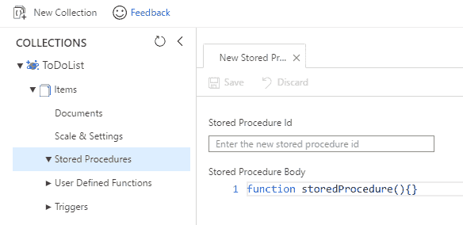

图 5-a:创建新的存储过程

输入**存储过程标识**和**存储过程主体**。默认情况下会提供一些模板代码。

让我们删除提供的默认代码，并编写一个简单的示例如下。

代码清单 5-a:一个简单的存储过程

```cs
  function spHiDocumentDB()
  {

  var context = getContext();

  var response = context.getResponse();

  response.setBody('This
  is a simple DocumentDB stored procedure');
  }

```

然后，在 Cosmos DB 主刀片上，查找**脚本浏览器**，打开创建的存储过程，然后点击**保存&执行**按钮，如下图所示。

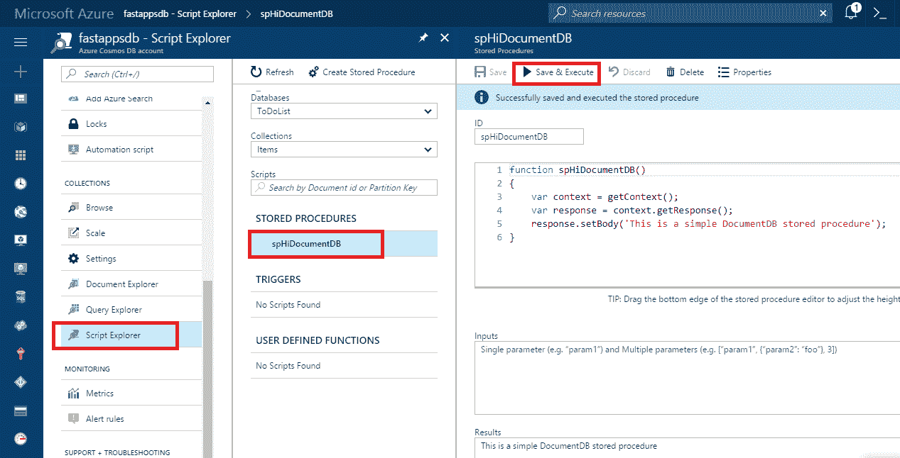

图 5-b:存储过程的执行

请注意存储过程的执行结果是如何显示在**结果**文本区域下的。

我们在这里所做的就是获取`context`和`response`对象，然后通过调用`setBody`输出响应。很简单。所以现在让我们做一些更令人兴奋的事情，创建一些存储过程来做一些有用的事情。

首先，让我们编写一个存储过程，您可以使用它将文档作为参数传递，并且它将在 DocumentDB 集合中插入该文档。

代码清单 5-b:创建文档的存储过程

```cs
  function spCreateDoc(doc) 
  {

  var context = getContext();

  var collection =
  context.getCollection();

  var response = context.getResponse();

  collection.createDocument(collection.getSelfLink(), doc, {}, 

  function (err, doc) {

  if (err) 

  throw new
  Error('Error creating document: ' + err.Message);

  response.setBody(doc);

  }

  );    
  }

```

使用**脚本浏览器**，点击**创建存储过程**，删除默认代码，输入代码清单 5-b 中提供的代码，在**输入**区域，输入如下图所示的 JSON 对象。然后点击**保存&执行**。

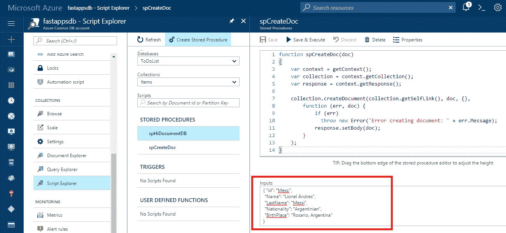

图 5-c:spCreateDoc 存储过程

如果我们打开**文档浏览器**，我们将能够看到新创建的文档。

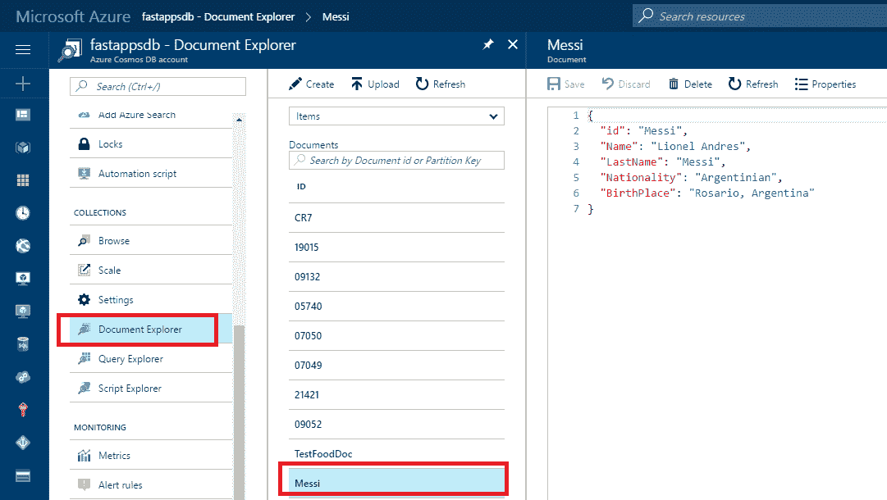

图 5-d:用 spCreateDoc 创建的新梅西文档

如果我们仔细观察`spCreateDoc`，我们可以看到我们得到了`context`、`response`物体，还有当前的`collection`。一旦我们有了它们，我们调用`createDocument`方法并传递集合的`SelfLink`、我们想要插入的`doc`和插入后函数，该函数是一个显示结果的回调(匿名函数)，使用`response.setBody`。

也很简单直白。让我们看另一个例子。

代码清单 5-c:用于检查和创建文档的存储过程

```cs
  function spCreateDocIfIdIsUnique(doc)
  {

  var context = getContext();

  var coll = context.getCollection();

  var collLink = coll.getSelfLink();

  var response = context.getResponse();

  CheckIdAndCreateDoc();

  function createDoc()

  {

  coll.createDocument(collLink, doc, {}, 

  function (err, doc) {

  if (err) 

  throw new
  Error('Error creating document: ' + err.message);

  response.setBody(doc);

  });

  }

  function CheckIdAndCreateDoc()

  {

  var query = {  

       query: 'SELECT VALUE coll.id FROM coll WHERE coll.id = @id',

  parameters: [{name: '@id', value: doc.id}]

  };

  var ok = coll.queryDocuments(collLink,
  query, {}, 

  function (err, results) {

  if (err) {

  throw new
  Error('Error querying for document' + 

  err.message);

  }

  if (results.length == 0) {

  createDoc();

  }

  else {

                 response.setBody('Document ' + doc.id + 

  ' already exists.');

  }

  });

  if (!ok) {

  throw new
  Error ('Timeout for querying document...');

  }

  }
  }

```

这个存储过程创建一个文档，但是它首先检查在`coll`中是否已经有一个文档具有相同的`id`。

如果存在具有指定`id`的现有文档，则不插入该文档，并显示错误消息。

现在，为了测试这个存储过程，让我们用已经存在的相同的梅西文档来运行它(上一个查询中使用的相同文档)。

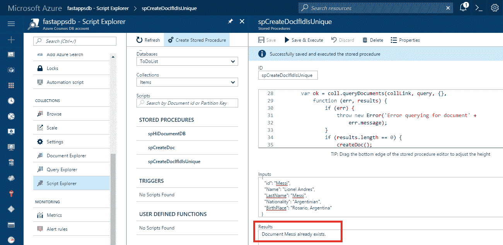

图 5-e:spCreateDocIfIdIsUnique 的执行

不出所料，存储过程清楚地描述了带有`id`梅西的文档已经存在，因此这是返回的结果。

这个存储过程有两个非常有趣的部分。一个是它有一个名为`CheckIdAndCreateDoc`的函数，通过使用我们已经知道的熟悉的 SQL 风格语法对集合执行查询来检查文档是否已经存在。

另一个有趣的部分是，如果`queryDocuments`返回一个`null`、`undefined`或`false`值，这意味着查询执行没有正确完成，并且为了使存储过程超时而抛出异常。

我们已经看到了如何在存储过程中组合 SQL 风格的语法，以及用 JavaScript 编写逻辑以在集合中插入文档是多么简单。现在让我们把注意力集中在触发器上，然后看看用户定义的函数。

## 触发器

DocumentDB 触发器是与创建(插入)或替换文档操作相关联的 JavaScript 服务器端函数。

有两种类型的触发器:前触发器和后触发器。

预触发在操作执行前运行，不能访问`response`对象。它基本上为将要插入或替换的文档提供了一个钩子。

如果您想在插入或替换文档之前强制执行某种类型的验证，或者如果您想对属性执行某些验证，那么预触发器特别有用。

后触发器在操作执行后运行，不像前触发器那样常见。使用后触发器，您可以运行在文档保存后但在实际提交前执行的逻辑。

关于触发器，有一件重要的事情需要提及:它们不会像传统的关系数据库那样被自动触发。从这个意义上说，这个名字有点误导。必须通过操作明确请求它们才能执行。

让我们继续创建一个非常简单的验证预触发器，它将在创建文档之前执行。我们可以通过进入天蓝色门户内的**脚本浏览器**，然后点击**创建触发器**来轻松实现。让我们使用下面的代码。

代码清单 5-d:验证新文档的预触发器

```cs
  function validateNameExists() {
    var collection = getContext().getCollection();
    var request = getContext().getRequest();
    var doc = request.getBody();

  if (!doc.name) {

  throw new
  Error('Document must include a "name" property.');

  }
  }

```

这就是我们将在 Azure 门户上看到的。

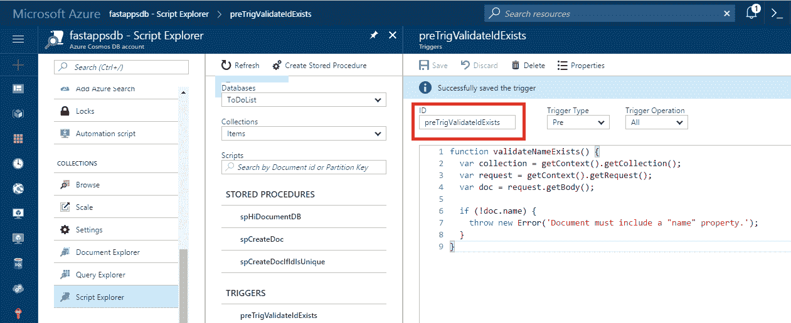

图 5-f:Azure 门户上的预触发(脚本浏览器)

**触发操作**已设置为**创建**，因此仅在创建文档时执行触发。默认情况下，**触发操作**设置为**全部**，也包括**删除**和**替换**操作。完成后，给它一个名称(在 **ID** 文本框中输入一个值——我称之为**pretigervalidateideexists**)，然后点击**保存**。

为了看到它的实际应用，让我们继续对我们在上一章中用 Visual Studio 编写的客户端应用进行轻微的修改。让我们在`Program`类内部创建一个`TestTrigger`方法。

代码清单 5-e:我们的客户端应用中的测试触发器方法

```cs
  public static async void
  TestTrigger(string dbName, string collName)
  {

  await Task.Run(

  async () =>

  {

      using (var
  client = new DocumentClient(

  new Uri(cStrEndPoint), cStrKey))

  {

      FoodDocType fd = new
  FoodDocType { id = "TestFoodDoc",                    

  description = "Organic
  food", 

  isFromSurvey = false, foodGroup = "Organic", 

               version = 1 };

  string url = "dbs" + "/" + dbName + "/colls/" + collName;

  try

  {

      Document issue = await client.CreateDocumentAsync(url, 

  fd, new RequestOptions { PreTriggerInclude = new[] { 

  "preTrigValidateIdExists" } });

  }

  catch (Exception ex)

  {

      Console.WriteLine("Exception: "  + ex.ToString());

  }

  }

  });
  }

```

一般来说，不建议对方法使用`async void`，因为抛出的任何异常都将直接在`async void`方法启动时激活的`SynchronizationContext`上引发。我在这里使用`async void`来保持调用 DocumentDB 触发器的主要思想清晰。

`Program`类的`Main`方法修改如下。

代码清单 5-f:在主方法中调用的测试触发器方法

```cs
  static void
  Main(string[] args)
  {

  TestTrigger("ToDoList", "Items");

  Console.ReadLine();
  }

```

如果我们现在执行这段代码，我们会得到这个结果。

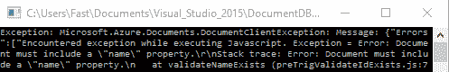

图 5-g:客户端应用的预触发执行

我们可以清楚地看到，抛出了一个异常，返回的消息与我们在服务器上的预触发代码中包含的消息相同，这表明在创建文档时必须包含一个`name`属性。

当调用`CreateDocumentAsync`时，预触发实际上被调用。这是通过创建一个`RequestOptions`对象并指定**标识**来实现的，当我们通过蓝色门户中的**脚本浏览器**创建它时，该标识被赋予了触发器。

当触发器引发异常时，它所属的事务将中止，所有内容都将回滚。这包括触发器本身所做的工作，以及导致触发器执行的任何请求所做的工作。

以上是触发器及其调用方式的简要概述。现在让我们继续讨论用户定义的函数。

## 用户自定义功能

DocumentDB 的用户定义函数是可以创建的第三种类型的 JavaScript 服务器端函数，并且看起来很熟悉。用户定义函数是编写可以从查询中调用的自定义业务逻辑的好方法，例如用它不提供的功能扩展 DocumentDB 的风味 SQL。

用户定义的函数不能对数据库进行更改，它们是只读的。相反，它们提供了一种用定制代码扩展 DocumentDB SQL 的方法，否则这是不可能的。

因为用户定义的函数需要完全扫描(它们不能使用索引)，所以在`WHERE`子句中添加一个函数会对性能产生影响。如果有必要在`WHERE`子句中添加一个，我建议您尽可能用其他条件或通过选择任何所需的属性(但不是全部)来限制查询。

同样重要的是要知道，用户定义的函数不能访问`context`对象，因此它们本质上是只计算的。

让我们开始创建一个用户定义的函数。我们可以通过进入 Azure 门户，点击**脚本浏览器**，然后点击**创建用户定义函数**按钮来实现。这样做之后，我们得到了下面由 DocumentDB 提供的默认示例。

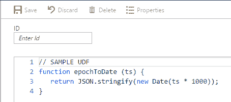

图 5-h:由文档数据库提供的现成的用户定义功能

现在让我们创建一个用户定义的函数，我们可以用它来检查特定正则表达式的匹配情况。

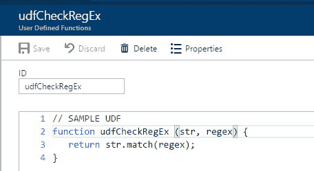

图 5-i:模式匹配正则表达式用户定义函数

这里，我们使用 JavaScript 内置的正则表达式模式匹配来检查是否在`str`内找到匹配。

当在文档中查找与特定变量字符串值匹配的字符串模式时，这个函数会派上用场。

让我们看一个例子，通过向`Program`类添加一个`TestUdf`方法来扩展我们的 Visual Studio 应用。

代码清单 5-g:我们的客户端应用中的 TestUdf 方法

```cs
  public static void TestUdf(string dbName, string
  collName)
  {

  using (var
  client = new DocumentClient(new Uri(cStrEndPoint), 

  cStrKey))

  {

      string query = "SELECT c.id FROM c WHERE "
  + 

  " udf.udfCheckRegEx(c.id, 'Messi') != null";

  string url = "dbs" + "/" + dbName + "/colls/" + collName;

  Console.WriteLine("Querying for Messi
  documents");

  var docs =
  client.CreateDocumentQuery(url, query).ToList();

  Console.WriteLine("{0} docs found", docs.Count);

  foreach (var
  d in docs)

  {

      Console.WriteLine("{0}", d.id);

  }

  }
  }

```

现在，让我们修改`Program`类中的`Main`方法，看看它是否正常工作。

代码清单 5-h:在主方法中调用的 TestUdf 方法

```cs
  static void
  Main(string[] args)
  {

  TestUdf("ToDoList", "Items");

  Console.ReadLine();
  }

```

在运行这段代码之前，请转到 Azure 门户，打开**文档资源管理器**，并创建一个新的梅西文档。只需从之前创建的原始梅西文档中复制细节，并将新文档的`id`更改为`Messi1`。

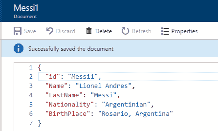

图 5-j:新梅西 1 文件

现在，如果您运行更新的代码，您将看到以下结果。

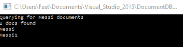

图 5-k:客户端应用的用户定义函数执行

请注意，在客户端代码中的`TestUdf`方法上，通过 Azure Portal 创建的`udfCheckRegEx`用户定义函数的前缀是字符串`udf`。所以客户端代码中函数的实际名称是`udf.udfCheckRegEx`。

为了调用用户定义的函数，必须始终使用虚线表示法在它前面加上`udf`。

我们对用户定义函数的概述到此结束。这很简单，也很容易理解，但这仅仅触及了可能实现的事情的表面。

DocumentDB [文档](https://azure.microsoft.com/en-us/documentation/articles/documentdb-programming/)是学习更多关于使用它们编程的资源，所以我鼓励您在那里进一步探索这个主题。

## 附加选项

在结束之前，如果您想扩展对 DocumentDB 的知识和理解，还有一些值得一提和探索的项目。

Azure 文档网站充满了有价值的细节，并且有大量关于本电子书中没有涉及的主题的信息，但是对于任何愿意使用 DocumentDB 进行认真开发的人来说肯定是有益的。

例如，有关于[如何从客户端应用](https://docs.microsoft.com/en-us/azure/documentdb/documentdb-partition-data)、[如何自动索引工作](https://docs.microsoft.com/en-us/azure/documentdb/documentdb-indexing-policies)、[索引策略](https://azure.microsoft.com/en-us/documentation/articles/documentdb-indexing-policies/)、如何使用[多区域帐户](https://docs.microsoft.com/en-us/azure/cosmos-db/tutorial-global-distribution-documentdb)、如何执行[全局数据库复制](https://docs.microsoft.com/en-us/azure/documentdb/documentdb-distribute-data-globally)、如何将 DocumentDB 与 PowerBI 一起用于[商业智能](https://azure.microsoft.com/en-us/documentation/articles/documentdb-powerbi-visualize/)等许多有价值的信息。

所以有很多东西需要继续学习和探索。此外，如果您对 DocumentDB 最适合哪种用例仍有疑问，这里有一个很好的资源来解决这个问题。

## Hadoop 和 DocumentDB

DocumentDB 是 Hadoop 的一个很好的伴侣，正如这里所解释的。想要对 DocumentDB 数据进行某种分析，或者将分析的输出推送到像 DocumentDB 这样的运营存储中，这种情况并不少见。在 NoSQL 世界，迄今为止最常见的分析技术是 Hadoop。为了让这项技术更容易使用，微软为 DocumentDB 提供了一个 [Hadoop 连接器。](https://azure.microsoft.com/en-us/updates/documentdb-hadoop-connector/)

这个连接器与 Azure 的 Hadoop 服务(称为 HDInsight)一起工作，它也与其他 Hadoop 实现一起工作，无论是在云中还是在内部。

[HDInsight](https://azure.microsoft.com/en-us/services/hdinsight/) 是微软推出的一款令人惊叹的解决方案，也可通过 Azure 订阅获得，该解决方案由托管的 Apache Hadoop、Spark、R、HBase 和 Storm 云服务组成，完全托管在 Azure 上。

因此，每当您想到大数据时，请考虑一下 DocumentDB。你会受到款待的。

## 总结

DocumentDB 是一个相对简单、可扩展但非常强大的 NoSQL 数据库。它能够提供高级数据管理功能，例如 SQL 风格的查询语言、存储过程、触发器、用户定义函数和原子事务。

正如所看到的，除了支持许多最流行的编程语言，如 C#(。NET)、Node.js、Python 和 Java。

DocumentDB 提供了不受模式限制的灵活性，并且托管在稳定可靠的托管云服务和平台下。

随着越来越多的公司继续将他们的计算操作转移到云，无论是从定价还是从它所支持的功能来看，DocumentDB 都正在成为一个真正的竞争者和绝佳的选择。

在一个日益互联的社会中，当考虑构建一个社交网络或社交应用并选择一个平台来支持它时，DocumentDB 也是一个很好的选择。这里有一篇来自微软博客的非常有趣的文章，触及了这个[话题](https://blogs.msdn.microsoft.com/mvpawardprogram/2016/03/15/going-social-with-documentdb/)。

随着微软不断为产品添加更多功能，使用 DocumentDB 的体验不断提升，任何进入壁垒都在不断淡化。

在这本电子书中，我们探讨了 DocumentDB 中与开发人员最相关的方面，以及如何与它交互，以便让您了解最新情况，并能够欣赏它的许多好处。

总的目标是让使用这项技术的体验变得愉快，并包括一些简单而有趣的例子。希望这已经实现了。

如前所述，我还有另一本名为[*【C# 开发人员的客户成功】*](https://www.syncfusion.com/resources/techportal/details/ebooks/customer_success_for_c_sharp_developers) 的 Syncfusion 电子书，其中有一章专门介绍了如何使用 DocumentDB 创建一个简单的 CRM 应用。它包括如何进行更高级的客户端过滤和查询的示例，并为采用 DocumentDB 提供了一个很好的用例。

总之，写这本书是一种绝对的快乐，旅程充满了有趣的小挑战，这些挑战帮助我们更好地了解这个令人惊叹的 NoSQL 数据库能做些什么。微软 Azure 团队在创建该产品方面做得非常出色。

非常感谢您阅读并关注文档数据库的探索之旅。直到我们的下一次冒险，玩得开心！