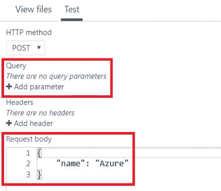
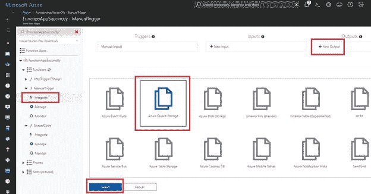

# 二、创建函数应用

在结束前一章之前，我保证我们将直接进入有趣的部分，即编写代码。然而，在此之前，让我们快速为本章将要做的事情做好准备。

假设你已经注册了一个 [Azure 订阅](https://azure.microsoft.com/en-us/)——这很容易做到，而且你甚至[从微软](https://azure.microsoft.com/en-us/free/)获得了免费积分——我们将从创建我们的第一个 Azure 功能应用开始。

我们将查看一些与我们将要做的事情最相关的选项，这些选项在 Azure 门户的 Azure 函数部分提供。

为了理解这是如何工作的，我们将使用 Azure 提供的一个方便的工具快速查看一下幕后，看看 Azure 提供的存储和队列中有什么。

## 应用

要创建一个 Azure 功能应用，首先要确保你已经登录了 Azure Portal，然后点击**创建一个资源**。接下来，点击**无服务器功能应用**，如下图所示。


图 2-a:Azure 上的无服务器功能应用资源

请注意，在**无服务器功能应用**链接的正下方有一个**快速入门教程**链接。您可以单击教程链接来访问文档，它总是手边的一个很好的资源。

单击**无服务器功能应用**链接后，将出现以下屏幕，您可以在其中输入创建功能应用所需的详细信息。


图 2-b:在 Azure 上创建一个函数应用

您需要输入一个唯一的**应用名称**。Azure 门户将指示该名称是否已被使用。如果该名称可用，您将看到一个绿色复选标记，如果不可用，您将看到一个 X。

您还需要指定一个**资源组**。您可以创建新的或使用现有的。

还有一个选择**操作系统**类型的选项。我通常选择 Windows，因为它同时包含了. NET 和 JavaScript 运行时栈，这意味着你可以选择使用 C#或 JavaScript 编写你的 Azure 函数应用。

**托管计划**可以选择**消费计划**或者使用 **App 服务计划**。前者允许您按执行次数付费，而后者基于您的应用的预定义容量以可预测的成本和规模分配资源。

在我的情况下，我将使用这个 Azure 功能应用只是为了演示，所以我选择了**消费计划**。

你还需要选择一个**位置**。我通常选择**美国东部**或**美国中部**作为个人偏好，但你可以选择任何你想要的，最接近你的实际物理位置的，或最符合你的产品或服务需求的(例如，最接近你的大多数客户或用户可能在的地方)。

还需要选择一个**存储**选项。就我而言，我选择了**创建新的**选项。

最后，我选择关闭**应用洞察**选项。选择所有这些选项和要求后，单击**创建**按钮，完成 Azure 功能应用的创建。

##  仪表盘

现在我们的功能 app 已经创建好了，让我们快速看看 Azure 为我们准备了什么，如下图所示。


图 2-c:新创建的功能应用

我们不会详细介绍这个 Azure Functions 应用仪表板包含的所有功能。Azure 门户用户界面经常更新，大多数项目和标签都是自我描述的，易于理解。相反，我们会把注意力集中在关键的项目上，以及我们前进过程中需要的项目上。

重要的是要理解，从创建 Azure 函数应用的那一刻起，它就基本上是活动的，这意味着它可以执行代码，但这并不意味着它会产生成本。

在仪表板上，可以启动、停止和重新启动 Azure 功能，以及设置广泛的选项和属性，从应用设置到部署选项、身份验证等等。

创建 Azure 功能应用后，默认情况下，它会根据您定义的原始需求进行优化，以使用最佳设置。这意味着没有必要强调调整你的应用选项。他们可能已经尽可能好了。

重要的是如何开始使用它，为此，我们需要创建我们的第一个函数。

## 功能

要创建一个新的功能，我们只需要点击**功能**旁边的 **+** 按钮，如下图所示。


图 2-d:创建新函数

单击 **+** 按钮后，您将看到一个不言自明且易于导航的屏幕。让我们看看。


图 2-e:功能—入门屏幕

在如图 2-e 所示的屏幕中，我们可以很容易地选择我们想要创建的函数类型。让我们从使用 C#创建一个简单的网络钩子开始(默认选项)。所以，继续点击**创建这个功能**。

一旦我们做到了这一点，我们就得到清单 2-a 所示的代码

清单 2-a:默认的 Webhook Azure 函数代码

```cs
  using System.Net;

  public static async Task<HttpResponseMessage>
  Run(HttpRequestMessage req, TraceWriter log)
  {

  log.Info("C#
  HTTP trigger function processed a request.");

  // parse query
  parameter

  string name = req.GetQueryNameValuePairs()

  .FirstOrDefault(q => string.Compare(q.Key, "name", true)
  == 0)

  .Value;

  if (name == null)

  {

  // Get request body

  dynamic data = await req.Content.ReadAsAsync<object>();

  name = data?.name;

  }

  return name == null

  ? req.CreateResponse(HttpStatusCode.BadRequest, 

  "Please pass a
  name on the query string or in the request body")

  : req.CreateResponse(HttpStatusCode.OK, "Hello " + name);
  }

```

以下是它在 Azure 门户上的外观。


图 2-f:默认的 Webhook Azure 函数代码

这段代码是做什么的？让我们通过剖析这个函数的每个主要部分来简单探讨一下。

Azure 函数的第一部分负责解析传递给函数本身的查询参数。

清单 2-b:解析查询参数

```cs
  //
  parse query parameter
  string name = req.GetQueryNameValuePairs()

  .FirstOrDefault(q => string.Compare(q.Key, "name", true)
  == 0)

  .Value;

```

基本上，`req`是`HttpRequestMessage`类的一个实例。执行`GetQueryNameValuePairs`方法，该方法负责将参数传递给 Azure 函数。

然后使用 LINQ，如果在参数列表中找到第一个参数`name`的值，则返回该值。

简而言之，这段代码所做的就是检索`name`参数的值，并将其传递给 Azure 函数。

下一部分显示在下面的代码片段中。

清单 2-c:解析请求体

```cs
  if (name == null)
  {

  // Get request body

  dynamic data = await req.Content.ReadAsAsync<object>();

  name = data?.name;
  }

```

所有这些实际上是通过调用`req.Content.ReadAsAsync`方法来检索请求体内容，并将结果分配给一个`dynamic`变量。然后，该变量用于获取`name`属性(如果`data`不是`null`，则语法为`data?.name`(其中`?`表示对象可以是`null`)。

在前面的两个代码片段中——解析查询参数的代码片段和获取主体请求的代码片段——代码都在做同样的事情，即返回名为`name`的参数值。

为什么要这么做？当然，仅仅检查查询参数或请求体就足够了，对吗？问题是，webhooks 并不经常只传递查询参数或请求体——它们可能两者都传递。这就是为什么在 Azure 函数中使用这两个选项的原因。

我们现在来看 Azure 函数的最后一位，它只是执行`req.CreateResponse`方法，以便用`name`参数的值创建一个 HTTP 响应。

虽然看起来这个函数内部发生了很多事情，但是除了读取一个`name`参数的值(从函数的查询参数或者从请求体)之外，并没有发生什么，这个参数有时被称为网络钩子的*有效载荷*，然后简单地返回一个值为`read`的响应。

所有这些预定义的函数给我们的是一些样板代码，带有我们可以用来编写自己的代码的特定准则。

既然我们已经创建了第一个函数并探索了它的功能，让我们看看如何使用 Azure 门户测试它。

## 功能

要测试我们刚刚在 Azure Portal 中创建的功能，我们真正需要做的是打开屏幕右侧的 **Test** 窗格，检查我们可以传递给该功能哪些参数，然后单击顶部的 **Run** 按钮。

我们可以在这里找到测试窗格，如下图所示。


图 2-g:测试窗格选项卡

在这里我们可以找到**运行**按钮。请看下面的截图。


图 2-h:运行按钮

在点击**运行**之前，让我们打开**测试**面板，看看我们有什么可以测试的。



图 2-i:打开的测试面板

如您所见，我已经突出显示了**查询**参数部分和**请求正文**部分。

默认情况下，Azure Portal 为 JSON 对象提供了`name`参数和可用于测试的值。

要快速测试功能，我们只需要点击**运行**即可。这样做之后，我们可以在测试窗格上看到以下结果。


图 2-j:测试结果

正如我们所看到的，函数已经根据通过请求体提供给函数的输入`name`参数返回了正确的字符串。

测试窗格的好处是，我们还可以通过传递查询参数和头值来测试我们的函数。

现在，我们已经简单地了解了如何测试 Azure 函数，接下来让我们探索如何使用 Azure 存储资源管理器创建队列和 blobs。

使用 Azure Functions 时，一个非常有用的工具是 Microsoft Azure Storage 桌面应用，该应用可免费获得。

所以，下载吧。完成后，双击可执行文件，您将看到如下安装屏幕。


图 2-k: Azure 存储资源管理器安装程序

安装本身非常简单直接，所以安装这个工具应该没有困难。在安装过程结束时，您将被要求启动应用。

当您第一次运行该应用时，您将被要求使用您的微软帐户登录。完成后，您将看到以下内容。


图 2-1:存储资源管理器中的存储帐户

如您所见，这些都是我的 Azure 订阅中存在的 Azure 存储帐户。在您的系统上可能会有所不同。

当我们创建我们的 Azure Functions 应用时，也自动部署了一个新的存储帐户，在我的例子中，它对应于项目 **functionappsuccabfe** ，如前面的截图所示。(标识符中尾随的“abfe”代表四个十六进制值，在我的例子中，这只是巧合，四个数字都是字母)。

让我们扩展存储客户，看看我们有什么可用的。


图 2-m:Azure 存储帐户的项目

我们可以看到存储帐户分为各种存储类型:blob 容器、文件共享、队列和表。

对于下面的示例，我们将使用几个 blob 容器和一个队列。

让我们创建我们需要的项目，从一个新的 blob 容器开始。我们只需右键单击**BLOB容器**并选择**创建BLOB容器**即可。接下来，给它起个名字。我会打电话给我的**你好-请求**。

一旦创建了 blob 容器，我们就可以进入右边的窗格，在 blob 容器中操作 blob。例如，我们可以将文件上传到 blob 存储中，或者检查 blob 容器中的现有项目。


图 2-n:新创建的BLOB容器

创建第一个 blob 后，让我们重复相同的步骤添加第二个 blob，我将称之为**收据**(我们稍后会用到这个)。

让我们继续创建一个队列。我们可以通过右键单击**队列**并将其命名为**你好-创建-请求**来实现。我们现在应该看到以下项目。


图 2-o:创建的项目—存储帐户

就像 blob 容器一样，我们可以使用 Azure 存储资源管理器应用中的右窗格向队列中添加新项目和删除队列。

## 功能之间共享代码

既然我们已经了解了如何使用 Azure 存储资源管理器创建 blob 和队列容器，这是与 Azure 函数交互的一个基本方面，那么我们也应该了解如何在同一个 Azure 函数应用中的不同函数之间共享代码。

在下面的示例中，我们将在应用的所有函数之间共享几个类。最好的方法是创建一个不执行的共享代码函数，而是托管我们希望与 Azure Functions 应用中的其他函数共享的代码。

所以，回到 Azure Portal，打开我们之前创建的 Azure Functions 应用，通过点击 **+** 按钮创建一个新的函数，如下图所示。


图 2-p:创建新函数

这次我们将从可用功能模板列表中选择**手动触发**。您可能需要向下滚动可用的函数模板列表来找到它。


图 2-q:手动触发功能模板

您可以根据自己的编程语言偏好创建函数。以我为例，我会点击 **C#** 选项。

一旦你点击了这个选项，你会被要求给这个函数一个名字，如图 2-r 所示。命名后，点击**创建**创建功能。


图 2-r:新功能对话框

原则上，我们现在有一个容器来存放我们的共享代码。默认情况下，Azure 门户已将以下代码添加到该函数中。

清单 2-d:默认手动触发功能代码

```cs
  using System;

  public
  static void Run(string input, TraceWriter log)
  {

  log.Info(

  $"C# manually
  triggered function called with input: {input}");
  }

```

完成后，点击屏幕右侧的**查看文件**选项卡。现在，让我们通过点击**添加**来添加我们的第一个类，并命名我们的文件 **CreateHelloRequest.csx** (其中。csx 扩展表示 C#脚本，随着罗斯林编译器的发布而引入)。


图 2-s:查看文件下的 CreateHelloRequest.csx

在 Azure Portal 屏幕的中间，你应该会看到一个空白区域，我们可以在这里给 **CreateHelloRequest.csx** 添加一些代码。

我将继续添加以下样板代码，以节省您的时间。

清单 2-e: CreateHelloRequest 代码

```cs
  public
  class CreateHelloRequest 
  {

  public string Number;

  public string FirstName;

  public override string ToString()
  => $"{FirstName} {Number}";
  }

```

此类表示为给定的电话号码和名字创建问候语的请求。这将最终导致向该号码发送带有使用名字的问候消息的文本消息。

在做任何其他事情之前，确保您点击**保存**以更新 **CreateHelloRequest.csx** 。


图 2-t:CreateHelloRequest 代码

让我们回到**查看文件**窗格，创建一个名为**的新文件，并粘贴以下代码。确保您保存了该文件。**

清单 2-f: HelloRequest.csx 代码

```cs
  public
  class HelloRequest 
  {

  public string Number;

  public string Message;

  public override string ToString()
  => $"{Number} {Message}";
  }

```

这里我们已经覆盖了`ToString`方法，以返回我们想要发送请求的`Number`和我们想要发送的`Message`。

接下来，在**查看文件**窗格上，让我们创建另一个名为**的文件，并粘贴以下代码。别忘了保存文件。**

清单 2-g: MsgSentConfirmation.csx 代码

```cs
  public
  class MsgSentConfirmation 
  {

  public string Number;

  public string Message;

  public string ReceiptId;

  public override string ToString()
  => 

  $"{ReceiptId} {Number} {Message}";
  }

```

这个类将作为一个审核日志，确认一条消息被发送到了一个特定的`Number`和一个特定的`Message`，我们还将保留消息网关的`ReceiptId`。我们在这里做的是模拟一个短信网关。

使用这种共享代码的方法，重要的是告诉我们的 Azure Functions 应用监控**共享代码**文件夹，以便在该文件夹中的类发生任何变化时，使用这些类的任何函数也可以被更新。

为此，我们需要在**应用服务编辑器**中编辑 **host.json** 文件。这可以在**平台功能**下找到，如下图截图所示。


图 2-u:功能应用平台特性

一旦你点击了**应用服务编辑器**选项，一个新的标签会在你的浏览器中打开，你会看到一个如下图所示的屏幕。在这里你可以找到**共享代码**项下的 **host.json** 文件，如下图所示。


图 2-v:应用服务编辑器

一旦你点击了 **host.json** 文件，你会看到一个编辑器。让我们继续更新这个文件。我们需要添加一个设置来监控**共享代码**文件夹，如下所示。

清单 2-h:更新后的主机文件

```cs
  {

  "watchDirectories": ["SharedCode"]
  }

```

注意 **host.json** 文件在添加条目后是如何自动保存的。


图 2-w:主机. json 文件自动保存

`watchDirectories`设置有趣的是，如果包含在**共享代码**文件夹中的任何文件有任何变化，这些函数将被重新编译，这也很酷，也很方便。

完成这些后，让我们回到最初的选项卡，在那里我们打开了 Azure 门户，并创建了一个新的手动触发的功能。我们将使用它来引用我们刚刚创建的共享代码函数。

## 使用共享代码

就像我们对共享代码函数所做的一样，让我们继续使用**手动触发**函数模板创建一个新函数。

我会调用这个函数**手动触发**，但可以使用任何其他名称。顾名思义，您可以通过单击**运行**按钮，在 Azure 门户中执行手动触发的功能。

创建函数后，让我们继续修改开箱即用的默认代码。

我们要做的第一件事是从我们之前创建的共享代码函数中添加对其中一个共享类的引用。为此，我们可以使用特殊的`#load`指令，并在引号之间，指示我们要加载的文件的名称。

我们可以通过如下修改 **run.csx** 来实现。

清单 2-i:添加共享代码类

```cs
  #load
  "..\SharedCode\CreateHelloRequest.csx"

  using
  System;

  public
  static void Run (string input,
  TraceWriter log)  
  {

  log.Info(

  $"C# manually
  triggered function called with input: {input}");
  }

```

请注意，我们需要在文件路径的第一个引号后使用两个句点来向上一个文件夹级别，然后最终向下进入**共享代码**文件夹以加载 **CreateHelloRequest.csx** 文件。

现在我们已经有了对`CreateHelloRequest`类的引用，让我们进行必要的修改来实现这个功能并测试它。

为了实现这一点，我们需要对前面的代码进行的第二个修改是用一个`CreateHelloRequest`参数代替`Run`方法的`string`参数。

清单 2-j:添加一个 CreateHelloRequest 参数

```cs
  #load
  "..\SharedCode\CreateHelloRequest.csx"

  using
  System;

  public
  static void Run (CreateHelloRequest input, TraceWriter log)  
  {

  log.Info(

  $"C# manually
  triggered function called with input: {input}");
  }

```

如果我们现在点击**保存**并添加一个 JSON 对象进行测试，通过`CreateHelloRequest`类所需的参数，我们会得到以下结果。


图 2-x:使用 CreateHelloRequest 参数进行测试

正如你所看到的，这是可行的——没什么特别的，因为`Run`方法只是打印出通过`CreateHelloRequest`类传递的值。有趣的是，我们能够通过简单地添加对它的引用并将类名作为参数传递，轻松地使用在另一个 Azure 函数中定义的类。

## 向队列中添加消息

在现实世界中，我们刚刚做的事情——简单地将值打印到控制台上——并不是特别有用，尽管它对测试很有价值。

我们真正应该达到的目标是用我们通过`Run`方法接收到的数据做一些事情。当我们运行这个函数时，我们希望向之前使用 Azure 存储资源管理器创建的队列中添加一条新消息。

为此，我们需要转到 Azure 函数名称下的**集成**选项，并添加类型为 **Azure 队列存储**的新输出，如下所示。



图 2-y:将 Azure 队列存储添加为输出类型(步骤 1)

一旦选择了 **Azure 队列存储**选项，Azure 会要求我们添加一些额外的细节来完成队列存储的配置。点击**选择**后，会看到如下画面。


图 2-z:将 Azure 队列存储添加为输出类型(步骤 2)

我们可以将**消息参数名称**保留默认值；我们真正感兴趣的是改变**队列名称**。在这里，我们需要使用与使用 Azure 存储资源管理器创建队列时相同的名称，在我的例子中是**你好-创建-请求**，如图 2-z 所示

我们还需要创建一个新的**存储帐户连接**。我们可以通过点击**存储账户连接**下拉列表旁边的**新建**链接来实现，如图 2-z 所示，之后会要求我们选择想要使用的存储账户。


图 2-aa:选择存储帐户

一旦选择了存储账户，它将作为选择选项出现在**存储账户连接**下。选择存储账户，点击**保存**。帐户连接将自动在其名称的末尾添加 **_STORAGE** 。


图 2-ab:保存 Azure 队列存储输出

**蔚蓝队列存储输出**将显示在**输出**列表的顶部，如下图所示。


图 2-交流:输出列表

现在我们已经将输出定义到了一个 Azure 队列存储中，我们需要返回到我们的代码并修改`Run`方法。我们需要添加一个类型为`CreateHelloRequest`的额外参数，如下面的代码清单所示。

清单 2-k:添加一个 CreateHelloRequest 参数

```cs
  #load
  "..\SharedCode\CreateHelloRequest.csx"

  using
  System;

  public
  static void Run (CreateHelloRequest input, TraceWriter log, 

  out CreateHelloRequest outputQueueItem)  
  {

  log.Info(

  $"C# manually
  triggered function called with input: {input}");

  outputQueueItem = input;
  }

```

注意我们如何命名新的`out`参数`outputQueueItem`来匹配我们最近创建的绑定(见图 2-z)。

还要注意，我们必须给`outputQueueItem`分配`input`的值；否则，如果我们要运行这个方法，我们会得到一个编译错误。这是因为`outputQueueItem`已经被定义为一个`out`参数，这意味着在方法最终确定之前必须给它赋值。

如果我们现在运行这个方法，然后打开我们之前安装的 Azure Storage Explorer 应用，我们应该能够看到一个条目被添加到我们的 **hello-creation-requests** 队列中。


图 2-ad:添加到 Azure 队列存储的条目

我们现在可以看到这些部分是如何开始结合在一起的。如果您双击这个队列条目，您将能够看到它的内容。


图 2-ae:添加到 Azure 队列存储的条目的详细信息

正如您所看到的，细节已经在编写时保存到队列中——这正是我们所期望的。

现在我们有了这个可以手动执行的函数来将消息添加到队列中，让我们创建一个带有队列触发器的新函数来监视这个队列，并在新消息添加到队列中时自动执行这个函数。

## 新增队列触发功能

让我们点击 **+** 按钮创建一个新功能，如图[图 2-p](#Figure2p) 所示。不过这次我们要用 C#选择**队列触发**模板，如下图所示。


图 2-af:使用 C#的队列触发器模板

单击 C#选项后，将出现一个屏幕，要求您输入功能的**名称**和**队列名称**，并选择**存储帐户连接**。就我而言，我指定了以下细节。


图 2-ag:队列触发功能详细信息

注意我是如何指定**你好-创建-请求**作为**队列名**并选择了我们之前使用的相同**存储帐户连接**。

指定详细信息后，单击**创建**完成函数的创建。

完成后，每当我们在 **hello-creation-requests** 队列中收到新消息时，这个函数都会自动执行，这也是我们想要的。

现在函数已经创建好了，我们来看看它的`Run`方法，如下。

清单 2-1:队列触发函数的运行方法

```cs
  using
  System;

  public
  static void Run (string myQueueItem, TraceWriter log)
  {

  log.Info(

  $"C# Queue
  trigger function processed: {myQueueItem}");
  }

```

我们可以看到有一个`myQueueItem`参数，我们之前没有见过。当此功能被触发时(当新消息被添加到队列中时)，`myQueueItem`将包含触发此功能的消息的值。

这个函数接下来要做的是从队列中取出`CreateHelloRequest`消息，检查当前时间，并创建一个 hello 问候语。然后，它将使用消息中的名字数据。一旦创建了问候语，它将把它放在 blob 存储中的 blob 上。

为此，让我们添加一个 Blob 存储类型的新输出。转到**排队触发**功能下的**集成**选项，然后点击**新输出**。

然后，点击**蓝色BLOB存储**并选择该选项。


图 2-ah:添加新的 Blob 存储输出

在接下来的屏幕中，让我们将参数名称保留为 **outputBlob** (默认值)，并将 Blob 的名称更改为 **hello-requests** ，这是我们之前创建的。

我们还将选择**存储帐户连接**，并将其设置为我们到目前为止一直使用的连接。我们可以这样看。


图 2-ai:BLOB存储输出设置

不要忘记保存更改。然后，我们将返回到 **run.csx** 代码，并添加一个额外的参数—`outputBlob`—将它绑定到一个新的 blob 存储输出。

我现在要粘贴一个名为`GenerateHello`的方法——取一个名字，然后根据一天中的时间生成一条消息(它只是将传递的名字附加到`GenerateHello`返回的字符串中)。

清单 2-m:队列触发器的更新运行

```cs
  using
  System;

  public
  static void Run (string myQueueItem, TraceWriter log, 

   out string outputBlob)
  {

  log.Info(

  $"C# Queue
  trigger function processed: {myQueueItem}");
  }

  private
  static string
  GenerateHello (string firstName)
  {

  string hello;

  int hourOfTheDay = DateTime.Now.Hour;

  if (hourOfTheDay <= 12) 

  hello = "The Morning...";

  else if (hourOfTheDay <= 18) 

  hello = "The Afternoon...";

  else 

  hello = "The Evening...";

  return $"{hello} {firstName}";
  }

```

到目前为止，所有这些看起来都很好，代码也很简单。然而，我们仍然需要从共享代码中添加对`CreateHelloRequest`和`HelloRequest`类的引用。我们可以这样做。

清单 2-n:对共享代码的引用

```cs
  #load
  "..\SharedCode\CreateHelloRequest.csx"
  #load
  "..\SharedCode\HelloRequest.csx"

```

现在 **run.csx** 代码应该如下所示。

清单 2-o:更新的 run.csx 代码

```cs
  #load
  "..\SharedCode\CreateHelloRequest.csx"
  #load
  "..\SharedCode\HelloRequest.csx"

  using
  System;

  public
  static void Run (string myQueueItem, TraceWriter log, 

   out string outputBlob)
  {

  log.Info(

  $"C# Queue
  trigger function processed: {myQueueItem}");
  }

  private
  static string
  GenerateHello (string firstName)
  {

  string hello;

  int hourOfTheDay = DateTime.Now.Hour;

  if (hourOfTheDay <= 12) 

  hello = "The Morning...";

  else if (hourOfTheDay <= 18) 

  hello = "The Afternoon...";

  else 

  hello = "The Evening...";

  return $"{hello} {firstName}";
  }

```

我们必须添加这些引用，因为它是我们要输出到 blob 存储的`HelloRequest`类的一个实例。

到目前为止一切都很好，但是你有没有注意到我们仍然需要对我们的代码做一些事情？

为此，我们需要将`myQueueItem`的类型从`string`更改为`CreateHelloRequest`。

除此之外，我们还需要创建一个`HelloRequest`的实例，并分配这个对象的`Number`字段。至于`Message`字段，我们将赋予它从`GenerateHello`方法返回的值。

作为对`GenerateHello`方法的输入，我们将传递来自传入队列消息的`firstName`。

我们仍然需要为输出 blob 参数分配一个输出值——我们必须将`HelloRequest`序列化为 JSON，并将其作为 JSON 字符串传递出去。为了做到这一点，我们必须引用`Newtonsoft.Json`库，并向`Newtonsoft.Json`命名空间添加一个`using`指令。

然后，我们可以给`outputBlob`参数赋值。我们需要使用来自 JSON.NET 的`SerializeObject`方法，传入`HelloRequest`对象。

让我们看看所有这些变化是什么样子的。我在下面的代码清单中用粗体强调了它们，这样它们就很容易被发现。

清单 2-p:QueueTrigger 的最终运行

```cs
  #load
  "..\SharedCode\CreateHelloRequest.csx"
  #load
  "..\SharedCode\HelloRequest.csx"

  //
  In a .csx script file, the #r syntax is used to reference a .NET 
  //
  assembly
  #r
  "Newtonsoft.Json"

  using
  System;
  using
  Newtonsoft.Json;

  public
  static void Run (CreateHelloRequest myQueueItem, TraceWriter log, 

   out string outputBlob)
  {

  log.Info(

  $"C# queue
  trigger function processed: {myQueueItem}");

  var helloRequest = new HelloRequest

  {

  Number = myQueueItem.Number,

  Message = GenerateHello(myQueueItem.FirstName)

  };

  outputBlob = JsonConvert.SerializeObject(helloRequest);
  }

  private
  static string
  GenerateHello (string firstName)
  {

  string hello;

  int hourOfTheDay = DateTime.Now.Hour;

  if (hourOfTheDay <= 12) 

  hello = "The Morning...";

  else if (hourOfTheDay <= 18) 

  hello = "The Afternoon...";

  else 

  hello = "The Evening...";

  return $"{hello} {firstName}";
  }

```

在对代码进行任何更改后，总是建议您单击**保存**。这不仅可以有效地保存最近的更改，还可以编译代码并突出显示任何潜在的错误。

如果编译没有返回任何错误(如果遵循了这些步骤，这是可以预期的)，那么现在是测试代码的时候了。

## 测试队列触发功能

为了测试我们刚刚创建的队列触发函数，让我们回到之前创建的手动触发函数。

使用我们之前使用的相同测试数据，然后单击**测试**窗格中的**运行**按钮。


图 2-aj:手动触发功能

运行此功能后，转到 Azure 存储资源管理器并刷新 **hello-requests** blob 的内容。您会注意到添加了一个新项目。


图 2-ak:添加到BLOB的项目

如果您现在导航到 **hello-creation-requests** 队列，您将看到该队列项已被删除。在我们运行手动触发功能后，一个条目被添加到 **hello-creation-requests** 队列中，这触发了队列触发功能的执行，该功能读取(并移除)队列条目，然后创建 **hello-requests** blob 条目。

要查看写入 blob 的实际值，只需双击 blob 条目，并在出现提示时使用文本编辑器打开它。见下图。


图 2-1:BLOB条目内容

我们可以清楚地看到`GenerateHello`方法完成了它的工作，因为它返回了正确的串联字符串——在我的例子中是`“The Afternoon… Ed”`。

## 静态运行法

有一件非常重要的事情你可能都没有想到，Azure 函数的`Run`方法就是`static`。

这看似微不足道，但事实并非如此。让我解释一下原因。当我测试手动触发器和队列触发器函数之间的交互时，我意外地从队列触发器函数的`Run`方法中删除了`static`关键字。

这个无辜的错误——我花了一段时间才弄明白(我仍然没有在任何地方找到正确的文档)——的后果是队列触发器函数实际上根本无法执行。

对此进行故障排除的困难在于，一切看起来都设置正确，但很难确定队列触发函数中的实际`Run`方法是否在做什么。

这一点非常重要:一定要确保你的`Run`方法被正确标记为`static`，避免浪费时间和遇到意外情况。

## 总结

这是一个漫长而有趣的章节——即使我想缩短，我也不能再缩短了——我们设法涵盖了相当多的领域。

本章的主要目标是指导您完成获得一个小型但可行的场景所需的所有步骤，其中两个 Azure 函数协同工作，一个通过共享一些公共代码来触发另一个，并使用基本的 Azure 组件(如 blobs 和队列)来建立交互。

我认为我们实现了这个目标，并设法将所有这些部分粘合在一起，构建一些精确的东西，同时尽可能地保持简单。

在下一章中，我们将更详细地探讨 blob 和计时器触发器。我们要做的事情之一是创建一个具有 blob 触发器的函数，它会注意到我们正在编写消息并执行该函数。

在深入这些细节之前，我们还将快速了解一下队列触发器元数据。