# 三、元数据、BLOB 和计时器触发器

## 快速介绍

至此，我们知道如何创建 Azure 函数应用，该应用使用各种函数，这些函数可以共享代码，并且可以手动触发，也可以在新项目到达 Azure 队列时触发。

在处理队列时，还有一些额外的参数非常有用，例如`ExpirationTime`、`InsertionTime`、`NextVisibleItem`、`DequeueCount`和`QueueTrigger`。这种类型的信息称为元数据。

在本章中，我们将深入了解元数据，并探索如何使用 blob 存储和计时器作为 Azure 函数的触发器。

在我们之前创建的 Azure 函数应用的基础上，我们将学习如何通过使用 blob 触发器从 blob 容器获取输入，blob 触发器将自动知道新 blob 何时被写入。

我们还将学习如何使用定时器触发器在指定的时间表上执行函数。在回顾了元数据的基础之后，我们将从在 Azure 门户中创建一个 blob 触发的函数并访问 blob 的元数据开始。

在 blob 触发函数的主体中，我们将执行一些处理，包括写出到另一个 blob 容器。

关于 blob 触发器的一个有趣的方面是，我们还可以指定不同的路径。这意味着，只有在添加了具有指定扩展名的新 blob 时，我们才能触发函数。

最后，我们将创建一种新的基于定时器的函数。我们将学习如何通过使用 CRON 表达式来指定函数的执行频率。计时器触发的函数是做一些内务处理的好方法，所以我们将使用它们来删除 blob 存储中比指定时间范围更早的 blob。

我们开始吧。

## 队列元数据

让我们转到我们的 **QueueTrigger** 函数的**集成**选项，这样我们就可以探索我们可用的元数据类型。

默认情况下，元数据信息不可见，因此要查看它，我们必须单击出现在**集成**页面上的**文档**链接。

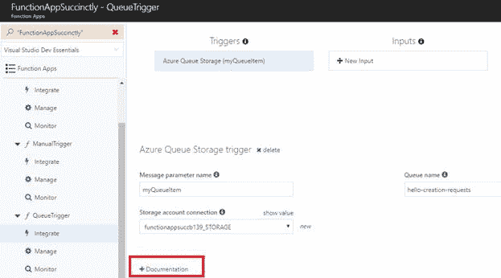

图 3-a:集成视图下的文档链接

单击**文档**链接后，您可能需要向下滚动一点才能找到我们正在寻找的元数据详细信息。下面是一个例子。

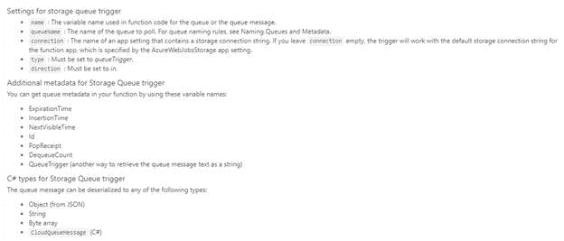

图 3-b:元数据文档

元数据详细信息可以作为新参数添加到`Run`方法中，并带有它们的特定名称。

让我们看看如何修改 **QueueTrigger** 函数的`Run`方法来添加一些新的参数，比如队列项的`InsertionTime`和`Id`。

为此，单击**队列触发器**项目，以便打开`Run`方法的代码。

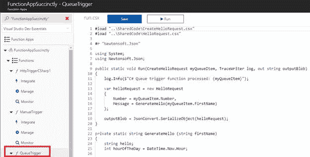

图 3-c:队列触发器运行方法

从这段代码中，我们可以开始在`outputBlob`变量后添加新的参数。

我要添加的第一个参数叫做`insertionTime`，类型为`DateTimeOffset`。我要添加的第二个参数叫做`id`，类型是`string`。

`Run`方法的修改代码如下，附加参数以粗体突出显示。

清单 3-a:队列触发器的更新运行

```cs
  #load
  "..\SharedCode\CreateHelloRequest.csx"
  #load
  "..\SharedCode\HelloRequest.csx"

  #r
  "Newtonsoft.Json"

  using
  System;
  using
  Newtonsoft.Json;

  public
  static void Run (CreateHelloRequest myQueueItem, TraceWriter log, 

  out string outputBlob,

  DateTimeOffset insertionTime,

  string id)
  {

  log.Info(

  $"C# Queue
  trigger function processed: {myQueueItem}");

  log.Info($"InsertionTime: {insertionTime}");

  log.Info($"Id: {id}");

  var helloRequest = new
  HelloRequest

  {

  Number = myQueueItem.Number,

  Message = GenerateHello(myQueueItem.FirstName)

  };

  outputBlob = JsonConvert.SerializeObject(helloRequest);
  }

  private
  static string
  GenerateHello (string firstName)
  {

  string hello;

  int hourOfTheDay = DateTime.Now.Hour;

  if (hourOfTheDay <= 12) 

  hello = "The
  Morning...";

  else if (hourOfTheDay <= 18) 

  hello = "The
  Afternoon...";

  else 

  hello = "The
  Evening...";

  return $"{hello} {firstName}";
  }

```

现在，当这个触发器执行时，它会给我们关于触发这个函数的消息的附加信息。我们将使用这些信息作为日志消息输出到 Azure 门户控制台。

输入更改后，点击**保存**保存更改，确保没有编译错误。

如您所见，向`Run`方法添加元数据参数非常容易，因为获得关于正在执行的操作的额外细节可能会很有用。

## BLOB 触发函数

让我们回到 Azure 门户，通过点击 **+** 按钮创建一个新的功能。这次我们用 **C#** 选择**BLOB 触发**选项，如下图所示。

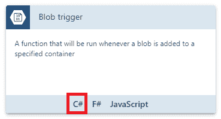

图 3-d:使用 C#的 Blob 触发器选项

一旦我们选择了那个选项，我们将被要求为我们的 blob 触发函数输入一些细节。我们可以在下面的截图中看到这些。

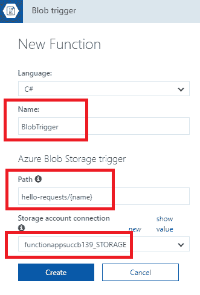

图 3-e:BLOB 触发的函数细节

请注意，函数名已设置为 **BlobTrigger** ，路径指向我们之前创建的 **hello-requests** blob，并且**存储帐户连接**已相应设置。

您可能已经注意到**存储帐户连接**的名称看起来与之前截图中的名称略有不同。这是因为当我做自己的测试时，我删除了以前的连接，创建了一个新的连接，这是完全有效的。但是，您可能不需要这样做，所以您可能会使用之前使用的相同的**存储帐户连接**。

请注意 Azure Blob 存储触发路径的格式—它被设置为 **hello-requests/{name}** 。花括号内的**名称**元素将给出触发该函数的 BLOB 的名称。这个**名称**元素也绑定到我们函数输入中的一个`string`参数。

输入所有细节后，点击**创建**完成 BLOB 触发函数的创建。

一旦创建，我们将看到默认代码 **run.csx** ，如下所示。

清单 3-b:BlobTrigger 的默认运行

```cs
  public static void Run(Stream myBlob, string name, TraceWriter log)
  {

  log.Info($"C#
  Blob .. function Processed blob\Name: {name} ..");
  }

```

请注意`Run`方法的第二个参数是如何被调用的`name`，它表示在 Azure Blob 存储触发路径中指定的**名称**元素。

完成后，让我们转到 **BlobTrigger** 功能的**集成**选项，然后单击**新输出**。选择**蓝色 BLOB 存储**选项。

我们将保持 **blob 参数名称**不变，并将**路径**中 Blob 容器的名称更改为**收据/{rand-guid}** ，这是我们之前创建的(尚未使用的)Blob 容器的名称。

确保选择正确的**存储帐户连接**。我们可以看到这些变化如下。

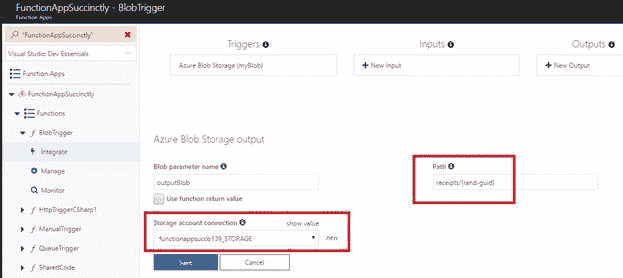

图 3-f:创建 BLOB 存储输出

请注意，我们使用的是 **{rand-guid}** 语法，这意味着我们将获得一个分配给文件名的随机 guid。

完成后，让我们返回到默认的 **run.csx** 代码，并添加输出 blob 参数。我们可以这样做。

清单 3-c:BlobTrigger 的更新运行

```cs
  public static void Run(Stream myBlob, string name, 

  TraceWriter log, Stream outputBlob)
  {

  log.Info($"C#
  Blob .. function Processed blob\Name: {name} ..");
  }

```

如果我们想要获取关于输入 blob 的附加元数据，我们可以将类型从`Stream`更改为`CloudBlockBlob`。

为了访问这个`CloudBlockBlob`类型，我们需要添加一个对`Microsoft.WindowsAzure.Storage`组件的引用，并且还要添加一个`using`语句。

我们也将使用 JSON，所以我们需要添加对`Newtonsoft.Json`的引用，并添加相应的`using`指令。

我们还将利用我们之前编写的**共享代码**函数中的几个类。我们可以用`load`指令来添加这些。我将删除日志线，因为我们不需要它。

因此，让我们更新 **run.csx** 代码来反映这些变化，如下所示。

清单 3-d:更新的 run.csx

```cs
  #load
  "..\SharedCode\HelloRequest.csx"
  #load
  "..\SharedCode\MsgSentConfirmation.csx"

  #r "Newtonsoft.Json"
  #r "Microsoft.WindowsAzure.Storage"

  using
  Newtonsoft.Json;  
  using
  Microsoft.WindowsAzure.Storage.Blob;

  public static void Run(CloudBlockBlob myBlob,
  string name, 

  TraceWriter log, Stream outputBlob)
  {
  }

```

因为我们已经将传入的 blob 更改为类型`CloudBlockBlob`，所以我们可以获得额外的元数据信息。

让我们利用这些元数据。我们可以通过简单地打印到日志中来做到这一点。我们可以访问各种元数据属性，比如 blob 的`Name`、传入 blob 的`StorageUri`，甚至 blob 的容器元数据。

这个 blob 触发函数将要执行的任务可以分为三个部分。第一部分将从 blob 存储下载 blob 内容。

为此，我们将调用一个名为`GetHelloRequest`的方法，并将其传递给`CloudBlockBlob`。然后，我们将简单地写下`GetHelloRequest`返回的消息。

所以，让我们更新 **run.csx** 来反映这些变化。

清单 3-e:更新的 run.csx

```cs
  #load
  "..\SharedCode\HelloRequest.csx"
  #load
  "..\SharedCode\MsgSentConfirmation.csx"

  #r "Newtonsoft.Json"
  #r "Microsoft.WindowsAzure.Storage"

  using
  Newtonsoft.Json;
  using
  Microsoft.WindowsAzure.Storage.Blob;

  public static void Run(CloudBlockBlob myBlob, string name, 

  TraceWriter log, Stream outputBlob)
  {

  log.Info($"Metadata
  Name: {myBlob.Name}");

  log.Info($"Metadata
  StorageUri: {myBlob.StorageUri}");
      log.Info($"Metadata Container: {myBlob.Container.Name}");

      HelloRequest helloRequest = GetHelloRequest(myBlob);

  log.Info($"Hello
  Request: {helloRequest}");
  }

```

请注意，如果您单击**保存**，前面的代码将无法编译，因为`GetHelloRequest`方法被调用，但它实际上还不存在。

现在让我们创建`GetHelloRequest`方法，该方法将把 blob 下载到内存流中，并使用`Newtonsoft.Json`程序集将内容反序列化为`HelloRequest`对象，该对象返回给调用者。

这就是添加了`GetHelloRequest`方法后 *run.csx* 的代码的样子。

清单 3-f:更新的 run.csx

```cs
  #load
  "..\SharedCode\HelloRequest.csx"
  #load
  "..\SharedCode\MsgSentConfirmation.csx"

  #r "Newtonsoft.Json"
  #r "Microsoft.WindowsAzure.Storage"

  using
  Newtonsoft.Json; 
  using
  Microsoft.WindowsAzure.Storage.Blob;

  public static void Run(CloudBlockBlob myBlob, string name, 

  TraceWriter log, Stream outputBlob)
  {

  log.Info($"Metadata
  Name: {myBlob.Name}");

  log.Info($"Metadata
  StorageUri: {myBlob.StorageUri}");
      log.Info($"Metadata Container: {myBlob.Container.Name}");

      HelloRequest
  helloRequest = GetHelloRequest(myBlob);

  log.Info($"Hello
  Request: {helloRequest}");
  }

  public static HelloRequest
  GetHelloRequest(CloudBlockBlob blob)
  {

  HelloRequest helloRequest;

  using (var ms = new MemoryStream())

  {

  blob.DownloadToStream(ms);

  ms.Position = 0;

  using (var res = new StreamReader(ms)) 

  {

  using (var jtr = new JsonTextReader(res))

  {

  var s = new JsonSerializer();

  helloRequest = s.Deserialize<HelloRequest>(jtr);

  } 

  }

  }

  return helloRequest;   
  }

```

我之前提到过，这个 blob 触发的函数将执行一个可以分成三部分的任务。我们刚刚做了第一部分，就是调用并执行`GetHelloRequest`方法。

第二部分是使用返回的`helloRequest`对象发送一条短信。为此，我们将调用名为`SendMessage`的方法，该方法将从模拟的消息传递网关返回一个`Guid`。我们需要传递`helloRequest`对象作为参数。

让我们创建`SendMessage`方法——下面的清单是更新后的 **run.csx** 代码。

清单 3-g:更新的 run.csx

```cs
  #load
  "..\SharedCode\HelloRequest.csx"
  #load
  "..\SharedCode\MsgSentConfirmation.csx"

  #r "Newtonsoft.Json"
  #r "Microsoft.WindowsAzure.Storage"

  using
  Newtonsoft.Json; 
  using
  Microsoft.WindowsAzure.Storage.Blob;

  public static void Run(CloudBlockBlob myBlob, string name, 

  TraceWriter log, Stream outputBlob)
  {

  log.Info($"Metadata
  Name: {myBlob.Name}");

  log.Info($"Metadata
  StorageUri: {myBlob.StorageUri}");
      log.Info($"Metadata Container: {myBlob.Container.Name}");

      HelloRequest
  helloRequest = GetHelloRequest(myBlob);

  log.Info($"Hello
  Request: {helloRequest}");

  string id = SendMessage(helloRequest);
  }

  public static string SendMessage(HelloRequest req)
  {

  // We simulate
  sending SMS with req and returning a unique GUID

  return Guid.NewGuid().ToString(); 
  }

  public static HelloRequest GetHelloRequest(CloudBlockBlob blob)
  {

  HelloRequest helloRequest;

  using (var
  ms = new MemoryStream())

  {

  blob.DownloadToStream(ms);

  ms.Position = 0;

  using (var
  res = new StreamReader(ms)) 

  {

  using (var
  jtr = new JsonTextReader(res))

  {

  var s = new
  JsonSerializer();

  helloRequest = s.Deserialize<HelloRequest>(jtr);

  } 

  }

  }

  return helloRequest;   
  }

```

我们现在已经完成了两个部分，我们只是错过了最后一个阶段。最后，让我们创建一个消息确认，并将其写入 blob 存储。

为此，让我们从**共享代码**函数创建一个`MsgSentConfirmation`类的实例。

我们需要将`ReceiptId`属性设置为从模拟消息传递网关接收到的值，并根据从 blob 存储读取的信息设置`Number`和`Message`属性。

最后，我们想把这个`MsgSentConfirmation`对象上传到 blob 存储。

我们可以通过创建一个名为`UploadMsg`的新方法来做到这一点，该方法将使用 JSON.NET 来序列化`MsgSentConfirmation`对象，并将其写入 blob 存储。

让我们继续将此代码添加到 **run.csx** 中。这些变化在下面的列表中以粗体显示。

清单 3-h:更新的 run.csx

```cs
  #load
  "..\SharedCode\HelloRequest.csx"
  #load
  "..\SharedCode\MsgSentConfirmation.csx"

  #r "Newtonsoft.Json"
  #r "Microsoft.WindowsAzure.Storage"

  using
  Newtonsoft.Json; 
  using
  Microsoft.WindowsAzure.Storage.Blob;

  public static void Run(CloudBlockBlob myBlob, string name, 

  TraceWriter log, Stream outputBlob)
  {

  log.Info($"Metadata
  Name: {myBlob.Name}");

  log.Info($"Metadata
  StorageUri: {myBlob.StorageUri}");
      log.Info($"Metadata Container: {myBlob.Container.Name}");

      HelloRequest
  helloRequest = GetHelloRequest(myBlob);

  log.Info($"Hello
  Request: {helloRequest}");

  string id = SendMessage(helloRequest);

  var confirm = new MsgSentConfirmation

  {

  ReceiptId = id,

  Number = helloRequest.Number,

  Message = helloRequest.Message

  };

  UploadMsg(confirm,
  outputBlob);
  }

  public static void UploadMsg(MsgSentConfirmation
  confirm, 

  Stream outputBlob)
  {

  using (var w = new StreamWriter(outputBlob))

  {

  using (var jw = new JsonTextWriter(w))

  {

  JsonSerializer s = new
  JsonSerializer();

  s.Serialize(jw, confirm);

  jw.Flush();

  }

  }
  }

  public static string SendMessage(HelloRequest req)
  {

  // We simulate sending
  SMS with req and returning a unique GUID

  return Guid.NewGuid().ToString(); 
  }

  public static HelloRequest GetHelloRequest(CloudBlockBlob blob)
  {

  HelloRequest helloRequest;

  using (var
  ms = new MemoryStream())

  {

  blob.DownloadToStream(ms);

  ms.Position = 0;

  using (var
  res = new StreamReader(ms)) 

  {

  using (var
  jtr = new JsonTextReader(res))

  {

  var s = new
  JsonSerializer();

  helloRequest = s.Deserialize<HelloRequest>(jtr);

  } 

  }

  }

  return helloRequest;   
  }

```

如你所见，一点也不复杂。将代码添加到 Azure Portal 后，点击**保存**保存所有修改，检查是否有编译错误。

为了测试这一点，让我们回到**手动触发**功能。更改输入的测试数据，然后点击**运行**执行。

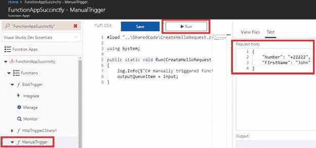

图 3-g:运行手动触发功能

当这个执行时，它将经历一系列的功能。当写入队列时，我们的队列触发器将获取消息并将其写入 blob 存储。然后，blob 触发器应该接收到这个信息，并且 **BlobTrigger** 函数应该执行。最终结果应该可以在**收据** blob 容器上获得。

转到 Azure 存储资源管理器验证结果。

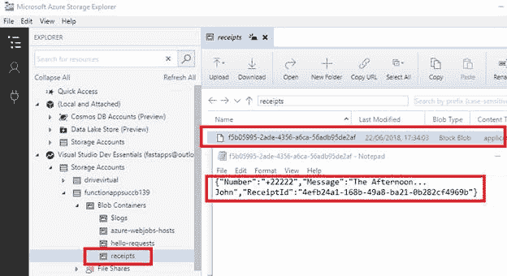

图 3-h:结果收据 BLOB

现在我们有了一个由几个 Azure 函数组成的工作解决方案，这些函数通过队列和 blobs 进行通信来协同工作。

如果我们继续执行手动触发的功能，我们可能会在我们正在使用的 blobs 中有很多项目，所以在给定的一段时间后有一个功能来清理它们会很方便。这可以通过使用定期执行并移除旧 BLOB 的函数来实现。

## 理解 CRON 表达式

在我们创建计时器触发的函数之前，了解 CRON 表达式是如何工作的非常重要。当创建一个定时器触发的函数时，我们需要指定一个 CRON 表达式，它决定了触发器执行的频率或时间。

使用 Azure 函数，指定 CRON 表达式由六部分组成，如下图所示。

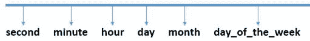

图 3-1:CRON 表达式的一部分

CRON 表达式由秒、分钟、小时、日、月和星期几组成，指示任务将在何时执行。

除了这些值之外，我们还可以在表达式中使用许多特殊字符。

如果我们有一个值列表，我们可以使用逗号(**、**)。如果我们想要创建步长值——周期性地重复出现的值——我们可以使用正斜杠( **/** )。

星号( ***** )类似于通配符，表示可以有任何值。连字符( **-** )表示数值范围。

让我们看一个 CRON 表达式的例子。

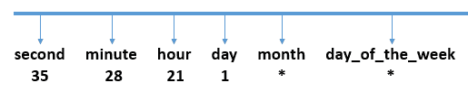

图 3-j:CRON 表达式的例子

在本例中，CRON 表达式将在晚上 9:28 以 35 秒的时间执行，每个月的第一天，与当天是星期几无关。

想象一下，相反，我们想在三月的每一天执行这个任务(注意，这个月是从零开始的)，而不仅仅是在这个月的第一天。我们可以这样做。

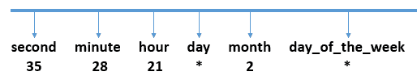

图 3-k:CRON 表达式的另一个例子

我们还可以通过使用步长值来创建重复出现的时间表。下面是一个示例，表明任务将每 28 分钟触发一次，每天一次，而不是特别在第 28 分钟触发。

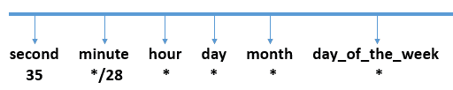

图 3-1:CRON 表达式的另一个例子

我们还可以指定一周中的特定日期、月份或天数，以将此任务的执行限制在这些特定日期。我们可以这样做。

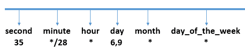

图 3-m:CRON 表达式的另一个例子

在本例中，任务将每 28 分钟执行一次，在每小时的第 35 秒执行，但仅在每月的第 6 天和第 9 天执行，与一周中的哪一天无关。

如果您希望将此任务限制在一周中的特定日期执行，例如在用户不在办公室的周六和周日，可以按如下方式完成。

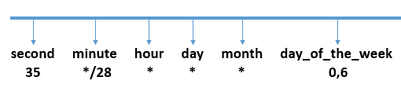

图 3-n:CRON 表达式的另一个例子

在前面的示例中，值 0 表示星期日，值 6 表示星期六。正如你可能已经猜到的，1 表示星期一，2 表示星期二，以此类推。

也可以指定范围。周一至周三(含)的范围如下。

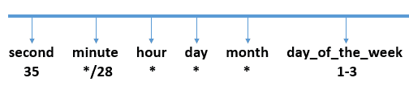

图 3-o:CRON 表达式的另一个例子

如你所见，可能性是无穷无尽的。现在我们了解了 CRON 表达式的工作原理，让我们回到 Azure Portal，创建一个使用时间触发器的新函数。

## 定时器触发功能

就像我们之前在 Azure 门户看到的一样，点击**功能**旁边的 **+** 按钮，创建一个新的 Azure 功能。

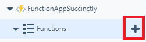

图 3-p:添加新 Azure 功能的+按钮

出现提示时，用 **C#** 选择**定时器触发**模板。

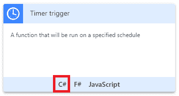

图 3-q:定时器触发模板

点击 **C#** 选项后，会出现一个对话框，我们可以在其中指示 Azure 功能的**名称**和执行**日程**。

默认情况下，CRON 表达式被设置为每五分钟运行一次，但是我们可以修改它以不同的时间表运行。在我的例子中，我将它设置为每 10 分钟执行一次。我们可以这样看。

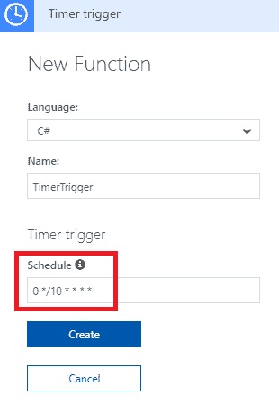

图 3-r:创建定时器触发函数

一旦指定了功能的**名称**和**日程**，点击**创建**完成功能的创建。

创建定时器触发功能后，请注意在 **run.csx** 代码中，第一个参数是如何设置为使用`TimerInfo`对象的。您可以在下面的列表中看到这一点。

清单 3-i:定时器触发函数的 run.csx

```cs
  using
  System;

  public static void Run(TimerInfo myTimer, TraceWriter
  log)
  {

  log.Info($"C#
  Timer triggered function executed at: {DateTime.Now}");
  }

```

通过使用`TimerInfo`对象，我们可以访问关于执行该功能的计时器的信息。

为了看到这些计时器的一些细节，让我们在我们的`Run`方法中添加一些额外的日志信息。我们可以在下面的列表中看到这一点。

清单 3-j:定时器触发函数的修改后的 run.csx

```cs
  using
  System;

  public static void Run(TimerInfo myTimer, TraceWriter
  log)
  {

  log.Info($"C#
  Timer triggered function executed at: {DateTime.Now}");

  log.Info($"Timer
  schedule: {myTimer.Schedule}");

  log.Info($"Timer
  last execution: {myTimer.ScheduleStatus.Last}");

  log.Info($"Timer
  last execution: {myTimer.ScheduleStatus.Next}");
  }

```

注意我是如何将`Last`和`Next`计划执行的细节添加到输出中的。如果您通过点击**运行**来实际执行该功能，您将能够在记录器上看到以下结果。

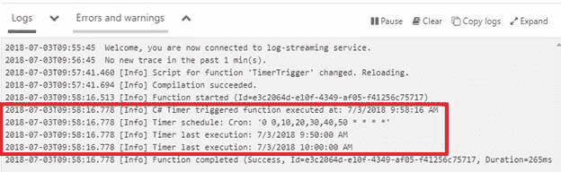

图 3-s:执行定时器触发功能的结果

鉴于这是一个定时器触发的功能，该功能的执行将自动完成，但由于我有点不耐烦，坐在那里等待 10 分钟让该功能自行执行，我点击了**运行**按钮，向您显示这些结果。

请注意，作为结果的一部分，我们可以看到 CRON 表达式的长形式，它指定了该函数将如何自动执行。

在后台，当我一直忙着写这个的时候，计时器已经自动执行了，结果可以在下面的截图中看到。

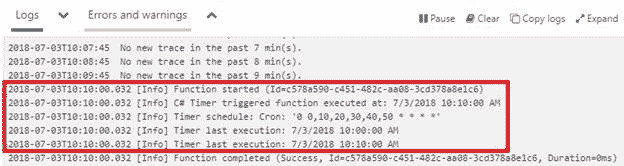

图 3-t:定时器触发功能的自动执行

既然我们已经看到了这个函数是如何工作的，让我们继续让它变得更有趣。因此，让我们修改 **run.csx** 代码，并添加对具有各自名称空间的`WindowsAzure.Storage`和`System.Configuration`程序集的引用。

清单 3-k:定时器触发函数的修改后的 run.csx

```cs
  #r "Microsoft.WindowsAzure.Storage"
  #r "System.Configuration"

  using
  Microsoft.WindowsAzure.Storage.Blob;
  using
  Microsoft.WindowsAzure.Storage;
  using
  System.Configuration;
  using
  System;

  public static void Run(TimerInfo myTimer, TraceWriter
  log)
  {

  log.Info($"C#
  Timer triggered function executed at: {DateTime.Now}");

  log.Info($"Timer
  schedule: {myTimer.Schedule}");

  log.Info($"Timer
  last execution: {myTimer.ScheduleStatus.Last}");

  log.Info($"Timer
  last execution: {myTimer.ScheduleStatus.Next}");
  }

```

接下来，我们希望访问存储帐户的连接字符串。为了得到这个，我们需要从应用设置中读出它。

您会注意到，在接下来的代码中，我将引用字符串`functionappsuccb139_STORAGE`，这与我们在 blob 和队列触发器中使用的连接相同。

完成后，我们需要访问我们的**收据**BLOB 容器，这样我们就可以检查任何超过指定年龄的 BLOB。

让我们更新 **run.csx** 来反映这一点。

清单 3-1:定时器触发函数的修改版 run.csx

```cs
  #r "Microsoft.WindowsAzure.Storage"
  #r "System.Configuration"

  using
  Microsoft.WindowsAzure.Storage.Blob;
  using
  Microsoft.WindowsAzure.Storage;
  using
  System.Configuration;
  using
  System;

  public static void Run(TimerInfo myTimer, TraceWriter
  log)
  {

  log.Info($"C#
  Timer triggered function executed at: {DateTime.Now}");

  log.Info($"Timer
  schedule: {myTimer.Schedule}");

  log.Info($"Timer
  last execution: {myTimer.ScheduleStatus.Last}");

  log.Info($"Timer
  last execution: {myTimer.ScheduleStatus.Next}");

  string conn = 

  ConfigurationManager.AppSettings["functionappsuccb139_STORAGE"];

  CloudStorageAccount storageAccount = CloudStorageAccount.Parse(conn);

  CloudBlobClient blobClient = storageAccount.CreateCloudBlobClient();

  CloudBlobContainer container = 

  blobClient.GetContainerReference("receipts");
  }

```

有了这段代码，我们现在可以指定任何超过五分钟的 blob 都需要删除。这样，我们就有了一个干净的系统。

接下来，我们需要遍历**收据** blob 容器中的所有`CloudBlockBlobs`对象，并验证它们是否太旧。如果它们太旧了，我们应该删除它们。

让我们修改代码来反映这一点。

清单 3-m:定时器触发函数的修改后的 run.csx

```cs
  #r "Microsoft.WindowsAzure.Storage"
  #r "System.Configuration"

  using
  Microsoft.WindowsAzure.Storage.Blob;
  using
  Microsoft.WindowsAzure.Storage;
  using
  System.Configuration;
  using
  System;

  public static void Run(TimerInfo myTimer, TraceWriter
  log)
  {

  log.Info($"C#
  Timer triggered function executed at: {DateTime.Now}");

  log.Info($"Timer
  schedule: {myTimer.Schedule}");

  log.Info($"Timer
  last execution: {myTimer.ScheduleStatus.Last}");

  log.Info($"Timer
  last execution: {myTimer.ScheduleStatus.Next}");

  string conn = 

  ConfigurationManager.AppSettings["functionappsuccb139_STORAGE"];

  CloudStorageAccount storageAccount = CloudStorageAccount.Parse(conn);

  CloudBlobClient blobClient = storageAccount.CreateCloudBlobClient();

  CloudBlobContainer container = 

  blobClient.GetContainerReference("receipts");

  DateTime oldestTime = 

  DateTime.Now.Subtract(TimeSpan.FromMinutes(5));

  log.Info($"Checking
  for old receipts");

  foreach(CloudBlockBlob blob in 

  container.ListBlobs().OfType<CloudBlockBlob>())

  {

  var isOld =
  blob.Properties.LastModified < oldestTime;

  if (isOld)

  {

  log.Info($"Blob
  deleted: {blob.Name}");

  blob.Delete();

  }

  }
  }

```

让我们保存这段代码来检查没有编译错误。

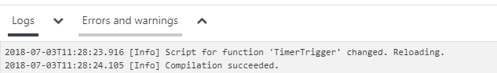

图 3-u:编译成功

太棒了，没有编译错误。现在我们需要做的就是等待计时器执行，这样它就可以完成它的工作。

如果您现在使用 Azure 存储资源管理器应用检查**收据** blob 容器，您可能仍然会在那里找到一个 blob。如果是这样，10 分钟后再次检查 blob 容器，您将看到 blob 已被删除。

这是我测试的结果。

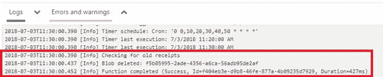

图 3-v:带有 BLOB 删除条目的输出

在我的例子中，该函数自动执行并删除了存在于**收据**BLOB 容器上的 BLOB 条目。

## 总结

我们从探索函数元数据开始这一章，然后我们创建了一个新的 blob 触发函数。

当我们创建 blob 触发的函数时，我们将路径设置为 **hello-requests** ，并在大括号内使用特殊名称，我们看到 blob 的名称被填充到名为`name`的函数参数中。

我们还将传入参数从`stream`更改为`CloudBlockBlob`，我们看到了如何访问关于传入 blob 的元数据，例如 blob 名称。

我们添加了一些代码来模拟发送文本消息，然后写出一个新的 blob 来表示消息收据。

在完成 blob 触发的函数之后，我们探索了 CRON 表达式的基础，它控制计时器触发函数的执行，并创建了一个每十分钟执行一次的函数。这个函数做一些内务处理，并删除超过五分钟的 BLOB。

正如您所看到的，这是一个非常有趣的章节，我们探索了使用 Azure 函数的各种有用的东西。

接下来，我们将看看 HTTP 触发的函数，这是一种允许外部世界在 Azure Functions 应用中执行代码的方式。

我们将学习如何创建一个发布一些数据的 HTTP 触发器，并将其写入我们已经设置好的队列。听起来很刺激，对吧？