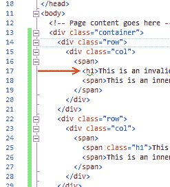
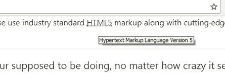

# 二、内容为王

没有内容的现代网站或网络应用是不完整的。从待售产品的网格，到跨越我们数字世界的人们的俏皮话和语录，内容是我们填充页面的东西，是我们用来定义图像、标题、章节等等的东西。

大多数开发人员类型在制作网页布局时并不真正考虑内容，公平地说，他们中的大多数人很乐意只是放入某种占位符，然后让设计人员处理它。

BS4 和它的前辈一样，用很少的工作就能让你的 UI 看起来很棒。首先，标题、列表、`<pre>`标签和表单等许多常见的东西已经为您定义好了。在许多情况下，您甚至不需要指定任何种类的类——只需以正确的顺序使用正确的语义标签就足够了。

|  | 注意:语义标签是 HTML5 标准的一部分，该标准旨在使 HTML 文档中的标签能够自我记录。我们都知道

# 是一级标题标签，或者

是一个段落标签，但是在 HTML5 下，我们现在有了像

<section>、

<article>和

<aside>这样的标签来将它们里面的内容标记为特定的文档实体。

<form>、<input>和其他类似的标签也是出于同样的目的而设计的，因此处理内容的软件或脚本可以对特定内容的用途做出一些假设。</form>

</aside>

</article>

</section>

 |

正如您将在本章中看到的，即使是最简单的文本块，BS4 也可以让它看起来很棒，即使它只是您正在制作的占位符内容。

这里没有什么特别的——标题一直(并且将一直)使用标准的`<hx>` HTML 标签来指定。`x`通常是一个从 1 到 6 的值，给你六个不同级别的标题。

标题使用的一个好例子是在这本书里。如果您查看本节开头的标题“标题”，然后向上滚动到本章的开头并查看章节标题，您可以看到正在播放的我的 Microsoft Word 模板中的标题级别 1 和 2。

将以下主体代码添加到您的 BS4 模板文件中。

代码清单 11:内容标题

```html
    <!-- Page content goes here
  -->
    <div class="container">

  <div class="row">

  <div class="col">

  <h1>Heading
  Level 1</h1>

  <h2>Heading
  Level 2</h2>

  <h3>Heading
  Level 3</h3>

  <h4>Heading
  Level 4</h4>

  <h5>Heading
  Level 5</h5>

  <h6>Heading
  Level 6</h6>

  </div>

  </div>
    </div>

```

如果一切正常，那么您的浏览器应该显示以下内容:


图 9:代码清单 11 产生的标题级别

如果您使用过 Bootstrap 的早期版本，那么您可能会注意到，前面示例中的字体看起来像默认的浏览器无衬线字体，而不是 BS3 和 BS2 使用的自定义字体。

这是有意为之的，因为 BS 的作者认为回到原生字体堆栈要好得多。这主要有两个原因。首先，原生字体堆栈总是比自定义字体堆栈渲染得更快，其次，由 BS 决定您的设计应该使用什么字体并不重要——这是设计者的决定，并且总是应该如此。

因为在现代网络开发中有太多不同的方法来管理字体加载，维护一个完全按照每个使用 BS4 的人想要的方式工作的字体堆栈将是一项艰巨的任务。更简单的方法是让项目的工作人员决定使用什么，让 BS4 专注于布局和规模。

然而，标题不仅仅是枯燥和直接的。BS4 还包括一个更大、更突出的标题样式。

更改代码清单 11 中的代码，如下所示:

代码清单 12:使用显示大小类的标题

```html
    <!-- Page content goes here
  -->
    <div class="container">

  <div class="row">

  <div class="col">

  <h1 class="display-1">Heading Level 1.1</h1>

  <h1 class="display-2">Heading Level 1.2</h1>

  <h1 class="display-3">Heading Level 1.3</h1>

  <h1 class="display-4">Heading Level 1.4</h1>

  </div>

  </div>
    </div>

```

你现在会看到你的标题变得更大，但也更薄，更容易阅读。


图 10:代码清单 12 的输出显示了添加到标题标签中的显示类

您可以将显示大小类别应用于任何您喜欢的`<h>`标签。事实上，您可以将它们应用于任何块级元素，但是使用它们的内容将始终呈现相同的大小。因此，在浏览器中渲染时，使用`display-1`类的`<h1>`和`<h2>`标签将无法区分。

如果你需要保持你的 HTML5 的有效性(这是你应该一直努力做到的)，那么有些地方你可能想使用一个标题标签，但不能，因为这意味着有无效的 HTML 内容。

这方面的一个例子可能是当您想要使用`<span>`标记来标记一个部分，但是该部分可能需要在其内容中使用它自己的`<h>`样式的标记。

在 HTML5 下，将块元素放在内联元素内部是无效的，`<span>`标记是内联元素。

不要害怕:BS4 在这里保护你的背部，如下例所示。

代码清单 13:一个以无效和有效格式创建的`<h1>`标签，显示了`hx` BS4 类

```html
    <!-- Page content goes here
  -->
    <div class="container">

  <div class="row">

  <div class="col">

  <span>

  <h1>This
  is an invalid heading</h1>

  <span>This
  is an inner paragraph. The paragraph is in an inner span, so it's valid.</span>

  </span>

  </div>

  </div>

  <div class="row">

  <div class="col">

  <span>

  <span class="h1">This is a valid heading</span><br/>

  <span>This
  is an inner paragraph. The paragraph is in an inner span, so it's valid.</span>

  </span>

  </div>

  </div>

  </div>

```

如果您在浏览器中渲染它，您将看到以下输出。


图 11:代码清单 13 的输出

对于没有经验的人来说，没有什么是不合适的，大多数非技术用户也不会多想。但是，如果您在 Visual Studio 中查看代码，您会看到一条绿色的曲线。



图 12:显示 HTML 代码无效的 Visual Studio。

|  | 注意:图 12 中的绿色曲线是特定于 Visual Studio 2017(我在写这本书时使用的编辑器)的。如果您使用的是不同的编辑器，突出显示和错误通知可能会有所不同，或者在某些情况下，可能根本不会显示。因为这只是一个警告，没什么大不了的。如果您热衷于确保您的 HTML 代码是 100%有效的，那么您可能希望探索许多验证工具和在线服务。 |

还有其他一些例子可以派上用场，比如在表格的标题中，或者在表单输入旁边的字段组中。BS4 提供`<h1>`到`<h6>`类，如果使用实际的`<hx>`标签，每个类的大小都要与给定的大小相匹配。

就像标题标签一样，列表也是就地处理的。当您以正确的顺序使用正确的标签时，BS4 将简单地为您处理它，如下例所示。

代码清单 14:标准列表项

```html
  <!--
  Page content goes here -->
    <div class="container">

  <div class="row">

  <div class="col">

  <ul>

  <li>List
  Item 1</li>

  <li>List
  Item 2</li>

  <li>

  List Item 3<ul>

  <li>List
  Item 3a.</li>

  <li>List
  Item 3b.</li>

  <li>List
  Item 3c.</li>

  </ul>

  </li>

  <li>List
  Item 4</li>

  <li>List
  Item 5</li>

  </ul>

  </div>

  </div>
    </div>

```

这应该会产生以下输出。


图 13:清单 14 产生的输出

如您所见，嵌套处理得当，字体大小、缩进和平衡正确。

将代码清单 14 中的`<ul>`标签更改为`<ol>`标签，您将看到有序列表也是如此。


图 14:代码清单 14 产生的输出，其中`<ul>`标签被更改为`<ol>`标签

如果你愿意，你可以删除列表样式，让 BS4 为你处理间距和边距。更改代码清单 14 以添加额外的`list-unstyled`类，使其看起来像代码清单 15 中的代码。

代码清单 15:带有`un-styled`类的标准列表项

```html
  <!--
  Page content goes here -->
    <div class="container">

  <div class="row">

  <div class="col">

  <ul class="list-unstyled">

  <li>List
  Item 1</li>

  <li>List
  Item 2</li>

  <li>

  List Item 3<ul>

  <li>List
  Item 3a.</li>

  <li>List
  Item 3b.</li>

  <li>List
  Item 3c.</li>

  </ul>

  </li>

  <li>List
  Item 4</li>

  <li>List
  Item 5</li>

  </ul>

  </div>

  </div>
    </div>

```

请注意，我们只更改了第一个`<ul>`标签上的类，没有其他内容。内部的`<ul>`标签是一组新的列表项，因此它会自动重新打开样式，导致列表看起来应该如图 15 所示。


图 15:添加了非样式类的普通列表标签产生的输出

以这种方式使用类`list-unstyled`可以让您不用担心列表的内部部分保持它们的样式，同时仍然允许您以不同的方式对待父列表。

当涉及到常规列表标签时，你还有一个类可以支配，那就是`list-inline`类。顾名思义，这个类将所有列表项放在一行中，例如，如果需要水平导航栏或下拉列表，您可以使用它。

使用`inline`类要复杂一些，因为您不仅需要将`inline`类应用于`<ul>`，还需要将一个类应用于每个`<li>`元素，如代码清单 16 所示。

代码清单 16:使用内联类的标准列表

```html
    <!-- Page content goes here
  -->
    <div class="container">

  <div class="row">

  <div class="col">

  <ul class="list-inline">

  <li class="list-inline-item">List Item 1</li>

  <li class="list-inline-item">List Item 2</li>

  <li class="list-inline-item">List Item 4</li>

  <li class="list-inline-item">List Item 5</li>

  </ul>

  </div>

  </div>
    </div>

```

将代码清单 16 中的主体代码放入模板，并在浏览器中呈现。现在，您应该看到您的每个元素都是水平内嵌的，而不是像以前那样垂直堆叠。


图 16:使用内嵌样式显示的列表项

在我们继续之前，我想向您展示的最后一件事是默认的定义列表布局。定义列表非常有用，因为它们可以传达有用的信息，例如名称和描述列表，或者缩写及其含义。与大多数其他语义标签一样，这赋予了内容意义，允许自动化过程更好地理解它。

将以下代码添加到模板文件中。

代码清单 17:标准定义列表

```html
    <!-- Page content goes here
  -->
    <div class="container">

  <div class="row">

  <div class="col">

  <dl>

  <dt>HTML</dt>

  <dd>Hypertext
  Markup Language, a variation of XML that defines the structure of a webpage
  to the client displaying it.</dd>

  <dt>CSS</dt>

     <dd>Cascading
  Style Sheets, not exactly a language, but a list of instructions telling the
  HTML client how to style the layout defined in the HTML code.</dd>

  <dt>JavaScript</dt>

  <dd>The
  scripting language used inside of HTML documents to add interactivity and
  programmed features.</dd>

  <dt>Style
  Sheet</dt>

  <dd>A
  plain text file that is usually separate from the HTML document and holds CSS
  definitions to apply to the document.</dd>

  </dl>

  </div>

  </div>

  </div>

```

接下来，在浏览器中渲染它。


图 17:代码清单 17 产生的标准定义列表

同样，不需要额外的类，只需要标准标记，但是 BS4 会自动为您格式化和布局边距等。

在实际的 BS4 文档中，有一个更长的示例显示了使用网格、列和行来生成并排列表，以及一些嵌套示例。唯一需要添加的类是定义列布局的类。

除了标题和列表标签，段落和其他标准文本元素也以或多或少相同的方式处理。通过给你的内容添加一个`<p>`标签并填写，BS4 将自动用默认布局设置它，以与其他样式一起工作。

像标题标签一样，段落不会被赋予自定义字体，但是您仍然可以通过将它们与其他标签结合使用来进行一些简单的更改。

与段落结合使用的主要标签有:

*   `<mark>`:用于突出显示文本，就像用荧光笔标记一样。
*   `<s>`:用来划掉文字。
*   `<del>`:用于通过文字放一行删除。
*   `<small>`:用于稍微缩小文本大小，标记为不太重要。
*   `<strong>`:使文本加粗。
*   `<em>`:用于强调一段文字，但不使其比段落的其余部分更重要。
*   `<u>`:给文本加下划线。
*   `<ins>`:给里面的文字加下划线，意在标记为对原文的补充。

与前面所有示例一样，将模板中的主体代码更改如下:

代码清单 18:标准段落排版样式

```html
    <!-- Page content goes here
  -->
    <div class="container">

  <div class="row">

  <div class="col">

      <p><mark>Highlighted</mark> text
  is easy to achieve by using the <mark>mark tag</mark>. Again, semantics are important.</p>

  <p><s>Using an "S" tag inside a
  paragraph will strike the text through, indicating that the text is no longer
  correct or accurate.</s></p>

  <p><del>Using the "DEL" tag has a
  similar effect to "S", but the meaning is different, in that the
  text is to be or has been deleted.</del></p>

  <p><small>The "SMALL" tag is mostly
  used for the small print, and will be liked by legal folks :-)</small></p>

  <p><strong>And "STRONG" is used to
  make text bolder so it stands out.</strong></p>

  <p><em>Whereas the "EM" tag is
  designed to emphasize text by making it appear italic.</em></p>

  <p><u>The "U" tag will underline
  your text.</u></p>

  <p>And
  finally, "INS" is designed to make it look like text <ins>has
  been inserted</ins>
  into a paragraph.</p>

  </div>

  </div>
    </div>

```

并在浏览器中呈现:


图 18:标准排版样式

就像我们到目前为止所看到的大多数一样，你可以直接看到它都是语义的。

`<u>`和`<ins>`标签都给出了完全相同的样式，但是对于任何查看页面内容的东西，它都能够分辨出一个是插入，而另一个只是装饰。`<s>`和`<del>`标签的工作方式是一样的，允许你使用自定义的 CSS 在视觉上区分事物的风格，但是不会有损害页面语义的风险。

|  | 注意:谷歌会给一个遵循语义规则的页面一个比不遵循语义规则的页面更好的搜索索引排名，尤其是如果你使用了正确标记的邮政地址和网站名称。事实上，谷歌在搜索页面右侧显示的大部分信息来自于它能够查看您的页面代码，并理解哪些部分指的是姓名、地址、地图、日期、时间等。使用语义标签不仅仅是为了帮助 Bootstrap，也是为了世界舞台和你的可见性。 |

如果您将`lead`类添加到段落标记中，BS4 将以更大的字体呈现该段落，使其看起来像开头或前导段落。将代码清单 19 中的代码添加到您的页面中，以查看它的运行情况。

代码清单 19:段落`lead`类

```html
    <!-- Page content goes here
  -->
    <div class="container">

  <div class="row">

  <div class="col">

  <p class="lead">I am the lead paragraph in this
  document. My size is increased to make me look more prominent compared to the
  rest of the text below me.</p>

     <p>I'm
  just a standard paragraph tag. I'm not more important than the one above me,
  but I'm also not the start of the text on this page or in this document.</p>

  </div>

  </div>
    </div>

```

代码清单 19 应该给出如图 19 所示的输出，在这里您可以清楚地看到这两段中哪一段是开头的一段。


图 19:代码清单 19 产生的前导和非前导样式的段落

一旦我们开始不再使用语义标签来标记事物，而是只使用 BS4 提供的样式类，我们就可以开始利用像对齐和对齐的文本，以及可以与定制 BS4 调色板和定制 BS4 CSS 构建自动交换的上下文颜色这样的东西。

文本对齐有四种不同的风格:`left`、`center`、`right`和`justified`。`left`将文本粘贴到父容器的左侧，`right`将其定位到父容器的右侧，`center`将其定位在中间，两侧的空间相等。`justified`对齐试图使段落中的每一行都等于父容器的宽度。

请注意，我用父容器来描述这一点。Bootstrap 早期版本中的文本实用程序并不特别适合在行级或页级之外的任何地方使用，并且在使用时看起来通常会有点不合适。随着 BS4 在幕后使用 Flexbox 进行布局，文本实用程序现在使用新的 CSS 规则和样式来对齐行、列和常规`<div>`标签中的文本，您现在可以在页面布局中使用这些标签。

这使得项目的布局更加灵活，但更重要的是，这也使得制作可重用的内容块并将其嵌套到相当深的层次变得更加简单。

代码清单 20 中的代码为您提供了一个正在运行的对齐实用程序示例。

代码清单 20: BS4 对齐类

```html
    <!-- Page content goes here
  -->
    <div class="container">

  <div class="row">

  <div class="col">

  <p class="text-justify">...trimmed...</p>

  <p class="text-left">Left Aligned Text</p>

  <p class="text-center">Center Aligned Text</p>

  <p class="text-right">Right Aligned Text</p>

  <p class="text-justify">...trimmed...</p>

  </div>

  </div>
    </div>

```

我已经减少了对齐段落中的文本量，以使其适合书本，但请随意在`…trimmed…`处添加大量新文本。添加的文本越多，效果越好。我使用[盲文本生成器](http://www.blindtextgenerator.com/lorem-ipsum)为我的示例生成文本。

一旦您在 BS4 模板中添加了一些文本和代码清单 20 中的代码，您应该会看到类似于图 20 的内容。


图 20:对齐类代码清单产生的输出

文本实用程序也有控制换行和溢出的类。通过添加溢出类，您允许文本超出父容器的边界，如果该容器是页面，可能会从页面边缘消失。公平地说，对于 BS4 开发团队来说，我确信他们已经考虑了一些具体的用例，但是到目前为止，我还没有找到它的实际用途。

另一方面，截断类有许多用途。

截断类的基本思想是取一个对它的容器来说太大的字符串，缩短它以适合宽度，然后在末尾附加三个点来表示它已经被缩短了。代码清单 21 显示了正在使用的两个类。

代码清单 21:包装和截断类

```html
    <!-- Page content goes here
  -->
    <div class="container">

  <div class="row">

  <div class="col" style="background-color: lightblue">

  <p class="text-nowrap">...trimmed...</p>

  <p class="text-truncate">...trimmed...</p>

  </div>

  </div>
    </div>

```

同样，与调整示例一样，您需要用更具体的内容替换`trimmed`文本。一旦您这样做了，您应该会看到类似于图 21 的内容。


图 21:代码清单 21 的输出

如图 21 所示，第一个没有包装的字符串直接流出行、容器，最终离开页面的右边缘。被截断的段落到达容器的边缘，然后被终止。

如果容器变得更宽或更窄，截断的文本将被更改以尽可能地适合容器。


图 22:在一个更窄的窗口中，代码清单 21 的输出

最后一个实际的转换和样式实用程序包括强制小写、大写和大写文本的类，以及设置粗体、普通、轻量和斜体文本。

`bold`、`normal`、`light`、`italic`样式只在语义布局不重要**的情况下使用。如果您需要让客户端或浏览器脚本意识到文本是粗体或斜体，那么您必须使用本章前面显示的语义标签方法。这里的类只是为了装饰，对于大多数屏幕阅读器和页面脚本来说毫无意义。**

代码清单 22 显示了正在使用的其余类。

代码清单 22:剩余的文本实用程序类

```html
    <!-- Page content goes here
  -->
    <div class="container">

  <div class="row">

  <div class="col">

         <p class="text-lowercase">All of the text IN THIS PARAGRAPH
  should be forced to be in LOWERCASE ONLY, no MaTtEr WHat the Case Of The TEXT
  is.</p>

  <p class="text-uppercase">All of the text IN THIS PARAGRAPH
  should be forced to be in UPPERCASE ONLY, no MaTtEr WHat the Case Of The TEXT
  is.</p>

  <p class="text-capitalize">All of the text IN THIS PARAGRAPH
  should be forced to INITIAL CAPITALS while leaving the case of every OTHer
  lEtTeR set to what it was.</p>

  <p class="font-weight-bold">All of the text in this paragraph
  should be BOLD.</p>

  <p class="font-weight-normal">All of the text in this paragraph
  should be NORMAL.</p>

  <p class="font-weight-light">All of the text in this paragraph
  should be LIGHTWEIGHT.</p>

  <p class="font-italic">All of the text in this paragraph
  should be ITALIC.</p>

  </div>

  </div>
    </div>

```

在我的 Chrome 版本中，代码清单 22 呈现如图 23 所示。


图 23:代码清单 22 产生的输出

如果您已经使用 Bootstrap 完成了任何工作，即使是早期版本，您可能会意识到它最好的特性之一是它的颜色类。

虽然与以前的版本相比，BS4 的命名有了很大的变化，但颜色类别仍然允许您在整个布局和设计中保持调色板的一致性。这是通过创建由函数命名的类来完成的，而不是通过颜色名称。通过使用 Sass 作为您的 CSS 构建工具，或者通过使用引导网站上提供的工具创建自定义 BS4 构建，可以自定义这些类。

自定义类将在每次使用时以完全相同的颜色出现，这意味着您不必记住十六进制值来使用设计所需的颜色。

您还可以使用各种技术非常容易地交换调色板，知道任何更改都将立即在整个站点范围内更改，而无需任何额外的工作。

通过将代码清单 23 中的代码添加到模板中并将其加载到浏览器中，您可以看到 10 个可用的颜色类。

代码清单 23: BS4 颜色类

```html
    <!-- Page content goes here
  -->
    <div class="container">

  <div class="row">

  <div class="col">

  <p class="text-primary">.text-primary</p>

  <p class="text-secondary">.text-secondary</p>

  <p class="text-success">.text-success</p>

  <p class="text-danger">.text-danger</p>

  <p class="text-warning">.text-warning</p>

  <p class="text-info">.text-info</p>

  <p class="text-light bg-dark">.text-light</p>

  <p class="text-dark">.text-dark</p>

       <p class="text-muted">.text-muted</p>

  <p class="text-white bg-dark">.text-white</p>

  </div>

  </div>
    </div>

```

在浏览器中打开后，您应该会看到以下输出。


图 24:BS4 默认颜色类别

代码清单 23 和附图中的示例与 BS4 文档中的示例完全相同。

浅色和白色被渲染在深色背景上，因为它们在页面上是不可见的。

如您所见，每个类都有一个上下文名称，这可以让您了解它的预期用途。例如，`danger`在默认配色方案中总是红色。

您可以轻松地将默认颜色重新映射到新的色调，但是为了做到这一点，您必须直接使用萨斯源。有 10 个额外的色板和 9 个额外的灰度级，从强度 100 到 900，以 100 为步长，让您产生非常好的灰度效果。

然而，在 BS4 的默认下载中，默认情况下不启用任何额外的颜色和灰色。您可以在[文档](https://getbootstrap.com/docs/4.1/getting-started/theming/#sass-options)中找到如何添加额外的颜色。

如果你在这里包括了来自 CDN 或直接下载的 CSS，那么你只限于上下文颜色。

颜色也不仅仅适用于普通文本；还有许多设置背景颜色的上下文类。代码清单 24 显示了一个这样的例子。

代码清单 24: BS4 背景色类

```html
    <!-- Page content goes here
  -->
    <div class="container">

  <div class="row">

  <div class="col">

  <div class="bg-primary
  text-white">.bg-primary</div>

  <div class="bg-secondary
  text-white">.bg-secondary</div>

  <div class="bg-success
  text-white">.bg-success</div>

  <div class="bg-danger text-white">.bg-danger</div>

  <div class="bg-warning text-dark">.bg-warning</div>

  <div class="bg-info text-white">.bg-info</div>

  <div class="bg-light text-dark">.bg-light</div>

  <div class="bg-dark text-white">.bg-dark</div>

  <div class="bg-white text-dark">.bg-white</div>

  </div>

  </div>
    </div>

```

在 Chrome 中渲染时，应该会得到一系列`<div>`标签，每个标签都有不同的背景颜色，如图 25 所示。


图 25:代码清单 24 中产生的 BS4 背景色

如前景色示例中所示，您可以混合背景类和前景类来获得任何需要的组合，与文本颜色一样，您可以更改调色板(如果您直接使用 Sass)。

|  | 提示:如果您使用的是 Visual Studio 的最新版本，可以在项目构建时动态处理和构建 Sass 样式表。如果您使用的是旧版本，Visual Studio Marketplace 中有一些非常好的插件，可以让您像添加常规 CSS 一样轻松地将 Sass 添加到项目中。 |

向支持 BS4 的文档添加缩写和引号非常简单，不需要解释。两者都是面向标签的:缩写使用`<abbr>`语义标签，块引号使用`<blockquote>`。代码清单 25 显示了放入模板中演示类的主体代码。

代码清单 25:缩写和块引用示例

```html
    <!-- Page content goes here
  -->
    <div class="container">

  <div class="row">

  <div class="col">

  <p><abbr title="Bootstrap Version 4">BS4</abbr> has lots of features to help you
  create stunning page and application layouts. Use industry standard <abbr title="Hypertext Markup Language
  Version 5">HTML5</abbr> markup
  along with cutting-edge <abbr title="Cascading Style Sheets Version
  3">CSS3</abbr>
  features to make web apps that almost jump out of the screen.</p>

  <hr/>

  <blockquote class="blockquote">

  <p class="mb-0">It's the same for users too, you
  just keep doing what it looks like you’re supposed to be doing, no matter how
  crazy it seems.</p>

  </blockquote>

     </div>

  </div>
    </div>

```

我在这两部分之间添加了一个`<hr>`标签，这样你就可以看到区块报价在哪里了。


图 26:缩写和块引用示例的输出

从图 26 中可以看到，缩写词用虚线加了下划线，如果您将鼠标悬停在它们上面，将会出现一个包含完整标题文本的工具提示。



图 27:显示了一个缩写工具提示的代码清单 25

不幸的是，在 Windows 屏幕截图上，您看不到指针，指针会变成问号和指针符号，邀请您悬停或单击项目。

向报价添加来源就像添加额外的行一样简单。更改代码清单 25 中的代码以匹配代码清单 26。输出应该如图 28 所示。

代码清单 26:清单 25 更改为添加一个块报价源

```html
    <!-- Page content goes here
  -->
    <div class="container">

  <div class="row">

  <div class="col">

  <p><abbr title="Bootstrap Version 4">BS4</abbr> has lots of features to help you
  create stunning page and application layouts. Use industry standard <abbr title="Hypertext Markup Language
  Version 5">HTML5</abbr> markup
  along with cutting-edge <abbr title="Cascading Style Sheets Version
  3">CSS3</abbr>
  features to make web apps that almost jump out of the screen.</p>

  <hr/>

  <blockquote class="blockquote">

  <p class="mb-0">It's the same for users too, you
  just keep doing what it looks like you're supposed to be doing, no matter how
  crazy it seems.</p>

  <footer class="blockquote-footer">Kevin Flynn in <cite title="Source Title">Tron</cite> (1982)</footer>

  </blockquote>

  </div>

  </div>
    </div>

```


图 28:代码清单 25 中添加了块报价源的例子

如果你读过任何类型的技术博客，你就会知道它们中的许多都有特定的标记来显示计算机代码片段，或者内联样式来突出显示诸如笔画、数学公式和其他类似的东西。

BS4 有五个不同的类可以帮助你在页面中标记这类内容。您可以轻松显示内嵌代码和代码块、变量、用户输入指令以及文本模式计算机应用程序的预期输出。

但是，没有语法高亮会根据语言或布局对文本进行颜色编码，您需要自己添加。有很多基于 JS 的工具包是 BS4 友好的，可以与多种不同的语言一起工作。

最容易使用的标记是内联代码片段。这只是根据文本的常规流程突出显示给定的代码片段，无论是段落、跨度还是`<div>`。

将模板的主体更改为以下内容:

代码清单 27:内联代码示例

```html
    <!-- Page content goes here  -->
    <div class="container">

  <div class="row">

  <div class="col">

  <p>This
  is a normal paragraph, but within it I’ve marked up a <code>&lt;p&gt;</code> tag, and a <code>&lt;div&gt;</code> tag.</p>

  </div>

  </div>
    </div>

```

如您所见，这又是一个使用正确语义标签的例子。与前面的例子一样，一旦 BS4 看到这些标签，它就会标记出来，在这种情况下，会对文本进行轻微的颜色和字体更改，使其从周围的文本中脱颖而出。一旦您在浏览器中渲染它，您应该会看到如下输出。


图 29:代码清单 27 生成的内联代码

`<code>`标签也可以用来格式化多个代码行，但与内联版本不同，您的文本颜色和字体不会改变。但是，您的文本将保留空白、换行符和缩进等内容。

要使用多行代码块，将您的唯一`<code>`标签包装在`<pre>`标签中，如代码清单 28 所示。

代码清单 28:在多行块中使用`<code>`标记

```html
    <!-- Page content goes here
  -->
    <div class="container">

  <div class="row">

  <div class="col">

  <pre><code>

  &lt;p&gt;Sample text here...&lt;/p&gt;

  &lt;p&gt;And another line of sample text here...&lt;/p&gt;

  </code></pre>

  </div>

  </div>
    </div>

```


图 30:代码清单 28 中代码块的输出

请注意，选择在标签内显示的代码在转换为`&lt;`和`&gt;`的标签中有其`<`和`>`符号。

这是 HTML 规范的要求，而不是引导，同样适用于 HTML5 页面布局的任何地方。如果需要显示尖括号，则必须使用正确的基于&符号的格式。

这本书没有篇幅来详细描述像尖括号这样的编码。如果你想跟进这个话题和一般的 HTML5 话题，两个真正好的来源是 [HTML5 医生](http://html5doctor.com/)和 [Mozilla 开发者网络](https://developer.mozilla.org/) (MDN)。

继续，我们也可以使用`<var>`标签来显示变量。它的用法与内联使用代码块相同，并且它被设计为内联使用，而不是在代码块中使用。

`<var>`标签将文本内联斜体，同时保持周围的基本格式。代码清单 29 展示了这一点。

代码清单 29:变量标记示例

```html
    <!-- Page content goes here
  -->
    <div class="container">

  <div class="row">

  <div class="col">

  <p>This
  is a paragraph with some var tags inline: <var>y</var>
  = <var>m</var><var>x</var>
  + <var>b</var></p>

  <h1>This
  is a header with some var tags inline: <var>y</var>
  = <var>m</var><var>x</var>
  + <var>b</var></h1>

  </div>

  </div>
    </div>

```

使用模板在浏览器中呈现时，您应该会看到以下输出。


图 31:代码清单 29 的可变标记输出

如您所见，无论周围的标记是什么，可变字体都将变得更窄和斜体，但它将保留它们所使用的标记的大小和字体。这包括其他 BS4 类，如段落上的`lead`，以及`color`和对齐实用程序类。

最后一组与代码相关的内容格式突出显示了键盘输入和预期输出。像代码块一样，它以两个 HTML5 标签的形式出现，没有类。

如果您想向用户显示他们需要按一些键或键入一些输入，您可以使用`<kbd>`标签。对于预期输出，使用`<samp>`标记。

代码清单 30 显示了如何使用这两个标签。更改您的模板代码，使您拥有以下代码。

代码清单 30:使用键盘和示例输出标签

```html
    <!-- Page content goes here
  -->
    <div class="container">

  <div class="row">

  <div class="col">

  <p>In
  order to use the terminal you need to enter <kbd>cmd</kbd>
  in your run application field.</p>

  <p>After
  you have entered cmd, you need to click OK or press <kbd>Enter</kbd> to
  activate the console.</p>

  <p>If
  everything works OK, you should be greeted with something similar to:</p>

  <p class="font-weight-bold">

  <samp>Microsoft
  Windows [Version 6.1.7601]</samp><br/>

  <samp>Copyright
  (c) 2009</samp><br /><br/>

  <samp>C:\Users\user></samp><br />

  </p>

  <p>If
  you type <kbd>dir</kbd> and
  press <kbd>Enter</kbd> you
  should now get a listing of your files.</p>

  </div>

  </div>
    </div>

```

我在包含输出的段落中添加了一个额外的`font-weight-bold`类，只是为了更容易看到哪个部分是哪个。一旦将页面加载到浏览器中，您应该会看到以下输出。


图 32:代码清单 30 产生的输出