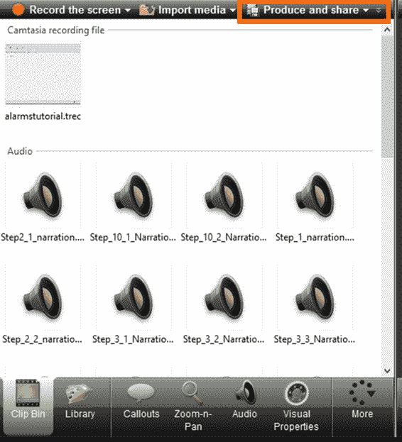
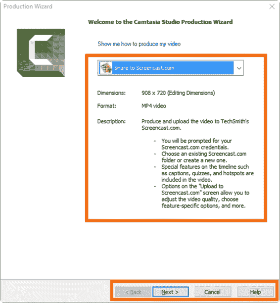
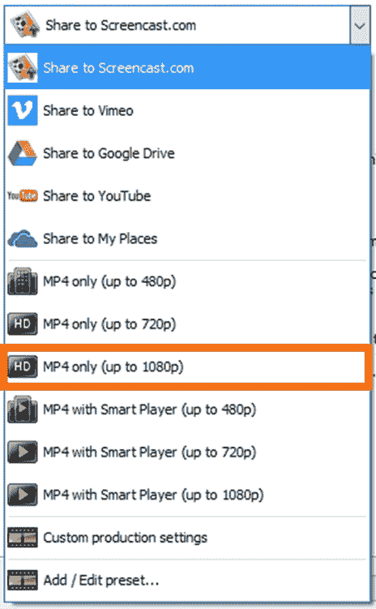
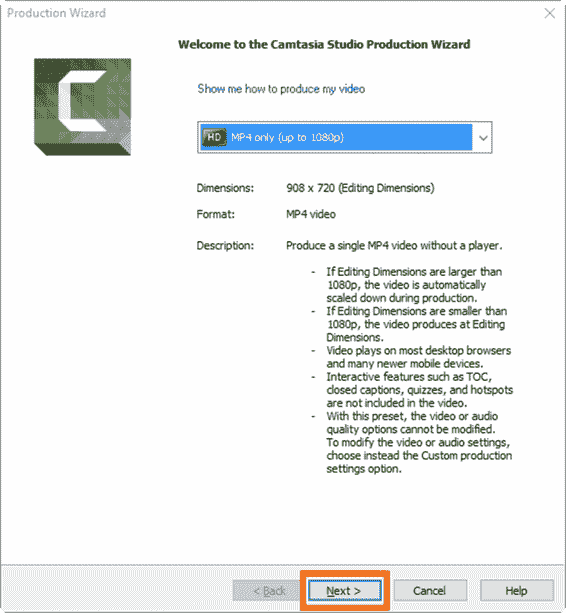
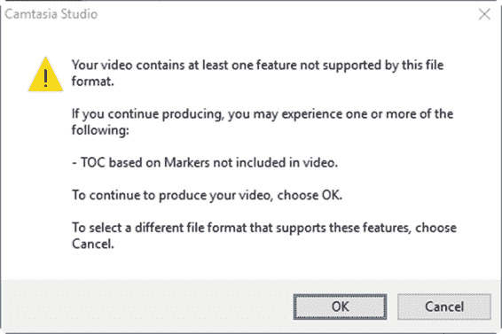
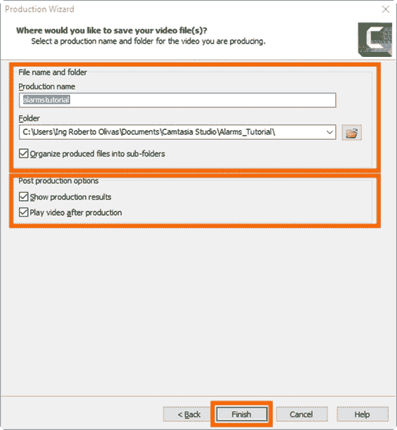
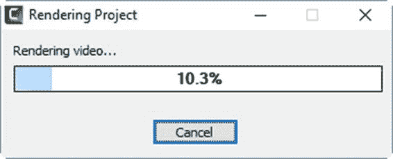
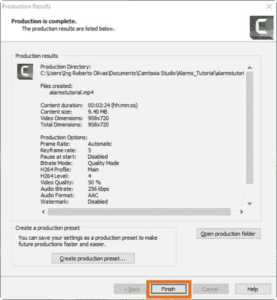

# 九、产出视频

如果没有最终产品:视频，编辑工作中的所有努力都将毫无用处。Camtasia 可以制作 MP4 格式的视频。它还允许我们在 YouTube、Vimeo、Google Drive 或 TechSmith 的 Screencast.com 服务上分享我们的视频。

要开始视频制作，请在剪辑库中单击**制作并共享**。

图 77:剪辑库中的制作和共享按钮

将出现下图所示的对话框。

图 78:卡姆塔西亚工作室制作向导

这是卡姆塔西亚工作室制作向导，它将帮助我们创建我们的视频。如图 78 所示，对话框中的组合框允许我们选择要制作的视频类型。此外，所选选项的视频规格显示在组合框下方。

如果我们希望更改视频类型，我们应该单击组合框的下拉按钮。将显示所有可用选项的列表。

图 79:视频格式选项

出于本练习的目的，我们将选择**仅高清 MP4**选项。卡姆塔西亚工作室制作向导如下图所示。

图 80:“仅高清 MP4”视频格式已选择

点击**下一步**继续。现在，出现以下对话框。

图 81:功能兼容性警告对话框

这是一个功能兼容性对话框，显示该对话框是因为我们使用了标记，以便为视频录制脚本中描述的每个步骤添加引用。在这种情况下，Camtasia 告诉我们，我们选择的文件格式不支持这些标记。既然这个问题没有问题，我们应该点击**确定**继续。

现在，制作向导将询问保存视频的目的地。

图 82:视频目标对话框

如图 82 所示，生产向导将项目文件的名称分配给视频文件。此外，它使用项目的文件夹作为视频的目标文件夹。**将生成的文件组织成子文件夹**选项指示生产向导为生成的文件创建子文件夹。默认情况下，这是选中的。

最后，有两个默认选中的后期制作选项:

*   **显示制作结果**:在完成视频制作后，告诉制作向导显示一个对话框，显示制作过程的结果。
*   **制作完成后播放视频**:告诉制作向导启动默认的视频播放应用，以便在刚刚完成视频制作后播放制作好的视频。

点击**完成**开始视频制作，出现如下对话框。

图 83:渲染项目对话框

该对话框将显示生产过程的进度。当过程结束时，对话框将关闭，并显示“生产结果”对话框(如果选中了“显示生产结果”选项)。此外，视频将使用默认的视频播放器应用程序播放(如果选中了“制作后播放视频”选项)。

如果显示生产结果对话框，我们应该点击**完成**关闭对话框，完成生产过程。下图显示了“生产结果”对话框。

图 84:生产结果对话框

现在我们可以进入项目的文件夹，以便找到制作的视频。视频保存在以项目文件命名的子文件夹中(没有。camproj 扩展)。

Camtasia 可以制作 MP4 格式的视频，并允许我们使用 YouTube、Vimeo、Google Drive 或 TechSmith 的 Screencast.com 服务共享我们的视频。我们应该点击**制作并在剪辑库中共享**，以便开始视频制作。然后显示 Camtasia 工作室制作向导，帮助我们制作视频。将显示一个组合框，以选择要制作的视频类型。出于本书的目的，我们选择了**高清 MP4 仅**视频格式。

由于我们在项目中使用了标记，因此显示了功能兼容性对话框。这些标记为视频录制脚本中描述的每个步骤添加了参考。在这种情况下，Camtasia 告诉我们，我们选择的文件格式无法支持这些标记。由于这个问题没有问题，我们点击**确定**继续生产过程。

制作向导将项目文件的名称分配给视频文件。此外，它使用项目的文件夹作为视频的目标文件夹。**的复选框选项将生成的文件组织成子文件夹**指示生产向导为生成的文件创建子文件夹。

最后，我们保留了生产向导提供的两个后期制作选项:**显示生产结果**选项，以便在完成后显示带有过程结果的对话框；以及**制作后播放视频**选项，以便在刚完成制作后播放制作好的视频。

最后，制作的视频保存在名为项目文件的子文件夹中(没有。camproj 扩展)。