# 一、入门

Microsoft CNTK (Cognitive Toolkit，前身为 Computational Network Toolkit)是一个开源代码框架，它使您能够创建深度学习系统，例如前馈神经网络时间序列预测系统和卷积神经网络图像分类器。CNTK 1.0 版本于 2016 年发布。2.0 版本于 2017 年 6 月发布，是对 1.0 版本的重大改写。

本电子书基于 2017 年末发布的 CNTK 版本。因为 CNTK 还在积极开发中，等你看完这本电子书的时候，最新的版本很可能已经不一样了。但是，任何更改都可能相对较小，并且主要由附加功能组成。换句话说，这里展示的代码应该可以与任何 CNTK 2.x 版本一起工作。

为了获得最佳性能，CNTK 框架函数是用 C++编写的。虽然可以使用 C++程序调用 CNTK 函数，但最常见的方法是使用 Python 程序调用 CNTK 函数。CNTK 第 1 版使用了专有的脚本语言 BrainScript，第 2 版仍然支持该语言。

CNTK v2 在 Windows (8.1、10、Server 2012 R2 及更高版本)和 Linux 系统上均可运行，但不能直接在 Mac 系统上运行。图 1-1 中的截图显示了一个简化的 CNTK 会话。请注意，程序只是一个普通的 Python 脚本， **iris_fnn.py** ，它将 CNTK 作为一个 Python 包引用，CNTK-Python 程序在一个普通的 shell 中运行。

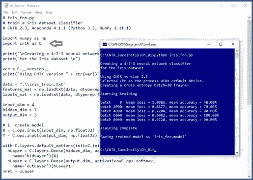

图 1-1:示例会话

还有其他几个深度学习框架。微软 CNTK 与谷歌 TensorFlow 最为相似。在我看来，CNTK 比 TensorFlow 更容易编程；然而，所有深度学习框架都有一条相当陡峭的学习曲线。CNTK 和 TensorFlow 都可以通过 Keras 包装框架访问，这个主题不在本电子书的讨论范围内。

这本电子书假设你有中级(或更好)的 C 族语言编程技能，但不假设你对 CNTK 有任何了解。聊够了，我们开始吧。

## 安装碳纳米管

我认识的每一个程序员，包括我在内，都是通过启动并运行一个示例程序，然后通过做出改变来进行实验，从而学会如何用一种新的语言或框架进行编程。所以如果你想学习 CNTK，第一步就是安装。

安装 CNTK 与许多安装有点不同。你不要直接安装 CNTK。相反，您将 CNTK 作为 Python 的附加包安装。您首先安装一个 Python 发行版，它包含基本的 Python 语言解释器以及 CNTK 所需的几个附加包，尤其是 NumPy 和 SciPy 包。然后，你安装 CNTK 作为一个额外的包。

可以分别安装 Python、NumPy 和 SciPy。但是相反，我强烈建议您安装 Python 的 Anaconda 发行版，它拥有成功安装和运行 CNTK 所需的一切。在开始安装过程之前，您必须仔细确定 CNTK 和 Anaconda 的兼容版本。我看到的几乎所有安装失败都是由于 Anaconda 和 CNTK 版本不兼容造成的。

第一步是确定要使用哪个版本的 CNTK。一般来说，您会希望安装最新版本的 CNTK。不过这款电子书是基于 CNTK 版本，所以你可能要安装 v2.3 而不是最新版本。有几种不同类型的 CNTK 安装可供选择。在这里可以找到几种安装类型[的链接，如图 1-2 所示。](https://docs.microsoft.com/en-us/cognitive-toolkit/setup-cntk-on-your-machine)

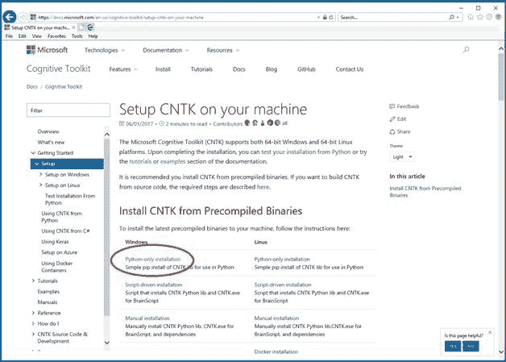

图 1-2:选择仅 Python 链接

我建议您选择 **Python 专用安装**选项。单击该链接后，您将被重定向到列出当前支持的 Python 版本的页面，如图 1-3 所示。

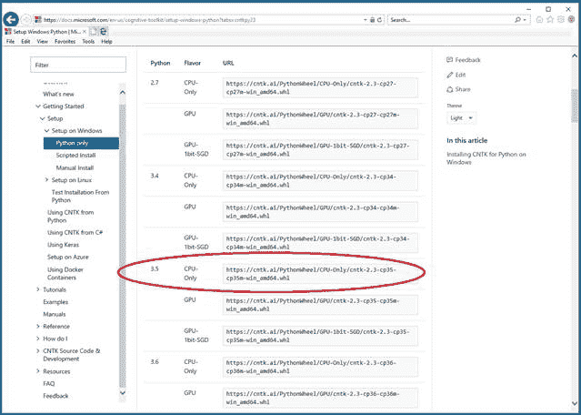

图 1-3:支持的 Python 版本

请注意，Python 的每个版本都有三种不同风格的 CNTK:仅 CPU、GPU 和 GPU-1 位 SGD。每种口味都有相关的。whl 文件(发音为“轮子”)。如果你是 Python 新手，你可以想到一个 Python。文件有点类似于窗口。msi 安装程序文件。你可能想复制。whl URI 字符串，因为安装 Python 后您将需要它。

CNTK 同时支持 CPU 处理和 GPU 处理。如果你的机器没有安装图形处理器，那么你应该使用只有中央处理器的版本。此时，您的主要决定是选择您将使用的 Python 版本。在图 1-3 中，选项是 2.7、3.4、3.5 和 3.6。

在继续之前，您应该检查您的机器，以确定您是否已经安装了 Python。最简单的情况是，如果您的机器没有安装现有的 Python，那么您可以继续。但是，如果您已经安装了一个或多个 Python 版本，您应该卸载它们(如果可行)或者记录它们的安装位置(如果卸载它们不可行)。安装了多个 Python 实例后，您可能会在某个时候遇到 Python 版本控制问题。

在写这本书的时候，Python 版本非常稳定，所以我决定使用它，而不是更新的版本 3.6。一旦您决定了您的 Python 版本，您需要找到包含该版本 Python 的存档 Anaconda 发行版。

不要*安装最新版本的 Anaconda。如果您向下滚动安装信息页面，您将找到要使用的 Anaconda 版本。对于 Python 3.5，您需要 Anacoinda3 4.1.1。要么在网上搜索“存档 Anaconda 安装”，要么直接去[这里](https://repo.continuum.io/archive/)。*

在该页面上，您将看到许多不同的 Anaconda 发行版。这里要小心；即使我已经为 CNTK 安装和卸载了 Anaconda 几十次，但我还是几次笨拙地选择了 Anaconda 的正确版本。

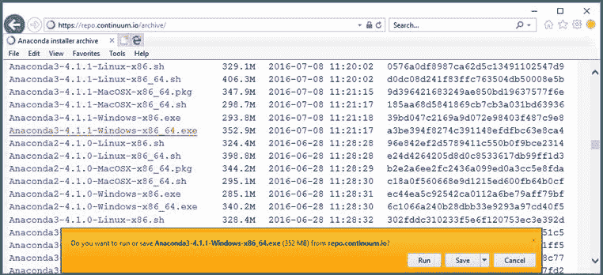

图 1-4:找到正确的 Anaconda 存档安装链接

因为我用的是 64 位的 Windows 机，想要 Python 3 有 Anaconda 4 . 1 . 1 版本，所以点击**Anaconda 3-4 . 1 . 1-Windows-x86 _ 64 . exe**链接。这将启动一个自解压安装程序。可以点击**运行**。

综上所述，此时您已经确定了要使用哪个版本的 CNTK(本例中仅 2.3 CPU)，然后确定了要使用哪个版本的 Anaconda(本例中为 Anaconda3 4.1.1)，现在开始 Anaconda 安装过程。

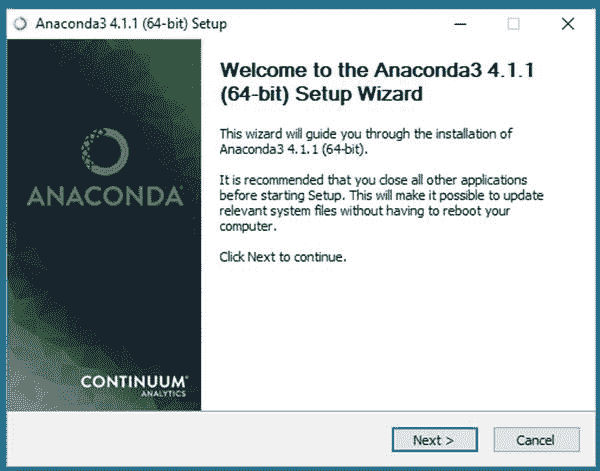

图 1-5:蟒蛇安装欢迎

点击**运行**几秒后，会出现 Anaconda 安装欢迎窗口，如图 1-5 所示。点击**下一步**。

您将看到 Anaconda 许可协议窗口，如图 1-6 所示。点击**我同意**。

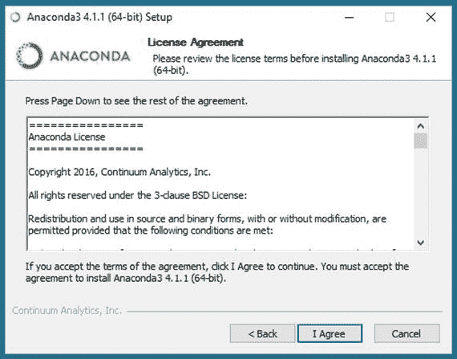

图 1-6:阿纳康达许可协议

您将看到“选择安装类型”窗口，如图 1-7 所示。我强烈建议你保留默认的**只有我(推荐)**选项。如果您的机器上有多个用户帐户，这将减少 Python 版本冲突的可能性。点击**下一步**。

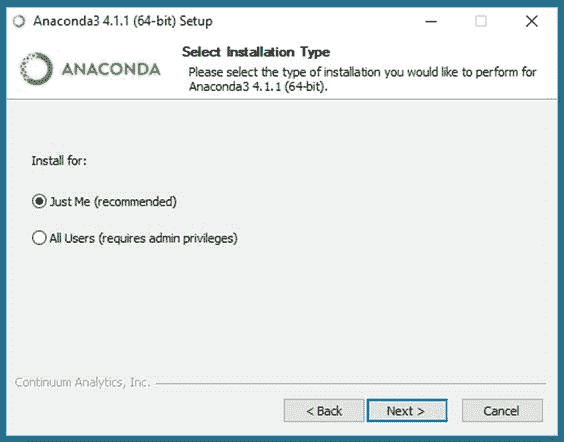

图 1-7:蟒蛇安装类型

接下来，您将看到“选择安装位置”信息。如果可能的话，您应该接受默认位置(**C:\ users \<user>\ AppData \ Local \ Continuum \ anaconda 3**)因为一些非 CNTK 包可能会采用这个位置。点击**下一步**。

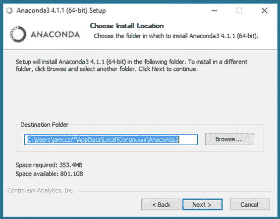

图 1-8:默认的蟒蛇安装位置

您将看到“高级安装选项”窗口。您应该接受这两个默认选项。第一个将 Anaconda 添加到您的系统路径变量中。第二个选项使 Anaconda 成为您的默认 Python 版本。如果您有一个现有的 Python 安装，这通常会覆盖现有的实例，您可能想要安装一个 Python 版本选择器程序。点击**安装**。

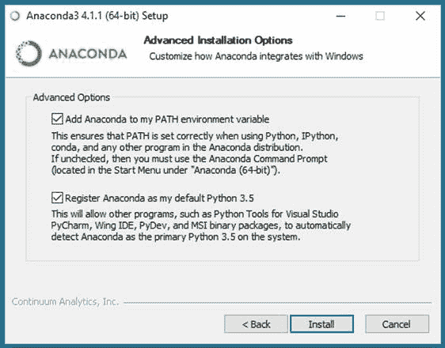

图 1-9:安装路径和默认 Python 信息

安装 Anaconda 大约需要 10 到 15 分钟。将没有可供您考虑的选项，因此您不需要参加安装。但是，您可能希望观察进度条，看看安装了哪些包，比如 NumPy，如图 1-10 所示。

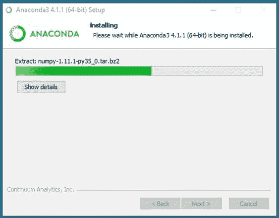

图 1-10:蟒蛇安装进度

当安装成功完成时，您将看到“安装完成”窗口。点击**下一步**，如图 1-11 所示。

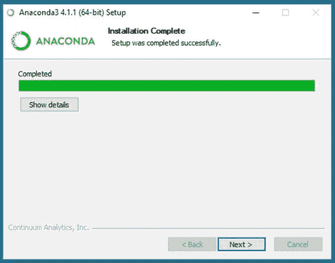

图 1-11:成功的蟒蛇安装窗口

您将看到最后一个窗口，可以选择从维护 Anaconda 发行版的 Continuum 公司查看营销信息。在图 1-12 中，我取消了那个选项，点击**完成**。总而言之，Anaconda 安装是一个自解压可执行文件，具有类似向导的过程。您可以接受所有默认选项。

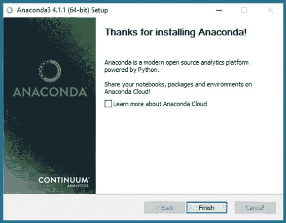

图 1-12:最后的蟒蛇安装窗口

Anaconda 安装完成后，您可能需要查看安装文件和目录结构，如图 1-13 所示。请注意有名为 **Lib** 、 **Library** 和 **libs** 的目录。图 1-13 所示文件的正下方是 python.exe 主执行引擎。


图 1-13:蟒蛇的安装位置

在安装 CNTK 附加包之前，您应该验证您的 Anaconda Python 发行版是否正常工作。打开命令外壳，输入`python --version`(带两个连字符)。Python 应该会响应，如图 1-14 所示。您可能想通过发出命令`python`后跟一个`print(‘hello’)`语句来测试 Python 解释器。

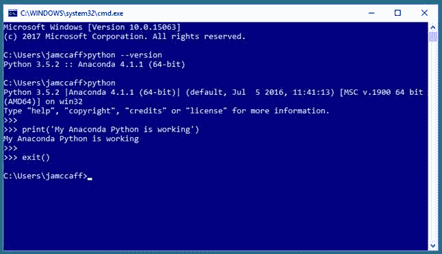

图 1-14:验证蟒蛇的安装

在安装了 Anaconda 之后，为 Python 安装 CNTK 包变得非常容易。从命令外壳中，输入`pip install *uri-to-whl-file*`，其中 URI 是。whl 文件，如图 1-3 所示。对于我的安装，那 URI 就是**https://cntk . ai/python wheel/CPU-Only/cntk-2.3-cp35-cp35m-win _ amd64 . whl**。请注意 URI 对 CNTK 2.3 的引用。URI 中的“35”表示 Python 3.5。

请注意，如果您的机器没有 GPU，无论如何您都可以安装 GPU 版本的 CNTK，因为 GPU 版本也有 CPU 代码。但是，我建议只使用 CPU。

**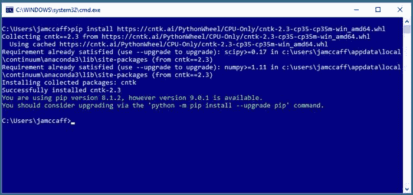**

图 1-15:使用 pip 安装 CNTK 包

CNTK 将很快安装，您应该会看到一条成功消息，如图 1-15 所示。

CNTK 作为 Python 包安装后，您可能需要检查其文件和目录结构，在**C:\ Users \<user>\ AppData \ Local \ Continuum \ anaconda 3 \ Lib \ site-packages \ CNTK**，如图 1-16 所示。

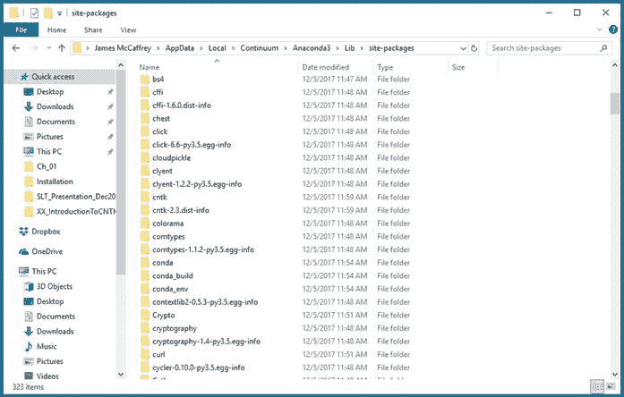

图 1-16:碳纳米管封装位置

您应该验证 CNTK 是否已正确安装。在命令外壳中，通过输入`python`启动 Python 解释器。然后依次进入`import cntk as C`和`print(C.__version__)`，如图 1-17 所示。(注意命令中`version`前后的两个下划线)。

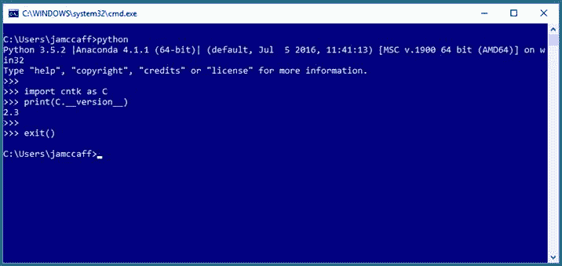

图 1-17:验证 CNTK 安装

如果解释器用你的 CNTK 版本作出响应，你可以确定 CNTK 已经正确安装在你的机器上，你已经准备好开始用 CNTK 框架编写程序了。

## 编辑和运行 CNTK 程序

因为 CNTK 程序是专门的 Python 程序，所以您可以使用任何 Python 编辑环境。如果您对 Python 比较陌生，选择 Python 编辑器或 IDE(集成开发环境)可能是一项令人困惑的任务，因为有几十种编辑器和 Python IDEs 可供选择。

我经常使用普通的旧记事本，或者有时使用功能稍强的记事本++。这两者都没有给你内置的调试功能，所以调试意味着你必须插入`print()`语句来检查变量和对象的值。而且没有集成的运行命令，所以您可以从 shell 运行程序。

代码清单 1-1:检查 CNTK 版本

```py
  #
  test_cntk.py
  import sys
  import numpy as np
  import cntk as C

  py_ver
  = sys.version
  cntk_ver
  = C.__version__
  print("Using Python version " + str(py_ver))
  print("Using CNTK version " + str(cntk_ver))

```

例如，启动记事本文本编辑器(或任何其他编辑器)，复制并粘贴代码清单 1-1 中的代码。将文件保存为 **test_cntk.py** (注意不要添加额外的。txt 扩展名)。打开一个命令外壳，导航到保存你的 Python 文件的目录，输入`python test_cntk.py`执行，如图 1-18 所示。


图 1-18:使用记事本和命令外壳

我的许多同事使用 Visual Studio Code (VS Code)，这是一个免费的、开源的、跨平台的、多语言的 IDE。安装 VS 代码既快速又简单，然后添加 Python 支持只需点击几下鼠标。可以在这里下载 VS 代码[。](https://code.visualstudio.com/download)

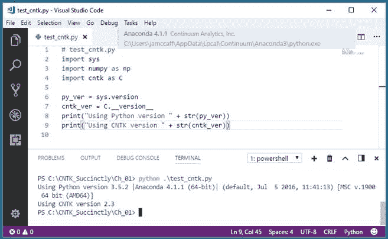

图 1-19:使用 Visual Studio 代码

图 1-19 显示了一个使用 VS 代码的例子。使用 VS 代码有很多优点，包括智能感知自动完成、漂亮的格式化和集成调试。然而，与记事本不同的是，VS Code 确实有一条非平凡的学习曲线需要你去处理。请参见此处的教程[了解更多信息。](https://code.visualstudio.com/docs/python/python-tutorial)

编辑和运行 CNTK 程序的另一个选择是重量级的 Visual Studio (VS) IDE。VS 的默认配置不支持编辑 Python 程序，但是可以安装 Visual Studio 外接程序的 Python Tools。安装插件后，您将获得完整的 Python 语言支持，如图 1-20 和 1-21 所示。

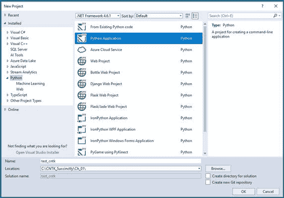

图 1-20:使用 Visual Studio 集成开发环境创建一个 Python 项目

使用 Visual Studio 的一个优点是，您可以获得对各种附加功能的支持，例如到 SQL Server 数据库和 Azure 数据源的数据连接器。Visual Studio 的主要缺点是学习曲线非常陡峭。

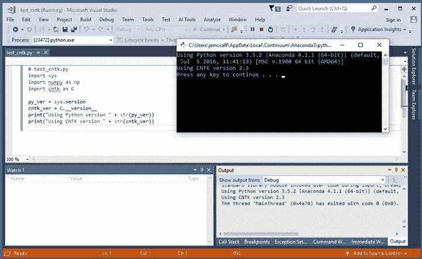

图 1-21:从 Visual Studio 集成开发环境运行 Python 程序

如果您熟悉任何 Python 编辑器或开发环境，我的建议是继续使用该系统。如果你对编程比较陌生，我的建议是从简单的记事本开始，因为它本质上没有学习曲线。如果你是一个有经验的开发人员，但是对 Python 不熟悉，我的建议是尝试 VS Code。

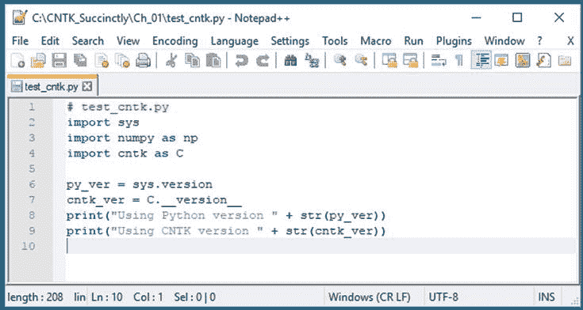

图 1-22:使用记事本++编辑器

## 卸载 CNTK

CNTK 和 Anaconda Python 有快速、简单、可靠的卸载程序。卸载 CNTK，只需要启动一个命令 shell，发出命令`pip uninstall cntk.` 就这么简单。CNTK 包将从您的 Python 系统中移除，如图 1-23 所示(根据大小稍作编辑)。要卸载 Python，在 Windows 上可以使用控制面板的**程序和功能**部分，如图 1-24 所示。

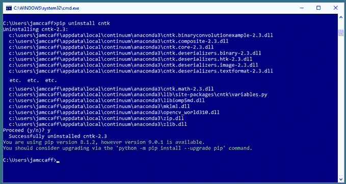

图 1-23:卸载 CNTK

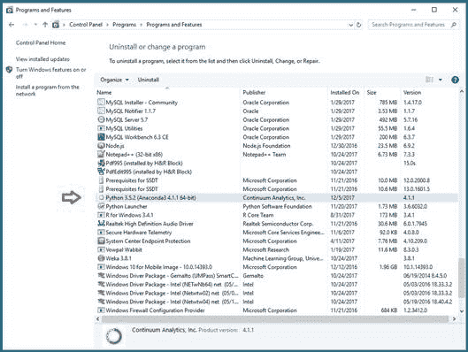

图 1-24:卸载蟒蛇

如果你成为 CNTK 的普通用户，你最终会想要升级你的版本。虽然 pip 实用程序支持升级命令，但我建议您删除当前版本，然后安装新版本。