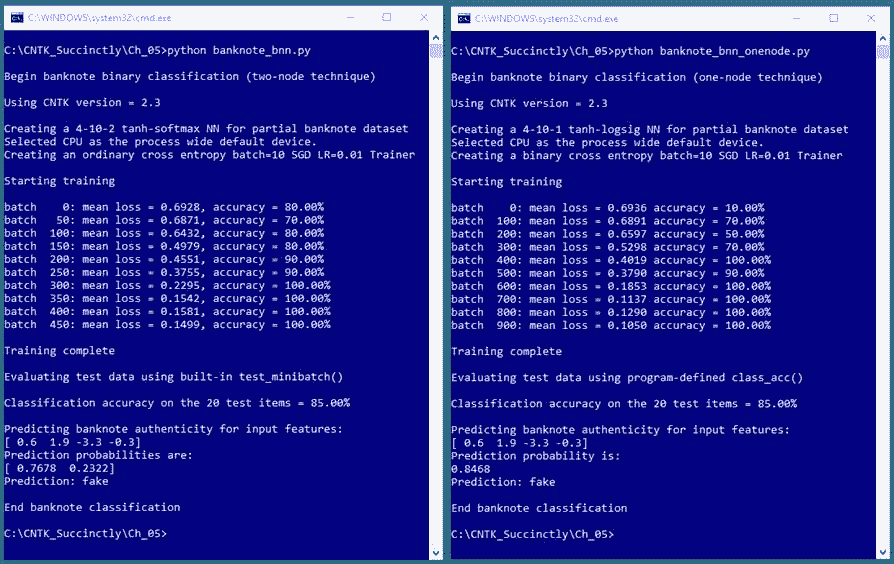
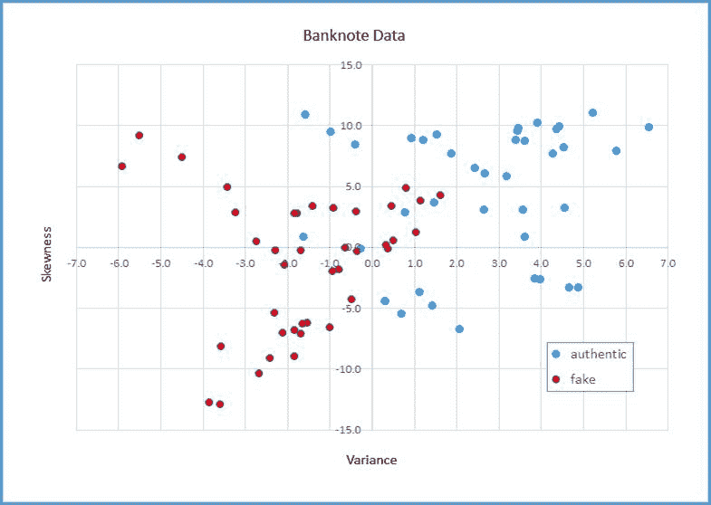

# 五、神经二分类

本章解释如何使用神经网络执行二进制分类(要预测的变量可以取两个可能值中的一个)。神经网络二进制分类明显比逻辑回归二进制分类更强大，但代价是复杂性适度增加。



图 5-1:钞票数据集分类

如果你是机器学习的新手，你的第一个想法可能是这样的，“使用神经网络的二进制分类与多类分类没有什么不同——只有两个输出节点，而不是三个或更多。”你基本上是对的。然而，图 5-1 中的两个并排截图表明，神经网络二进制分类有两种不同的技术。

图 5-1 中所示的两个程序处理相同的原始数据。目标是创建一个分类模型，基于四个预测变量:方差、偏斜度、峰度和熵来预测钞票(比如一美元或一欧元)是伪造的还是真实的。左边显示的程序基本上使用了我们在第四章中使用的技术，将鸢尾花分为*濑户花*、*云芝*或*弗吉尼亚花*。对于神经网络二进制分类，这被称为双节点技术。右边显示的程序使用了一种明显不同的方法，称为单节点技术。

让我开门见山地说，在我看来，双节点技术比单节点技术更好。但是，由于历史原因，神经网络单节点技术更为常见。您几乎肯定会遇到单节点技术，并且应该了解它是如何工作的。

回想一下，虹膜数据被编码为 *setosa* = (1，0，0)*云芝* = (0，1，0)*弗吉尼亚* = (0，0，1)。对于双节点技术，钞票被编码为伪造= (1，0)，真实= (0，1)。经过训练，两节点模型馈入输入(0.6，1.9，-3.3，-0.3)，预测概率为(0.7678，0.2322)。这映射到(1，0)，因此预测是伪造的。简而言之，神经网络两节点二分类技术本质上与多类神经网络分类相同。

图 5-1 右侧所示的程序使用了只有一个输出节点的神经网络。正如您将看到的，这需要改变输出层激活函数，改变训练误差函数，以及需要一个程序定义的分类精度函数。对于单节点技术，真实性编码为 0，伪造性编码为 1。在训练之后，单节点模型被馈送相同的输入(0.6，1.9，-3.3，-0.3)。单输出概率为 0.8468，映射为 1，所以预测为伪造/假冒。

这两种技术给出了相似的质量预测模型——对测试数据 85%的分类准确率。请注意，在训练过程中，两种技术具有大致相同的交叉熵误差，但是单节点技术需要两倍于双节点技术的训练迭代，1000 对 500。然而，单节点技术每次迭代只更新一半的隐藏到输出节点权重，因此迭代次数的增加被每次迭代更快的训练所抵消。底线是这两种技术都没有显著的技术优势。我更喜欢双节点技术，因为在我看来它稍微简单一些。

## 准备钞票训练和测试数据

原始钞票数据如下所示:

3.6216，8.6661，-2.8073，-0.44699，0
4.5459，8.1674，-2.4586，-1.4621，0
。。。
-1.3971，3.3191，-1.3927，-1.9948，1
0.39012，-0.14279，-0.031994，0.35084，1

你可以在这里找到这个数据集[。整个数据集有 1，372 个项目。为了简单起见，我只选择了前 50 件真品(伪造类= 0)和前 50 件赝品(伪造类= 1)。我编写了一个简短的助手程序，将原始数据转换为双节点 CNTK 格式，如下所示:](https://archive.ics.uci.edu/ml/datasets/banknote+authentication)

| stats 3.62160000 8.66610000-2.80730000-0.44699000 |伪造 0 1 |#正品
| stats 4.54590000 8.16740000-2.45860000-1.46210000 |伪造 0 1 |#正品
。。。
|统计-1.39710000 3.31910000-1.39270000-1.99480000 |伪造 1 0 |#伪造
|统计 0.39012000-0.14279000-0.03199400 |伪造 1 0 |#伪造

帮助程序的代码如代码清单 5-1 所示。因为只有 100 行数据，所以助手程序使用`print()`向运行它的外壳发出输出。对于较大的数据集，您需要打开一个文本文件进行写入，并使用`write()`功能。

我刮掉 shell 输出，将 80 个项目(40 个正品，40 个伪造)复制到一个训练文件中，将 20 个项目(10 个正品，10 个伪造)复制到一个测试文件中。CNTK 格式的数据可以在本电子书的附录中找到。

代码清单 5-1:从原始数据创建 CNTK 格式数据的助手

```py
  #
  make_banknote_data.py
  #
  input: raw banknote_100.txt
  #
  output: banknote data in CNTK two-node format to screen 
  #
  for scraping (manually divide into train/test)

  fin
  = open(".\\banknote_100_raw.txt", "r")

  for line in
  fin:

  line = line.strip()

  tokens = line.split(",")
    if tokens[4] == "0":

  print("|stats
  %12.8f %12.8f %12.8f %12.8f |forgery 0 1 |# authentic" % \

  (float(tokens[0]), float(tokens[1]), float(tokens[2]), float(tokens[3])) )
    else:

  print("|stats
  %12.8f %12.8f %12.8f %12.8f |forgery 1 0 |# fake" % \

  (float(tokens[0]), float(tokens[1]), float(tokens[2]), float(tokens[3])) ) 

  fin.close()

```

因为有四个预测因子/特征，所以用图表表示数据是不可行的。然而，您可以通过检查 80 项训练数据的二维图(仅基于方差和偏斜度)来大致了解数据的结构，如图 5-2 所示。数据不是线性可分的，所以逻辑回归不能很好地工作。

## 神经网络二节点二分类

代码清单 5-2 展示了产生图 5-1 左侧所示输出的程序。如果你浏览代码清单，你会发现两节点二进制分类和三节点(或更多)多类分类之间几乎没有区别。在程序定义的`create_reader()`功能中，`field`属性被更改为对应于训练和测试数据文件中的`stats`和`forgery`标签:

x_strm = C.io.StreamDef(字段='stats '，shape=input_dim，is_sparse=False)
y _ strm = c . io . stream def(字段= '伪造'，shape=output_dim，is _ sparse = False)

对于双节点技术，神经网络输出维数变为 2:

input _ dim = 4
hidden _ dim = 10
output _ dim = 2

像往常一样，确定要使用的隐藏节点的数量是一个反复试验的问题。在多类分类中，您使用`cross_entropy_with_softmax()`误差度量，因为 CNTK 没有非 softmax 版本，所以您不在输出层使用激活:

带 c . layers . default _ options(init = c . initializer . uniform(scale = 0.01，seed = 1)):
hllayer = c . layers . density(hidden _ dim，activation=C.ops.tanh，
name = ' hidLayer ')(X)
oLayer = c . layers . density(output _ dim，activation=None，
name = ' outLayer ')(hllayer)
nnet = oLayer # train 这个
模型= C.ops.softmax(nnet

请注意，因为 Python 是通过引用而不是通过值来赋值的，所以当您训练`nnet`对象时，`model`对象也会被更新。



图 5-2 部分钞票数据

与多类分类一样，您可以设置对象来监控交叉熵错误和分类错误/准确性:

tr _ loss = c . cross _ entropy _ with _ soft max(nnet，Y)
tr _ clas = c . classing _ error(nnet，Y)

这一点很重要，因为正如您将很快看到的，当使用单节点技术时，您不能使用内置的分类错误函数。

代码清单 5-2:双节点技术二进制分类

```py
  #
  banknote_bnn.py
  #
  CNTK 2.3 with Anaconda 4.1.1 (Python 3.5, NumPy 1.11.1)

  #
  Use a one-hidden layer simple NN with 10 hidden nodes
  #
  banknote_train_cntk.txt - 80 items (40 authentic, 40 fake) 
  #
  banknote_test_cntk.txt - 20 items (10 authentic, 10 fake)

  import numpy as np
  import cntk as C

  def create_reader(path, input_dim, output_dim, rnd_order, sweeps):
    # rnd_order -> usually True for
  training
    # sweeps -> usually
  C.io.INFINITELY_REPEAT for training OR 1 for eval

  x_strm = C.io.StreamDef(field='stats',
  shape=input_dim, is_sparse=False)

  y_strm = C.io.StreamDef(field='forgery',
  shape=output_dim, is_sparse=False)

  streams = C.io.StreamDefs(x_src=x_strm, y_src=y_strm)

  deserial = C.io.CTFDeserializer(path,
  streams)

  mb_src = C.io.MinibatchSource(deserial, randomize=rnd_order, max_sweeps=sweeps)
    return mb_src

  #
  ==================================================================================

  def main():

  print("\nBegin
  banknote binary classification (two-node technique) \n")

  print("Using
  CNTK version = " +
  str(C.__version__)
  + "\n")

  input_dim = 4

  hidden_dim = 10

  output_dim = 2

  train_file = ".\\Data\\banknote_train_cntk.txt"

  test_file = ".\\Data\\banknote_test_cntk.txt"

    # two-node data files:
    # |stats   4.17110   8.72200 
  -3.02240  -0.59699 |forgery 0 1 |# authentic
    # |stats  -0.20620   9.22070 
  -3.70440  -6.81030 |forgery 0 1 |# authentic
    # . . .
    # |stats   0.60050   1.93270 
  -3.28880  -0.32415 |forgery 1 0 |# fake
    # |stats   0.91315   3.33770 
  -4.05570  -1.67410 |forgery 1 0 |# fake

    # 1\. create network

  X = C.ops.input_variable(input_dim, np.float32)

  Y = C.ops.input_variable(output_dim, np.float32)

  print("Creating
  a 4-10-2 tanh-softmax NN for partial banknote dataset ") 
    with C.layers.default_options(init=C.initializer.uniform(scale=0.01, seed=1)):

  hLayer = C.layers.Dense(hidden_dim, activation=C.ops.tanh,

  name='hidLayer')(X)  

  oLayer = C.layers.Dense(output_dim, activation=None,

  name='outLayer')(hLayer)

  nnet = oLayer

  model = C.ops.softmax(nnet)

    # 2\. create learner and trainer

  print("Creating
  an ordinary cross entropy batch=10 SGD LR=0.01 Trainer ")

  tr_loss = C.cross_entropy_with_softmax(nnet, Y)  # not model!

  tr_clas = C.classification_error(nnet, Y)

  max_iter = 500 

  batch_size = 10 

  learn_rate = 0.01 

  learner = C.sgd(nnet.parameters, learn_rate)

  trainer = C.Trainer(nnet, (tr_loss, tr_clas), [learner])

    # 3\. create reader for train data

  rdr = create_reader(train_file, input_dim, output_dim,

  rnd_order=True, sweeps=C.io.INFINITELY_REPEAT)

  banknote_input_map = {

  X : rdr.streams.x_src,

  Y : rdr.streams.y_src

  }

    # 4\. train

  print("\nStarting
  training \n")
    for i in range(0, max_iter):

  curr_batch = rdr.next_minibatch(batch_size,
  input_map=banknote_input_map)

  trainer.train_minibatch(curr_batch)

  if i % 50 == 0:

  mcee = trainer.previous_minibatch_loss_average

  macc = (1.0 - trainer.previous_minibatch_evaluation_average) * 100

  print("batch
  %4d: mean loss = %0.4f, accuracy = %0.2f%% " \

  % (i, mcee, macc))

  print("\nTraining
  complete")

    # 5\. evaluate model using test data

  print("\nEvaluating
  test data using built-in test_minibatch() \n")

  rdr = create_reader(test_file, input_dim, output_dim,

  rnd_order=False, sweeps=1)

  banknote_input_map = {

  X : rdr.streams.x_src,

  Y : rdr.streams.y_src

  }

  num_test = 20

  all_test = rdr.next_minibatch(num_test,
  input_map=banknote_input_map) 

  acc = (1.0 - trainer.test_minibatch(all_test)) * 100

  print("Classification
  accuracy on the 20 test items = %0.2f%%" % acc)

    # (could save model here)

    # 6\. use trained model to make
  prediction
    np.set_printoptions(precision = 1, suppress=True)

  unknown = np.array([[0.6, 1.9, -3.3, -0.3]],
  dtype=np.float32) # likely 1 0 = fake

  print("\nPredicting
  banknote authenticity for input features: ")

  print(unknown[0])

  pred_prob = model.eval({X: unknown})
    np.set_printoptions(precision = 4, suppress=True)

  print("Prediction
  probabilities are: ")

  print(pred_prob[0])
    if pred_prob[0,0] < pred_prob[0,1]: # maps to (0,1)

  print("Prediction:
  authentic")
    else:                               # maps to (1,0)

  print("Prediction:
  fake")

  print("\nEnd
  banknote classification ")

  #
  ==================================================================================

  if __name__ == "__main__":

  main()

```

训练两节点技术二进制分类器神经网络与训练多类网络完全相同。当使用训练好的模型进行预测时，您必须将两个预测概率映射到一个预测类:

未知= np.array([[0.6，1.9，-3.3，-0.3]]，dtype = NP . float 32)
pred _ prob = model . eval({ X:未知})

print("预测概率为:")
print(pred_prob[0])
如果 pred_prob[0，0] < pred_prob[0，1]: #映射到(0，1)
print("预测:真实")
else: #映射到(1，0)
print("预测:假")

调用`eval()`函数的返回结果是一个数组数组，如[[ 0.7678，0.2322 ]]。通过选择索引[0]，您将获得一个具有两个预测概率的单个数组，如[0.7678，0.2322]。如果两个概率中的第一个小于第二个，则预测映射到编码的类(0，1)；否则，预测映射到编码为(1，0)的类。

因为输出是概率，并且只有两个值，所以您也可以映射一个预测类，如下所示:

如果 pred_prob[0，0] < 0.5: # maps to (0,1)
打印(“预测:真实”)
否则:#映射到(1，0)
打印(“预测:假”)

当使用双节点神经网络二进制分类时，您可以将任何一个类编码为(0，1)，但这取决于您维护编码含义——令人惊讶的是，这很容易搞砸。

## 神经网络单节点二分类

通过修改训练和测试数据文件，将(0，1)替换为 0，将(1，0)替换为 1，我准备了单节点版本的钞票分类技术:

| stats 3.62160000 8.66610000-2.80730000-0.44699000 |伪造 0 |#正品
| stats 4.54590000 8.16740000-2.45860000-1.46210000 |伪造 0 |#正品
。。。
|统计-1.39710000 3.31910000-1.39270000-1.99480000 |伪造 1 |#伪造
|统计 0.39012000-0.14279000-0.03199400 |伪造 1 |#伪造

因为标签名`stats`和`forgery`没有变化，所以不需要修改程序定义的`create_reader()`功能。代码清单 5-3 给出了生成图 5-1 右侧所示输出的完整程序。

代码清单 5-3:单节点二进制分类技术

```py
  # banknote_bnn_onenode.py
  #
  CNTK 2.3 with Anaconda 4.1.1 (Python 3.5, NumPy 1.11.1)

  #
  Use a one-hidden layer simple NN with 10 hidden nodes
  #
  banknote_train_cntk.txt - 80 items (40 authentic, 40 fake) 
  #
  banknote_test_cntk.txt - 20 items(10 authentic, 10 fake)

  import numpy as np
  import cntk as C

  def create_reader(path, input_dim, output_dim, rnd_order, sweeps):
    # rnd_order -> usually True for
  training
    # sweeps -> usually
  C.io.INFINITELY_REPEAT for training OR 1 for eval

  x_strm = C.io.StreamDef(field='stats',
  shape=input_dim, is_sparse=False)

  y_strm = C.io.StreamDef(field='forgery',
  shape=output_dim, is_sparse=False)

  streams = C.io.StreamDefs(x_src=x_strm, y_src=y_strm)

  deserial = C.io.CTFDeserializer(path,
  streams)

  mb_src = C.io.MinibatchSource(deserial, randomize=rnd_order, max_sweeps=sweeps)
    return mb_src

  def class_acc(mb, x_var, y_var, model):

  num_correct = 0; num_wrong = 0

  x_mat = mb[x_var].asarray()  # batch_size x 1 x features_dim

  y_mat = mb[y_var].asarray()  # batch_size x 1 x 1

    for i in range(mb[x_var].shape[0]):  # each item in the batch

  p = model.eval(x_mat[i])           # 1 x 1

  y = y_mat[i]                       # 1 x 1

  if p[0,0] < 0.5 and y[0,0] == 0.0 or p[0,0]
  >= 0.5 and y[0,0] == 1.0:

  num_correct += 1

  else:

  num_wrong += 1
    return (num_correct * 100.0) / (num_correct + num_wrong)

  #
  ==================================================================================

  def main():

  print("\nBegin
  banknote binary classification (one-node technique) \n")

  print("Using
  CNTK version = " +
  str(C.__version__)
  + "\n")

  input_dim = 4

  hidden_dim = 10

  output_dim = 1  # NOTE

  train_file = ".\\Data\\banknote_train_cntk_onenode.txt"  # NOTE: different file

  test_file = ".\\Data\\banknote_test_cntk_onenode.txt"    # NOTE

    # one-node data files:
    # |stats   4.17110   8.72200 
  -3.02240  -0.59699 |forgery 0 |# authentic
    # |stats  -0.20620   9.22070 
  -3.70440  -6.81030 |forgery 0 |# authentic
    # . . .
    # |stats   0.60050   1.93270 
  -3.28880  -0.32415 |forgery 1 |# fake
    # |stats   0.91315   3.33770 
  -4.05570  -1.67410 |forgery 1 |# fake

    # 1\. create network

  X = C.ops.input_variable(input_dim, np.float32)

  Y = C.ops.input_variable(output_dim, np.float32)

  print("Creating
  a 4-10-1 tanh-logsig NN for partial banknote dataset ") 
    with C.layers.default_options(init=C.initializer.uniform(scale=0.01, seed=1)):

  hLayer = C.layers.Dense(hidden_dim, activation=C.ops.tanh,

  name='hidLayer')(X)  

  oLayer = C.layers.Dense(output_dim, activation=C.ops.sigmoid,

  name='outLayer')(hLayer)  # NOTE: sigmoid activation

  model = oLayer  # alias

    # 2\. create learner and trainer

  print("Creating
  a binary cross entropy batch=10 SGD LR=0.01 Trainer \n")

  tr_loss = C.binary_cross_entropy(model, Y)    # NOTE: use model
    # tr_clas =
  C.classification_error(model, Y)  # NOTE: not available for one-node

  max_iter = 1000 

  batch_size = 10 

  learn_rate = 0.01 

  learner = C.sgd(model.parameters, learn_rate)  # NOTE: use model

  trainer = C.Trainer(model, (tr_loss), [learner])  # NOTE: no classification error

    # 3\. create reader for train data

  rdr = create_reader(train_file, input_dim, output_dim,

  rnd_order=True, sweeps=C.io.INFINITELY_REPEAT)

  banknote_input_map = {

  X : rdr.streams.x_src,

  Y : rdr.streams.y_src

  }

    # 4\. train

  print("Starting
  training \n")
    for i in range(0, max_iter):

  curr_batch = rdr.next_minibatch(batch_size,
  input_map=banknote_input_map)

  trainer.train_minibatch(curr_batch)

  if i % 100 == 0:

  mcee = trainer.previous_minibatch_loss_average  # built-in

  ca = class_acc(curr_batch, X, Y, model)         # program-defined

  print("batch
  %4d: mean loss = %0.4f accuracy = %0.2f%%" % (i, mcee, ca))

  print("\nTraining
  complete")

    # 5\. evaluate test data (cannot use
  trainer.test_minibatch)

  print("\nEvaluating
  test data using program-defined class_acc() \n")

  rdr = create_reader(test_file, input_dim, output_dim,

  rnd_order=False, sweeps=1)

  banknote_input_map = {

  X : rdr.streams.x_src,

  Y : rdr.streams.y_src

  }

  num_test = 20

  all_test = rdr.next_minibatch(num_test,
  input_map=banknote_input_map)

  acc = class_acc(all_test, X, Y, model)

  print("Classification
  accuracy on the 20 test items = %0.2f%%" % acc)

    # (could save model here)

    # 6\. use trained model to make
  prediction
    np.set_printoptions(precision = 1, suppress=True)

  unknown = np.array([[0.6, 1.9, -3.3, -0.3]],
  dtype=np.float32)  # likely fake

  print("\nPredicting
  banknote authenticity for input features: ")

  print(unknown[0])

  pred_prob = model.eval({X: unknown})

  print("Prediction
  probability is: ")

  print("%0.4f" % pred_prob[0,0])

    if pred_prob[0,0] < 0.5:             # prob(forgery) < 0.5

  print("Prediction:
  authentic")
    else:

  print("Prediction:
  fake")

  print("\nEnd
  banknote classification ")

  #
  ==================================================================================

  if __name__ == "__main__":

  main()

```

程序的第一个变化是增加了一个程序定义的`class_acc()`函数来计算小批量的分类精度。使用双节点分类技术时，可以使用 CNTK 内置的`classification_error()`函数，但是单节点技术不支持`classification_error()`，所以必须自己实现一个程序定义的函数。

在`main()`函数中，您将输出节点的数量更改为 1，因为您使用的是单节点技术:

input _ dim = 4
hidden _ dim = 10
output _ dim = 1 #注意:不是 2

创建神经网络时，您将输出激活从`None`更改为`sigmoid()`，并且您只需要一个用于训练和预测的神经网络对象:

带 c . layers . default _ options(init = c . initializer . uniform(scale = 0.01，seed = 1)):
hllayer = c . layers . density(hidden _ dim，activation=C.ops.tanh，
name = ' hidLayer ')(X)
oLayer = c . layers . density(output _ dim，activation=C.ops.sigmoid，
name = ' outLayer ')(hllayer)#从无更改

模型= oLayer #注:用于训练和预测

逻辑`sigmoid`激活函数将单个输出节点值缩放到范围【0.0，1.0】，可以解释为得到类 1 的概率。这意味着如果输出值小于 0.5，则您的预测为 0 类；否则，你的预测是 1 级。

对于单节点技术二进制分类技术，当你设置训练误差函数时，你使用`binary_cross_entropy()`而不是`cross_entropy_with_softmax()`，并且你丢弃`classification_error()`函数:

打印(“创建二进制交叉熵批= 10 SGD LR = 0.01 Trainer \ n)”
tr _ loss = c . binary _ cross _ entropy(model，Y) #注意:使用 model
# tr _ class = c . classion _ error(model，Y) #注意:不适用于单节点

当您有一个值介于 0.0 和 1.0 之间的单个输出节点时，将使用`binary_cross_entropy()`功能。你可以用`squared_error()`，但是`binary_cross_entropy()`更有原则。如果你用单节点技术包含然后使用`classification_error()`，你的程序会运行，但是函数会给你无意义的结果。

设置教练时，使用训练错误/损失功能，但不使用分类错误:

培训师= C .培训师(模型，(tr_loss)，[学习者]) #注:无分类错误

单节点训练代码本质上与双节点技术相同，只是您没有可用的`previous_minibatch_evaluation_average()`函数，因为没有定义`classification_error()`函数。因此，如果您想要监控分类精度(可选但推荐)，您必须调用一个程序定义的函数:

打印范围(0，max_iter)内的 I 的“开始训练\ n”)
:
curr _ batch = rdr . next _ minibatch(batch _ size，input _ map = board _ input _ map)
train _ minibatch(curr _ batch)
如果 I % 100 = = 0:
mcee = trainer . previous _ minibatch _ loss _ average #内置
ca = class_acc(curr_batch，X，Y，model)# program-model

助手函数`class_acc()`位于代码清单 5-3 的顶部。该函数接受一个要计算分类精度的小批量对象，一个保存输入值结构的`Variable`对象，一个保存已知正确输出值结构的`Variable`对象，以及一个作为被训练神经网络的`model`对象:

def class_acc(mb，x_var，y_var，model):
num _ correct = 0；num _ error = 0:
。。。

从小批量对象中拉出`x`和`y`值，如下所示:

x_mat = mb[x_var]。asar ray()# batch _ size x 1 x features _ dim
y _ mat = MB[y _ var]。asarray() #批处理大小 x 1 x 1

这段代码一点也不明显，但可以认为是样板文件。CNTK 小批量对象被实现为 Python 字典。 `X`和`Y`变量对象充当字典的键，但是字典值必须显式转换为 NumPy 数组类型。生成的数组有三个维度，其中第一个维度是小批量中训练项目的数量。

接下来，该函数遍历小批量中的每个训练项目:

对于范围内的 I(MB[x _ var]。shape[0]): #批次中的每个项目
p = model . eval(x _ mat[I])# 1 x 1
y = y _ mat[I]# 1 x 1
如果 p[0，0] < 0.5 和 y[0，0] == 0.0 或 p[0，0] > = 0.5 和 y[0，0]= = 1.0:
num _ correct+= 1
else:
num _ error+= num

使用`eval()`函数将输入值输入到模型中，计算出的`y`值返回到矩阵`p`中，该矩阵的维数为 1 1，因此概率值在`p[0,0]`中。已知的正确输出值也在 1 1 矩阵中。

单节点技术程序最后对未知钞票进行预测:

pred_prob = model.eval({X:未知})
print(“预测概率为:“)
print(“% 0.4f”% pred _ prob[0，0])
if pred_prob[0，0] < 0.5: # prob(伪造)< 0.5
print(“预测:真实”)
else:
print(“预测:伪造”)

调用`eval()`的返回值是一个 1 1 矩阵，值在 0.0 到 1.0 之间。小于 0.5 的值映射到编码为 0 的类别(在这种情况下为真钞票)，大于或等于 0.5 的值映射到编码为 1 的类别(伪造/假钞票)。

## 运动

使用双节点技术(代码清单 5-2)或单节点技术(代码清单 5-3)，为(已处理的)克利夫兰心脏病数据集创建、训练和评估神经网络二进制分类器。你可以在这里找到原始数据[。](https://archive.ics.uci.edu/ml/datasets/Heart+Disease)

共有 303 个数据项，其中 6 个缺少值。每个项目有 13 个特征，后面跟着一个从 0 到 4 的值，其中 0 表示没有心脏病，值 1 到 4 表示存在心脏病。

63.0,1.0,1.0,145.0,233.0,1.0,2.0,150.0,0.0,2.3,3.0,0.0,6.0,0

67.0,1.0,4.0,160.0,286.0,0.0,2.0,108.0,1.0,1.5,2.0,3.0,3.0,2

67.0，1.0，4.0，120.0，229.0，0.0，2.0，129.0，1.0，2.6，2.0，2.0，7.0，1
。。。

我建议去掉六个缺值的项目。由于特性的比例不同，我建议使用某种形式的归一化——除以 10 的幂效果相当好，但 min-max 效果更好。当将归一化和编码后的数据分为训练集和测试集时，我建议使用 80%的数据进行训练(约 238 项)，20%用于测试。