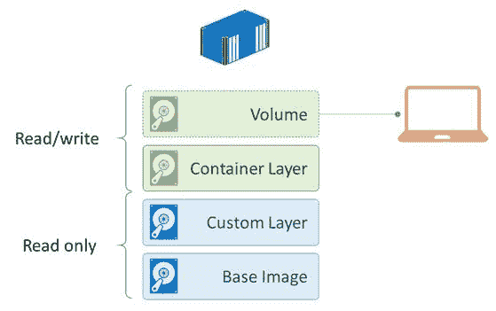

# 四、Docker 数据存储

Docker 为容器使用分层文件系统，称为联合文件系统。从映像运行容器时，进入映像的所有层都作为文件系统的只读部分装载在容器中。接下来，在容器的这个实例的顶部创建一个读写层。您可以更改容器内的数据，但这不会更改图像本身。如果您在一个正在运行的容器中创建一个文件，并从同一个映像运行第二个容器，新容器将不会有您在第一个容器中创建的文件。

这个限制保证了从一个图像运行的每个容器都以完全相同的状态开始，因为改变图像的唯一方法是显式地创建一个新的图像。在 Docker 中，如果您希望将数据保存在容器中，并在下次从该映像运行容器时使其可用，或者如果您希望与其他容器或主机共享数据，则可以使用卷来实现。

卷就像容器内的虚拟磁盘驱动器。当您向它们写入时，您实际上是在向主机磁盘(或另一个存储平台)上的一个永久位置写入，但是在容器内部，它看起来就像一个本地文件路径。卷归一个容器所有，但可以与其他容器共享。在本章中，我们将看到 Docker 卷是如何工作的，以及您可以使用它们做什么。

当您运行一个容器时，可以向其中添加卷，或者可以在 Dockerfile 中配置卷，使它们成为映像的一部分，这与通过`EXPOSE`指令明确指定可用的端口相同。`VOLUME`指令指定一个带有命名路径的数据卷，您可以将其用作容器中的文件位置。代码清单 32 显示了一个简单的 Dockerfile，它有一个数据卷，其中创建了一个文件。

代码清单 32:带有卷指令的文件

```
  FROM ubuntu:16.04
  RUN mkdir /v1 && touch /v1/file1.es.txt
  VOLUME /v1

```

|  | 注意:touch 是一个 Linux 命令，用于创建一个新的空文件或更新现有文件的时间戳。这是一个有用的工具，Windows 没有在命令外壳或 PowerShell 中。 |

我们可以构建这个图像，并从中运行一个交互式容器，以便查看当我们在容器中写入数据时会发生什么。代码清单 33 运行该图像的一个容器，它是我用标签`dockersuccinctly/ubuntu-with-volume`构建的。容器以交互方式运行(使用`-it`选项)，Docker 命令也使用`--rm`选项，一旦容器退出，该选项将移除容器。

代码清单 33:运行带有卷的容器

```
  $ docker container
  run -it --rm dockersuccinctly/ubuntu-with-volume

```

现在，我们可以在运行容器中写入一些数据。这是一个 Ubuntu 容器，我们可以写入通常的路径——`/`是文件系统根，`/v1`是我们在 Dockerfile 中指定的卷的名称。代码清单 34 显示了一个正在写入卷的新文件。

代码清单 34:在卷中创建新文件

```
  root@bf780f3e8a15:/#
  touch /v1/file2.es.txt

```

只要容器在运行，卷中的两个文件都存在，并且可以在容器中使用。代码清单 35 显示了搜索文件系统上所有`.es.txt` 文件的输出，我们可以看到有两个文件。

代码清单 35:在卷中查找文件

```
  root@bf780f3e8a15:/#
  find / -iname '*.es.txt'
  /v1/file2.es.txt
  /v1/file1.es.txt

```

现在，如果我们退出容器，数据会发生什么变化？容器被移除是因为我们用`--rm`标志运行它，但是卷中的文件位于主机上的某个位置，这就提出了一个问题:它们还能被使用吗？在代码清单 36 中，我从同一个图像运行第二个容器，并重复`find`命令。

代码清单 36:检查新容器中的卷

```
  $ docker container run -it
  --rm dockersuccinctly/ubuntu-with-volume
  root@9dd1e7d81018:/# find /
  -iname '*.es.txt'
  /v1/file1.es.txt

```

因为新容器不共享第一个容器中的卷，所以只存在映像中的原始文件。它在主机上有自己的数据卷。图像中的文件已复制到新容器的卷中，但该容器所做的任何更改都不会更改图像。将数据添加到所有容器都会看到的卷中的唯一方法是使用 Dockerfile 在映像中创建文件。

|  | 注意:VOLUME 指令在 Dockerfile 中的位置很重要。如果您尝试在 VOLUME 指令后处理卷<u xmlns:epub="http://www.idpf.org/2007/ops">中的文件，那么在构建过程中，工作将在临时容器中完成，并且因为卷是特定于容器的，所以更改不会提交给映像。相反，您应该首先在文件系统上设置数据，使其成为映像的一部分，然后暴露卷。</u> |

图 7 显示了数据卷如何与映像中的文件系统层进行比较，以及运行中的容器如何利用两者以及它自己的专用读写层。



图 7:联合文件系统中的层

将图像卷映射到主机上的某个位置时，设置会有所不同。

如果您想查看容器内的数据，通常必须附加到容器上或执行命令在容器内运行。对于数据卷，当您运行容器时，您可以从主机上的指定路径装载卷，这意味着您在主机和使用相同装载卷的任何容器之间有一个共享文件夹。

您可以使用类似于发布端口的`container run`命令中的选项来装载卷—您可以指定主机上的路径和要映射的卷的名称。代码清单 37 在我的主目录中创建一个文件夹，然后运行上一个图像中的一个容器，但是使用`-v`选项从主机上的本地目录装载`v1`容器。

代码清单 37:从主机装载卷

```
  $ mkdir ~/v1

  $ docker container run -it --rm -v ~/v1:/v1 dockersuccinctly/ubuntu-with-volume

```

这个动作会导致不同的行为。当从主机装载数据卷时，映像中的文件在启动时不会被复制到容器卷中，因为这是一个共享位置，复制文件可能会覆盖数据。因此，在这个新的容器中，卷中没有任何数据，如代码清单 38 所示。

代码清单 38:列出装入的卷的内容

```
  root@1f5bf6d15d52:/#
  ls -l /v1
  total 0

```

然而，当我们创建一个文件时，它将对容器和主机可用，因为当容器被移除时，数据将保存在一个已知的位置。在代码清单 39 中，我们向卷中添加一个新文件，并离开容器。

代码清单 39:在装入的卷中写入数据

```
  root@1f5bf6d15d52:/#
  touch /v1/mappedfile1.es.txt
  root@1f5bf6d15d52:/#
  ls -l /v1
  total 8
  -rw-r--r-- 1 root
  root 0 Aug 20 18:42 mappedfile1.es.txt
  root@1f5bf6d15d52:/#
  exit

```

现在我们在主机上有了文件，这意味着如果我们用相同的数据卷装载启动一个新容器，我们将看到第一个容器中的文件，如代码清单 40 所示。

代码清单 40:运行带有装载卷的新容器

```
  $ docker container run -it
  --rm -v ~/v1:/v1 dockersuccinctly/ubuntu-with-volume
  root@642cebc0e1be:/# ls -l
  /v1
  total 8
  -rw-r--r-- 1 root root 0 Aug 20
  18:42 mappedfile1.es.txt

```

图像中的原始文件仍未被复制，但前一个容器中的文件是可用的，即使该容器已被移除。

|  | 提示:清楚使用 Docker 卷的不同方式是很好的。集线器上的许多映像将卷用于可变数据(如配置文件)或永久状态(如数据库文件)。 [Nginx](https://hub.docker.com/_/nginx/) 映像就是一个很好的例子——它有一个为网站内容定义的卷，如果您从包含网站文件的本地目录挂载该卷，则可以直接从官方映像在 Nginx 容器中运行您的网站，而无需构建自己的映像。 |

将本地目录装载到容器中可以实现许多场景，但是如果您需要将容器移动到不同的主机，装载会受到限制—它需要的数据在新主机上将不再可用。对于这些场景，Docker 通过[卷插件](https://docs.docker.com/engine/extend/plugins/#/volume-plugins)架构支持共享存储引擎作为卷装载源。您可以选择与您的体系结构相匹配的卷插件，并从任何主机上可用的共享位置装载卷。

对于云部署，有一些插件允许您使用平台的服务共享存储，例如，Azure 中的 [Azure 文件存储](https://github.com/Azure/azurefile-dockervolumedriver)或谷歌计算中的[持久磁盘](https://github.com/mcuadros/gce-docker)。当你有一群主机在 Docker 群中运行时，这些选项是有用的，我们将在[第 6 章，用 Docker 群群集主机](6.html#_Chapter_6_)中看到。

数据卷存在于容器之外，这意味着写入其中的任何数据都会持续存在，即使容器没有运行或已被删除。这也意味着容器的卷可以在来自同一图像或不同图像的容器之间共享，这对于备份数据库等场景非常有用。您可能有一个在长期运行的容器中运行的数据库，并运行一个任务容器来备份数据文件，共享数据库容器中的卷。

|  | 提示:您可能会发现一些文档建议使用仅数据容器，该容器从轻量级映像运行容器，例如带有数据卷的 BusyBox。为了将此用作数据容器，请立即停止容器，以便它不使用任何计算—仅将其用于与其他容器共享卷。在引入主机卷装载之前，这在 Docker 的早期版本中很常见，但现在不需要了。 |

通过使用代码清单 41 中的命令在后台容器中运行 Mongo 数据库，我们可以演示与官方 MongoDB 映像共享备份场景的卷。

代码清单 41:在容器中运行 MongoDB

```
  $ docker
  container run -d --name mongo mongo

```

Mongo 映像将数据库文件存储在名为`/data/db`的卷中，我们可以通过使用`--volumes-from`选项运行它来访问单独的容器，该选项将命名容器中的卷共享到新容器中。在代码清单 42 中，我们运行一个可以访问数据库卷的交互式容器，并列出 Mongo 数据目录内容。

代码清单 42:从另一个容器查看 Mongo 数据

```
  $ docker container
  run -it --volumes-from mongo ubuntu
  root@c1bec125113a:/#
  ls -l /data/db
  total 136
  -rw-r--r-- 1 999
  999    46 Aug 20 20:04 WiredTiger
  -rw-r--r-- 1 999
  999    21 Aug 20 20:04 WiredTiger.lock
  -rw-r--r-- 1 999
  999   915 Aug 20 20:06 WiredTiger.turtle
  -rw-r--r-- 1 999
  999 40960 Aug 20 20:06 WiredTiger.wt
  -rw-r--r-- 1 999
  999  4096 Aug 20 20:04 WiredTigerLAS.wt
  -rw-r--r-- 1 999
  999 16384 Aug 20 20:05 _mdb_catalog.wt
  -rw-r--r-- 1 999
  999 16384 Aug 20 20:05 collection-0--6297223593488391649.wt
  drwxr-xr-x 2 999
  999  4096 Aug 20 20:06 diagnostic.data
  -rw-r--r-- 1 999
  999 16384 Aug 20 20:05 index-1--6297223593488391649.wt
  drwxr-xr-x 2 999
  999  4096 Aug 20 20:04 journal
  -rw-r--r-- 1 999
  999     2 Aug 20 20:04 mongod.lock
  -rw-r--r-- 1 999
  999 16384 Aug 20 20:06 sizeStorer.wt
  -rw-r--r-- 1 999
  999    95 Aug 20 20:04 storage.bson

```

在新容器中，来自 Mongo 容器的数据卷具有相同的路径— `/data/db`。新的容器可以看到 Mongo 创建的文件，以便物理存储数据库，这意味着您可以简单地使用`tar`将所有文件备份到一个归档中。对于生产数据库来说，这显然不是一个可靠的备份策略，但这是一个简单的方法，对于测试或开发，或者备份和恢复已知状态都很有用。

此容器的卷存储在主机上，但是因为它不使用装载源，所以我们不知道数据物理存储在哪里。`docker container inspect`命令为我们提供了该信息以及许多关于容器的额外细节。代码清单 43 显示了输出的摘录，重点是`Mounts`部分，其中列出了容器正在使用的卷。

代码清单 43:检查卷安装

```
  $ docker container
  inspect mongo
  ...

  "Mounts": [
              {

  "Name":
  "bb05dc88f914ee0129efc68cc1221659a279cb26de0c9742712bdcd6faac464e",

  "Source": "/var/lib/docker/volumes/bb05dc88f914ee0129efc68cc1221659a279cb26de0c9742712bdcd6faac464e/_data",

  "Destination": "/data/db",

  "Driver": "local",

  "Mode": "",

  "RW": true,

  "Propagation": ""
              }
  ...

```

这里的关键信息是`RW`标志，它告诉我们这是一个读写卷(Docker 也允许容器以只读卷运行)，以及`Source`，它告诉我们数据实际存储在主机上的什么位置。代码清单 44 显示，我们也可以在主机上查看卷源的内容，前提是我们有访问它的权限。

代码清单 44:从主机列出卷内容

```
  $ sudo ls -l
  /var/lib/docker/volumes/bb05dc88f914ee0129efc68cc1221659a279cb26de0c9742712bdcd6faac464e/_data
  total 120
  drwxr-xr-x 2 999 docker  4096
  Aug 20 21:40 diagnostic.data
  -rw-r--r-- 1 999 docker 16384
  Aug 20 21:05 index-1--6297223593488391649.wt
  -rw-r--r-- 1 999 docker 16384
  Aug 20 21:05 collection-0--6297223593488391649.wt
  drwxr-xr-x 2 999 docker  4096
  Aug 20 21:04 journal
  ...

```

这是主机上文件的物理存储位置。由于虚拟文件系统将数据装载到容器中，容器可以在卷中看到这些数据。容器不会获得文件的副本，而是直接使用原件。如果你在 Docker for Mac 或 Docker for Windows 上运行 Linux 容器，请记住“主机”实际上是一个 Linux 虚拟机，所以你不会在你的物理机器上看到文件。

|  | 注意:从主机和共享数据卷的容器中，文件权限保留在原始容器中。在这种情况下，所有数据文件都可以从 Mongo 容器外部写入，这意味着外部进程可以修改或删除数据，并可能破坏数据库。如果需要读取另一个容器中的数据，可以使用:ro 标志将目标卷设为只读，例如- volumes-from mongo:ro。检查主机上卷的内容有时对跟踪问题很有用，但通常不应该在/var/lib/docker 中到处乱逛，这是 docker 引擎保存数据的地方。 |

当容器内部的过程结束时，或者当容器外部使用`docker container kill`或`docker container stop`命令结束时，容器结束。但是这个容器并没有被移走，它只是停了下来。`docker container ls`命令不会显示容器，除非您添加`--all`标志，该标志将列出所有容器，包括停止的容器。

如果您将 Docker 视为短期任务容器的宿主，这可能看起来令人惊讶，但是对于所有类型的容器都有一致的方法。后台服务容器可能会停止并重新启动，当它停止时，您会期望该容器包含所有数据。对于单任务和交互式容器，最好在启动容器时使用`--rm`标志，以便 Docker 在容器结束时自动移除容器。

要显式移除容器，请使用`docker container rm`命令并通过容器的 ID 或名称来指定容器，如代码清单 45 所示。

代码清单 45:停止和移除容器

```
  $ docker container stop mongo
  mongo
  $ docker container rm mongo
  mongo

```

当您运行`rm`命令时，正在运行的容器不会被删除，这意味着您可以用`docker container ls`链接`rm`来删除所有停止的容器，如代码清单 46 所示。

代码清单 46:移除所有停止的容器

```
  $ docker container
  rm $(docker container ls -a -q)
  c28b88ef8354
  c1bec125113a
  c960a3f90043
  ...

```

|  | 注意:这是 Linux 语法，但是在 Windows 机器上，您可以在 PowerShell 中使用完全相同的语法。 |

您还应该注意，当您删除包含数据卷的容器时，数据卷不会自动删除。为了将数据卷连同容器一起移除，您需要使用`-v`选项`docker container rm -v {container}`明确声明它。

我们已经停止了 Mongo 数据库容器并将其删除，但是我们没有使用`-v`标志，因此包含所有数据库文件的数据卷继续作为目录存在于主机上。这被称为悬空卷，因为没有可用的容器，它只是占用了主机驱动器上的空间。使用 Docker CLI，您可以列出所有悬空卷，并使用`volume rm`命令链移除所有悬空卷，如代码清单 47 所示。

代码清单 47:列出和删除悬挂卷

```
  $ docker volume ls -qf
  dangling=true
  06d3a6e04d0dfc6034a5c589ac4d5f1ae2a55079052c9b7370c7f060d3e39f5a
  09f6df5ecb28f92127d06f2ff3a8724f018e82e0c9bbbc4eb4e28917bd4d8542
  0d322921340a086be82c413ac047c841d834a1592aac1266f5c4caf0cb644d44
  ...
  $ docker volume rm $(docker
  volume ls -qf dangling=true)
  06d3a6e04d0dfc6034a5c589ac4d5f1ae2a55079052c9b7370c7f060d3e39f5a
  09f6df5ecb28f92127d06f2ff3a8724f018e82e0c9bbbc4eb4e28917bd4d8542
  0d322921340a086be82c413ac047c841d834a1592aac1266f5c4caf0cb644d44
  ...

```

在开发和测试环境中，很容易发现自己有大量停止的容器和悬空的卷，因此最好将这些命令放在您定期运行的清理脚本中。您经常在其上构建图像或拉取图像进行尝试的机器最终可能会有一个大的图像缓存。Docker 永远不会自动删除图像，必须使用`docker image rm`命令明确删除图像。

与卷一样，Docker CLI 包含悬空映像的概念—缓存中的 Docker 映像，但没有基于它们的容器。您可以将悬空图像列表与`image rm`命令相结合，以便删除未使用的图像并回收大量磁盘空间，如代码清单 48 所示。

代码清单 48:列出和删除悬空图像

```
  $ docker image rm $(docker
  image ls -f "dangling=true" -q)
  Deleted:
  sha256:9417bb0f80a5c5eeb72e9aa8fd1a43dc13ce322cf49b1640a3c39f0f994a8b9b
  Deleted:
  sha256:b445166061334c8c206e1d7be26cab455e022f781dce1f916f195d2292b18df2
  Deleted:
  sha256:f4b91f407b83bd8bc0c20063fdadab06af1f2d6c6de7a3fd6bf6c2f55d8928ca
  ...

```

|  | 注意:CLI 还有 docker 系统清理命令，可用于删除所有未使用的容器、卷和映像。 |

我们已经在 Docker 中探索了存储机制，并研究了数据卷以及装载和共享卷的不同方式。我们已经看到，您可以通过使用卷插件从主机或存储平台上的路径装载卷来提供对容器中数据的访问。或者，您可以显式地将一个容器中的卷与其他容器共享，从而允许多个容器访问相同的数据。

即使容器已经停止运行，卷和容器仍然存在，这可能会阻塞您的磁盘。我们看到了一些清理卷、容器和图像的有用命令。您可以按计划运行系统清理，确保您的环境保持干净。

如果您在容器之间共享卷，您必须注意许多进程可能试图访问相同的文件，并最终覆盖或损坏数据。为了防止这种情况，可以通过只读访问共享数据卷，支持创建备份或索引数据等场景，而不会有修改数据的风险。Docker 还具有连接更高级别的容器的功能，这样它们就可以共享状态而无需共享数据。我们将在下一章研究用 Docker 编排。