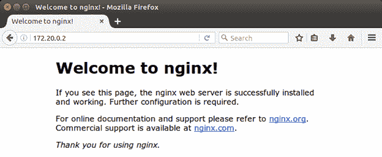
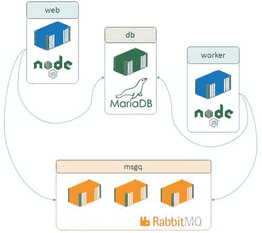

# 五、使用 Docker 编排系统

当您将一个大的应用程序分解成更小的部分，每个部分在一个单独的容器中运行时，您将需要一种容器协同工作的方法。这叫做编排。编排需要一个框架，该框架允许容器之间的通信、容器连接方式的配置、容器创建的调度、运行状况的监控和扩展。容器编排有外部平台——流行的是 [Mesos](http://mesos.apache.org/) 和 [Kubernetes](http://kubernetes.io/) ,但是 Docker 在平台中内置了编排。

在本章中，我们将研究 Docker 网络，这是一个支持容器之间通信的虚拟网络层。借助 Docker 网络，您可以隔离主机上的流量，允许您隔离容器组，同时允许它们相互通信。为了定义容器之间的关系，我们将看看 Docker Compose，它是一个客户端工具，与 Docker 服务 API 一起工作。

编排的另一面是跨多个主机管理容器，就像您在生产环境中为提供规模和可靠性所做的那样。我们将在[第 6 章“用 Docker Swarm 群集主机”](6.html#_Chapter_6_)中介绍这一点，我们将看到如何将本章中的知识应用到一群 Docker 主机上。

Docker 是应用程序运行时的平台，它控制容器如何与宿主的资源进行交互。您可以对容器设置内存和 CPU 限制，当您的应用程序运行时，它只会看到分配给它的资源。在网络级别，Docker 在您的主机上创建一个桥接网络。桥接网络为每个容器提供自己的 IP 地址，它允许容器之间以及容器和主机之间的通信。

|  | 注意:Docker 还支持其他类型的网络。桥接网络用于在单个主机上处理容器。覆盖网络用于处理跨多个主机运行的容器。还有一个插件系统，可以让你使用第三方网络类型。 |

在 Docker 中创建网络很容易。默认情况下是桥接网络，这意味着您只需给网络命名，如代码清单 49 所示。

代码清单 49:创建桥接网络

```
  $ docker
  network create ch05
  ffe636469bc2820e19438f09c9fe484e129879e37c7f93059b7d7fa03ae164fe

```

通常，当您创建一个对象时，Docker 会用一个大的 ID 来响应，您可以用它来引用该对象(或者也可以用它的名称来引用该对象)。桥接网络是用指定的 IP 地址范围创建的，网络中的每个容器都将在该范围内有一个专用的 IP 地址。这是连接容器的最简单方法。在代码清单 50 中，我们在后台启动一个加入新网络的 Nginx 容器。

代码清单 50:在网络中运行容器

```
  $ docker container run -d --name webcontainer --network ch05
  nginx:alpine

```

`--network`选项告诉 Docker 将这个容器加入到我们创建的`ch05`网络中，这意味着它将从网络范围中获得一个 IP 地址。请注意，我们还没有在容器上发布端口 80，所以我们不能浏览到`localhost`来查看站点，但是我们可以浏览到容器的 IP 地址。

我们可以通过检查容器或网络来获取 IP 地址。代码清单 51 中的`network inspect`命令列出了网络中的所有容器及其 IP 地址。

代码清单 51:检查网络

```
  $ docker network inspect
  ch05
  [
      {
          "Name":
  "ch05",
          "Id":
  "ffe636469bc2820e19438f09c9fe484e129879e37c7f93059b7d7fa03ae164fe",
          "Scope":
  "local",
          "Driver": "bridge",
  ...
          "Containers":
  {

  "e7c511c50943853a9307b859f5290f08ce208380e459d17a858dad6f995ee250":
  {

  "Name": "webcontainer",

  "EndpointID":
  "a65f4cb72fb3c28452fbde375b9a0224605daf89501d0d9e26b2788d03137aa9",

  "MacAddress": "02:42:ac:14:00:02",

  "IPv4Address": "172.20.0.2/16",

  "IPv6Address": ""
              }
          },
          "Options":
  {},
          "Labels": {}
      }
  ]

```

这个网络的子网范围是`172.20.0.0`，是一个允许 65536 个 IP 地址的 B 类网络。名为`webcontainer`的 Nginx 容器有一个`172.20.0.2`的 IP 地址，因为它是一个桥接网络，我们可以从主机访问它，如图 8 所示。



图 8:浏览到容器的 IP 地址

|  | 注意:桥在容器和主机之间。如果你在 Linux 上运行，你可以通过容器的 IP 地址来访问它们。在 Mac 的 Docker 和 Windows 的 Docker 上，记住主机是一个 Linux 虚拟机，所以你不能从你的主机直接连接到容器 IP 地址。 |

现在我们可以在同一个网络中启动第二个容器，但是我们将以交互方式运行它，这样我们就可以看到如何使用 Linux `ip`命令建立网络连接，如代码清单 52 所示。

代码清单 52:运行网络中的第二个容器

```
  $ docker container
  run -it --rm --network ch05 sixeyed/ubuntu-with-utils
  root@acda23507c84:/#
  ip -f inet address
  ...
  16: eth0@if17:
  <BROADCAST,MULTICAST,UP,LOWER_UP> mtu 1500 qdisc noqueue state UP group
  default  link-netnsid 0
      inet 172.20.0.3/16
  scope global eth0

```

这个容器有一个 IP 地址`172.20.0.3`，这意味着它和 Nginx 容器在同一个子网。Docker 有一个内置的 DNS 服务器，所以同一个网络上的容器可以通过名称和 IP 地址相互访问，正如我们在代码清单 53 中看到的`dig`和`ping`命令。

代码清单 53:查询 Docker 网络

```
  # dig webcontainer
  ...
  ;; ANSWER SECTION:
  webcontainer.       600    IN     A      172.20.0.2

  # ping webcontainer -c 2
  PING webcontainer (172.20.0.2)
  56(84) bytes of data.
  64 bytes from webcontainer.ch05
  (172.20.0.2): icmp_seq=1 ttl=64 time=0.086 ms
  64 bytes from webcontainer.ch05
  (172.20.0.2): icmp_seq=2 ttl=64 time=0.092 ms

```

|  | 注意:在 Docker 拥有 DNS 服务器之前，您在运行容器时通过使用- link 标志来连接容器，这将在容器上的 hosts 文件中创建条目，以便您可以按名称引用链接的容器。为了向后兼容，保留了该功能，但这是一种基本机制，不再需要。如果你正在学习一个使用- link 的老教程，只需用- network 替换它，你的容器就可以通过名称进行通信。 |

Docker 中的 DNS 服务器使多容器系统中的应用程序配置变得容易，因为在您的应用程序中，您只需通过容器名称来引用依赖项。如果您有一个名为`mysql`的数据库容器，那么您的 web 应用程序中的连接字符串总是可以使用`mysql`作为服务器名称。您不需要为不同的环境切换连接字符串，只要您在每个环境中以相同的方式编排，应用程序的外观将始终相同。

当您对系统中的服务器名称进行假设时，编排成为交付的关键部分。使用 Docker 为您提供了一组一致的打包应用程序，但是您不希望依赖部署文档来确保它们被正确编排。为此，您可以使用 Docker 撰写。

随着您开始交付具有更多活动部分的更复杂的应用程序，容器的编排变得更加复杂，您将需要捕获依赖关系，以便能够可靠地重复部署。这样做的一个选项是 [Docker Compose](https://docs.docker.com/compose/) ，这是一个独立的客户端工具，允许您在 YAML 文件中定义您的解决方案架构，然后用一个命令管理一整套容器。

|  | 提示:Docker Compose 与 Docker for Mac、Docker for Windows 和 Docker 工具箱捆绑在一起。在 Linux 上，这是一个单独的安装，所以您需要按照说明[安装 Docker Compose](https://docs.docker.com/compose/install/) 。 |

Docker Compose 语法采用`docker container run`命令中可用的参数，并将它们构造为 [YAML](https://en.wikipedia.org/wiki/YAML) 。您可以指定要运行的映像、容器名称、要公开的端口、要映射的卷和网络 Compose 支持所有主要的命令行选项。代码清单 54 显示了一个完整的 Docker Compose 文件，它将编排我们手动启动的两个容器。

代码清单 54:坞站复合 YAML 文件

```
  version: '2'
  services:
      web:
          image: nginx:alpine
      util:
          image:
  sixeyed/ubuntu-with-utils
          container_name: util
          command: ping web

```

第一行将其定义为使用 Docker Compose 文件格式的版本 2。在撰写中，您定义容器作为服务运行，然后指定图像名称和任何其他可选属性，例如本例中的容器名称和命令。

按照惯例，合成文件被命名为`docker-compose.yml`。从保存 YAML 文件的目录中，您可以通过运行`up`命令，以容器的形式启动合成文件中的所有服务，如代码清单 55 所示。

代码清单 55:用 Docker 编写启动服务

```
  $ docker-compose
  up -d

```

与 Docker CLI 一样，我们可以指定`-d`来监视所有容器，并让它们在后台运行。名为`util`的容器服务在编写文件中指定了一个`command`，这是一个长时间运行的命令，这意味着两个容器都将保持运行，直到我们停止它们。

虽然我们使用 Docker Compose 启动了容器，但这些只是普通的 Docker 容器，我们可以用正常的方式使用 Docker CLI 来处理它们。代码清单 56 显示了列出所有运行容器的`container ls`命令。

代码清单 56:从 Docker Compose 运行的容器

```
  $ docker container ls
  CONTAINER ID       
  IMAGE                       COMMAND                  CREATED            
  STATUS              PORTS                         NAMES
  420b4928a92d       
  nginx:alpine                "nginx -g 'daemon off"   2 minutes
  ago       Up 2 minutes        0.0.0.0:80->80/tcp, 443/tcp   sample01_web_1
  7262c0b6367d        sixeyed/ubuntu-with-utils  
  "ping web"               2 minutes ago       Up 2
  minutes                                      util

```

Nginx 容器有一个由 Compose 生成的名称，该名称使用项目名称`sample01`，该名称是通过将我的机器上的`docker-compose.yml`文件所在的文件夹与服务名称`web`以及容器的实例:`sample01_web_1`相结合而获得的。实用程序容器具有固定名称`util`，如撰写文件中所指定的。

实用程序容器通过服务名`web`来 pings 通 Nginx 容器，服务名在合成文件中指定，而不是通过容器名，容器名在运行时才知道。如果我们检查日志，我们将看到 Nginx 容器正在响应服务名上的 pings，如代码清单 57 所示。

代码清单 57:检查容器中的日志

```
  $ docker container logs util
  PING web (172.21.0.3) 56(84)
  bytes of data.
  64 bytes from sample01_web_1.sample01_default
  (172.21.0.3): icmp_seq=1 ttl=64 time=0.092 ms
  64 bytes from
  sample01_web_1.sample01_default (172.21.0.3): icmp_seq=2 ttl=64 time=0.055 ms
  64 bytes from
  sample01_web_1.sample01_default (172.21.0.3): icmp_seq=3 ttl=64 time=0.057 ms

```

|  | 注意:Docker 有不同的日志提供程序，可用于将标准输出和标准错误流导向不同的目的地。如果不指定提供程序，默认情况下允许您使用 log 命令查看容器的输出。 |

Nginx 容器有一个生成的名称，因为 Compose 允许您通过添加更多的容器来扩大规模，并且因为它需要确保名称是唯一的。我们可以在代码清单 58 中的`up`命令中添加更多带有`scale`选项的 Nginx 容器，该命令指定了所需的容器数量。

代码清单 58:用 Docker 编写扩展服务

```
  $ docker-compose up –d --scale
  web=5
  Creating and starting
  sample01_web_2 ... done
  Creating and starting
  sample01_web_3 ... done
  Creating and starting
  sample01_web_4 ... done
  Creating and starting
  sample01_web_5 ... done

```

如果我们现在连接到`util`容器，我们可以看到 Docker 中的 DNS 服务器在您查询它时会返回所有五个 Nginx 容器，如代码清单 59 所示。

代码清单 59:查询 Docker DNS 服务器

```
  $ docker container exec -it
  util bash
  root@b9594d7abca1:/# dig web
  ...
  ;; ANSWER SECTION:
  web.                600    IN     A      172.21.0.5
  web.                600    IN     A      172.21.0.4
  web.                600    IN     A      172.21.0.6
  web.                600    IN     A      172.21.0.3
  web.                600    IN     A      172.21.0.7

```

|  | 注意:Docker 中的 DNS 服务器实际上也支持负载平衡，这意味着如果您重复 dig 命令，响应中的地址会以不同的顺序返回，这是一种跨容器平衡负载的简单方法。 |

容器的 IP 地址以`172.21.0`开头——与我们在本章前面明确创建的网络范围不同。Docker Compose 为每个项目创建不同的网络，每个网络都以 Compose 文件所在的目录命名。

当我在代码清单 60 中使用`network ls`命令列出我的网络时，我可以看到 Docker 创建的一些默认网络、我手动创建的`ch05`网络和 Docker Compose 创建的`sample01_default`网络。

代码清单 60:列出 Docker 网络

```
  $ docker network ls
  NETWORK ID         
  NAME                DRIVER              SCOPE
  ffe636469bc2        ch05               
  bridge              local               
  ef5358de1913       
  docker_default      bridge              local               
  5c600195c84b       
  host                host                local               
  e78c673dd3f9       
  none                null                local               
  30771928757e        sample01_default   
  bridge              local

```

您可以使用单个命令管理撰写项目中的所有容器。这些通常是移植到 Docker Compose 的 Docker CLI 命令。在代码清单 61 中，我们停止所有容器，检查没有一个容器在运行，然后再次启动它们。

代码清单 61:停止和启动带有组合的容器

```
  $ docker-compose stop
  Stopping sample01_web_5 ...
  done
  Stopping sample01_web_4 ...
  done
  Stopping sample01_web_2 ...
  done
  Stopping sample01_web_3 ...
  done
  Stopping sample01_web_1 ...
  done
  Stopping util ... done

  $ docker container ls
  CONTAINER ID       
  IMAGE               COMMAND             CREATED            
  STATUS              PORTS               NAMES

  $ docker-compose start
  Starting util ... done
  Starting web ... done

```

|  | 提示:Docker Compose 中还有其他命令，例如 kill 和 rm，但是请记住 Compose 是一个客户端工具，这一点很重要。当您使用 Compose 创建服务时，Docker 不知道它们是相关的(除了在同一个网络中)。为了将服务作为一个单元进行管理，您需要在客户机上 docker-compose.yml 文件所在的目录中工作。 |

使用 Docker Compose，您可以通过将容器链接在一起并在 Docker 网络中运行它们来编排复杂的应用程序。像图 9 中的例子这样的分布式解决方案可以在基础设施级别的合成文件中捕获。



图 Docker 中的分布式系统

堆栈中的每个组件按名称引用其依赖项(`msgq`和`db`)，这对于容器位于同一网络中的每个环境都是一致的，即使它们在不同的规模级别上运行(这意味着应用程序配置没有变化)。

存在比我们在一个*简洁的*标题中所能涵盖的更高级的特性，但是关键的概念是网络从内部看起来是一样的，所以容器只需要知道彼此的名字。从外部来看，网络可能是单个主机上的简单桥接网络，例如开发人员的笔记本电脑或数据中心内多个服务器之间的覆盖网络，应用程序代码和容器编排是相同的。

应用程序容器是轻量级的便携式单元。将一个大系统分解成许多小容器意味着您可以在运行时独立扩展组件，这样您就可以将计算能力引向它将带来最大好处的地方。这也意味着你的应用程序的不同部分可以有不同的发布周期，这让你可以更频繁地发布高价值的组件，更快地为业务带来价值。

Docker 使用简单但强大的机制来编排多容器解决方案，从而支持这一点。使用 Docker 网络，您可以在一组内置 DNS 的容器之间建立一个隔离网络，这样容器就可以通过它们的名称透明地相互通信。这允许您在一组基础设施上运行多个分布式系统。

对于具有许多容器的复杂部署的情况，可以使用 Docker Compose 显式编排依赖关系。通过组合，您可以在一个地方定义所有的容器，并且可以将整个系统作为一个实体来管理。现在，您已经知道如何使用 Docker 管理多个容器，在下一章中，我们将研究如何使用 Docker 集群管理集群中的多个 Docker 主机。