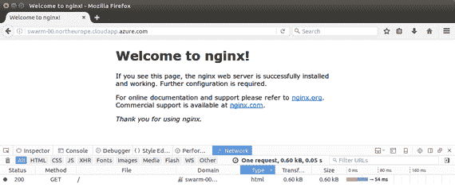

# 六、使用 Docker Swarm 聚集主机

## 模式进行聚类

当您的应用程序打包完毕并准备部署到生产环境中时，您开始看到 Docker 的真正威力。在大多数情况下，你会希望你的应用程序有冗余，这样如果托管它的服务器停机了，另一个服务器可以接管；您还希望能够扩展，以便多台服务器都可以运行该应用程序，并在它们之间分担工作负载。Docker 通过 Docker 集群模式对此提供了本地支持，这允许您将运行 Docker 的多台机器加入到一个集群中，从而提供规模和冗余。

群组模式是 Docker 中的可选功能。您可以将 Docker 作为一个独立的主机运行，就像我们到目前为止所做的那样，或者您可以用一个命令将同一个主机加入一个集群。当有多台机器在集群中运行时，可以用类似的方式启动容器，但是可以指定要运行多少个容器实例。您向集群发出请求，根据可用的资源，Docker 决定哪些主机将实际运行容器。

设置 Docker Swarm 非常容易，您可以在 Swarm 运行时添加和删除节点，以便管理您的整体容量。该群支持 Docker 网络，这意味着您的容器都可以通信，并且它会一直监控实例。如果一台主机停机，并且运行您的应用程序的容器数量低于您请求的数量，Docker 将在其他主机上启动新实例，以确保服务级别正确。在本章中，我们将看到群模式是如何工作的，以及如何在群上运行容器。

Docker swarm 遵循经理-工人架构，在该架构中，经理为工人安排工作。在集群中，工作的类型总是相同的——运行容器 Docker 有点不寻常，因为容器也可以在管理器节点上运行。管理器节点必须运行，群集才能正常运行。为了提供高可用性，您可以将多个节点指定为管理器，但只有一个节点是活动的—领导者。

|  | 提示:如果当前领导者管理器节点丢失，Docker 群模式使用 [Raft 共识算法](https://raft.github.io/)来选举新的领导者管理器节点。像类似的算法一样，Raft 依赖于多数选举，这意味着您应该有奇数个经理节点，以避免并列选举——三个或五个是常见的。因为 Docker 集群管理器也可以运行容器，所以您的辅助管理器可以工作，并且您不会在集群中浪费计算。 |

创建一个群体很容易。您需要设置许多机器(或虚拟机)，这些机器的唯一先决条件是:

*   安装了 Docker，版本 **1.12** 或更高版本
*   端口 **2377** 、 **7946** 和 **4789** 打开，机器可以通信

当您创建集群时，Docker 将提供证书，并确保所有节点之间的通信都是加密的。指定的端口需要在节点之间开放，但它们不需要是公共的，您可以在基础设施层限制访问。例如，在 Microsoft Azure 中，您将在虚拟网络中创建所有虚拟机，并且只打开虚拟网络中其他机器的端口，这意味着来自公共互联网的访问将被阻止。

|  | 注意:Docker 1.12 引入了群模式，这意味着这是您可以使用的最低版本。在 1.12 之前，Docker Swarm 是一个单独的产品。您仍然可以使用旧的 Docker Swarm 来群集多个 Docker 主机，但是它的设置要复杂得多，并且使用它与较新的 Swarm 模式相比没有任何优势。 |

机器准备就绪后，选择一台作为主机，记下它的 IP 地址，并使用`swarm init`命令创建一个群。我在 Azure 中有三个运行 Ubuntu 的虚拟机，安装了 Docker，我要把它们做成一个群。在代码清单 62 中，我从内部 IP 地址为 10.0.0.4 的机器创建了群，它将这个 Docker 主机切换到群模式，并将其设置为群的管理器。

代码清单 62:创建 Docker 群

```
  $ docker swarm init
  --advertise-addr 10.0.0.4
  Swarm initialized: current node
  (am2avhyv52mr05yernr2t9ug8) is now a manager.
  To add a worker to this swarm,
  run the following command:
      docker swarm join \
      --token
  SWMTKN-1-637apaa2992zallyfvw6iudobr6vai830h65tkk16mee8nw2u0-15ofjpt6mt4r1yy1jgg9buyb6
  \
      10.0.0.4:2377

```

在`init`命令中，如果管理器有多个 IP 地址，您只需要指定主机将从中监听节点的 IP 地址，但是指定地址当然是有用的，这样您就可以确切地知道管理器在哪里为新加入者做广告。你只需要这个命令。现在这是一个功能群，尽管只有一个节点，现在您可以添加其余的工作节点。

`swarm init`的输出给你一个令牌，你可以用它来加入更多的节点到群中。令牌是一种安全措施，它阻止任何节点加入群，除非您与它们共享令牌—您应该像对待任何其他安全秘密一样小心对待它。在代码清单 63 中，我将另一个 Azure 虚拟机加入群。

代码清单 63:加入群体

```
      $ docker swarm join
  \
  >     --token
  SWMTKN-1-637apaa2992zallyfvw6iudobr6vai830h65tkk16mee8nw2u0-15ofjpt6mt4r1yy1jgg9buyb6
  \
  >     10.0.0.4:2377
  This node joined a swarm as a
  worker.

```

`swarm join`命令指定了主节点的秘密令牌和通告地址，输出显示节点已经被接受为工作节点，所以现在我有了一个多节点群。现在我们处于集群模式，管理节点和容器有点不同，某些命令只在管理器上起作用。因为这是真的，也因为工作节点可以来来去去，所以最好在管理器上使用 Docker。

在集群模式下使用 Docker 给我们带来了两个新概念。首先，群中所有的机器都被称为节点，你用一组`node`命令来管理它们。第二，你不在蜂群上运行容器，你用`services`在更高的层次上工作。运行一个服务就像运行一个容器——它是以同样的方式从 Docker 映像创建的——但是一个服务可以作为一个容器的多个实例运行。

从群管理器中，您可以使用`node ls`命令看到群中的所有节点和当前状态，如代码清单 64 所示(其中我向群中添加了第三个节点)。

代码清单 64:列出群中的节点

```
  $ docker node ls
  ID                           HOSTNAME        
  STATUS  AVAILABILITY  MANAGER STATUS
  8smbcf360or1257jt5d3fj32i   
  swarm-02   Ready   Active
  aedcdczhcppw7qva7fdtvxmmj   
  swarm-01   Ready   Active
  am2avhyv52mr05yernr2t9ug8 * 
  swarm-00   Ready   Active        Leader

```

这里的输出告诉我们，机器`swarm-00`是领导者管理器节点，`swarm-01`和`swarm-02`是正常工作的工人节点，具有活动可用性和就绪状态。我们将在本章后面看到当一个节点离线时会发生什么。

要在群集上启动服务，请使用`service create`命令。代码清单 65 显示了作为服务启动的普通 Nginx 网络应用程序。

代码清单 65:在集群上运行服务

```
  $ docker service create --name website --publish 80:80
  nginx:alpine
  cixz0vah486d81zo1ecw5fe2p

```

创建服务很像运行容器。您可以为引擎指定映像和任何选项，例如，本例中的服务名称和端口发布。Nginx 公开了端口 80，我的 Azure 虚拟机被配置为允许来自互联网的端口 80 请求，这意味着我应该能够从任何计算机浏览我的网站，只要我知道运行容器的节点的地址。

`service ls`命令告诉我哪些服务正在运行，`service ps`告诉我哪些主机正在运行哪些容器，代码清单 66 显示了我需要访问哪个虚拟机才能访问网站。

代码清单 66:列出服务和容器

```
  $ docker service ls
  ID            NAME    
  REPLICAS  IMAGE         COMMAND
  cixz0vah486d  website  1/1      
  nginx:alpine
  $ docker service ps website
  ID                        
  NAME       IMAGE         NODE             DESIRED STATE  CURRENT
  STATE          ERROR
  1w5lqx0lp4pnftqzl04m0kqiq 
  website.1  nginx:alpine  swarm-00  Running        2 minutes ago

```

在`swarm-00`上运行的一个容器恰好是管理器。现在，如果我浏览到管理器的域地址，端口 80 请求将被转发到节点上运行的容器，我可以看到网站。图 10 显示了结果。如我们所料，请注意，服务于响应的机器的主机名`swarm-00`与我向其发送请求的虚拟机相同。



图 10:在 Swarm 容器上浏览网站

我们可以将公共网址映射到带有 CNAME 域名系统条目的特定主机，但我们不想这样做。如果该主机停机，群将在另一台主机上重新创建容器，我们需要更改 CNAME，它不是非常灵活或可扩展。然而，Docker 群模式的一大优点是其内置的请求路由，它允许您向群中的任何节点发送请求，如果该节点没有运行可以服务该请求的容器，它将透明地将请求路由到该容器正在运行的另一个节点。

在代码清单 67 中，我用 cURL 向没有运行 web 容器的节点`swarm-01`发出一个 web 请求。不过，我仍然得到了正确的响应——节点`swarm-01`已经将请求路由到节点`swarm-00`，web 容器正在那里运行，并且它已经转发了响应。

代码清单 67:查询另一个群节点

```
  $ curl
  http://swarm-01.northeurope.cloudapp.azure.com/
  <!DOCTYPE html>
  <html>
  <head>
  <title>Welcome to
  nginx!</title>

```

这一功能称为路由网格，它支持负载平衡和故障转移。您可以在集群前面放置一个负载平衡器，以便请求可以转发到任何节点，如果一个节点收到它无法处理的请求，它会智能地将请求重新路由到可以处理的节点。类似地，如果一个节点出现故障，它的容器将在其他节点上启动，服务仍然可以通过路由网格到达。

到目前为止，我们创建的服务在集群上运行时只有一个容器实例——这是新服务的默认设置。我们可以使用`replicas`选项运行一个容器的多个实例。副本是容器实例的群集术语，顾名思义，这些副本是从具有相同设置的同一映像运行的。服务应该是无状态的，这样任何容器都可以处理具有相同结果的请求。

使用负载平衡器运行多个副本意味着您可以通过在更多节点上运行服务来扩展服务。可以在创建服务时指定副本级别，也可以在服务运行时更改副本级别。代码清单 68 中的`service scale`命令向 Swarm 添加了另外四个我的网站容器实例。

代码清单 68:扩展群服务

```
  $ docker service scale
  website=5
  website scaled to 5

```

现在，当我用`service ps`命令检查服务时，如代码清单 69 所示，我可以看到实例在哪里运行。在这种情况下，我的副本比群集中的节点多，这意味着节点`swarm-00`和`swarm-02`有两个副本在运行，而节点`swarm-01`只有一个副本。

代码清单 69:列出服务副本

```
  $ docker service ps website
  ID                        
  NAME       IMAGE         NODE             DESIRED STATE  CURRENT
  STATE             ERROR
  1w5lqx0lp4pnftqzl04m0kqiq 
  website.1  nginx:alpine  swarm-00  Running        Running 13 minutes ago
  80qaxmk6fi836qyxc9n4i3o2n 
  website.2  nginx:alpine  swarm-01  Running        Preparing 12 seconds ago
  eqvkkgax24vxpo6hq1wt17199 
  website.3  nginx:alpine  swarm-02  Running        Running 4 seconds ago
  28z50bvlx7kakk403qib86dl4 
  website.4  nginx:alpine  swarm-02  Running        Running 4 seconds ago
  4fp3992k7iq72nn0fobkdzwhs 
  website.5  nginx:alpine  swarm-00  Running        Running 9 seconds ago

```

如果我现在向特定节点发出请求，我将从该节点获得响应——所有节点都有一个正在运行的容器实例，这意味着它们不需要在内部重新路由请求。我在 Azure 中设置了一个负载平衡器，它在所有虚拟机之间共享请求，这是 Docker 之外的基础架构级别。使用 [Apache Bench](http://httpd.apache.org/docs/current/programs/ab.html) 来测试性能，五个副本跨三个节点运行，我每秒得到超过 180 个请求，如代码清单 70 所示。

代码清单 70:对集群服务进行基准测试

```
  $ ab -n 3000 -c 150
  http://docker-succinctly.northeurope.cloudapp.azure.com/
  ...

  Benchmarking
  docker-succinctly.northeurope.cloudapp.azure.com (be patient)
  Completed 300 requests
  Completed 600 requests
  ...

  Concurrency Level:      150
  Time taken for tests:   16.442
  seconds
  Complete requests:      3000
  Failed requests:        0
  Total transferred:      2535000
  bytes
  HTML transferred:       1836000
  bytes
  Requests per second:    182.46
  [#/sec] (mean)
  Time per request:       822.088
  [ms] (mean)
  Time per request:       5.481
  [ms] (mean, across all concurrent requests)

```

如代码清单 71 所示，如果服务规模缩减为单个副本，性能会下降到每秒不到 120 个请求。

代码清单 71:基准测试单个副本

```
  $ ab -n 3000 -c 150
  http://docker-succinctly.northeurope.cloudapp.azure.com/
  ...

  Benchmarking
  docker-succinctly.northeurope.cloudapp.azure.com (be patient)
  Completed 300 requests
  Completed 600 requests
  ...

  Concurrency Level:      150
  Time taken for tests:   25.840
  seconds
  Complete requests:      3000
  Failed requests:        0
  Total transferred:      2535000
  bytes
  HTML transferred:       1836000
  bytes
  Requests per second:    116.10
  [#/sec] (mean)
  Time per request:      
  1292.008 [ms] (mean)
  Time per request:       8.613
  [ms] (mean, across all concurrent requests)

```

Nginx 在任何情况下都是一个高性能的网络服务器，但是在 Docker 集群上运行它作为一个服务，可以让您在几秒钟内通过一个命令进行扩展，从而大幅提高性能。对于执行更多计算到服务请求的更复杂的系统，扩展带来的好处更大。

|  | 提示:路由网格在端口级别工作—如果节点在没有容器侦听的端口上收到请求，它会将请求转发到在该端口上有容器侦听的另一台主机。如果你的集群上每个端口只运行一个服务，你不需要代理——你的负载平衡器和集群可以处理它。如果您使用同一个端口运行多个服务，例如几个网站都在端口 80 上运行，您将需要一个代理，如 Nginx，在群中运行。代理监听端口 80，而所有其他服务监听自定义端口，Nginx 根据传入的 HTTP 请求将流量路由到不同的端口。 |

群集中的管理节点不断地向节点登记，并验证所有服务都具有正确的副本级别。当一个节点关闭时，群将在其他节点上创建更多的容器，以确保服务按照请求运行。在代码清单 72 中，我关闭了集群中的节点`swarm-02`，它当前正在运行两个 Nginx 容器。

代码清单 72:关闭工作节点

```
  elton@swarm-02:~$ sudo
  shutdown 0

```

当节点关闭时，管理器的心跳停止，管理器很快发现节点不可用。随着该节点的关闭，我的网站服务低于所需的副本级别，这意味着管理器将在剩余的节点上安排新的容器。代码清单 73 显示了`node ls`命令，告诉我节点`swarm-02`已经关闭，但是服务细节显示仍然有五个容器在运行。

代码清单 73:列出节点和运行副本

```
  $ docker node ls
  ID                          
  HOSTNAME         STATUS  AVAILABILITY  MANAGER STATUS
  8smbcf360or1257jt5d3fj32i   
  swarm-02   Down    Active
  aedcdczhcppw7qva7fdtvxmmj   
  swarm-01   Ready   Active
  am2avhyv52mr05yernr2t9ug8 * 
  swarm-00   Ready   Active        Leader

  $ docker service ps -f
  "desired-state=running" website
  ID                        
  NAME       IMAGE         NODE             DESIRED STATE  CURRENT
  STATE           ERROR
  1w5lqx0lp4pnftqzl04m0kqiq 
  website.1  nginx:alpine  swarm-00  Running        Running 36 minutes ago
  bpeyfjd5hll29rdiborxryj1t 
  website.2  nginx:alpine  swarm-01  Running        Running 12 minutes ago
  5c2q4odd5vw62eyb6g4clrrz1 
  website.3  nginx:alpine  swarm-00  Running        Running 13 seconds ago
  ehlxvdq66adtjd9p53zs9i7y5 
  website.4  nginx:alpine  swarm-00  Running        Running 13 seconds ago
  7pok5wg9ntfo4iy1zq9a983n6 
  website.5  nginx:alpine  swarm-01  Running        Running 12 minutes ago

```

已经在节点`swarm-02`上的容器已经在其他节点上重新调度，因此节点`swarm-00`现在有三个容器，节点`swarm-01`有两个。

该群负责将流量路由到节点，并在节点不可用时修复服务，这意味着管理分布式系统的大量艰苦工作已经完成。

Docker 集群模式是 Docker 平台内置的一种集群技术。您可以在几分钟内从多个 Docker 主机创建一个集群，并拥有一个集群，该集群可以智能地在节点之间路由流量，并作为容器的多个实例运行可扩展服务。

节点之间的通信都是加密的，节点不必在同一个操作系统甚至同一个平台上，这意味着你可以用 Linux 和 Windows Server 主机构建混合集群。

运行带有 Windows 和 Linux 节点的混合集群，可以将多个现有工作负载迁移到单个集群中，将应用程序容器化以使用不同的基础映像，例如 Windows Server Core for。NET 框架应用程序和用于 Linux 应用程序的 Ubuntu 服务器。您的应用程序都是 Docker 映像，您可以用相同的方式管理它们，但是在运行时，您只能在 Windows 主机上运行基于 Windows 的容器，在 Linux 主机上运行基于 Linux 的容器。

在下一章中，我们将看到容器实际上是如何工作的，以及 Docker 在不同的主机平台上是什么样子的。