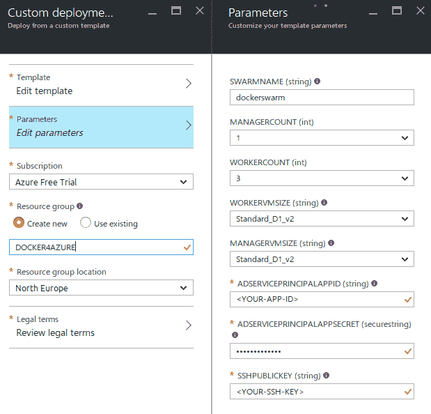
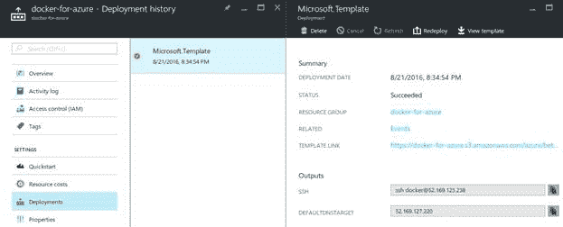

# 八、在云上运行 Docker

Docker 的生产设置对您的基础架构要求很少。您只需要几台可以通过网络相互通信的机器，它们可以是通过以太网连接的物理机器，也可以是通过虚拟网络连接的虚拟机。当您在云中托管时，Docker 为使用基础架构即服务(IaaS)而不是平台即服务(PaaS)提供了一个非常好的案例。

通常，PaaS 是首选选项，因为它消除了管理虚拟机的管理负担，云提供商通过其 PaaS 产品增加了价值，这使得部署和管理应用程序变得更加容易。然而，所有的平台即服务都是定制的。如果你构建了一个在亚马逊弹性豆茎上运行的应用程序，你不能举起这个应用程序并将其部署在微软 Azure 上——打包、部署和管理模式是不兼容的。这意味着内部环境不能在与生产环境相同的平台上运行应用程序，这意味着在开发和测试中，您必须以不同的方式运行应用程序。

通过将您的应用打包到 Docker 映像中，您可以使用基本的 IaaS 服务在本地和任何云中运行相同的映像，而无需依赖特定供应商的平台。在这一章中，我们将研究使用 Docker Machine 在 DigitalOcean 云上构建 Docker 集群，我们将介绍 Azure 产品的 Docker，我们将研究运行多集群集群。

数字海洋是一个相对较新的云提供商。它最初是通过以比 AWS、Azure 和谷歌低得多的成本提供快速的固态硬盘支持的 Linux 虚拟机而出名的。它的服务大多在 IaaS 空间中，这意味着您可以加速虚拟机，在虚拟网络中连接它们，并设置持久存储，但没有更高级别的 PaaS 服务，如消息队列或托管数据库平台。

注册 DigitalOcean 账户时，可以创建一个 API 访问令牌，与`do`命令行工具配合使用，在云中创建和管理组件。您可以手动创建虚拟机、登录并安装 Docker，但使用 Docker Machine 工具更容易。

[Docker Machine](https://docs.docker.com/machine/install-machine/) 是一个开源工具，它抽象了运行 Docker 的虚拟机的创建。Docker Machine 具有 VirtualBox、AWS、Azure、DigitalOcean 等的驱动程序，因此您可以在机器或云中的不同平台上以相同的方式创建虚拟机。

|  | 注意:Docker Machine 与 Mac 的 Docker、Windows 的 Docker 和 Docker 工具箱套件捆绑在一起，但在 Linux 上没有。如果你运行的是 Linux，Docker 文档介绍了如何[安装 Docker 机器](https://docs.docker.com/machine/install-machine/)。 |

Docker Machine 的提供程序插件使用相关的身份验证机制。为了创建一个新的虚拟机(在 DigitalOcean 中称为“小滴”)，您可以使用代码清单 84 中的命令并提供您自己的访问令牌。

代码清单 84:用 Docker 机器在数字海洋上创建 Docker 主机

```
  $ docker-machine create \
   --driver digitalocean \
   --digitalocean-access-token=[YOUR-API-TOKEN]
  \
   --digitalocean-region lon1 \
   --digitalocean-image
  ubuntu-16-04-x64 \
   do-node-01

  Running pre-create checks...
  Creating machine...
  (do-node-01) Creating SSH
  key...
  (do-node-01) Creating Digital
  Ocean droplet...
  (do-node-01) Waiting for IP
  address to be assigned to the Droplet...
  Waiting for machine to be
  running, this may take a few minutes...
  Detecting operating system of
  created instance...
  Waiting for SSH to be
  available...
  Detecting the provisioner...
  Provisioning with
  ubuntu(systemd)...
  Installing Docker...

```

完成后，您将在数字海洋中拥有一个运行最新版本 Docker 的新虚拟机。`create`命令接受许多选项，它们对于不同的虚拟机提供者是灵活的。对于数字海洋，我已经指定伦敦数据中心和最新的 Ubuntu 长期支持版本 16.04 作为虚拟机的操作系统映像。

Docker Machine 本地存储其创建的节点的详细信息，您可以使用`docker-machine env`命令查看它们。该命令的输出是结构化的，因此您可以运行它，并为本地 Docker CLI 设置环境变量，以便与刚刚创建的远程 Docker 引擎进行通信。在代码清单 85 中，我这样做是为了处理数字海洋微滴。

代码清单 85:配置 Docker CLI 来管理远程主机

```
  $ docker-machine env
  do-node-01
  export
  DOCKER_TLS_VERIFY="1"
  export
  DOCKER_HOST="tcp://139.59.189.184:2376"
  export
  DOCKER_CERT_PATH="/home/elton/.docker/machine/machines/do-node-01"
  export DOCKER_MACHINE_NAME="do-node-01"
  # Run this command to configure
  your shell: 
  # eval $(docker-machine env
  do-node-01)

  $ eval $(docker-machine env
  do-node-01)

```

Docker CLI 使用`DOCKER_HOST`和其他环境变量连接到 Docker Engine 服务器。设置好这些值后，我的本地命令行就可以与 DigitalOcean VM 一起工作了，我可以使用所有常用的命令。在代码清单 86 中，我检查了 Docker 版本。

代码清单 86:检查 Docker 引擎版本

```
  $ docker
  version
  Client:
   Version:      1.12.1
   API version:  1.24
   Go version:   go1.6.3
   Git commit:   23cf638
   Built:        Thu Aug 18
  05:33:38 2016
   OS/Arch:      linux/amd64

  Server:
   Version:      1.12.1
   API version:  1.24
   Go version:   go1.6.3
   Git commit:   23cf638
   Built:        Thu Aug 18
  05:33:38 2016
   OS/Arch:      linux/amd64

```

我的本地客户端和远程机器上都有最新版本的 Docker，我可以使用普通的 Docker 命令来管理远程机器。版本不需要匹配——您可以使用较新的客户端和较旧的引擎，但反之亦然。

|  | 提示:当您与多个 Docker 主机一起工作时，当您打算在本地工作时，很容易失去跟踪并发现自己正在远程主机上杀死容器。docker-machine env -u 命令向您展示了如何重置环境变量并将 CLI 指向本地主机。 |

您可以重复该命令来创建更多运行 Docker 的虚拟机，然后使用 Docker Machine `ls`命令来查看它们。在代码清单 87 中，您可以看到我通过 Docker Machine 又创建了两个数字海洋液滴。

代码清单 87:列出 Docker 机器主机

```
  $ docker-machine ls -q
  do-node-01
  do-node-02
  do-node-03

```

我还不会使用这些主机——我们将在本章后面看到如何将它们加入一个多集群群。

Docker Machine 是创建虚拟机作为主机的一个很好的选择—不同平台的命令基本相同，只是选项发生了变化，以支持不同的功能集。对于大多数提供者来说，可以在环境变量中指定选项，而不是命令，这意味着您的实际`docker-machine`命令可以是通用的。您可以在一个脚本中捕获您的整个主机设置，并让另一个脚本将其拆除，从而让您轻松地加速运行并移除环境。

因为它集中在主机级别，所以 Docker Machine 有一些限制，这意味着如果您想要在虚拟网络或自定义端口配置中创建具有子网的更复杂的 IaaS 环境，您将需要求助于平台的 CLI。Docker 通过构建整个基础架构的产品来解决两个主要云提供商的问题。

“Docker for”产品都遵循相同的基本原则——它们使用平台的正确工具创建一致的 Docker 环境。 [Docker for Mac](https://docs.docker.com/docker-for-mac/) 使用 HyperKit 运行一个 Linux 虚拟机， [Docker for Windows](https://docs.docker.com/docker-for-windows/) 使用 Hyper-V 运行一个 Linux 虚拟机，两者的最终用户体验是一样的，因为 Docker 使用了原生平台工具。

[Docker for Azure](https://www.docker.com/docker-azure) 在 Azure 上创建 Docker 群，部署基于 Azure 资源管理模板。像其他产品一样，Azure 的 Docker 充分利用了该平台。当您部署模板时，它会为集群创建一个工作的功能环境。这包括:

*   顶级资源组。
*   所有节点的虚拟网络。
*   单个虚拟机作为管理器节点。
*   工作节点的虚拟机规模集。
*   配置路由规则的网络安全组。
*   位于工作节点前面的负载平衡器。
*   管理虚拟机和负载平衡器的公共 IP 地址。

|  | 注意:对于 AWS，方法非常相似。[AWS 的 Docker](https://docs.docker.com/docker-for-aws/)提供了一个创建所有资源的云信息模板。《GCP Docker》是最新版本。 |

在 Azure Portal 中，您可以改变部署参数，例如，虚拟机的大小和虚拟机规模集中工作节点的初始数量，如图 13 所示。



图 13:为 Azure 创建一个带有 Docker 的群

部署通过两种方式得到保护:一种是 Azure 活动目录服务主体，Azure 的 Docker 使用它来处理订阅中的 Azure 应用程序接口，另一种是普通的 SSH 密钥，用于从客户端机器连接群。Azure 的文档详细说明了如何设置安全性。

部署完成后，您可以通过 SSH 连接到管理器节点。在 Azure 门户中，输出部分指定 SSH 命令，如图 14 所示。



图 Azure 输出的 Docker

代码清单 88 显示了到管理器节点的连接，在这里我们可以运行所有标准的 Docker 命令，例如列出群中的节点。

代码清单 88:连接到 Azure 管理器节点的 Docker

```
  $ ssh docker@52.169.123.238
  Welcome to Docker!
  dockerswarm-manager0:~$ docker
  node ls
  ID                           HOSTNAME                   
  STATUS  AVAILABILITY  MANAGER STATUS
  17i6hbl89u3m4ridw9p6ykip6   
  _dockerswarm-worker-vmss_0  Ready   Active        
  33xg9i02xukght2232l5iprtc * 
  _dockerswarm-manager0       Ready   Active        Leader
  8q53wxmdo4umveppzazx0ntd7   
  _dockerswarm-worker-vmss_2  Ready   Active        
  czocuohj8r06q9ge29x2lrfgy   
  _dockerswarm-worker-vmss_1  Ready   Active

```

|  | 注意:这是一个 Azure 部署，但是虚拟机运行的是 Linux，而不是 Windows。我们可以在这个集群上运行任何基于 Linux x64 的容器映像，但是我们不能运行基于 Windows 的映像。Azure Marketplace】上的 [Docker EE 模板可以让你创建一个包含 Linux 和 Windows 节点的混合集群。](https://collabnix.com/building-hybrid-docker-swarm-mode-cluster-on-google-cloud-platform/) |

[Azure 中的虚拟机扩展集](https://store.docker.com/editions/enterprise/docker-ee-azure)可以配置为根据 CPU 使用量等属性自动扩展。当触发扩展事件时，将从与其他虚拟机相同的映像创建一个新虚拟机。例如，在 Azure 的 Docker 中，将从工作映像创建一个新的虚拟机并加入群。目前，没有在新节点加入时重新平衡群的功能，这意味着您需要手动扩展群上的服务来利用新节点。

我们在[第 5 章“用 Docker](5.html#_Chapter_5_) 编排系统”中谈到了 Docker 网络，但是该功能不仅仅是为已经在同一物理网络中的机器创建虚拟网络。您可以创建跨越物理网络的覆盖网络，这意味着您可以创建节点运行在不同云上的 Docker 群。

|  | 注意:你能做到这一点并不意味着你应该这样做。群节点很健谈，定期发送心跳消息，不同数据中心甚至不同大陆之间的高延迟链路可能会导致问题，如果经理认为工作节点已经退出。在最坏的情况下，云之间可能会有一个网络分区，这意味着管理器节点无法相互联系，最终您将在不同的云中拥有不同的管理器。但是通过仔细的计划和测试，这种架构在某些场景中是有用的。 |

我将用一个简单的群体来说明这一点。我有一个运行 Ubuntu 和 Azure 中 Docker 的虚拟机，它设置了防火墙(“Azure 术语中的网络安全组”)，允许公共互联网访问集群端口。我可以用通常的方式创建一个群，但是我需要指定两个 IP 地址，如代码清单 89 所示。

代码清单 89:用两个 IP 地址初始化一个群

```
  $ docker
  swarm init --advertise-addr 13.74.254.111 --listen-addr 10.3.0.4

```

`--advertise-addr`选项指定了管理器应该监听连接的公共 IP 地址，但这是一个由 Azure 管理的虚拟 IP 地址—虚拟机本身并不知道该地址。`--listen-addr`选项指定管理器应该监听的实际 IP 地址，这意味着管理器可以绑定到一个 IP 地址，但通告另一个。

现在，我可以使用相同的`join`命令，通过指定 Azure 管理器节点的公共虚拟 IP 地址，将我的一个 DigitalOcean 小滴加入群，如代码清单 90 所示。

代码清单 90:加入另一片云的群体

```
  $ docker
  swarm join --token SWMTKN-1-3jsfck3x9s9sme8rmtk31321z28qu46o66399c555x9hqewmvx-bfsgl92blu2rng12o5xdvli98 
  13.74.254.111:2377
  This node joined a swarm as a
  worker.

```

这给了我一个群，两个节点在不同的云上运行在不同的国家。代码清单 91 显示了 Azure 管理器中的节点清单。

代码清单 91:列出多集群中的节点

```
  $ docker node ls
  ID                          
  HOSTNAME    STATUS  AVAILABILITY  MANAGER STATUS
  0ejba0pkdtkqjsqs5vkskvt9l   
  do-node-01  Ready   Active
  47950fi8w0evsk20ypkj4adk9 * 
  node0-ub    Ready   Active        Leader

```

我可以像使用任何其他集群一样使用这个多集群，创建具有跨节点的多个副本的服务。在代码清单 92 中，我为容器创建了一个通信网络。

代码清单 92:在集群上创建覆盖网络

```
  $ docker network create -d overlay website-net

```

|  | 注意:默认网络类型是网桥，用于单台主机。对于跨越多个主机的网络，Docker 有覆盖网络，这是您需要用于 Docker 集群网络的网络。 |

可以在创建服务时指定覆盖网络，将所有容器添加到网络中。在代码清单 93 中，我创建了基本的 Nginx 服务，它有足够的副本来跨越两个节点，然后我列出了服务流程。

代码清单 93:使用覆盖网络创建服务

```
  $ docker service create
  --name website --publish 80:80 --replicas 4 --network website-net
  nginx:alpine
  …
  $ docker service ps website
  ID                        
  NAME           IMAGE         NODE        DESIRED STATE  CURRENT
  STATE            ERROR
  aq1ug1p1zknrfn3ucawbcfxhh  website.1     
  nginx:alpine  node0-ub    Running        Running 13 seconds ago
  1w7gpilweobxzjh8lc993ce8w 
  website.2      nginx:alpine  do-node-01  Running        Running 13 seconds
  ago
  9b52hijql5ugd723rql21bvgd 
  website.3      nginx:alpine  node0-ub    Running        Running 13 seconds
  ago
  5oiscpzz73secc7hpelbfdazg 
  website.4      nginx:alpine  do-node-01  Running        Running 13 seconds
  ago

```

我们看到有四个容器在运行，Azure 中的管理器和 DigitalOcean 中的工作器各有两个。为了验证网站是否正在运行，我可以向节点的公共 IP 地址发出 HTTP GET 请求，如代码清单 94 所示。

代码清单 94:用 cURL 检查服务

```
  $ curl
  http://138.68.129.206/  #DigitalOcean
  <!DOCTYPE html>
  <html>
  <head>
  <title>Welcome to
  nginx!</title>
  …
  $ curl http://13.74.254.111/ 
  #Azure
  <!DOCTYPE html>
  <html>
  <head>
  <title>Welcome to
  nginx!</title>

```

通过这样的多数据流设置，您可以使用配置为服务于 Azure 或 DigitalOcean 端点的 DNS 服务来平衡节点间的负载。借助高级域名系统，如[亚马逊的 53 号路由](https://aws.amazon.com/route53/)，您可以对每个端点进行健康检查，以便您可以将 Azure 配置为您的主要端点，但如果 Azure 不可用或繁忙，可以将流量路由到 DigitalOcean。

多集群，或者是云和内部主机的混合集群，提供了一些非常有趣的机会。但是您应该意识到群心跳和控制平面消息跨越数据中心的安全影响和潜在的性能问题。

在云中运行 Docker 给你带来了巨大的可点击规模的好处，这意味着你可以轻松地旋转新的节点，并将它们添加到你的集群中。这在 AWS 的 Docker 和 Azure 产品的 Docker 中甚至更容易，因为集群利用了每个平台的本机扩展选项，例如 Azure 中的虚拟机扩展集。

将打包模型集中在 Docker 上还可以将您与云中的供应商锁定隔离开来。您的基础架构部署脚本将特定于您使用的任何云，但是您的应用程序包将在任何云上以相同的方式运行。因此，如果您从 AWS 开始，然后用 Azure 做了一笔好交易，您可以轻松地转移整个工作负载，而无需任何应用程序代码更改。

这种面向云的 IaaS 方法意味着要承担管理大量虚拟机的负担，但是有一些产品可以简化管理并为您的应用程序资产增加额外的安全层。

在最后一章中，我们将了解 Docker，Inc .的产品套件，该套件旨在运行 Docker 的安全和健康的生产部署，我们将了解 Docker 之旅的下一步。