# 一、配置

在开始使用 EF Core 之前，您需要在本地部署它的程序集。微软和其他一些公司遵循的分发模式并不依赖老派的 Windows 安装程序，而是依赖新技术，如 [NuGet](http://www.nuget.org/) 和 [Git](http://git-scm.com/) 。我们稍后将尝试理解这些选项中的每一个，但是在我们开始之前，请确保您安装了 Visual Studio 2015 或 2017(任何版本，包括 Visual Studio 社区版都可以)，以及 SQL Server 2012(任何版本，包括 Express)或更高版本。在 SQL Server 管理工作室中，创建一个名为**的新数据库。**

##  获取实体框架核心

[NuGet](http://www.nuget.org/) 是为了。NET 包管理实体框架对于数据访问来说是什么。简而言之，它允许 Visual Studio 项目依赖于软件包——程序集、源代码文件、PowerShell 脚本等。—存储在远程存储库中。由于高度模块化，英孚有许多组件，这些组件部署在带外，与常规组件无关。NET 版本。要将其安装到现有项目中，首先从工具>库包管理器运行包管理器控制台，并输入以下命令。

`Install-package Microsoft.EntityFrameworkCore`

由于新的模块化体系结构，您还将需要 SQL Server ( **Microsoft)的提供程序。基本包(**微软)中不再包含的实体框架。实体框架**):**

`Install-package Microsoft.EntityFrameworkCore.SqlServer`

到目前为止，这是部署实体框架核心的首选，另一个是从 GitHub 获取源代码并手动构建它。接下来我会解释这个选项。

##  获取实体框架核心

第二个选项，对于高级用户来说，是在 [GitHub](https://github.com/aspnet/EntityFramework) 上克隆实体框架核心存储库，自己构建二进制文件，手动添加对生成的程序集的引用。

首先，让我们从使用您喜欢的 Git 客户端克隆 Git 存储库开始。

代码清单 1

```cs
https://github.com/aspnet/EntityFramework.git

```

接下来，使用以下两个命令从命令行构建所有内容。

代码清单 2

```cs
  build
  /t:RestorePackages /t:EnableSkipStrongNames
  build

```

也可以启动 Visual Studio 2015 或 2017，打开 **EntityFramework.sln** 解决方案文件。这样，您可以用源代码进行自己的实验，编译程序集的调试版本，运行单元测试，等等。

上下文是从[继承到](http://msdn.microsoft.com/en-us/library/system.data.entity.dbcontext.aspx)的非抽象类。这就是所有乐趣发生的地方:它公开了实体集合，您可以操纵这些实体集合从存储中返回数据或向其中添加内容。在使用前需要正确配置。您将需要实现一个上下文，并通过提供您的模型实体和所有必要的配置使它成为您自己的上下文。

实体框架核心的 [DbContext](http://msdn.microsoft.com/en-us/library/system.data.entity.dbcontext.aspx) 类有一些基础设施方法，它会在特定时间自动调用:

*   `OnConfiguring`:当上下文需要自己配置时自动调用——比如设置提供者和连接字符串——给开发人员一个介入的机会。
*   `OnModelCreating`:实体框架核心组装数据模型时自动调用。
*   `SaveChanges`:当我们希望将更改持久化到底层数据存储时显式调用。返回受保存操作影响的记录数。

让你自己熟悉这些方法，因为你会在整本书中多次看到它们。

实体框架与数据库无关，但这意味着每个相关方——数据库制造商或其他人——必须发布他们自己的提供者，以便实体框架可以使用它们。开箱即用，微软为 SQL Server 2012 提供了提供程序，包括 Azure SQL 数据库、SQL Server Express 和 SQL Server Express LocalDB，但也为 SQLite 和 In Memory 提供了提供程序。本书中的例子将适用于这些提供者。请确保您至少安装了其中一个，并且您具有适当的管理权限。

实体框架通过 [DbContext](http://msdn.microsoft.com/en-us/library/system.data.entity.dbcontext.aspx) 、`OnConfiguring`的新的基础设施方法来确定使用哪个连接，我们可以在这里显式地配置它。这与以前的版本有很大不同。此外，您可以使用接受`DbContextOptions`参数的构造函数来传递配置。

在我们能够连接到 SQL Server 之前，我们需要在本地拥有[微软。entityframeworkore . SQL server](https://www.nuget.org/packages/Microsoft.EntityFrameworkCore.sqlserver)NuGet 包。其他选择见附录 A。

实体框架核心上下文使用服务提供者来保存其所需服务的列表。当您配置一个特定的提供者时，该过程注册它的所有特定服务，然后这些服务与通用服务相结合。我们可以提供自己的服务提供商，或者只是替换一项或多项服务。我们将看到一个这样的例子。

让我们考虑以下场景作为我们研究的基础。

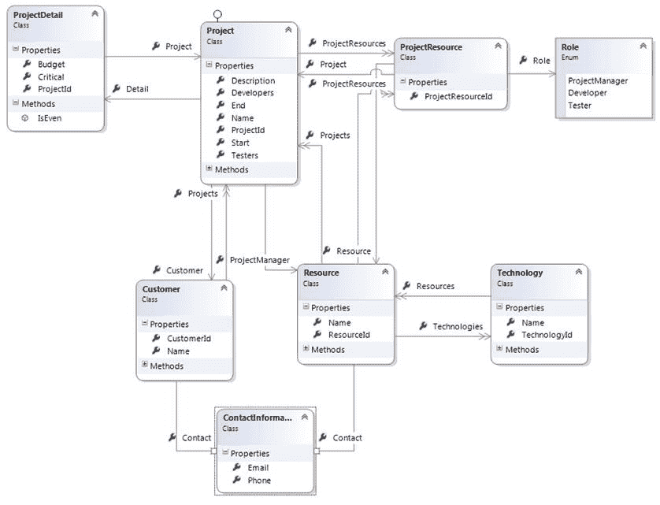

图 1:领域模型

您将在附带的源代码中找到所有这些类。让我们试着解释一下:

*   一`Customer`有若干`Projects`。
*   每个`Project`都有一个`ProjectResources`的集合，属于一个`Customer`，还有一个带有附加信息的`ProjectDetail`。
*   A `ProjectDetail`指单个`Project`。
*   一个`ProjectResource`总是指向一个现有的`Resource`，并被分配给一个具有给定`Role`的`Project`。
*   一个`Resource`认识一些`Technologies`，可以参与几个`Projects`。
*   一个`Technology`可以由几个`Resources`共同分享。
*   `Customers`和`Resources`都有`Contact`信息。

|  | 注意:你可以在 Git 资源库[这里找到完整的源代码。](https://github.com/rjperes/Entity-Framework-Core-Succinctly)[](https://github.com/rjperes/Entity-Framework-Core-Succinctly) |

在使用类模型查询数据库或向其中插入值之前，实体框架需要知道它应该如何将实体(类、属性和实例)来回转换到数据库中(特别是表、列和记录)。为此，它使用了一个映射，该映射有两个 API。稍后将详细介绍，但首先是一些基本概念。

同样，上下文是继承自 [DbContext](http://msdn.microsoft.com/en-us/library/system.data.entity.dbcontext.aspx) 的类，并以 [DbSet < T >](http://msdn.microsoft.com/en-us/library/gg696460.aspx) 属性的形式公开多个实体集合。没有什么可以阻止您公开所有实体类型，但是通常您只公开聚合根，因为这些根本身就是有意义的查询。上下文的另一个重要功能是跟踪对实体的更改，以便当我们准备保存更改时，它知道该做什么。上下文跟踪的每个实体将处于以下状态之一:未更改、已修改、已添加、已删除或已分离。一个上下文可以被认为是一个沙箱，在其中我们可以对一组实体进行更改，然后通过一个`save`操作应用这些更改。

一个示例上下文可能如下。

代码清单 3

```cs
public class ProjectsContext : DbContext
{
  public DbSet<Resource> Resources { get;  private set; }  public DbSet<Resource> Resources { get;  private set; }
  public DbSet<Project> Projects { get;  private set; }
  public DbSet<Customer> Customers { get;  private set; }
  public DbSet<Technology> Technologies { get;  private set; }
}

```

|  | 注意:请随意将您自己的方法、业务或其他方法添加到上下文类中。 |

[DbContext](http://msdn.microsoft.com/en-us/library/system.data.entity.dbcontext.aspx) 类提供了两个公共构造函数，允许传递上下文选项:

代码清单 4

```cs
public class ProjectsContext : DbContext
{
  public ProjectsContext(string connectionString) : base (GetOptions(connectionString))
  {
  }

  public ProjectsContext(DbContextOptions options) : base(options)
  {
  }

  private static DbContextOptions GetOptions(string connectionString)
  {
    var modelBuilder = new DbContextOptionsBuilder();
    return modelBuilder.UseSqlServer(connectionString).Options;
  }
}

```

上下文选项包括要使用的特定数据库提供程序、其连接字符串和其他适用的属性。

这只是将连接字符串传递给上下文的一种方式，我们也可以使用稍后将描述的`OnConfiguring`方法。

映射的核心是实体的概念。实体只是一个映射到实体框架上下文的类，并且有一个标识(唯一标识其实例的属性)。用领域驱动设计(DDD)的说法，如果要直接查询的话，它被称为聚合根。考虑一个实体细节，它与一个聚合根一起被加载，并且通常不会独立地被加载，例如项目细节或客户地址。一个实体通常被保存在它自己的表上，并且可以有任意数量的业务或验证方法。

代码清单 5

```cs
public class Project
{ 
  public int ProjectId { get; set; }

  public string Name { get; set; }

  public DateTime Start { get; set; }

  public DateTime? End { get; set; }

  public ProjectDetail Detail { get; set; }

  public Customer Customer { get; set; }

  public void AddResource(Resource resource, Role role)
  {
    resource.ProjectResources.Add(new ProjectResource() 
      { Project = this, Resource = resource, Role = role });
  }

  public Resource ProjectManager
  {
    get
    {
      return ProjectResources.ToList()
        .Where(x => x.Role == Role.ProjectManager)
        .Select(x => x.Resource).SingleOrDefault();
    }
  }

  public IEnumerable<Resource> Developers
  {
    get
    {
      return ProjectResources.Where(x => x.Role == Role.Developer)
        .Select(x => x.Resource).ToList();
    }
  }

  public IEnumerable<Resource> Testers
  {
    get
    {
      return ProjectResources.Where(x => x.Role == Role.Tester)
        .Select(x => x.Resource).ToList();
    }
  }

  public ICollection<ProjectResource> ProjectResources { get; } =  new HashSet<ProjectResource>();

  public override String ToString()
  {
    return Name;
  }
}

```

在这里，您可以看到我们将在整本书中使用的一些模式:

*   实体需要至少有一个公共的无参数构造函数。
*   一个实体总是有一个标识符属性，该属性具有相同的名称并以`Id`结束。
*   集合总是通用的，具有受保护的设置器，并且在构造函数中以实际集合的形式被赋予一个值(像 [HashSet < T >](http://msdn.microsoft.com/en-us/library/bb359438.aspx) )。
*   计算属性用于公开持久属性的筛选集。
*   业务方法用于实施业务规则。
*   通过覆盖[到字符串](http://msdn.microsoft.com/en-us/library/system.object.tostring.aspx)来提供实体的文本表示。

|  | 提示:经验丰富的实体框架开发人员会注意到缺少属性的虚拟限定符。这不是必需的，因为实体框架核心 1.1 不支持惰性属性，正如我们将看到的。 |

|  | 提示:在 Entity Framework Core 的第一个版本中，不支持复杂类型，因此非标量属性将始终是对其他实体或它们的集合的引用。 |

其中实体只有属性(数据)而没有方法(行为)的领域模型有时被称为贫血领域模型。你可以在马丁·福勒的[网站](http://www.martinfowler.com/bliki/AnemicDomainModel.html)上找到这个反模式的很好的描述。

EF Core 2.0 中引入了复杂类型，或拥有的实体。它们通过将类中的属性组合在一起，提供了一种更好地组织代码的方法。这些类不是实体，因为它们没有标识(没有主键)，并且它们的内容不存储在不同的表中，而是存储在声明它们的实体的表中。一个很好的例子是`Address`类:它可以有几个属性，可以重复几次(如工作地址、个人地址)。

标量是简单的值，如字符串、日期和数字。它们是存储实际实体数据的地方——在关系数据库和表列中——并且可以是以下任何一种类型。

表 1:标量属性

| 。网络类型 | SQL 服务器类型 | 描述 |
| --- | --- | --- |
| `Boolean` | [BIT](http://technet.microsoft.com/en-us/library/ms177603.aspx) | 单比特 |
| `Byte` | [TINYINT](http://technet.microsoft.com/en-us/library/ms187745.aspx) | 单字节(8 位) |
| `Char` | [CHAR](http://technet.microsoft.com/en-us/library/ms176089.aspx) ，[NCHAR](http://technet.microsoft.com/en-us/library/ms186939.aspx) | ASCII 或 UNICODE 字符(8 或 16 位) |
| `Int16` | [模型化](http://technet.microsoft.com/en-us/library/ms187745.aspx) | 短整数(16 位) |
| `Int32` | [INT](http://technet.microsoft.com/en-us/library/ms187745.aspx) | 整数(32 位) |
| `Int64` | [重印](http://technet.microsoft.com/en-us/library/ms187745.aspx) | 长(64 位) |
| `Single` | [真实](http://technet.microsoft.com/en-us/library/ms173773.aspx) | 浮点数(32 位) |
| `Double` | [浮动](http://technet.microsoft.com/en-us/library/ms173773.aspx) | 双精度浮点数(64 位) |
| `Decimal` | [金钱，](http://technet.microsoft.com/en-us/library/ms179882.aspx)[SMALLMONEY](http://technet.microsoft.com/en-us/library/ms179882.aspx) | 货币(64 位)或小货币(32 位) |
| `Guid` | 唯一标识符 | 全球唯一标识符 |
| `DateTime` | [DATE](http://technet.microsoft.com/en-us/library/bb630352.aspx) ，[日期时间](http://technet.microsoft.com/en-us/library/ms187819.aspx) ，[小型日期时间](http://technet.microsoft.com/en-us/library/ms182418.aspx)，[日期时间 2](http://technet.microsoft.com/en-us/library/bb677335.aspx) | 有时间或没有时间的日期 |
| `DateTimeOffset` | [日期时间关闭](http://technet.microsoft.com/en-us/library/bb630289.aspx) | 包含时区信息的日期和时间 |
| `TimeSpan` | [时间](http://technet.microsoft.com/en-us/library/bb677243.aspx) | 时间 |
| `String` | varchar，[NVARCHAR](http://technet.microsoft.com/en-us/library/ms186939.aspx) ，[XML](http://technet.microsoft.com/en-us/library/ms187339.aspx) | ASCII(每个字符 8 位)、UNICODE (16 位)或 XML 字符串。也可以表示字符长对象 |
| `Byte[]` | [BINARY，](http://technet.microsoft.com/en-us/library/ms188362.aspx)[VARBINARY](http://technet.microsoft.com/en-us/library/ms188362.aspx) ，[ROWVERSION](http://technet.microsoft.com/en-us/library/ms182776.aspx) | 二进制大对象 |
| `Enum` | [INT](http://technet.microsoft.com/en-us/library/ms187745.aspx) | 枚举值 |

|  | 提示:尚不支持空间数据类型，但它们将出现在未来的版本中。 |

类型`Byte`、`Char`和`String`可以指定最大长度。`-1`的值翻译为`MAX`。

所有标量类型都可以被设为“可空”，这意味着它们可能没有值集。在数据库中，这由`NULL`值表示。

标量属性需要有一个 getter 和一个 setter，但是 setter 的可见性比 getter 更受限制:内部、受保护的内部或受保护的。

标量属性的一些示例如下。

代码清单 6

```cs
public class Project
{
  public int ProjectId { get; set; }

  public string Name { get; set; }

  public DateTime Start { get; set; }

  public DateTime? End { get; set; }
}

```

默认情况下，所有公共属性都包含在实体框架用来表示其实体的模型中。您可以通过使用属性或代码配置来排除它们。

实体的一个或多个标量属性必须表示基础表的主键，主键可以是单一的，也可以是复合的。

主键属性只能是基本类型之一(表 1 中的任何类型，数组和枚举除外)，但不能是复杂类型或其他实体的类型。

新的，因为实体框架核心 1.1 是映射字段的可能性，任何可见性。这很方便，因为它允许更好地封装内部数据，并有助于防止坏数据。与公共属性不同，字段不会自动映射，必须显式添加到模型中。稍后会有更多的介绍。

从一个实体到另一个实体的引用定义了双向关系。有两种类型的引用关系:

*   **多对一**:一个实体的几个实例可以与另一个类型的同一个实例相关联(比如客户拥有的项目)。

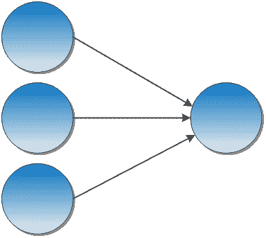

图 2:多对一关系

*   **一对一**:一个实体的实例与另一个实体的另一个实例关联；另一个实例只与第一个实例相关联(例如项目及其细节)。


图 3:一对一的关系

在 EF 中，我们通过使用另一个实体类型的属性来表示关联。

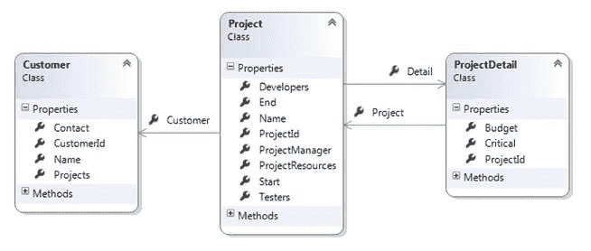

图 4:参考:一对一、多对一

我们称一个实体的属性引用另一个实体作为两个实体之间关系的端点。

代码清单 7

```cs
public class Project
{
  //one endpoint of a many-to-one relation.
  public Customer Customer { get; set; }

  //one endpoint of a one-to-one relation.
  public ProjectDetail Detail { get; set; }
}

public class ProjectDetail
{
  //the other endpoint of a one-to-one relation.
  public Project Project { get; set; }
}

public class Customer
{
  //the other endpoint of a many-to-one relation.
  public ICollection<Project> Projects { get; protected set; }
}

```

|  | 注意:仅仅通过观察一个端点，我们不能立即判断它的类型(一对一或多对一)，我们需要观察两个端点。 |

实体集合代表两种可能的双向关系类型之一:

*   **一对多**:一个实体的单个实例与某个其他实体类型(如项目及其资源)的多个实例相关。

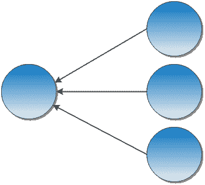

图 5:一对多关系

*   **多对多**:一个类型的多个实例可以与另一个类型的任意多个实例相关联(比如资源以及它们所知道的技术)。实体框架核心目前不直接支持这种关系。

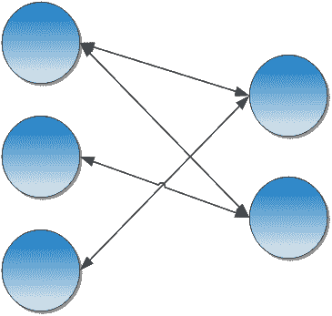

图 6:多对多关系

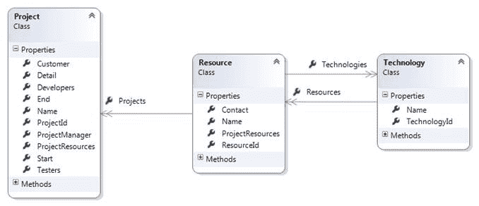

图 7:集合:一对多

实体框架只支持将集合声明为 [ICollection < T >](http://msdn.microsoft.com/en-us/library/92t2ye13.aspx) (或一些派生类或接口)属性。在实体中，我们应该总是在构造函数中初始化集合属性。

代码清单 8

```cs
public class Project
{
  public Project()
  {
    ProjectResources = new HashSet<ProjectResource>();
  }

  public ICollection<ProjectResource> ProjectResources
  { get; protected set; }
}

```

|  | 注意:引用和集合统称为导航属性，而不是标量属性。 |

|  | 提示:截至目前，实体框架核心不支持多对多关系。绕过这个限制的方法是有两个一对多的关系，这意味着我们需要映射关联表。 |

实体框架核心引入了一个新概念，影子属性，这在以前的版本中是不存在的。简而言之，影子属性是存在于表中但在 POCO 类中没有对应属性的列。每当实体框架获取一个包含影子属性的类的实体时，它都会请求属于它们的列。

那么它们是用来做什么的呢？对于加载的实体，影子属性保存在实体框架的内部状态中，并且可以在插入或更新记录时使用，例如，设置审计字段。考虑这种情况，我们有一个接口来指定可审计的实体，让我们称之为，然后，`IAuditable`:

代码清单 9

```cs
public interface IAuditable { }

public class ProjectsContext : DbContext
{
  public Func<string> UserProvider { get; set; } = () => 
    WindowsIdentity.GetCurrent().Name;
  public Func<DateTime> TimestampProvider {  get; set ; } = () => DateTime.UtcNow;

  public DbSet<Project> Projects { get; protected set; }

  protected override void OnModelCreating(ModelBuilder modelBuilder)
  {
    foreach (var entity in modelBuilder.Model.GetEntityTypes()
      .Where(x => typeof(IAuditable).IsAssignableFrom(x.ClrType)))
    {
      entity.AddProperty("CreatedBy", typeof(string));
      entity.AddProperty("CreatedAt", typeof(DateTime));
      entity.AddProperty("UpdatedBy", typeof(string));
      entity.AddProperty("UpdatedAt", typeof(DateTime?));
    }

    base.OnModelCreating(modelBuilder);
  }

  public override int SaveChanges()
  {
    foreach (var entry in ChangeTracker.Entries().Where(e => e.State ==   
      EntityState.Added || e.State == EntityState.Modified))
    {
      if (entry.Entity is IAuditable)
      {
        if (entry.State == EntityState.Added)
        {
          entry.Property("CreatedBy").CurrentValue = UserProvider();
          entry.Property("CreatedAt").CurrentValue = TimestampProvider();
        }
        else
        {
          entry.Property("UpdatedBy").CurrentValue = UserProvider();
          entry.Property("UpdatedAt").CurrentValue = TimestampProvider(); 
        }
      }
    }

    return base.SaveChanges();  
  }
}

```

对于`WindowsIdentity` 类，我们需要添加对**系统的引用。安全.校长.窗口** NuGet 包。默认情况下，我们将从中获取当前用户的身份。

在[的 OnModelCreating](https://msdn.microsoft.com/en-us/library/system.data.entity.dbcontext.onmodelcreating(v=vs.113).aspx) 方法中，我们寻找任何实现`IAuditable`的类，并为每个类添加几个审计属性。然后在 [SaveChanges](https://msdn.microsoft.com/en-us/library/system.data.entity.dbcontext.savechanges(v=vs.113).aspx) 中，我们迭代实现`IAuditable`的所有等待持久化的实体，并相应地设置审计值。为了使它更加灵活，并且可以进行单元测试，我将属性`UserProvider`和`TimestampProvider`设置为可配置的，这样您就可以更改返回的值。

查询阴影属性也是可能的，但是它需要特殊的语法——记住，我们没有“物理”属性:

代码清单 10

```cs
var resultsModifiedToday = ctx
  .Projects
  .Where(x => EF.Property<DateTime>(x, "UpdatedAt") == DateTime.Today)
  .ToList();

```

表达映射意图最常用的方法是将属性应用于属性和类。这样做的好处是，只需查看一个类，就可以立即推断出它的数据库结构。

除非明确设置，否则存储实体类型的表是由约定决定的(稍后将详细说明)，但是可以通过将 [TableAttribute](http://msdn.microsoft.com/en-us/library/system.componentmodel.dataannotations.schema.tableattribute.aspx) 应用于实体的类来明确设置类型。

代码清单 11

```cs
[Table("MY_SILLY_TABLE", Schema = "dbo")]
public class MySillyType { }

```

[模式](http://msdn.microsoft.com/en-us/library/system.componentmodel.dataannotations.schema.tableattribute.schema.aspx)属性是可选的，应该用于指定默认模式以外的模式名称。模式是数据库对象(表、视图、存储过程、函数等)的集合。)在同一个数据库中。在 SQL Server 中，默认的模式是`dbo`。

为了控制属性的存储方式(列名、物理顺序和数据库类型)，我们应用了[列属性](http://msdn.microsoft.com/en-us/library/system.componentmodel.dataannotations.schema.columnattribute.aspx)。

代码清单 12

```cs
[Column(Order = 2, TypeName = "VARCHAR")]
public string Surname { get; set; }
[Column(Name = "FIRST_NAME", Order = 1, TypeName = "VARCHAR")]
public string FirstName { get; set; }

```

如果未指定[类型名称](http://msdn.microsoft.com/en-us/library/system.componentmodel.dataannotations.schema.columnattribute.typename.aspx)，实体框架将使用引擎的默认属性类型。SQL Server 将使用`NVARCHAR`表示`String`属性、`INT`表示`Int32`、`BIT`表示`Boolean`等。我们可以用它来覆盖这个缺省值。

[顺序](http://msdn.microsoft.com/en-us/library/system.componentmodel.dataannotations.schema.columnattribute.order.aspx)对生成的列应用物理顺序，该顺序可能不同于属性在类中出现的顺序。使用[命令](http://msdn.microsoft.com/en-us/library/system.componentmodel.dataannotations.schema.columnattribute.order.aspx)属性时，同一类中不应有两个值相同的属性。

将标量属性标记为强制需要使用 [RequiredAttribute](http://msdn.microsoft.com/en-us/library/system.componentmodel.dataannotations.requiredattribute.aspx) 。

代码清单 13

```cs
[Required]
public string Name { get; set; }

```

|  | 提示:当此属性应用于字符串属性时，它不仅可以防止属性为空，还可以防止接受空字符串。 |

|  | 提示:对于值类型，应该适当选择实际的属性类型。如果列不可为空，则不应选择可为空的属性类型，如 Int32？。 |

对于必需的实体引用，同样的规则适用。

代码清单 14

```cs
[Required]
public Customer Customer { get; set; }

```

通过 [MaxLengthAttribute](http://msdn.microsoft.com/en-us/library/system.componentmodel.dataannotations.maxlengthattribute.aspx) 设置字符串列的最大允许长度。

代码清单 15

```cs
[MaxLength(50)]
public string Name { get; set; }

```

[maxlengtheattribute](http://msdn.microsoft.com/en-us/library/system.componentmodel.dataannotations.maxlengthattribute.aspx)也可以用来将一列设置为`CLOB`，一个包含大量文本的列。SQL Server 使用类型`NVARCHAR(MAX)`(用于 UNICODE)和`VARCHAR(MAX)` (ASCII)。为此，我们传递-1 的长度。

代码清单 16

```cs
[MaxLength(-1)]
public string LargeText { get; set; }

```

也可以用来设置`BLOB`(在 SQL Server 中，`VARBINARY`)列的大小。

代码清单 17

```cs
[MaxLength(-1)]
public byte[] Picture { get; set; }

```

和前面的例子一样，1 的大小将被有效地转换为`MAX`。

忽略一个属性并让实体框架从不考虑它进行任何操作就像在属性上设置一个 [NotMappedAttribute](http://msdn.microsoft.com/en-us/library/system.componentmodel.dataannotations.schema.notmappedattribute.aspx) 一样简单。

代码清单 18

```cs
[NotMapped]
public string MySillyProperty { get; set; }

```

完全忽略一个类型，包括任何可能引用它的属性，也可以通过将 [NotMappedAttribute](http://msdn.microsoft.com/en-us/library/system.componentmodel.dataannotations.schema.notmappedattribute.aspx) 应用于它的类来实现。

代码清单 19

```cs
[NotMapped]
public class MySillyType { }

```

映射字段需要使用代码映射来完成，我们稍后将介绍这一点。

虽然数据库表并不严格要求主键，但实体框架需要它。支持单列和多列(复合)主键。通过应用[关键帧属性](http://msdn.microsoft.com/en-us/library/system.componentmodel.dataannotations.keyattribute.aspx)，可以将一个或多个属性标记为主键。

代码清单 20

```cs
[Key]
public int ProductId { get; set; }

```

如果我们有一个复合主键，我们需要使用代码映射。键的顺序很重要，这样当通过 [Find](https://msdn.microsoft.com/en-us/library/gg696418(v=vs.113).aspx) 方法加载实体时，EF 就知道哪个参数引用了哪个属性。

代码清单 21

```cs
//composite id[Column(Order = 1)]
public int ColumnAId { get; set; } [Column(Order = 2)]
public int ColumnBId { get; set; }

```

主键也可以用一个属性来修饰，该属性告诉实体框架如何生成键(由数据库或手动生成)。这个属性是[DatabaseGeneratedAttribute](http://msdn.microsoft.com/en-us/library/system.componentmodel.dataannotations.schema.databasegeneratedattribute.aspx)，它的值将在下一节中详细解释。

我们通常不需要在实体中包含外键；相反，我们使用对另一个实体的引用，但是我们也可以拥有它们。这就是 [ForeignKeyAttribute](http://msdn.microsoft.com/en-us/library/system.componentmodel.dataannotations.schema.foreignkeyattribute.aspx) 的作用。

代码清单 22

```cs
public Customer Customer { get; set; }

[ForeignKey("Customer")]
public int CustomerId { get; set; }

```

[ForeignKeyAttribute](http://msdn.microsoft.com/en-us/library/system.componentmodel.dataannotations.schema.foreignkeyattribute.aspx) 的参数是外键所涉及的导航属性的名称。

现在，假设我们有几个从一个实体到另一个实体的关系。例如，客户可能有两个项目集合:一个用于当前项目，另一个用于过去项目。它可以用代码表示如下:

代码清单 23

```cs
public class Customer
{
  //the other endpoint will be the CurrentCustomer.
  [InverseProperty("CurrentCustomer")]
  public ICollection<Project> CurrentProjects { get; protected set; }

  //the other endpoint will be the PastCustomer.
  [InverseProperty("PastCustomer")]
  public ICollection<Project> PastProjects { get; protected set; }
}

public class Project
{
  public Customer CurrentCustomer { get; set; }

  public Customer PastCustomer { get; set; }
}

```

在这种情况下，EF 不可能计算出哪个属性应该是每个集合的端点，因此需要 [InversePropertyAttribute](http://msdn.microsoft.com/en-us/library/system.componentmodel.dataannotations.schema.inversepropertyattribute.aspx) 。当应用于集合导航属性时，它告诉实体框架将指向它的另一个端点的引用属性的名称。

|  | 注意:配置关系时，您只需要配置一个端点。 |

实体框架核心不支持到计算列的隐式映射，计算列的值不是物理存储在表中，而是来自于 SQL 公式。计算列的一个例子是将名字和姓氏组合成一个全名列，这可以在 SQL Server 中非常容易地实现。但是，您可以将计算列显式映射到实体的属性上。

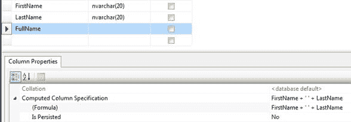

图 8:计算列

数据库中生成的列的另一个例子是当我们使用触发器来生成它的值时。您可以将服务器生成的列映射到实体，但是您必须告诉实体框架永远不要插入该属性。为此，我们使用[数据库生成属性](http://msdn.microsoft.com/en-us/library/system.componentmodel.dataannotations.schema.databasegeneratedattribute.aspx)和选项[数据库生成选项。计算出](http://msdn.microsoft.com/en-us/library/system.componentmodel.dataannotations.schema.databasegeneratedoption.aspx)。

代码清单 24

```cs
public string FirstName { get set; }

public string LastName { get set; }

[DatabaseGenerated(DatabaseGeneratedOption.Computed)]
public string FullName { get  protected set; }

```

由于属性永远不会被设置，所以我们可以将 setter 作为一个受保护的方法，并将其标记为`DatabaseGeneratedOption.Computed`，让 Entity Framework 知道它永远不应该尝试`INSERT`或`UPDATE`这个列。

通过这种方法，您可以使用对象的 LINQ 和实体的 LINQ 来查询`FullName`计算属性。

代码清单 25

```cs
//this is executed by the database.
var me = ctx.Resources.SingleOrDefault(x => x.FullName == "Ricardo Peres");

//this is executed by the process. 
var me = ctx.Resources.ToList().SingleOrDefault(x => x.FullName == "Ricardo Peres");

```

在这个例子中，`FullName`是`FirstName`和`LastName`列的串联，被指定为一个 SQL Server T-SQL 表达式，所以它从来没有被插入或更新的意思。

计算列可以是下列之一:

*   在插入时生成(`ValueGeneratedOnAdd`)
*   在插入或更新时生成(`ValueGeneratedOnAddOrUpdate`)
*   从不(`ValueGeneratedNever`)

从 EF 的当前版本开始，有些映射概念无法通过属性实现:

*   配置级联删除(请参见“级联”)
*   应用继承模式(参见“继承策略”)
*   级联
*   定义自有实体
*   定义复合主键

对于这些，我们需要求助于代码配置，这将在下面解释。

尽管属性映射可能很方便，但它也有一些缺点:

*   我们需要在我们的域模型中添加对定义属性的命名空间和程序集的引用(有时称为域污染)。
*   我们不能动态地改变事物；属性是静态定义的，不能在运行时更改。
*   我们没有一个集中的地方来执行我们自己的约定。

为了帮助解决这些限制，实体框架核心提供了一个额外的映射应用编程接口:代码或流畅映射。基于属性的映射的所有功能都存在，等等。让我们看看如何实现最常见的场景。

流畅或代码映射是在[模型构建器](http://msdn.microsoft.com/en-us/library/system.data.entity.dbmodelbuilder.aspx)类的实例上配置的，通常我们可以访问的地方是在[数据库上下文](http://msdn.microsoft.com/en-us/library/system.data.entity.dbcontext.aspx)的[模型创建](http://msdn.microsoft.com/en-us/library/system.data.entity.dbcontext.onmodelcreating.aspx)方法中。

代码清单 26

```cs
public class ProjectsContext : DbContext
{
  protected override void OnModelCreating(ModelBuilder modelBuilder)
  {
    //configuration goes here.

    base.OnModelCreating(modelBuilder);
  }
}

```

实体框架在初始化上下文时调用这个基础结构方法，在它已经自动映射了上下文中声明为`[DbSet<T>](http://msdn.microsoft.com/en-us/library/gg696460.aspx)`集合的实体类，以及它们引用的实体类之后。

下面是如何通过代码配置实体映射。

代码清单 27

```cs
//set the table and schema.
modelBuilder
  .Entity<Project>()
  .ToTable("project", "dbo");

//ignoring an entity and all properties of its type.
modelBuilder.Ignore<Project>();

```

这是映射单个属性的示例。请注意，通过让每个方法返回[模型构建器](http://msdn.microsoft.com/en-us/library/system.data.entity.dbmodelbuilder.aspx)实例，该应用编程接口允许将多个调用链接在一起。在本例中，我们将多个操作链接在一起，以设置列名、类型、最大长度和所需标志。这非常方便，可以说使代码更易读。

如果一个类没有出现在上下文集合属性中，您需要将它声明为一个实体(由 EF 识别)。

代码清单 28

```cs
  //ignore a
  property.
  modelBuilder 
    .Entity<MyClass>()
    .ToTable("MY_TABLE");

```

从 EF Core 2.0 开始，多个实体可以共享同一个表(表拆分)，不同的属性映射到每个实体。

主键和相关的生成策略设置如下:

代码清单 29

```cs
//setting a property as the key.
modelBuilder
  .Entity<Project>()
  .HasKey(x => x.ProjectId);

//and the generation strategy.
modelBuilder
  .Entity<Project>()
  .Property(x => x.ProjectId)
  .UseSqlServerIdentityColumn();

//composite keys
modelBuilder
  .Entity<CustomerManager>()
  .HasKey(x => new { x.ResourceId, x.CustomerId });

```

代替`UseSqlServerIdentityColumn`，你可以用`ForSqlServerUseSequenceHiLo`代替使用序列(高低算法)。

您可以在`OnModelCreating`方法中配置单个属性，包括忽略它们:

代码清单 30

```cs
//ignore a property.
modelBuilder
  .Entity<Project>()
  .Ignore(x => x.MyUselessProperty);

```

或者设置非默认值:

代码清单 31

```cs
//set the maximum length of a property.
modelBuilder
  .Entity<Project>()
  .Property(x => x.Name)
  .HasMaxLength(50);

```

设置属性的数据库属性:

代码清单 32

```cs
//set a property’s values (column name, type, length, nullability).
modelBuilder
  .Entity<Project>()
  .Property(x => x.Name)
  .HasColumnName("NAME")
  .HasColumnType("VARCHAR")
  .HasMaxLength(50)
  .IsRequired();

```

需要显式使用字段的名称和类型来映射字段:

代码清单 33

```cs
//map a field.
modelBuilder
  .Entity<Project>()
  .Property<String>("SomeName")
  .HasField("_someName");

```

请注意，视野并不重要——即使`private`也可以。

导航属性(引用和集合)定义如下。

代码清单 34

```cs
//a bidirectional many-to-one and its inverse with cascade.
modelBuilder
  .Entity<Project>()
  .HasOne(x => x.Customer)
  .WithMany(x => x.Projects)
  .OnDelete(DeleteBehavior.Cascade);

//a bidirectional one-to-many.
modelBuilder
  .Entity<Customer>()
  .HasMany(x => x.Projects)
  .WithOne(x => x.Customer)
  .IsRequired();

//a bidirectional one-to-one-or-zero with cascade.
modelBuilder
  .Entity<Project>()
  .HasOptional(x => x.Detail)
  .WithOne(x => x.Project)
  .IsRequired()
  .OnDelete(DeleteBehavior.Cascade);

//a bidirectional one-to-one (both sides required) with cascade.
modelBuilder
  .Entity<Project>()
  .HasOne(x => x.Detail)
  .WithOne(x => x.Project)
  .IsRequired()
  .OnDelete(DeleteBehavior.Cascade);

//a bidirectional one-to-many with a foreign key property (CustomerId).
modelBuilder
  .Entity<Project>()
  .HasOne(x => x.Customer)
  .WithMany(x => x.Projects)
  .HasForeignKey(x => x.CustomerId);

//a bidirectional one-to-many with a non-conventional foreign key column.
modelBuilder
  .Entity<Project>()
  .HasOne(x => x.Customer)
  .WithMany(x => x.Projects)
  .Map(x => x.MapKey("FK_Customer_Id"));

```

|  | 注意:配置关系时，您只需要配置一个端点。 |

并非所有属性都需要来自物理列。计算列是通过公式在数据库中生成的列(在这种情况下，它实际上不是物理存储的)；可以使用以下数据库生成选项来指定:

代码清单 35

```cs
modelBuilder
  .Entity<Resource>()
  .Property(x => x.FullName)
  .ValueGeneratedNever();

```

在这个例子中，`FullName`是`FirstName`和`LastName`列的串联，被指定为一个 SQL Server T-SQL 表达式，所以它从来没有被插入或更新的意思。

计算列可以是下列之一:

*   在插入时间(`ValueGeneratedOnAdd`)生成。
*   在插入或更新时间(`ValueGeneratedOnAddOrUpdate`)生成。
*   从不(`ValueGeneratedNever`)。

还可以为插入新记录时要使用的列指定默认值:

代码清单 36

```cs
modelBuilder
  .Entity<Resource>()
  .Property(x => x.FullName)
  .ForSqlServerHasDefaultValueSql("SomeFunction()");

```

这里，如果数据库是由实体框架创建的，那么 CREATE TABLE 语句中将包含一些函数。无法使用属性进行此配置。

在 2.0 版本中，引入了一个非常方便的特性:全局过滤器。全局过滤器在一些情况下很有用，例如:

*   **多租户代码**:如果我们有一列包含当前租户的标识符，我们可以自动按它过滤。
*   **软删除**:我们不删除记录，而是标记为已删除，并自动过滤掉。

全局过滤器是在 [OnModelCreating](https://docs.microsoft.com/en-us/ef/core/api/microsoft.entityframeworkcore.dbcontext#Microsoft_EntityFrameworkCore_DbContext_OnModelCreating_Microsoft_EntityFrameworkCore_ModelBuilder_) 方法中定义的，其配置是这样完成的:

代码清单 37

```cs
  protected override void OnModelCreating(ModelBuilder modelBuilder)
  {
    modelBuilder

  .Entity<Project>()

  .HasQueryFilter(x => x.IsDeleted == false);

    base.OnModelCreating(builder);
  }

```

这里我们说的是`Project`类型的实体，无论是在查询中加载还是从集合中加载(一对多)，都是根据其`IsDeleted`属性中的值自动过滤的。两个例外:

*   当一个实体被其 id(T0)显式加载时。
*   加载一对一或多对一相关实体时。

在 filter 子句中可以有任意条件，只要它可以由 LINQ 执行。对于多租户代码，您应该有类似这样的代码:

代码清单 38

```cs
  public string TenantId { get; set; }

  protected override void OnModelCreating(ModelBuilder builder)
  {
    builder

  .Entity<Project>()

  .HasQueryFilter(x => x.TenantId == this.TenantId);

    base.OnModelCreating(builder);
  }

```

英孚核心 2 的新功能是可以有配置类来存储实体的代码配置；这是组织代码的好方法。您需要从`IEntityTypeConfiguration<` T `>`继承并在那里添加您的映射代码:

代码清单 39

```cs
  public class ProjectEntityTypeConfiguration : IEntityTypeConfiguration<Project>
  {
    public void Configure(EntityTypeBuilder<Project> builder)
    {
      builder

  .HasOne(x => x.Customer)

  .WithMany(x => x.Projects)

  .OnDelete(DeleteBehavior.Cascade);
    }
  }

```

但是这些不会自动加载，所以您需要显式加载:

代码清单 40

```cs
  protected override void OnModelCreating(ModelBuilder modelBuilder)
  {
    modelBuilder.ApplyConfiguration(new ProjectEntityTypeConfiguration());
  }

```

实体框架要求所有实体都有一个标识符属性，该属性将映射到表的主键。如果这个主键是复合的，多个属性可以共同指定为标识符。

尽管实体框架不依赖于任何特定的数据库引擎，但它可以更好地与 SQL Server 配合使用。具体来说，它知道如何处理 [IDENTITY](http://technet.microsoft.com/en-us/library/ms186775.aspx) 列，这可以说是 SQL Server 世界中生成主键的最常见方式。直到最近，它还没有得到一些主要数据库引擎的支持，例如 Oracle。

按照惯例，每当 Entity Framework 遇到整数类型的主键(`Int32`或`Int64`)时，它将假设它是一个 [IDENTITY](http://technet.microsoft.com/en-us/library/ms186775.aspx) 列。生成数据库时，它将以值 1 开始，并使用 1 的递增步长。不可能改变这些参数。

|  | 提示:虽然类似的概念存在于其他数据库引擎中，但是实体框架只能在开箱即用的情况下使用身份。 |

如果标识符值不是由数据库自动生成的，则必须为要保存的每个实体手动设置。如果是`Int32`或`Int64`，并且要使用属性进行映射，那么用[数据库生成属性](http://msdn.microsoft.com/en-us/library/system.componentmodel.dataannotations.schema.databasegeneratedattribute.aspx)标记标识符属性，并将其传递给[数据库生成选项。无](http://msdn.microsoft.com/en-us/library/system.componentmodel.dataannotations.schema.databasegeneratedoption.aspx)。这将避免假定[身份](http://technet.microsoft.com/en-us/library/ms186775.aspx)的内置惯例。

代码清单 41

```cs
[Key]
[DatabaseGenerated(DatabaseGeneratedOption.None)]
public int ProjectId { get; set; }

```

如果您喜欢流畅的映射，请使用以下内容。

代码清单 42

```cs
protected override void OnModelCreating(ModelBuilder modelBuilder)
{
  modelBuilder
    .Entity<Project>()
    .HasKey(x => x.ProjectId);

  modelBuilder
    .Property(x => x.ProjectId)
    .ValueGeneratedNever();

  base.OnModelCreating(modelBuilder);
}

```

在这种情况下，您有责任分配一个数据库中尚不存在的有效标识符。这相当复杂，主要是因为并发访问和事务。一个流行的替代方法是对主键列使用`Guid`。您仍然需要自己初始化它的值，但是生成算法确保永远不会有两个相同的值。

代码清单 43

```cs
public Project()
{
  //always set the ID for every new instance of a Project.
  ProjectId = Guid.NewGuid();
}

[Key]
[DatabaseGenerated(DatabaseGeneratedOption.None)]
public Guid ProjectId { get; set; }

```

|  | 注意:当使用非整数标识符属性时，默认情况下不会由数据库生成它们，因此您可以安全地跳过 DatabaseGeneratedAttribute。 |

|  | 注意:将 Guids 用于主键的另一个好处是，您可以将不同数据库中的记录合并到同一个表中；记录永远不会有冲突的关键字。 |

另一种非常流行的标识符生成策略是高低(或高低)。当我们希望客户端预先知道标识符是什么，同时避免冲突时，这个非常有用。这里有一个简单的算法:

*   在启动时，或者当需求第一次出现时，ORM 向数据库请求下一个数值范围——高**部分——然后保留。**
*   ORM 已经配置了一些**low**来使用，或者它将继续生成新的，直到用完可用的数量(达到最大数量容量)。
*   当 ORM 必须插入一个数字时，它将**高**部分(该部分是为该实例保留的)与下一个**低**结合起来。ORM 知道最后一个是什么，只需添加 1。
*   当所有的**低点**耗尽时，ORM 进入数据库并保留另一个**高点**值。

有许多方法可以实现这种算法，但有点可悲的是，它使用序列来存储当前的高值。这意味着它只能与 SQL Server 2012 或更高版本一起使用，当然，这在当今可能不是一个大问题。

这是配置主键生成序列的方法:

代码清单 44

```cs
  .Entity<Resource>()
  .Property(x => x.FullName)
  .ForSqlServerUseSequenceHiLo("sequencename");

```

|  | 注意:指定的序列是在属性上设置的，而不是在主键上设置的，尽管属性应该是主键。 |

|  | 注意:序列名称是可选的；当您想要为每个实体指定不同的序列时，可以使用它。 |

|  | 提示:主键生成的序列不能由属性指定；你需要使用流畅的 API。 |

考虑下面的类层次结构。

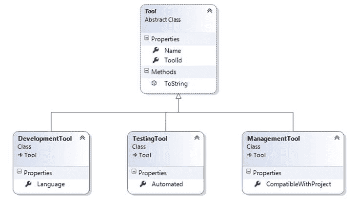

图 9:继承模型

在这个例子中，我们有一个抽象的概念`Tool`，以及它的三个具体表示:`DevelopmentTool`、`TestingTool`和`ManagementTool`。每个`Tool`必须是这些类型之一。

在面向对象的语言中，我们有类继承，这是关系数据库本身不支持的。我们如何将它存储在关系数据库中？

马丁·福勒在他的开创性著作《企业应用程序架构的模式》中描述了在关系数据库中保持类层次结构的三种模式:

*   **单表继承**或**每个类层次的表**:单个表用于表示整个层次；它包含所有类的所有映射属性的列。其中许多将是`NULL`，因为它们将只为一个特定的类而存在；一个区别列将存储一个值，该值将告诉实体框架特定记录将映射到哪个类。

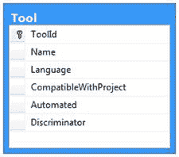

图 10:单表继承数据模型

*   **类表继承**或**每类表**:一个表将用于所有映射基类属性的列，并且所有具体类都将存在附加表；附加表将通过外键链接到基表。

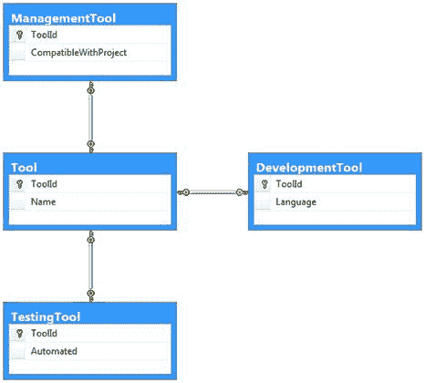

图 11:类表继承数据模型

*   **混凝土表继承**或**每个混凝土类的表**:每个混凝土类使用一个表，每个表都有所有映射属性的列，或者是特定的，或者是每个类继承的。

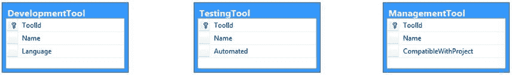

图 12:具体的表继承数据模型

你可以在[马丁的网站](http://martinfowler.com/eaaCatalog/index.html)上看到这些模式更详细的解释。现在，我给你们留下一些想法:

*   **单表继承**当涉及到从基类进行查询时，提供最快的性能，因为所有信息都包含在单个表中。然而，如果您在所有的类中都有很多属性，这将是一个很难阅读的问题，并且您将有很多“可空”的列。在所有的具体类中，所有的属性都必须是可选的，因为它们必须允许空值。这是因为不同的实体将存储在同一个类中，并且不是所有的实体都共享相同的列。
*   **类表继承**提供了表整洁和性能之间的良好平衡。查询基类时，需要一个`LEFT JOIN`将派生类中的每个表连接到基类表中。记录将存在于基类表中，并且恰好存在于一个派生类表中。
*   **基类查询的具体表继承**需要几个`UNION`，每个派生类的每个表一个，因为实体框架事先不知道在哪个表中查找。这意味着您不能使用`IDENTITY`作为标识符生成模式，也不能使用可能为任意两个表生成相同值的模式。如果实体框架发现两个记录具有相同的标识，它会感到困惑。此外，您将拥有相同的列—来自基类的列，在所有表上重复。

就实体框架而言，真的没有什么区别；类自然是多态的。然而，实体框架核心 1.1 只支持单表继承模式。请参见 0，了解如何对类层次结构执行查询。下面是我们如何应用单表继承:

代码清单 45

```cs
public abstract class Tool
{
  public string Name { get; set; }

  public int ToolId { get; set; } 
}

public class DevelopmentTool : Tool
{
  //String is inherently nullable.
  public string Language { get; set; }
}

public class ManagementTool : Tool
{
  //nullable Boolean
  public bool? CompatibleWithProject { get; set; }
}

public class TestingTool : Tool
{
  //nullable Boolean
  public bool? Automated { get; set; }
}

```

如你所见，你没什么特别需要做的。默认策略是单表继承。不过，有一点很重要:因为每个派生类的所有属性都将存储在同一个表中，所以它们都需要是可空的。很容易理解为什么。表中的每条记录都可能对应于任何一个派生类，它们的特定属性只对它们有意义，对其他的没有意义，所以它们可能是未定义的(`NULL`)。在本例中，我已经将派生类中的所有属性声明为可空。请注意，我没有在这里映射鉴别器列(对于单表继承模式)；它只属于数据库。

一些注意事项:

*   派生类中的所有属性都需要标记为可空，因为它们都将存储在同一个表中，并且可能不存在于所有具体的类中。
*   单一表继承模式将按照惯例应用；没有必要明确说明。
*   其他继承映射模式将出现在实体框架核心的下一个版本中。

在撰写本书时，实体框架核心的当前版本(1.1)带有许多约定。约定规定了当模型的某些方面没有被明确定义时，EF 将如何配置它们。

内置约定是:

*   从带有公共获取器的 [DbContext](http://msdn.microsoft.com/en-us/library/system.data.entity.dbcontext.aspx) 派生类中的 [DbSet < T >](http://msdn.microsoft.com/en-us/library/gg696460.aspx) 集合中暴露的所有类型都被自动映射。
*   出现在 [DbContext](http://msdn.microsoft.com/en-us/library/system.data.entity.dbcontext.aspx) 派生类的 [DbSet < T >](http://msdn.microsoft.com/en-us/library/gg696460.aspx) 属性中的所有类都被映射到具有该属性名称的表中。
*   所有没有 [DbSet < T >](http://msdn.microsoft.com/en-us/library/gg696460.aspx) 属性的类型都将被映射到具有类名的表中。
*   除非明确排除，否则带有 getter 和 setter 的所有映射类型的所有公共属性都会自动映射。
*   不需要可空类型的所有属性；那些来自不可空类型(中的值类型。NET)是必需的。
*   整数类型的单个主键将使用`IDENTITY`作为生成策略。
*   自动发现与其他实体的关联，外键列是通过组合外部实体名称及其主键来构建的。
*   如果关系设置为`required`，则只要子实体的父实体为，子实体就会从数据库中删除。

目前，没有简单的方法来添加我们自己的自定义约定或禁用现有约定，这很烦人，但在未来的版本中会有所改进。但是，您可以通过构建一个在`ModelBuilder`实例中配置值的应用编程接口来实现自己的机制。在这种情况下，您应该将这个 API 插入到`OnModelCreating`虚拟方法中。

当然，我们总是可以使用属性覆盖传统的表名和列名。

代码清单 46

```cs
//change the physical table name.
[Table("MY_PROJECT")]
public class Project
{
  //change the physical column name.
  [Column("ID")]
  public int ProjectId { get; set; }
}

```

经常需要的一件事是生成实体框架核心可以直接使用的实体类型的能力。当我们有一个包含许多表的现有大型数据库时，通常会发生这种情况，因为手动创建这些类会很耗时。这并不完全是代码优先方法的目的，但是我们有这个选择。你应该感谢我们这样做——想象一下如果你必须手工生成数百个类会是什么样子。

为了生成您的类，您需要运行以下命令:

`dotnet ef dbcontext scaffold “Data Source=.\SQLEXPRESS; Initial Catalog=Succinctly; Integrated Security=SSPI” Microsoft.EntityFrameworkCore.SqlServer`

|  | 注意:请确保用特定于您的系统的连接字符串替换该连接字符串。 |

执行此命令后，实体框架将为数据库中定义了主键的所有表生成类。因为这些是作为部分类生成的，所以您可以轻松地扩展它们，而不会有在下一代中丢失更改的风险。