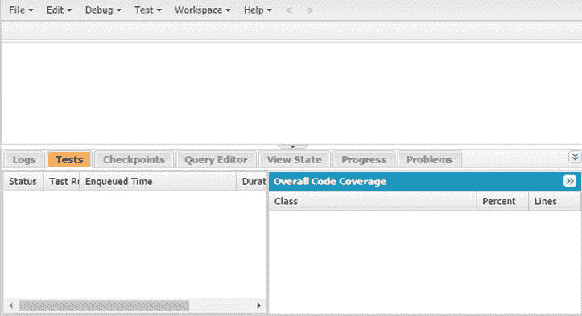
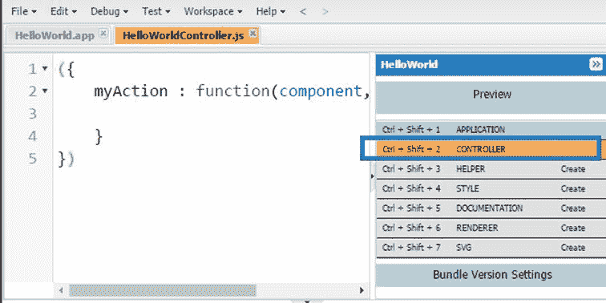
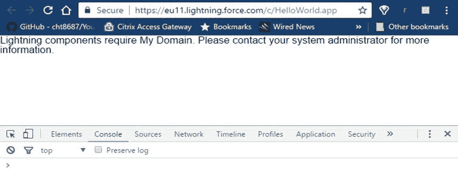
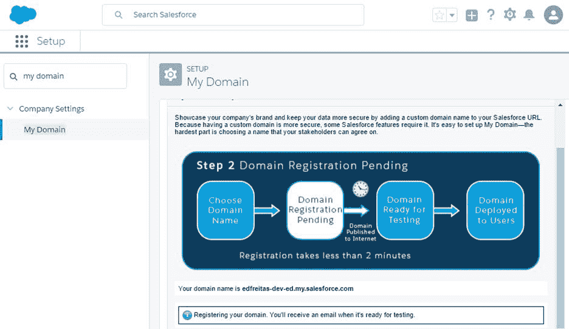
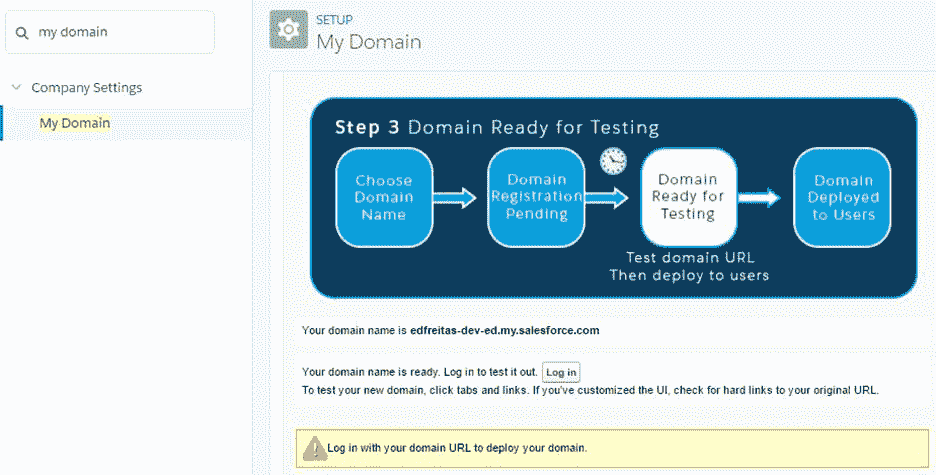
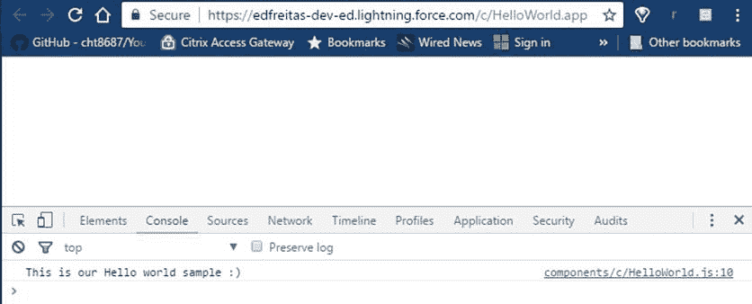

# 五、Lightning 应用基础

## 两种网络架构

最初开发 Salesforce CRM 应用程序时，Visualforce 是驱动系统的主要(也是唯一)用户界面网络架构。它在今天仍然很重要，平台上的很多客户每天都在使用它。

Visualforce 是这样工作的: [DOM](https://en.wikipedia.org/wiki/Document_Object_Model) 的 HTML 是使用 Visualforce 标记在服务器上构建的，不需要 JavaScript。所以，服务器正在做渲染用户界面的艰苦工作。大多数用户交互都会向服务器发出请求，并要求服务器返回全部或部分页面。

使用基于开源 [Aura](http://www.auraframework.org/) 框架的 Lightning，直接在客户端使用 JavaScript 构建和修改 DOM。有了 Aura，JavaScript 处理的用户交互只向服务器请求它需要的数据(如果有的话)，这要高效得多，因为它减少了服务器上的负载，消耗的数据也少得多。

关于 Lightning 的一个很酷的事情是，你需要使用 JavaScript 来超越琐碎的应用程序，这是大多数现代全栈和前端开发人员都很欣赏的，而对于 Visualforce，不需要 JavaScript(尽管它仍然可以使用)。

由于 Lightning 体验无疑是 Salesforce 和 Force.com 应用的发展方向，这也是我们将探索的方向。那么，让我们来看看如何手动创建一个非常基本的 Lightning 应用程序。

## Lightning 中的你好世界

为了理解 Lightning 的基础知识，最好创建一个小而简单的 Hello World 示例。为此，我们需要打开**开发人员控制台**。

要打开它，点击 Lightning 界面顶部的**档位**图标。这将显示带有**设置**和**开发者控制台**选项的弹出菜单。


图 5-a:开发人员控制台选项

单击**开发人员控制台**选项将其打开。默认情况下，它会作为新的弹出浏览器窗口打开。但是，我建议您将其作为一个新的浏览器选项卡打开，这样会更方便一些。

打开后，**开发人员控制台**看起来如图 5-b 所示，可以看到，它类似于一个小型的开发或调试环境，尽管它是在浏览器中运行的。



图 5-b:开发者控制台

要创建我们的 Hello World 应用程序，请单击**文件** > **新建** > **Lightning 应用程序**。


图 5-c:开发人员控制台菜单

完成后，将出现一个浏览器中的弹出窗口，如图 5d 所示


图 5-d:创建新的 Lightning 示例应用程序

输入**名称**和**描述**，然后点击**提交**开始。完成后，您将在**开发人员控制台**上看到以下 Aura 应用程序标签。


图 5-e:新创建的 Lightning 示例应用程序

让我们创建一个`handler`标签，等待`init`事件，该事件在页面完全初始化时发生。当该事件发生时，我们将调用控制器的`doInit`方法。

代码清单 5-a:初始化事件的先兆处理程序

```js

<aura:handler
  name="init" value="{!this}"
  action="{!c.doInit}" />

```

让我们将这段代码粘贴到 Aura 应用程序标签中。然后在**文件**菜单下，点击**保存**。


图 5-f:光环处理器标签

接下来，我们需要编辑控制器。为此，请转到**开发人员控制台**屏幕的右侧，单击**控制器**选项卡，如图 5-g 所示



图 5-g:helloworldcontroller . js 文件

这将创建一个带有默认`myAction`函数的控制器 JavaScript 文件。目前，只需将`myAction`功能名称替换为`doInit`。此外，我们不需要`event`和`helper`参数，因此它们可以从功能中移除。

在`doInit`功能的主体内，添加一条`console.log`语句，然后点击**文件**菜单，然后**保存**。你应该有类似图 5-h 的东西


图 5-h:修改后的 HelloWorldController.js 文件

为了查看我们刚刚完成的工作，点击屏幕右侧的**预览**标签，就在控制器标签的上方。



图 5-i:预览地狱世界 Lightning 应用程序

哎呀！这里发生了什么？在预览我们的应用时，我们收到了一条消息，说 Lightning 组件需要**我的域**。这是什么意思？

嗯，**我的域名**是 Lightning 体验中**公司设置**下的一个设置，在**快速查找**搜索框中输入**我的域名**即可。

就我而言，我输入了我的域名( *edfreitas* )并提交了它。Force.com 还会检查域名的可用性，也就是说，它没有被其他人占用。它看起来像图 5-j



图 5-j:我的域设置

请注意，注册域名可能需要几分钟的时间。一旦域准备好，您将收到一封电子邮件，声明它可供使用。

在我们再次预览我们的 Hello World Lightning 应用程序之前，我们需要使用我们的新域登录。如果我们刷新**我的域名**设置页面，点击**登录**，就可以做到这一点。



图 5-k:带有登录按钮的我的域设置

单击**登录**后，会出现一条弹出消息，询问您是否要导航到该域的特定网址。


图 5-1:导航到域的网址

点击**打开**按钮，您将被重定向到 Force.com 登录页面，在那里您将被要求使用您的用户名和密码登录。然后点击**登录**。

登录后，您将再次被重定向到**我的域**页面，您将被要求向用户部署该域。这是通过点击**部署到用户**来完成的。


图 5-m:向用户部署域

当您点击**部署到用户**时，您的域将被部署，我们终于准备好预览我们的 Hello World 应用程序了。

为了预览一个简单的示例应用程序，这是相当多的步骤。但是，这是所有 Lightning 应用程序都必须经历的一次性设置过程。与其在书的开头或前几章强调这种方式，我认为现在这样做更有意义。

如果我们回到**开发者控制台**浏览器选项卡或窗口，点击**预览**选项卡，我们现在将看到我们所做的结果。



图 5-n:我们的地狱世界应用程序正在运行

该应用已执行**控制台. log** 语句。请注意它是如何在我注册的域下运行的，这就是为什么我们要经历所有这些步骤。

## 总结

在本章中，我们探讨了如何使用**开发者控制台**手动创建 Hello World Lightning 应用程序。我们还注册了一个域名，该域名将托管我们将要进行的任何进一步的 Lightning 开发。

我们还需要更深入地了解 Lightning 组件是如何工作的，以及它们如何与 Apex 控制器和自定义对象交互。这就是我们接下来要做的。