# 六、深入 Lightning

## 简介

在前两章中，我们已经为理解 UI 在 Force.com 的工作方式打下了基础，特别是 Lightning 体验。

在本章中，我们将在前面的基础上，通过构建一个 Lightning 应用程序，开始真正探索 Force.com 内部 JavaScript 开发的所有方面，我们可以使用前面几章中创建的一个定制对象。

项目的完整源代码可以在[这里](https://github.com/SyncfusionSuccinctlyE-Books/Force.com-Succinctly)下载。所以，让我们开始探索吧。

## 开发者的视角

Force.com 世界的 Lightning 对不同的人来说意味着许多不同的事情。对于用户来说，这意味着全新的用户界面和工作体验，但对于开发人员来说，这可能意味着完全不同的东西。那么，Lightning 到底是什么？

有 Lightning 应用、Lightning 数据服务、Lightning 过程、Lightning 同步、Lightning 行动、Lightning 体验、Lightning 连接、Lightning 组件，甚至可能还有更多服务。

如今，Force.com 的一切都围绕着“Lightning”这个时髦词，尽管这些技术可能并不完全相关，尽管可能会造成混乱。无论如何，这个流行语相当吸引人，而且似乎很畅销。

话虽如此，对于开发人员和高级业务用户来说，能够区分什么是营销术语和什么是实际技术是很重要的。

我们关心的部分是实际的**Lightning 组件**，基于 Aura UI 框架。这些是 Lightning 应用的基本构件，构成了 Lightning 的整体外观和感觉——体验。

本质上，Lightning 是一个以 Aura 为中心的现代且响应迅速的单页应用程序(SPA)框架，在 Force.com 的多租户环境中运行。

为了全面了解什么是 Lightning 组件，我强烈建议您学习 Lightning 组件基础培训课程，该课程可以在[这里](https://trailhead.salesforce.com/modules/lex_dev_lc_basics)找到。

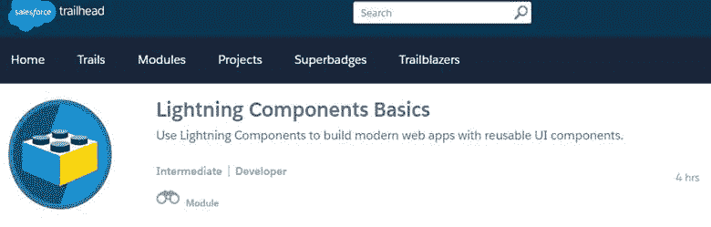

图 6-a:Lightning 组件基础培训课程

## Lightning 束

我们将使用**开发人员控制台**手动创建一个 Lightning 应用程序，我们称之为快速续订。

这个应用程序将使用我们之前创建的**更新**自定义对象，但是我们将从头开始创建 UI，添加样式和 JavaScript 控制器，我们还将使用 Apex 语言的服务器端控制器。这就是所谓的捆绑包。

## Lightning 检查员

Lightning 检查器是一个 Chrome 扩展，在我们调试时很有帮助。去 Chrome 应用商店搜索 [Salesforce Lightning 扩展](https://chrome.google.com/webstore/detail/salesforce-lightning-insp/pcpmcffcomlcjgpcheokdfcjipanjdpc)，点击**添加到 CHROME** 进行安装。这不是必须的，而是一种享受。

出现提示时，点击**添加分机**。这将安装扩展，稍后可能会派上用场。

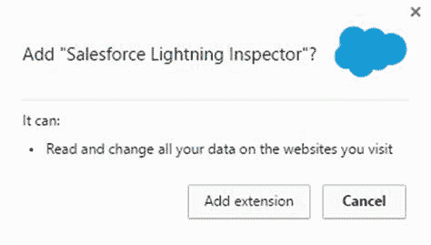

图 6-b:添加 Salesforce Lightning 检查器

## 快速续订概述

我们现在将使用 Lightning 组件来构建一个名为快速更新的小应用程序，它将基于我们之前创建的**更新**自定义对象。

该应用程序的总体目标是提供对**更新**记录的快速访问，它将使用两个 Lightning 组件，这两个组件将通过事件进行通信。这些组件将是:`Search`和`RenewalsList`。

在本应用的整个创建过程中，您将学习如何:

*   创建一个向 Lightning 应用程序公开数据的顶点控制器
*   创建一个照明应用程序，我们在上一章中简单介绍过
*   创建 Lightning 组件
*   创建和处理 Lightning 事件
*   在 Lightning 应用程序中使用一些静态资源
*   使用事件在 Lightning 组件之间交换信息

听起来很棒，对吧？让我们马上开始建造它。

## 静态资源

我想大多数人都会同意，现在任何创建应用程序的人都希望应用程序看起来很好。一个应用程序不仅需要能够正常工作和发挥功能，还需要吸引眼球，这就是为什么使用静态资源会派上用场。

一个最广为人知和最广泛使用的前端框架是 [Bootstrap](http://getbootstrap.com/) ，用于构建外观令人敬畏且响应迅速的网络应用程序。

然而，我们需要使用一个定制的 Bootstrap 版本来匹配[Lightning 设计系统](https://www.lightningdesignsystem.com/)指南。这个定制版的 Bootstrap 可以在[这里](http://developer.salesforce.org/bootstrap-sf1/)找到。

将此自定义版本的引导程序下载并解压缩到您计算机上的本地文件夹中。在您的 Force.com 组织中，进入**设置**，然后在**快速查找**搜索框中，键入单词**静态**。

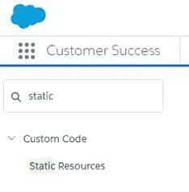

图 6-c:静态资源选项

接下来，点击**静态资源**选项。然后，您将看到以下屏幕。

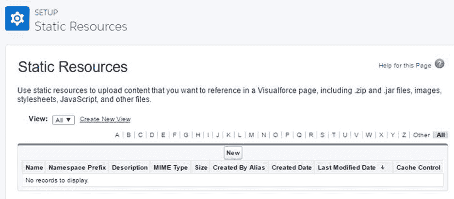

图 6-d:静态资源主设置页面

点击**新建**。然后，您将看到以下详细信息屏幕。

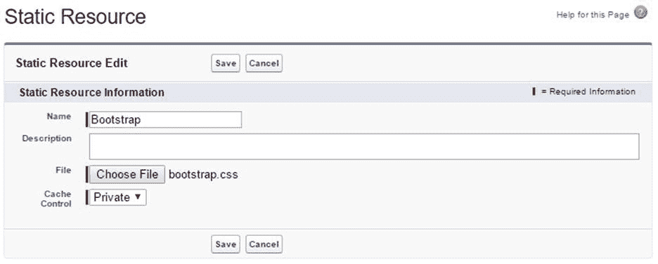

图 6-e:静态资源详细信息页面

指定 **Bootstrap** 作为**静态资源**的名称，点击**选择文件**—选择解压文件夹 **dist/css** 下的 **bootstrap.css** 文件。最后，点击**保存**。

我们现在可以在 Lightning 应用程序中使用定制的引导框架。接下来我们需要做的是创建我们的 Apex 控制器。

## 续订控制器

我最喜欢 Force.com 的一点是处理数据有多容易。他们在使访问对象中包含的数据变得极其容易和方便方面做了大量的工作。

我们现在将创建一个 Apex 控制器，它允许我们获取**续订**记录，并通过使用**续订**T4】名称字段进行搜索。Apex 控制器基本上是一个 Apex 类。

为了创建这个类，从 Lightning 体验屏幕顶部的**档位**选项，在一个新的浏览器选项卡中打开**开发者控制台**，这样更容易操作。

在**开发者控制台**内，点击**文件** > **新建** > **顶点类**。出现提示时将其命名为更新控制器，并单击**确定**。默认情况下，您会看到如图 6-f 所示的内容

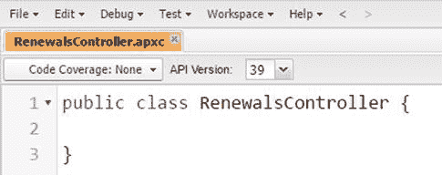

图 6-f:默认的类代码

让我们对这段代码进行一些更改，使其与 Lightning 兼容。

代码清单 6-a:修改后的类代码

```js

public
  with sharing class RenewalsController {

  @AuraEnabled

  public static List<Renewal__c> FindAll() {

  return [SELECT Name, Client__c, Amount__c, Currency__c, 

  Expired__c, LastModifiedById from Renewal__c LIMIT 50];

  }
  }

```

首先，请注意`RenewalsController`类现在已经被设置为`public with sharing`、**、**，并且我们还添加了一个名为`FindAll`的`static`方法，该方法将返回所有`Renewal`记录。

用 Apex 查询数据库(对象记录)非常简单， **Salesforce 对象查询语言** (SOQL)语句可以无缝嵌入到 Apex 代码中。如您所见，如果您熟悉 SQL，那么使用 SOQL 您会有宾至如归的感觉。注意如何使用`__c`后缀访问`Renewal`对象及其字段。

在。NET 世界中，不可能直接在 C# 代码中嵌入全功能 SQL 语句作为本机语言指令——必须使用 ADO.NET、LINQ、实体框架或其他库才能与关系数据库交互。

使用 Force.com，SOQL 直接在 Apex 语言环境中执行——这非常方便、有表现力且功能强大。

另一个值得注意的有趣的事情是`FindAll`方法标有`@AuraEnabled`注释，这表明它可以在一个 Lightning 应用程序中使用。对于任何有 C# 或 Java 背景的开发人员来说，这段代码应该看起来非常简单。

现在，让我们向这个类添加另一个方法，以便通过名称找到一个`Renewal`记录。该类现在将如下所示:

代码清单 6-b:扩展的类代码

```js

public
  with sharing class RenewalsController {

  @AuraEnabled

  public static List<Renewal__c> FindAll() {

  return [SELECT Name, Client__c, Amount__c, Currency__c, 

  Expired__c, LastModifiedById from Renewal__c LIMIT 50];

  }

  @AuraEnabled

  public static List<Renewal__c> FindByName(String sKey) {

  String n = '%' + sKey + '%';

  return [SELECT Name, Client__c, Amount__c, Currency__c, 

  Expired__c, LastModifiedById FROM Renewal__c WHERE Name 

  LIKE :n LIMIT 50];

  }
  }

```

请注意，我们添加了一个名为`FindByName`的新静态方法，它根据代表**续订名称**的字段`Name`过滤掉记录。请注意不寻常的`:`语法，以便引用 SOQL 语句中的`n`变量。

还要注意这两个查询是如何被限制为只返回前 50 条记录的，因为这提高了性能。不要忘记点击**文件** > **保存**选项以保存这些代码更改。

## 创建 Lightning 应用&主布局

现在我们已经创建了 Apex 控制器，它将负责使用 SOQL 返回数据，现在我们需要实际创建 Lightning 应用程序，并使用 Bootstrap 定义基本布局。

在**开发者控制台**中，点击**文件** > **新建** > **Lightning 应用**。使用快速续订作为捆绑包名称。现在让我们实现下面的标记代码。

代码清单 6-c:布局标记代码

```js

<aura:application
  >

  <link href='/resource/Bootstrap/' rel="stylesheet"/>

  <div class="navbar navbar-default navbar-static-top"

  role="navigation">

  <div class="container">

  <div class="navbar-header">

  <a href="#" class="navbar-brand">Quick
  Renewals</a>

  </div>

  </div>

  </div>

  <div class="container">

  <div class="row">

  <div class="col-sm-12">

  Renewals List Goes Here

  </div>

  </div>

  </div>
  </aura:application>

```

让我们快速看看我们刚刚在这里做了什么。链接标签引用了我们之前作为**静态资源**上传的**引导**样式表。

Lightning 应用程序可以包括 Lightning 组件和常规的 HTML 标记。上面的代码包含引用光环应用程序标签中包含的**引导**类的常规 HTML 标记。

点击**开发者控制台**右侧的**预览**(或**更新预览**)选项，预览我们已经完成的工作。

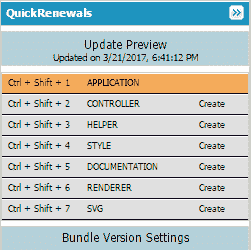

图 6-g:快速续订选项

当您点击它时，您将在一个新的浏览器选项卡中看到以下内容(参见图 6-h)。请注意，网址以**结尾。app** 扩展。

该网址的域与我们在上一章创建 Hello World 示例时定义的域相同。

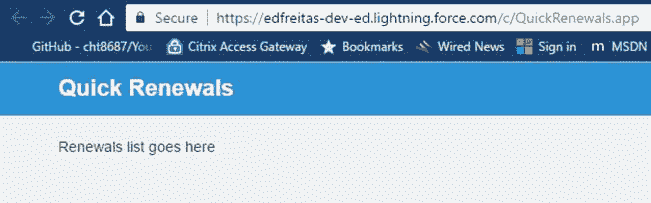

图 6-h:快速续订预览

似乎我们正在取得进展，我们的应用程序正在成形。让我们继续。

## 创建更新列表组件

创建主布局后，现在让我们将注意力转移到创建 Lightning 组件上，该组件将负责**续订**列表，然后我们将该列表添加到我们的快速续订应用程序中。

我们将通过使用**开发人员控制台**来做到这一点，我们将探索如何使用组件属性和事件处理程序来将该组件添加到我们的应用程序中。所以，让我们继续创建我们的组件。

点击**文件** > **新建** > **Lightning 组件**并指定更新列表作为组件名称。按如下方式实现代码。不选中可选配置复选框。

代码清单 6-d:更新列表标记代码

```js

<aura:component
  controller="edfreitas.RenewalsController">

  <aura:attribute name="renewals"
  type="Renewal__c[]"/>

  <aura:handler name="init" value="{!this}"
  action="{!c.doInit}" />

  <ul class="list-group">

  <aura:iteration items="{!v.renewals}"
  var="renewal">

  <li class="list-group-item">

  <a href="{! '#renewal/' + renewal.Name }">

  <p>{!renewal.Name }</p>

  </a>

  </li>

  </aura:iteration>

  </ul>
  </aura:component>

```

现在我们来关注第一行，具体来说就是`aura:component`标签的`controller`属性。`RenewalsController`必须属于一个命名空间，在我这里是: *edfreitas* 。

Force.com 的命名空间是所有 Salesforce 组织的全球唯一标识符。命名空间不区分大小写，最大长度为 15 个字母数字字符。

我们需要为我们的应用程序创建一个名称空间——让我们马上这样做，然后回到我们的组件。

## 创建命名空间

让您的**开发人员控制台**浏览器选项卡保持打开，以便我们可以很快回到我们的组件。

如果您的 Lightning 体验主屏幕没有在其他浏览器选项卡上打开，请将其打开。然后点击**档位**选项，然后点击**设置**。

在**快速查找**搜索框中，输入**包**字样。从结果中，点击**包装管理器**。这将向您显示以下屏幕。

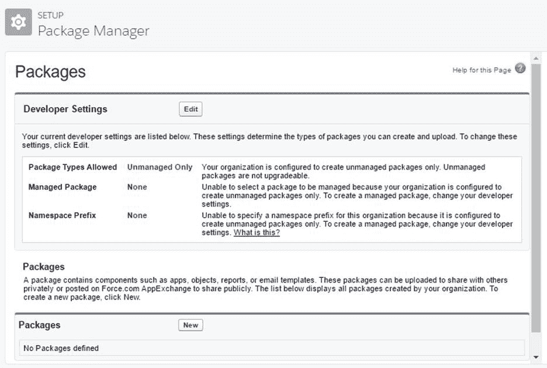

图 6-i:包管理器

点击**编辑**。然后，您将看到以下信息。

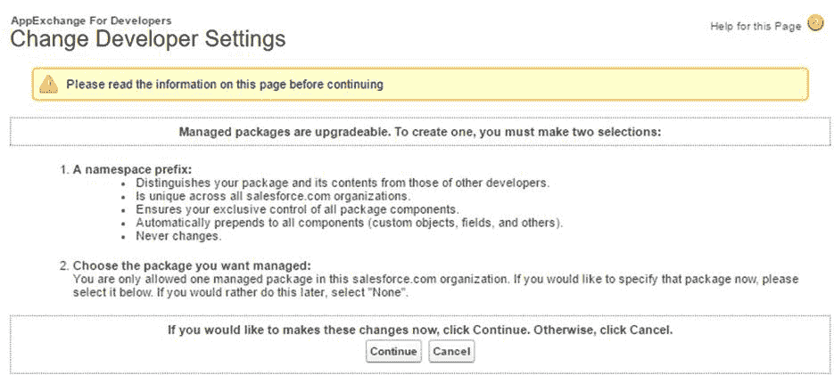

图 6-j:更改开发人员设置

点击**继续**。完成后，您将被要求输入一个**名称空间前缀**，并通过点击**检查可用性**按钮来检查它是否可用。

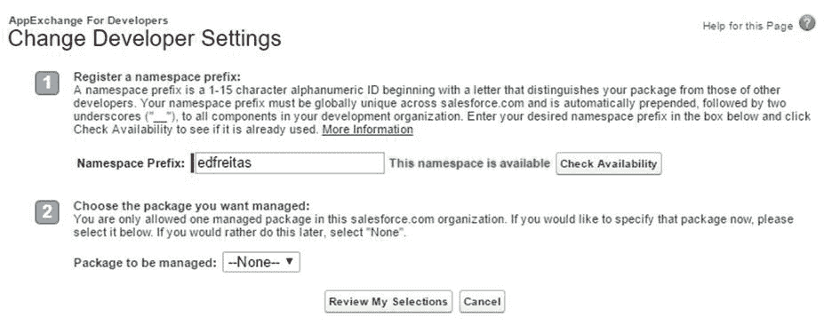

图 6-k:更改开发人员设置(名称空间前缀)

当名称空间可用时，只需点击**查看我的选择**。最后，您将看到以下屏幕。

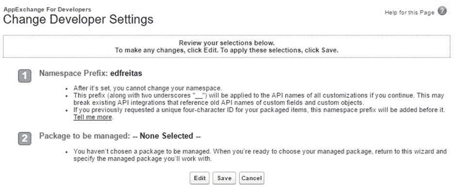

图 6-1:更改开发人员设置(查看选择)

点击**保存**按钮，完成命名空间创建。包管理器**T3 现在将如图 6-m 所示**

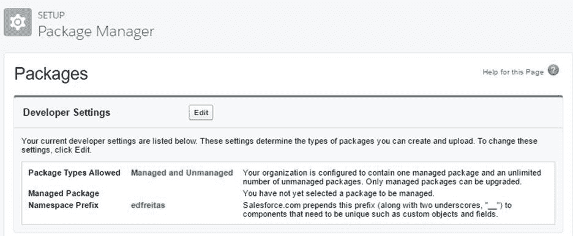

图 6-m:更新的包管理器设置

请注意，当您添加名称空间**、**时，现在所有自定义对象和字段的实际名称前面都会有名称空间名称。在我的例子中，我的将有一个单词*作为前缀。*

例如，这就是`Renewal`对象现在在内部的调用方式:`edfreitas__Renewal__c`。

`Amount__c`自定义字段现在将为`edfreitas__Amount__c`。这仅适用于自定义对象和字段。

然而，我们可以继续在 Apex 代码中使用初始名称，而不需要在调用对象或字段时使用命名空间名称。

## 启用调试模式的 Lightning 组件

在 Lightning 体验屏幕上的**快速查找**搜索框中，输入**Lightning 组件**字样，然后点击生成的选项。这将带您进入以下屏幕。

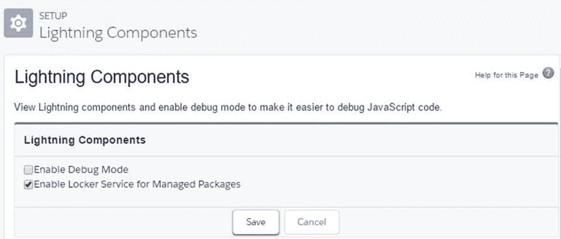

图 6-n:Lightning 组件设置选项

选择**启用调试模式**复选框，然后点击**保存**。在开发人员控制台上调试 JavaScript 代码时，该选项可能会派上用场。

## 继续更新列表组件

现在我们已经创建了名称空间并选择了**启用调试模式**选项，我们现在可以继续开发`RenewalsList`组件了。

但是在我们添加任何额外的功能之前，让我们通过将代码分成小块并理解每个部分来检查代码清单 6-d 中的代码。

代码清单 6-e:更新列表标记代码(第 1 部分)

```js

<aura:component
  controller="edfreitas.RenewalsController">

```

分配给组件的控制器是指我们之前写的服务器端 Apex 控制器。这里我们必须指定名称空间。

代码清单 6-f:更新列表标记代码(第 2 部分)

```js

<aura:attribute
  name="renewals" type="Renewal__c[]"/>

```

`renewals`属性被定义为保存从服务器返回的更新对象列表`(Renewal__c)`。

代码清单 6-g:更新列表标记代码(第 3 部分)

```js

<aura:handler
  name="init" value="{!this}"
  action="{!c.doInit}" />

```

`init`处理程序被定义为在组件初始化时执行一些代码。这段代码(`doInit`)是在组件的客户端控制器中定义的，您将在下一步中实现它。

代码清单 6-h:更新列表标记代码(第 4 部分)

```js

<aura:iteration
  items="{!v.renewals}" var="renewal">

```

`aura:iteration`标记用于遍历从服务器返回的`renewal`对象列表，并为每个`renewal`记录创建一个`<li>`。注意`<aura:iteration>`和`</aura:iteration>`标签。

代码清单 6-i:更新列表标记代码(第 5 部分)

```js

<a
  href="{! '#renewal/' + renewal.Name }">

```

更新数据周围的`<a href="{! '#renewal/' + renewal.Name }">`锚标签被定义为将页面标签设置为`#renewal/`，后跟更新记录的名称。

稍后，您可能希望创建一个`RenewalDetails`组件，该组件将使用该标签来显示关于该特定续订记录的详细信息。

我们不会创建这个`RenewalDetails`组件，但这可能是您稍后要做的有趣的事情。

以防你还没有保存代码，点击**文件** > **保存**保存你最新的修改。

## 客户端控制器

接下来我们需要做的是实现客户端控制器。在**开发者控制台**的右侧，点击**控制器**选项。

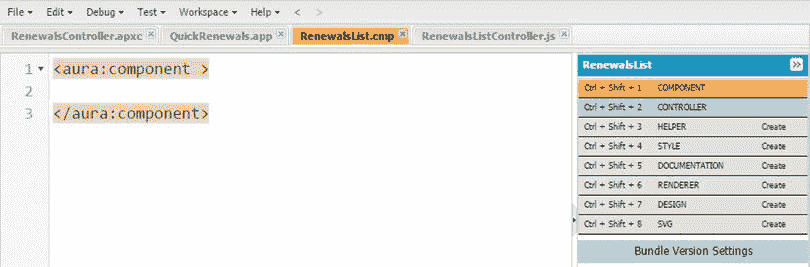

图 6-o:更新列表组件捆绑包选项

当您这样做时，将使用以下默认代码自动创建 RenewalsListController.js 文件。

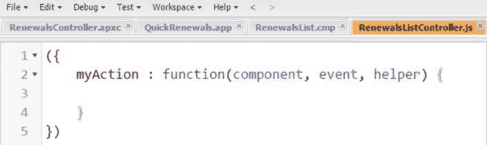

图 6-p:更新列表控制器文件

让我们如下实现客户端控制器代码。

代码清单 6-j:更新列表标记代码(第 5 部分)

```js

({

  doInit : function(component, event) {

  var action = component.get("c.FindAll");

  action.setCallback(this, function(a) {

  component.set("v.renewals", a.getReturnValue());

  });

  $A.enqueueAction(action);

  }    
  })

```

这个控制器有一个单一的功能叫做`doInit`。这是组件初始化时调用的函数。

代码做的第一件事是在组件的服务器端控制器中获取对`FindAll`方法的引用(我们之前编写的 Apex 代码)，并将其存储在`action`变量中。

因为对服务器的`FindAll`方法的调用是异步的，所以我们注册一个回调函数，当调用返回时执行。在回调函数中，我们只需将续订记录列表分配给组件的`renewals`属性。

`$A.enqueueAction(action)`向服务器发送请求。更准确地说，它将调用添加到异步服务器调用队列中。这是 Lightning 的一个优化特性。

不要忘记点击**文件** > **保存**以保存任何代码更改。

## 向应用程序添加更新列表

在**开发人员控制台**中，让我们回到快速续订应用程序。

如果选项卡在**开发者控制台**中不再可见，请转到**文件** > **打开 Lightning 资源，**然后选择**快速更新** > **应用程序**。最后，点击**打开选中的**。

现在 QuickRenewals.app 文件已经打开，让我们修改容器`div`并用下面的代码替换旧代码。注意现在我们如何引用命名空间来调用`RenewalsList`组件。

代码清单 6-k:容器分区标记代码

```js

<div
  class="container">

  <div class="row">

  <div class="col-sm-12">

  <edfreitas:RenewalsList />

  </div>

  </div>
  </div>

```

现在，点击**预览**或**更新预览**(在屏幕右侧可见)。如果您之前至少添加了一条`Renewal`记录，您应该会看到类似这样的内容。


图 6-q:快速续订应用程序预览

您可能会问自己，在调用我们的 RenewalsList 组件时，我们是否真的需要命名空间——答案是肯定的。如果标签是 **< RenewalsList / >** ，预览时会出现如下错误。

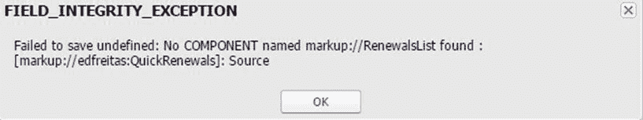

图 6-r:字段完整性异常

所以是的，我们确实需要使用命名空间。现在我们已经将`RenewalsList`组件添加到我们的快速续订应用程序中，让我们创建`Search`组件。

## 搜索组件

是时候给我们的应用一些基本的搜索功能了。现在，让我们创建一个组件，允许我们按名称搜索续订。

我们可能已经将组件添加到了`RenewalsList`组件中，但是这会限制组件的可重用性——所以最好将它们作为单独的组件，因为这样会使代码更加模块化和易于管理。

那么，如果两个组件都要独立，我们如何确保它们相互通信呢？问得好——这可以通过使用事件来实现。

## 关键变更事件

Lightning 事件使组件之间能够通信。我们需要实现一个事件，负责在搜索关键字改变时发出通知。所以，让我们开始吧。

在**开发者控制台**中，点击**文件** > **新建** > **Lightning 事件**，键入 KeyChange 作为捆绑包名称。让我们如下实现代码。

代码清单 6-1:密钥交换事件

```js

<aura:event
  type="APPLICATION">

  <aura:attribute name="sKey" type="String"/>
  </aura:event>

```

这个事件有一个论点，叫做`sKey`。不要忘记点击**文件** > **保存**以保存任何更改。

## 创建搜索组件

在**开发者控制台**中，点击**文件** > **新建** > **Lightning 组件**并注明搜索为捆绑包名称。让我们如下实现组件代码。

代码清单 6-m:搜索组件

```js

<aura:component>

  <input type="text" class="form-control" 

  onkeyup="{!c.KeyChange}" placeholder="Search"/>
  </aura:component>

```

这是一个只有一个输入字段的组件。当用户输入字符时，`onkeyup`事件触发`KeyChange`功能，该功能在组件的客户端控制器中执行。

通过这种方式，每次用户输入字符时，搜索都会得到优化。单击**文件** > **保存**以保存任何更改。

## 实现搜索控制器

在屏幕右侧，点击**控制器**，执行搜索控制器代码如下。单击**文件** > **保存**以保存任何更改。

代码清单 6-n:控制器客户端代码

```js

  KeyChange: function(component, event, helper) {

  var evt = $A.get("e.edfreitas:KeyChange");

  evt.setParams({"sKey": event.target.value});

  evt.fire();

  }
  })

```

## 收听按键更换事件

现在让我们回到`RenewalsList`组件，为`KeyChange`事件添加一个事件处理程序。这是在`init`处理程序之后。

代码清单 6-o:密钥更改事件的事件处理程序

```js

<aura:handler
  event="edfreitas:KeyChange" action="{!c.KeyChange}"/>

```

`RenewalsList`组件代码现在应该是这样的。

代码清单 6-p:更新的更新列表组件代码

```js

<aura:component
  controller="edfreitas.RenewalsController">

  <aura:attribute name="renewals"
  type="Renewal__c[]"/>

  <aura:handler name="init" value="{!this}"
  action="{!c.doInit}" />

  <aura:handler event="edfreitas:KeyChange"
  action="{!c.KeyChange}"/>

  <ul class="list-group">

  <aura:iteration items="{!v.renewals}"
  var="renewal">

  <li class="list-group-item">

  <a href="{! '#renewal/' + renewal.Name }">

  <p>{!renewal.Name }</p>

  </a>
              </li>

  </aura:iteration>

  </ul>
  </aura:component>

```

现在点击屏幕右侧的**控制器**，以便将以下代码添加到 RenewalsListController.js 文件中。

代码清单 6-q: KeyChange 函数—更新列表控制器. js 文件

```js

KeyChange
  : function(component, event) {

  var sKey = event.getParam("sKey");

  var action = component.get("c.FindByName");

  action.setParams({ "sKey": sKey });

  action.setCallback(this, function(a) {

      component.set("v.renewals", a.getReturnValue());

  });

  $A.enqueueAction(action);
  }

```

代码清单 6-r 显示了更新后的 RenewalsListController.js 文件应该是什么样子。

代码清单 6-r:更新后的更新列表控制器文件

```js

({

  doInit : function(component, event) {

  var action = component.get("c.FindAll");

  action.setCallback(this, function(a) {

  component.set("v.renewals", a.getReturnValue());

  });

  $A.enqueueAction(action);

  },

  KeyChange : function(component, event) {

  var sKey = event.getParam("sKey");

  var action = component.get("c.FindByName");

  action.setParams({ "sKey": sKey });

  action.setCallback(this, function(a) {

         component.set("v.renewals", a.getReturnValue());

  });

  $A.enqueueAction(action);

  }

  })

```

一如既往，不要忘记点击**文件** > **保存**以保存任何更改。最后一步是将`Search`组件添加到 Lightning 应用程序。

## 将搜索组件添加到我们的应用中

我们已经到了本练习的最后一部分，我们已经准备好将组件连接在一起。

在**开发人员控制台**中，返回到快速续订应用程序并修改`div`容器，如下面的代码清单所述，以便添加我们刚刚创建的`Search`组件。

代码清单 6-s:更新后的快速续订容器标记代码

```js

  <div
  class="container">

  <div class="row">

  <div class="col-sm-12">

  <edfreitas:Search/>

  <edfreitas:RenewalsList/>

  </div>

  </div>

  </div>

```

完全更新的标记代码看起来像代码清单 6-t

代码清单 6-t:更新后的快速续订标记代码

```js

  <aura:application
  >

  <link href='/resource/Bootstrap/' rel="stylesheet"/>

  <div class="navbar navbar-default navbar-static-top" 

  role="navigation">

  <div class="container">

  <div class="navbar-header">

  <a href="#" class="navbar-brand">Quick
  Renewals</a>

  </div>

  </div>

  </div>

  <div class="container">

  <div class="row">

  <div class="col-sm-12">

  <edfreitas:Search/>

  <edfreitas:RenewalsList />

  </div>

  </div>

  </div>

  </aura:application>

```

同样，不要忘记保存所有更改。在屏幕左侧，点击**预览**或**更新预览**查看更改并查看应用运行情况。

这些应用程序将如图 6-s 所示

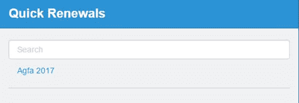

图 6-s:快速续订应用程序预览

酷！现在，让我们快速测试一下我们刚刚构建的东西，看看它是否真的像我们预期的那样工作。

如果我键入 *2018* ，则没有显示任何内容——如预期的那样。所以成功了。


图 6-t:测试应用程序(未显示结果)

如果我现在输入字母 *A* ，请注意，正如预期的那样——我们得到了一个结果。

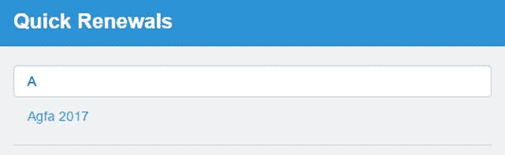

图 6-u:测试应用程序(显示结果)

所以，我们的应用程序正在工作！

## 总结

在本章中，我们逐步创建了一个 Lightning 应用程序，并探索了如何使用 Apex 和 Salesforce 对象查询语言(SOQL)以及 JavaScript 中的客户端控制器编写标记代码、设计应用程序样式、创建组件、使用事件以及创建服务器端代码。

这是一个简单的例子，但是我们涉及了很多领域，而且做起来很有趣。我们还研究了 Force.com 的名称空间是如何将所有这些应用程序部分连接在一起的。

与 Force.com 的合作让我能够以不同于平时的思维方式看待软件开发，尤其是作为一名. NET 开发人员来到 Force.com 世界。

然而，这本书几乎没有触及这个平台的表面。在这本电子书中，我们无法涵盖非常广泛的主题，例如 Apex 触发器、Visualforce、工作流自动化、模式构建器，以及进一步探索 Lightning 应用程序开发。

Force.com 是一个极其丰富的平台，有多种学习途径和认证途径可供选择。还有一个令人难以置信的丰富的第三方库和框架生态系统，它进一步扩展了可能实现的功能——例如， [JSForce](https://jsforce.github.io/) ，这是一个开源库，允许任何人在 Force.com 生态系统之外使用 JavaScript 创建 Force.com 应用程序——代码托管在其他地方。

如果您觉得这本书很有启发性，并且想继续探索 Force.com 并了解更多，我强烈建议您注册 Salesforce [Trailhead](https://trailhead.salesforce.com/en) 培训模块，其中包含大量有用且易于跟踪的资源。

感谢您的关注，如果您愿意，欢迎您继续改进我们在此介绍的示例和概念，如果您愿意，我很乐意听到您的意见。一切顺利。