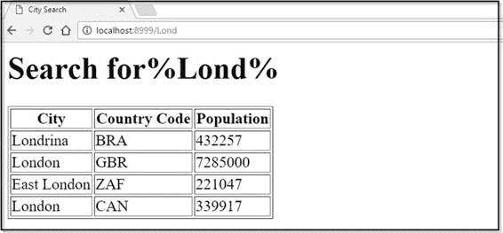

# 三、访问数据

在前一章中，我们看到了 Go 如何接受来自不同 URL 的请求，并将它们路由到适当的处理程序。然而，到目前为止，我们对这些请求的所有响应都只提供了静态内容，这对于今天的 web 应用程序来说是不够的。在本章中，我们将看到如何将我们的 Go web 应用程序连接到数据源并提供动态数据。

## 获取数据库的驱动程序

Go 允许您使用驱动程序可用的任何数据库。一份确定的司机名单可以在 https://github.com/golang/go/wiki/SQLDrivers 找到。

除非你使用的是非常奇特的东西，否则你应该可以在维基中找到数据库的驱动程序。

MySQL 是一个非常棒的开源数据库，尽管它已经存在了很长时间，但它仍然非常受欢迎，所以我们将在本章的示例中使用它。但是，无论您选择哪一个数据库，您需要采取的步骤都与这里显示的步骤相似，如果不是完全相同的话。

可以从[http://www.mysql.com](http://www.mysql.com)下载 MySQL Server 免费社区版。请遵循您平台的安装说明。如果您想遵循本章中的示例，您还应该安装示例“world”数据库。在 Windows 安装程序中有一个选项，但是对于 Mac 和 Linux，你必须从[https://dev.mysql.com/doc/index-other.html](https://dev.mysql.com/doc/index-other.html)手动下载并安装它。

只需使用命令行客户端(或者 MySQL 工作台，如果您喜欢图形用户界面环境，也可以安装它)连接到 MySQL 服务器，然后执行以下语句:

`mysql> SOURCE < /path/to/world.sql`

您可以通过在`mysql>`提示符下发出图 10 中的命令来验证“世界”数据库是否已安装。


图 10:验证“世界”数据库安装

安装数据库服务器后，需要为其安装驱动程序。使用`go get`可以做到这一点。我用的是图 11 中的`go-sql-driver`。


图 11:安装 MySQL 驱动程序

当我们导入了数据库服务器专用的驱动程序后，接下来我们需要在我们的`import`语句中引用它和通用的`database/sql`包。请注意，我们在驱动程序导入前加了一个下划线(`_`)。这告诉 Go 编译器，我们引用的包是另一个包的补充——在这个例子中，是`database/sql`包。我们使用它只是为了它的初始化能力——Go 称之为“副作用”

`import (`

`"database/sql"`

`"log"`

`_ "github.com/go-sql-driver/mysql"`

`)`

接下来，我们需要指定用于构建连接字符串的服务器主机、端口号、初始数据库、用户名和密码。

`db, err := sql.Open("mysql", "root:password@tcp(127.0.0.1:3306)/world")`

“世界”数据库中有三个表——国家、城市和国家代码，最后一个表将城市与国家联系起来。为应用程序中的每个数据库表创建类型是一个好主意，这样以后在模式中实现更改会更容易。

这是我们在城市表中的行的 Go 结构:

`type City struct {`

`Name string`

`CountryCode string`

`District string`

`Population uint32`

`}`

接下来，让我们有一个变量，当我们连接时，我们在其中存储数据库的句柄:

`var database *sql.DB`

最后，我们准备连接到数据库。我们通过序列化服务器主机、端口号、初始数据库以及用户名和密码字符串来构建连接字符串。

接下来，我们尝试通过调用`database/sql.Open`方法进行连接，传入驱动程序的类型和连接字符串:

`dbConn := fmt.Sprintf("%s:%s@tcp(%s)/%s", dbUser, dbPass, dbHost, dbDatabase)`

`db, err := sql.Open("mysql", dbConn)`

这返回了一个`sql.DB`的实例(关于这个我们稍后会有更多的说明)。

完整的代码在代码清单 7 中。

代码清单 7:连接到数据库

```go
  package
  main

  import
  (
        "database/sql"
        "log"

        _
  "github.com/go-sql-driver/mysql"
  )

  var
  database *sql.DB

  func
  main() {
        db,
  err := sql.Open("mysql",
  "root:password@tcp(127.0.0.1:3306)/world")
        if err != nil {
              log.Println("Could not connect!")
        }
        database
  = db
        log.Println("Connected.")
  }

```

如果一切按计划进行，我们应该会在终端提示符下收到一条消息，告诉我们现在已经连接到 MySQL 服务器了。


图 12:验证与数据库的连接

现在我们可以连接到“世界”数据库，我们可以对它执行查询，并向用户显示结果。但是首先，让我们检查一下`sql.DB`。

## `sql.DB`

请注意，在前面的代码示例中，我们使用包含`sql.DB`的`database`变量来访问数据库。

`sql.DB`不是存储在`dbConn`中的数据库连接，而是`database/sql`包对数据库的抽象。在我们的例子中，它指的是 MySQL 数据库，但是因为我们可以使用`database/sql`与许多不同的数据源进行交互，所以它也可以是本地文件或某种进程中的数据存储，如`memcache`。

`sql.DB` 代表您处理很多事情，包括数据库连接的打开、关闭和池化。

除非应用程序需要，否则不要一直打开和关闭数据库。`sql.DB`对象被设计为长寿命的，您与数据库的所有交互都将通过`sql.DB`进行。但是，当你用完连接后，一定要使用`sql.DB.Close`关闭连接，这样它们就可以返回到池中。

|  | 提示:如果你需要给短期函数访问 sql 的权限。数据库，将其作为参数传递给函数，而不是在函数内创建新的连接。 |

我们超越了自己。我们还没有对我们的数据库做任何事情。

让我们现在纠正这一点。

## 从数据库中检索数据

下面的代码根据用户在 [http://localhost:8999/](http://localhost:8999/) 之后的浏览器地址栏中输入的内容查询“世界”数据库的 City 表。

代码清单 8:查询数据库

```go
  package
  main

  import
  (
        "database/sql"
        "fmt"
        "log"
        "net/http"

        _
  "github.com/go-sql-driver/mysql"
  )

  type
  City struct {
        Name       
  string
        CountryCode
  string
        Population 
  int
  }

  var
  database *sql.DB

  func
  main() {

        db,
  err := sql.Open("mysql",

  "root:password@tcp(127.0.0.1:3306)/world")
        if err != nil {
              log.Println("Could not connect!")
        }
        database
  = db
        log.Println("Connected.")

        http.HandleFunc("/", showCity)
        http.ListenAndServe(":8999", nil)
  }

  func
  showCity(w http.ResponseWriter, r *http.Request)
  {
        city
  := City{}
        queryParam
  := "%"
  + r.URL.Path[1:]
  + "%"
        rows,
  err := database.Query("SELECT Name, CountryCode,
                 Population FROM city WHERE Name LIKE ?", queryParam)
        if err != nil {
              log.Fatal(err)
        }
        defer rows.Close()
        for rows.Next() {
              err
  := rows.Scan(&city.Name,
  &city.CountryCode,

  &city.Population)
              if err != nil {
                    log.Fatal(err)
              }
              fmt.Fprintf(w,
  "%s (%s), Population: %d \n",
  city.Name,

   city.CountryCode, city.Population)
        }
        err
  = rows.Err()
        if err != nil {
              log.Fatal(err)
        }
  }

```

我们在这里感兴趣的是`showCity`函数，当用户访问 web 应用程序的根目录时会调用该函数。

为了查询数据库，我们在`sql.DB`中调用`Query`方法，传入所需的 SQL。`Query`(以及对应的`QueryRow`，只检索一行)的好处是它被参数化了，这有助于抵御 SQL 注入。

该查询返回一组行，我们使用`Next`方法迭代这些行。对于每一行，我们执行`Scan`将该行中的列映射到我们之前声明的`City`类型。接下来，向用户显示结果很简单，如图 13 所示。


图 13:显示查询结果

### 整理输出

我们现在有的只是一些相当难看的文本被倾倒到浏览器中。让我们通过在一个 HTML 表中显示查询结果来使它看起来更令人愉快一点。我们只需在处理程序中重写代码，如代码清单 9 所示。

代码清单 9:使用 HTML 格式化查询结果

```go
  func
  showCity(w http.ResponseWriter, r *http.Request)
  {
        city
  := City{}
        queryParam
  := "%"
  + r.URL.Path[1:]
  + "%"
        rows,
  err := database.Query("SELECT Name, CountryCode, Population FROM city
  WHERE Name LIKE ?", queryParam)
        if err != nil {
              log.Fatal(err)
        }
        defer rows.Close()

        html
  := "<html><head><title>City
  Search</title></head><body><h1>Search for"
  + queryParam +
  "</h1><table
  border='1'><tr><th>City</th><th>Country
  Code</th><th>Population</th></tr>"

        for rows.Next() {
              err
  := rows.Scan(&city.Name,
  &city.CountryCode,

   &city.Population)
              if err != nil {
                    log.Fatal(err)
              }
              html
  += fmt.Sprintf("<tr><td>%s</td><td>%s</td><td>%d</td></tr>",
  city.Name, city.CountryCode, city.Population)
        }
        err
  = rows.Err()
        if err != nil {
              log.Fatal(err)
        }
  else {
              html
  += "</table></body></html>"
              fmt.Fprintln(w,
  html)
        }
  }

```

当我们执行它时，我们得到图 14。



图 14:在一个 HTML 表格中显示查询结果

不完全漂亮，但略有改善。当然，我们可以明智地使用 CSS，让它符合我们的内心。

但是等一下，我们的代码付出了什么代价？我们漂亮、整洁的程序现在是一堆乱七八糟的内嵌 HTML。如果随着时间的推移变得更加复杂，我们会发现维护起来非常困难。更重要的是，每次我们想要做一个微不足道的改变，我们必须重新编译我们的代码。

我们现在已经承诺了网络开发的一个最大的罪过——在我们的源代码中混合逻辑和表示。谢天谢地，有一种更好的方式来格式化显示。我们将在下一章研究这个问题。