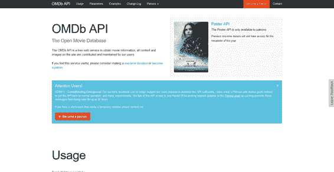
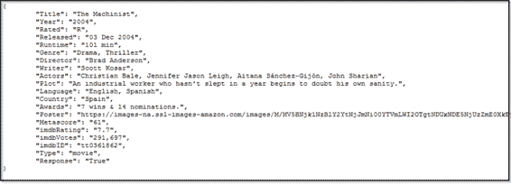
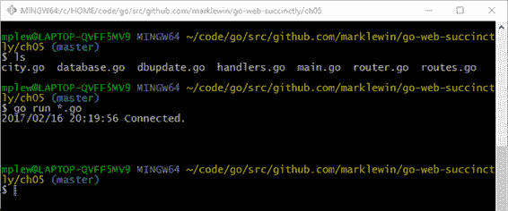
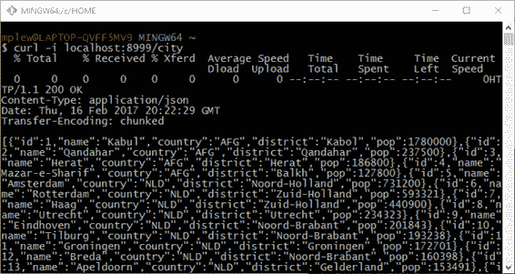
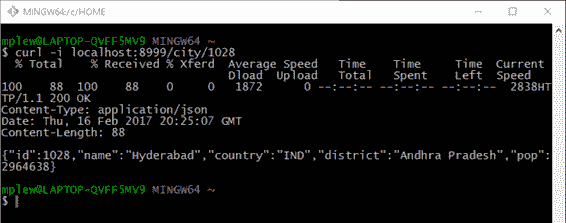
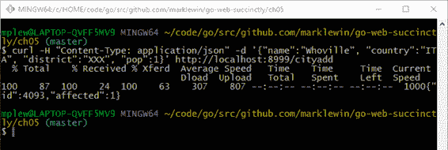
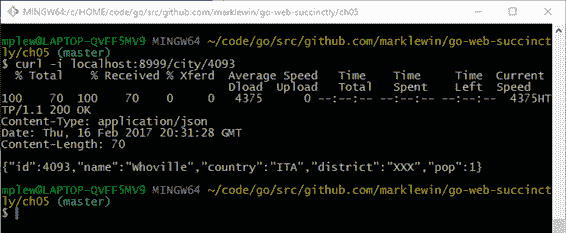
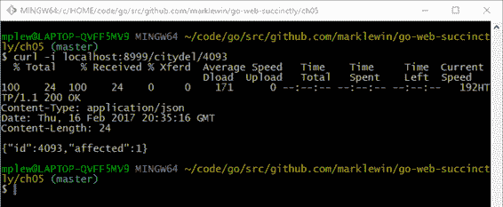

# 五、创建一个 RESTful JSON API

我们已经学到了很多，所以让我们看看我们是否能利用这些知识做一些有用的事情。

在第 1 章中，我们研究了 Go 如何成为创建 web 服务的绝佳选择，原因有很多——例如，它能够通过其轻量级线程模型进行大规模扩展，易于模块化代码，以及它能够与常用工具(如加密库、安全 web 协议，当然还有 HTTP 服务器)集成。

在本章中，我想演示如何创建一个简单的 RESTful web 服务，它可以接受 JSON 请求并返回 JSON 响应，以便于对数据库进行 CRUD(创建、读取、更新和删除)操作。

(其实我这有点要去作弊了。为了最小化应用程序的复杂性，我将创建一个 CRD 应用程序。更新功能将作为练习留给读者！)

这个应用程序将使用我们到目前为止所学的关于服务、路由和访问数据库的知识。在构建它时，我将向您展示如何设计和开发一个典型的 web 服务。它不会是完美的或生产就绪的，但它应该让您很好地了解在 Go 中构建这些类型的服务有多容易。

## RESTful 原料药

如果你曾经是一名开发人员，或者你曾经和开发人员一起工作过，你一定听说过 REST。鉴于近年来它吸引了大量的炒作，你会认为它也是一个最近的概念。但事实并非如此。事实上，它和网络本身一样古老。

REST 只是对多年来开发的数百种不同协议的一种回应，这些协议旨在让计算机通过网络使用相同的语言相互交谈。

其中一些协议包括 SOAP(由于它依赖于 XML 作为传输机制，需要相当多的数据和计算能力，并且随着移动设备变得无处不在，它开始不受欢迎)、JMS(它是特定于 Java 应用程序的，因此并不真正适合广泛采用)和 XML-RPC(它和 SOAP 一样，使用 XML，但没有实现 SOAP 拥有的任何标准)。

与所有这些方法一样，REST 背后的目标是让计算机更容易共享数据，同时足够透明，以便人类观察者能够理解他们在做什么。

然而，REST 提供的是在保持轻量级的同时做到这一点的能力。它的方法对开发人员来说很熟悉，因为它使用了 web 本身使用的相同的、既定的方法。

为什么

那么，考虑一个你在浏览器中访问的网站。您输入一个网址来访问该网站，网站背后的程序可以分析该网址，以了解您的意图。在静态站点中，您只需输入指向 web 服务器上文件资源的 URL，但是在使用 web 服务的站点中，您可以有效地将 URL 用作命令行，不仅可以输入对资源的请求，还可以输入对程序的 API 公开的特定操作的请求。

考虑一下开放电影数据库网站(http://www.omdbapi.com)，它提供了一个免费的 REST API 来访问关于电影的信息。你只需要精心设计网址，让它指定你想要它给你什么信息。

如果你从[https://www.omdbapi.com/](https://www.omdbapi.com/)开始，你会得到图 19 中的主页。



图 19:开放电影数据库应用编程接口主页

如果你使用`t`(标题)参数指定一部电影，你会得到一些更有趣的东西:[https://www.omdbapi.com/?t=star%20wars](https://www.omdbapi.com/?t=star%20wars)。


图 20:访问开放电影数据库应用编程接口

这些信息就是 JSON，或者 JavaScript 对象符号。尽管有这个名字，但它并不是 JavaScript 特有的。事实上，这是一种以非常轻量级的格式编码数据的常见方式，它被许多不同语言编写的应用程序使用，包括 Go。

除了轻量级和易于客户端应用程序解析之外，JSON 也是人类可读的。嗯，只是勉强。您可以通过在浏览器的开发人员控制台中查看响应，或者通过安装一个美化 JSON 响应的扩展来整理响应。

图 21 显示了我在火狐中安装了 JSON Formatter 插件后的输出。


图 21:经过美化的 JSON 响应

如您所见，JSON 只是一堆键/值对。大括号内的所有内容都是 JSON 对象，对象本身可以包含其他对象和值的数组。

然而，这不是一个 JSON 教程。你几乎可以在网上的任何地方找到关于 JSON 的信息，而且没有太多内容。这里的要点是，存在可以解析一个网址并以客户机应用程序可以使用的 JSON 格式返回数据的应用程序接口。有些网站甚至可以接受 JSON，但开放电影数据库不在其中。

我们还可以添加其他标准。图 22 查找名为*机械师*的影片，包含一个简短的剧情摘要，并将结果作为 JSON 返回(默认):[http://www.omdbapi.com/?t=the+machinist&y =&剧情=简短& r=json](http://www.omdbapi.com/?t=the+machinist&y=&plot=short&r=json) 。



图 22:机械师的开放电影数据库应用编程接口结果

图 23 将`r`(响应)参数设置为 XML:[http://www.omdbapi.com/?t=the+machinist&y =&plot = short&r = XML](http://www.omdbapi.com/?t=the+machinist&y=&plot=short&r=xml)。


图 23:将输出更改为 XML 格式

就 XML 而言，这相当简洁。许多 XML 都是深度嵌套的，解析起来是一场噩梦，因此在现代 API 中更倾向于使用 JSON。

玩一会儿开放电影数据库应用编程接口。我等着！

这是一个 RESTful 应用编程接口的例子。您实际上是在使用网址本身来调用网络服务。

## 我们的 RESTful 网络服务

我们将在本章中构建类似的内容。

你可能已经想过:“我可以用 Go 路由器做到这一点！”事实上，你可以。所以，你需要的只是一些数据。我们已经在使用 MySQL 的“世界”数据库，所以让我们使用它。

我们的应用程序将允许用户输入以下任何网址路径，并以所述方式进行响应:

*   `http://localhost:8999/city`:以 JSON 格式返回 City 表中所有城市的列表。
*   `http://localhost:8999/city/1028`:以 JSON 格式返回 ID 为 1028 的城市详细信息。
*   `http://localhost:8999/cityadd/`:允许用户`POST`一个新城市的 JSON 表示，拿回一个 JSON 结果对象。
*   `http://localhost:8999/citydel/1028`:允许用户删除 ID 为 1028 的城市，拿回一个 JSON 结果对象。

为了在保持代码尽可能模块化的情况下实现这一点，我们将创建以下文件:

*   `main.go`
*   `handlers.go`
*   `router.go`
*   `routes.go`
*   `database.go`
*   `city.go`
*   `dbupdate.go`

这些模块名称应该是不言自明的。让我们深入研究一下。

## 服务和路由

让我们先定义我们的路线。我们将使用`gorilla/mux`而不是`net/http`的`DefaultServeMux`，因为`gorilla/mux`通常更好用。我们不再简单地一次定义一个，而是将路由细节存储在一个结构中，以便在需要时更容易添加新路由。

这里是`routes.go`，它定义了`Route`类型的切片(大致类似于其他编程语言中的数组)中的每条路由及其处理程序，称为`Routes`。

代码清单 17:路线

```go
  package
  main

  import "net/http"

  type
  Route struct {
        Name       
  string
        Method     
  string
        Pattern    
  string
        HandlerFunc
  http.HandlerFunc
  }

  type
  Routes []Route

  var
  routes = Routes{
        Route{
              "HomePage",
              "GET",
              "/",
              HomePage,
        },
        Route{
              "CityList",
              "GET",
              "/city",
              CityList,
        },
        Route{
              "CityDisplay",
              "GET",
              "/city/{id}",
              CityDisplay,
        },
        Route{
              "CityAdd",
              "POST",
              "/cityadd",
              CityAdd,
        },
        Route{
              "CityDelete",
              "GET",
              "/citydel/{id}",
              CityDelete,
        },
  }

```

在代码清单 18 中是`router.go`，它遍历`Routes`并为它们创建处理程序。

代码清单 18:路由器

```go
  package
  main

  import "github.com/gorilla/mux"

  func
  NewRouter() *mux.Router {

        router
  := mux.NewRouter().StrictSlash(true)
        for _, route :=
  range routes {
              router.
                    Methods(route.Method).
                    Path(route.Pattern).
                    Name(route.Name).
                    Handler(route.HandlerFunc)
        }

        return router
  }

```

为了启动和运行所有这些路由，并准备好服务请求，我们只需要在我们的`main`函数中创建一个`NewRouter`的实例，但是我们稍后会谈到这一点。

让我们先来看看`handlers.go`中的每个处理程序。

首先是`CityList`处理程序，当用户访问[http://localhost:8999/city](http://localhost:8999/city)时会被调用。

代码清单 19:城市列表处理程序

```go
  func
  CityList(w http.ResponseWriter, r *http.Request)
  {
        // Query the database
        jsonCities
  := dbCityList()

        ...
  }

```

`CityList`调用我们的`database.go`模块中的`dbCityList`，以便查询数据库并以 JSON 格式返回城市列表。为了在 Go 应用程序中使用 JSON，您需要`encoding/json`包。然后你可以调用`json.Marshal`把一个结构变成 JSON，`json.Unmarshal`把 JSON 变成一个结构。

代码清单 20:将查询响应编码为 JSON

```go
  // Find all cities and return as JSON.
  func
  dbCityList() []byte {
        var cities Cities
        var city City

        cityResults,
  err := database.Query("SELECT * FROM city")
        if err != nil {
              log.Fatal(err)
        }
        defer cityResults.Close()

        for cityResults.Next() {
              cityResults.Scan(&city.Id, &city.Name,
                 &city.CountryCode, &city.District,
  &city.Population)
              cities
  = append(cities, city)
        }

        jsonCities,
  err := json.Marshal(cities)
        if err != nil {
              fmt.Printf("Error: %s", err)
        }
        return jsonCities
  }

```

正如在第 3 章中一样，我们使用`Query`方法将 SQL 传递给我们的数据库服务器，然后调用结果集上的`Next`来迭代查询返回的每一行，我们还调用`Scan`来将每一行中的列映射到我们的`City`结构中的字段。

回到我们的处理程序`CityList`，我们在响应中写出适当的 JSON 头，然后返回我们从`dbCityList`收到的 JSON，如代码清单 21 所示。

代码清单 21:返回包含城市列表的 JSON 响应

```go
  func
  CityList(w http.ResponseWriter, r *http.Request)
  {
        // Query the database.
        jsonCities
  := dbCityList()

        // Format the response.
        w.Header().Set("Content-Type", "application/json")
        w.WriteHeader(http.StatusOK)
        w.Write(jsonCities)
  }

```

让我们看看另一个处理器——`CityDisplay`。该处理程序接受特定城市的`id`参数，然后我们将其传递给`database.go`中的`dbCityDisplay`函数。如果一切顺利，我们会收到一个只描述该城市的 JSON 对象，并在我们的响应中返回它，如代码清单 22 所示。

代码清单 22:为单个城市发送一个 JSON 响应

```go
  func
  CityDisplay(w http.ResponseWriter, r *http.Request)
  {
        // Get URL parameter with the city ID to search for.
        vars
  := mux.Vars(r)
        cityId,
  _ := strconv.Atoi(vars["id"])

        // Query the database.
        jsonCity
  := dbCityDisplay(cityId)

        // Send the response.
        w.Header().Set("Content-Type", "application/json")
        w.WriteHeader(http.StatusOK)
        w.Write(jsonCity)
  }

```

代码清单 23 显示了为特定城市提供 JSON 数据的`dbCityDisplay`函数。

代码清单 23:使用 QueryRow 查找一个城市

```go
  // Find a single city based on ID and return as JSON.
  func
  dbCityDisplay(id int) []byte {
        var city City

        err
  := database.QueryRow("SELECT * FROM city WHERE ID=?",
  id).Scan(&city.Id, &city.Name, &city.CountryCode,
  &city.District, &city.Population)
        if err != nil {
              log.Fatal(err)
        }

        jsonCity,
  err := json.Marshal(city)
        if err != nil {
              fmt.Printf("Error: %s", err)
        }
        return jsonCity
  }

```

注意`dbCityDisplay`只希望从数据库中返回一行，所以我们用`QueryRow`代替`Query`。我们不需要推迟记录集的关闭，因为这是在查询返回单个记录或没有记录时显式完成的。我们需要将对`Scan`的调用链接到对`QueryRow`的调用，因为否则记录集将在我们有机会使用它之前被关闭。

`CityAdd`稍微复杂一点，因为我们必须从请求的主体中读取 JSON，将其解组为 Go 结构，然后将其传递给`dbCityAdd`进行处理。

代码清单 24:城市添加功能

```go
  func
  CityAdd(w http.ResponseWriter, r *http.Request)
  {
        var city City

        // Read the body of the request.
        body,
  err :=
  ioutil.ReadAll(io.LimitReader(r.Body, 1048576))
        if err != nil {
              panic(err)
        }
        if err :=
  r.Body.Close(); err != nil {
              panic(err)
        }

        // Convert the JSON in the request to a Go type.
        if err :=
  json.Unmarshal(body, &city); err != nil {
              w.Header().Set("Content-Type", "application/json")
              w.WriteHeader(422) // can't
  process!
              if err :=
  json.NewEncoder(w).Encode(err); err != nil {
                    panic(err)
              }
        }

        // Write to the database.
        addResult
  := dbCityAdd(city)

        // Format the response.
        w.Header().Set("Content-Type", "application/json")
        w.WriteHeader(http.StatusCreated)
        w.Write(addResult)
  }

```

请注意，我们是如何设置从客户端接受的 1MB 数据量限制的。我们最不想看到的就是某个恶意用户向我们发送了一万亿字节的数据，导致我们的服务器崩溃！

|  | 提示:始终限制允许客户端发送到应用程序的数据量。 |

当我们在 Go 结构中拥有 JSON 时，我们可以用 SQL 准备一条语句，然后用我们想要添加的新城市记录来执行它。使用`db.Prepare`以这种方式准备声明的好处是，如果同一恶意用户试图使用另一个最喜欢的黑客技术来破坏我们，它有助于抵御 SQL 注入。

代码清单 25:为插入操作使用准备好的语句

```go
  // Create a new city based on the information supplied.
  func
  dbCityAdd(city City) []byte {

        var addResult DBUpdate

        // Create prepared statement.
        stmt,
  err := database.Prepare("INSERT INTO City(Name, CountryCode, District,
  Population) VALUES(?,?,?,?)")
        if err != nil {
              log.Fatal(err)
        }

        // Execute the prepared statement and retrieve the
  results.
        res,
  err := stmt.Exec(city.Name,
  city.CountryCode,

  city.District, city.Population)
        if err != nil {
              log.Fatal(err)
        }
        lastId,
  err := res.LastInsertId()
        if err !=
  nil {
              log.Fatal(err)
        }
        rowCnt,
  err := res.RowsAffected()
        if err != nil {
              log.Fatal(err)
        }

        // Populate DBUpdate struct with last Id and num rows
  affected.
        addResult.Id
  = lastId
        addResult.Affected
  = rowCnt

        // Convert to JSON and return.
        newCity,
  err := json.Marshal(addResult)
        if err != nil {
              fmt.Printf("Error: %s", err)
        }
        return newCity
  }

```

还要注意的是，数据库上的`INSERT`操作会检索一些有用的信息——即最近添加的记录的 ID 和受影响的记录数量。我们将它存储在一个名为`DBUpdate`的结构中，这样我们就可以将它返回给`CityAdd`处理程序，并随后返回给客户(客户可能希望对信息采取行动)。

我们最后一个处理者是`CityDelete`。和`CityDisplay`一样，它要求用户输入想要工作的城市的 ID。

代码清单 26:城市删除函数

```go
  func
  CityDelete(w http.ResponseWriter, r *http.Request)
  {

        // Get URL parameter
  with the city ID to delete.
        vars
  := mux.Vars(r)
        cityId,
  _ := strconv.ParseInt(vars["id"], 10,
  64)

        // Query the database.
        deleteResult
  := dbCityDelete(cityId)

        // Send the response.
        w.Header().Set("Content-Type", "application/json")
        w.WriteHeader(http.StatusOK)
        w.Write(deleteResult)
  }

```

对应的`dbCityDelete`函数获取该 ID，并准备一个`DELETE`语句。数据库响应受影响的行数，我们可以使用相同的`DBUpdate`结构向用户呈现该信息。

代码清单 27:数据库删除函数

```go
  // Delete the city with the supplied ID.
  func
  dbCityDelete(id int64) []byte {
        var deleteResult DBUpdate

        // Create prepared statement.
        stmt,
  err := database.Prepare("DELETE FROM City WHERE ID=?")
        if err != nil {
              log.Fatal(err)
        }

        // Execute the prepared statement and retrieve the
  results.
        res,
  err := stmt.Exec(id)
        if err != nil {
              log.Fatal(err)
        }
        rowCnt,
  err := res.RowsAffected()
        if err != nil {
              log.Fatal(err)
        }

        // Populate DBUpdate struct with last Id and num rows
  affected.
        deleteResult.Id
  = id
        deleteResult.Affected
  = rowCnt

        // Convert to JSON and return.
        deletedCity,
  err := json.Marshal(deleteResult)
        if err != nil {
              fmt.Printf("Error: %s", err)
        }
        return deletedCity
  }

```

真的是这样！

## 完整的应用

接下来，让我们检查一些代码清单示例，这些示例演示了完整的应用程序，我们将各种关注点分为这些模块:

*   `main.go`
*   `router.go`
*   `routes.go`
*   `handlers.go`
*   `database.go`
*   `city.go`
*   `dbupdate.go`

代码清单 28

```go
  package
  main

  import
  (
        "log"
        "net/http"
  )

  func
  main() {

        router
  := NewRouter()
        dbConnect()

        log.Fatal(http.ListenAndServe(":8999", router))
  }

```

代码清单 29:路由器

```go
  package
  main

  import "github.com/gorilla/mux"

  func
  NewRouter() *mux.Router {

        router
  := mux.NewRouter().StrictSlash(true)
        for _, route :=
  range routes {
              router.
                    Methods(route.Method).
                    Path(route.Pattern).
                    Name(route.Name).
                    Handler(route.HandlerFunc)
        }

        return router
  }

```

代码清单 30:路线

```go
  package
  main

  import "net/http"

  type
  Route struct {
        Name       
  string
        Method     
  string
        Pattern    
  string
        HandlerFunc
  http.HandlerFunc
  }

  type
  Routes []Route

  var
  routes = Routes{
        Route{
              "HomePage",
              "GET",
              "/",
              HomePage,
        },
        Route{
              "CityList",
              "GET",
              "/city",
              CityList,
        },
        Route{
              "CityDisplay",
              "GET",
              "/city/{id}",
              CityDisplay,
        },
        Route{
              "CityAdd",
              "POST",
              "/cityadd",
              CityAdd,
        },
        Route{
              "CityDelete",
              "GET",
              "/citydel/{id}",
              CityDelete,
        },
  }

```

代码清单 31:处理器

```go
  package
  main

  import
  (
        "encoding/json"
        "fmt"
        "io"
        "io/ioutil"
        "net/http"
        "strconv"

        "github.com/gorilla/mux"
  )

  func
  HomePage(w http.ResponseWriter, r *http.Request)
  {
        fmt.Fprintln(w, "Welcome to the City Database!")
  }

  func
  CityList(w http.ResponseWriter, r *http.Request)
  {
        // Query the database.
        jsonCities
  := dbCityList()

        // Format the response.
        w.Header().Set("Content-Type", "application/json")
        w.WriteHeader(http.StatusOK)
        w.Write(jsonCities)
  }

  func
  CityDisplay(w http.ResponseWriter, r *http.Request)
  {
        // Get URL parameter with the city ID to search for.
        vars
  := mux.Vars(r)
        cityId,
  _ := strconv.Atoi(vars["id"])

        // Query the database.
        jsonCity
  := dbCityDisplay(cityId)

        // Format the response.
        w.Header().Set("Content-Type", "application/json")
        w.WriteHeader(http.StatusOK)
        w.Write(jsonCity)
  }

  func
  CityAdd(w http.ResponseWriter, r *http.Request)
  {
        var city City

        // Read the body of the request.
        body,
  err :=
  ioutil.ReadAll(io.LimitReader(r.Body, 1048576))

        if err != nil {
              panic(err)
        }
        if err :=
  r.Body.Close(); err != nil {
              panic(err)
        }

        // Convert the JSON in the request to a Go type.
        if err :=
  json.Unmarshal(body, &city); err != nil {
              w.Header().Set("Content-Type", "application/json")
              w.WriteHeader(422) // can't
  process!
              if err :=
  json.NewEncoder(w).Encode(err); err != nil {
                    panic(err)
              }
        }

        // Write to the database.
        addResult
  := dbCityAdd(city)

        // Format the response.
        w.Header().Set("Content-Type", "application/json")
        w.WriteHeader(http.StatusCreated)
        w.Write(addResult)
  }

  func
  CityDelete(w http.ResponseWriter, r *http.Request)
  {

        // Get URL parameter
  with the city ID to delete.
        vars
  := mux.Vars(r)
        cityId,
  _ := strconv.ParseInt(vars["id"], 10,
  64)

        // Query the database.
        deleteResult
  := dbCityDelete(cityId)

        // Format the response.
        w.Header().Set("Content-Type", "application/json")
        w.WriteHeader(http.StatusOK)
        w.Write(deleteResult)
  }

```

代码清单 32:数据库

```go
  package
  main

  import
  (
        "database/sql"
        "encoding/json"
        "fmt"
        "log"

        _
  "github.com/go-sql-driver/mysql"
  )

  var
  database *sql.DB

  // Connect to the "world" database.
  func
  dbConnect() {
        db,
  err := sql.Open("mysql",

  "root:password@tcp(127.0.0.1:3306)/world")
        if err != nil {
              log.Println("Could not connect!")
        }
        database
  = db
        log.Println("Connected.")
  }

  // Find all cities and return as JSON.
  func
  dbCityList() []byte {
        var cities Cities
        var city City

        cityResults,
  err := database.Query("SELECT * FROM city")
        if err != nil {
              log.Fatal(err)
        }
        defer cityResults.Close()

        for cityResults.Next() {
              cityResults.Scan(&city.Id, &city.Name,

  &city.CountryCode, &city.District, &city.Population)
              cities
  = append(cities, city)
        }

        jsonCities,
  err := json.Marshal(cities)
        if err != nil {
              fmt.Printf("Error: %s", err)
        }
        return jsonCities
  }

  // Find a single city based on ID and return as JSON.
  func
  dbCityDisplay(id int) []byte {
        var city City

        err
  := database.QueryRow("SELECT * FROM city WHERE ID=?",
  id).Scan(&city.Id, &city.Name, &city.CountryCode,
  &city.District, &city.Population)
        if err != nil {
              log.Fatal(err)
        }

        jsonCity,
  err := json.Marshal(city)
        if err != nil {
              fmt.Printf("Error: %s", err)
        }
        return jsonCity
  }

  // Create a new city based on the information supplied.
  func
  dbCityAdd(city City) []byte {

        var addResult DBUpdate

        // Create prepared statement.
        stmt,
  err := database.Prepare("INSERT INTO City(Name, CountryCode, District,
  Population) VALUES(?,?,?,?)")
        if err != nil {
              log.Fatal(err)
        }

        // Execute the prepared statement and retrieve the
  results.
        res,
  err := stmt.Exec(city.Name,
  city.CountryCode, city.District, city.Population)
        if err != nil {
              log.Fatal(err)
        }
        lastId,
  err := res.LastInsertId()
        if err != nil {
              log.Fatal(err)
        }
        rowCnt,
  err := res.RowsAffected()
        if err != nil {
              log.Fatal(err)
        }

        // Populate DBUpdate struct with last Id and num rows
  affected.
        addResult.Id
  = lastId
        addResult.Affected
  = rowCnt

        // Convert to JSON and return.
        newCity,
  err := json.Marshal(addResult)
        if err != nil {
              fmt.Printf("Error: %s", err)
        }
        return newCity
  }

  // Delete the city with the supplied ID.
  func
  dbCityDelete(id int64) []byte {
        var deleteResult DBUpdate

        // Create prepared statement.
        stmt,
  err := database.Prepare("DELETE FROM City WHERE ID=?")
        if err != nil {
              log.Fatal(err)
        }

        // Execute the prepared statement and retrieve the
  results.
        res,
  err := stmt.Exec(id)
        if err != nil {
              log.Fatal(err)
        }
        rowCnt,
  err := res.RowsAffected()
        if err != nil {
              log.Fatal(err)
        }

        // Populate DBUpdate struct with last Id and num rows
  affected.
        deleteResult.Id
  = id
        deleteResult.Affected
  = rowCnt

        // Convert to JSON and return.
        deletedCity,
  err := json.Marshal(deleteResult)
        if err != nil {
              fmt.Printf("Error: %s", err)
        }
        return deletedCity
  }

```

代码清单 33:城市

```go
  package
  main

  type
  City struct {
        Id         
  int    `json:"id"`
        Name       
  string `json:"name"`
        CountryCode
  string `json:"country"`
        District   
  string `json:"district"`
        Population 
  int    `json:"pop"`
  }

  type
  Cities []City

```

代码清单 34:数据库更新中的数据库更新结构

```go
  package
  main

  type
  DBUpdate struct {
        Id      
  int64 `json:"id"`
        Affected
  int64 `json:"affected"`
  }

```

## 运行应用程序

我们可以在浏览器中测试应用程序，但这将涉及到对开发人员控制台的一些摆弄和不必要的点击。

相反，让我们使用名为`curl`(客户端网址)的命令行工具。

如果你有一台苹果或 Linux 机器，`curl`可能已经可以使用了。如果你有 Windows，也许最简单的访问方法是下载包含`curl`和大量其他有用的 Linux 工具的 Git Bash 外壳。甚至还有一个本地的 Windows Bash 外壳——参见[https://msdn.microsoft.com/en-us/commandline/wsl/about](https://msdn.microsoft.com/en-us/commandline/wsl/about)。即使不使用 Git，随身携带也很方便。另一个选择是 Cygwin(尽管在我看来，这是一个更臃肿的选择)。

你可以在[https://git-for-windows.github.io/](https://git-for-windows.github.io/)下载 Git Bash。

### 显示所有城市

打开两个外壳窗口。

通过在与应用程序模块相同的文件夹中执行`go run *.go`，在第一个 shell 中运行应用程序，如图 24 所示。



图 24:运行应用程序

接下来，在第二个 shell 窗口中输入以下命令:

`curl -i localhost:8999/city`

`-i`标志指示`curl`包含 HTTP 头。

您应该会在 city 表中看到每个城市的 JSON 表示，如图 25 所示。



图 25:请求所有城市

### 显示特定的城市

当应用程序仍在第一个 shell 窗口中运行时，在第二个 shell 窗口中输入以下内容:

`curl -i localhost:8999/city/1028`

您应该会看到 ID 为 1028 的城市的详细信息，即印度的海德拉巴。输入一些随机的城市标识，看看引用了哪些城市。



图 26:通过标识请求特定城市

### 增加一个城市

在第二个 shell 窗口中，输入以下内容:

`curl -H "Content-Type: application/json" -d '{"name":"Whoville", "country":"ITA", "district":"XXX", "pop":1}'` [`http://localhost:8999/cityadd`](http://localhost:8999/cityadd)

|  | 提示:输入代表新城市的 JSON 对象时要小心。JSON 很简单，但是如果您忘记关闭引号或大括号，或者如果您将引号(表示字符串数据类型)放在预期为整数的值周围，这是不可原谅的。 |

该记录应该被添加到数据库中，并且您应该在响应中收到新的记录标识，如图 27 所示。



图 27:添加新城市

在前面的例子中，我最近添加的记录的 ID 是 4093。你的可能不一样。您可以简单地使用以下命令，而不是再次手动查询数据库以查看新记录是否存在:

`curl -i localhost:8999/city/4093`

但是，注意用添加城市时分配的任何标识替换 4093。



图 28:验证—向数据库添加新城市

### 删除城市

为了删除一个城市，您可以使用类似于通过标识搜索城市的语法。尝试使用您刚刚添加到数据库中的同一城市标识。例如:

`curl -i localhost:8999/citydel/4093`

如果一切按计划进行，您应该会得到一个编码为 JSON 的`DBUpdate`对象，这表明单个行受到了影响，如图 29 所示。



图 29:删除城市

恭喜你！您刚刚使用 Go 编写了第一个“真正的”网络服务。

当然，这远非完美，如果您计划将其投入生产，您可能想要做一些重构，实现更好的错误处理，等等。

然而，所有这些的重点是强调 Go 是一种用于这种类型的应用程序的优秀语言。我在其他语言中也做过类似的工作，包括 Node.js 和 Ruby，在 Go 中工作我要开心得多。依我拙见，一切似乎都更整洁，考虑得更周全。

## 挑战步骤

如果你面临挑战，试着在应用程序中实现更新功能——也就是说，把 U 放回 CRUD！

首先，允许客户端提交一个 JSON 城市对象，该对象将首先删除现有记录(如果有匹配的城市标识)，然后添加一个新记录，并以 JSON 格式报告成功(否则)。

接下来，允许客户端提交一些部分的 JSON 和标识，然后根据已经更改的字段简单地更新现有的记录。例如，客户端可能会提交以下内容:

`{"id":4088,"name":"Whereville”,pop":2}`

这将只更新城市表中的`Name`和`Population`字段。