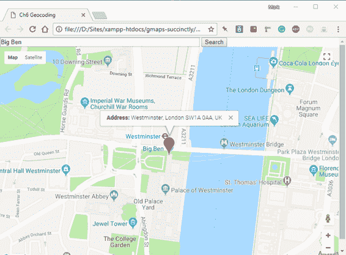
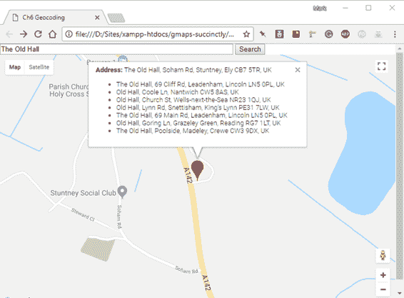
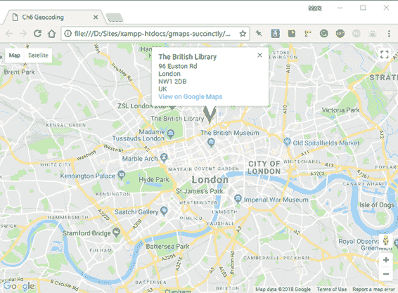

# 六、地理编码

*地理编码*是将一个地址转换为地理坐标的过程，您可以使用地理坐标在地图上精确定位该地址的位置。*反向地理编码*是反向的过程:即从一个地图坐标开始，并试图计算出哪个物理地址位于或靠近该位置。

请注意，本文中的“地址”可以是完整的地址，也可以是部分信息，如邮政编码、建筑物名称等。匹配的质量取决于底层数据的质量，谷歌有一些最好的可用数据！

在本章中，我们将构建两个应用程序。第一个将使用户能够搜索地址，如果匹配，在该位置放置一个标记。第二个要求他们点击地图，它会报告离他们点击的地方最近的地址。

为了使用地理编码，您必须使用与启用谷歌地图 JavaScript 应用编程接口相同的过程来启用地理编码应用编程接口。详见第二章。

## 使用地理编码器

在我们开始构建我们的第一个应用程序之前，让我们先来谈谈实现这一切的类:`google.maps.Geocoder`类。像谷歌地图应用编程接口中的许多类一样，地理编码器很容易用于简单的用例，但是如果您的需求更复杂，可以通过配置选项变得更加复杂。

要开始地理编码，首先需要一个`geocoder`类的实例:

```html
geocoder = new
google.maps.Geocoder();

```

然后调用该对象的`geocode()`方法，向其传递一个`GeocodeRequest`对象，该对象将请求的性质定义为第一个参数。你能做的最简单的请求就是用你要找的地址设置`GeocodeRequest`对象的地址属性。

在第二个参数中，您提供了一个*回调*函数。这是地理编码操作结果可用时将执行的功能。

```html
geocoder.geocode( {
address: "Big Ben, London" }, 
function (results, status) {
         // process
results
}
);

```

这个回调函数从地理编码操作中接收两个参数:一个包含结果的`GeocoderResult`对象数组，以及一个告诉您操作是否成功或遇到某种类型错误的`GeocoderStatus`常量。

## 地理编码器请求类

在我们讨论如何解包地理编码选项的结果之前，让我们看看您可以在`GeocoderRequest`对象上设置的一些其他属性，以配置您的搜索。您可以在表 2 中看到这些总结。

表 2:地理编码器请求对象属性

| 财产 | 数据类型 | 描述 |
| --- | --- | --- |
| `address` * | `string` | 要地理编码的地址。 |
| `bounds` * | `LatLngBounds` | 要搜索的区域。 |
| `componentRestrictions` | `GeocoderComponentRestrictions` | 具有可用于限制搜索区域的属性的对象(`route`、`locality`、`administrativeArea`、`postalCode`、`country`)。 |
| `location` | `LatLng` | 地图上的一点。地理编码器就是这样进行反向地理编码的。 |
| `placeId` * | `string` | 谷歌位置数据库中的一个条目。这是另一种反向地理编码方法。 |
| `region` | `string` | 使用提供的国家代码偏向搜索。 |

|  | 注意:在地理编码器请求对象的单个实例中，只能设置地址、边界和位置标识属性中的一个。 |

在本书中，我们将只使用`address`和`location`属性。

### 地理编码器结果对象

结果以`GeocoderResult`对象数组的形式返回给你的回调函数。数组中的第一个元素是最佳匹配，API 对任何后续条目的置信度都在下降。

每个`GeocoderResult`对象都具有表 3 中列出的属性。

表 3:地理编码器结果对象属性

| 财产 | 数据类型 | 描述 |
| --- | --- | --- |
| `address_components` | 
`GeocoderAddressComponent`阵 | 包含地址的每个组成部分(路线、地点等)的`long_name`、`short_name`和`type`。). |
| `formatted_address` | `string` | 包含格式化的地址数据。 |
| `geometry` | `GeocoderGeometry` | 在地图上绘制结果的几何图形。 |
| `partial_match` | `boolean` | `True`如果这个结果不完全匹配。 |
| `place_id` | `string` | 此位置的地点标识(如果它在谷歌地点数据库中)。 |
| `postcode_localities` | `string`数组 | 用多个地点分解邮政编码。 |
| `types` | `string`数组 | 每个地址组件的类型(路由、位置等)。)在结果中返回。 |

同样，我们将只在本章的示例中使用其中的一些属性，但是要注意地理编码操作返回的大量信息，其中一些可能在未来的应用程序中非常有用。

### 地理编码器状态常数

您的回调还会收到一个值，告诉您地理编码操作是否成功，如果不成功，则告诉您哪里出错了。以下是您可能会看到的更常见的状态值:

*   `OK`:手术成功。
*   `ERROR`:连接到服务时出现问题。
*   `INVALID_REQUEST`:对象`GeocoderRequest`无效。
*   `OVER_QUERY_LIMIT`:您已经超过了该时间段内允许的请求数量。
*   `REQUEST_DENIED`:网页不允许使用地理编码器。
*   `UNKNOWN_ERROR`:由于服务器错误，无法处理地理编码请求。如果您重试，请求可能会成功。
*   `ZERO_RESULTS`:这个`GeocoderRequest`对象没有找到结果。

## 对地址进行地理编码

在第一个示例中，我们创建了一个简单的地址字段，供用户输入要搜索的地址，执行地理编码操作，并在返回的最佳候选地址处放置一个标记。

在开始之前，您必须启用地理编码应用编程接口，默认情况下该接口未启用。你可以在谷歌开发者控制台中完成。选择项目，搜索**地理编码 API** ，将其启用，然后继续以下步骤。

首先复制 Ch2_FirstMap.html，创建一个名为 Ch6_Gecoding.html 的新文件。然后，添加代码清单 35 中的标记，创建一个地址文本框和一个提交其内容的按钮。

代码清单 35:创建地理编码用户界面

```html
  <body>
      <input id="txtAddress" type="text" size="60" placeholder="Enter your Address" />
      <button id="btnSearch">Search</button>
      <div id="map"></div>
      <script>
          var map;           

          function initMap() {
              var mapOptions = { 
                  center: new google.maps.LatLng(51.503, -0.135),
                  zoom: 12
               };

              map = new google.maps.Map(document.getElementById('map'),
                                                              mapOptions);
          }       
      </script>
      <!-- Reference the API -->
      <script src="https://maps.googleapis.com/maps/api/js?key=[YOUR
  API KEY]&callback=initMap" async
          defer></script>
  </body>

```

|  | 提示:将映射变量移到 initMap()之外，以便您将为此示例创建的其他函数可以轻松访问它。 |

创建并实例化`google.maps.Geocoder`对象，如代码清单 36 所示。

代码清单 36:实例化地理编码器

```html
  <script>
      var map;
      var geocoder;

      function initMap() {

    var mapOptions = {
              center: new google.maps.LatLng(51.503, -0.135),
              zoom: 12
          };

          map = new google.maps.Map(document.getElementById('map'),
              mapOptions);

          var geocoder = new google.maps.Geocoder();
      }       
  </script>

```

为`btnSearch`按钮添加一个事件监听器。因为这不是谷歌地图应用编程接口控件，你需要使用标准的 JavaScript `addEventListener()`方法或者谷歌地图应用编程接口`addDomListener()`。在这个例子中，我没有内联定义我的事件处理函数，而是创建了一个名为`findAddress()`的新函数。这使得代码更容易阅读，如代码清单 37 所示。

代码清单 37:响应用户点击搜索按钮

```html
  <script>
      var map;
      var geocoder;

      function initMap() {
          var mapOptions = {
              center: new google.maps.LatLng(51.503, -0.135),
              zoom: 12
          };

          map = new google.maps.Map(document.getElementById('map'),
              mapOptions);

          geocoder = new google.maps.Geocoder();

          google.maps.event.addDomListener(btnSearch, "click", findAddress);
      }

      function findAddress() {

      }
  </script>

```

在`findAddress()`功能中:

1.  创建一个名为`geocodeRequest`的`GeocodeRequest`对象。它有一个名为`address`的属性，包含`txtSearch`文本框中的文本。
2.  执行`Geocoder.geocode()`方法，传入`geocodeRequest`作为第一个参数，接受两个参数`results`和`success`作为第二个参数的回调函数。
3.  在回调函数中，检查`status`是否为`OK`。如果是这样，调用一个名为`showMarker()`的函数，将`results`数组的第一个元素传递给它。接下来我们将创建`showMarker()`功能。

您可以在代码清单 38 中看到这些变化对代码的影响。

代码清单 38:执行地理编码操作

```html
  <script>
      var map;
      var geocoder;

      function initMap() {
          var mapOptions = {
              center: new google.maps.LatLng(51.503, -0.135),
              zoom: 12
          };

          map = new google.maps.Map(document.getElementById('map'),
              mapOptions);

          geocoder = new google.maps.Geocoder();

          google.maps.event.addDomListener(btnSearch, "click", findAddress);
      }

      function findAddress() {
          var geocodeRequest = {
              address: document.getElementById("txtAddress").value
          }
          geocoder.geocode(geocodeRequest, function (results, status) {
              if
  (status == google.maps.GeocoderStatus.OK) {
                  showMarker(results[0]);
              } else {
                  alert('Could not gecode: ' + status);
              }
          });
      }

      function showMarker(result) {

      }
  </script>

```

使用您在第 4 章中学习的技能实现`showMarker()`功能。使用`showMarker`接收的`GeocodeResult`对象的`geometry`属性在地图上绘制标记，并为标记创建一个信息窗口来显示`formatted_address`属性，如代码清单 39 所示。

代码清单 39:显示地理编码操作的结果

```html
  function showMarker(result) {
      var marker = new google.maps.Marker({
          map: map,
          position: result.geometry.location
      });

      map.setCenter(result.geometry.location);
      map.setZoom(16);

      var strContent = '<b>Address: </b> ' + result.formatted_address;
      var infowindow = new google.maps.InfoWindow({
          content: strContent
      });

      google.maps.event.addListener(marker, 'click', function () {
          infowindow.open(map, marker);
      });
  }

```

在浏览器中打开页面，在搜索框中输入**大本**，然后点击**搜索**。地理编码操作执行并成功识别和放大这座著名的伦敦纪念碑的地理坐标。如果您单击标记，它的完整地址会显示出来，如图 43 所示。



图 43:地理编码大本钟。

使用以下伦敦地址尝试应用程序，或者将范围设置为您非常熟悉的区域，并使用一些本地地址进行测试:

*   伦敦唐宁街 10 号
*   伦敦杜莎夫人蜡像馆
*   WC1 伦敦
*   伦敦 EC4Y 1BJ 舰队街 47 号

为了获得额外的点数，请使用地理编码操作中的所有其他匹配项填充信息窗口。代码清单 40 演示了这一点。

代码清单 40:更改解决方案以显示所有匹配

```html
  function findAddress() {
      var geocodeRequest = {
          address: document.getElementById("txtAddress").value
      }
      geocoder.geocode(geocodeRequest, function (results, status) {
          if
  (status == google.maps.GeocoderStatus.OK) {
              showMarker(results)
          } else {
              alert('Could not gecode: ' + status);
          }
      });
  }

  function showMarker(results) {

      var bestMatch = results[0];

      var marker = new google.maps.Marker({
          map: map,
          position: bestMatch.geometry.location
      });

      map.setCenter(bestMatch.geometry.location);
      map.setZoom(16);

      var strContent = '<b>Address: </b> ' + 
                                  bestMatch.formatted_address + "<ul>";
      for (var i = 1; i < results.length; i++) {
          strContent += "<li>" + results[i].formatted_address + "</li>";
      };
      strContent += "</ul>";  
      var infowindow = new google.maps.InfoWindow({
          content: strContent
      });

      google.maps.event.addListener(marker, 'click', function () {
          infowindow.open(map, marker);
      });
  }

```

如果您输入一个结果不明确的搜索词，您应该会在信息窗口中看到任何其他匹配项，如图 44 所示。



图 44:列出错过切割的匹配。

## 反向地理编码

在前面的例子中，我们以一个地址开始，以一个纬度和经度结束。通过反向地理编码，您可以从纬度和经度开始，并(希望)以地址结束。

为了演示这一点，我们将创建一个应用程序，在地图上用户单击的任何地方放置一个标记。我们将对该位置进行反向地理编码，以查看最近的地址，并将其显示在标记的信息窗口中。

复制 Ch6 _ Geocoding.html 用作起点，并将其保存为 Ch6 _ ReverseGeocoding.html。更改代码，使其显示如代码清单 41 所示。

代码清单 41:反向地理编码

```html
  <!DOCTYPE html>
  <html>

  <head>
      <title>Ch6 Reverse Geocoding</title>
      <meta name="viewport" content="initial-scale=1.0">
      <meta charset="utf-8">
      <style>
          #map {
              height: 100%;
          }

          html,
          body {
              height: 100%;
              margin: 0;
              padding: 0;
          }
      </style>
  </head>

  <body>
      <div id="map"></div>
      <script>
          var geocoder;
          var map;

          function initMap() {
              var mapOptions = {
                  center: new google.maps.LatLng(51.503, -0.135),
                  zoom: 12
              };

              map = new google.maps.Map(document.getElementById('map'),
                  mapOptions);

              geocoder = new google.maps.Geocoder();

              google.maps.event.addListener(map, "click", findAddress);
          }

          function findAddress(event) {
              var geocodeRequest = {
                  location: event.latLng
              }
              geocoder.geocode(geocodeRequest, function (results, status) {
                  if
  (status == google.maps.GeocoderStatus.OK) {
                      showMarker(results)
                  } else {
                      alert('Could not geocode: ' + status);
                  }
              });
          }

          function showMarker(results) {

              var bestMatch = results[0];

              var marker = new google.maps.Marker({
                  map: map,
                  position: bestMatch.geometry.location
              });

              var strContent = '<b>Address: </b> ' + 
                                       bestMatch.formatted_address + "<ul>";

              var infowindow = new google.maps.InfoWindow({
                  content: strContent
              });

              google.maps.event.addListener(marker, 'click', function () {
                  infowindow.open(map, marker);
              });
          }
      </script>
      <!-- Reference the API -->
      <script src="https://maps.googleapis.com/maps/api/js?key=YOUR
  API KEY>&callback=initMap" async
          defer></script>
  </body>

  </html>

```

关于这个解决方案，需要注意的主要事情是，它没有使用`GeocodeRequest`对象的`address`属性，而是使用`location`，将其设置为用户在地图上单击的点(如发送到地图的`click`事件处理程序的`MouseEvent`对象中所提供的)。

当您在浏览器中打开页面并单击地图上的某个点时，该位置会出现一个标记，单击该标记时，最近的地址会显示在标记的信息窗口中。(见图 45。)



图 45:反向地理编码正在运行。